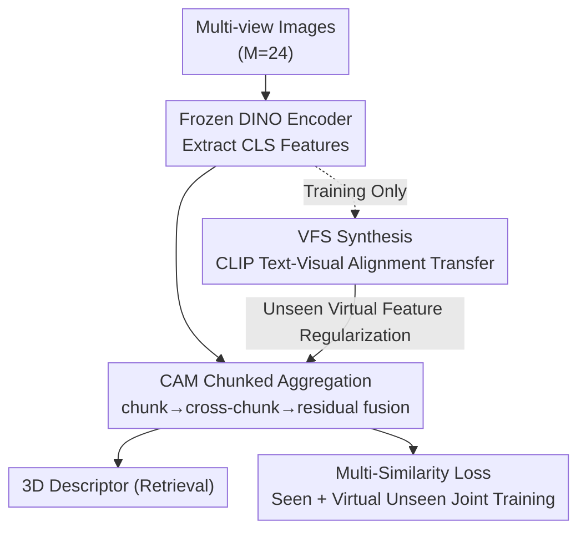

# DINO Eats CLIP: Adapting Beyond Knowns for Open-set 3D Object Retrieval

**Conference**: CVPR 2026  
**arXiv**: [2604.19432](https://arxiv.org/abs/2604.19432)  
**Code**: To be confirmed  
**Area**: 3D Vision / Multi-view Retrieval  
**Keywords**: Open-set 3D Object Retrieval, DINO Self-supervision, Multi-view Aggregation, CLIP Semantic Transfer, Virtual Feature Regularization

## TL;DR
The view encoder for open-set 3D object retrieval (open-set 3DOR) is switched from CLIP to self-supervised DINO. A lightweight "chunked aggregation" adapter (CAM) is employed to integrate local multi-view relationships, while a Virtual Feature Synthesis (VFS) module utilizes CLIP text-visual alignment to generate unseen class virtual features for regularization. Using only uni-modal visual features, this approach outperforms bi-modal CLIP-based methods across four standard benchmarks.

## Background & Motivation
**Background**: 3D object retrieval (3DOR) is traditionally a closed-set task where training and testing share the same label space. Real-world scenarios require models to produce discriminative representations for categories unseen during training. Consequently, research shifted toward open-set 3DOR: training on a small set of seen classes and generalizing to completely non-overlapping unseen classes. Prevailing methods feed multi-view images into visual foundation models, most commonly adapting CLIP encoders to build view-based 3D descriptors.

**Limitations of Prior Work**: While CLIP's global image-text alignment provides strong generalization, it suffers from **insufficient fine-grained detail**. It learns global alignment rather than subtle structural differences (e.g., distinguishing mechanical parts in OS-ESB-core based on high-genus structures). Moreover, existing CLIP-based methods (CLIP-AdaM, DAC) depend on text modalities or MLLM-generated descriptions during inference, which is neither scalable nor efficient. Other paths like HGM2R stack point clouds, voxels, and views, but require multiple modality-specific backbones, leading to a cumbersome framework.

**Key Challenge**: The fundamental difficulty in open-set 3DOR is **overfitting caused by data scarcity**. With very few seen categories, models easily overfit to the "average view patterns" of known classes, losing discriminative power for unseen classes. The fine-grained limitations of CLIP further restrict the upper bound of view features.

**Goal**: (1) Identify a view encoder better at capturing local details than CLIP; (2) Design a multi-view aggregation method that avoids overfitting to seen class average patterns; (3) Explicitly mitigate bias toward known classes without using any unseen data.

**Key Insight**: It is observed that self-supervised DINO naturally captures both local details and global structures, making it a more robust and generalizable source for view features. A notable finding: **simply mean-pooling frozen DINO multi-view features outperforms all state-of-the-art CLIP methods in a zero-shot setting** (refer to Table 1). However, direct fine-tuning leads to severe overfitting to seen view patterns.

**Core Idea**: DINO replaces CLIP as the backbone view encoder ("DINO Eats CLIP"), but CLIP is retained as a "bridge" connecting seen and unseen semantics. A chunked adapter prevents pooling-induced overfitting, and CLIP alignment is used to synthesize unseen virtual features for regularization.

## Method

### Overall Architecture
The input to DEC consists of $M$ projected multi-view images of a 3D object ($M=24$ in experiments), and the output is a compact view-based 3D descriptor for retrieval. The pipeline consists of two paths: the **Main Path** uses a frozen DINO to extract `[CLS]` global features for each view, which are then aggregated into a $d$-dimensional descriptor via the CAM adapter. The **Regularization Path** (VFS, training only) leverages CLIP's image-text alignment space to synthesize virtual visual features for unseen categories. VFS forces CAM to distinguish these virtual unseen classes, preventing overfitting to known classes. Both paths are trained jointly via end-to-end metric learning. Only the main path is used during inference, incurring zero extra overhead from VFS.

### Key Designs

**1. Replacing CLIP with DINO: Switching backbones from alignment-based to self-supervised**

The global image-text alignment in CLIP sacrifices fine-grained details. The authors replace it with frozen DINO (testing DINOv2/DINOv3 B/L variants), taking the $d$-dimensional `[CLS]` token as the global view feature $\mathbf{f}_m = \mathcal{F}_\text{frozen}(\mathbf{I}_m)$. DINO provides category-agnostic robust features and encodes both global and local cues, which is critical for generalizing to new classes. Preliminary experiments show its zero-shot performance alone is superior to CLIP-based methods. This is not a simple swap—it delegates fine-grained structural capture to a model specifically designed for it.

**2. CAM (Chunking and Adapting Module): Divide-and-conquer local aggregation**

Direct mean-pooling discards local relationships between views and overfits to "salient views" of seen classes. CAM decomposes aggregation into three steps. **Local Chunked Aggregation**: The view sequence $[\mathbf{f}_1,\dots,\mathbf{f}_M]$ is split into $K$ non-overlapping chunks. Each chunk of $k_w=\lceil M/K\rceil$ consecutive views is processed by a shared linear layer (implemented as a 1D convolution, CBR block: Conv1D + BN + ReLU) to obtain chunk features $[\mathbf{g}_1,\dots,\mathbf{g}_K]=\mathtt{CBR}([\mathbf{f}_1,\dots,\mathbf{f}_M])$. **Cross-chunk Integration**: Param-free 1D pooling is applied to capture long-range view dependencies. Multiple CBR + Pool blocks are stacked to expand the receptive field into a global representation $\mathbf{g}_\text{adpt}$. **Weighted Residual Fusion**: To preserve pre-trained knowledge while absorbing adapted knowledge: $\mathbf{g}_\text{final}=\lambda\cdot\mathbf{f}_\text{gap}+(1-\lambda)\cdot\mathbf{g}_\text{adpt}$, where $\mathbf{f}_\text{gap}$ is the result of global average pooling on raw DINO features.

**3. VFS (Virtual Feature Synthesis): Synthesizing unseen classes via CLIP alignment**

Without unseen data, CAM still risks overfitting to known classes. VFS leverages the insight that **semantic relationships between categories in CLIP's text space are preserved equidistantly in the visual space**. VFS transfers the "seen→unseen semantic direction" from the text modality to the visual modality. Specifically: $E$ unseen concepts $\mathcal{Y}_\text{new}$ are sampled from a predefined vocabulary (e.g., ImageNet 1k) after filtering out seen labels. In the CLIP visual space, a seen feature is shifted along the semantic direction pointing toward an unseen class:
$$\overline{\mathbf{v}}^u_m=\psi\big[\overline{\mathbf{f}}_m^i+\epsilon\cdot\mathtt{LN}(\overline{\mathbf{y}}^u-\overline{\mathbf{y}}^i)\big]$$
where $\overline{\mathbf{y}}^u-\overline{\mathbf{y}}^i$ is the semantic direction, $\epsilon$ is a learnable scale, and $\psi$ projects the result to the DINO space. These virtual features force CAM to learn discriminative boundaries beyond known categories.

### Loss & Training
The model uses the multi-similarity loss [41] to pull positive samples closer and push negative samples (including synthesized unseen samples) further apart. Implementation: 24 views at $256\times256$; CBR blocks with kernel/stride=3; VFS uses CLIP ViT-B/16; SGD optimizer (momentum 0.9, weight decay $5\times10^{-4}$); adapter LR $1\times10^{-3}$; training for 70 epochs on a single RTX 4090.

## Key Experimental Results

### Main Results
Evaluated on four open-set 3DOR benchmarks (OS-ESB/NTU/MN40/ABO-core) using mAP↑, NDCG↑, and ANMRR↓. Below is a comparison of mAP (%):

| Setting | Method (Backbone) | Modality | OS-ESB | OS-NTU | OS-MN40 | OS-ABO |
|------|------|------|------|------|------|------|
| Zero-shot | CLIP-AdaM (ViT-L/14) | I.,T. | 54.69 | 57.28 | 55.01 | 57.29 |
| Zero-shot | **DEC baseline (DINOv3 ViT-L/16)** | I. | 61.44 | 66.34 | 68.18 | 67.02 |
| Open-set | DAC (CLIP ViT-B/32) | I.,T. | 58.70 | 59.21 | 62.40 | 66.10 |
| Open-set | **DEC (DINOv2 ViT-B/14)** | I. | 61.82 | 61.56 | 67.62 | 65.04 |
| Open-set | DAC (CLIP ViT-L/14) | I.,T. | 57.80 | 65.83 | 68.98 | 70.74 |
| Open-set | **DEC (DINOv3 ViT-L/16)** | I. | 62.75 | 67.75 | 72.15 | 70.96 |

Ours (DINOv3 ViT-L/16) reaches 72.15% mAP on OS-MN40, significantly outperforming DAC (68.98%) despite DAC's use of multi-modal information. Notably, the zero-shot DINO baseline alone outperforms all previous open-set methods that require training.

### Ablation Study
Ablation on OS-MN40-core (DINOv2 ViT-B/14):

| Config | mAP↑ | NDCG↑ | ANMRR↓ |
|------|------|------|------|
| MLP baseline (mean-pool + 3-layer MLP) | 63.49 | 75.02 | 38.86 |
| + CAM | 66.43 | 76.80 | 37.95 |
| + CAM + VFS (Full) | 67.62 | 77.67 | 34.95 |

### Key Findings
- **VFS primarily improves ANMRR**: A drop from 37.95 to 34.95 suggests synthesized unseen features significantly improve the quality of retrieval ranking and discriminative boundaries.
- **Chunk Size Sensitivity**: A chunk size of 3 is the sweet spot; sizes 1 or 7 significantly degrade performance, validating the importance of a proper local receptive field in CAM.
- **Random Unseen Concepts**: Randomly sampling $E$ concepts is more robust than selecting "Top-E" similar concepts, as semantic diversity provides better regularization.

## Highlights & Insights
- **Zero-shot DINO Power**: The discovery that mean-pooled DINO outperforms trained CLIP methods suggests the field previously over-prioritized semantic alignment over fine-grained local features.
- **Refining CLIP's Role**: Instead of a backbone, CLIP is used as a "semantic bridge" for transfer. This avoids CLIP's lack of fine-grained detail while exploiting its superior generalization in semantic spaces.
- **VFS Generalization**: The "semantic direction shift + projection" paradigm for data synthesis is applicable to other data-scarce open-set tasks.
- **Efficient Engineering**: Implementing chunked aggregation via 1D convolution with specific kernel/stride settings is elegant, parameter-efficient, and effective.

## Limitations & Future Work
- **Vocabulary Dependence**: VFS relies on the quality of the external vocabulary (ImageNet 1k). If the target domain has zero overlap or semantic gap with this vocabulary, synthesis quality may suffer.
- **Strong Theoretical Assumptions**: The equidistant preservation of CLIP spaces is idealized; actual biases in long-tail concepts remain unquantified.
- **Cross-dataset Gap**: In extreme domain shifts (OS-MN40→OS-ABO), ours is slightly behind DAC with MLLM, suggesting a benefit to lightweight semantic guidance.
- **View-based Restriction**: The method is validated only on 24-view rendered projections; its performance on raw point clouds or sparse views is untested.

## Related Work & Insights
- **vs HGM2R**: HGM2R uses multiple heavy backbones for different modalities. Ours is uni-modal, lighter, and more accurate.
- **vs DAC / CLIP-AdaM**: These rely on CLIP as the primary backbone and require text/MLLM during inference. Ours uses DINO and is purely visual at test time.
- **vs VOS (Out-of-Distribution)**: Traditional OOD approaches treat all unseen classes as a single "unknown" cluster. VFS synthesizes distinct features for **specific unseen categories**, enabling better classification boundaries.

## Rating
- Novelty: ⭐⭐⭐⭐⭐ (The shift from CLIP to DINO and the role of CLIP as a semantic bridge is a strong reversal of current trends.)
- Experimental Thoroughness: ⭐⭐⭐⭐ (Solid results across benchmarks and DINO variants, though limited to projected view settings.)
- Writing Quality: ⭐⭐⭐⭐ (Clear motivation and sound theoretical analysis.)
- Value: ⭐⭐⭐⭐⭐ (Significant SOTA improvement with a simpler uni-modal scheme; VFS paradigm is highly transferable.)

<!-- RELATED:START -->

## Related Papers

- [\[ICCV 2025\] Describe, Adapt and Combine: Empowering CLIP Encoders for Open-set 3D Object Retrieval](../../ICCV2025/3d_vision/describe_adapt_and_combine_empowering_clip_encoders_for_open-set_3d_object_retri.md)
- [\[CVPR 2026\] Beyond Reassembly: Fractured Object Recovery with Missing Parts](beyond_reassembly_fractured_object_recovery_with_missing_parts.md)
- [\[CVPR 2026\] SceneMaker: Open-set 3D Scene Generation with Decoupled De-occlusion and Pose Estimation Model](scenemaker_open-set_3d_scene_generation_with_decoupled_de-occlusion_and_pose_est.md)
- [\[CVPR 2026\] BEA-GS: BEyond RAdiance Supervision in 3DGS for Precise Object Extraction](bea-gs_beyond_radiance_supervision_in_3dgs_for_precise_object_extraction.md)
- [\[AAAI 2026\] CLIPPan: Adapting CLIP as A Supervisor for Unsupervised Pansharpening](../../AAAI2026/3d_vision/clippan_adapting_clip_as_a_supervisor_for_unsupervised_pansharpening.md)

<!-- RELATED:END -->
