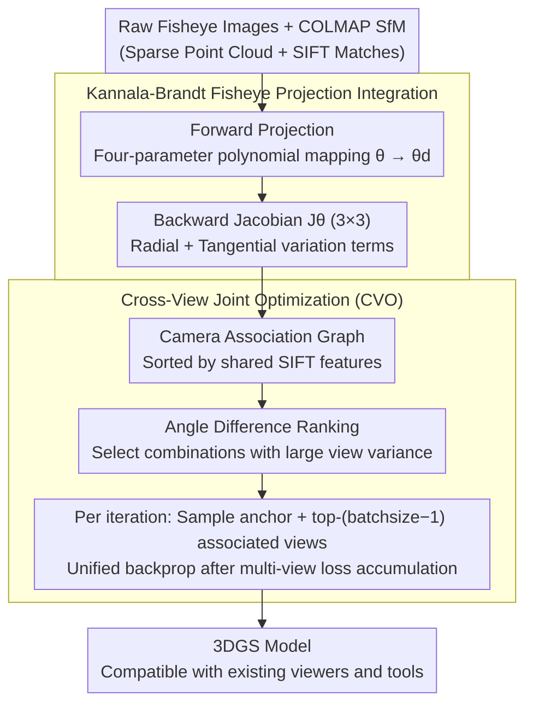

# DirectFisheye-GS: Enabling Native Fisheye Input in Gaussian Splatting with Cross-View Joint Optimization

**Conference**: CVPR 2026  
**arXiv**: [2604.00648](https://arxiv.org/abs/2604.00648)  
**Code**: None  
**Area**: 3D Vision / Novel View Synthesis  
**Keywords**: 3D Gaussian Splatting, Fisheye Camera, Cross-view Joint Optimization, Novel View Synthesis, Kannala-Brandt Model

## TL;DR

This paper natively integrates the Kannala-Brandt fisheye projection model into the 3DGS pipeline and proposes a cross-view joint optimization strategy based on feature overlap. This approach avoids the information loss inherent in pre-rectification and achieves or exceeds SOTA performance on multiple public datasets.

## Background & Motivation

3D Gaussian Splatting (3DGS) has achieved breakthrough progress in novel view synthesis, but its core relies on the rasterization of the pinhole camera model, making it unable to directly process nonlinear distorted images from fisheye cameras. Fisheye cameras are widely used in autonomous driving, robotics, and VR/AR due to their ultra-wide Field of View (>90°, commonly 120°-180°).

Two main **Limitations of Prior Work**:

**Information Loss during Pre-rectification**: Converting fisheye images to pinhole images causes peripheral areas to be cropped or stretched via interpolation, diluting high-frequency details. 3DGS tends to overfit these low-frequency regions, resulting in blur and floater artifacts.

**Geometric Inconsistency in Single-View Optimization**: Even when fisheye projection is correctly modeled, the original 3DGS strategy of single-view random sampling ignores the correlation of the same Gaussian across different views. Areas with severe peripheral distortion are particularly prone to creating excessively large or elongated Gaussians, leading to degraded reconstruction quality.

Limitations of existing fisheye 3DGS methods:
- **Fisheye-GS**: Still requires pre-processing into equidistant projections and cannot use raw fisheye images directly.
- **3DGUT**: Uses Unscented Transform to approximate projection with only 7 sigma points, which lacks precision in high-distortion areas and breaks the fully explicit architecture of 3DGS.
- **Self-Cali-GS**: Learns deformation fields through neural networks, leading to slow convergence and loss of high-frequency details.

## Method

### Overall Architecture

DirectFisheye-GS aims to solve the problem where 3DGS natively only recognizes pinhole cameras. The method consists of two steps: first, integrating the real projection laws of fisheye lenses into the 3DGS forward rendering and backward gradients so each Gaussian is projected to pixels in a fisheye manner; second, replacing the original "one view at a time" random sampling with a joint optimization of related views to force consistency for the same Gaussian across multiple images. Simple projection ensures it is "projected correctly," while joint optimization ensures the "stable optimization," preventing failure in peripheral regions.

### Key Designs

**1. Kannala-Brandt Fisheye Projection Integration: Rendering with distortion instead of rectifying images**

The conventional approach rectifies fisheye images into pinhole images before feeding them to 3DGS. However, rectification crops or stretches peripheral pixels, diluting high-frequency details; 3DGS then overfits these smoothed low-frequency regions, leaving blur and floater artifacts. This paper builds the actual fisheye projection curve directly into the rendering. Specifically, given a 3D point $\mu_{cam} = (x_c, y_c, z_c)^T$ in camera coordinates, it first calculates the incident angle $\theta$ relative to the optical axis, then uses a four-parameter polynomial to map it to the actual imaging angle: $\theta_d = \theta + k_1\theta^3 + k_2\theta^5 + k_3\theta^7 + k_4\theta^9$. This Kannala-Brandt model is high-order enough to fit nonlinear distortion in 120°-180° wide-angle lenses without edge distortion seen in equidistant projections. Furthermore, the paper derives the full Jacobian $\mathbf{J}_\theta \in \mathbb{R}^{3\times3}$ for this projection chain, consisting of radial (related to $\theta_d'$) and tangential (related to $\theta_d/d$) parts. This ensures the pipeline remains purely analytical and rasterization-based, without involving neural networks or sampling approximations, and the resulting Gaussians can be opened by standard 3DGS viewers.

**2. Cross-View Joint Optimization (CVO): Constraining Gaussians with multiple related views**

Even with correct projection, the "randomly sample one image per iteration" strategy of 3DGS is problematic: it assumes views are independent, ignoring that a Gaussian appears in multiple views. In highly distorted image edges, Gaussians without cross-constraints are pulled into large, elongated shapes. CVO groups views that see the same region but from different perspectives. It reuses feature matches from COLMAP SfM, ranking adjacent cameras by the number of shared SIFT features to build a camera association graph. It then sorts pairs in the graph by pose angle difference in descending order to select combinations with large viewpoint variance. During training, it samples one anchor view and the top-(batchsize-1) associated cameras, accumulating their losses for a single backpropagation. Feature overlap ensures the views constrain the same Gaussians, while angle variance ensures constraints come from different directions, fixing the shape and color of peripheral Gaussians for cross-view consistency. This strategy is camera-model agnostic and introduces almost no overhead as it uses existing SfM results.

### Loss & Training

- The loss function follows the standard 3DGS setting: $L_k = L_1(I_k, \hat{I}_k) + \lambda \text{SSIM}(I_k, \hat{I}_k)$
- Multi-view loss accumulation: $L_{total} = \sum_{k} L_k$, followed by a unified backpropagation to update Gaussian parameters.
- Batch size is set to 2 by default (anchor view + 1 associated view).
- All experiments were performed on a single NVIDIA A100 80GB.

## Key Experimental Results

### Main Results

**FisheyeNeRF Dataset** (6 object-level small scenes, training views):

| Method | SSIM ↑ | PSNR ↑ | LPIPS ↓ |
|------|--------|--------|---------|
| 3DGS (Direct Fisheye Input) | 0.6124 | 18.85 | 0.5228 |
| 3DGS* (Rectified) | 0.8240 | 25.54 | 0.2431 |
| Fisheye-GS | 0.8183 | 25.18 | 0.2658 |
| 3DGUT | 0.8020 | 25.28 | 0.3290 |
| Self-Cali-GS | 0.7460 | 24.01 | 0.4507 |
| **Ours** | **0.8284** | **26.25** | **0.2295** |

**Scannet++ Dataset** (6 medium-scale indoor scenes, test views): The method is optimal or second-best among all baselines.

**Den-SOFT Dataset** (Large-scale outdoor scenes): Significantly outperforms other methods on outdoor scenes like Ruziniu, as outdoor scenes have larger lighting variations and rich details.

### Ablation Study

| Configuration | Description |
|------|------|
| Original 3DGS + Fisheye | Complete failure, SSIM only 0.61. |
| 3DGS + Rectification | Acceptable but loses peripheral information. |
| Fisheye Projection Model alone | Effective, but peripheral areas still have floater artifacts. |
| Fisheye Projection + CVO | Significant reduction in peripheral artifacts, improved global illumination consistency. |

### Key Findings

- Even with a correct fisheye camera model, single-view optimization still produces floater Gaussians at image edges—**cross-view constraints are necessary**.
- The CVO strategy is not only applicable to fisheye cameras but can also improve the reconstruction quality of traditional pinhole camera pipelines.
- 3DGUT is close to this method in indoor scenes but shows a significant gap in unbounded outdoor scenes—its strong illumination modeling causes discontinuous artifacts.
- Fisheye-GS shows a sharp decline in quality at image edges because its equidistant projection model is overly simplified.
- Although training after rectification is feasible, the proposed method is superior or equal across all metrics, proving the advantage of direct input.

## Highlights & Insights

1. **High Engineering Completeness**: It not only derives the Jacobian for fisheye projection (Eq.7, full 3×3 matrix) but also maintains full compatibility with original 3DGS viewers, which is highly valuable for deployment.
2. **Universality of CVO**: The cross-view joint optimization strategy is based on existing SfM feature matching, incurs no additional computational cost, and is universal to any camera model.
3. **Precise Problem Diagnosis**: It clearly points out that "even if the camera model is correct, insufficient optimization leads to extreme Gaussian shapes," and solves this from both geometric and photometric consistency perspectives.
4. **Efficient and Practical**: Effective with a batchsize of 2, with minimal increase in training cost.

## Limitations & Future Work

1. Batchsize in CVO is fixed at 2; whether a larger batch can further improve performance has not been fully explored.
2. Relies on COLMAP for feature matching as the basis for the association graph—CVO effectiveness may be limited if SfM quality is poor.
3. Validated only on the Kannala-Brandt model; scalability to other nonlinear camera models (e.g., omnidirectional) remains to be verified.
4. The paper does not discuss training time comparison with original 3DGS (though it mentions batchsize=2 increases rendering volume).

## Related Work & Insights

- **MVGS**: One of the first to explore multi-view training, but it randomly samples view subsets and lacks geometric correlation.
- **3DGUT**: Handles nonlinear projection via Unscented Transform, representing an alternative approach (sampling approximation vs. analytical derivation).
- **Scaffold-GS / Compact3DGS**: Works optimizing 3DGS data structures and memory, which are orthogonal to this method.
- **Insight**: The single-view optimization paradigm of 3DGS is inherently flawed; cross-view consistency constraints should become a standard component.

## Rating

- Novelty: ⭐⭐⭐⭐ — Fisheye projection integration is an engineering innovation; CVO is a methodological contribution.
- Experimental Thoroughness: ⭐⭐⭐⭐⭐ — Three datasets, comprehensive comparisons, and analysis of training/test views.
- Writing Quality: ⭐⭐⭐⭐ — Clear structure and precise problem definition.
- Value: ⭐⭐⭐⭐ — High direct applicability to VR/AR and autonomous driving scenarios.

<!-- RELATED:START -->

## Related Papers

- [\[CVPR 2026\] Faster-GS: Analyzing and Improving Gaussian Splatting Optimization](faster-gs_analyzing_and_improving_gaussian_splatting_optimization.md)
- [\[CVPR 2026\] DropAnSH-GS: Dropping Anchor and Spherical Harmonics for Sparse-view Gaussian Splatting](dropping_anchor_and_spherical_harmonics_for_sparse-view_gaussian_splatting.md)
- [\[CVPR 2026\] GS²: Graph-based Spatial Distribution Optimization for Compact 3D Gaussian Splatting](gs2_graph-based_spatial_distribution_optimization_for_compact_3d_gaussian_splatt.md)
- [\[CVPR 2026\] Intrinsic Geometry-Appearance Consistency Optimization for Sparse-View Gaussian Splatting](intrinsic_geometry-appearance_consistency_optimization_for_sparse-view_gaussian_.md)
- [\[CVPR 2026\] Plug-and-Play PDE Optimization for 3D Gaussian Splatting: Toward High-Quality Rendering and Reconstruction](plug-and-play_pde_optimization_for_3d_gaussian_splatting_toward_high-quality_ren.md)

<!-- RELATED:END -->
