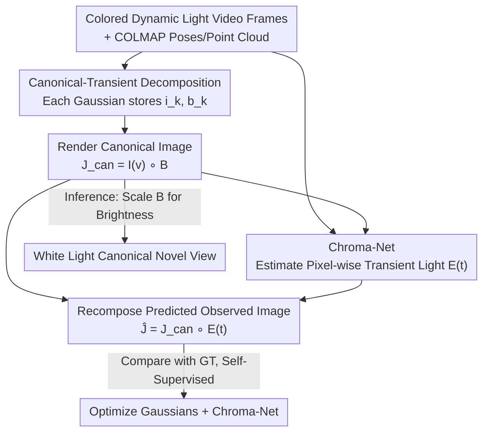

# Disco-GS: Gaussian Splatting in Dynamic Color Lighting

**Conference**: CVPR 2026  
**Paper**: [CVF Open Access](https://openaccess.thecvf.com/content/CVPR2026/html/Kumar_Disco-GS_Gaussian_Splatting_in_Dynamic_Color_Lighting_CVPR_2026_paper.html)  
**Code**: https://github.com/akumar005/Disco-GS  
**Area**: 3D Vision  
**Keywords**: Gaussian Splatting, Novel View Synthesis, Intrinsic Appearance Recovery, Dynamic Color Lighting, Self-Supervised  

## TL;DR
Disco-GS uses a single-stage, end-to-end Gaussian Splatting framework to simultaneously reconstruct 3D scene geometry, recover the canonical appearance of objects under white light, and support free brightness adjustment at inference time, all from videos captured under "disco lighting" (color lighting changing randomly over time).

## Background & Motivation
**Background**: 3D scene representations represented by 3D Gaussian Splatting (3DGS) and NeRF can reconstruct high-quality geometry and synthesize photorealistic novel views, but the vast majority of methods assume that the training inputs are captured under **stable, achromatic lighting**.

**Limitations of Prior Work**: Real-world scenes like concerts, stages, light shows, and installation art exhibit drastic, sudden, or even random variations in color and intensity (termed "disco lights" by the authors). This brings several critical ambiguities: the appearance of the same surface varies significantly across frames/views, leading to the failure of photometric consistency; lighting changes are abrupt and potentially synchronized with music, violating temporal smoothness assumptions; the non-linear coupling of colored light and material/albedo leads to content loss and visibility blurring (e.g., text being nearly invisible under red light); and specular reflections further exacerbate these issues. Naive GS under such inputs suffers from color hallucination, inconsistent appearance, and poor generalization to novel views.

**Key Challenge**: Under colored, dynamic lighting, **scene geometry and canonical appearance are heavily entangled with exogenous transient colored lights**—with neither color priors nor color masks available, the model cannot distinguish whether the color of a specific spot belongs to the object itself or is projected by the light.

**Goal**: Decompose the problem into three sub-tasks: (i) recovering the canonical scene appearance under dynamic colored lighting; (ii) synthesizing views that are consistent across perspectives without flickering or color cast; (iii) preserving scene geometry.

**Key Insight**: The few existing works on "reconstructing canonical scenes from unconstrained inputs" mostly target **outdoor** scenarios (where lighting changes are driven by environmental factors like sky color, clouds, weather, and time of day), and often require test-time optimization or relighting diffusion models; they fail under indoor artificial color lighting, which is **highly dominant, highly localized, and highly dynamic**. The authors assume: observed image = canonical image $\circ$ a pixel-wise "effective transient light", which allows constructing a self-supervised framework from this generative assumption.

**Core Idea**: Assign additional "canonical color" and "brightness control" attributes to each Gaussian to render canonical images, and estimate pixel-wise transient colored lights using a lightweight CNN (Chroma-Net). The canonical image is then "re-colored" back to the observed image for self-supervised training—achieving a single-stage framework without any color priors.

## Method

### Overall Architecture
The input is a static scene video $\{J_j(v,t)\}_{j=1}^N$ captured by a moving camera under a fixed colored light source (randomly changing colors), along with camera poses and a sparse point cloud obtained from COLMAP. The output is the scene's canonical 3D representation under white light, which supports rendering view-consistent novel views and free brightness adjustment. The core of the pipeline is a closed loop of "decomposition-recomposition-self-supervision": Gaussians render the **canonical image** $J_\text{can}(v)$, Chroma-Net estimates the **transient light** $E(t)$, and the two are multiplied to reconstruct the **predicted colored observed image** $\hat{J}(v,t)$, which is compared against the ground-truth observed image to compute losses. This process is single-stage and end-to-end, without relying on priors of color values, ambient light, or scene attributes. Crucially, Chroma-Net is only used during training to provide self-supervision and is discarded during inference, maintaining real-time rendering at ~70 FPS.

### Key Designs

**1. Canonical-Transient Decomposition + Dual-Attribute Gaussians: Separating Object Color from Incident Light**

Direct rendering with 3DGS bakes colored lighting into the Gaussian color attributes, entangling canonical appearance with illumination. Disco-GS assumes that the observed image is transformed from the canonical image via pixel-wise transient lighting:

$$\hat{J}(v,t) = J_\text{can}(v) \circ E(t)$$

where $\circ$ denotes the Hadamard product, and $E(t)\in\mathbb{R}^{H\times W\times3}$ is the pixel-wise multiplicative transient lighting (without modeling physical light source positions). The canonical image is further decomposed as $J_\text{can}(v) = I(v) \circ B$, where $I(v)$ is the canonical color and $B\in\mathbb{R}^{H\times W}$ (three channels share the same value) is the controllable brightness factor. To enable this rendering, the authors append two additional features to the standard Gaussian attributes $\{\mu_k, R_k, S_k, o_k\}$: a canonical feature $i_k\in\mathbb{R}^3$ (encoded using SH bases to handle view-dependency) and a brightness control feature $b_k\in\mathbb{R}$, yielding $G_k=\{\mu_k,R_k,S_k,o_k,i_k,b_k\}$. These are rendered to construct $I(v)$ and $B$ respectively, using the same alpha-blending formulation as the original colors:

$$[I(v)]_p = \sum_{k\in\mathcal{N}(p)} T_k\,\alpha_k\,i_k, \qquad [B]_p = \sum_{k\in\mathcal{N}(p)} T_k\,\alpha_k\,b_k$$

Thus, the geometry ($\mu,R,S,o$) is shared across all frames, isolating the color ambiguity into $E(t)$ and decoupling the canonical appearance from the dynamic illumination.

**2. Chroma-Net: Closing the Self-Supervised Loop with a Lightweight CNN**

The decomposition assumption alone is insufficient—without ground-truth canonical images, $E(t)$ cannot be estimated, making the decomposition highly underdetermined. Disco-GS proposes **Chroma-Net**: a lightweight CNN with only 3 convolutional layers. It takes the observed image $J(v,t)$ and the rendered brightness map $B$ as input, and outputs the pixel-wise transient light $E_j(t)=\text{Chroma-Net}(J_j(v,t), B_j)$. It re-infects the rendered canonical image into the "predicted observed image", making the constraint "$\hat{J}$ should equal real $J$" supervisable, thereby closing the self-supervision loop. The network is very small: the first two convolutional layers are configured as $(4,8,5,2)$ and $(8,8,3,1)$, each followed by GroupNorm + ELU. The final layer is $(8,3,1,1)$ followed by Sigmoid to restrict the output to $[0,1]$, while inputs are normalized to $[-1,1]$ using tanh. The design intuition stems from human vision—given an image affected by colored light and a reference image, humans can infer which regions are colored based on implicit reasoning about achromatic lighting. Chroma-Net mimics this perceptual capability to isolate transient colors. Crucially, it is **only used during training for self-supervision and discarded at inference**, providing supervision signals without slowing down inference. The same network is robust to both global and localized color changes.

**3. Brightness Control Factor $B$: Stabilizing Training and Unlocking Brightness Manipulation at Inference**

While $I(v)$ could in principle be used directly as the output, the authors introduce an explicit brightness factor $B$ for two reasons. First, **controllability**: $J_\text{can}=I(v)\circ B$ isolates brightness from color. During inference, simply scaling $B$ (the paper demonstrates a series of results with $\alpha=0.1\!\sim\!1.8$) enables simulating scenarios from low-light to well-lit without artifacts or structure destruction, serving applications like low-light/normal-light simulation. Second, **preventing leakage and stabilizing training**: restricting brightness/intensity information to $B$ prevents the chromaticity and intensity information of $E(t)$ from leaking into $I(v)$, ensuring view-consistent colors while improving convergence and stabilizing training. The accompanying brightness regularization (see below) uses an $11\times11$ mean blur to constrain $B$ near 0.5, ensuring it carries coarse scene details rather than high-frequency content.

### Loss & Training
Self-supervised canonical scene recovery is an ill-posed problem. The authors constrain it using a set of carefully designed regularizations along with the primary photometric loss. The total loss is:

$$\mathcal{L} = \mathcal{L}_\text{photo} + \lambda_1\mathcal{L}_\text{st} + \lambda_2\mathcal{L}_\text{amb} + \lambda_3\mathcal{L}_\text{col} + \lambda_4\mathcal{L}_\text{tv}$$

- **Photometric Loss** $\mathcal{L}_\text{photo}=\|J(v,t)-\hat{J}(v,t)\|_1$: enforces consistency between the recomposed and actual observed images, serving as the primary self-supervision signal.
- **SSIM Loss** $\mathcal{L}_\text{st}=1-\text{SSIM}(J^\eta(v,t),J_\text{can}^\eta(v))$: maintains structural consistency between the canonical and observed images; the exponent $\eta$ (exponentially decayed from 0.95 to 0.5) avoids color leakage into $J_\text{can}$.
- **Color Regularization** $\mathcal{L}_\text{col}=\sum_{(p,q)\in\gamma}(\bar{J}_\text{can}(v)_p-\bar{J}_\text{can}(v)_q)^2$, where $\gamma=\{(R,G),(G,B),(B,R)\}$: constrains the mean of the canonical channels to be close, suppressing color casts (e.g., pink tint).
- **Brightness Regularization** $\mathcal{L}_\text{amb}=\|g(B)-0.5\|_1$ (where $g$ is a blur): constrains the blurred $B$ to a neutral brightness of 0.5.
- **Total Variation Loss** $\mathcal{L}_\text{tv}=\|\nabla_xE(t)\|_1+\|\nabla_yE(t)\|_1$: encourages spatial smoothness of the transient light $E(t)$.

Hyperparameters are set to $\lambda_{1,2,3,4}=1.0, 0.5, 0.8, 0.001$. Implemented based on 3DGS with 3 SH bands and a batch size of 2. Each scene is trained for 14,000 iterations using the Adam optimizer. Point cloud RGB is used to initialize band-0 SH for canonical features, and $b_k$ is initialized to 0.5. Training takes about 66 minutes on a single RTX 3090 card, and inference runs at ~70 FPS ($800\times450$).

## Key Experimental Results

### Main Results
Evaluations on 6 scenes in the self-built Disco dataset against 3DGS, Wild-Gaussians, Gaussians-Wild, and RNG (PSNR↑/SSIM↑/LPIPS↓). Disco-GS consistently achieves the best performance across almost all metrics, especially in highly colored scenes such as 2D-Artwork and Mini-library, where it significantly outperforms baselines.

| Scene | Metric | Disco-GS | 3DGS | Gaussians-Wild | Wild-Gaussians |
|------|------|----------|------|----------------|----------------|
| Newspaper-room | PSNR | **24.38** | 19.90 | 21.03 | 22.85 |
| 2D-Artwork | PSNR | **22.24** | 12.52 | 20.90 | 7.71 |
| 3D-Artwork | PSNR | **26.11** | 24.63 | 19.47 | 21.18 |
| Casual | PSNR | **23.52** | 21.86 | 8.08 | 6.64 |
| Books | PSNR | **22.93** | 19.95 | 16.19 | 17.48 |
| Mini-library | PSNR | **19.90** | 14.44 | 14.02 | 8.33 |

> *Note*: Outdoor intrinsic recovery methods like Wild-Gaussians / Gaussians-Wild are highly unstable under indoor artificial colored lighting (with PSNR dropping to single digits on 2D-Artwork and Casual), and RNG (relightable GS) fails almost entirely (PSNR mostly around 6~7), validating the hypothesis that outdoor methods do not transfer well to disco lighting.

### Ablation Study
Ablation results of systematically removing loss components across 6 scenes (PSNR↑/SSIM↑/LPIPS↓):

| Configuration | PSNR | SSIM | LPIPS | Description |
|------|------|------|-------|------|
| Only $\mathcal{L}_\text{photo}$ | 11.76 | 0.51 | 0.72 | Reconstruction fails without constraints on components |
| Only $\mathcal{L}_\text{photo}+\mathcal{L}_\text{st}$ | 18.97 | 0.81 | 0.29 | Insufficient constraints on $B$ and $J_\text{amb}$ lead to artifacts |
| W/o $\mathcal{L}_\text{st}$ | 10.63 | 0.39 | 0.76 | Canonical image loses scene structure, synthesis fails |
| $\eta=1$ in $\mathcal{L}_\text{st}$ | 18.58 | 0.80 | 0.21 | Overall dark, with color/structural artifacts |
| W/o $\mathcal{L}_\text{col}$ | 19.37 | 0.81 | 0.32 | mini-library fails to reconstruct, kitchen has a pink cast |
| W/o $\mathcal{L}_\text{tv}$ | 20.24 | 0.85 | 0.19 | Unsmooth spatial variation of $E(t)$, violating the smoothness prior |
| W/o $\mathcal{L}_\text{amb}$ | 20.64 | 0.85 | 0.19 | $B$ out of control, causing dark spots and color casts |
| Direct output of $I(v)$ (without $B$) | 21.03 | 0.86 | 0.19 | Reconstruction succeeds, but color artifacts exist in mini-library/wall-art |
| **Overall $\mathcal{L}$** | **21.47** | **0.86** | **0.19** | Full model achieves optimal performance |

### Key Findings
- **The SSIM structural loss $\mathcal{L}_\text{st}$ is most critical**: Removing it causes the PSNR to drop drastically from 21.47 to 10.63, as the canonical image completely loses awareness of the scene structure. The exponential decay exponent $\eta$ (0.95$\rightarrow$0.5) is also indispensable; fixing $\eta=1$ darkens the reconstruction and introduces artifacts.
- **The brightness factor $B$ serves as both a functionality and a regularization**: Removing $B$ and directly outputting $I(v)$ can still reconstruct the scene (21.03), but yields color artifacts in mini-library/wall-art. This indicates that $B$ stabilizes canonical learning, while additionally unlocking free brightness manipulation during inference.
- **Different materials respond very differently to colored lights**: Qualitative results show that black objects are least affected, while white objects are most affected. Disco-GS is the only method that stably recovers canonical appearance in complex scenes involving light sources and co-occurring black/white objects. It remains consistent under two mutually exclusive colored lights (represented in Books), whereas baselines typically fail under at least one of them.

## Highlights & Insights
- **Generative decomposition assumption turns an unsupervised problem into a supervised one**: The multiplicative assumption $\hat{J} = J_\text{can} \circ E(t)$ converts the ill-posed canonical appearance recovery without ground truth into a self-supervised constraint—this is the core pivot for the success of the entire method.
- **Chroma-Net is used only during training, incurring zero inference overhead**: Utilizing a 3-layer CNN as a "training scaffold" provides supervised signals without compromising real-time rendering speed (70 FPS), which serves as a highly practical engineering trade-off.
- **Decoupling brightness from color brings multiple benefits**: The independent $B$ channel simultaneously prevents color leakage, stabilizes training, and enables runtime brightness control. Such design of achieving multiple benefits from a single decoupling can be well borrowed by other appearance decomposition tasks.
- **A new benchmark fills the gap**: The Disco dataset (25 real videos, including global/local illumination changes, random colors, specularities, and white-light pseudo ground truth) fills the void of evaluating scene reconstruction under moving cameras and artificial color-changing lighting.

## Limitations & Future Work
- **Limited to static scenes**: The authors acknowledge that the method fails in the presence of moving objects (temporal variable $t$ is only used to denote color changes over time from the same viewpoint, rather than object motion).
- **Assumption of fixed light source positions**: Light source motion is not modeled, which limits applicability in more general dynamic illumination scenarios.
- **Limitations of pseudo ground truths**: Utilizing white-light capture as "pseudo GT" introduces approximations since real lighting changes with time, light positions, and lamp types.
- **Future improvements**: Extending the transient light from a multiplicative pixel-wise model to a physically consistent model accounting for light source positions and specularities, and integrating dynamic scene representations to support moving objects.

## Related Work & Insights
- **vs. Wild-Gaussians / Gaussians-Wild [13,35]**: Designed for unconstrained outdoor images, these methods estimate canonical components through per-image embeddings or test-time optimization, relying on relatively gentle ambient changes (sky, weather). They are unstable under dominant, highly localized indoor artificial colored light, and test-time optimization does not guarantee genuine color recovery. Disco-GS is single-stage, operates without color priors, and requires no test-time optimization.
- **vs. Outdoor Relightable GS (e.g., methods based on normal/material priors or sky-region cues [2,7,10,17])**: These work to relight scenes under new ambient light or light source positions, usually require two stages, and do not handle "colored light" during training. Disco-GS directly addresses colored light inputs for canonical recovery in an end-to-end, single-stage manner.
- **vs. Relighting Diffusion Methods [1,37]**: These harmonize variable-light inputs to a unified reference illumination before building NeRF, focusing on generating consistent illumination rather than explicitly recovering scene intrinsics. Disco-GS explicitly recovers the canonical appearance.

## Rating
- Novelty: ⭐⭐⭐⭐ The first method targeting indoor disco-like colored lighting for "reconstruction + canonical recovery"; the combination of generative decomposition and Chroma-Net self-supervision is clean and effective.
- Experimental Thoroughness: ⭐⭐⭐⭐ Extensive evaluation across 6 scenes with multiple baselines and 8 ablation studies. However, most baselines are outdoor methods that nearly collapse under indoor scenarios, making comparisons somewhat one-sided.
- Writing Quality: ⭐⭐⭐⭐ Clearly presented motivation and decomposition assumptions; the pipeline diagram integrates well with the formulas.
- Value: ⭐⭐⭐⭐ Solves a real-world, neglected setting with controllable brightness capabilities and a new benchmark dataset, demonstrating high practicality.

<!-- RELATED:START -->

## Related Papers

- [\[CVPR 2026\] SunFaded: Illumination-Aware Gaussian Splatting for Dark Scenes with Camera-Mounted Active Lighting](sunfaded_illumination-aware_gaussian_splatting_for_dark_scenes_with_camera-mount.md)
- [\[ICLR 2026\] MoE-GS: Mixture of Experts for Dynamic Gaussian Splatting](../../ICLR2026/3d_vision/moe-gs_mixture_of_experts_for_dynamic_gaussian_splatting.md)
- [\[CVPR 2026\] MSCD-GS: Motion-Separated Cooperative Deblurring Dynamic Reconstruction via Gaussian Splatting](mscd-gs_motion-separated_cooperative_deblurring_dynamic_reconstruction_via_gauss.md)
- [\[CVPR 2026\] $L^{2}DGS$: Low-Light Dynamic Gaussian Splatting](l2dgs_low-light_dynamic_gaussian_splatting.md)
- [\[CVPR 2026\] VAD-GS: Visibility-Aware Densification for 3D Gaussian Splatting in Dynamic Urban Scenes](vad-gs_visibility-aware_densification_for_3d_gaussian_splatting_in_dynamic_urban.md)

<!-- RELATED:END -->
