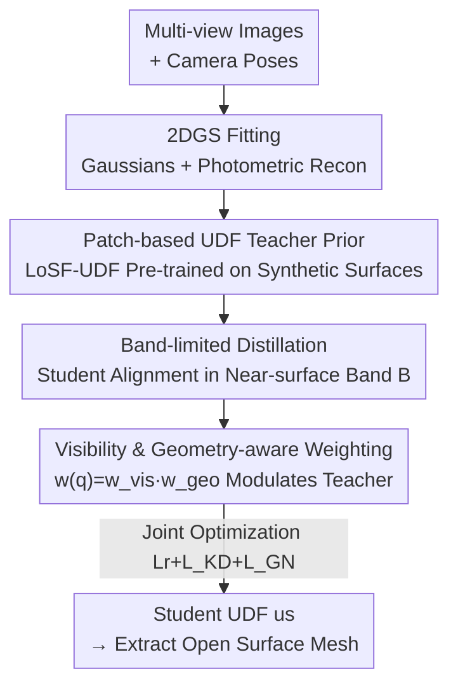

# Distilling Unsigned Distance Function for Surface Reconstruction from 3D Gaussian Splatting

**Conference**: CVPR 2026  
**Paper**: [CVF Open Access](https://openaccess.thecvf.com/content/CVPR2026/html/Li_Distilling_Unsigned_Distance_Function_for_Surface_Reconstruction_from_3D_Gaussian_CVPR_2026_paper.html)  
**Code**: None  
**Area**: 3D Vision  
**Keywords**: Unsigned Distance Function (UDF), 3D Gaussian Splatting (3DGS), Knowledge Distillation, Open Surface Reconstruction, Surface Prior  

## TL;DR
This work distills a "local patch UDF teacher" (pre-trained on synthetic algebraic surfaces) into a lightweight student UDF optimized alongside 3DGS. By employing band-limited distillation near the surface and weighting based on visibility/geometric confidence, it stably reconstructs open surfaces with boundaries and thin structures from multi-view images, achieving SOTA Chamfer Distance on DF3D and DTU.

## Background & Motivation

**Background**: Reconstructing surfaces from multi-view images typically involves learning an implicit distance field and extracting a mesh. Signed Distance Functions (SDF) combined with differentiable volume rendering (e.g., NeuS, Neuralangelo) can reconstruct fine, watertight surfaces. Recently, 3D Gaussian Splatting (3DGS), an explicit representation with real-time rasterization, has been combined with implicit surface modeling to significantly improve efficiency.

**Limitations of Prior Work**: SDFs rely on "inside/outside" sign partitioning, assuming a closed, watertight surface. This fails for shapes with boundaries, holes, thin sheets, or partial scans (e.g., clothing straps or openings). Unsigned Distance Functions (UDF) represent the distance to the surface without global signs, naturally representing open geometries. However, learning UDFs from multi-view images is much harder than learning SDFs: ① There is no ground-truth surface for supervision, requiring reliance on indirect multi-view photometric consistency sensitive to occlusion/lighting; ② The gradient of a UDF is **ill-defined exactly on the surface**, rendering regularization terms like eikonal or normal alignment (which depend on near-surface gradient smoothness) ineffective.

**Key Challenge**: Most existing UDF methods (NeRF-based are slow; 3DGS-based like GaussianUDF) use **gradient priors** to constrain the UDF when ground-truth is absent. However, since the gradient on the true surface is ill-defined, this mismatch produces noisy, biased gradients, leading to unstable training, over-smoothing, and loss of high-frequency details. GaussianUDF also lacks explicit local geometric reasoning, relies on global optimization, and converges slowly.

**Goal**: To learn an accurate, geometrically consistent UDF for open surfaces within a 3DGS framework that ensures stable training and preserves high-frequency details.

**Key Insight**: Rather than forcing unreliable gradient priors without ground-truth, it is better to switch to a **source with ground-truth**. Synthetic algebraic surfaces have closed-form distance expressions, providing precise UDF ground-truth. A local patch UDF predictor pre-trained on these surfaces is scene-agnostic and serves as a reliable "teacher."

**Core Idea**: Ours **distills** the patch-based UDF teacher (trained on synthetic surfaces) into a lightweight student UDF optimized with 3DGS. This replaces "unreliable gradient priors" with "true geometric supervision." Distillation is performed within a narrow band near the surface with band-limited alignment and modulated by visibility/geometric confidence weights to filter unreliable teacher supervision.

## Method

### Overall Architecture

Given multi-view RGB images with camera poses, the method simultaneously optimizes a set of Gaussian primitives $\{g_i\}_{i=1}^{I}$ and a student UDF $u_s$. The workflow involves fitting scene geometry/appearance using 2DGS and then distilling the UDF based on the Gaussian representation. A **frozen local shape teacher** $u_t$ (LoSF-UDF, pre-trained on synthetic algebraic surfaces) provides reliable UDF supervision within a narrow band near the surface. The student $u_s$ is aligned via distillation in this band. A confidence weight $w(q)$ turns the teacher into a "soft prior," automatically decaying its influence where rendering evidence or local geometry is unreliable. Finally, photometric reconstruction, UDF distillation, and geometric normal regularization are optimized via a joint loss. While the teacher requires "query point + local patch" for prediction, the distilled student infers UDF via a single query $u_s(q)=f_s(q)$, seamlessly integrating with standard 3DGS pipelines.

### Key Designs

**1. Patch-based UDF Teacher Prior: Replacing Unreliable Gradient Supervision with Closed-form Ground-truth**

The pain point stems from "no ground-truth surface + ill-defined surface gradients." The authors avoid forcing gradient priors in-scene and instead pre-train a patch-based UDF teacher $f_t$ (using LoSF-UDF for its noise resistance and local feature representation) on **synthetic algebraic surfaces**. UDF is defined as $f(q)=\inf_{p\in M}\lVert p-q\rVert$, the distance from query $q$ to the nearest point on surface $M$. The teacher $f_t(q\mid P)$ takes query $q=(x,y,z)$ conditioned on a local patch $P$ consisting of $K$-nearest neighbor points to predict the unsigned distance. These synthetic surfaces feature sharp characteristics generated by:

$$z = 1 - h\cdot g(x,y)$$

where $h$ controls patch sharpness and $g(x,y)$ represents patterns like creases ($\frac{\lvert ax-y\rvert}{\sqrt{1+a^2}}$), cusps ($\sqrt{x^2+y^2}$), corners ($\max(\lvert x\rvert,\lvert y\rvert)$), or v-saddles ($(\lvert x\rvert+\lvert y\rvert)\cdot(\frac{\lvert x\rvert}{x}\cdot\frac{\lvert y\rvert}{y})$). When injecting this prior into 3DGS, queries $q$ sampled around Gaussian centers $\{c_i\}$ use the $K$-NN of current Gaussians to form patch $P_i$, fetching $u_t(q)=f_t(q\mid P)$ to regularize the student. The key benefit is that the teacher is supervised by **geometric ground-truth** rather than just photometric cues, leading to more accurate targets and better generalization; the patch condition preserves high-frequency details that global supervision might smooth out.

**2. Band-limited Knowledge Distillation: Aligning Only in the Near-surface Band and Removing Teacher Drift**

To address gradient instability on the surface, distillation is not performed in the entire space. Instead, using the assumption that 3D Gaussian centers fall approximately on the surface, a narrow band $B=\bigcup_i\{c_i+t\,n_i\mid t\in[-\tau,\tau]\}$ is defined along Gaussian normals $n_i$. The distillation loss is:

$$L_{KD}=\mathbb{E}_{q\in B}\big[\,w(q)\,\ell\big(u_s(q),\,a\,u_t(q)+b\big)\big]$$

where $\ell$ is SmoothL1 with a small hinge tolerance, and $w(q)\in[0,1]$ is the confidence weight. A critical detail is the **per-scene affine calibration** $u_t'(q)=a\,u_t(q)+b$. Since the teacher's absolute scale/offset may drift across scenes, $(a,b)$ are solved via:

$$(a,b)=\arg\min_{a>0,b}\sum_{q\in B}w(q)\big(u_s(q)-a\,u_t(q)-b\big)^2$$

(treating $(a,b)$ as constants for gradients). This removes scene-level scale/offset mismatch while preserving distance order. "Band-limited + Affine Calibration" allows the model to be more stable than global distillation while recovering high-frequency details by limiting geometric complexity to local patches.

**3. Visibility and Geometry-aware Weighting: Rendering Evidence Decides Teacher Credibility**

While the teacher has strong local shape cues, it lacks rendering awareness. In 3DGS, silhouettes, depth, and photometric residuals dominate supervision, which might conflict with the teacher in occluded areas. A weight $w(q)=\mathrm{clip}\big(w_{vis}(q)\,w_{geo}(q),\,\varepsilon,1\big)$ modulates the teacher ($\varepsilon\in[10^{-3},10^{-2}]$). The **visibility factor** $w_{vis}$ suppresses pixels with cross-view inconsistencies: a 3D point $q$ is reprojected from a source view depth $z_s$ to the reference view to find $p_r'=\pi(q,z_s)$; with reprojection error $\phi(p_r)=\lVert p_r-p_r'\rVert_2$, $w_{vis}(q)=\mathbb{1}[\lVert p_r-p_r'\rVert_2<1]\exp(-\lVert p_r-p_r'\rVert_2)$. The **geometric factor** $w_{geo}$ only allows the teacher influence when its local differential geometry aligns with the student's using sign-invariant cosine similarity of normalized gradients $\hat g_t, \hat g_s$:

$$w_{geo}(q)=\exp\Big(-\tfrac{1-\lvert\hat g_t(q)\cdot\hat g_s(q)\rvert}{\tau_{grad}}\Big)$$

This importance-weighted distillation automatically reduces the weight for unreliable teacher points.

**4. Joint Optimization: Ramping Up Photometric, Distillation, and Normal Regularization**

The full objective is:

$$L=(1-\lambda_1)L_r+\lambda_1 L_{ssim}+\lambda_2 L_{Far}+\lambda_3 L_{KD}+\lambda_4 L_{GN}$$

where $L_r$ and $L_{ssim}$ are standard 2DGS losses, and $L_{Far}$ is from GaussianUDF. The geometric normal term $L_{GN}=\sum_k w_k(1-\lvert\hat g_s(k)\cdot n_k\rvert)$ penalizes Gaussians whose normals mismatch the pixel normals $n_k$ derived from depth maps. Training follows a warm-up phase $T_{warm}$ (~9000 iterations) for 2DGS alone, followed by ramping up $\lambda_{2,3,4}$ to ensure reliable Gaussian geometry before applying distillation and normal constraints.

## Key Experimental Results

### Main Results

Comparison of Chamfer Distance (CD, ×10⁻³, lower is better) and time on DF3D (12 garments, 72 views, includes thin straps/openings):

| Method | Type | DF3D Mean CD↓ | Time |
|------|------|---------------|------|
| 2DGS | SDF/Gaussian | 3.81 | 6min |
| GOF | SDF/Gaussian | 2.49 | 47min |
| NeuralUDF | UDF/NeRF | 2.15 | 8.6h |
| VRPrior | UDF | 1.71 | 9.2h |
| GaussianUDF | UDF/Gaussian | 1.60 | 1.6h |
| **Ours** | UDF/Gaussian | **1.49** | 1.8h |

Mean CD (×10⁻³) on DTU (15 standard scenes):

| Method | Type | DTU Mean CD↓ |
|------|------|--------------|
| NeuS | SDF/NeRF | 0.84 |
| 2DGS | SDF/Gaussian | 0.83 |
| G2SDF | SDF/Gaussian | 0.64 |
| GaussianUDF | UDF/Gaussian | 0.68 |
| VRPrior | UDF | 0.91 |
| **Ours** | UDF/Gaussian | **0.60** |

Ours achieves the lowest average CD on both datasets. Notably, UDF learning is inherently harder than SDF, yet this framework **matches or exceeds SDF methods** (e.g., G2SDF 0.64, NeuS 0.84) specifically designed for watertight geometry, while being much faster (1.8h) than NeRF-based UDFs (8–9h).

### Ablation Study

Incremental components on DTU starting from 2DGS (with $L_{Far}$) baseline:

| Configuration | CD↓ | Description |
|------|-----|------|
| Baseline | 0.99 | 2DGS + $L_{Far}$ |
| + UDF Distillation | 0.83 | Adding band-limited distillation (teacher supervision) |
| + Weighting | 0.71 | Adding visibility/geometric confidence weights |
| Full Model | 0.60 | Adding geometric normal regularization $L_{GN}$ |

### Key Findings
- **Band-limited distillation is the primary driver**: Moving from 0.99 to 0.83 by simply providing stable local targets from a frozen LoSF-UDF teacher validates that "true geometric supervision is superior to unreliable gradient priors."
- **Weighting and normal regularization offer additive gains**: 0.83→0.71→0.60. Weighting results in cleaner surfaces with fewer floaters, while $L_{GN}$ ensures sharper details.
- **Scene Adaptability**: Qualitatively, Ours is more complete and topologically faithful than 2DGS (fragmented), GOF (ghosting), or GaussianUDF (over-smooth) on DF3D thin structures.

## Highlights & Insights
- **"Changing Supervision" over "Fixing Regularization"**: The root of UDF difficulty is the ill-defined surface gradient. Instead of patching gradient regularization, the authors use a scene-agnostic teacher trained on synthetic surfaces (with closed-form GT) to provide reliable targets.
- **Clever Per-scene Affine Calibration**: Handling cross-scene teacher drift via a closed-form least-squares $(a,b)$ solution removes scale/offset mismatch at zero cost.
- **Alignment of Render-aware and Point-based Evidence**: Using reprojection error and sign-invariant gradient cosine similarity ensures the teacher only "speaks" where rendering evidence supports it.
- **Decoupled Teacher/Student**: The heavy teacher (requiring patches) is distilled into a lightweight student (single query), maintaining prior quality while being compatible with standard 3DGS pipelines.

## Limitations & Future Work
- The method assumes **reasonable multi-view coverage and accurate camera calibration**; performance degrades under sparse views or pose errors.
- Precomputed band $B$ depends on the assumption that Gaussian centers are near the surface; floating Gaussians could mislead narrow-band definition. $\tau$ requires manual tuning (e.g., 0.01 for DF3D vs 0.02 for DTU).
- The teacher is trained on four local algebraic primitives; generalization to complex local geometries far outside this training distribution remains a potential risk.
- Future work plans to extend this to sparse-view or dynamic scenes with semantic priors.

## Related Work & Insights
- **vs GaussianUDF**: Also learns UDF on 3DGS but uses global UDF + gradient priors, lacking local reasoning and suffering from over-smoothing. Ours replaces gradient priors with band-limited distillation from a local teacher, improving CD significantly.
- **vs SDF-based Gaussian methods (GOF / G2SDF / 2DGS)**: These bias towards watertight surfaces and exhibit structural errors on open boundaries. Ours uses UDF to represent open geometry directly and out-performs them on DTU.
- **vs NeRF-based UDFs (NeuralUDF / 2S-UDF / VRPrior)**: Ours achieves similar or better accuracy in 1.8h compared to their 8–9h, demonstrating efficiency.

## Rating
- Novelty: ⭐⭐⭐⭐ Solving UDF's gradient pain point via "synthetic-to-real" distillation and band-limited alignment is a clear, effective strategy.
- Experimental Thoroughness: ⭐⭐⭐⭐ Comprehensive multi-dataset tests and ablations; lacks sensitivity analysis for some hyperparameters.
- Writing Quality: ⭐⭐⭐⭐ Logic is smooth, formulas are clear.
- Value: ⭐⭐⭐⭐ High practical value for open surface reconstruction (garments, thin shells).

<!-- RELATED:START -->

## Related Papers

- [\[CVPR 2026\] Hermite Radial Basis Function for Surface Reconstruction via Differentiable Rendering](hermite_radial_basis_function_for_surface_reconstruction_via_differentiable_rend.md)
- [\[CVPR 2025\] GaussianUDF: Inferring Unsigned Distance Functions through 3D Gaussian Splatting](../../CVPR2025/3d_vision/gaussianudf_inferring_unsigned_distance_functions_through_3d_gaussian_splatting.md)
- [\[CVPR 2026\] 3D Gaussian Splatting with Self-Constrained Priors for High Fidelity Surface Reconstruction](3d_gaussian_splatting_with_self-constrained_priors_for_high_fidelity_surface_rec.md)
- [\[CVPR 2026\] Neural Gabor Splatting: Enhanced Gaussian Splatting with Neural Gabor for High-frequency Surface Reconstruction](neural_gabor_splatting.md)
- [\[CVPR 2026\] Foundry: Distilling 3D Foundation Models for the Edge](foundry_distilling_3d_foundation_models_for_the_edge.md)

<!-- RELATED:END -->
