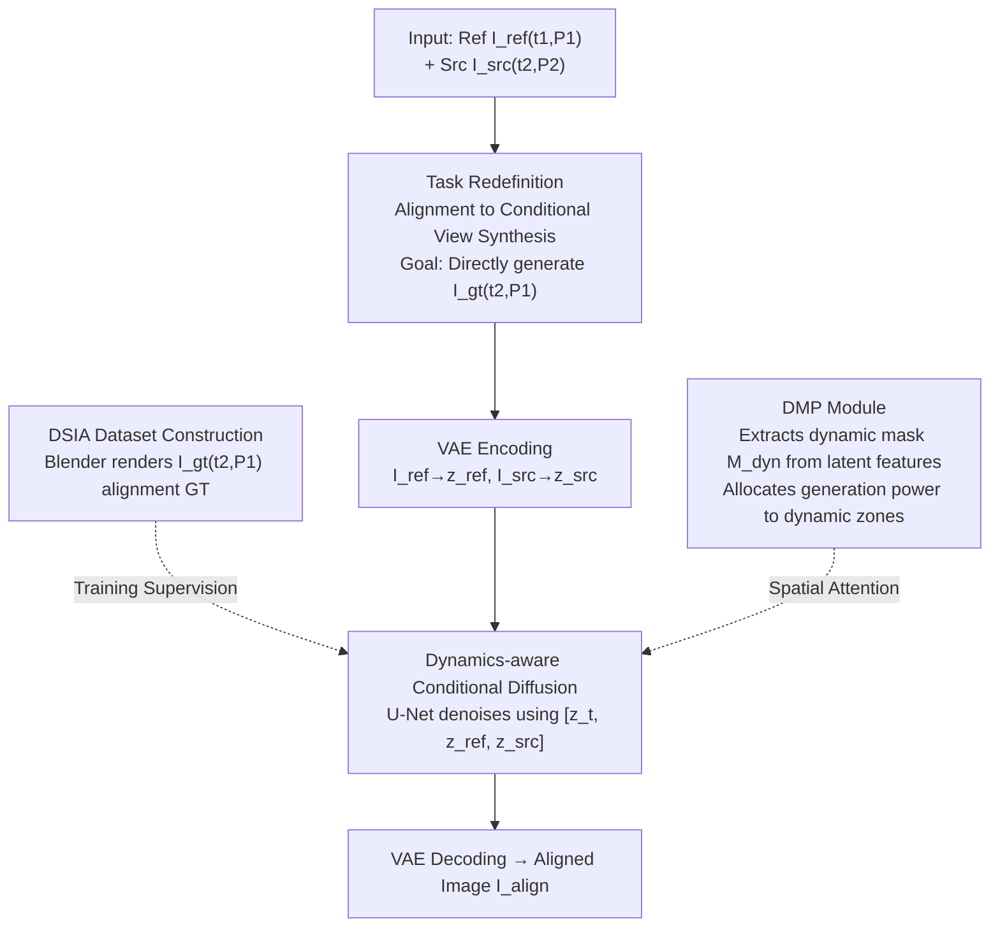

# DMAligner: Enhancing Image Alignment via Diffusion Model Based View Synthesis

**Conference**: CVPR2026  
**arXiv**: [2602.23022](https://arxiv.org/abs/2602.23022)  
**Code**: [boomluo02/DMAligner](https://github.com/boomluo02/DMAligner)  
**Area**: 3D Vision  
**Keywords**: image alignment, diffusion model, view synthesis, dynamic scenes, occlusion handling

## TL;DR

DMAligner is proposed to transform the image alignment problem from the traditional optical flow warp paradigm into an "alignment-oriented view synthesis" task. By leveraging conditional diffusion models to directly generate aligned full images in conjunction with a specially constructed DSIA synthetic dataset and a Dynamics-aware Mask Producing (DMP) module, the method effectively avoids ghosting and occlusion artifacts inherent in warping methods, outperforming existing methods across multiple benchmarks.

## Background & Motivation

Image alignment is a fundamental task in computer vision, aiming to align two images captured from different viewpoints or at different times into a unified coordinate system. It is critical for applications such as video stabilization, panoramic stitching, super-resolution, and multi-frame denoising.

Traditional image alignment workflows typically include:

1.  **Optical Flow Estimation**: Calculating pixel-level motion fields (optical flow) using models like RAFT or FlowFormer.
2.  **Image Warp**: Applying inverse transformations to the source image using the estimated flow to generate alignment results.
3.  **Post-processing**: Fusing or inpainting artifacts after the warp.

This paradigm suffers from two fundamental issues:

*   **Handling Occlusion**: When regions in the target viewpoint are occluded in the source image, optical flow cannot provide valid correspondences, leading to holes or ghosting artifacts after warping.
*   **Dynamic Object Interference**: Moving objects in the scene alter geometric relationships, causing inaccurate flow estimation and severe ghosting in dynamic regions.

Core Motivation: **Can the indirect "estimate flow $\rightarrow$ warp" paradigm be bypassed to directly generate aligned full images?** Inspired by the powerful generation capabilities of diffusion models, the authors redefine alignment as a conditional image generation problem.

## Core Problem

*   Traditional warp-based alignment methods inevitably produce ghosting artifacts in occluded and dynamic regions.
*   Generative methods require large amounts of high-quality training data, but existing datasets lack paired annotations for alignment tasks (ground truth images for time $t_2$ + camera pose $P_1$).
*   Diffusion models must learn to distinguish dynamic foregrounds from static backgrounds to correctly handle moving objects in a scene.

## Method

### Overall Architecture

Ours addresses the inherent issues of holes and ghosting in traditional "flow estimation $\rightarrow$ warp" paradigms within occluded and dynamic areas. The general strategy is a complete paradigm shift: instead of warping, alignment is redefined as a conditional view synthesis task where a diffusion model directly generates the aligned full image. Around this paradigm, the paper presents four interconnected contributions: task redefinition, the DSIA dataset created via Blender to provide alignment ground truth (GT) unattainable in the real world, a conditional diffusion model trained on image pairs, and an embedded DMP module to specifically handle dynamic regions. The entire generative pipeline (encoding $\rightarrow$ conditional denoising $\rightarrow$ decoding) is end-to-end and involves no optical flow estimation.

### Key Designs

**1. Task Redefinition: Changing Alignment from Warp to Conditional View Synthesis**

The fatal flaw of the warp paradigm is the lack of correspondences for regions occluded in the source image. Ours proposes a different formulation: while traditional methods warp the source image $I_{src}$ (time $t_2$, camera $P_2$) to the coordinate system of the reference image $I_{ref}$ (time $t_1$, camera $P_1$), Ours directly generates the target image $I_{gt}$ (time $t_2$, camera $P_1$). This preserves the scene content at $t_2$ but observes it from the $P_1$ viewpoint. Essentially a conditional view synthesis problem, occlusion areas are naturally completed by the generative model, fundamentally bypassing warping holes.

**2. DSIA Dataset Construction: Using Rendering Engines for Unattainable Alignment GT**

Generative methods require training, but paired data like $I_{gt}$ (at $t_2$ but from $P_1$ viewpoint) cannot be captured in the real world. The authors used Blender to build the Dynamic Scene Image Alignment (DSIA) synthetic dataset: 25 human characters + 100+ object models + various camera trajectories. Characters perform actions like walking or running, and objects undergo translation and rotation. For each scene, $I_{ref}(t_1, P_1)$, $I_{src}(t_2, P_2)$, and $I_{gt}(t_2, P_1)$ are rendered. Camera motions cover forward, backward, left, right, and rotation. The dataset includes 1,033 scenes and 30K+ high-quality image pairs. Ablations show that removing DSIA pre-training causes PSNR to drop from 27.43 to 24.87, proving its importance for learning alignment priors.

**3. Dynamics-aware Conditional Diffusion: Directly Generating Aligned Images with Dual-image Conditioning**

Conditional generation is performed within the Latent Diffusion Model framework. In the encoding stage, $I_{ref}$ and $I_{src}$ are encoded into the latent space as $z_{ref}$ and $z_{src}$ via VAE. Forward diffusion adds noise to the GT latent representation $z_{gt}$:

$$z_t = \sqrt{\bar{\alpha}_t} z_{gt} + \sqrt{1 - \bar{\alpha}_t} \epsilon, \quad \epsilon \sim \mathcal{N}(0, I)$$

In the conditional denoising stage, the U-Net takes the concatenated $[z_t, z_{ref}, z_{src}]$ as input to predict noise:

$$\mathcal{L} = \mathbb{E}_{z_{gt}, \epsilon, t} \left[ \| \epsilon - \epsilon_\theta(z_t, t, z_{ref}, z_{src}) \|_2^2 \right]$$

The two conditioning images provide geometric reference and $t_2$ content, respectively, allowing the network to learn to "change viewpoint while preserving content."

**4. DMP Module: Extracting Dynamic Masks from Latent Features to Distribute Generative Power**

Dynamic objects alter geometry, necessitating an explicit distinction between dynamic foregrounds and static backgrounds. The Dynamics-aware Mask Producing (DMP) module utilizes multi-scale intermediate features $F_{mid}$ from the U-Net decoder to predict a binary mask $M_{dyn}$ through a lightweight convolutional head. This mask applies spatial attention to the denoising process, allocating more generative resources to dynamic areas while static areas rely primarily on geometric transformation. Supervision for the mask uses optical flow inconsistency as pseudo-labels:

$$\mathcal{L}_{mask} = \text{BCE}(M_{dyn}, M_{pseudo})$$

This enhances dynamic scene processing in a plug-and-play manner without requiring an external dynamic detection module. Ablations show PSNR drops from 27.43 to 26.15 without DMP.

### Mechanism

Given a pair of inputs—the reference image $I_{ref}$ and the source image $I_{src}$—both are first encoded into the latent space via VAE as $z_{ref}$ and $z_{src}$. Starting from pure Gaussian noise, multi-step DDIM denoising is performed conditioned on these latents. During this process, the DMP module provides continuous dynamics-aware guidance, ensuring regions with moving objects receive enhanced generation. After denoising converges, the final aligned image $I_{align}$ is obtained via VAE decoding. The entire pipeline is end-to-end and avoids the cascaded propagation of optical flow errors.

## Key Experimental Results

### DSIA Test Set

| Method | PSNR↑ | SSIM↑ | LPIPS↓ |
| :--- | :---: | :---: | :---: |
| RAFT + Warp | 22.31 | 0.782 | 0.189 |
| FlowFormer + Warp | 23.15 | 0.801 | 0.172 |
| LoFTR + Warp | 21.87 | 0.764 | 0.203 |
| **Ours** | **27.43** | **0.893** | **0.078** |

PSNR increases by over 4 dB, and LPIPS decreases by approximately 50% on the synthetic dataset.

### MPI Sintel Evaluation

| Method | Occlusion PSNR↑ | Dynamic PSNR↑ |
| :--- | :---: | :---: |
| RAFT + Warp | 18.7 | 17.2 |
| **Ours** | **23.1** | **22.6** |

The advantage in occluded and dynamic areas is particularly significant, validating the inherent benefits of generative approaches in these challenging regions.

### DAVIS Video Sequences

Qualitative evaluation on real-world dynamic videos demonstrates that Ours generates alignment results without ghosting artifacts and produces visually natural results even under large motion and severe occlusion.

### Ablation Study

*   **Removal of DMP module**: PSNR drops from 27.43 to 26.15 (-1.28), demonstrating the effectiveness of dynamics-aware guidance.
*   **Removal of DSIA pre-training**: PSNR drops to 24.87, indicating the synthetic data is crucial for learning alignment priors.
*   **Training only on static scenes**: PSNR in dynamic regions drops significantly by 3.2 dB, validating the necessity of dynamic scene data.

## Highlights & Insights

*   **Paradigm Shift**: Moves from the indirect "flow $\rightarrow$ warp" paradigm to a direct "conditional generation" paradigm, fundamentally avoiding occlusion and ghosting issues.
*   **Sophisticated DSIA Dataset Design**: Leverages Blender to render $I_{gt}(t_2, P_1)$, solving the training data problem for GT that is impossible to collect in the real world.
*   **Lightweight and Effective DMP Module**: Extracts dynamic masks from latent features without external modules, enhancing the diffusion model's ability to handle dynamic scenes in a plug-and-play manner.
*   **No Optical Flow Estimation**: Completes image alignment end-to-end, avoiding cascaded error propagation from flow estimation.

## Limitations & Future Work

*   The generation approach based on diffusion models has slow inference speeds; DDIM sampling still requires multiple iterations, lacking real-time performance.
*   The domain gap of the DSIA synthetic dataset may limit generalization to real-world scenes.
*   The training data scale of 30K+ is relatively limited; scene diversity (25 characters + 100 objects) could be further expanded.
*   Alignment performance and efficiency on high-resolution (e.g., 4K) images have not been explored.
*   The possibility of combining this with neural scene representations like NeRF/3DGS remains unexplored.

## Related Work & Insights

| Dimension | Traditional Warp | Deep Homography | Ours |
| :--- | :--- | :--- | :--- |
| Core Mechanism | Flow $\rightarrow$ Warp | Global Transform Matrix | Conditional Diffusion |
| Occlusion | Fails, produces holes | Relies on inpainting | Generative filling |
| Dynamics | Severe ghosting | Assumes static scenes | Explicit DMP modeling |
| Training Data | No training / Flow GT | Image pairs + Matrix | DSIA Synthetic Data |
| Speed | Fast (Single pass) | Fast (Single pass) | Slower (Multi-step) |

The core difference is that Ours redefines alignment as a generation problem, using the generative power of diffusion models to compensate for the inherent flaws of warp methods in occluded/dynamic regions.

## Rating

*   Novelty: 8/10 — Clear and reasonable paradigm shift by modeling alignment as view synthesis.
*   Experimental Thoroughness: 7/10 — Evaluated on both synthetic and real data, but lacks comparison with more recent generative methods.
*   Writing Quality: 8/10 — Problem definition is clear, method explanation is smooth, and DSIA construction is detailed.
*   Value: 7/10 — Provides a new direction for alignment, although inference efficiency limits immediate application.

<!-- RELATED:START -->

## Related Papers

- [\[CVPR 2026\] Landscape-Awareness for Geometric View Diffusion Model](landscape-awareness_for_geometric_view_diffusion_model.md)
- [\[CVPR 2026\] Iris: Bringing Real-World Priors into Diffusion Model for Monocular Depth Estimation](iris_bringing_realworld_priors_into_diffusion_model_for_monocular_depth_estimation.md)
- [\[CVPR 2026\] PR-IQA: Partial-Reference Image Quality Assessment for Diffusion-Based Novel View Synthesis](pr-iqa_partial-reference_image_quality_assessment_for_diffusion-based_novel_view.md)
- [\[CVPR 2026\] Improving Human Image Animation via Semantic Representation Alignment](improving_human_image_animation_via_semantic_representation_alignment.md)
- [\[CVPR 2026\] JRM: Joint Reconstruction Model for Multiple Objects without Alignment](jrm_joint_reconstruction_model_for_multiple_objects_without_alignment.md)

<!-- RELATED:END -->
