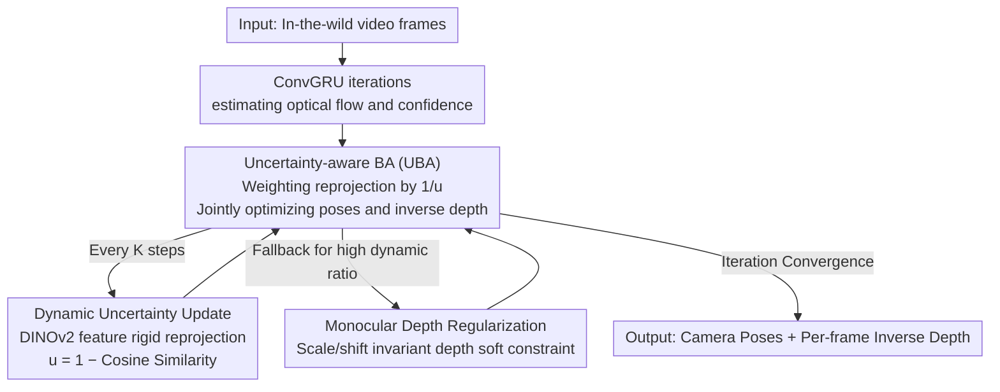

# DROID-W: DROID-SLAM in the Wild

**Conference**: CVPR2026  
**arXiv**: [2603.19076](https://arxiv.org/abs/2603.19076)  
**Code**: [MoyangLi00/DROID-W](https://github.com/MoyangLi00/DROID-W.git)  
**Area**: 3D Vision  
**Keywords**: SLAM, dynamic scenes, uncertainty estimation, bundle adjustment, DINOv2

## TL;DR

Ours proposes DROID-W, which introduces Uncertainty-aware Bundle Adjustment (UBA) combined with a DINOv2 feature-driven dynamic uncertainty update mechanism and monocular depth regularization. This enables DROID-SLAM to achieve robust camera pose estimation and scene reconstruction in highly dynamic in-the-wild scenarios, running in real-time at approximately 10 FPS.

## Background & Motivation

Visual SLAM (Simultaneous Localization and Mapping) is a core technology for robotics, AR/VR, and autonomous driving, aiming to simultaneously estimate camera poses and reconstruct 3D scene structures from consecutive video frames.

As one of the state-of-the-art deep learning SLAM systems, DROID-SLAM's core advantage lies in its differentiable Dense Bundle Adjustment (DBA) layer, achieving excellent accuracy through end-to-end training. However, DROID-SLAM and almost all classical SLAM methods are built upon a critical assumption:

**Static World Assumption**: All observable points in the scene are static between different time frames, and their 3D positions do not change over time.

This assumption is severely violated in real "in-the-wild" scenarios:

1. **Pedestrians and Vehicles**: Large numbers of moving objects in urban scenes destroy geometric consistency.
2. **Swaying Leaves and Flowing Water**: Non-rigid motion is ubiquitous in natural environments.
3. **YouTube Videos**: Internet videos are full of various dynamic elements that traditional SLAM cannot handle.

Existing methods for dealing with dynamic scenes are mainly divided into two categories:

- **Methods Based on Semantic Segmentation**: Pre-detect and mask categories that are "likely to move" (e.g., pedestrians, vehicles). However, these rely on predefined dynamic category priors and cannot handle objects moving unexpectedly.
- **Methods Based on Neural Implicit Maps** (e.g., RoDynRF, DynaMoN): Use NeRF to jointly model static and dynamic regions. These offer high accuracy but are computationally expensive and cannot run in real-time.

**Design Motivation**: **Can BA adaptively reduce the influence of dynamic regions without relying on predefined dynamic priors?** The authors observe that if an uncertainty weight can be assigned to each pixel—high uncertainty for dynamic regions and low uncertainty for static regions—the BA optimization process will naturally "ignore" the contribution of dynamic pixels.

## Core Problem

- Dynamic objects violate the static world assumption, leading to a large number of outliers in the reprojection residuals of BA, which seriously interferes with pose estimation.
- Predefined semantic priors cannot cover all dynamic categories, and "potentially moving categories" are not always in motion.
- While neural implicit methods can handle dynamic scenes, their computational cost is too high for real-time deployment.

## Method

### Overall Architecture

The core problem DROID-W addresses is that DROID-SLAM's differentiable Dense Bundle Adjustment (DBA) is built on the static world assumption. Pedestrians, vehicles, and swaying leaves in in-the-wild videos create numerous outliers in reprojection residuals, biasing pose estimation. The approach is not to "detect-and-mask" dynamic objects, but to assign an uncertainty weight to each pixel, allowing BA to automatically "down-weight" untrustworthy pixels during optimization.

The pipeline follows the DROID-SLAM backbone: ConvGRU iteratively estimates optical flow and confidence, while the DBA layer jointly optimizes camera poses and per-frame inverse depth. DROID-W adds three components: incorporating per-pixel uncertainty into the BA weighting term (UBA), re-estimating this uncertainty every few steps using DINOv2 semantic features (dynamic uncertainty update), and using monocular depth priors as a safeguard in extremely dynamic scenes. These three components alternate during BA iterations until convergence, running at approximately 10 FPS.

### Key Designs

**1. Uncertainty-aware Bundle Adjustment (UBA): Automatic Down-weighting of Dynamic Pixels**

Standard DBA jointly optimizes camera poses $\{G_i\}$ and inverse depths $\{d_i\}$ by minimizing weighted reprojection error: $E = \sum_{(i,j)} \| p_{ij}^* - \Pi_c(G_{ij} \cdot \Pi_c^{-1}(p_i, d_i)) \|_{\Sigma_{ij}}^2$, where $p_{ij}^*$ are correspondence points from correlation lookups and $\Sigma_{ij}$ is the predicted confidence. The limitation is that large residuals from dynamic pixels contaminate the least-squares solution.

UBA multiplies each pixel by an optimizable uncertainty $u_{ij}$, changing the objective to:

$$E_{UBA} = \sum_{(i,j) \in \mathcal{E}} \frac{1}{u_{ij}} \| p_{ij}^* - \Pi_c(G_{ij} \cdot \Pi_c^{-1}(p_i, d_i)) \|_{\Sigma_{ij}}^2 + \log u_{ij}$$

Larger $u_{ij}$ values yield smaller contributions to the error, effectively down-weighting the pixel. The $\log u_{ij}$ regularization term prevents the trivial solution where uncertainty expands to infinity. Since $u_{ij}$ is updated jointly with poses and depths during BA iterations, "which pixels should be ignored" is an optimized result rather than a predefined one.

**2. DINOv2-based Dynamic Uncertainty Update: Identifying Dynamic Regions without Semantic Priors**

Where does $u_{ij}$ in UBA come from? Traditional methods mask predefined categories like "pedestrians/vehicles," but miss dynamic objects not seen during training. DROID-W employs a geometric consistency check: for each frame, a pretrained DINOv2 extracts dense feature maps $F_i \in \mathbb{R}^{H \times W \times C}$. Using the current BA poses and depths, a rigid reprojection maps pixel $p$ from frame $i$ to position $p_{ij}$ in frame $j$. The cosine similarity $s_{ij}(p) = \frac{F_i(p) \cdot F_j(p_{ij})}{\|F_i(p)\| \cdot \|F_j(p_{ij})\|}$ is calculated, and $u_{ij}(p) = 1 - s_{ij}(p)$ is set.

The intuition is straightforward: static regions yield high consistency after rigid reprojection ($s_{ij}\to 1$, $u_{ij}\to 0$). In dynamic regions, because objects have moved, rigid reprojection points to the wrong location, causing low feature similarity ($s_{ij}$ low, $u_{ij}$ high). Using DINOv2 instead of raw pixels provides semantic features robust to lighting and slight viewpoint changes. Ablations showing DINOv2 > DINO > CLIP > ResNet50 confirm this.

**3. Monocular Depth Regularization: Safeguards for Extremely Dynamic Scenarios**

When over 80% of a scene is dynamic, many pixels are marked with high uncertainty, drastically reducing available constraints and potentially causing BA to diverge. DROID-W adds monocular depth priors as a soft constraint $E_{depth} = \lambda \sum_i \| d_i - d_i^{mono} \|^2$, where $d_i^{mono}$ is provided by a pretrained monocular depth model (e.g., DPT/ZoeDepth). Since monocular depth lacks absolute scale, a scale- and shift-invariant form is used. It does not participate in dynamic detection but provides additional geometric anchors when static constraints are insufficient.

### Mechanism

Using a street view video as an example: ConvGRU first initializes optical flow and confidence following the DROID-SLAM pipeline, and BA provides initial poses and depths. Every $K$ steps, the dynamic uncertainty update performs rigid reprojection—features of background buildings align well ($u\approx 0$), while pedestrians walking across the frame are reprojected to incorrect positions, yielding low cosine similarity and pushing $u$ high. In the next UBA optimization round, the weight $1/u$ for pedestrian pixels is nearly suppressed, and poses are primarily constrained by static buildings. If a frame has an extremely high dynamic ratio, monocular depth regularization provides extra constraints to prevent divergence. This process alternates until convergence, ultimately reducing ATE on the high-dynamic TUM sequence from 28.3cm (DROID-SLAM) to 2.1cm.

## Key Experimental Results

### TUM RGB-D Dynamic Sequences

| Method | ATE RMSE (cm)↓ | Dynamic Proportion |
|------|----------------|---------|
| ORB-SLAM3 | 36.5 | High |
| DROID-SLAM | 28.3 | High |
| DynaSLAM | 3.8 | High |
| **DROID-W** | **2.1** | **High** |

In high-dynamic TUM sequences (e.g., walking series), the ATE is reduced to 2.1cm, a >13× improvement over the original DROID-SLAM.

### DROID-W Dataset (In-the-wild Data)

The authors constructed a dedicated evaluation dataset featuring diverse outdoor dynamic scenes (pedestrians, cyclists, runners) and YouTube clips. Qualitative evaluation shows:

- DROID-SLAM trajectories drift severely in dynamic scenes.
- DROID-W maintains stable trajectory estimation, with camera paths highly consistent with ground truth.

### KITTI Dynamic Scenes

| Method | Translation Error↓ | Rotation Error↓ |
|------|----------|----------|
| DROID-SLAM | Failure/Drift | Failure/Drift |
| **DROID-W** | **Significant Improvement** | **Significant Improvement** |

On vehicle-dense sequences in KITTI, DROID-SLAM frequently fails, while DROID-W maintains stable tracking.

### Ablation Study

- **Without UBA (Standard BA only)**: ATE rises sharply, degrading to DROID-SLAM performance.
- **Without DINOv2 features (Using raw pixel similarity)**: Uncertainty estimation becomes brittle, with ATE rising by ~40%.
- **Without Monocular Depth Regularization**: BA occasionally diverges in scenes with extremely high dynamic proportions.
- **Different backbone models**: DINOv2 > DINO > CLIP > ResNet50 features, verifying DINOv2's semantic robustness.

### Real-time Performance

- Runs in real-time at ~10 FPS.
- Compared to neural implicit methods (e.g., RoDynRF at ~0.1 FPS), it is 100× faster.
- DINOv2 feature extraction can be optimized via caching and downsampling, with an additional overhead of ~15%.

## Highlights & Insights

- **Elegant Uncertainty Modeling**: Transforming the dynamic detection problem into uncertainty weights that integrate seamlessly into the BA framework without modifying the underlying optimizer architecture.
- **Independence from Predefined Dynamic Priors**: Adaptively detects dynamic regions via feature similarity, allowing it to handle any moving object (including categories not seen during training).
- **Leveraging Vision Foundation Models**: Strong semantic features from DINOv2 make dynamic detection robust under challenging conditions like lighting changes and textureless areas.
- **Maintaining Real-time Performance**: The ~10 FPS speed makes it valuable for practical deployment, far exceeding neural implicit solutions.
- **Minimal Modifications**: Built upon DROID-SLAM with only additional uncertainty modules, making it a low-impact, highly versatile enhancement.

## Limitations & Future Work

- The computational overhead of the DINOv2 model itself is non-negligible, posing challenges for deployment on embedded devices.
- For extreme scenes where the static background is almost entirely occluded (e.g., filming from inside a car with only moving objects visible through windows), monocular depth regularization provides limited constraints.
- Not yet compared with the latest 3D Gaussian Splatting dynamic scene methods (e.g., DynGaussian).
- The uncertainty update frequency (every $K$ steps) is a hyperparameter, and optimal values may vary by scene.
- Only validated in monocular scenarios; extensions for stereo or RGB-D inputs remain unexplored.

## Related Work & Insights

| Dimension | DROID-SLAM | DynaSLAM | RoDynRF | DROID-W |
|------|-----------|----------|---------|---------|
| Dynamic Handling | None | Semantic Masking | Neural implicit | Uncertainty Weighting |
| Dynamic Prior | None | Required (Predefined) | None | None |
| Real-time Performance | ~15 FPS | ~5 FPS | ~0.1 FPS | ~10 FPS |
| Scene Reconstruction | Sparse/Semi-dense | Sparse | Dense | Sparse/Semi-dense |
| Robustness | Fails on Dynamics | OK for Known Categories | General | General |

DROID-W achieves the best balance between "general dynamic robustness" and "real-time performance," offering both engineering utility and academic novelty.

## Highlights & Insights

- The uncertainty-weighted approach is a universal "robust estimation" technique adaptable to any BA/least-squares visual geometry task, such as optical flow, stereo matching, or SfM.
- The use of DINOv2 as a "universal semantic descriptor" is impressive; future work could explore its use in loop closure detection or place recognition.
- It forms an interesting contrast with DMAligner: both face "dynamic scene" challenges, but DMAligner uses generative methods to "bypass" the problem, while DROID-W uses uncertainty weighting to "tolerate" it—different but complementary strategies.
- Future work could explore combining uncertainty estimation with 3DGS dynamic reconstruction for real-time, high-quality dynamic scene reconstruction.

## Rating

- Novelty: 7/10 — Uncertainty-weighted BA is not new, but the combination with DINOv2 features and seamless integration into DROID-SLAM is a practical innovation.
- Experimental Thoroughness: 8/10 — Multi-dataset evaluation, detailed ablations, and in-the-wild data, though missing some quantitative comparisons with the latest methods.
- Writing Quality: 8/10 — Clear motivation, concise method descriptions, and well-organized experiments.
- Value: 8/10 — Directly improves the dynamic robustness of a classic SLAM system with high engineering value; the 10 FPS real-time performance is a major selling point.

<!-- RELATED:START -->

## Related Papers

- [\[CVPR 2026\] AERGS-SLAM: Auto-Exposure-Robust Stereo 3D Gaussian Splatting SLAM](aergs-slam_auto-exposure-robust_stereo_3d_gaussian_splatting_slam.md)
- [\[CVPR 2026\] Flow4DGS-SLAM: Optical Flow-Guided 4D Gaussian Splatting SLAM](flow4dgs-slam_optical_flow-guided_4d_gaussian_splatting_slam.md)
- [\[CVPR 2026\] Unblur-SLAM: Dense Neural SLAM for Blurry Inputs](unblur-slam_dense_neural_slam_for_blurry_inputs.md)
- [\[CVPR 2026\] Dynamic Visual SLAM using a General 3D Prior](dynamic_visual_slam_using_a_general_3d_prior.md)
- [\[CVPR 2026\] Scene Grounding In the Wild](scene_grounding_in_the_wild.md)

<!-- RELATED:END -->
