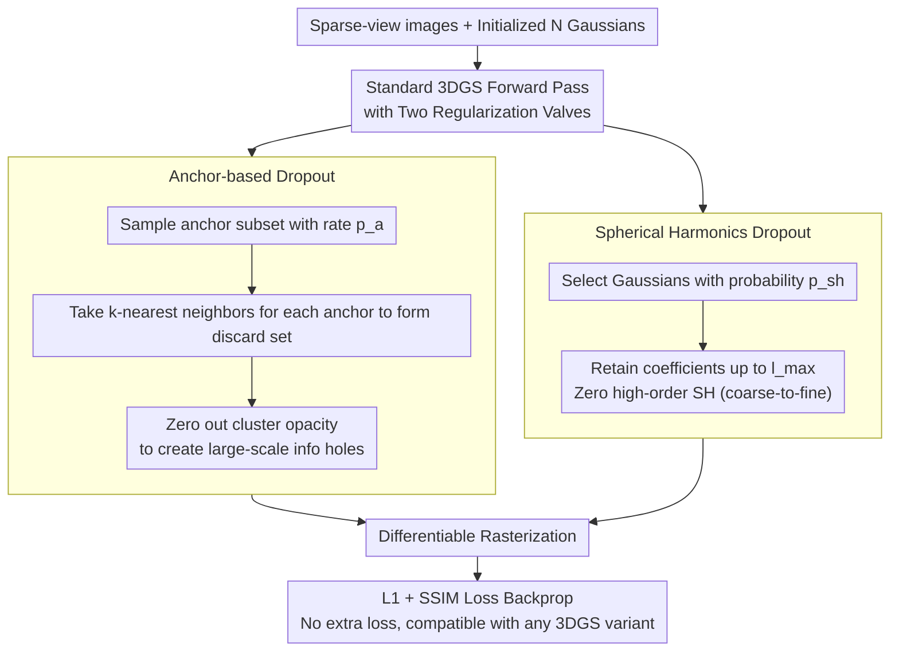

# DropAnSH-GS: Dropping Anchor and Spherical Harmonics for Sparse-view Gaussian Splatting

**Conference**: CVPR 2026  
**arXiv**: [2602.20933](https://arxiv.org/abs/2602.20933)  
**Code**: [Project Page](https://sk-fun.fun/DropAnSH-GS)  
**Area**: 3D Vision  
**Keywords**: 3D Gaussian Splatting, Sparse-view, Dropout Regularization, Spherical Harmonics, Novel View Synthesis

## TL;DR

To address the overfitting issue of 3DGS in sparse-view scenarios, this paper proposes DropAnSH-GS: it uses Anchor-based Dropout (dropping anchor points and their neighboring Gaussian clusters) instead of independent random Dropout to disrupt the local redundancy compensation effect, while introducing Spherical Harmonics (SH) Dropout to suppress high-order SH overfitting and support lossless compression after training.

## Background & Motivation

3D Gaussian Splatting (3DGS) represents 3D scenes through a large number of explicit Gaussian functions, achieving an excellent balance between rendering speed and visual quality with dense view inputs. However, in sparse-view settings (e.g., only 3 training views), severe overfitting leads to artifacts, blurriness, and geometric distortion.

**Limitations of Prior Work**: Inspired by Dropout techniques in deep learning, DropGaussian and DropoutGS randomly set the opacity of some Gaussians to 0 during training. However, this paper identifies two key problems:

**Problem 1—Neighbor Compensation Effect**: 3DGS uses a large number of overlapping Gaussians to collaboratively render. In local regions, Gaussians have highly similar opacity and color attributes (validated by the Moran's I index, where spatial autocorrelation is inversely proportional to distance). When a single Gaussian is randomly dropped, its rendering contribution is easily compensated by neighboring Gaussians. The resulting pixel color change $\Delta C$ is negligible, producing weak gradient signals and severely undermining the regularization effect.

**Problem 2—High-order SH Overfitting**: Existing Dropout methods only operate on opacity and ignore Spherical Harmonics coefficients. Experiments show (Figure 3) that while increasing the SH order improves performance in dense views, high-order SH leads to performance degradation and model bloat in sparse views, serving as another source of overfitting.

**Core Idea**: For Dropout to be truly effective, entire clusters of spatially correlated Gaussians (rather than single ones) must be dropped to create larger-scale "information holes," forcing the model to learn more robust global representations.

## Method

### Overall Architecture

DropAnSH-GS aims to solve the severe overfitting of 3DGS in sparse views. It does not modify the network or the loss function; instead, it inserts two regularization valves into the forward pass of the standard 3DGS training pipeline. The first is Anchor-based Dropout: a set of anchor Gaussians and their spatial neighbors are dropped as entire clusters to eliminate the compensation effect at its root. The second is Spherical Harmonics (SH) Dropout: high-order SH coefficients of a subset of Gaussians are randomly zeroed out to suppress overfitting in the color dimension. Both mechanisms only temporarily modify opacity and SH during the forward pass, while backpropagation proceeds as usual, allowing seamless integration with any 3DGS variant.

### Key Designs

**1. Anchor-based Dropout: Dropping clusters instead of single points to create large-scale "information holes"**

The reason single Gaussian Dropout is weak is that its rendering contribution is immediately filled by neighbors with nearly identical attributes, resulting in negligible color changes and weak gradients. This paper proposes cluster-wise dropping: first, a subset of anchors $\mathcal{A}$ is randomly sampled from all $N$ Gaussians $\mathcal{G}$ with a sampling rate $p_a$. Then, for each anchor, the $k$ nearest neighbors in Euclidean space are identified. All anchors and their neighborhoods are combined into a discard set $\mathcal{D}$, and their opacities are zeroed using a binary mask:

$$\hat{\alpha}_i = \alpha_i \cdot m_i, \quad m_i = \begin{cases} 0 & G_i \in \mathcal{D} \\ 1 & \text{otherwise} \end{cases}$$

Removing a whole cluster of spatially correlated Gaussians creates a large hole that neighbors cannot easily fill, forcing the optimization to utilize longer-range context to reconstruct the area and thus learn more robust global representations. A key rhythm control is used: the anchor sampling rate $p_a$ is not fixed but linearly ramps from 0 to 0.02. During early training, almost nothing is dropped to allow geometric structures to stabilize, with pressure gradually added later. The neighborhood size is fixed at $k=10$. $p_a$ is the most sensitive hyperparameter; if tuned to 0.04, PSNR drops sharply to 19.97. The kNN search is implemented in CUDA, adding less than 2.8% to the training overhead.

**2. SH Dropout: Dropping high-order SH by degree for anti-overfitting and model compression**

Existing Dropout methods ignore high-order SH, which degrades performance and inflates the model in sparse views. This method applies Dropout to colors: Gaussian color is represented by multi-order SH coefficients $\mathbf{c} = [\mathbf{c}^{(0)}, \mathbf{c}^{(1)}, \dots, \mathbf{c}^{(L)}]$. With probability $p_{sh}=0.2$, a subset of Gaussians is selected to retain coefficients only up to a maximum degree $l_{\max}$, zeroing out all higher degrees:

$$\tilde{\mathbf{c}} = [\mathbf{c}^{(0)}, \dots, \mathbf{c}^{(l_{\max})}, \mathbf{0}, \dots, \mathbf{0}]$$

Furthermore, $l_{\max}$ is gradually increased during training (degree 0 at 2k iterations, degree 1 at 4k, and degree 2 at 6k), enabling coarse-to-fine appearance learning. This yields two benefits: first, it directly suppresses color overfitting; second, it forces the model to prioritize storage of appearance info in low-order SH, allowing high-order coefficients to be truncated after training for lossless compression without retraining. Note that dropping "by degree" is superior to "randomly dropping coefficients" because it preserves the hierarchical structure of SH (25.50 vs 25.12 PSNR on Blender).

### Loss & Training

Standard 3DGS losses are used without additional modification:
$$\mathcal{L} = \mathcal{L}_{\text{L1}}(\hat{C}, C_{gt}) + \lambda \mathcal{L}_{\text{SSIM}}(\hat{C}, C_{gt})$$

Key: DropAnSH-GS is a pure regularization strategy. It imposes implicit constraints only by modifying the opacity and SH in the forward pass, without introducing any explicit additional loss terms.

## Key Experimental Results

### Main Results

| Dataset (Views) | Metric | DropAnSH-GS | DropGaussian | 3DGS | Gain vs DropGaussian |
|--------|------|-------------|-------------|------|------|
| LLFF (3-view) | PSNR↑ | **20.68** | 20.33 | 19.17 | +0.35 |
| LLFF (3-view) | SSIM↑ | **0.724** | 0.709 | 0.646 | +0.015 |
| LLFF (3-view) | LPIPS↓ | **0.194** | 0.201 | 0.268 | -0.007 |
| MipNeRF-360 (12-view) | PSNR↑ | **19.95** | 19.66 | 18.58 | +0.29 |
| Blender (8-view) | PSNR↑ | **25.50** | 25.17 | 22.13 | +0.33 |

### Ablation Study

| Configuration | PSNR | SSIM | LPIPS | Description |
|------|------|------|-------|------|
| W/O Dropout (3DGS) | 19.17 | 0.646 | 0.268 | Baseline |
| Only Drop Anchor | 20.47 | 0.713 | 0.200 | Anchor Dropout contributes +1.30 PSNR |
| Only Drop SH | 19.59 | 0.641 | 0.247 | SH Dropout is effective on its own |
| Drop Anchor + Drop SH | **20.68** | **0.724** | **0.194** | The two are complementary |

### Key Findings

- **Model Compression**: Retaining only degree 0 SH (SH0) exceeds original 3DGS performance while using only 25% of the model size. On MipNeRF-360: SH0 = 33.8MB (PSNR 19.71) vs 3DGS = 143.4MB (PSNR 18.58).
- **Strong Compatibility**: Patching DropAnSH-GS into other 3DGS variants yields improvements: FSGS +0.29 PSNR, CoR-GS +0.38, DNGaussian +0.59, Scaffold-GS +1.22.
- **Training Efficiency**: Compared to 3DGS, training time increases by less than 2.8% (LLFF: 760s vs 742s).
- "Dropping SH by degree" works better than "randomly dropping SH coefficients" (Blender: 25.50 vs 25.12 PSNR) as it maintains the SH hierarchy.

## Highlights & Insights

- **In-depth Problem Analysis**: The use of Moran's I to quantitatively measure spatial autocorrelation among Gaussians to demonstrate the neighbor compensation effect is more convincing than intuitive arguments.
- **Minimalist yet Effective**: No modifications to the loss function or network architecture; it simply changes the random masking strategy during training.
- **Post-training Compression**: A byproduct of SH Dropout is the ability to truncate high-order SH without retraining, allowing for flexible trade-offs between performance and model size.
- The research starts by asking "Why is Dropout weak in 3DGS?", which is a problem-driven approach worth emulating.

## Limitations & Future Work

- kNN search might become a bottleneck when the number of Gaussians is extremely large, despite CUDA acceleration.
- The anchor sampling rate $p_a$ and neighborhood size $k$ require tuning; sensitivity analysis shows performance is quite sensitive to $p_a$ (PSNR drops to 19.97 at 0.04).
- While the method is a general regularization strategy, it does not utilize 3D priors or pre-trained models, which are directions for further improvement.
- Evaluation is limited to sparse-view scenarios; effectiveness under other degradation conditions (e.g., pose noise) remains unknown.

## Related Work & Insights

- DropGaussian and DropoutGS pioneered the use of Dropout in 3DGS but ignored the spatial redundancy of Gaussians.
- Similar in concept to Spatial Dropout / DropBlock in deep learning: dropping spatially contiguous regions is more effective than dropping independent units.
- CoR-GS uses mutual constraints between two 3DGS models for regularization, whereas this method is a simpler single-model regularization.
- The idea of using SH truncation for model compression could be extended to other scene representations using SH.

## Rating

- **Novelty**: ⭐⭐⭐⭐ The insight of re-examining Dropout from the perspective of Gaussian spatial redundancy is novel, and the method is elegant.
- **Experimental Thoroughness**: ⭐⭐⭐⭐⭐ Covers 3 datasets, various view counts, extensive ablations, compatibility checks, and hyperparameter analysis.
- **Writing Quality**: ⭐⭐⭐⭐ The analysis in the pilot study is solid, and charts are clear.
- **Value**: ⭐⭐⭐⭐ Simple, practical, and plug-and-play, providing direct value to the 3DGS community.

<!-- RELATED:START -->

## Related Papers

- [\[CVPR 2026\] FastGS: Training 3D Gaussian Splatting in 100 Seconds](fastgs_training_3d_gaussian_splatting_in_100_seconds.md)
- [\[CVPR 2026\] Intrinsic Geometry-Appearance Consistency Optimization for Sparse-View Gaussian Splatting](intrinsic_geometry-appearance_consistency_optimization_for_sparse-view_gaussian_.md)
- [\[CVPR 2026\] Cross-Instance Gaussian Splatting Registration via Geometry-Aware Feature-Guided Alignment](cross-instance_gaussian_splatting_registration_via_geometry-aware_feature-guided.md)
- [\[CVPR 2026\] GAI-GS: A Wireless Channel Prediction Framework Injecting Ray-Object Interaction into 3DGS via Geometric Algebra Attention](a_geometric_algebra-informed_3dgs_framework_for_wireless_channel_prediction.md)
- [\[CVPR 2026\] Coverage Optimization for Camera View Selection](coverage_optimization_for_camera_view_selection.md)

<!-- RELATED:END -->
