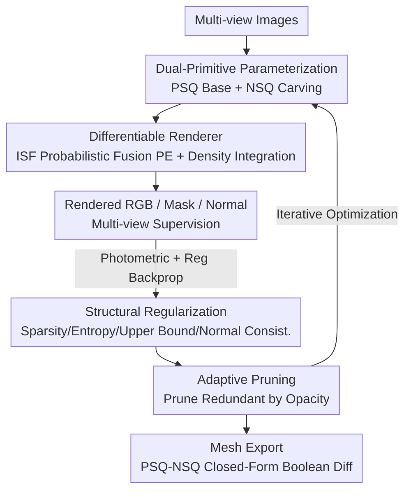

# DualPrim: Compact 3D Reconstruction with Positive and Negative Primitives

**Conference**: CVPR 2026  
**Paper**: [CVF Open Access](https://openaccess.thecvf.com/content/CVPR2026/html/Meng_DualPrim_Compact_3D_Reconstruction_with_Positive_and_Negative_Primitives_CVPR_2026_paper.html)  
**Code**: None  
**Area**: 3D Vision  
**Keywords**: Primitive Reconstruction, Superquadrics, Differentiable Rendering, Boolean Difference, Structured Mesh  

## TL;DR
DualPrim represents 3D shapes using dual primitives paired as "Positive density SuperQuadrics (PSQ) + Negative density SuperQuadrics (NSQ)". This allows the negative primitives to differentiably "subtract" local volumes like an eraser, thereby representing holes and cavities while remaining compact, differentiable, and interpretable. It learns end-to-end from multi-view images via differentiable volume rendering, and directly derives structured meshes using closed-form Boolean differences, achieving SOTA reconstruction accuracy and editability.

## Background & Motivation
**Background**: For 3D reconstruction from multi-view images, the mainstream approaches are implicit or point-based representations like NeRF, SDF, and 3D Gaussian Splatting, which can achieve high-fidelity geometry.

**Limitations of Prior Work**: These representations generate dense, unstructured surfaces with irregular topology and blurry part boundaries. Meshes extracted via Marching Cubes are often over-triangulated and lack clean edge loops, making them difficult to edit, rig, or integrate into standard graphics pipelines. Artists desire compact, part-structured, and topologically regular meshes, leaving a persistent gap between neural reconstruction outputs and production-ready assets.

**Key Challenge**: Primitive-based reconstruction (assembling shapes with analytical primitives like cuboids or superquadrics) is a pathway to structured geometry. However, **almost all existing primitive methods rely solely on additive composition**, progressively accumulating positive density fields to approximate the target. Purely additive methods are inherently incapable of representing topologically rich structures like holes and cavities, which are ubiquitous in real-world objects. In other words, there is a fundamental deadlock between structured representation (analytical, compact, differentiable) and expressiveness (ability to depict holes and cavities) under the additive paradigm.

**Goal**: To enable primitive representations to express holes and cavities without sacrificing compactness and differentiability, allowing them to be learned end-to-end directly from 2D images and seamlessly exported as structured meshes.

**Key Insight**: The authors draw inspiration from the workflow of 3D artists, where modeling involves both "adding volume" and "carving volume". Since additive primitives can already construct the base shapes, why not pair them with dedicated subtractive primitives?

**Core Idea**: To pair each positive primitive with a negative primitive, allowing the negative primitive to act as a differentiable "sculpting operator" that subtracts local volume from the positive primitive via a Boolean difference. This replaces purely additive primitives with additive-subtractive dual primitives to express complex topologies.

## Method

### Overall Architecture
DualPrim represents the entire 3D scene as a set of dual primitive parameters: each dual primitive consists of a positive density superquadric (PSQ, building the base) and a negative density superquadric (NSQ, carving the details). Given multi-view images as input, the entire pipeline jointly optimizes all primitive parameters within a differentiable volume rendering framework. Sampling along each camera ray, the framework first computes the Implicit Surface Function (ISF) of each point under both the PSQ and NSQ. It then fuses them into a combined ISF of the dual primitive using an "NSQ activation probability", which is converted into volume density for volumetric integration. This renders RGB, mask, and normal maps to be supervised by ground truth. During training, several regularization terms enforce compactness, and an opacity-based adaptive pruning mechanism gradually converges a dense initialization into a small number of meaningful primitives. Finally, low-transparency primitives are discarded, and a closed-form Boolean difference is applied to the PSQ and NSQ meshes of each dual primitive to directly export a compact, structured mesh.

### Key Designs

**1. Dual-Primitive Representation: Pairing Each Positive Primitive with a Differentiable "Eraser" Negative Primitive**

Purely additive primitives cannot represent holes and cavities because they can only continuously accumulate volume. The solution proposed by DualPrim is to define each dual primitive with two superquadrics: a PSQ (positive density superquadric) that defines the structural base shape, and an NSQ (negative density superquadric) that acts like an eraser—**removing density only within the region overlapping the PSQ**. If there is no overlap, the NSQ's contribution is zero, and the dual primitive degenerates into a single PSQ. Each superquadrics is described by an analytical implicit equation:

$$f(x,y,z) = \left(\left(\left(\tfrac{x}{a_x}\right)^{\frac{2}{\varepsilon_2}} + \left(\tfrac{y}{a_y}\right)^{\frac{2}{\varepsilon_2}}\right)^{\frac{\varepsilon_2}{\varepsilon_1}} + \left(\tfrac{z}{a_z}\right)^{\frac{2}{\varepsilon_1}}\right)^{\frac{\varepsilon_1}{2}} = 1$$

where $(a_x, a_y, a_z)$ control the semi-axes, and $(\varepsilon_1, \varepsilon_2)$ control the shape. The complete parameters of each dual primitive (individual scale, shape, translation $T$, and rotation $R$ for both PSQ and NSQ, along with shared opacity $\alpha$, rendering sharpness $\theta$, and base color) are continuously differentiable. This combined additive-subtractive mechanism dramatically expands the expressiveness of primitive representations from "convex, smooth shapes" to "complex topologies with internal cavities, openings, and asymmetry", while using only a small set of analytical parameters—retaining both compactness and differentiability. Because the mesh of each superquadric can be represented by edge loops, exporting the mesh only requires a Boolean difference between the PSQ and NSQ meshes, which naturally yields a clean, structured wireframe.

**2. Differentiable Renderer: Soft Fusion of Positive and Negative ISFs using "NSQ Activation Probability"**

Learning this representation from 2D images is challenging because writing the discrete Boolean operation of "PSQ minus NSQ" as a everywhere-differentiable density field is non-trivial. For each point $p$ and superquadric $Q$, the authors first calculate the Implicit Surface Function (ISF) $f(p, Q)$ in the local coordinate system $p' = R_Q^{-1}(p - T_Q)$ (defined as the superquadric equation minus 1, which is negative inside and positive outside). The key step is to estimate the probability $P_E$ of whether the NSQ is active:

$$P_E(p,S) = \Phi\!\left(-\tfrac{f(p,\text{PSQ})}{\theta_S(p)} - \mu\right)\cdot \Phi\!\left(-\tfrac{f(p,\text{NSQ})}{\theta_S(p)} - \mu\right)$$

where $\Phi$ is the Sigmoid function, and $\mu$ is a small bias to ensure zero-crossing. $P_E$ approaches 1 only when $p$ lies inside both the PSQ and NSQ, and the primitives are sufficiently sharp. The blended ISF is then formulated as a soft combination of the PSQ and NSQ weighted by $P_E$:

$$f(p,S) = f(p,\text{PSQ})\cdot(1-P_E) - f(p,\text{NSQ})\cdot P_E$$

Normals are also fused using the same weight for the normalized gradients of the PSQ and NSQ. After obtaining the blended ISF, the volume density $\sigma_S(p)$ is estimated following NeuS by taking the Sigmoid difference of the ISF at $p \pm \Delta p$. The density over all $K$ dual primitives is then weighted by their opacity $\alpha$ and summed to obtain the point density. Finally, the RGB color is integrated using the volume rendering formula $I = \sum_i \big(\prod_{j<i}(1-\alpha_j)\big)\alpha_i c_i$. Mask and normal maps are rendered in a similar manner. This formulation translates the "subtraction" into a continuous probability, enabling gradients to propagate backward from 2D pixels to the parameters of both positive and negative primitives.

**3. Four Structural Regularizations: Embedding Physical Binary Existence into the Loss**

Supervision from reconstruction loss alone is insufficient, as the model would stack a massive amount of semi-transparent and overlapping redundant primitives. Therefore, beyond the photometric loss $L_{rgb}$ and mask loss $L_{mask}$, the authors introduce four regularization terms designed to keep the representation compact and physically self-consistent: a sparsity term $L_{sp}=\frac{1}{K}\sum_p \alpha(p)$ penalizes high opacity to discourage redundant primitives; an entropy regularization $L_e$ minimizes the binary entropy of $\alpha$ to force it to converge to either 0 or 1 (expressing binary existence without staying intermediate); a maximum constraint $L_{max}=\frac{1}{K}\sum_p \text{ReLU}(\alpha(p)-1)$ softly penalizes $\alpha>1$ to ensure surface existence probabilities remain physically bounded; and a normal consistency term $L_{norm\_reg}$ aligns rendered normals with reference normals estimated directly from the rendered surface, requiring no additional annotations. Ablations show that removing $L_{sp}$ leads to redundant primitives, while removing $L_{max}$ causes multiple primitives to overlap instead of representing the area with a single primitive. These two terms are essential to ensuring a compact and non-overlapping reconstruction.

**4. Adaptive Primitive Control: Pruning from Dense Random Initialization to Compact, Interpretable Representation**

The framework starts with a large pool ($K=100$) of randomly distributed dual primitives, then prunes them based on opacity $\alpha$ (similar to 3DGS): primitives with $\alpha < 0.02$ are considered negligible and discarded. Primitives with scale parameters below the threshold $t_a = 0.01$ are also removed to avoid numerical instability and structural noise. Furthermore, view-dependent filtering is performed—periodically pruning primitives whose rendering weights are insignificant across all viewpoints (indicating they are occluded or visually redundant). This dynamically re-allocates modeling capacity to visible, highly structured regions. This adaptive control drives the system from a dense initialization toward a compact, interpretable, and highly efficient collection of primitives, boosting convergence speed and reconstruction quality. During mesh extraction, primitives with $\alpha < 0.5$ are discarded, and a Boolean difference is performed on the remaining PSQ/NSQ pairs to yield the final meshes.

### Loss & Training
The total loss is a weighted sum of six terms:

$$L = L_{rgb} + \lambda_{mask}L_{mask} + \lambda_{sparse}L_{sp} + \lambda_e L_e + \lambda_{max}L_{max} + \lambda_{norm\_reg}L_{norm\_reg}$$

The first two terms provide photometric and mask supervision, while the last four enforce structural regularization. Optimization is performed jointly on all positive and negative superquadric parameters within the differentiable rendering framework, starting with $K=100$ initialized dual primitives. The lighting MLP consists of 4 layers with Xavier initialization, and the normal supervision utilizes normal maps estimated by StableNormal.

## Key Experimental Results

### Main Results
Evaluation is conducted on 12 categories from ShapeNet, with 15 randomly sampled objects per category. Each object has 26 viewpoints (24 uniform and 2 top/bottom), rendered to 256×256 ground truth using Blender. Metrics include number of vertices #V, number of faces #F, Normal Consistency (NC Loss), Chamfer Distance (CD), and user-evaluated EditScore (mean CD across 180 cases, EditScore evaluated on a scale of 1–10 by 36 users with 3D editing experience across 12 cases).

| Method | #V(k)↓ | #F(k)↓ | NC Loss↓ | CD↓ | EditScore↑ |
|------|--------|--------|----------|-----|------------|
| RNb-NeuS | 124.41 | 57.44 | 37.45 | 10.71 | 4.77 |
| nvdiffrec | 15.40 | 13.98 | 56.19 | 10.63 | 5.47 |
| Flexicubes | 16.67 | 8.33 | 16.11 | 13.32 | 4.98 |
| PrimitiveAnything | 21.51 | 12.61 | 4.48 | 11.57 | 4.59 |
| Marching Primitives | 3.38 | 1.75 | 12.42 | 12.58 | 4.88 |
| MeshAnything | 0.55 | 0.29 | 4.00 | 10.12 | 5.12 |
| EMS | 2.40 | 1.22 | 9.02 | 16.64 | 3.92 |
| 2DGS + MC | 151.71 | 75.95 | 53.75 | 12.06 | 3.75 |
| 2DGS + CSG | 44.83 | 18.10 | 16.66 | 12.63 | 4.41 |
| DiffCSG | 10.24 | 5.20 | 8.20 | 11.27 | 5.50 |
| CapriNet | 29.07 | 12.64 | 11.55 | 11.28 | 4.98 |
| D2CSG | 24.27 | 11.62 | 13.21 | 12.12 | 4.73 |
| **DualPrim (Ours)** | **1.54** | **0.79** | 7.73 | **7.94** | **8.29** |

DualPrim's CD (7.94) is significantly lower than all compared baselines (the second best being MeshAnything at 10.12), while generating extremely compact meshes (only 1.54k vertices / 0.79k faces; only MeshAnything has fewer vertices but at the cost of higher CD). Its EditScore of 8.29 also vastly outperforms the runner-up (DiffCSG at 5.50). While SDF mesh extraction methods (RNb-NeuS, 2DGS+MC) achieve reasonable accuracy, they yield hundreds of thousands of vertices and suffer from over-triangulation. Conversely, pure-primitive methods are compact but their reconstruction quality is bottlenecked by noise and artifacts in the underlying SDF.

### Ablation Study

| Configuration | Phenomenon | Explanation |
|------|------|------|
| Full model | Compact, non-overlapping, and capable of representing holes/cavities | Full model |
| $L_{sp}=0$ | Emergence of numerous redundant primitives | Disabling sparsity regularization prevents the model from seeking sparse primitive sets |
| $L_{max}=0$ | Severe overlap among multiple primitives | Disabling max regularization causes regions that should be represented by a single primitive to stack multiple primitives |
| Only PSQ (No NSQ) | Inability to depict local volume subtraction and fine structures | NSQ is necessary to subtract local volumes, refine details, and maintain analytical regularity |

### Key Findings
- **NSQ is key to expressiveness**: With only PSQ, the model is limited to additive operations and cannot represent holes or cavities. Introducing NSQ enables differentiable subtraction of local volume and refinement of fine structures, representing the core advancement over purely additive primitive-based methods.
- **Complementary regularizations**: $L_{sp}$ ensures "fewer but better" primitives (pruning redundancy), and $L_{max}$ prevents overlap (avoiding multi-primitive stacking). Together, they guarantee that the final representation remains compact and clean.
- **Coexistence of compactness and accuracy**: DualPrim achieves the lowest CD using minimal geometry (1.54k vertices), proving that structured primitive representations do not require sacrificing accuracy. Instead, the increased expressiveness benefits both aspects simultaneously.

## Highlights & Insights
- **Reformulating Boolean subtraction as continuous probability**: Softening the "NSQ activation" with $P_E$ (the product of two Sigmoids) turns the inherently discrete CSG subtraction into an everywhere-differentiable operation learned end-to-end from 2D images. This elegantly bypasses the "combinatorial explosion and non-differentiability" dilemmas of traditional neural CSG.
- **Degeneration as a fallback**: When an NSQ does not overlap with its paired PSQ, its contribution falls to zero, and the dual primitive naturally degenerates into a single PSQ. This leaves the choice of whether to "carve" completely to the optimization process itself, without requiring explicit switches—an elegant self-adaptive mechanism.
- **Closed-form Boolean difference for mesh export**: Since the primitives are analytical superquadrics and meshes are represented by edge loops, the extraction stage directly computes Boolean differences on the PSQ/NSQ meshes rather than relying on Marching Cubes. This yields clean, regular wireframes natively, making the method transferable to any reconstruction/generation task where "editable, structured meshes" are desired.

## Limitations & Future Work
- **Limitations on thin structures**: The authors acknowledge that parts thinner than the grid resolution are difficult to capture accurately. This requires increasing the resolution or artificially thickening the affected regions to mitigate.
- **Residual primitive intersections**: Although the regularization terms drastically reduce overlap, edge-level or layout-induced minor intersections might still occur (the authors state this has negligible impact on fidelity and editability).
- **Bias toward industrial objects**: The method primarily targets cleanly structured CAD/industrial objects, with performance degrading on irregular, real-world objects. This limits its applicability to organic shapes or in-the-wild scans.
- **Critique**: The model relies on normals estimated by StableNormal for supervision, meaning normal estimation quality directly impacts reconstruction. The initialization of $K=100$ and the hyperparameter tuning for various regularization weights $\lambda$ might require category-specific adjustments, and generalized robustness warrants validation on a larger scale.

## Related Work & Insights
- **vs. Neural Implicit Reconstruction (NeRF / SDF / 2DGS + Marching Cubes)**: These methods pursue high fidelity but produce dense, unstructured meshes with blurry part boundaries and noisy topologies. DualPrim sacrifices minor fitting freedom for arbitrary details in exchange for compact, editable, analytical, structured geometry, which actually yields a lower CD.
- **vs. Purely Additive Primitive Methods (EMS, Marching Primitives, PrimitiveAnything)**: These methods only perform addition, making them incapable of representing holes and cavities. They also mostly rely on pre-exported SDFs as inputs, inheriting their noise. DualPrim incorporates negative primitives for differentiable subtraction and learns end-to-end directly from images, providing superior expressiveness.
- **vs. Neural CSG (CSGNet, BSP-Net, CapriNet, D2CSG, DiffCSG)**: Traditional CSG combines primitives with Boolean trees, which are non-differentiable, and their search space propagates exponentially with the number of primitives, making them hard to scale. DualPrim uses fixed, paired "positive-negative" dual primitives along with probabilistic soft fusion, bypassing the combinatorial complexity of parsed hierarchical CSGs while preserving the structural expressiveness of Boolean differences.

## Rating
- Novelty: ⭐⭐⭐⭐⭐ Incorporating "negative-density superquadrics + differentiable probabilistic Boolean difference" into primitive reconstruction cleanly resolves the limitation of purely additive paradigms in expressing holes and cavities.
- Experimental Thoroughness: ⭐⭐⭐⭐ Comprehensive evaluation comparing with 13 representative methods, including a user study on editability. However, the evaluation dataset is confined to ShapeNet CAD/industrial objects, and real-world generalization remains to be fully explored.
- Writing Quality: ⭐⭐⭐⭐⭐ Smooth flow of logic from motivation (artist-like additive-subtractive modeling) to method (PSQ/NSQ + $P_E$ soft fusion), supported by clear illustrations.
- Value: ⭐⭐⭐⭐⭐ Produces compact, editable, structured meshes that directly bridge the gap to downstream requirements like gaming, assets, and simulation, offering high practical value.

<!-- RELATED:START -->

## Related Papers

- [\[CVPR 2026\] Prune Wisely, Reconstruct Sharply: Compact 3D Gaussian Splatting via Adaptive Pruning and Difference-of-Gaussian Primitives](prune_wisely_reconstruct_sharply_compact_3d_gaussian_splatting_via_adaptive_prun.md)
- [\[CVPR 2026\] CGHair: Compact Gaussian Hair Reconstruction with Card Clustering](cghair_compact_gaussian_hair_reconstruction_with_card_clustering.md)
- [\[CVPR 2026\] 4D Primitive-Mâché: Glueing Primitives for Persistent 4D Scene Reconstruction](4d_primitive-mache_glueing_primitives_for_persistent_4d_scene_reconstruction.md)
- [\[CVPR 2026\] Urban-GS: A Unified 3D Gaussian Splatting Framework for Compact and High-Fidelity Aerial-to-Street Reconstruction](urban-gs_a_unified_3d_gaussian_splatting_framework_for_compact_and_high-fidelity.md)
- [\[CVPR 2026\] 3D Gaussian Splatting at Arbitrary Resolutions with Compact Proxy Anchors](3d_gaussian_splatting_at_arbitrary_resolutions_with_compact_proxy_anchors.md)

<!-- RELATED:END -->
