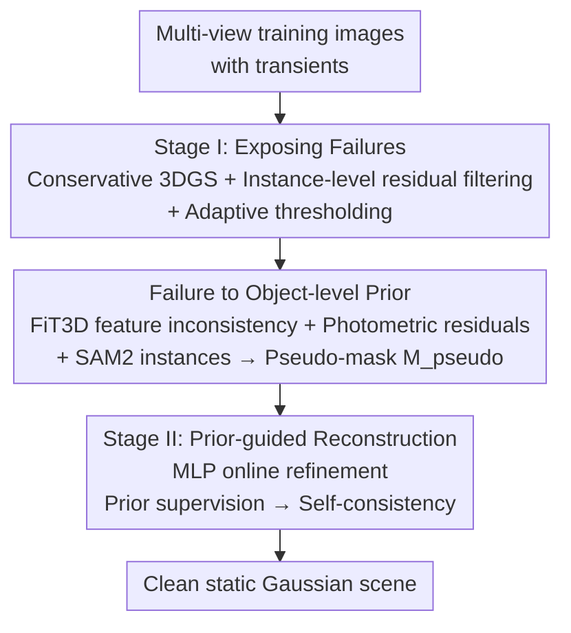

# DualSplat: Robust 3D Gaussian Splatting via Pseudo-Mask Bootstrapping from Reconstruction Failures

**Conference**: CVPR 2026  
**Paper**: [CVF Open Access](https://openaccess.thecvf.com/content/CVPR2026/html/Wang_DualSplat_Robust_3D_Gaussian_Splatting_via_Pseudo-Mask_Bootstrapping_from_Reconstruction_CVPR_2026_paper.html)  
**Code**: https://lans1ot.github.io/DualSplat/ (Project Page)  
**Area**: 3D Vision  
**Keywords**: 3D Gaussian Splatting, robust reconstruction, transient object suppression, pseudo-masks, novel view synthesis  

## TL;DR
DualSplat treats the "failed fragments of the first-pass 3DGS reconstruction" as clues for locating transient objects. It first performs a coarse reconstruction to expose failures, then solidifies these failures into object-level pseudo-masks as external priors, and finally uses these pseudo-masks to guide a second-pass clean reconstruction with online fine-tuning. This breaks the mutual dependency loop of "transient detection $\leftrightarrow$ clean reconstruction", achieving state-of-the-art robustness in transient-dense scenes on RobustNeRF and NeRF On-the-go.

## Background & Motivation
**Background**: 3D Gaussian Splatting (3DGS) has become the mainstream backbone for novel view synthesis due to its real-time, photorealistic rendering. However, it implicitly assumes that all training viewpoints capture the exact same static scene with multi-view consistency.

**Limitations of Prior Work**: Real-world acquisition rarely satisfies this assumption. **Transient objects**, such as pedestrians, vehicles, and temporary obstructions, only appear in a subset of views, violating multi-view consistency. 3DGS erroneously incorporates these "appeared-once-and-vanished" observations into the scene representation, generating floaters/spurious Gaussians, producing ghosting artifacts, and degrading reconstruction quality.

**Key Challenge**: Most existing robust 3DGS methods (e.g., SpotLessSplats, RobustSplat, DeSplat) perform **online transient detection concurrently with geometry optimization**. This tightly couples transient suppression with reconstruction, creating a fundamental **circular dependency**: accurate transient detection requires a well-reconstructed static scene to expose inconsistencies, whereas clean reconstruction itself depends on reliable transient masks to prevent transient objects from being baked into the geometry. When jointly optimized from a poor initialization, errors from both processes amplify each other: under-fitted static regions may be misidentified as transient and suppressed, while genuine transient content gets embedded into the reconstruction. Worse, once artifacts are "baked" into the geometry, residual signals disappear, making the failure almost irreversible.

**Goal**: To reliably decouple transient objects from the static reconstruction without entangling transient detection and scene optimization.

**Key Insight**: The authors observe that due to sparse and inconsistent multi-view visibility, transient objects tend to manifest as **incomplete, blurry fragments** in a conservative initial reconstruction. These "failure modes" are not merely garbage to be discarded, but rather **explicit clues that can be leveraged for transient object discovery**.

**Core Idea**: Present the **Failure-to-Prior** paradigm. An initial conservative reconstruction is performed specifically to "expose failures," which are then converted into object-level pseudo-masks serving as **external explicit priors** for a second-pass clean reconstruction. This decouples detection and reconstruction into two sequential stages, fundamentally avoiding the failure mode of online heuristic methods where signals are erased by overfitting.

## Method

### Overall Architecture
DualSplat is a **two-stage, decoupled-prior** robust 3DGS pipeline. The input consists of multi-view training images containing transient objects, and the output is a clean static Gaussian scene. The overall philosophy can be summarized as: **the first-pass reconstruction does not aim for perfect transient separation, but intentionally exposes transients as "failed fragments", solidifying these fragments into explicit priors before the second-pass reconstruction begins**, thereby separating "transient discovery" and "clean optimization".

The workflow consists of three steps: ① **Stage I: Exposing Failures**—Run a conservative initial 3DGS, combined with instance-level residual filtering and adaptive thresholding, to make transient objects appear as fragments in the rendered images; ② **Failure to Object-level Prior**—Compare the ground-truth (GT) images with the first-pass rendered images, and fuse FiT3D feature inconsistency, photometric residuals, and SAM2 instance boundaries to extract high-recall object-level pseudo-masks $M_{pseudo}$; ③ **Stage II: Prior-guided Reconstruction**—Use the pseudo-masks to guide the second-pass clean reconstruction while using a lightweight MLP to predict online transient probability maps. The training supervision gradually transitions from "fitting the pseudo-masks" to "self-consistency", refining the high-recall pseudo-masks into adaptive estimators as the geometry stabilizes.

### Key Designs

**1. Stage I: Exposing Failures: Instance-level residual filtering + Adaptive thresholding to make transients "reveal themselves"**

Online methods struggle because they judge transients before the geometry stabilizes, mixing under-fitted static regions with true transient objects. DualSplat does the opposite: Stage I runs a conservative initial 3DGS (10k iterations, default densification) **specifically to force transient objects into incomplete, blurry fragments**. These fragments reveal the static background underneath and create photometric discrepancies, thereby locating the transients. However, pixel-wise thresholding is unfriendly to deep networks, so the authors employ **instance-level aggregation**: first obtain instance masks $S(I_i)=\{m_i^j\}_{j=1}^{N_i}$ using SAM2, then compute the spatially averaged residual for each instance $R_i^j = \frac{\sum_{p\in m_i^j}R(p)}{|m_i^j|}$. Since transient corruption is usually spatially coherent within semantic objects, instance-level aggregation is much more stable than pixel-wise thresholding.

The determination threshold is the essence of this step—it **adaptively tightens as training progresses**:
$$T_i(t) = \mu_i + \left(1 + \lambda_{local}\frac{T_{max}-t}{T_{max}}\right)\sigma_i$$
where $\mu_i, \sigma_i$ are the image-level residual mean and standard deviation of the current frame, $t$ is the current iteration, and $T_{max}$ is the total iterations. In the early stages when the geometry is unstable, the threshold is intentionally set high to prevent under-fitted static regions from being over-masked; as reconstruction improves, the threshold gradually tightens, exposing more transient candidates. Instances satisfying $R_i^j > T_i(t)$ are marked as transient $M_t$ and incorporated into the masked reconstruction loss $L_{masked}$ (Eq. 2), forcing the first-pass reconstruction to "conservatively avoid fitting suspected transients."

**2. Failure to Object-level Prior: FiT3D feature inconsistency $\times$ Photometric residuals $\times$ SAM2 instances, fused into high-recall pseudo-masks**

Photometric residuals alone are insufficient, as some fragments are human-discernible but hard for the network to judge. The goal here is not to directly output the final mask, but to **externalize the first-pass failures into robust object-level priors before commencing the second-pass reconstruction**. The authors leverage **FiT3D** to extract dense features $F_{gt}, F_{render}$ from both the GT images and the first-pass rendered images, and compute the pixel-wise cosine similarity map $S = \cos(F_{gt}, F_{render})$. Regions with low similarity represent multi-view inconsistency and are highly likely to be transient. FiT3D is chosen over DINOv2 / Stable Diffusion because it extends foundational features to 3D and enforces view-consistent supervision, yielding cleaner multi-view consistent clues (as evidenced by FiT3D's significant lead in precision/IoU in the ablation study).

Next, a **dual-clue joint determination** is performed within SAM2 instance proposals. The similarity map is min-max normalized to $\hat{S}$. For each instance mask $m$ (pixel set $\Omega_m$), both the mean similarity $\mu_m=\frac{1}{|\Omega_m|}\sum_{p\in\Omega_m}\hat{S}(p)$ and the mean photometric residual $\bar{\ell}_m=\frac{1}{|\Omega_m|}\sum_{p\in\Omega_m}L_1(p)$ are computed. **Only instances that simultaneously exhibit "low feature consistency AND high photometric error" are retained as transient priors**: $\mu_m \le \tau_{sim},\ \bar{\ell}_m \ge \tau_{L1}$ (implemented with $\tau_{sim}=0.75, \tau_{L1}=0.05$). A slight morphological dilation is then applied to obtain $M_{pseudo}$. The authors deliberately aim for **high recall rather than high precision** for the pseudo-masks—it is better to over-mask some static parts than to let transients leak into the geometry, as the latter gets "baked in" irreversibly. The over-masked regions are left to Stage II for correction once the geometry stabilizes.

**3. Stage II: Prior-guided Reconstruction: Lightweight MLP online refinement, transitioning supervision from "prior-fitting" to "self-consistency"**

Although pseudo-masks are powerful, they can over-mask sparse observations or hard-to-fit static regions. Stage II does not restart transient detection from scratch but **refines the high-recall pseudo-masks after the geometry stabilizes**. The authors introduce a pixel-wise, lightweight MLP that predicts online transient probability maps $M_i = MLP_{mask}(f_i, d_i)$. The inputs are stored GT image features $f_i$ and the **depth residual** $d_i$ (the difference between the Depth Anything v2 monocular depth prediction and the currently rendered depth). The depth clue provides a complementary geometric signal since transient objects, even when locally reasonable in appearance, often violate multi-view depth consistency.

The training supervision follows an annealing curve that "**starts by adhering to the prior, then transitions to self-consistency**". Early on, an exponential decay strongly biases towards the pseudo-masks:
$$L_{prior} = \exp\!\left(-\frac{t}{\beta_{prior}}\right)\|M_{pseudo}-M_i\|_1$$
This step is intentionally conservative: false positives in $M_{pseudo}$ merely reduce local supervision, whereas false negatives allow transients to contaminate the geometry. Thus, the strong prior prevents the overfitting failure mode common in online methods. As the geometry stabilizes, supervision gradually shifts to self-consistency, adopting the residual boundaries and feature consistency constraints of RobustSplat: $L_{res}=\max(U-M_i,0)+\max(M_i-L,0)$, $M_{cos}=\max(2\cos(f_i,f_i')-1,0)$, and $L_{cos}=\|M_{cos}-M_i\|_1$ (where $f_i'$ is the currently rendered DINOv2 feature), combined as:
$$L_{robust} = \exp\!\left(-\frac{\max(0, T_{densify}-t)}{\beta_{robustness}}\right)(L_{cos}+L_{res})$$
The final MLP objective is $L_{MLP}=\lambda_{robust}L_{robust}+\lambda_{prior}L_{prior}+L_{reg}$. Thus, the pseudo-masks act as a "strong yet temporary" prior that is refined into an adaptive estimator in later iterations.

### Loss & Training
Stage I runs for 10k iterations (default 3DGS densification) to rapidly obtain a conservative initial reconstruction, then extracts pseudo-masks via mask filtering. Stage II runs for 30k iterations, with densification active between 10k and 20k iterations to stabilize early optimization, plus depth regularization. Gaussian parameters are optimized using Adam with default learning rates, and the MLP learning rate is $1\times10^{-3}$. Hyperparameters: $\lambda_{local}=1.5$, $\lambda_{robust}=0.5$, $\lambda_{prior}=1$, $T_{densify}=10000$, $\beta_{robustness}=\beta_{prior}=10000$. The code is based on RobustSplat and follows its progressive MLP training schedule.

## Key Experimental Results

### Main Results
Evaluated on NeRF On-the-go (6 scenes, categorized by occlusion ratios: Low, Medium, High) and RobustNeRF (5 scenes) against recent robust 3DGS methods. Metrics evaluated: PSNR, SSIM, LPIPS.

| Dataset | Metric | DualSplat | RobustSplat | DeGauss | 3DGS |
|--------|------|-----------|-------------|---------|------|
| NeRF On-the-go (Mean) | PSNR↑ | **23.42** | 23.16 | 23.26 | 19.04 |
| NeRF On-the-go (Mean) | SSIM↑ | 0.820 | 0.819 | 0.804 | 0.697 |
| NeRF On-the-go (Mean) | LPIPS↓ | **0.088** | 0.089 | 0.094 | 0.196 |
| RobustNeRF (Mean) | PSNR↑ | **30.83** | 30.77 | 29.99 | 27.43 |
| RobustNeRF (Mean) | SSIM↑ | **0.911** | 0.909 | 0.892 | 0.886 |
| RobustNeRF (Mean) | LPIPS↓ | **0.042** | 0.043 | 0.045 | 0.064 |

DualSplat achieves the best or tied-best performance across all three average metrics on both datasets. Compared to vanilla 3DGS (On-the-go 19.04 $\rightarrow$ 23.42 dB), the improvement is substantial, verifying that transient-aware masking is indispensable for in-the-wild 3DGS. Although the lead over the strongest baseline RobustSplat is modest on RobustNeRF (⚠️ the margin is indeed modest on RobustNeRF, and the authors acknowledge that some individual scenes are still led by competitors, please refer to the original paper), it is the most stable across all scenes.

### Ablation Study
Average results on NeRF On-the-go, showing relative gains compared to vanilla 3DGS.

| Configuration | PSNR | SSIM | Note |
|------|------|------|------|
| base (3DGS) | 19.043 | 0.697 | Vanilla 3DGS baseline |
| base + PM | 22.604 | 0.810 | Directly applying pseudo-masks, +3.56 dB |
| DD | 20.820 | 0.764 | Delayed densification only |
| DD + PM | 22.899 | 0.818 | +0.29 dB (DD makes transient suppression more reliable) |
| DD + MLP w/o robust loss | 22.902 | 0.817 | Without robust loss |
| DD + MLP w/o pseudo-masks | 23.122 | 0.818 | Without pseudo-mask supervision |
| DD + MLP | 23.262 | 0.820 | +0.37 dB (MLP refinement) |
| DD + MLP + depth regularization | **23.421** | 0.820 | Full model |

Feature extractor ablation (Tab. 6, using manually calibrated GT transient masks for mask filter evaluation): FiT3D significantly outperforms DINOv2 (0.747/0.744), Stable Diffusion, ResNet, and VGG in precision (0.841) and IoU (0.835). DualSplat's own MLP-predicted masks (Ours*) further improve accuracy/precision/recall to 0.988/0.863/0.950.

### Key Findings
- **Pseudo-masks (PM) contribute the most**: Adding PM alone yields a +3.56 dB improvement, showing that "accurate transient filtering" is the key to success, far exceeding the incremental gains of delayed densification (+0.29) and MLP refinement (+0.37).
- **Gains are concentrated in transient regions**: Partitioned analysis (Tab. 5) shows that DualSplat's advantage over RobustSplat is primarily within the Transient (Inside) regions, while remaining comparable in the static background (Outside) regions. This proves that the improvement stems from better artifact removal rather than "smearing" via background smoothing or depth regularization.
- **FiT3D is the right choice**: Its view-consistent 3D features outperform general 2D image features in precision and IoU, which is crucial for accurately outlining object boundaries and preventing transient leakage.

## Highlights & Insights
- **Inverting the paradigm of "treating failure as a signal"**: The most "aha" insight is not discarding first-pass reconstruction fragments as garbage, but treating them as free clues for transient localization. Intentionally performing a "failed" conservative reconstruction first to expose issues is a highly novel perspective transferrable to any circular-dependency problem of "joint detection and optimization."
- **Decoupling resolves circular dependency**: Splitting the online entangled "detection $\leftrightarrow$ reconstruction" into sequential phases bridged by external priors fundamentally circumvents the failure mode where signals are erased once artifacts are baked into the geometry. This is a key difference separating it from all online heuristic methods.
- **Asymmetric design of high-recall pseudo-masks + online refinement**: The pseudo-masks are deliberately constructed to favor high recall (preferring over-masking to leakage), leveraging the inherent asymmetry of mask errors (false positives merely reduce supervision, whereas false negatives contaminate geometry). An online MLP then transitions from "fitting the prior" to "self-consistency" to correct the over-masking, a highly practical engineering trade-off.
- **Multi-clue object-level aggregation**: Photometric residuals, FiT3D feature inconsistency, and SAM2 instance boundaries are combined at the instance level. This is far more robust than pixel-wise thresholding because transient corruptions are naturally coherent within semantic object boundaries.

## Limitations & Future Work
- **Acknowledged limitations**: The two-stage design and SAM2 mask generation significantly increase training time; the MLP is trained per-scene and lacks explicit generalization capabilities; the MLP predictions can suffer from false positives near object boundaries (though easily ignored in dense-view static regions due to mask asymmetry).
- **Difficulty in suppressing persistently visible transients**: A failure mode observed in private data is when a transient object remains for an extended period, appearing across a large percentage of views (approaching "pseudo-static"). It becomes hard to suppress, hitting the theoretical limit of relying on multi-view inconsistency.
- **Future directions**: Cross-scene generalization for the MLP (avoiding per-scene retrain), using faster instance segmentation pipelines to replace SAM2 and reduce overhead, and introducing temporal or semantic priors to handle long-term occlusions where consistency assumptions break down.

## Related Work & Insights
- **vs RobustSplat**: The implementation is based on RobustSplat and inherits its Stage II self-consistency constraints. The difference is that RobustSplat uses delayed densification and online feature consistency to detect transients, whereas this work introduces an external "first-pass failure $\rightarrow$ object-level pseudo-mask" prior. Partitioned analysis demonstrates that the gains mainly come from cleaner transient removal rather than generalized sharpening.
- **vs SpotLessSplats**: Both use pre-trained features to locate structural outliers, but SpotLessSplats extracts diffusion features offline before training and clusters them online for isolation. In contrast, this work uses FiT3D's view-consistent features + SAM2 instances for object-level priors, decoupling detection and reconstruction into two stages.
- **vs DeSplat / HybridGS**: These methods separate static/transient elements explicitly (DeSplat via photometric minimization, HybridGS via view-wise 2D Gaussians) but still rely on single-stage joint optimization. DualSplat emphasizes sequential decoupling through the "expose failures first, then set external prior" strategy.
- **vs NeRF On-the-go / RobustNeRF**: NeRF-based methods rely on uncertainty prediction or truncated residual masks to down-weight high-error pixels, which suffers from heavy volume rendering costs. This work operates on explicit, discrete 3DGS, balancing real-time performance with robustness.

## Rating
- Novelty: ⭐⭐⭐⭐ The "Failure-to-Prior" paradigm reinterprets "reconstruction failures" as prior clues and resolves circular dependency via decoupling, offering a highly novel and transferable perspective.
- Experimental Thoroughness: ⭐⭐⭐⭐ 11 scenes across two datasets + partitioned transient/static analysis + feature extractor comparisons; the ablation study clearly dissects the gains of individual modules.
- Writing Quality: ⭐⭐⭐⭐ The "circular dependency $\rightarrow$ irreversible signals" logical chain in the motivation is very well articulated, supported by clear paradigm comparison tables.
- Value: ⭐⭐⭐⭐ A practical robust scheme for in-the-wild 3DGS, although the quantitative margin over the strongest baseline is small and training overhead is higher.

<!-- RELATED:START -->

## Related Papers

- [\[CVPR 2026\] CoRoGS: Contextual Gaussian Splatting for Robust Large-Deviation View Synthesis](corogs_contextual_gaussian_splatting_for_robust_large-deviation_view_synthesis.md)
- [\[CVPR 2026\] Robust3DGSW: Toward Robust Watermarking for Quantization-Aware 3D Gaussian Splatting](robust3dgsw_toward_robust_watermarking_for_quantization-aware_3d_gaussian_splatt.md)
- [\[CVPR 2026\] PQDT: Pseudo-Query Dual Transformer for Robust Point Cloud Restoration](pqdt_pseudo-query_dual_transformer_for_robust_point_cloud_restoration.md)
- [\[CVPR 2026\] Plug-and-Play PDE Optimization for 3D Gaussian Splatting: Toward High-Quality Rendering and Reconstruction](plug-and-play_pde_optimization_for_3d_gaussian_splatting_toward_high-quality_ren.md)
- [\[CVPR 2026\] AERGS-SLAM: Auto-Exposure-Robust Stereo 3D Gaussian Splatting SLAM](aergs-slam_auto-exposure-robust_stereo_3d_gaussian_splatting_slam.md)

<!-- RELATED:END -->
