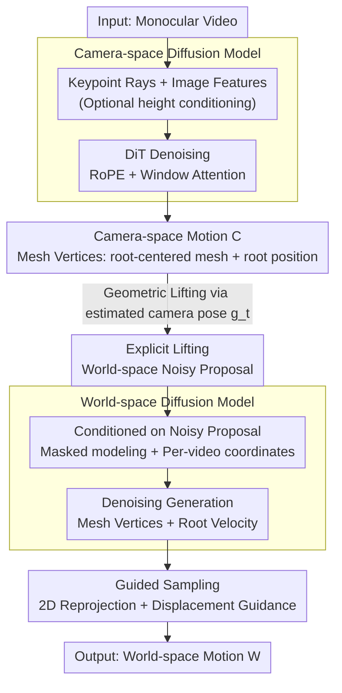

# DuoMo: Dual Motion Diffusion for World-Space Human Reconstruction

**Conference**: CVPR 2026  
**arXiv**: [2603.03265](https://arxiv.org/abs/2603.03265)  
**Code**: [Project Page](https://yufu-wang.github.io/duomo/)  
**Area**: 3D Vision  
**Keywords**: Human Motion Reconstruction, Diffusion Models, World Coordinates, Camera Space, Mesh Vertices

## TL;DR

DuoMo is proposed to decompose world-space human motion reconstruction into two independent diffusion models: a camera-space model extracts generalized camera-coordinate motion from video, and a world-space model refines lifted noisy proposals into globally consistent world-coordinate motion. By directly generating mesh vertex motion instead of SMPL parameters, it reduces W-MPJPE by 16% on EMDB and 30% on RICH.

## Background & Motivation

Reconstructing human motion in world coordinates from monocular video is fundamental for understanding human behavior, embodied AI, and human-computer interaction. Recent focus has shifted from isolated pose sequence analysis to recovering motion in a consistent world coordinate system. However, existing methods face a **Key Challenge**:

**Direct Prediction Methods** (WHAM, GVHMR, GENMO): End-to-end models learn the mapping from video to world-space motion. They capture strong global priors but suffer from poor generalization in complex in-the-wild scenes due to the limited diversity of laboratory-captured motion data.

**Lifting Methods** (TRAM, PromptHMR + post-processing): These estimate human pose in camera coordinates first, then "lift" them to world coordinates using estimated camera parameters. Camera-coordinate estimation generalizes well (leveraging abundant 2D supervision), but the motion prior is inherently local, failing to guarantee global physical plausibility (e.g., foot sliding, drifting).

**Key Challenge**: Generalization (from camera space) and global consistency (requiring world-space priors) are difficult to achieve simultaneously in a single model.

**Key Insight**: Instead of forcing a single end-to-end model to solve 2D-to-3D lifting and global consistency, the problem is decomposed into a two-stage generative process. Two core insights are:
- **Mechanism**: Use explicit geometric transformations (camera poses) to lift camera-space outputs to world coordinates, rather than making the model learn this relationship implicitly.
- **Goal**: Define world coordinates per video (using the first frame's camera pose as the origin) instead of a fixed canonical coordinate system (which requires error-prone ground plane alignment), denoising within these diverse reference frames.

## Method

### Overall Architecture

DuoMo bypasses SMPL parameters, using mesh vertices for motion representation throughout, and splits world-space reconstruction into two decoupled, serialized diffusion models:

1.  **Camera-space diffusion model** $\mathcal{D}_{\text{cam}}$: Extracts features from video to generate human motion $\mathbf{C}$ in camera coordinates.
2.  **Explicit Lifting**: Uses estimated camera poses $\mathbf{g}_t$ to lift $\mathbf{C}$ to world coordinates, obtaining noisy proposals $\hat{\mathbf{X}}_t^1 = \mathbf{g}_t(\mathbf{X}_t^t)$.
3.  **World-space diffusion model** $\mathcal{D}_{\text{world}}$: Conditioned on the noisy proposals, it generates clean, globally consistent world-space motion $\mathbf{W}$.
4.  **Guided Sampling**: During world-space sampling, 2D re-projection and displacement guidance are used to correct drift from velocity integration.

### Key Designs

1.  **Motion Representation—Direct Mesh Vertex Generation**: Bypassing the SMPL parametric model, it directly generates 3D coordinates for 595 mesh vertices (LOD6 sparse mesh). In camera space, each frame is decomposed into a root-centered mesh $\mathbf{P}_t$ and root position $\mathbf{r}_t$. In world space, since root position $\mathbf{r}_t^1$ is unbounded over time, the model generates velocity $\mathbf{v}_t^1 = \mathbf{r}_t^1 - \mathbf{r}_{t-1}^1$ and recovers position through integration. This general representation allows extension to other object categories.

2.  **Camera-space Diffusion Model**:
    -   **Input Features**: Two features are extracted per frame: (a) Dense keypoint detections converted to ray directions $\gamma(\mathbf{K}_t^{-1} \cdot \mathbf{L}_t)$ (implicitly encoding camera intrinsics), processed via MLP to get $\mathbf{f}_t^{\text{kpt}}$; (b) Image encoder features $\mathbf{f}_t^{\text{img}}$. These are summed.
    -   **Architecture**: Standard DiT + RoPE relative position encoding + Window Attention (supporting long-video inference without chunking).
    -   **Height conditioning**: Optionally takes body height to resolve scale ambiguity in monocular reconstruction. Height is encoded via MLP and added to the diffusion timestep embedding. Experiments show height conditioning improves MPJPE by ~10%.

3.  **World-space Diffusion Model**:
    -   Generates clean world-space motion conditioned on the lifted noisy motion $\hat{\mathbf{X}}_t^1$ (encoded via MLP).
    -   **Masked modeling**: During training, condition frames are randomly replaced with learnable mask tokens to simulate occlusions, enabling the model to generate plausible motion during invisible periods.
    -   **Per-video Coordinate System**: World coordinates use the first frame's camera as the origin, removing the need for alignment to a canonical space and simplifying in-the-wild video processing.

4.  **Guided Sampling**:
    -   **2D Reprojection Guidance**: $\mathcal{L}_{\text{repro}} = \sum_t \|\mathbf{L}_t - \mathbf{K}_t \cdot \mathbf{g}_t^{-1}(\mathbf{X}_t^1)\|$, projecting world-space motion back to the video to correct drift from velocity integration.
    -   **Displacement Guidance**: Ensures total displacement during long occlusions matches the character's disappearance and reappearance points.

### Loss & Training

Camera-space model loss:
$$\mathcal{L}_{\text{Camera}} = \mathcal{L}_{\text{vertices}} + \mathcal{L}_{\text{position}} + \mathcal{L}_{\text{joints}}$$

World-space model loss (trained after freezing the camera-space model):
$$\mathcal{L}_{\text{World}} = \mathcal{L}_{\text{vertices}} + \mathcal{L}_{\text{velocity}} + \mathcal{L}_{\text{contact}}$$

Where $\mathcal{L}_{\text{contact}}$ is a **training-time contact loss** (unlike traditional post-processing foot-locking): an L1 loss is applied to world-space foot vertices only during frames where they contact the ground, reducing foot skating artifacts at the source.

Both models are trained using AdamW for 1M steps, learning rate $10^{-4}$, batch size 256, and sequence length $T=120$.

## Key Experimental Results

### Main Results

| Dataset | Metric | DuoMo | Prev. SOTA | Gain |
| :--- | :--- | :--- | :--- | :--- |
| EMDB | W-MPJPE (mm)↓ | **167.1** | 202.1 (GENMO) | -16.3% |
| EMDB | Foot Skating↓ | **3.7** | 3.5 (GVHMR) | Comparable |
| EMDB | Jitter↓ | **8.7** | 16.7 (GVHMR) | -47.9% |
| RICH | W-MPJPE (mm)↓ | **80.8** | 118.6 (GENMO) | -31.9% |
| RICH | Foot Skating↓ | **3.1** | 3.0 (GVHMR) | Comparable |
| EMDB | PA-MPJPE (mm)↓ | **41.7** | 42.5 (GENMO) | -1.9% |

Note: DuoMo (w/ height) further improves to W-MPJPE 167.1 and MPJPE 59.5 on EMDB.

### Ablation Study

| Configuration | WA-MPJPE | W-MPJPE | RTE | Jitter | FS | Description |
| :--- | :--- | :--- | :--- | :--- | :--- | :--- |
| World-model only (one stage) | 153.5 | 445.1 | 6.7 | 9.1 | 4.8 | Poor precision; hard for single model to balance |
| Cam-model + Lifting | 67.0 | 180.2 | 1.3 | 32.6 | 9.2 | High precision but poor motion quality |
| **DuoMo** | **66.0** | **167.1** | **1.1** | **8.7** | **3.7** | Complementary strengths |

### Key Findings

-   **Value of Dual Prior**: Using only the world-space model provides strong motion priors but poor precision; using only lifting provides precision but severe jitter and foot skating. DuoMo combines both advantages.
-   **Mesh vs SMPL Representation**: World-Model-Mesh outperforms World-Model-SMPL in W-MPJPE by 17.7mm (164.8 vs 182.5), demonstrating that direct vertex generation is more accurate than parameter regression.
-   **Robustness**: In Egobody's occlusion scenarios, DuoMo’s W-MPJPE-Occ is 193.1, significantly better than the 688.1 of Cam+Lifting.
-   **Camera Noise Resilience**: W-MPJPE decreases much slower with increasing camera noise compared to the Lifting baseline; the world-space model acts as a "generative regularizer."
-   **Speed**: A 20s video (30FPS) takes approximately 36.5s on an H200 (2s keypoints + 3s dense keypoints + 30s image features + 1.5s diffusion).

## Highlights & Insights

-   The **decomposition strategy** is elegant: it avoids trying to solve everything with one model, allowing each to do what it does best—the camera-space model handles generalization, while the world-space model handles global consistency.
-   The **Per-video coordinate system** design is simple yet effective: it bypasses the difficulties of canonical coordinate alignment, allowing the model to handle various terrains.
-   **Training-time contact loss** is more elegant than traditional post-hoc foot-locking.
-   Directly generating mesh vertices by bypassing parametric models opens a more general path for motion modeling.

## Limitations & Future Work

-   Image feature extraction takes 30s (PromptHMR encoder), forming the primary bottleneck.
-   The world-space model outputs root velocity; integration over long sequences can accumulate error (though mitigated by guided sampling).
-   Requires camera intrinsics and estimated poses; performance in-the-wild depends on camera estimation quality.
-   Currently supports only single-person scenes; multi-person interaction is not discussed.
-   World-space model training data (AMASS+BEDLAM) primarily features flat-ground motion, with limited coverage for complex terrain like stairs or slopes.

## Related Work & Insights

-   Difference from GENMO: GENMO uses a single end-to-end conditional generative model, whereas DuoMo uses two decoupled generative models.
-   Difference from SLAHMR: SLAHMR uses optimization to post-process lifting results, while DuoMo uses generative models for refinement.
-   Insight: For complex visual estimation tasks, the strategy of "decomposition into multiple stages + injection of known geometric transforms" is more robust than end-to-end approaches.
-   Success of mesh vertex representation suggests: For non-human objects (animals, etc.), motion reconstruction is feasible without parametric models.

## Rating

-   **Novelty**: ⭐⭐⭐⭐ Dual diffusion decomposition + per-video coordinates + mesh vertex generation; innovative combination of ideas.
-   **Experimental Thoroughness**: ⭐⭐⭐⭐⭐ Multiple datasets (EMDB/RICH/Egobody), detailed ablation, and robustness analysis.
-   **Writing Quality**: ⭐⭐⭐⭐⭐ Clear problem definition, well-analyzed trade-offs, and fluid methodology narrative.
-   **Value**: ⭐⭐⭐⭐⭐ Significant breakthrough in world-space human reconstruction with substantial improvements and high generality.

<!-- RELATED:START -->

## Related Papers

- [\[CVPR 2026\] Iris: Bringing Real-World Priors into Diffusion Model for Monocular Depth Estimation](iris_bringing_realworld_priors_into_diffusion_model_for_monocular_depth_estimation.md)
- [\[CVPR 2026\] AnyLift: Scaling Motion Reconstruction from Internet Videos via 2D Diffusion](anylift_scaling_motion_reconstruction_from_internet_videos_via_2d_diffusion.md)
- [\[CVPR 2026\] Iris: Integrating Language into Diffusion-based Monocular Depth Estimation](iris_integrating_language_into_diffusion-based_monocular_depth_estimation.md)
- [\[CVPR 2026\] Fall Risk and Gait Analysis using World-Spaced 3D Human Mesh Recovery](fall_risk_gait_analysis_hmr.md)
- [\[CVPR 2026\] ForeHOI: Feed-forward 3D Object Reconstruction from Daily Hand-Object Interaction Videos](forehoi_feed-forward_3d_object_reconstruction_from_daily_hand-object_interaction.md)

<!-- RELATED:END -->
