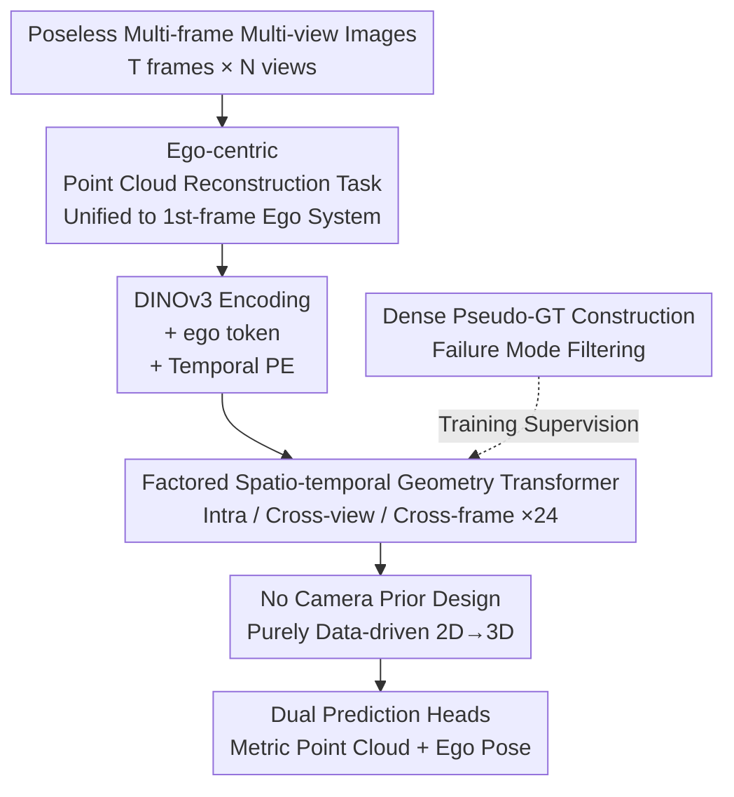

# DVGT: Driving Visual Geometry Transformer

**Conference**: CVPR 2026  
**Paper**: [CVF Open Access](https://openaccess.thecvf.com/content/CVPR2026/html/Zuo_DVGT_Driving_Visual_Geometry_Transformer_CVPR_2026_paper.html)  
**Code**: https://github.com/wzzheng/DVGT  
**Area**: 3D Vision / Autonomous Driving  
**Keywords**: Visual Geometry, Dense Point Cloud Reconstruction, Autonomous Perception, Spatio-temporal Attention, Ego-pose  

## TL;DR
DVGT is a visual geometry Transformer designed for autonomous driving. It takes a sequence of multi-frame multi-view images without pose information as input and end-to-end directly predicts **metric-scale** global dense 3D point cloud maps relative to the first frame's ego-coordinate system along with per-frame ego-poses. It requires no camera intrinsics/extrinsics and no post-hoc LiDAR-based scale alignment, outperforming both general geometry models (VGGT, CUT3R, MapAnything) and driving-specific models (Driv3R) across five driving datasets.

## Background & Motivation
**Background**: Vision-centric autonomous driving aims to recover 3D scene geometry from camera images. Prevailing methods either perform monocular depth estimation (outputting 2.5D, which cannot form a complete scene) or 3D occupancy prediction (voxelizing the space). The latter relies on precise camera intrinsics and extrinsics for explicit 2D→3D projection and uses ground-truth poses for temporal fusion to obtain global geometry.

**Limitations of Prior Work**: There are two major issues in this technical route. First, voxelization introduces quantization errors (typically around 0.5m), failing to represent fine-grained geometry. Second, explicit projection ties the model architecture strictly to specific sensor configurations (number of cameras, focal length, extrinsics)—changing the vehicle or camera layout requires retraining, preventing scalability across different vehicle models or scenarios. Meanwhile, recent general visual geometry models (DUSt3R, VGGT, etc.), though powerful in reconstruction, predict point clouds in **relative scale**, necessitating post-hoc alignment with LiDAR point clouds to obtain metric scale. Furthermore, they treat multi-frame multi-view images equally on a per-image basis, failing to exploit the specific spatio-temporal structure of driving scenes.

**Key Challenge**: The challenge lies in achieving both "independence from camera priors for cross-configuration generalization" and "direct output of metric scale without external sensor alignment." The explicit geometric projection paradigm inherently fails the former, while general geometry models inherently fail the latter.

**Goal**: To build a driving-specific dense visual geometry model that simultaneously satisfies: (1) no requirement for any camera parameters or geometric projection priors to adapt to arbitrary camera configurations; (2) direct output of metric-scale global dense point cloud maps and ego-poses in a single end-to-end forward pass with zero post-processing.

**Key Insight**: The authors observe that driving cameras are installed in a **fixed surround-view** configuration. Thus, it is unnecessary to estimate a camera pose for every single image as general methods do. Instead, the entire scene geometry can be uniformly expressed in the "first frame ego-coordinate system," estimating only one ego-pose per frame. This step decouples geometry representation from camera parameters, naturally gaining cross-configuration flexibility.

**Core Idea**: The task is redefined as "ego-centric point cloud reconstruction," supported by a geometry Transformer with factored spatio-temporal attention. It learns metric-scale 3D geometry directly from 2D features in a purely data-driven manner, completely discarding camera priors and post-hoc alignment.

## Method

### Overall Architecture
DVGT receives an image sequence $I=\{I_{t,n}\}$ of $T$ frames with $N$ views per frame. It outputs two things end-to-end: a global dense point cloud map $P=\{\hat P_{t,n}\}$ expressed in the first frame's ego-coordinate system (one metric-scale $(x,y,z)$ per pixel) and an ego-pose sequence $T_{ego}=\{\hat T_t\}$ relative to the first frame. The overall mapping is written as $(P, T_{ego}) = M(I)$.

The pipeline consists of three stages: An image encoder $E$ uses a pre-trained vision backbone (DINOv3) to encode each image into tokens, appends a learnable **ego token** per image for pose prediction, and adds frame-level temporal positional encodings. The geometry Transformer $F$ consists of 24 cascaded blocks, each sequentially executing "intra-view local attention → cross-view spatial attention → cross-frame temporal attention" to infer cross-image geometric relationships. Finally, the prediction head $H$ decodes refined image tokens into point cloud maps and aggregated ego tokens into ego-poses. The entire process lacks any spatial inductive bias (no 2D→3D projection module), allowing flexible adaptation to different camera layouts.

### Key Designs

**1. Ego-centric Metric Reconstruction: Decoupling Geometry from Camera Parameters**

General geometry models reconstruct point clouds in a reference camera coordinate system, tying the output to that camera's intrinsics and extrinsics, which fails when sensors change. DVGT instead expresses all points in the **ego-coordinate system of the reference frame (first frame)**: each point in $\hat P_{t,n}\in\mathbb{R}^{H\times W\times3}$ exists in the same ego-coordinate system, and only one ego-motion $\hat T_t\in SE(3)$ is predicted per frame (rather than camera poses per image). Since surround cameras are fixed on the vehicle, this representation is invariant to camera focal length, camera poses, and the number of views. The resulting geometry is dense and continuous (eliminating voxel quantization errors), pixel-aligned (covering foreground and background), and naturally supports arbitrary camera configurations.

**2. Factored Spatio-temporal Geometry Transformer: Factoring Global Attention into Intra-view/Cross-view/Cross-frame Steps for Real-time Efficiency**

Existing geometry models rely on global attention for pairwise interactions between all image tokens, which is computationally expensive. For 128 images (16 frames × 8 views), VGGT takes ~13.7s, which is unfeasible for real-time driving. DVGT exploits the strong spatio-temporal structure of driving inputs by **factoring** the expensive global attention into three targeted attentions executed sequentially within each Transformer block: **Intra-view local attention** operates only within single-image tokens to refine local features; **Cross-view spatial attention** allows tokens from different views of the same frame to attend to each other for spatial aggregation; **Cross-frame temporal attention** allows tokens from the same view across different frames to attend to each other to capture static consistency and temporal dynamics. This factoring reduces "every query against all tokens" to "only against structurally relevant subsets," reducing 128-image inference to ~4.0s while maintaining spatio-temporal fusion. The slightly reduced accuracy compared to global attention is compensated by temporal positional encodings.

**3. Dual Prediction Heads + No Camera Prior Design: Joint End-to-end Output of Metric Point Clouds and Ego-poses**

The geometry Transformer outputs refined image tokens $F'_{t,n}$ and ego tokens $E'_{t,n}$. The point cloud head $H_{point}$ decodes image tokens into metric point clouds $\hat P_{t,n}=H_{point}(F'_{t,n})$. Poses are obtained by first summing ego tokens within the same frame to aggregate a global representation $\bar E_t=\sum_{n=1}^{N}E'_{t,n}$, which is then fed into the pose head $H_{pose}$ to regress $\hat T_t=H_{pose}(\bar E_t)$. This architecture is theoretically independent of camera parameters and 2D→3D geometric projections; geometry is **learned from 2D image features in a data-driven manner**, which is the source of its robustness across different configurations. Moreover, the point clouds are directly output at metric scale for immediate downstream use without post-hoc LiDAR alignment.

**4. Dense Geometry Pseudo-GT Construction: Creating Trainable Labels via Failure Mode Analysis and Threshold Filtering**

Driving scenes lack dense geometry ground truth. Aligning monocular depth (MoGe-2) with projected sparse LiDAR depth (using the ROE algorithm) can create pseudo-labels, but they are often unreliable. The authors performed a rigorous failure mode analysis, identifying five typical failures: (a) semantic misjudgment (e.g., low-texture truck sides treated as sky), (b) photometric instability (exposure issues causing random depth), (c) structural ambiguity (e.g., billboards treated as having depth variation), (d) motion artifacts (blur from high speed/jitter), and (e) ill-posed alignment (extremely sparse/concentrated LiDAR points leading to poor scale estimation). They then designed three sets of filtering metrics: **Effective point overlap** (ratio of LiDAR points also judged valid by the depth model to filter a/b), **Standard depth metrics** (Abs Rel and $\delta<1.25$ to filter c/d), and **Alignment quality metrics** (filtering images with insufficient points or low spatial variance and constraining output scale/translation parameters to address e). This filtering pipeline was applied to five datasets (Waymo, nuScenes, OpenScene, DDAD, KITTI) to aggregate a large-scale mixed-domain training set with high-fidelity dense point clouds.

### Loss & Training
The end-to-end multi-task loss is $L = \lambda L_{epose} + L_{pmap}$. Since the numerical range of point clouds is much larger than poses, the pose loss is weighted by $\lambda=5.0$. The pose loss uses standard L1 on a 7D representation (3D translation + 4D rotation quaternion): $L_{epose}=\frac{1}{T}\sum_{t=1}^{T}\lVert\hat T_t - T_t\rVert_1$. The point cloud loss follows the VGGT formulation:

$$L_{pmap}=\sum_{t,n}\Big(\lVert\Sigma^P_{t,n}\odot(\hat P_{t,n}-P_{t,n})\rVert_2 + \lVert\nabla\hat P_{t,n}-\nabla P_{t,n}\rVert_2 - \alpha\log\Sigma^P_{t,n}\Big)$$

Where $\Sigma^P_{t,n}$ is an additional per-pixel uncertainty map predicted by the model, $\odot$ denotes element-wise multiplication with channel broadcasting, $\nabla$ is the 2D spatial gradient operator, and $-\alpha\log\Sigma^P_{t,n}$ is a regularization term to encourage confidence (low uncertainty), with $\alpha=2.0$.

## Key Experimental Results

### Main Results
3D point cloud reconstruction on five driving datasets (Acc/Comp in meters, lower is better; inference time measured on 128 images). Methods marked with * require Umeyama alignment with LiDAR to recover metric scale:

| Dataset | Metric | DVGT | VGGT* | Driv3R* | MapAnything |
|--------|------|------|-------|---------|-------------|
| nuScenes | Acc↓ / Comp↓ | **0.457 / 0.494** | 1.300 / 1.498 | 0.742 / 1.345 | 4.499 / 4.886 |
| OpenScene | Acc↓ / Comp↓ | **0.402 / 0.481** | 1.422 / 1.496 | 0.884 / 1.693 | 3.353 / 4.303 |
| DDAD | Acc↓ / Comp↓ | **0.751 / 1.009** | 1.741 / 2.473 | 0.950 / 1.259 | 8.015 / 8.493 |
| KITTI | Acc↓ | **0.846** | 1.154 | 0.864 | 1.880 |
| Inference | 128 Images | **~4.0s** | ~13.7s | ~9.0s | ~5.8s |

Ray depth results (distance from point to ego-center), where DVGT's advantage is even more pronounced:

| Dataset | Metric | DVGT | VGGT | Driv3R |
|--------|------|------|------|--------|
| nuScenes | Abs Rel↓ / δ<1.25↑ | **0.069 / 0.953** | 0.243 / 0.729 | 0.189 / 0.721 |
| OpenScene | Abs Rel↓ / δ<1.25↑ | **0.049 / 0.971** | 0.241 / 0.719 | 0.188 / 0.740 |
| Waymo | Abs Rel↓ / δ<1.25↑ | **0.106 / 0.921** | 0.176 / 0.811 | 0.168 / 0.770 |

Comparison with driving depth models on nuScenes (converted to depth maps for LiDAR GT comparison). DVGT requires neither scale post-processing nor GT poses:

| Method | Scale Recovery | Abs Rel↓ | δ<1.25↑ |
|------|------------|----------|---------|
| SelfOcc | Pose GT | 0.23 | 0.75 |
| OmniNWM | Pose GT | 0.23 | 0.81 |
| R3D3 | Extrinsics | 0.25 | 0.73 |
| **DVGT** | **None** | **0.13** | **0.86** |

### Ablation Study

Ablation of attention mechanisms (nuScenes, G=Global / L=Intra-view Local / S=Cross-view Spatial / T=Cross-frame Temporal / TE=Temporal PE):

| Config | Acc↓ | Abs Rel↓ | δ<1.25↑ | AUC@30↑ | Time |
|------|------|----------|---------|---------|------|
| L+G (incl. Global) | 1.131 | 0.178 | 0.789 | 74.6 | ~8.2s |
| L+S+T (Factored, no TE) | 1.584 | 0.261 | 0.676 | 68.4 | ~4.0s |
| L+S+T+TE (Full) | 1.458 | 0.227 | 0.725 | 77.6 | ~4.0s |

Ablation of coordinate normalization scale (nuScenes, linear division by 1/10/100 or non-linear arcsinh compression for target coordinates):

| Scale | Acc↓ | Abs Rel↓ | δ<1.25↑ | AUC@30↑ |
|------|------|----------|---------|---------|
| 1 (base) | 1.584 | 0.261 | 0.676 | 68.4 |
| **10× (Adopted)** | **1.349** | **0.195** | **0.756** | 79.8 |
| 100× | 1.646 | 0.257 | 0.694 | 80.7 |
| arcsinh | 1.411 | 0.222 | 0.719 | 80.8 |

### Key Findings
- **Factored attention is a core efficiency-accuracy trade-off**: Pure factoring (L+S+T) is twice as fast as global attention (L+G) (4.0s vs 8.2s) but shows a significant drop in performance ($\delta$ from 0.789→0.676). Adding Temporal PE (L+S+T+TE) recovers $\delta$ to 0.725 and surpasses AUC@30 to 77.6 without increasing latency, demonstrating that explicit temporal order is key to compensating for factoring losses.
- **Scale normalization is sensitive to numerical stability**: Driving scenes have a massive dynamic range (often >100m). Directly regressing large coordinates pushes parameters to high magnitudes and destabilizes training. 10× linear division performed best; 100× compresses near-field geometry too much; arcsinh, while adaptive, distorts the inherent geometric structure.
- **Data sampling weights determine performance differences**: DVGT performed relatively less strongly on Waymo. The authors attribute this to sampling imbalance—Waymo is 5× the size of other datasets but given equal weight, and its distribution is less similar to the dominant OpenScene than nuScenes is.

## Highlights & Insights
- **"Fixed Surround View → Unified Ego-centric Representation"** is the key insight for removing camera priors from the model. Because camera layouts are fixed on the vehicle, one can estimate only ego-motions instead of per-image camera poses, allowing a single set of weights to handle arbitrary configurations.
- **Direct Metric Scale with Zero Post-processing** is the fundamental differentiator from general models. While VGGT/CUT3R requires post-hoc alignment, DVGT provides metric results in a single forward pass (Comp 0.481 on OpenScene vs 4.303 for MapAnything).
- **Failure-mode-driven Pseudo-label Filtering** turns "training data creation" into a systematic engineering process. Instead of arbitrary thresholds, the authors derived filtering metrics from five specific failure modes.

## Limitations & Future Work
- The authors acknowledge that Waymo performance is limited by unoptimized sampling weights.
- Ego-pose prediction on KITTI was slightly less accurate, attributed to KITTI's high-overlap stereo setup, which provides fewer constraints on full 3D and ego-motion compared to surround-view configurations.
- ⚠️ The training pseudo-GT relies on the quality of monocular depth (MoGe-2) and LiDAR alignment. While the pipeline filters bad samples, systematic biases in pseudo-labels (e.g., far-field depth) may still limit model accuracy.
- Factored attention has an upper bound accuracy lower than global attention. TE narrows but does not eliminate this gap; further closing this gap while maintaining speed is an open question.

## Related Work & Insights
- **vs VGGT / CUT3R (General Models)**: These use global attention for per-image geometry and output relative scale. DVGT uses factored spatio-temporal attention and ego-centric coordinates for metric scale, being faster (4.0s vs 13.7s) and more accurate.
- **vs Driv3R (Driving-specific)**: DVGT leads in Acc/depth metrics on most datasets and is significantly faster in inference.
- **vs TPVFormer / Occupancy methods**: These rely on explicit 2D→3D projection and voxelization, suffering from quantization and camera-parameter binding. DVGT predicts continuous dense point clouds without a projection module, achieving finer geometry and better generalization.
- **vs SelfOcc / OmniNWM (Driving Depth)**: These rely on GT poses or median scaling to recover scale. DVGT requires neither and still achieves superior Abs Rel.

## Rating
- Novelty: ⭐⭐⭐⭐⭐ The combination of ego-centric reconstruction, no camera priors, and direct metric scale substantively restructures the driving geometry perception paradigm.
- Experimental Thoroughness: ⭐⭐⭐⭐⭐ Comprehensive comparisons across five datasets and three tasks (point cloud, depth, pose).
- Writing Quality: ⭐⭐⭐⭐ Clear methodology and intuitive diagrams; robust failure mode analysis.
- Value: ⭐⭐⭐⭐⭐ High value for deployment: direct metric output, cross-configuration generalization, and real-time feasibility.

<!-- RELATED:START -->

## Related Papers

- [\[CVPR 2026\] Fast Spatial Tracking with Visual Geometry Transformer](fast_spatial_tracking_with_visual_geometry_transformer.md)
- [\[CVPR 2026\] OmniVGGT: Omni-Modality Driven Visual Geometry Grounded Transformer](omnivggt_omni-modality_driven_visual_geometry_grounded_transformer.md)
- [\[ICLR 2026\] Streaming Visual Geometry Transformer](../../ICLR2026/3d_vision/streaming_visual_geometry_transformer.md)
- [\[CVPR 2026\] MVGGT: Multimodal Visual Geometry Grounded Transformer for Multiview 3D Referring Expression Segmentation](mvggt_multimodal_visual_geometry_grounded_transformer_for_multiview_3d_referring.md)
- [\[ICLR 2026\] Quantized Visual Geometry Grounded Transformer](../../ICLR2026/3d_vision/quantized_visual_geometry_grounded_transformer.md)

<!-- RELATED:END -->
