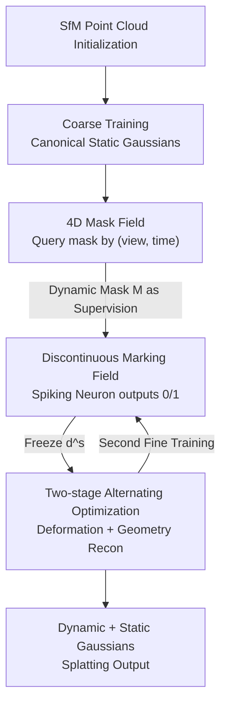

# Dynamic-Static Decomposition for Novel View Synthesis of Dynamic Scenes with Spiking Neurons

**Conference**: CVPR 2026  
**Paper**: [CVF Open Access](https://openaccess.thecvf.com/content/CVPR2026/html/Dai_Dynamic-Static_Decomposition_for_Novel_View_Synthesis_of_Dynamic_Scenes_with_CVPR_2026_paper.html)  
**Code**: https://zju-bmi-lab.github.io/SpikeMaskGS-homepage (Project Page)  
**Area**: 3D Vision / Dynamic Scene Novel View Synthesis  
**Keywords**: Dynamic-Static Decomposition, 3D Gaussian Splatting, Spiking Neurons, 4D Mask Field, Side-view Evaluation  

## TL;DR
Addressing the pain points of "inaccurate mask priors" and "improper label representation" in dynamic-static decomposition for 3DGS, this paper employs a 4D spatio-temporal fine-grained mask field for supervision and utilizes spiking neurons to optimize dynamic-static labels directly into discrete 0/1 values. This approach precisely classifies Gaussians into dynamic or static categories, achieving SOTA rendering quality in fine-grained motion, motion boundaries, and side-view evaluations while maintaining real-time frame rates.

## Background & Motivation
**Background**: Novel View Synthesis (NVS) for dynamic scenes has achieved efficiency and realism through 3D Gaussian Splatting (3DGS). However, modeling all Gaussians as dynamic leads to massive VRAM usage, slow rendering, and severe overfitting. Consequently, the mainstream approach shifts toward **dynamic-static decomposition**: assigning a "dynamic/static" label to each Gaussian—static Gaussians are built once, and only dynamic Gaussians undergo temporal deformation—balancing efficiency and accuracy.

**Limitations of Prior Work**: The quality of decomposition depends entirely on the accuracy of label assignment, where existing pipelines fail in two stages. First, **inaccurate mask priors**: one type of method uses pre-trained segmentation models to generate masks view-by-view, ignoring multi-view consistency and resulting in spatial coarseness; another type uses the same prior for all timestamps, ignoring temporal changes and causing over-segmentation of dynamic regions. Second, **improper label representation**: current methods assign a continuous floating-point attribute $d^c \in \mathbb{R}$ to represent the "probability of being dynamic," followed by post-process discretization using a fixed threshold. Gaussians near boundaries naturally have intermediate probabilities, making them extremely sensitive to thresholds and prone to misclassification.

**Key Challenge**: The accumulation of these two problems causes dynamic Gaussians to be erroneously used for static regions and vice-versa. The model then "compensates" by overfitting these misclassified regions on input views. Once shifted to a **side view** (with a large discrepancy from training views), the unrealistic geometric reconstruction is exposed, leading to a sharp drop in image quality.

**Goal**: To make "dynamic-static label assignment" accurate, split into two sub-problems: (1) creating a spatio-temporally fine-grained mask supervision; (2) ensuring labels are discrete during optimization to eliminate uncertain post-processing.

**Key Insight**: The authors noted that masks should not be a set of discrete 2D images but a continuous 4D field queryable by "view + time"; similarly, labels should not be "thresholded after continuous optimization" but should use a mechanism that **inherently outputs discrete values**—the spikes fired by spiking neurons are exactly 0/1.

**Core Idea**: Use a **4D Mask Field** to generate spatio-temporally fine-grained dynamic-static supervision, and then utilize **spiking neurons** to optimize the dynamic-static marking field directly into discrete labels, achieving precise end-to-end assignment for Gaussians.

## Method

### Overall Architecture
The input is a set of synchronized multi-view videos, aiming to reconstruct a dynamic 3D Gaussian field for high-quality NVS via dynamic-static decomposition. In addition to geometric attributes $\mathcal{G}_{geo}=\{\mu,q,s,\sigma,c\}$, each Gaussian carries a dynamic-static attribute $d^s$, such that $\mathcal{G}_i=\{\mu_i,q_i,s_i,i,\sigma_i,c_i,d^s_i\}$, where deformation only affects geometric terms $\Delta\mathcal{G}_i=\{\Delta\mu_i,\Delta q_i,\Delta s_i,\Delta\sigma_i,0,0\}$.

The process follows two steps: first, SfM initializes the point cloud followed by **coarse training** to obtain static Gaussians in canonical space; second, **fine training** begins, where a **spatio-temporal fine-grained mask field** generates masks as supervision to guide a **discontinuous dynamic-static marking field** (implemented via spiking neurons) to optimize each Gaussian's label to 0/1. Once labels are fixed, dynamic Gaussians pass through a deformation module and are merged with static Gaussians for splatting. Crucially, label optimization and geometric reconstruction are **alternated and mutually frozen** to avoid interference.

### Key Designs

**1. Spatio-temporal Fine-grained Mask Field: Upgrading 2D masks to queryable 4D fields**

To address "inaccurate mask priors"—where per-view segmentation lacks consistency and single-timestamp priors lack temporal change—this work constructs a 4D mask field $\mathcal{F}$ that generates a specific 2D mask $M^{v,t}=\mathcal{F}(v,t)$ for any view $v$ and time $t$. For supervision, the authors use the logic: "reconstruct a dynamic scene with static 3D Gaussians; where reconstruction fails is dynamic." They first calculate the rendering residual $r(v,t)=\|I_{v,t}-I^{gt}_{v,t}\|_1$. Pixels with residuals below a threshold $\tau_r$ are marked as static, yielding a coarse mask $M^{i,j}_{coarse}(v,t)=r^{i,j}(v,t)\le\tau_r$.

However, in early training, under-optimized high-frequency static regions also show large residuals and can be misjudged as dynamic. Utilizing the property that "dynamic regions are spatially smooth," the authors apply a $3\times3$ box filter $\mathcal{B}$ to the coarse mask: $M^{i,j}_{diffuse}(v,t)=\big(M^{i,j}_{coarse}(v,t)\circledast\mathcal{B}_{3\times3}\big)\ge\tau_\circledast$. Only pixels whose neighbors are mostly static are confirmed as static, filtering out scattered high-frequency false positives. Combined with a temporal mask $M^{i,j}_{temp}(v)$ calculated via pixel-wise color intensity standard deviation over time, these form the fine-grained static mask $M^{i,j}_{fine}(v,t)$. The field is trained with the following loss to encourage residual divergence:

$$\mathcal{L}_{\mathcal{F}}^{v,t}=\sum_{i,j}M^{i,j}_{fine}(v,t)\odot r(v,t)^{i,j}.$$

During query, the inverted $M_{fine}(v,t)$ yields the dynamic mask $M^{v,t}$ to supervise the marking field. Compared to 2D image sets, the 4D form captures fine spatio-temporal distributions, such as finger movements.

**2. Discontinuous Dynamic-Static Marking Field: Using spiking neurons for discrete 0/1 optimization**

To address "improper label representation"—where continuous $d^c$ optimization followed by thresholding creates a gap and sensitivity—this work explicitly models a binary marking field. The core is a trainable binary mapping $d^s=\mathcal{S}(d^c)$, where $d^s\in\{0,1\}$ (1 for dynamic, 0 for static).

The mapping is implemented with Spiking Neurons: using an Integrate-and-Fire (IF) model, input is accumulated into a membrane potential, firing a spike when it exceeds threshold $V_{th}$. Spikes are inherently binary. Simplified to a single time step, the forward pass is a Heaviside step $d^s=H(d^c-V_{th})$ (with $V_{th}=0$). During forward rendering, alpha-blending renders the discrete labels $d^s$ into a per-pixel dynamic map $\hat{M}=\sum_{i\in N}d^s_i\alpha_i\prod_{j=1}^{i-1}(1-\alpha_i)$, supervised against $M$. Since $H(\cdot)$ is non-differentiable, an arctangent function is used as a surrogate gradient:

$$\frac{\partial d^s_i}{\partial d^c_i}=\frac{\beta}{2\left(1+\left(\frac{\pi}{2}\beta d^c_i\right)^2\right)},$$,

where $\beta$ is a hyperparameter. Gradients propagate via the surrogate to update $d^c$, ensuring stable training. Compared to STE or Gumbel-Softmax, which use inaccurate gradients ($y=1$) for Heaviside, the arctangent surrogate produces cleaner boundaries and higher quality.

**3. Two-stage Alternating Optimization: Mutual freezing of labels and geometry**

Simultaneous optimization of decomposition (updating $d^s$) and reconstruction (updating $\mathcal{G}_{geo}$) leads to interference. Training is thus split into "Coarse Static Initialization + Fine Dynamic Refinement." Coarse training performs static reconstruction on the first frame (disabling move attributes, ~5000 iterations). Fine training alternates: first, optimize the marking field to enforce discrete $d^s$ while freezing other attributes; then, freeze $d^s$ and optimize $\mathcal{G}_{geo}$ for dynamic reconstruction.

This "Fine Training" cycle is executed twice—first on coarse output, and again after another 5000 iterations (marking field for 1000/5000 and reconstruction for 5000/5000 iterations respectively). This decoupling ensures "accurate labeling first, then geometry refinement under fixed labels."

### Loss & Training
The reconstruction stage uses standard rendering loss $\mathcal{L}_{render}=(1-\lambda)\mathcal{L}_1+\lambda\mathcal{L}_{SSIM}$. The marking field stage supervises discrete labels $d^s$ by minimizing Binary Cross Entropy between the predicted dynamic map $\hat{M}$ and the 4D mask field target $M$:

$$\mathcal{L}_{mask}=-M\cdot\log(\hat{M})-(1-M)\cdot\log(1-\hat{M}).$$

First-frame point clouds are generated via SfM. Parameters: $\tau_r=\mathrm{PERCENTILE}(r,0.7)$, $\tau_\circledast=0.5$. Experiments were conducted on a single RTX 3090.

## Key Experimental Results

The authors propose a **Side View Setting**: while N3DV and MeetRoom usually center test views near training views, this setting places test views at the outer periphery to reveal "true geometric reconstruction" vs "overfitting." Metrics include PSNR, LPIPS, FPS, and optimization time on N3DV, MeetRoom, and VRU.

### Main Results
Comparison on N3DV / MeetRoom under Side View Setting (PSNR↑, LPIPS↓, FPS↑):

| Method | N3DV PSNR | N3DV LPIPS | N3DV FPS | MeetRoom PSNR | MeetRoom LPIPS | MeetRoom FPS |
|------|-----------|------------|----------|---------------|----------------|--------------|
| 4DGS | 26.19 | 0.0753 | 37 | 26.27 | 0.0649 | 43 |
| 3DGStream | 25.55 | 0.0740 | 230 | 25.68 | 0.0916 | 201 |
| Ex4DGS | 26.10 | 0.0667 | 94 | 25.10 | 0.0764 | 129 |
| Swift4D | 25.80 | 0.0619 | 124 | 25.16 | 0.0676 | 101 |
| **Ours** | **26.30** | **0.0615** | 137 | **26.64** | **0.0626** | 154 |

Improvements are more significant on the complex VRU dataset:

| Method | PSNR↑ | LPIPS↓ | FPS↑ |
|------|-------|--------|------|
| 4DGS | 27.87 | 0.191 | 12 |
| Swift4D | 29.03 | 0.187 | 77 |
| **Ours** | **29.43** | **0.170** | 77 |

Other methods suffer from overfitting in side views; Ours generalizes better. Accurate labeling also reduces redundant dynamic Gaussians, leading to higher FPS.

### Ablation Study
Ablation on N3DV "cut beef" (Side View), where SN denotes Spiking Neurons:

| Config | PSNR↑ | LPIPS↓ | FPS↑ | Note |
|------|-------|--------|------|------|
| w/o 4D Mask Field & SN | 25.23 | 0.0699 | 95 | Remove both |
| w/o 4D Mask Field | 25.50 | 0.0661 | 129 | No fine-grained mask, overfitting |
| w/o SN (Variant A) | 25.91 | 0.0757 | 126 | Use Swift4D marking field |
| w/o SN (Variant B) | 25.93 | 0.0701 | 106 | Use Sigmoid + Threshold |
| **Full model** | **26.39** | **0.0656** | 140 | Complete model |

### Key Findings
- **Complementary Modules**: Removing the 4D Mask Field drops PSNR from 26.39 to 25.50. Replacing SN with sigmoid+threshold (Variant B) or Swift4D implementation (Variant A) limits PSNR to ~25.9, proving that "direct discrete optimization" yields significant gains.
- **Discrete Optimization Matters**: Spiking neurons outperform STE and Gumbel-Softmax, as the latter use inaccurate surrogate gradients for $H(\cdot)$, leading to incorrect optimization directions.
- **Efficiency via Accuracy**: Better decomposition leads to fewer redundant dynamic Gaussians, allowing FPS to increase alongside quality rather than being a trade-off.
- **Side View Reveals Overfitting**: Methods show similar performance in standard settings, but old methods fail in side views. This validates the motivation that misclassification leads to hidden overfitting.

## Highlights & Insights
- **Linking "Discrete Labels" to Spiking Neurons**: Dynamic labels are binary (0/1), and SN spikes are inherently binary. Using single-step IF with an arctangent surrogate eliminates the "continuous-to-discrete" gap. This "matching task discreteness with neuromorphic hardware properties" is a clever paradigm shift.
- **4D Mask Field + Diffusion Filtering**: While using reconstruction residuals is known, the box filter diffusion to distinguish "under-optimized static details" from "real motion" is a simple, effective trick leveraging spatial smoothness.
- **Side View Evaluation Contribution**: It exposes the long-hidden "overfitting to training views" issue in dynamic NVS. This provides a better evaluation standard that the dynamic reconstruction community can adopt.

## Limitations & Future Work
- **Limitations**: The method relies on clear inputs for mask priors; color discrepancies between views can break spatio-temporal consistency, degrading masks and rendering.
- **Observed Constraints**: Ablations are limited to the "cut beef" scene; generalizability needs broader validation. ⚠️ Quantitative results for standard (non-side-view) settings are placed in supplementary materials, making it harder to verify standard gains in the main text.
- **Future Directions**: Incorporating color consistency (e.g., estimating exposure/white balance) into the mask field; exploring multi-time-step spiking neurons for finer modeling of boundary uncertainty.

## Related Work & Insights
- **vs Swift4D**: Swift4D uses a single mask prior for all timestamps and continuous labels; Ours adds spatio-temporal granularity via 4D masks and ensures discreteness via SN, leading to better side-view PSNR/LPIPS.
- **vs Ex4DGS / 3DGStream**: These use continuous attributes and thresholding, resulting in boundary artifacts; Ours is cleaner at boundaries and fine-grained motions without sacrificing FPS.
- **vs STE / Gumbel-Softmax**: Compared to other discrete optimization methods, Ours uses a more accurate surrogate gradient for the Heaviside function, proving the specific "how" of optimization is more critical than just "being discrete."

## Rating
- Novelty: ⭐⭐⭐⭐ Mapping spiking neurons to dynamic-static optimization is a self-consistent and novel angle.
- Experimental Thoroughness: ⭐⭐⭐⭐ Three datasets + Side View settings + discrete optimization comparisons are robust, though ablated scenes are limited.
- Writing Quality: ⭐⭐⭐⭐ Clear mapping between pain points and solutions.
- Value: ⭐⭐⭐⭐ Simultaneously improves quality and speed while contributing a more rigorous evaluation paradigm.

<!-- RELATED:START -->

## Related Papers

- [\[CVPR 2026\] RF4D: Neural Radar Fields for Novel View Synthesis in Outdoor Dynamic Scenes](rf4dneural_radar_fields_for_novel_view_synthesis_in_outdoor_dynamic_scenes.md)
- [\[CVPR 2026\] MoVieS: Motion-Aware 4D Dynamic View Synthesis in One Second](movies_motion-aware_4d_dynamic_view_synthesis_in_one_second.md)
- [\[ICLR 2026\] Dynamic Novel View Synthesis in High Dynamic Range](../../ICLR2026/3d_vision/dynamic_novel_view_synthesis_in_high_dynamic_range.md)
- [\[ICCV 2025\] DeGauss: Dynamic-Static Decomposition with Gaussian Splatting for Distractor-free 3D Reconstruction](../../ICCV2025/3d_vision/degauss_dynamic-static_decomposition_with_gaussian_splatting_for_distractor-free.md)
- [\[CVPR 2026\] GaussianFluent: Gaussian Simulation for Dynamic Scenes with Mixed Materials](gaussianfluent_gaussian_simulation_for_dynamic_scenes_with_mixed_materials.md)

<!-- RELATED:END -->
