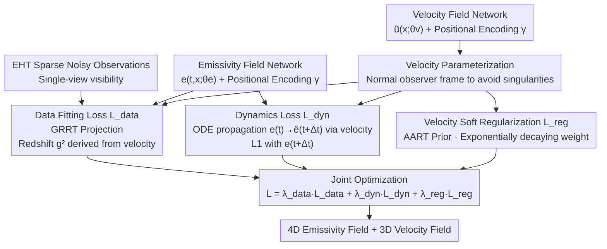

<!-- Generated by src/gen_stubs.py -->
# Dynamic Black-hole Emission Tomography with Physics-informed Neural Fields

**Conference**: CVPR2026  
**arXiv**: [2602.08029](https://arxiv.org/abs/2602.08029)  
**Code**: Not open-sourced  
**Area**: 3D Vision / Computational Imaging / Scientific Imaging  
**Keywords**: Black hole imaging, Neural Radiance Fields, Physics-informed constraints, 4D Tomography, Event Horizon Telescope

## TL;DR

Ours proposes PI-DEF, utilizing physics-informed coordinate neural networks to simultaneously reconstruct the 4D (time + 3D) emissivity field and 3D velocity field of gas near a black hole. Under sparse EHT measurements, it significantly outperforms BH-NeRF, which relies on hard-constrained Keplerian dynamics.

## Background & Motivation

1. **Static imaging is successful; dynamic 3D imaging is the next frontier**: EHT has successfully captured static 2D images of M87* and Sgr A*, but static images are complex 2D projections of 3D emissivity and cannot reveal the physical nature of the dynamic 3D environment.
2. **Extremely underdetermined inverse problem**: EHT can only observe from a single viewpoint, and measurements are highly sparse and corrupted by noise. 4D tomographic reconstruction is a severely ill-posed problem.
3. **Dynamic sources increase difficulty**: Radiating gas moves, appears, and disappears over time, making it impossible to simply aggregate measurements across time to improve reconstruction quality.
4. **Forward model partially unknown**: Light propagation depends on the unknown fluid dynamics near the black hole, and the measurement forward model is not fully known.
5. **BH-NeRF assumptions are too strong**: The previous sole method, BH-NeRF, assumes Keplerian dynamics. However, near the black hole, strong gravity and electromagnetic activity cause fluid dynamics to deviate from Keplerian models, and it cannot handle newly appearing radiation.
6. **Significant scientific significance**: Recovering the dynamic 3D emissivity field near a black hole can reveal unseen parts of the universe, helping to test General Relativity and infer physical parameters such as black hole spin.

## Method

### Overall Architecture

PI-DEF addresses an extremely ill-posed inverse problem: the Event Horizon Telescope (EHT) provides only single-view, sparse, and noisy observations of radiating gas near a black hole. The goal is to reconstruct its time-varying 4D (time + 3D) emissivity field along with a 3D velocity field. Previous work, BH-NeRF, assumed gas strictly followed Keplerian dynamics, which is untenable in strong gravity regions and fails to handle radiation appearing within the observation window.

PI-DEF uses two coordinate neural networks to represent the 4D emissivity field $e(t, \mathbf{x}; \theta_e)$ and the 3D velocity field $\tilde{u}^i(\mathbf{x}; \theta_v)$, respectively. Both employ positional encoding $\gamma$ to enhance high-frequency expressiveness. These two fields are jointly optimized via three loss terms to fit observations while satisfying fluid continuity and soft physical priors. The total loss is $\mathcal{L} = \lambda_{\text{data}}\mathcal{L}_{\text{data}} + \lambda_{\text{dyn}}\mathcal{L}_{\text{dyn}} + \lambda_{\text{reg}}\mathcal{L}_{\text{reg}}$. The key insight is that the physical model acts as a decayable soft regularization rather than a hard constraint.

### Key Designs

**1. Data Fitting Loss: Anchoring Two Fields to Observations via GRRT**

This term aligns the reconstruction with real measurements. It projects the emissivity field onto the image plane using General Relativistic Ray Tracing (GRRT) to simulate EHT visibility measurements, performing a Gaussian likelihood fit with observations. The ingenuity lies in deriving the redshift factor $g^2$ in the projection from the velocity field. Thus, a single $\mathcal{L}_{\text{data}}$ constrains both the emissivity and velocity networks simultaneously—if the velocity estimation is wrong, the redshift is wrong, resulting in a poor fit. Geodesics are computed using the kgeo library, and measurements are simulated with eht-imaging.

**2. Dynamics Loss: Linking Emissivity Across Time via Velocity Fields**

This is the core innovation addressing the challenge that dynamic sources prevent simple temporal aggregation of measurements. It propagates the emissivity field $e(t)$ over $\Delta t$ using an ODE solver based on the predicted velocity from the velocity network to obtain $\hat{e}(t+\Delta t)$. This is compared against the direct prediction $e(t+\Delta t)$ via an L1 loss, forcing temporal self-consistency—how emissivity flows must match the velocity field. To prevent a "blurry blob" from bypassing this loss, Gaussian kernel blurring is applied before comparison. It essentially formulates fluid continuity as a differentiable consistency constraint.

**3. Exponentially Decaying Velocity Soft Regularization: Trusting Physics Then Data**

Under extreme underdetermination, velocity can rarely be recovered purely from data, yet hard-coding theoretical models repeats the failures of BH-NeRF. PI-DEF takes a middle ground: using the AART velocity model (including sub-Keplerian velocity and radial fall-in, controlled by $(\beta_\phi, \beta_r, \xi)$) as a soft prior. An L2 regularization $\mathcal{L}_{\text{reg}}$ is applied to the estimated velocity, but the weight decays exponentially during training ($\lambda_{\text{init}}=10^6 \to \lambda_{\text{final}}=10$). Early stages use the prior to guide velocity into a reasonable range, while later stages allow data to drive the refinement, enabling correction even if the prior doesn't perfectly match the true dynamics.

**4. Numerically Stable Velocity Parameterization: Avoiding Singularities Near the Event Horizon**

If velocity is directly estimated in the four-velocity frame, numerical issues arise where $u^t$ is undefined. PI-DEF instead estimates in the numerically stable normal observer frame. Furthermore, the emissivity field is explicitly time-dependent, allowing it to capture radiation appearing within the observation window—a capability lacking in BH-NeRF, which only models an initial field with fixed propagation. Ablations show that velocity networks parameterized by radius $r$, $(r, \theta)$, or $(x, y, z)$ all yield reasonable results, suggesting that axi-symmetric constraints are not strictly necessary.

## Key Experimental Results

### Emissivity Reconstruction Accuracy (5 random test scenarios, ngEHT measurements)

| Method | PSNR (dB) ↑ | MSE (×10⁻⁵) ↓ |
|------|-------------|----------------|
| **PI-DEF (Ours)** | **37.3 ± 2.3** | **2.3 ± 0.2** |
| 4D-MLP | 35.4 ± 0.5 | 3.8 ± 0.4 |
| BH-NeRF | 34.0 ± 1.9 | 4.9 ± 0.8 |

- Even when the velocity prior is mismatched (assuming pure sub-Keplerian without radial fall-in), PI-DEF significantly outperforms BH-NeRF and the purely data-driven 4D-MLP.
- BH-NeRF fails severely near the black hole due to hard Keplerian constraints.

### Ablation Study

- **Measurement Sparsity**: ngEHT (23 telescopes) significantly improves reconstruction quality compared to EHT 2025 (12 telescopes) and EHT 2017 (8 telescopes). EHT 2025 offers limited improvement over 2017.
- **Velocity Recovery**: In high emissivity density regions (>65th percentile), PI-DEF's radial and azimuthal velocity recovery matches the ground truth well, even with mismatched initial assumptions. Velocity recovery in low emissivity regions remains unconstrained.
- **Velocity Network Parameterization**: Reasonable results are obtained using $r$, $(r, \theta)$, or $(x, y, z)$ parameterizations, indicating axi-symmetric constraints are not essential.
- **Real Noise**: Works under realistic Gaussian noise at Sgr A* total flux levels (~2.3 Jy).
- **Atmospheric Noise**: Using closure phase and amplitudes instead of complex visibility handles atmospheric phase errors, though reconstruction accuracy decreases.
- **Spin Inference**: The data fitting loss is sensitive to assumed black hole spin; the loss is minimized at the correct spin $a=0.2$, proving PI-DEF can be used to infer physical parameters.

## Highlights

- **Soft vs. Hard Constraints**: Using physical velocity models as exponentially decaying soft regularization rather than hard constraints balances prior guidance with robustness against modeling errors. This design is elegant and generalizable.
- **Dual-field Joint Reconstruction**: Simultaneously recovering the 4D emissivity field and 3D velocity field, with a dynamics loss establishing physical consistency between them.
- **Outstanding Scientific Value**: Achievement of dynamic 3D reconstruction in regions very close to the black hole (not just distant flares) for the first time, demonstrating the potential for spin inference.
- **CV-driven Fundamental Physics**: Combining the NeRF paradigm with GRRT geodesics serves as an exemplary case of CV technology pushing the frontiers of astrophysics.

## Limitations & Future Work

- Validated only on simulated data; not yet applied to real EHT data.
- Ignores the slow-light effect (finite speed of light propagation) for gases moving at relativistic speeds.
- Ignores attenuation due to absorption and scattering.
- Velocity recovery is difficult very close to the event horizon where emissivity contribution is minimal due to the redshift factor $g^2 \to 0$.
- Currently does not jointly optimize black hole spin and inclination; only a grid-search proof-of-concept for spin was performed.
- Gaussian Splatting was excluded due to its inability to handle the appearance and disappearance of hotspots, though its efficiency might be leveraged via dynamic point management in the future.

## Related Work & Insights

| Method | Temporal Modeling | Velocity Constraint | New Emitters | Representative Work |
|------|---------|---------|---------|--------|
| BH-NeRF | Initial field + Keplerian propagation | Hard (Keplerian) | ✗ | ECCV 2022 |
| 4D-MLP | 4D coordinate network | None | ✓ | Baseline |
| **PI-DEF** | **4D coordinate network** | **Soft (AART decay reg.)** | **✓** | **Ours** |

Difference from standard NeRF dynamic scene methods: PI-DEF handles an extreme setting of curved light paths (GRRT) + single view + dynamic sources, rather than linear ray tracing + multi-view standard scenes.

## Rating

- Novelty: ⭐⭐⭐⭐⭐ — First to introduce physics-informed soft constraints to black hole 4D tomography; dual-field joint reconstruction and decay regularization are novel.
- Experimental Thoroughness: ⭐⭐⭐⭐ — Comprehensive simulations (sparsity, noise, spin inference, ablation), but lacks real-world data validation.
- Writing Quality: ⭐⭐⭐⭐⭐ — Clear explanation of physical background and methods; high-quality visualizations suitable for non-astrophysics readers.
- Value: ⭐⭐⭐⭐⭐ — A benchmark work of CV technology aiding fundamental physics with direct application prospects for EHT science.

<!-- RELATED:START -->

## Related Papers

- [\[CVPR 2026\] Neural Dynamic GI: Random-Access Neural Compression for Temporal Lightmaps in Dynamic Lighting Environments](neural_dynamic_gi_random-access_neural_compression_for_temporal_lightmaps_in_dyn.md)
- [\[CVPR 2026\] GaussFusion: Improving 3D Reconstruction in the Wild with A Geometry-Informed Video Generator](gaussfusion_improving_3d_reconstruction_in_the_wild_with_a_geometry-informed_vid.md)
- [\[CVPR 2026\] AssemblyBench: Physics-Aware Assembly of Complex Industrial Objects](assemblybench_physics-aware_assembly_of_complex_industrial_objects.md)
- [\[CVPR 2026\] Evidential Neural Radiance Fields](evidential_neural_radiance_fields.md)
- [\[CVPR 2026\] Dynamic-Static Decomposition for Novel View Synthesis of Dynamic Scenes with Spiking Neurons](dynamic-static_decomposition_for_novel_view_synthesis_of_dynamic_scenes_with_spi.md)

<!-- RELATED:END -->
