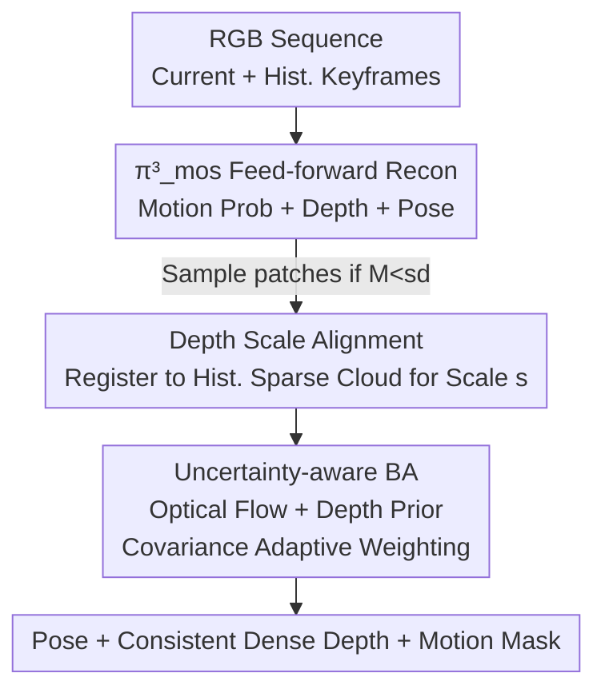

# Dynamic Visual SLAM using a General 3D Prior

**Conference**: CVPR 2026  
**Paper**: [CVF Open Access](https://openaccess.thecvf.com/content/CVPR2026/html/Zhong_Dynamic_Visual_SLAM_using_a_General_3D_Prior_CVPR_2026_paper.html)  
**Code**: https://github.com/PRBonn/Pi3MOS-SLAM  
**Area**: 3D Vision  
**Keywords**: Dynamic SLAM, Feed-forward Reconstruction Model, Moving Object Segmentation, Monocular Pose Estimation, Scale Alignment  

## TL;DR
This work tightly couples classic patch-based optical flow SLAM (DPV-SLAM) with a feed-forward 3D reconstruction foundational model ($\pi^3$): it uses motion masks predicted by the feed-forward model to filter dynamic pixels, stabilizes bundle adjustment with its depth priors, and resolves the inter-batch scale drift of the feed-forward model via scale alignment with the SLAM sparse point cloud. This achieves accurate poses, clean motion segmentation, and scale-consistent dense depth in dynamic scenes.

## Background & Motivation

**Background**: Monocular Visual Odometry/SLAM has evolved over decades, primarily through geometric methods (feature points or optical flow + bundle adjustment), with learning components integrated in recent years. Another line of research involves feed-forward reconstruction models (DUSt3R, VGGT, $\pi^3$, etc.), which regress dense structures and camera poses directly from a set of RGB images in a single forward pass, leveraging strong geometric priors learned from large-scale multi-view training.

**Limitations of Prior Work**: Geometric SLAM typically assumes static scenes, treating moving objects as outliers, which leads to pose failure in dynamic urban or indoor environments due to incorrect data association. Furthermore, they perform sparse reconstruction for real-time efficiency, providing limited geometric detail and poor robustness in monocular settings lacking priors. Feed-forward models are more robust to dynamics, but offline multi-view versions (VGGT, $\pi^3$) suffer from explosive VRAM and latency as view counts increase, making them unusable online. Incremental versions (CUT3R, etc.), while maintaining constant VRAM, exhibit severe trajectory drift over long sequences and lack the stability of classic SLAM. Both paradigms have critical flaws.

**Key Challenge**: Geometric SLAM is accurate but lacks robustness to dynamics and lacks priors; feed-forward models are robust and have priors but drift over long sequences, with scale consistency only maintained within a single batch (depth scale changes if a frame is processed with different neighbors). Their strengths are complementary, but naive integration (e.g., directly trusting feed-forward poses) inherits drift and scale inconsistency.

**Goal**: Construct an online monocular SLAM system that simultaneously outputs (1) accurate camera poses, (2) scale-consistent dense depth, and (3) precise moving object masks in dynamic environments.

**Key Insight**: The authors observe that large-scale feed-forward reconstruction models implicitly possess the capability to distinguish dynamic/static regions (as reconstruction requires understanding scene motion). Therefore, instead of training a segmenter from scratch, this latent capability can be "activated" via a lightweight module, while geometric SLAM ensures long-sequence stability and absolute scale.

**Core Idea**: A motion segmentation head is added to $\pi^3$ to create $\pi^3_{\text{mos}}$. Its motion masks and depth priors are fed into patch-based bundle adjustment. Simultaneously, the sparse point cloud maintained by SLAM is used to perform cross-batch scale alignment for the feed-forward depth. Finally, an uncertainty weight based on pose covariance adaptively determines the reliance on geometry versus priors.

## Method

### Overall Architecture
The system is built upon the monocular SLAM framework DPV-SLAM, integrated with the feed-forward model $\pi^3_{\text{mos}}$. Given a dynamic RGB sequence $I=\{I_i\in\mathbb{R}^{H\times W\times3}\}_{i=1}^N$, it outputs online poses $T_i\in SE(3)$ and scale-consistent dense depths $D_i$.

For each incoming frame $i$, it is batched with selected historical keyframes and passed through $\pi^3_{\text{mos}}$ to obtain per-pixel motion probabilities $M_i$ and depth $D_i$. Pixels with $M_i < s_d$ are classified as static. **K patches are randomly sampled only from static background regions** to compute optical flow with historical frames, establishing geometric constraints naturally free from moving object interference. The predicted depth $D_i$ is then aligned with the sparse point cloud of previously optimized patches to solve the cross-batch scale ambiguity of $\pi^3_{\text{mos}}$. Finally, the aligned depth prior and optical flow constraints are fed into a sliding window for joint optimization of poses and patch depths via uncertainty-aware bundle adjustment.

### Key Designs

**1. $\pi^3_{\text{mos}}$: Activating Motion Segmentation as a Byproduct of Reconstruction**

This addresses the pain point that dynamic SLAM requires object segmentation, yet standalone segmenters generalize poorly across categories. The authors extend $\pi^3$ with a Motion Segmentation (MOS) head. Given a set of images, DINOv2 is used to tokenize each image into patches, followed by alternating layers of "intra-frame self-attention + global self-attention" for cross-view fusion. Three lightweight heads regress relative poses, depth maps, and per-pixel motion probabilities:

$$\pi^3_{\text{mos}}(\mathcal{I})=\big(T_i,\,D_i,\,C_i,\,M_i\big)_{i=1}^N$$

Where $C_i$ is depth confidence and $M_i\in[0,1]^{H\times W}$ is motion probability. During training, **original $\pi^3$ weights are frozen, and only the new MOS head is trained** using binary cross-entropy on Kubric, Dynamic Replica, Virtual KITTI 2, and HOI4D. This is effective because reconstruction training forces the model to understand "what is moving." Compared to DUSt3R-based methods which rely solely on image pairs and optical flow, $\pi^3_{\text{mos}}$ utilizes multi-view context and DINOv2 semantic features, yielding superior segmentation quality and robustness.

**2. Cross-batch Scale Alignment: Using SLAM Sparse Clouds as Scale Anchors**

This addresses a critical issue where feed-forward models maintain scale consistency within a batch but drift between batches. The authors' approach involves selecting $N-1$ historical keyframes with consistent scales, passing them with the current frame into $\pi^3_{\text{mos}}$ to get $D_i$ and $C_i$. Feed-forward inverse depths $\hat d^i_k$ and confidence $c^i_k$ are sampled at the center of each historical patch $P^i_k$. A scalar scale $s$ is estimated to align these to SLAM-optimized patch inverse depths $d^i_k$:

$$s^*=\arg\min_s\sum_{i=1}^{N-1}\sum_{k=1}^{K}c^i_k\,\rho\!\left(d^i_k-s\,\hat d^i_k\right)$$

Using Huber loss $\rho(\cdot)$, with an initial value based on a weighted median of $d_k/\hat d_k$ for outlier resistance. The current frame depth $D_N$ is then scaled by $s^*$. Crucially, patches used for scale estimation are **all sampled from static regions** (filtered by mask from design 1), preventing motion interference and maintaining scale consistency over long sequences.

**3. Uncertainty-aware BA: Covariance-driven Weighting for Geometry vs. Prior**

Pure geometric BA fails when camera translation is insufficient, leading to weak optical flow constraints and uncertain patch depths. The authors add a depth prior loss to the standard patch-based BA reprojection loss $\mathcal{L}_{\text{BA}}$:

$$\mathcal{L}=\mathcal{L}_{\text{BA}}+\sum_{f=1}^{F}w_f\sum_{k=1}^{K}\left\|d_k-s_f\hat d^f_k\right\|^2$$

To prevent the prior from degrading accuracy when geometry is already precise, the weight $w_f$ must be adaptive. Leveraging MegaSaM's approach, weights are adjusted based on state estimation uncertainty. The marginal covariance of inverse depth is derived from the normal equations:

$$\Sigma_d=C^{-1}+C^{-1}E^\top\Sigma_T E\,C^{-1},\qquad \Sigma_T=\big(B-EC^{-1}E^\top\big)^{-1}$$

Where $\Sigma_T$ is the camera pose covariance (computed efficiently via Cholesky of the Schur complement). Individual inverse depth variance is taken from the diagonal of $\Sigma_d$, converted to a scale-invariant relative standard deviation $\sigma^{\text{rel}}_{z_j}=\sigma_{d_j}/d_j$. The per-frame median $\sigma^{\text{rel}}_{z,\text{med}}$ is mapped to weight $w_f$ via a sigmoid:

$$w_f=1/\big(1+\exp(-\alpha(\sigma^{\text{rel}}_{z,\text{med}}-\beta))\big)$$

$\alpha, \beta$ control the slope and offset. Additionally, points with relative standard deviation exceeding threshold $t_\sigma$ are excluded during scale estimation (design 2). This mechanism ensures the prior is only utilized when necessary, reducing ATE from 2.52 to 2.20 in ablation studies.

## Key Experimental Results

### Main Results

Camera tracking accuracy (ATE RMSE ↓, cm) on Bonn RGB-D dynamic dataset (Monocular comparison):

| Method | Balloon | Crowd | Person | Moving2 | Avg. |
|------|---------|-------|--------|---------|------|
| DROID-SLAM | 7.5 | 5.2 | 4.3 | 4.0 | 4.91 |
| MonST3R | 5.4 | 5.4 | 11.9 | 7.4 | 7.3 |
| MegaSaM | 3.7 | 1.6 | 4.1 | 3.4 | 3.51 |
| WildGS-SLAM | 2.8 | 1.5 | 3.1 | 2.2 | 2.36 |
| **Ours** | **2.6** | **1.3** | 3.2 | **1.9** | **2.20** |

On the Sintel dataset with fast motion and low overlap (ATE/RTE/RRE):

| Method | ATE↓ | RTE↓ | RRE↓ |
|------|------|------|------|
| DPVO | 11.5 | 7.2 | 1.98 |
| MonST3R | 7.8 | 3.8 | 0.49 |
| BA-Track | 3.4 | 2.3 | 0.12 |
| WildGS-SLAM | 18.2 | 9.4 | 1.57 |
| **Ours** | **1.9** | **1.0** | **0.11** |

WildGS-SLAM performs similarly in small indoor scenes but degrades severely on Sintel due to its reliance on overlapping views. In motion segmentation (DAVIS-16/17), $\pi^3_{\text{mos}}$ significantly outperforms the strong baseline Easi3R without post-processing: DAVIS-17 JM 70.6 vs 56.5.

### Ablation Study

Component-wise ablation on Bonn / Wild-SLAM (ATE RMSE ↓, cm):

| Config | Moving mask | Depth prior | Uncert. BA | Bonn | Wild |
|------|:--:|:--:|:--:|------|------|
| (a) | ✗ | ✗ | ✗ | 4.82 | 1.23 |
| (b) | ✗ | ✓ | ✓ | 3.91 | 3.78 |
| (c) | ✓ | ✗ | ✗ | 2.67 | 0.98 |
| (d) | ✓ | ✓ | ✗ | 2.52 | 0.82 |
| (e) | ✓ | ✓ | ✓ | **2.20** | **0.42** |

Video depth estimation: Ours achieves the best results among **online** methods on Bonn (0.054 / 0.985) and the lowest Abs Rel (0.287) on Sintel, approaching the performance of offline $\pi^3$ which requires processing the entire sequence as a single batch.

### Key Findings
- **The motion mask is the foundation**: Accuracy drops sharply without the mask (a, b). Specifically, using the prior without a mask (b) worsens results on Wild (1.23 to 3.78) because dynamic patches pollute the optimization.
- **Masking alone is powerful**: Configuration (c), using only $\pi^3_{\text{mos}}$ masks, outperforms most baselines (Bonn 2.67), validating the effectiveness of activating latent segmentation.
- **Uncertainty weighting is the finishing touch**: Moving from fixed weights (d) to adaptive (e) provides a clear boost, especially on Wild (0.82 to 0.42), confirming the value of selective prior trust.
- **Cross-dataset stability**: This is one of the few methods ranking first in both slow indoor (Bonn) and fast outdoor (Sintel) scenarios, attributed to the complementarity of geometry and priors.

## Highlights & Insights
- **"Foundation tasks enable emergent sub-problems"**: A key takeaway is that once "scene reconstruction" is solved at scale, motion segmentation emerges as a byproduct that can be activated with minimal training.
- **Clever direction of scale alignment**: Instead of trusting feed-forward absolute scales, the method uses SLAM sparse clouds as anchors to calibrate feed-forward depth, preserving long-sequence consistency while gaining dense detail.
- **Reusable covariance-driven weighting**: The mechanism of deriving pose/depth covariance from Schur complements and mapping it to prior weights via sigmoid is a transferable strategy for fusing geometric optimization with learned priors.
- **Low-cost extension**: Freezing $\pi^3$ while only training the MOS head suggests any strong reconstruction backbone can be endowed with the ability to detect motion at low cost.

## Limitations & Future Work
- **Dependency on the base model**: The quality of $\pi^3_{\text{mos}}$ is bounded by $\pi^3$. It may fail on extreme out-of-distribution dynamics or complex non-rigid motion.
- **Keyframe selection and batching**: Scale alignment depends on the selection of historical keyframes; the impact of these strategies on drift in low-overlap scenarios is not fully explored in the main text.
- **Hyperparameter sensitivity**: The sensitivity of results to thresholds like $s_d$, $\alpha$, $\beta$, and $t_\sigma$ is not analyzed.
- **Future directions**: Exploring online adaptive mask thresholds, differentiable scale alignment for end-to-end training, and validation on larger-scale outdoor dynamic data.

## Related Work & Insights
- **vs. WildGS-SLAM**: Both segment dynamic scenes, but WildGS-SLAM relies on online MLP training with DINOv2 features, requiring repeated observations and overlapping views. Ours is feed-forward, requires no online training, and handles fast motion (Sintel) better.
- **vs. MegaSaM**: MegaSaM predicts motion probabilities for DROID-SLAM but is an offline, high-memory method. Ours is online and constant-memory, integrating priors via uncertainty weighting rather than replacement.
- **vs. LEAP-VO / BA-Track**: These rely on long-term point trajectories, which fail if dynamic objects dominate. Ours uses dense motion masks, proving more robust to large-area/non-rigid motion.
- **vs. MonST3R / CUT3R**: These pure feed-forward methods suffer from drift and lack inter-batch scale consistency. Ours uses geometric BA for stability and sparse points for scaling, achieving offline-level depth consistency online.

## Rating
- Novelty: ⭐⭐⭐⭐⭐ Integration of emergent segmentation with geometric scale anchors is highly innovative.
- Experimental Thoroughness: ⭐⭐⭐⭐⭐ Covers segmentation, tracking, and depth across five datasets with clear ablations.
- Writing Quality: ⭐⭐⭐⭐ Motivation and mechanisms are clear; KF strategies could be more detailed.
- Value: ⭐⭐⭐⭐⭐ Achieving SOTA in dynamic SLAM while maintaining constant memory is highly practical.

<!-- RELATED:START -->

## Related Papers

- [\[CVPR 2026\] Flow4DGS-SLAM: Optical Flow-Guided 4D Gaussian Splatting SLAM](flow4dgs-slam_optical_flow-guided_4d_gaussian_splatting_slam.md)
- [\[CVPR 2026\] ODGS-SLAM: Omnidirectional Gaussian Splatting SLAM](odgs-slam_omnidirectional_gaussian_splatting_slam.md)
- [\[CVPR 2026\] AERGS-SLAM: Auto-Exposure-Robust Stereo 3D Gaussian Splatting SLAM](aergs-slam_auto-exposure-robust_stereo_3d_gaussian_splatting_slam.md)
- [\[CVPR 2026\] Unblur-SLAM: Dense Neural SLAM for Blurry Inputs](unblur-slam_dense_neural_slam_for_blurry_inputs.md)
- [\[CVPR 2026\] SCE-SLAM: Scale-Consistent Monocular SLAM via Scene Coordinate Embeddings](sce-slam_scale-consistent_monocular_slam_via_scene_coordinate_embeddings.md)

<!-- RELATED:END -->
