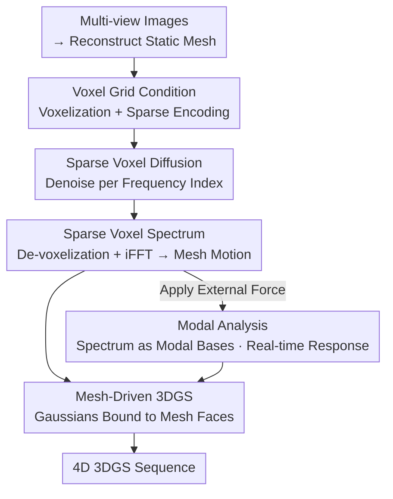

# DynamicTree: Interactive Real Tree Animation via Sparse Voxel Spectrum

**Conference**: CVPR 2026  
**Paper**: [CVF Open Access](https://openaccess.thecvf.com/content/CVPR2026/html/Li_DynamicTree_Interactive_Real_Tree_Animation_via_Sparse_Voxel_Spectrum_CVPR_2026_paper.html)  
**Code**: Project Page https://dynamictree-dev.github.io/DynamicTree.github.io/ (Code TBD)  
**Area**: 3D Vision  
**Keywords**: Tree animation, 3D Gaussian Splatting, sparse voxel spectrum, modal analysis, 4D generation  

## TL;DR
This work compresses the motion of real scanned 3DGS trees into a set of "sparse voxels + frequency spectrum." A feed-forward diffusion model is used to generate long-term mesh motion in a single pass to drive the Gaussians. This approach avoids the spatio-temporal inconsistency common in 4D generation methods, is a hundred times faster than MPM physical simulation, and allows for real-time drag-and-drop interaction at approximately 18ms/frame by utilizing the spectrum as modal bases.

## Background & Motivation

**Background**: Transforming static reconstructions (NeRF / 3DGS) into dynamic and interactive scenes is a fundamental requirement for VR, gaming, and world simulation. As core elements of natural landscapes, trees sway with the wind and rebound when dragged, significantly impacting immersion. Currently, there are two primary paths for animating 3DGS trees: **4D Generation** (e.g., 4DGen, SV4D), which optimizes 4D representations using 2D motion priors from Video Diffusion Models (VDM); and **Physical Simulation** (e.g., PhysGaussian, PhysFlow), which couples 3DGS into MPM (Material Point Method) solvers.

**Limitations of Prior Work**: 4D generation relies on 2D priors, often leading to spatio-temporal inconsistency and artifacts in fine structures; complex structures like trees with numerous branches and leaves are particularly prone to "collapsing." Furthermore, per-scene optimization is slow. In physical simulation, MPM solvers often assume uniform material properties for easier parameter tuning, which results in coordinated global motion but flattens leaf-level local elastic details. Most critically, the computational cost is extremely high (PhysFlow takes ~15600 ms/frame), making real-time applications impossible. Traditional tree animation methods (e.g., Windy-Tree) are limited to manually authored synthetic models and cannot be transferred to real scanned trees.

**Key Challenge**: A reconstructed 3DGS tree typically consists of hundreds of thousands of Gaussians. Directly predicting long-term motion per Gaussian per frame is unsustainable regarding VRAM and training data. Additionally, there is a significant synthetic-to-real gap between synthetic training data and real scanned test targets. To achieve a "fast, consistent, and interactive" system, a **compact yet robust 3D motion representation** for scanning noise is essential.

**Core Idea**: The authors represent tree motion using a **sparse voxel spectrum**. First, mesh motion is aggregated by voxels (all vertices within a voxel share a displacement) to eliminate spatial redundancy. Then, an FFT is performed along the time axis, retaining only the top-$K$ low-frequency components to remove temporal redundancy. A feed-forward sparse voxel diffusion model is then trained to directly generate this spectrum. This spectrum can not only reconstruct long-term mesh motion but also serve as **modal bases** for real-time modal analysis interaction under external forces.

## Method

### Overall Architecture

Given multi-view images of a static tree, the goal is to output a deformed 3DGS sequence $G=\{G^t\}_{t=0}^{T}$ by predicting the position, rotation, and scale increments $D_g$ for each Gaussian over time. The authors model this as **conditional generation** rather than per-scene optimization, splitting the pipeline into two stages:

1.  **Mesh Motion Generation in Frequency Domain**: Reconstruct a mesh from multi-view images → Voxelize into a sparse voxel grid as a condition → Generate the sparse voxel spectrum $S$ component by component using a sparse voxel diffusion model → De-voxelization + inverse FFT to recover dense mesh motion $D_m$;
2.  **Motion Transfer to 3DGS**: Bind Gaussian primitives to mesh faces. When the mesh moves, the bound Gaussians deform accordingly to obtain $D_g$.

Furthermore, the generated spectrum can be directly reused as modal bases, enabling real-time response to external forces (e.g., dragging) via modal analysis without re-running solvers.

### Key Designs

**1. Sparse Voxel Spectrum Representation: Dual Compression of Long-term Motion via "Spatial Voxels + Temporal Frequency"**

This is the core of the paper, addressing the bottleneck of predicting hundreds of thousands of Gaussians frame-by-frame. The authors apply two layers of compression. Spatially, they observe that tree motion exhibits spatial sparsity (neighboring vertices on the same leaf or branch move similarly). Thus, mesh motion $D_m\in\mathbb{R}^{3\times N}$ is aggregated into sparse voxels $D_v\in\mathbb{R}^{3\times n}$, where **all vertices within a voxel share the same displacement**. $n$ is typically an order of magnitude smaller than the vertex count $N$. Compared to methods using only a few global motion bases, voxel granularity preserves leaf-level details. Temporally, inspired by Generative-Dynamics, the motion of each voxel is transformed via FFT into a complex frequency domain representation $\hat{D}_v\in\mathbb{C}^{3\times n\times T}$. Since the quasi-periodic motion of trees is dominated by the first $K$ low-frequency components, retaining only $\hat{D}^{(K)}_v\in\mathbb{C}^{3\times n\times K}$ ($K=16$) allows for nearly lossless reconstruction. The final spectrum representation is denoted as $S=\{s_i\in\mathbb{R}^{6\times n}\mid i=1,...,K\}$, where 6 corresponds to the real and imaginary parts in $x, y, z$ directions. Mesh motion is recovered via:

$$D_m = \text{Dev}(\text{iFFT}(S))$$

where iFFT is the inverse FFT along the time dimension, and $\text{Dev}(\cdot)$ is the de-voxelization that broadcasts sparse voxel displacements back to dense mesh vertices. This representation achieves three goals: removing spatial+temporal redundancy, unifying irregular mesh sampling into a regular voxel structure (mitigating the synthetic-to-real gap), and naturally supporting subsequent modal analysis.

**2. Voxel Grid Condition + Sparse Voxel Diffusion: A Feed-forward Generator Trained from Scratch**

To narrow the synthetic-to-real domain gap, the authors do not use images directly as conditions. Instead, they use off-the-shelf methods to reconstruct a mesh $M=(V,F)$ and voxelize it into a sparse voxel grid $G$ as input. Voxelization helps smooth out the noise differences between real and synthetic vertices. Based on the XCube sparse U-Net, the diffusion model is **trained from scratch**. First, several sparse convolution blocks encode $G$ into a geometric condition $g\in\mathbb{R}^{d\times n}$. During generation, denoising is performed **per frequency component**, using both the frequency index and $g$ as conditions. Specifically, denoising starts from pure Gaussian noise and iterates for $L$ steps, concatenating $g$ with the noisy latent $s_l$ and injecting frequency embeddings into each ResBlock of the U-Net. This allows the model to output the entire spectrum in a single feed-forward pass, significantly faster than per-scene optimization.

**3. Local Spectrum Smoothness Loss + Two-stage Training: Constraining "Physical Plausibility" in the Frequency Domain**

Using only the diffusion loss $L_{DM}$ (standard noise prediction $\|\epsilon-\epsilon_\theta(s_l;l,g,f)\|^2$) leads to under-constrained tasks, resulting in divergent motion or geometric scattering. Adopting the physical prior that neighboring points tend to move together, the authors propose the **Local Spectrum Smoothness (LSS) loss**, which penalizes differences in spectral parameters between neighboring points in the frequency domain, weighted by spatial distance:

$$L_{\text{LSS}} = \frac{1}{N}\sum_{i=1}^{N}\sum_{j\in\mathcal{N}(i)} e^{-\alpha d_{ij}}\left(\|\text{Re}_i-\text{Re}_j\| + \lambda\|\text{Im}_i-\text{Im}_j\|\right)$$

where $\mathcal{N}(i)$ represents the $\kappa$-nearest neighbors of $i$, $d_{ij}$ is the Euclidean distance, and $\lambda$ controls the weight of the imaginary part. To prevent instability, a **two-stage training** strategy is employed: first training with only $L_{DM}$ (e.g., for 40,000 steps), followed by $L_{LSS}$ for refinement (another 30,000 steps). Ablations show this "relaxed-then-constrained" sequence is vital for eliminating scattering and enhancing generalization.

**4. Mesh-Driven 3DGS + Modal Analysis Interaction: One Spectrum for Both Generation and Real-time Interaction**

After generating the spectrum, it is applied to the Gaussians. De-voxelization and iFFT produce the time-domain mesh motion $D_m$. Following the GaMeS approach, Gaussians are **re-parameterized and bound to mesh faces**. For each triangular face $f_j=\{v_1,v_2,v_3\}$, the Gaussian mean $\mu$, rotation $r$, and scale $s$ are parameterized by vertex positions (e.g., $\mu=\alpha_1 V_1+\alpha_2 V_2+\alpha_3 V_3$). Thus, 3DGS deformation $D_g$ is directly calculated from $D_m$. For interaction, the mesh vertices are modeled as a mass-spring-damper system. The equation of motion $M\ddot{d}+C\dot{d}+Kd=f(t)$ is decoupled into $|P|$ independent second-order equations in modal space: $m_i\ddot{q}_i+c_i\dot{q}_i+k_iq_i=f_i$. Integrated via explicit Euler, the response in physical space is reconstructed:

$$D(t)=\sum_{k=1}^{K}\phi_k\cdot q^k(t)$$

Critically, **the mesh motion spectrum calculated in Section 3 can be directly used as the modal shapes $\phi$**. Consequently, external force interaction does not require a separate solver. The entire interaction loop takes ~18ms/frame (13ms modal analysis + 2.57ms Gaussian deformation + 2.65ms rendering), achieving true real-time performance compared to the thousands of milliseconds required by MPM.

### Loss & Training
- Main Loss: Diffusion noise prediction $L_{DM}$ + Local spectrum smoothness $L_{LSS}$ ($\alpha=\lambda=0.5$, 5 nearest neighbors).
- Two-stage: 40,000 steps with $L_{DM}$ only, then 30,000 steps adding $L_{LSS}$.
- Config: 8× RTX 4090 for 3.5 days, batch size 48; Spectral resolution $128^3$, encoder input resolution $512^3$, condition dimension $d=128$; 5 Gaussians bound per face; AdamW optimizer, initial lr $1\times10^{-4}$ halved every 20,000 steps; Inference via DDIM with 100 steps.

## Key Experimental Results

The test set includes 13 real scanned trees. Metrics include CLIP-I (per frame vs. input view for realism) and CLIP-T (between adjacent frames for temporal coherence) using CLIP ViT-B/32 (lower is better). A double-blind user study evaluates Motion Authenticity (MA), Motion Complexity (MC), 3D Structural Consistency (SC), and Visual Quality (VQ).

### Main Results

3D Animation Comparison (Top) + Interactive Simulation Comparison (Bottom):

| Task | Method | CLIP-I↓ | CLIP-T↓ | Overall (User)↑ | Sim Time (ms/frame) |
|------|------|---------|---------|----------------|------------------|
| 3D Animation | 4DGen | 0.0103 | 0.0094 | 1.7% | - |
| 3D Animation | SV4D 2.0 | 0.0081 | 0.0057 | 3.7% | - |
| 3D Animation | **Ours** | **0.0052** | **0.0021** | **94.6%** | - |
| Interactive Sim | PhysGaussian | 0.0061 | 0.0087 | 20.2% | 1,800 |
| Interactive Sim | PhysFlow | 0.0047 | 0.0025 | 31.9% | 15,600 |
| Interactive Sim | **Ours** | **0.0038** | **0.0017** | **47.9%** | **18.22** |

In 3D animation, the method significantly outperforms the 4D generation baselines. In interactive simulation, it achieves the best CLIP metrics and is ~100× faster than PhysGaussian and ~850× faster than PhysFlow. Note that in the user study for interaction, SC (Structural Consistency) is slightly lower than PhysGaussian, but VQ (Visual Quality) is substantially higher.

Comparison with traditional tree animation (Weber [58], using clean 3D models):

| Method | MA↑ | MC↑ | SC↑ | VQ↑ | Overall↑ |
|------|-----|-----|-----|-----|----------|
| Weber [58] | 48.57% | 37.14% | 45.71% | 34.29% | 42.14% |
| **Ours** | **51.43%** | **62.86%** | **54.29%** | **65.71%** | **57.86%** |

Even against clean inputs, this method shows better motion complexity and visual quality and can handle real scanned trees without manual pre-processing.

### Ablation Study

Spectral Resolution Ablation:

| Resolution | Batch | Training Time | CLIP-I↓ |
|--------|-------|----------|---------|
| $32^3$ | 192 | 27h | 0.0097 |
| $64^3$ | 96 | 43h | 0.0069 |
| $128^3$ | 48 | 85h | **0.0039** |
| $256^3$ | 24 | 156h | 0.0037 |
| $512^3$ | 12 | 261h | 0.0056 |

CLIP-I first decreases and then increases with resolution. Improvements beyond 128 are marginal while costs skyrocket; $512^3$ actually degrades. This reflects the synthetic-to-real gap: at high resolutions, the voxel grid mimics point clouds, magnifying the noise in real vertices. $128^3$ provides spatial smoothing by letting multiple noise points share motion within a voxel, better bridging the domain gap.

### Key Findings
- **Training Strategy is Paramount**: Using only $L_{DM}$ leads to geometric divergence; only the two-stage "first $L_{DM}$, then $L_{LSS}$" strategy eliminates this and improves generalization.
- **Resolution Sweet Spot**: $128^3$ balances performance, cost, and the domain gap. Higher resolutions fail by over-fitting to the noise of real scanned vertices.
- **Paradigm Shift in Speed**: The 18ms/frame speed comes from the "spectrum as modal bases" reuse, bypassing iterative physical solvers like MPM.

## Highlights & Insights
- **Dual-Purpose Representation**: The sparse voxel spectrum acts as both the generation target and the modal bases $\phi$ for analysis. This unification of "long-term motion generation" and "real-time interaction" is a brilliant conceptual bridge.
- **Voxelization Bonus**: Voxelization not only compresses dimensions but also provides natural spatial smoothing, effectively mitigating the synthetic-to-real gap.
- **Frequency Domain Constraints**: Using 16 low-frequency components for quasi-periodic motion and using LSS loss to enforce the physical intuition that "neighbors move together" effectively addresses the under-constrained nature of the generation problem.

## Limitations & Future Work
- Modal analysis is essentially a **global linear approximation**. Global shared vibration modes may cause synchronized motion in distant regions.
- Mesh-driven 3DGS deformation occasionally shows artifacts in **large deformation areas**; this might be mitigated by binding more Gaussians to relevant faces.
- The 4DTree dataset primarily covers swaying; samples for **large-scale deformations** are scarce.
- Evaluation relies heavily on CLIP distances and user studies; there is a lack of objective error comparison against ground truth physics (e.g., wind tunnels).

## Related Work & Insights
- **vs. 4D Generation**: These methods often suffer from spatio-temporal inconsistency on complex trees. This work learns motion priors directly in 3D space, leading to superior consistency and speed.
- **vs. Physics Simulation**: MPM solvers are expensive and often simplify materials. This work achieves real-time speeds while preserving leaf-level local elastic details.
- **vs. Traditional Methods**: Traditional methods depend on manually authored synthetic models. The voxel representation in this work is more robust to scanning errors and works directly on real trees.

## Rating
- Novelty: ⭐⭐⭐⭐⭐ The "one representation for both generation and interaction" is a paradigm-level insight.
- Experimental Thoroughness: ⭐⭐⭐⭐ Extensive comparisons and ablations, though objective physical error metrics are missing.
- Writing Quality: ⭐⭐⭐⭐ Clear logic, though some minor notation inconsistencies exist.
- Value: ⭐⭐⭐⭐⭐ Strong demand for interactive real trees in VR/Games; 100x acceleration plus a 4DTree dataset provided.

<!-- RELATED:START -->

## Related Papers

- [\[CVPR 2026\] Improving Human Image Animation via Semantic Representation Alignment](improving_human_image_animation_via_semantic_representation_alignment.md)
- [\[CVPR 2026\] Learning a Particle Dynamics Model with Real-world Videos](learning_a_particle_dynamics_model_with_real-world_videos.md)
- [\[CVPR 2026\] Intrinsic Geometry-Appearance Consistency Optimization for Sparse-View Gaussian Splatting](intrinsic_geometry-appearance_consistency_optimization_for_sparse-view_gaussian_.md)
- [\[CVPR 2026\] Dense Metric Depth Completion from Sparse Direct Time-of-Flight Sensors](dense_metric_depth_completion_from_sparse_direct_time-of-flight_sensors.md)
- [\[CVPR 2026\] Learning 3D Shape Fidelity Metric from Real-world Distortions](learning_3d_shape_fidelity_metric_from_real-world_distortions.md)

<!-- RELATED:END -->
