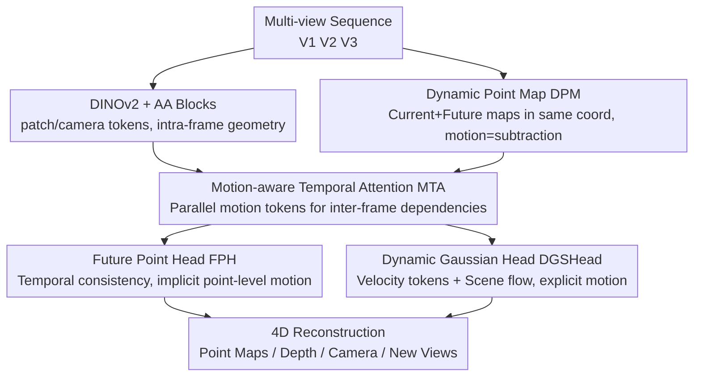

# DynamicVGGT: Learning Dynamic Point Maps for 4D Scene Reconstruction in Autonomous Driving

**Conference**: CVPR 2026  
**Paper**: [CVF Open Access](https://openaccess.thecvf.com/content/CVPR2026/html/He_DynamicVGGT_Learning_Dynamic_Point_Maps_for_4D_Scene_Reconstruction_in_CVPR_2026_paper.html)  
**Code**: None  
**Area**: 3D Vision / Autonomous Driving  
**Keywords**: 4D Scene Reconstruction, Dynamic Point Maps, Feed-forward 3D Foundation Models, Temporal Attention, Dynamic Gaussian Splatting  

## TL;DR
DynamicVGGT extends the static feed-forward 3D model VGGT to dynamic 4D reconstruction. By utilizing "Dynamic Point Maps" to predict point clouds for current and future frames within a unified learned coordinate system, combined with a parallel motion-aware temporal attention branch and a velocity-supervised dynamic 3D Gaussian head, it reconstructs temporally consistent dynamic driving scenes on Waymo and KITTI using only image inputs without camera parameters or dense annotations.

## Background & Motivation
**Background**: Feed-forward 3D reconstruction models like DUSt3R and VGGT can end-to-end regress depth, camera poses, and dense point maps directly from multi-view images. They eliminate dependence on traditional multi-view geometry optimization and matching, providing strong 3D priors for downstream tasks. VGGT further utilizes Alternating Attention (AA) to jointly predict various geometric quantities in a shared model, representing the current state-of-the-art in static reconstruction.

**Limitations of Prior Work**: These models are built on the "time-invariance" assumption, making them inherently static. They often fail in autonomous driving scenarios which are naturally dynamic, containing numerous moving vehicles, long-range temporal dependencies, and lighting variations. Furthermore, driving data is large-scale, noisy, and feature sparse depth (LiDAR), which can degrade the dense prediction capabilities of models if used directly for training. A few works attempting dynamic modeling (e.g., MoVieS, StreamVGGT) still primarily output static point maps and lack a unified dynamic representation to support downstream driving tasks, while mostly focusing on indoor scenes.

**Key Challenge**: Feed-forward models achieve high geometric precision on static data, but expanding them to dynamic conditions makes it difficult to maintain both geometric accuracy and temporal consistency. StreamVGGT's approach of serially stacking AA blocks with temporal attention can disrupt the original spatial attention priors of VGGT, leading to unstable early training and performance degradation.

**Goal**: To develop a unified feed-forward framework that can simultaneously model geometry and motion to output temporally consistent dynamic 4D reconstructions without relying on camera extrinsic alignment or dense annotations.

**Key Insight**: Instead of explicitly aligning all frames to a reference frame as in previous dynamic point map approaches (which requires externally provided transformations), the model should **simultaneously predict point maps for both current and future frames** within the "canonical coordinate system" learned by VGGT. This allows motion to emerge implicitly through the subtraction of the two point maps.

**Core Idea**: Treat the "Dynamic Point Map (DPM)" as a unified geometric representation for temporal modeling, and design two complementary tasks around it: future point prediction for implicit motion learning and a dynamic Gaussian head for explicit motion supervision.

## Method

### Overall Architecture
DynamicVGGT is built upon VGGT. The input consists of a multi-view image sequence $\{V_1, V_2, V_3\}$. First, frozen DINOv2 is used to extract patch tokens and camera tokens for each view, while a set of learnable motion tokens is initialized to encode temporal priors. Patch/camera tokens pass through original VGGT AA blocks for **intra-frame spatial geometry** modeling. **Parallely**, the Motion-aware Temporal Attention (MTA) blocks use motion tokens to model **inter-frame temporal dependencies**. The temporal-enhanced features $TA_{v,t}$ output by MTA are fed into three types of heads: the original camera/depth/point map heads, the Future Point Head (FPH) for implicit motion, and the Dynamic 3D Gaussian Head (DGSHead) for explicit motion. The entire pipeline operates in a single forward pass without per-scene optimization.

The core lies in the "DPM task modeling": given a multi-view clip, the model directly predicts $\hat{P}_{v,t}, \hat{P}_{v,t+\delta} = f_\theta(\{I_{v,t}\})$. Thus, motion is implicitly represented as $\Delta\hat{P}_{v,t} = \hat{P}_{v,t+\delta} - \hat{P}_{v,t}$. This avoids the dependency on externally specified reference frame transformations typically found in DPM formulations like $P^{(\mathrm{ref})}_{v,t} = \mathcal{T}_{(v,t)\to\mathrm{ref}}(\cdot)$, while preserving the geometric priors of the VGGT backbone.

### Key Designs

**1. Dynamic Point Map (DPM): Unified Coordinate System for Motion via Subtraction**

Addressing the limitation where previous dynamic point maps required explicit alignment to a reference frame via external transformations, this work re-formulates the problem: instead of explicit alignment, the model **jointly predicts** the current frame $\hat{P}_{v,t}$ and the future frame $\hat{P}_{v,t+\delta}$ for the same camera stream within VGGT's learned canonical coordinate system (Eq. 4). Motion is derived directly as $\Delta\hat{P}_{v,t} = \hat{P}_{v,t+\delta} - \hat{P}_{v,t}$. Temporal modeling is defined on frame pairs $(v,t)$ and $(v,t+\delta)$ within the same stream, with $\delta$ randomly sampled from 1~3 during training. This approach eliminates the need for frame-to-reference extrinsic transformations (which are difficult to obtain in driving scenarios) and unifies "geometric priors" and "motion" within a single point map representation, serving as the foundation for the two subsequent dynamic tasks (FPH / DGSHead).

**2. Motion-aware Temporal Attention (MTA): Parallel Bypass + Motion Tokens**

To solve the issue in StreamVGGT where serial stacking of AA blocks caused training instability and disrupted spatial priors, MTA introduces a **parallel** branch dedicated to temporal modeling. It utilizes learnable motion tokens concatenated with spatial patch tokens from the AA branch. The first layer input is $\mathrm{Concat}(M^{(l)}_{v,t}, F^{p(l)}_{v,t})$, and subsequent layers add previous features $\mathrm{Concat}(M^{(l)}_{v,t}, F^{p(l)}_{v,t}+F^{p(l-1)}_{v,t})$ (Eq. 5), allowing low-level motion cues to propagate upward. Temporal attention is calculated **independently** along the time dimension $\tau$ for each patch position and view:

$$A^{(l)}_{t,t'} = \mathrm{Softmax}\!\left(\frac{Q^{(l)}_t (K^{(l)}_{t'})^\top}{\sqrt{d}} + B^{\mathrm{time}}_{t,t'}\right), \quad \tilde{F}^{(l)}_{m,v,t} = \sum_{t'=1}^{\tau} A^{(l)}_{t,t'} V^{(l)}_{t'}$$

where $B^{\mathrm{time}}_{t,t'}$ is the temporal positional bias implemented with rotary embeddings. After passing through LayerNorm, MLP, and residual connections, the final output is $TA_{v,t}=F^{(L)}_{m,v,t}$ (with $L=12$ layers). Since it is a parallel bypass rather than a replacement for AA, the motion tokens guide the attention toward motion-consistent regions while preserving the geometric priors and training stability of VGGT.

**3. Future Point Head (FPH): Implicit Motion Supervision via Inter-frame Consistency**

Since point-level displacement alone may be inaccurate, FPH uses a DPT head to predict the future frame point map $\hat{P}^{\mathrm{fut}}_{v,t+\delta}=\mathrm{DPT}_p(TA_{v,t})$ (Eq. 10) from the temporal-enhanced features of the current frame to learn short-term motion continuity in a self-supervised manner. The supervision signal is a temporal consistency loss:

$$\mathcal{L}_{\mathrm{temp}} = \frac{1}{|\mathcal{N}|}\sum_{i\in\mathcal{N}} \left\| (\mathbf{p}^{(i)}_{v,t+\delta}-\mathbf{p}^{(i)}_{v,t}) - (\hat{\mathbf{p}}^{(i)}_{v,t+\delta}-\hat{\mathbf{p}}^{(i)}_{v,t}) \right\|_1$$

This constrains the consistency between the predicted displacement field $\Delta\hat{p}$ and the ground truth displacement field $\Delta p$. Essentially, it **implicitly** teaches the network inter-frame point displacement within the DPM coordinate space as a coarse-grained motion representation. This supervision is complementary to the explicit supervision of the Gaussian head.

**4. Dynamic 3D Gaussian Head (DGSHead): Velocity Tokens + Scene Flow for Explicit Motion**

To model dynamics at the primitive level, DGSHead fuses geometric features from $TA_{v,t}$ with RGB appearance cues to generate time-varying Gaussian primitives. The authors observed that freezing AA blocks biases the VGGT backbone too heavily toward geometric reasoning at the expense of appearance cues, harming rendering quality. Thus, they explicitly fuse appearance features extracted by convolutions: $G_{v,t}=F^{\mathrm{app}}_{v,t}+F_{g,v,t}$ (Eq. 12-14), where $F^{\mathrm{app}}_{v,t}=\mathrm{Conv}(I_{v,t})$. The predicted Gaussian depth $D_{g,v,t}$ works with the camera branch to reconstruct point maps and initialize Gaussian centers $\mu_i$. Each Gaussian is parameterized as $\{\mu_i,\sigma_i,r_i,c_i,\nu_i\}$, including a velocity vector $\nu_i$. Crucially, the motion tokens from MTA are reused to decode a set of velocity bases $\nu_b\in\mathbb{R}^3$ as a shared dynamic representation. Assuming constant velocity within a short clip $\mu_{i,t+\delta}=\mu_{i,t}+\delta\cdot\nu_{i,t}$ (Eq. 15), **scene flow supervision** $\mathcal{L}_{\mathrm{flow}}=\mathrm{MSE}(s_{v,t},\hat{s}_{v,t})$ is applied to ensure physically meaningful velocities for each Gaussian.

### Loss & Training
A two-stage "Synthetic-to-Real" curriculum training strategy is adopted to mitigate degradation when training directly on real-world driving data.

- **Stage 1 (Synthetic Data - Geometry Priors + Temporal Consistency)**: Trained on Virtual KITTI and MVS-Synth for 10 epochs. Target: $\mathcal{L}_{\mathrm{stage1}} = \mathcal{L}_{\mathrm{cam}} + \mathcal{L}_{\mathrm{depth}} + \mathcal{L}^{(t)}_{\mathrm{point}} + \mathcal{L}^{(t+\delta)}_{\mathrm{point}} + \lambda_{\mathrm{temp}}\mathcal{L}_{\mathrm{temp}}$. Huber loss is used for camera parameters, and depth/point losses follow VGGT.
- **Stage 2 (Real Data - Gaussian Head Activation)**: Fine-tuned on Waymo and Virtual KITTI for 50 epochs. $\mathcal{L}_{\mathrm{stage2}} = \mathcal{L}_{\mathrm{stage1}} + \mathcal{L}_{\mathrm{3DGS}}$, where $\mathcal{L}_{\mathrm{3DGS}} = \mathcal{L}_{\mathrm{rgb}} + \lambda_{\mathrm{gs}}\mathcal{L}_{\mathrm{gsdepth}} + \lambda_{\mathrm{dist}}\mathcal{L}_{\mathrm{distill}} + \lambda_{\mathrm{flow}}\mathcal{L}_{\mathrm{flow}}$.
- **Depth Distillation**: LiDAR point clouds in real data are sparse and unevenly distributed; using them directly as supervision causes performance drops. Therefore, the depth predicted by the Stage-1 point map branch acts as a teacher for the Gaussian depth branch: $\mathcal{L}_{\mathrm{distill}}=\|D_{g,v,t}-\mathrm{sg}(D^{\mathrm{pm}}_{v,t})\|_1$ (with stop-gradient), stabilizing Gaussian optimization and suppressing noise from sparse LiDAR.
- Hyperparameters: $\lambda_{\mathrm{temp}}=0.01$, $\lambda_{\mathrm{gs}}=\lambda_{\mathrm{dist}}=0.1$, $\lambda_{\mathrm{flow}}=0.01$; approximately 1.4B parameters (approx. 800M trainable), max input edge 518 pixels, 18 images per batch.

## Key Experimental Results

### Main Results: Point Map Reconstruction (KITTI / Waymo val)
KITTI monocular, 3 consecutive frames per sequence; Waymo three cameras, frame step 4, 9 images per set. Metrics: Acc.↓ / Comp.↓ / NC↑.

| Dataset | Metric | VGGT | StreamVGGT | DynamicVGGT |
|--------|------|------|-----------|-------------|
| KITTI(Mono) | Acc.↓ | 1.489 | 1.078 | **0.901** |
| KITTI(Mono) | Comp.↓ | 0.690 | 0.495 | 0.584 |
| KITTI(Mono) | NC↑ | 0.918 | 0.899 | **0.939** |
| Waymo(3cam) | Acc.↓ | 4.635 | 4.598 | **4.021** |
| Waymo(3cam) | Comp.↓ | 2.667 | 2.626 | **2.390** |
| Waymo(3cam) | NC↑ | 0.561 | 0.564 | **0.603** |

On KITTI, Acc. drops from VGGT's 1.489 to 0.901, and NC rises to 0.939, outperforming both VGGT and StreamVGGT. On Waymo, Acc. 4.021 and NC 0.603 also represent the best performance, validating that dynamic modeling enhances cross-view consistency and completeness in large-scale driving scenes. ⚠️ In the Comp. column, StreamVGGT (0.495) slightly outperforms Ours (0.584), which is not explicitly explained in the paper.

### Main Results: 4D Scene Reconstruction (Waymo val, PSNR↑ / SSIM↑)

| Method | Supervision | Dynamic PSNR | Dynamic SSIM | Full PSNR | Full SSIM |
|------|------|-------------|--------------|-----------|-----------|
| 3DGS (Per-scene) | Full Annot. | 17.13 | 0.267 | 25.13 | 0.741 |
| STORM (Feed-forward) | Camera Params | **21.26** | **0.535** | 25.03 | 0.750 |
| DynamicVGGT | **Image Only** | 18.07 | 0.376 | 24.07 | 0.676 |

STORM achieves higher scores using multi-camera setups, geometric priors, and camera parameters. However, DynamicVGGT remains competitive using only monocular images without camera parameters or per-scene optimization—a significant achievement given the weaker input constraints.

### Main Results: Depth Estimation (KITTI / NYU-v2, Abs Rel↓)

| Method | KITTI-Mono | NYU-v2-Mono | KITTI-MVS |
|------|-----------|-------------|-----------|
| VGGT | 0.082 | **0.059** | 0.062 |
| StreamVGGT | 0.082 | 0.057 | 0.173 |
| DynamicVGGT | **0.070** | 0.064 | **0.051** |

Ours achieves the best monocular Acc. (0.070) on KITTI and leads significantly in the MVS setting (0.051 / 97.6%). Generalization to NYU-v2 indoors remains stable (δ<1.25 of 94.3%).

### Ablation Study (Point Map Estimation)

| Configuration | KITTI Acc.↓ | KITTI Comp.↓ | KITTI NC↑ | Waymo Acc.↓ | Waymo NC↑ |
|------|-------------|--------------|-----------|-------------|-----------|
| Baseline (VGGT) | 1.489 | 0.690 | 0.918 | 4.635 | 0.561 |
| + MTA & FPH (stage1) | 0.927 | 0.600 | 0.915 | 4.330 | 0.561 |
| + DGSHead (stage2) | **0.901** | **0.584** | **0.939** | **4.021** | **0.603** |

### Key Findings
- **Temporal modeling provides the largest contribution**: Adding only MTA + FPH reduces KITTI Acc. from 1.489 to 0.927, indicating that dynamic geometry is primarily driven by parallel temporal attention and future point consistency.
- **DGSHead focuses on smoothness/normal consistency**: Adding the Gaussian head further brings Acc. to 0.901 and increases NC from 0.915 to 0.939. This suggests the head refines reconstruction smoothness and completeness.
- **Depth distillation is crucial for real data**: Direct supervision with sparse LiDAR causes performance drops; using the Stage-1 point map branch as a teacher for distillation is essential to stabilize Gaussian optimization against noise.

## Highlights & Insights
- **Parallel Bypass instead of Serial Stacking**: MTA uses a dedicated branch and motion tokens for temporal modeling, avoiding the pitfall of StreamVGGT where serial stacking disrupts spatial priors—a useful architecture trick for adding new capabilities without altering pretrained backbones.
- **Dual Implicit + Explicit Motion Supervision**: $\mathcal{L}_{\mathrm{temp}}$ constrains coarse displacement in point map space, while $\mathcal{L}_{\mathrm{flow}}$ constrains refined velocity in Gaussian space. This "multi-level supervision of the same physical quantity" is a transferable concept for multi-representation reconstruction.
- **Multi-purpose Motion Tokens**: The same set of motion tokens drives MTA temporal attention and decodes Gaussian velocity bases $\nu_b$, ensuring consistency between temporal features and Gaussian motion while saving parameters.
- **Robustness with Weak Inputs**: Achieving results comparable to camera-param-dependent methods like STORM using only monocular images and no extrinsic calibration makes the method highly attractive for practical deployment.

## Limitations & Future Work
- **Constant Velocity Assumption**: Gaussian motion is approximated as constant velocity within short clips. It may fail during rapid acceleration, braking, or sharp turns.
- **4D Rendering Gap**: Dynamic-only PSNR/SSIM is noticeably lower than STORM, reflecting the remaining gap between self-supervised image-based methods and those using camera parameters for dynamic regions.
- **Waymo View Overlap**: Qualitative results are mostly limited to front cameras, and the potential of multi-camera collaboration was not fully explored. ⚠️ The absolute values of Acc. on Waymo (~4) differ greatly from KITTI (~0.9); the absolute numbers should not be directly compared across datasets.
- **Training Cost**: 1.4B parameters and a two-stage 60-epoch training process represent significant computational overhead.

## Related Work & Insights
- **vs. VGGT**: VGGT is a static feed-forward baseline with a time-invariance assumption. Ours adds DPM, MTA, FPH, and DGSHead to extend it to dynamic 4D while preserving auxiliary outputs like camera poses and depth. Point map reconstruction significantly outperforms VGGT.
- **vs. StreamVGGT**: Both add temporal modeling to VGGT, but StreamVGGT uses serial stacking for indoor scenes and suffers from training instability. Ours uses parallel MTA bypasses and motion tokens for large-scale outdoor driving, performing better on KITTI/Waymo.
- **vs. STORM / DrivingForward**: These are feed-forward 4D reconstructions for driving. STORM relies on calibrated multi-view inputs, and DrivingForward jointly trains pose/depth/Gaussian. Ours achieves results with weaker input constraints (image-only self-supervision).

## Rating
- Novelty: ⭐⭐⭐⭐ Combines "canonical space current+future point map prediction" with parallel MTA and dual-layer motion supervision into a self-consistent framework.
- Experimental Thoroughness: ⭐⭐⭐⭐ Covers point map reconstruction, 4D reconstruction, depth estimation, and ablation across multiple tasks and datasets.
- Writing Quality: ⭐⭐⭐⭐ Formulas and figures (Fig. 2/3) clearly explain the dual-task mechanism.
- Value: ⭐⭐⭐⭐ Feed-forward 4D driving reconstruction without calibration or dense labels is highly valuable for deployment and represents a robust extension of the VGGT lineage.

<!-- RELATED:START -->

## Related Papers

- [\[CVPR 2026\] V-DPM: 4D Video Reconstruction with Dynamic Point Maps](v-dpm_4d_video_reconstruction_with_dynamic_point_maps.md)
- [\[CVPR 2026\] LiDAR Prompted Spatio-Temporal Multi-View Stereo for Autonomous Driving](lidar_prompted_spatio-temporal_multi-view_stereo_for_autonomous_driving.md)
- [\[CVPR 2026\] ReFlow: Self-correction Motion Learning for Dynamic Scene Reconstruction](reflow_self-correction_motion_learning_for_dynamic_scene_reconstruction.md)
- [\[CVPR 2026\] Mind the Hitch: Dynamic Calibration and Articulated Perception for Autonomous Trucks](mind_the_hitch_dynamic_calibration_and_articulated_perception_for_autonomous_tru.md)
- [\[CVPR 2026\] 4D Primitive-Mâché: Glueing Primitives for Persistent 4D Scene Reconstruction](4d_primitive-mache_glueing_primitives_for_persistent_4d_scene_reconstruction.md)

<!-- RELATED:END -->
