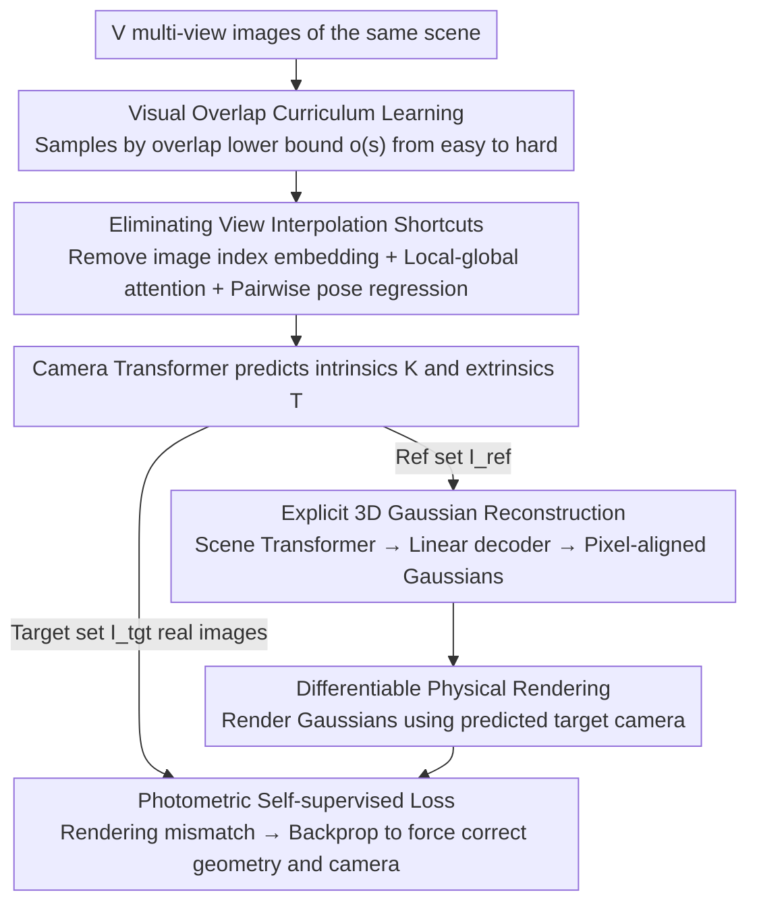

# E-RayZer: Self-supervised 3D Reconstruction as Spatial Visual Pre-training

**Conference**: CVPR 2026  
**arXiv**: [2512.10950](https://arxiv.org/abs/2512.10950)  
**Code**: [qitaozhao.github.io/E-RayZer](https://qitaozhao.github.io/E-RayZer)  
**Area**: 3D Vision  
**Keywords**: Self-supervised pre-training, 3D Gaussian Splatting, Multi-view reconstruction, Pose estimation, Visual representation learning

## TL;DR

E-RayZer is the first truly self-supervised feed-forward 3D Gaussian reconstruction model. By replacing RayZer's implicit latent scene representation with explicit 3D Gaussians and employing a curriculum learning strategy based on visual overlap, it learns geometrically grounded 3D-aware representations under zero 3D annotation. It significantly outperforms RayZer in pose estimation (RPA@5° improved from ≈0 to 90.8) and leads mainstream pre-trained models like DINOv3/CroCo v2 in frozen-backbone probing for downstream 3D tasks, even rivaling supervised VGGT.

## Background & Motivation

**Background**: Self-supervised pre-training has driven rapid progress for foundation models in text, 2D images, and video, yet learning 3D-aware representations from multi-view images remains a significant gap. Current mainstream 3D vision models rely on pseudo-labels from SfM systems (e.g., COLMAP) for full supervision, which is inherently inefficient, imprecise, and unscalable.

**Limitations of Prior Work**: The predecessor RayZer attempted self-supervised 3D learning via latent space view synthesis. However, it suffers from a fundamental flaw: its camera estimation, implicit scene reconstruction, and Transformer rendering modules are jointly learned in a latent space lacking 3D inductive bias. This allows the model to achieve high-quality synthesis via "shortcut solutions" like video interpolation, resulting in a pose space that is neither interpretable nor physically meaningful. Evidence shows RayZer’s pose estimation accuracy is nearly zero (RPA@5° ≈ 0), indicating a lack of true 3D geometric understanding.

**Key Insight**: 3D inductive bias remains necessary for 3D representation learning but must be introduced in a way that preserves scalability. E-RayZer replaces implicit representations with explicit 3D Gaussians. Physical rendering constraints force the model to understand real 3D geometry, while a fine-grained curriculum learning strategy addresses convergence difficulties inherent in explicit 3D training.

## Method

### Overall Architecture

E-RayZer aims to learn representations with true geometric understanding under zero 3D annotation. It receives $V$ multi-view images of the same scene. The pipeline logic involves: first predicting cameras, then placing a set of 3D Gaussians on reference views, and finally rendering these Gaussians to target views to compare with ground truth. Since the rendering is physical and non-learnable, the model is forced to learn correct camera and geometry parameters.

The process involves three steps: 1. A multi-view Transformer $f_\theta^{\text{cam}}$ predicts intrinsic $K$ and extrinsic $T$ for all images. 2. Images are split into a reference set $\mathcal{I}_{\text{ref}}$ and a target set $\mathcal{I}_{\text{tgt}}$; pixel-aligned 3D Gaussians $\mathcal{G}$ are predicted from the reference view. 3. These Gaussians are rendered using the predicted target camera parameters to calculate photometric loss against the real target images. Each training sequence uses 10 images (5 reference, 5 target) without using any 3D annotations.

### Key Designs

**1. Explicit 3D Gaussian Reconstruction: Replacing RayZer's Implicit Latent Space with Physically Renderable Geometry**

RayZer trains camera, scene, and rendering modules jointly in latent space without 3D inductive bias, allowing the model to synthesize images via interpolation shortcuts without understanding geometry. E-RayZer switches the scene representation to explicit 3D Gaussians: a Scene Transformer $f_{\psi'}^{\text{scene}}$ encodes reference views with poses into cross-view aggregated latent tokens $\mathbf{s}_{\text{ref}}$. A single-layer linear decoder $f_\omega^{\text{gauss}}$ then decodes each pixel token into Gaussian parameters: ray distance $d_i$, orientation quaternion $\mathbf{q}_i$, spherical harmonic coefficients $\mathbf{C}_i$, scaling $\mathbf{s}_i$, and opacity $\alpha_i$. These pixel-aligned Gaussians undergo closed-form differentiable rendering (using a modified gsplat to allow gradient backpropagation to $K$). Since rendering is a physical process, the model must align the 3D geometry correctly to match target images, effectively disabling interpolation shortcuts. This also removes RayZer’s Transformer renderer $f_\phi^{\text{rend}}$, reducing attention complexity from $\mathcal{O}((K_{\text{ref}}hw + n_z)^2)$ to $\mathcal{O}((K_{\text{ref}}hw)^2)$.

**2. Eliminating View Interpolation Shortcuts: Closing the "Cheating" Backdoor via Frame Indices**

Even with explicit geometry, if the model can access frame sequence cues, it may revert to interpolation. RayZer's uninterpretable pose space stems from image index embeddings providing "frame number" hints. E-RayZer closes this backdoor via three measures: First, it completely removes image index embeddings. Second, it adopts a VGGT-style Transformer with alternating local-global attention, where local attention boundaries naturally define "image-camera" ownership. Third, it uses pairwise regression, concatenating camera tokens of canonical and target views to regress relative poses directly. Without frame indices, the model receives no temporal sequence cues and must derive cameras purely from geometry.

**3. Visual Overlap-based Curriculum Learning: A Unified Scale for Training Stability and Data Heterogeneity**

Training explicit 3D from scratch is prone to instability; "hard" training yields only 2.1% RPA@5°. RayZer's fixed frame interval is too coarse, as the same interval across different sequences can represent vastly different visual overlaps. E-RayZer uses "visual overlap" as a unified difficulty metric: it pre-computes an overlap profile $O_u(\Delta t)$ for each sequence. During training, the overlap lower bound $o(s)$ decays linearly with progress $s$:

$$o(s) = s \cdot o_{\min} + (1-s) \cdot o_{\max}$$

This transitions training from high-overlap "easy" samples to low-overlap "hard" samples. Overlap is calculated via either semantic overlap (DINOv2 cosine similarity, purely unsupervised) or geometric overlap (UFM co-visibility, requires 3D labels). Both perform similarly in experiments, proving that this curriculum does not depend on 3D annotations.

### Loss & Training

- **Photometric Self-supervised Loss**: $\mathcal{L} = \sum \text{MSE}(I, \hat{I}) + \lambda \cdot \text{Percep}(I, \hat{I})$, where Percep is a perceptual loss.
- **Architectural Parameters**: Patch size 16, resolution 256, 8-layer Camera and Scene Transformers (1 global + 1 frame attention per layer), feature dimension 768, 12 attention heads.
- **Training Setup**: 8×A100 GPUs, global batch 192, 152K iterations (~198 hours).
- **Learning Rate**: 3K steps linear warmup to 4e-4, then cosine decay.
- **Curriculum Schedule**: Linear progression over the first 86K steps; geometric overlap from 1.0→0.5, semantic overlap from 1.0→0.75.
- **Data Sampling**: Mixed sampling across 7 datasets (DL3DV 1.0, RE10K 0.5, MVImgNet 0.25, etc.).

## Key Experimental Results

### Main Results: Pose Estimation and New View Synthesis (Tab. 1)

Comparison with self-supervised/semi-supervised methods. E-RayZer and RayZer are self-supervised from scratch; SPFSplat uses supervised MASt3R initialization.

| Method | Training Data | WildRGB-D PSNR↑ | WildRGB-D @5°↑ | WildRGB-D @15°↑ | DL3DV @5°↑ | DL3DV @15°↑ |
|------|---------|-----------------|----------------|-----------------|------------|-------------|
| SPFSplat | RE10K+extra | 16.7 | 31.5 | 58.0 | 19.5 | 40.6 |
| E-RayZer | RE10K | 21.0 | 40.3 | 89.4 | 21.2 | 55.0 |
| RayZer | DL3DV | 25.9 | 0.0 | 0.2 | 0.0 | 0.6 |
| E-RayZer | DL3DV | 24.3 | 84.5 | 98.4 | 72.0 | 88.4 |
| RayZer | 7-dataset | 26.7 | 0.2 | 9.3 | 0.0 | 1.9 |
| **E-RayZer** | **7-dataset** | **24.9** | **90.8** | **98.6** | **59.9** | **82.9** |

E-RayZer crushes RayZer in pose estimation (from ≈0% to 60-90%) while maintaining competitive NVS quality (PSNR is slightly lower as RayZer overfits to interpolation).

### Comparison with supervised VGGT (Tab. 2, trained on DL3DV)

| Method | Supervision | DL3DV @5° | RE10K @5° | WildRGB-D @5° | BlendedMVS @5° | NAVI @5° | ScanNet++ @5° |
|------|------|-----------|-----------|---------------|----------------|----------|---------------|
| E-RayZer | Self-sup | 72.0 | 83.0 | 51.1 | 22.9 | 20.7 | 7.7 |
| VGGT* | Supervised | 79.6 | 80.4 | 32.5 | 17.0 | 14.3 | 6.7 |
| VGGT*+ERZ init | Supervised | **87.3** | **85.3** | **56.2** | **29.2** | **26.9** | **14.3** |

Self-supervised E-RayZer outperforms supervised VGGT* on multiple OOD datasets. VGGT* initialized with E-RayZer achieves the best performance across the board.

### Downstream task probing (Tab. 3, Frozen-backbone)

| Pre-training Method | ScanNet++ AbsRel↓ | ScanNet++ δ<1.25↑ | ScanNet++ @5°↑ | BlendedMVS AbsRel↓ | BlendedMVS @5°↑ |
|-----------|-------------------|-------------------|----------------|---------------------|-----------------|
| DINOv2 | 0.193 | 74.9 | 0.8 | 0.366 | 1.1 |
| DINOv3 | 0.201 | 73.2 | 0.4 | 0.397 | 1.2 |
| CroCo v2 | 0.203 | 73.0 | 1.4 | 0.412 | 1.6 |
| VideoMAE V2 | 0.175 | 76.3 | 0.1 | 0.371 | 1.0 |
| RayZer | 0.161 | 79.3 | 4.7 | 0.351 | 16.7 |
| **E-RayZer** | **0.116** | **87.1** | **13.8** | **0.245** | **26.5** |

E-RayZer leads all baselines in the frozen-backbone setting. Depth AbsRel is 40% lower than DINOv2 (0.116 vs 0.193), and pose @5° is 17x higher (13.8 vs 0.8), proving its features possess superior 3D spatial awareness.

### Ablation Study: Curriculum Strategy (Tab. 6, 7-dataset)

| Curriculum Strategy | PSNR↑ | RPA@5°↑ | RPA@15°↑ | RPA@30°↑ |
|---------|-------|---------|----------|----------|
| No Curriculum | 15.9 | 2.1 | 21.6 | 40.7 |
| Frame Interval | 19.1 | 43.8 | 72.1 | 82.9 |
| Semantic Overlap | 19.7 | 58.7 | 81.0 | 89.8 |
| Geometric Overlap | 19.7 | 59.9 | 82.9 | 90.2 |

Training without a curriculum results in near-total failure (RPA@5° = 2.1%). Semantic overlap (unsupervised) performs nearly as well as geometric overlap (supervised).

### Key Findings

- **Complementarity**: E-RayZer initialization improves VGGT* performance, suggesting self-supervised and supervised paradigms learn complementary knowledge.
- **Diversity > Volume**: DL3DV (high quality) training alone outperforms RE10K; a 7-dataset mix provides the best generalization.
- **Cost of Explicit 3D**: NVS quality is slightly lower than RayZer (~2dB PSNR drop), confirming RayZer’s reliance on interpolation shortcuts rather than true 3D.
- **Optical Flow**: E-RayZer is slightly weaker than RayZer in flow estimation (EPE 1.254 vs 1.105), as implicit representations are naturally suited for low-level motion.

## Highlights & Insights

- Moving from "self-supervised view synthesis" to "self-supervised 3D reconstruction" represents a paradigm shift; explicit geometric constraints eliminate shortcut solutions.
- Curriculum learning using visual overlap serves as a unified difficulty metric across data sources, proving more elegant and scalable than manual frame intervals.
- The results demonstrate that large-scale self-supervision can yield geometrically grounded 3D understanding, where data diversity and quality drive scalability.
- Modifying gsplat to support gradient backpropagation to intrinsics $K$ is a critical engineering contribution for an end-to-end differentiable pipeline.

## Limitations & Future Work

- Currently restricted to static scenes, limiting exposure to massive general video data—extending to dynamic scenes is a key future direction.
- Curriculum assumes somewhat uniform camera motion; performance may degrade with sparse images or extreme viewpoint changes.
- NVS quality remains lower than implicit methods, which may be a drawback for high-quality rendering applications.
- Scaling behaviors for models larger than ViT-Base remain to be explored.

## Related Work & Insights

- **vs VGGT**: E-RayZer shows self-supervision can rival supervised geometry understanding, suggesting self-supervised pre-training + supervised fine-tuning is the optimal path.
- **vs DINOv3/CroCo v2**: The massive gap in frozen-backbone probing suggests 2D visual features lack intrinsic 3D spatial awareness.
- **vs SPFSplat**: E-RayZer's superiority despite SPFSplat's supervised initialization (MASt3R) highlights the potential of training from scratch with self-supervision.

## Rating

- Novelty: ⭐⭐⭐⭐⭐ First truly self-supervised feed-forward 3D Gaussian reconstruction.
- Experimental Thoroughness: ⭐⭐⭐⭐⭐ Covers 9 evaluation datasets, multiple tasks (NVS/Pose/Depth/Flow), and comprehensive scaling analysis.
- Writing Quality: ⭐⭐⭐⭐ Clear logic; motivation is naturally derived from prior work limitations.
- Value: ⭐⭐⭐⭐⭐ Establishes a new paradigm for self-supervised 3D pre-training.

<!-- RELATED:START -->

## Related Papers

- [\[CVPR 2026\] From None to All: Self-Supervised 3D Reconstruction via Novel View Synthesis](from_none_to_all_self-supervised_3d_reconstruction_via_novel_view_synthesis.md)
- [\[CVPR 2026\] 3D sans 3D Scans: Scalable Pre-training from Video-Generated Point Clouds](3d_sans_3d_scans_scalable_pre-training_from_video-generated_point_clouds.md)
- [\[CVPR 2026\] Fast Spatial Tracking with Visual Geometry Transformer](fast_spatial_tracking_with_visual_geometry_transformer.md)
- [\[CVPR 2026\] LASER: Layer-wise Scale Alignment for Training-Free Streaming 4D Reconstruction](laser_layer-wise_scale_alignment_for_training-free_streaming_4d_reconstruction.md)
- [\[CVPR 2026\] Dynamic Visual SLAM using a General 3D Prior](dynamic_visual_slam_using_a_general_3d_prior.md)

<!-- RELATED:END -->
