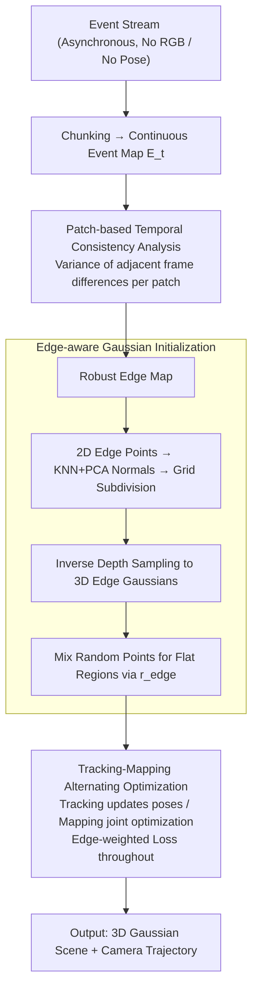

# E2EGS: Event-to-Edge Gaussian Splatting for Pose-Free 3D Reconstruction

**Conference**: CVPR 2026  
**arXiv**: [2603.14684](https://arxiv.org/abs/2603.14684)  
**Code**: TBD  
**Area**: 3D Vision  
**Keywords**: Event Camera, 3D Gaussian Splatting, Edge Detection, Pose-Free Reconstruction, Visual Odometry

## TL;DR

Ours proposes E2EGS, a pose-free 3D reconstruction framework entirely based on event streams: it extracts noise-resistant edge maps from event streams through patch-based temporal consistency analysis, utilizes edge information to guide Gaussian initialization and weighted loss optimization, and achieves high-quality trajectory estimation and 3D reconstruction without depth models or RGB input.

## Background & Motivation

NeRF and 3D Gaussian Splatting (3DGS) have driven significant progress in novel view synthesis, but they inherently rely on high-quality RGB images and accurate camera poses. In real-world scenarios with rapid motion or adverse lighting, RGB image quality degrades severely, limiting the robustness of these methods.

**Advantages of Event Cameras**: Event cameras capture pixel-level brightness changes asynchronously, possessing extremely high temporal resolution and wide dynamic range, making them naturally suited for handling motion blur and extreme illumination. More importantly, event cameras produce dense responses at edges and texture boundaries, providing rich structural information for scene geometry.

**Limitations of Prior Work**:

- **Methods requiring known poses** (EventSplat, Ev-GS, Event3DGS, etc.): These rely on SfM or GT poses and are unusable in scenarios where poses are unavailable.
- **IncEventGS** (Currently the only pose-free method): Utilizes a SLAM framework to jointly optimize poses and 3D Gaussians but heavily relies on the pre-trained depth estimation model Marigold for initialization. **Key Problem**: Depth models estimate from initial frames; when the camera moves to new regions beyond the initial coverage, depth estimation degrades $\rightarrow$ trajectory drifts $\rightarrow$ reconstruction quality collapses.

**Key Challenge**: Pose-free event-based 3D reconstruction requires reliable geometric priors to guide optimization, but existing methods either rely on external depth models (poor generalization) or complete random initialization (optimization easily falls into local optima).

**Key Insight**: Event cameras naturally encode edge information—when the camera moves, edge regions generate temporally consistent dense events, while non-edge regions produce only sparse noise. This spatiotemporal feature difference can be used to extract robust edge maps, providing geometric constraints for Gaussian initialization and pose optimization without needing depth models or RGB assistance.

**Core Idea**: Replace depth models with intrinsic edge information from event streams to achieve fully autonomous pose-free event-based 3D reconstruction.

## Method

### Overall Architecture

E2EGS addresses a pure event-stream, pose-free 3D reconstruction problem: the input is only the asynchronous event stream from an event camera, and the output is a 3D Gaussian scene and a full camera trajectory, without utilizing any RGB images or depth models. It adopts 3DGS for scene representation and follows the tracking-mapping alternating optimization framework of IncEventGS. The event stream is partitioned into temporal chunks, each associated with a continuous trajectory segment. The supervisory signal comes from minimizing the difference between the measured event map $E_t(\mathbf{x})$ and the synthetic event map $\hat{E}_t(\mathbf{x}) = \log \hat{I}_{t+\Delta t}(\mathbf{x}) - \log \hat{I}_t(\mathbf{x})$.

The primary differentiator from IncEventGS is an "edge" thread throughout three steps: first extracting a noise-resistant edge map from continuous event maps, then distributing 3D Gaussians along these edges, and finally weighting the reconstruction loss by edges throughout tracking and bundle adjustment. The geometric prior originally provided by the Marigold depth model in IncEventGS is entirely replaced by "event-stream-derived edges."

### Key Designs

**1. Patch-based Temporal Consistency Analysis: Extracting Edges from Noisy Event Streams without Training**

The reason IncEventGS fails when entering unseen areas is that its geometric prior stems from an external depth model. E2EGS seeks a prior calculated purely through event statistics without learning dependencies. Its observation is physical: as the camera moves, real edges trigger spatially consistent dense events (high variance) across consecutive frames, while flat non-edge regions produce only scattered random noise (low variance). This variance difference serves as a natural edge discriminator. Specifically, $T$ consecutive event maps $\{E_t\}_{t=1}^T$ are divided into overlapping patches of size $p \times p$. For each patch position $P_{x,y}$, the temporal difference of adjacent frames is calculated: $D_t(P_{x,y}) = |G_\sigma * E_t(P_{x,y}) - G_\sigma * E_{t-1}(P_{x,y})|$ (where a Gaussian window $G_\sigma$ smooths sharp jumps), and the maximum variance among all adjacent frame pairs is taken:

$$C(P_{x,y}) = \max_{t} \text{Var}\big(D_t(P_{x,y})\big),$$

Patches with variance exceeding a threshold $\tau$ are classified as edges. This approach originates from the contrast maximization framework but avoids expensive trajectory estimation. It also possesses a self-correcting property: temporal differences involve both the previous frame $E_{t-1}$ and the current frame $E_t$. Thus, an "incorrectly positioned" edge will be naturally eliminated in the next step due to misalignment with current observations.

**2. Edge-aware Gaussian Initialization: Distributing Points along Edges to Replace Depth Models**

Once the edge map is calculated, it replaces the depth model in determining initial Gaussian positions. A set of 2D edge points $\mathcal{P}$ is extracted, edge normal directions are estimated using KNN + PCA, and recursive grid subdivision is applied based on normal consistency to obtain a set of 2D edge Gaussians $\mathcal{G}_\text{edge}$. These are then projected into 3D along the line of sight using inverse depth sampling:

$$d = \frac{1}{\tfrac{1}{d_\max} + u\big(\tfrac{1}{d_\min} - \tfrac{1}{d_\max}\big)},\quad u \sim \mathcal{U}(0,1).$$

Choosing inverse depth over uniform sampling has geometric justification: it places more sampling points at a distance. Distant points produce larger pixel displacements during camera rotation, making them more "observable" for rotation estimation. Since edge points alone cannot cover textureless areas, an edge ratio $r_\text{edge} \in [0,1]$ is introduced to balance the distribution- $N_\text{edge} = \lfloor r_\text{edge} \cdot N_\text{total} \rfloor$ Gaussians are initialized along edges, while the remaining $N_\text{random}$ are distributed randomly to cover flat regions.

**3. Edge-weighted Loss Function: Focusing Optimization on Informative Boundaries**

Finally, edge information governs the optimization phase. In non-edge regions, event cameras produce only sparse noise. Standard pixel-wise equal-weighted losses would allow these noise events to contribute equally to the gradient. E2EGS therefore weights the reconstruction loss by edges:

$$\mathcal{L}_\text{edge} = \frac{1}{|\Omega|} \sum_{\mathbf{x} \in \Omega} w(\mathbf{x}) \cdot \|\hat{E}(\mathbf{x}) - E(\mathbf{x})\|^2,\quad w(\mathbf{x}) = 1 + \beta \cdot M(\mathbf{x}),$$

where $M(\mathbf{x})$ is the edge mask and $\beta$ controls the emphasis on edges. This is combined with a D-SSIM structural loss: $\mathcal{L}_\text{total} = (1-\lambda)\,\mathcal{L}_\text{edge} + \lambda\,\mathcal{L}_\text{dssim}$. This acts as a lightweight attention mechanism, focusing optimization effort on geometrically significant boundaries where constraints are more robust.

### Loss & Training

The system alternates between tracking and mapping: in the tracking phase, Gaussian parameters are frozen while only the pose of the new chunk is optimized; in the mapping phase, Gaussian parameters and trajectories are jointly optimized within a sliding window. The total loss follows $\mathcal{L}_\text{total}$ (edge-weighted reconstruction loss + D-SSIM).

## Key Experimental Results

### Main Results (Novel View Synthesis - Replica Dataset)

| Method | Depth Reliance | Pose Reliance | room0 PSNR↑ | office0 PSNR↑ | office3 PSNR↑ |
|------|---------|---------|-------------|---------------|---------------|
| EvGGS | ✗ | Known | 17.57 | 14.34 | 15.51 |
| Event-3DGS* | ✗ | E2VID+COLMAP | 22.27 | 15.97 | 17.82 |
| IncEventGS | Marigold | ✗ | 23.54 | 26.53 | 19.21 |
| IncEventGS† | ✗ | ✗ | 19.81 | 27.72 | 20.04 |
| **Ours** | **✗** | **✗** | **23.86** | **28.01** | **20.75** |

### Main Results (Trajectory Accuracy - ATE RMSE cm)

| Method | room0 | room2 | office0 | TUM-VIE 1d | TUM-VIE 3d | TUM-VIE 6dof |
|------|-------|-------|---------|-----------|-----------|-------------|
| DEVO | 0.271 | 0.381 | 0.287 | 0.23 | 1.00 | 1.82 |
| IncEventGS | 0.051 | 0.071 | 0.085 | 2.19 | 1.62 | 0.70 |
| IncEventGS† | 6.817 | 0.446 | 0.698 | 2.58 | 4.48 | 8.24 |
| **Ours** | **0.049** | **0.065** | **0.078** | **1.12** | **0.65** | **0.58** |

### Ablation Study

| Configuration | Edge loss | Edge init | Depth init | ATE (cm) |
|------|-----------|-----------|------------|----------|
| IncEventGS | ✗ | ✗ | ✓ | 0.37 |
| IncEventGS† | ✗ | ✗ | ✗ | 6.62 |
| w/ Edge loss only | ✓ | ✗ | ✗ | 0.50 |
| w/ Edge init only | ✗ | ✓ | ✗ | 0.29 |
| **Ours (full)** | **✓** | **✓** | **✗** | **0.28** |

## Key Findings

- **Edge init contribution > Edge loss**: Adding edge initialization alone reduced ATE from 6.62 to 0.29, outperforming the depth-based 0.37. The combination is optimal (0.28).
- **Long-sequence robustness**: As sequence length increases, the ATE of IncEventGS (depth-dependent) rises sharply as depth becomes unreliable, while Ours maintains stable low error.
- **Edge ratio balance**: Low $r_\text{edge}$ (0.0) causes drift due to lack of geometric constraints; high $r_\text{edge}$ (0.7-1.0) leads to insufficient coverage in non-edge regions.

## Highlights & Insights

- **Training-free edge detection** is elegantly designed: it extracts edges from spatiotemporal statistics without learning, leveraging the most fundamental physical properties of event cameras (motion + edges $\rightarrow$ consistent events).
- **Eliminating depth models** represents a paradigm shift: the failure of IncEventGS's depth model in unseen areas is a fundamental flaw. Using edges as geometric priors bypasses observation limits.
- **Inverse depth sampling** intuition: Distant points are more sensitive to rotation $\rightarrow$ higher sampling density at a distance $\rightarrow$ enhanced observability for rotation estimation.
- **Edge-weighted loss** acts as an attention mechanism, ensuring optimization focuses on informative pixels rather than being overwhelmed by noisy gradients.

## Limitations & Future Work

- Edge extraction is conservative, potentially failing in areas with weak geometric structure (e.g., large textureless walls).
- Sparse responses on textureless planes limit Gaussian quality in those regions.
- The edge ratio $r_\text{edge}$ requires manual tuning; adaptive schemes are worth exploring.
- Validation is limited to indoor datasets; performance in outdoor large-scale scenes remains unknown.

## Related Work & Insights

- **vs IncEventGS**: Both are pose-free event-based 3DGS, but E2EGS replaces fickle depth models with edges, fundamentally solving the generalization problem for long sequences.
- **vs DEVO**: DEVO is a learned event VO with good trajectory accuracy but no 3D reconstruction; Ours unifies both.
- **vs Contrast Maximization (CMax-SLAM)**: CMax estimates motion by maximizing warped event map sharpness (expensive); Ours is more efficient by extracting edges from temporal consistency.

## Rating

- **Novelty**: ⭐⭐⭐⭐ Replacing depth models with edges for event-based 3DGS is clear and effective.
- **Experimental Thoroughness**: ⭐⭐⭐⭐ Full ablation and testing on synthetic/real data, though lacking large outdoor scenes.
- **Writing Quality**: ⭐⭐⭐⭐ Clear motivation, structured methodology, and intuitive diagrams.
- **Value**: ⭐⭐⭐⭐ First fully autonomous pose-free event-based 3D reconstruction without external dependencies.

<!-- RELATED:START -->

## Related Papers

- [\[CVPR 2025\] IncEventGS: Pose-Free Gaussian Splatting from a Single Event Camera](../../CVPR2025/3d_vision/inceventgs_pose-free_gaussian_splatting_from_a_single_event_camera.md)
- [\[CVPR 2026\] TokenSplat: Token-aligned 3D Gaussian Splatting for Feed-forward Pose-free Reconstruction](tokensplat_token-aligned_3d_gaussian_splatting_for_feed-forward_pose-free_recons.md)
- [\[CVPR 2026\] AeroGS: Scale-Aware Gaussian Splatting for Pose-Free Dynamic UAV Scene Reconstruction](aerogs_scale-aware_gaussian_splatting_for_pose-free_dynamic_uav_scene_reconstruc.md)
- [\[CVPR 2026\] eRetinexGS: Retinex Modeling for Low-Light Scene Enhancement via Event Streams and 3D Gaussian Splatting](eretinexgs_retinex_modeling_for_low-light_scene_enhancement_via_event_streams_an.md)
- [\[CVPR 2026\] Geometric-Photometric Event-based 3D Gaussian Ray Tracing](geometric-photometric_event-based_3d_gaussian_ray_tracing.md)

<!-- RELATED:END -->
## Related Papers

- [\[CVPR 2025\] IncEventGS: Pose-Free Gaussian Splatting from a Single Event Camera](../../CVPR2025/3d_vision/inceventgs_pose-free_gaussian_splatting_from_a_single_event_camera.md)
- [\[CVPR 2026\] AeroGS: Scale-Aware Gaussian Splatting for Pose-Free Dynamic UAV Scene Reconstruction](aerogs_scale-aware_gaussian_splatting_for_pose-free_dynamic_uav_scene_reconstruc.md)
- [\[CVPR 2025\] SelfSplat: Pose-Free and 3D Prior-Free Generalizable 3D Gaussian Splatting](../../CVPR2025/3d_vision/selfsplat_pose-free_and_3d_prior-free_generalizable_3d_gaussian_splatting.md)
- [\[CVPR 2026\] Global-Aware Edge Prioritization for Pose Graph Initialization](global-aware_edge_prioritization_for_pose_graph_initialization.md)
- [\[CVPR 2026\] Geometric-Photometric Event-based 3D Gaussian Ray Tracing](geometric-photometric_event-based_3d_gaussian_ray_tracing.md)

<!-- RELATED:END -->
