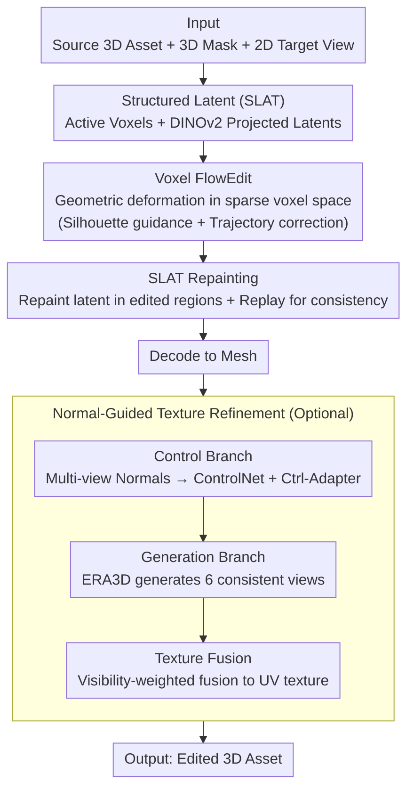

# Easy3E: Feed-Forward 3D Asset Editing via Rectified Voxel Flow

**Conference**: CVPR 2026  
**arXiv**: [2602.21499](https://arxiv.org/abs/2602.21499)  
**Code**: TBD  
**Area**: 3D Vision  
**Keywords**: 3D Editing, Feed-forward Generation, Voxel Flow, Flow Matching, Texture Optimization

## TL;DR

Ours proposes a feed-forward 3D asset editing framework based on the TRELLIS 3D generative backbone. It achieves globally consistent geometric deformation in a sparse voxel latent space through Voxel FlowEdit and recovers high-frequency details using normal-guided multi-view texture refinement.

## Background & Motivation

**Background**: Existing 3D editing methods can be categorized into two types: (1) **2D-lifting pipelines** (e.g., Instruct-NeRF2NeRF), which perform per-scene iterative optimization of 3D representations supervised by 2D edited images, incurring high computational costs and often collapsing during large geometric edits. (2) **Multi-view diffusion models**, which improve cross-view consistency but still implicitly reason about 3D structures in 2D feature spaces, making it difficult to handle topological or volumetric changes.

**Limitations of Prior Work**: Recently emerged **3D-native generative models** (e.g., TRELLIS, LRM) provide a new paradigm for feed-forward editing by directly learning structured 3D latent spaces. However, they face two major challenges:
- Absence of paired 3D editing data requires adapting training-free 2D editing methods to 3D latent spaces, while many 2D methods rely on non-transferable components like cross-attention.
- Compressed 3D features lead to the loss of high-frequency textures and insufficient appearance fidelity.

## Method

### Overall Architecture

Easy3E is built upon the TRELLIS backbone and consists of two stages: **Geometry Editing** and **Texture Refinement**.

Input: Source 3D asset $\mathcal{A}_{\text{src}}$, 3D region mask $\mathcal{M}$, and a target view image $I^{\text{tgt}}$ obtained via 2D editing.
Output: Edited 3D asset.

Mechanism: Apply **Voxel FlowEdit** for global geometric deformation in the sparse voxel latent space → **SLAT Repainting** to refine local latent features → Decode to generate mesh → **Normal-guided Texture Refinement** to recover high-fidelity textures.

### Key Designs

1.  **Structured Latent (SLAT) Representation**: The 3D asset is represented as $\mathbf{Z}=(\mathcal{V}, \{\mathbf{z}_{\mathbf{p}}\}_{\mathbf{p}\in\mathcal{V}})$, where $\mathcal{V}$ is the set of active voxels intersecting the mesh surface, and $\mathbf{z}_{\mathbf{p}}$ is the local latent feature fused from DINOv2 projections. TRELLIS uses two rectified flow transformers to predict voxel structure and latent fields, providing a foundation for direct editing in the 3D latent space.

2.  **Voxel FlowEdit (Sparse Voxel Editing)**: This core innovation constructs a continuous editing trajectory from source to target in the 3D VAE latent space. Inspired by FlowEdit, the editing velocity field is defined as the difference between target and source conditioned velocities:

    $$\mathbf{v}_{\text{edit}}(\mathbf{x}_t, t) = \mathbf{v}_{\theta}(\mathbf{x}^{\text{tgt}}_t, t \mid I^{\text{tgt}}) - \mathbf{v}_{\theta}(\mathbf{x}^{\text{src}}_t, t \mid I^{\text{src}})$$

    Direct ODE integration suffers from trajectory drift and structural collapse due to discretization errors. Thus, **Guided Flow Regularization** is introduced:
    -   **Silhouette Guidance** $\mathbf{G}_{\text{sil}}$: Gradient of BCE loss based on the target silhouette to align the evolving structure.
    -   **Trajectory Consistency Correction** $\boldsymbol{\xi}_{\text{traj}}$: Projects deviated latent states back onto the manifold.

    Final update: $\mathrm{d}\mathbf{x}_t = \mathcal{M}_\ell \odot \big[\mathbf{v}_{\text{edit}} + \Gamma\boldsymbol{\xi}_{\text{traj}} - \eta\mathbf{G}_{\text{sil}}\big]\mathrm{d}t$

    where $\mathcal{M}_\ell$ restricts updates to editable regions, and $\Gamma=0.1, \eta=0.2$ control the weights.

3.  **SLAT Repainting**: Refines local latent features on the edited voxels $\mathcal{V}_{\text{tgt}}$. Editable regions use the target-conditioned velocity field, while non-editable regions replay the forward diffusion trajectory of the source distribution to maintain consistency:

    $$\mathbf{z}_{k-1} = \mathcal{M}_z \odot [\mathbf{z}_k + \Delta t \cdot \mathbf{v}_\theta(\mathbf{z}_k, t_k \mid I^{\text{tgt}})] + (1-\mathcal{M}_z) \odot [(1-t_k)\mathbf{z}^{\text{src}} + t_k\boldsymbol{\epsilon}_k]$$

    A soft mask $\widetilde{\mathcal{M}_z}=\text{blur}(\mathcal{M}_z; \sigma_b)$ is used to avoid seam artifacts.

4.  **Normal-guided Texture Refinement**: An optional module to address high-frequency texture loss in compressed 3D representations.
    -   **Control Branch**: Frozen ControlNet + trainable Ctrl-Adapter takes multi-view normals of the edited mesh to extract geometric control features.
    -   **Generation Branch**: Based on the ERA3D architecture, it generates 6 geometrically consistent views guided by $I^{\text{tgt}}$ and control features.
    -   **Texture Fusion**: Visibility-aware, mask-weighted fusion into the UV texture.

### Loss & Training

-   Voxel FlowEdit is **training-free**, utilizing the velocity field of a pre-trained TRELLIS for inference.
-   ODE is discretized into 25 sampling steps, with CFG set to 5–15 for the target side and fixed at 5 for the source side.
-   The editing velocity $\mathbf{v}_{\text{edit}}$ is averaged over $n_{\text{avg}} \in \{2,4\}$ noise samples to improve stability.
-   Ctrl-Adapter is trained on an Objaverse subset (6 views at $512 \times 512$ + normal maps). Only Adapter parameters are updated; ControlNet and ERA3D backbones are frozen.

## Key Experimental Results

### Main Results

Evaluation set: 100 3D assets (Sketchfab, NPHM, THuman2.1, Objaverse) covering heads, bodies, and objects.

| Method | CLIP-T ↑ | DINO-I ↑ | LPIPS ↓ | FID ↓ |
| :--- | :--- | :--- | :--- | :--- |
| TRELLIS | 0.323 | 0.895 | 0.243 | 45.8 |
| MVEdit | 0.267 | 0.851 | 0.282 | 67.6 |
| Vox-E | 0.266 | 0.734 | 0.673 | 90.3 |
| Instant3DiT | 0.285 | 0.874 | 0.286 | 49.7 |
| **Ours (Easy3E)** | **0.326** | **0.952** | **0.138** | **25.8** |

Easy3E leads across all metrics: FID is reduced by 43.7% and LPIPS by 43.2% compared to the second-best, TRELLIS.

### Ablation Study

| Configuration | Effect | Description |
| :--- | :--- | :--- |
| w/o Flow Guidance ($\mathbf{G}_{\text{sil}}$ + $\boldsymbol{\xi}_{\text{traj}}$) | Structural collapse + excess source retention | Both must be used jointly; separate activation leads to unbalanced updates. |
| w/o Texture Refinement | Blur and color shifts in edited areas | Normal-guided module significantly improves surface details and view-consistent appearance. |
| Full Model | Clean geometry + high-fidelity texture | All modules are complementary. |

### Key Findings

-   **User Study** (46 participants × 10 groups): Easy3E leads significantly in Prompt Retention (88.98%), Identity Preservation (94.63%), Editing Quality (94.92%), 3D Consistency (97.51%), and Overall (97.00%).
-   Among competitors, MVEdit only produces texture-level changes with minimal geometric modification; Vox-E and Instant3DiT struggle to maintain structural integrity.
-   Feed-forward inference eliminates the need for per-scene optimization.

## Highlights & Insights

-   **Core Insight**: Direct editing in a 3D-native structured latent space is more suitable for large geometric deformations than 2D-lifting or multi-view diffusion.
-   Voxel FlowEdit adapts the 2D flow-matching editing paradigm to 3D sparse voxels, solving discretization drift using silhouette guidance and trajectory correction.
-   The decomposition of editing into "Geometry in latent space + Appearance via multi-view diffusion" is elegant, leveraging the geometric strengths of 3D models and the texture strengths of 2D diffusion models.

## Limitations & Future Work

-   Performance is bounded by the generative capacity of TRELLIS; extreme geometric modifications remain challenging.
-   Normal-guided refinement currently operates on lower-resolution synthesized views, limiting the recovery of extremely fine textures.
-   Interactive costs could be reduced as users currently need to provide 3D masks and 2D target views.
-   Specific inference time values were not reported (described as "fast" but lacks quantitative comparison).

## Related Work & Insights

-   **TRELLIS**: The 3D generative backbone of this work, learning structured 3D latents.
-   **FlowEdit**: A 2D flow-matching editing method extended here to 3D voxel space.
-   **ERA3D**: A multi-view diffusion architecture used for the texture refinement branch.
-   Insight: The emergence of 3D-native generative models opens a new paradigm for 3D editing; "latent space editing" may become the mainstream.

## Rating

-   Novelty: ⭐⭐⭐⭐ Adapting flow-matching editing to 3D sparse voxel space is a novel attempt with clever framework design.
-   Experimental Thoroughness: ⭐⭐⭐⭐ Comprehensive quantitative metrics, user studies, and ablations, though lacking inference speed comparisons.
-   Writing Quality: ⭐⭐⭐⭐ Clear structure, detailed derivations, and intuitive illustrations.
-   Value: ⭐⭐⭐⭐ Feed-forward 3D editing is a high-demand scenario, and this work provides the strongest solution to date.

<!-- RELATED:START -->

## Related Papers

- [\[CVPR 2026\] Feed-forward Gaussian Registration for Head Avatar Creation and Editing](feed-forward_gaussian_registration_for_head_avatar_creation_and_editing.md)
- [\[CVPR 2026\] AnchorSplat: Feed-Forward 3D Gaussian Splatting with 3D Geometric Priors](anchorsplat_feed-forward_3d_gaussian_splatting_with_3d_geometric_priors.md)
- [\[CVPR 2026\] Affostruction: 3D Affordance Grounding with Generative Reconstruction](affostruction_3d_affordance_grounding_with_generative_reconstruction.md)
- [\[CVPR 2026\] Human Geometry Distribution for 3D Animation Generation](human_geometry_distribution_for_3d_animation_generation.md)
- [\[CVPR 2026\] From Rays to Projections: Better Inputs for Feed-Forward View Synthesis](from_rays_to_projections_better_inputs_for_feed-forward_view_synthesis.md)

<!-- RELATED:END -->
