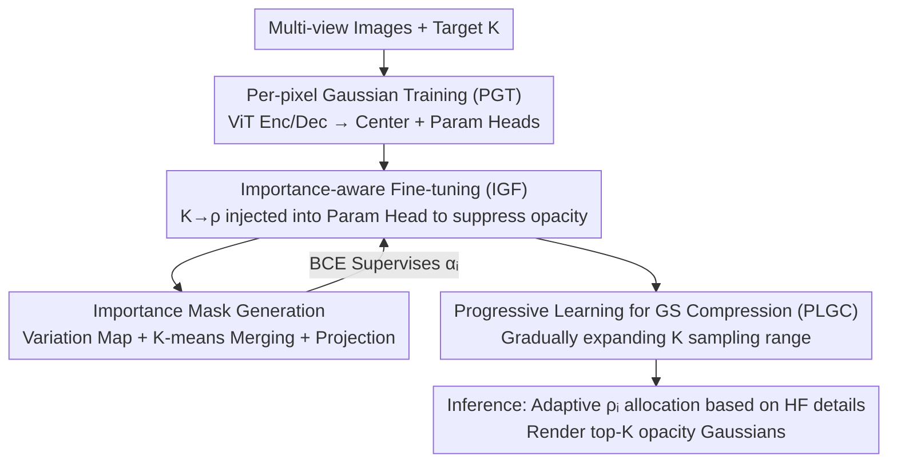

# EcoSplat: Efficiency-controllable Feed-forward 3D Gaussian Splatting from Multi-view Images

**Conference**: CVPR 2026  
**Paper**: [CVF Open Access](https://openaccess.thecvf.com/content/CVPR2026/html/Bui_EcoSplat_Efficiency-controllable_Feed-forward_3D_Gaussian_Splatting_from_Multi-view_Images_CVPR_2026_paper.html)  
**Code**: [Project Page](https://kaist-viclab.github.io/ecosplat-site/) (Code to be released)  
**Area**: 3D Vision  
**Keywords**: Feed-forward 3DGS, Novel View Synthesis, Controllable Gaussian Count, Importance Ranking, Multi-view Reconstruction  

## TL;DR
EcoSplat is the first "count-controllable" feed-forward 3D Gaussian Splatting framework. Given an arbitrary target primitive count $K$ at inference, it selects the $K$ most significant Gaussians via a single feed-forward pass. Under extreme constraints (RE10K 24-view, compressed to 5% primitives), it achieves a PSNR of 24.7, significantly outperforming existing feed-forward methods that rely on threshold-based pruning.

## Background & Motivation
**Background**: Prevailing feed-forward 3DGS methods (e.g., PixelSplat, MVSplat, DepthSplat, NoPoSplat, SPFSplat) adopt "per-pixel alignment"—back-projecting every pixel of each input image into a 3D Gaussian and aggregating them to represent the scene. This enables reconstruction via a single feed-forward pass, bypassing the time-consuming per-scene optimization of original 3DGS.

**Limitations of Prior Work**: Per-pixel alignment implies that the total number of primitives **grows linearly** with the number of input views and image resolution. For dense views (e.g., 24 views at 256×256), the count reaches millions, which is unsuitable for edge devices like smartphones or AR/VR headsets. Crucially, these methods lack **explicit control over the output Gaussian count**; one cannot specify a fixed budget (e.g., exactly 50,000 Gaussians).

**Key Challenge**: existing memory-efficient solutions (AnySplat's voxelization, GGN's graph aggregation, Zpressor's keyframe clustering, Long-LRM's opacity pruning) are **threshold-based**—relying on voxel size, similarity, or opacity thresholds. These hyperparameters are scene-sensitive, resulting in primitive counts that **vary per scene and are unstable**, leading to unpredictable latency, memory, and bandwidth, as well as poor quality-efficiency trade-offs.

**Goal**: To enable a feed-forward model to **precisely satisfy an arbitrary target primitive count $K$** at inference while maximizing rendering quality under that budget.

**Key Insight**: Instead of post-hoc pruning, the model should **learn to rank Gaussian importance by budget during training**. By injecting $K$ as a conditional signal, the model is trained to actively suppress the opacity of unimportant Gaussians. At inference, the top-K Gaussians with the highest opacity are retained.

**Core Idea**: Replace "post-hoc threshold pruning" with "target count $K$ conditioned, importance-aware opacity suppression" to achieve feed-forward, controllable, and stable Gaussian compression.

## Method

### Overall Architecture
Given $N$ multi-view images $\{I_i\}_{i=1}^N$ and a target count $K$, EcoSplat outputs a set of $K$ 3D Gaussians $G=\{G_k\}_{k=1}^K$. The mechanism performs view-wise ranking to select the most informative subset, ensuring the total count precisely equals $K$.

The pipeline consists of a two-stage training process and an inference workflow. **Stage 1: PGT** trains a standard per-pixel feed-forward 3DGS (ViT encoder → Multi-view ViT decoder → center head $F_\mu$ + parameter head $F_\nu$) to ensure reliable base reconstruction. **Stage 2: IGF** freezes the encoder/decoder and the center head $F_\mu$, fine-tuning only the parameter head $F_\nu$. The target $K$ is converted into a retention ratio $\rho_i=K/(NHW)$, encoded as an importance embedding, and injected into $F_\nu$. An "importance mask" serves as pseudo-GT, supervised by an importance-aware opacity loss $L_\text{io}$ to suppress unimportant Gaussians. To ensure robustness across a **wide range** of $K$, the PLGC strategy gradually expands the sampling range of $K$ during training. During inference, primitive counts are adaptively allocated per view based on detail complexity, followed by top-K opacity selection.

### Key Designs

**1. Importance-aware Fine-tuning (IGF): Learning Compression via Target Count K**

This is the core distinction from threshold-based pruning. IGF converts $K$ into a ratio $\rho_i=\frac{K}{NHW}$, broadcasts it as an $H\times W$ tensor, and processes it through a shallow CNN to obtain a learnable importance embedding $R_i\in\mathbb{R}^{H\times W\times C}$. This is injected into $F_\nu$ to output **adaptive** Gaussian parameters:

$$\{[\tilde\alpha_{i,j};\tilde\Sigma_{i,j};\tilde c_{i,j}]\}_{j=1}^{HW}=F_\nu\big(\{Z_i^{(\ell)}\}_{\ell=1}^m,\ \psi(I_i),\ R_i\big)$$

Supervision is provided by the importance-aware opacity loss $L_\text{io}$, using BCE to fit the predicted opacity $\tilde\alpha_{i,j}$ to an importance mask $\Omega_i$:
$$L_\text{io}=\lambda_\text{io}\cdot\frac{1}{NHW}\sum_{i=1}^N\sum_{j=1}^{HW}L_\text{BCE}(\Omega_{i,j},\ \tilde\alpha_{i,j})$$
Simultaneously, only the top-K Gaussians are used for differentiable rendering to calculate $L_{K\text{-render}}$ (MSE + 0.05·LPIPS). Removing IGF leads to an 18 dB drop at a 5% budget, marking it as the most critical component.

**2. Importance Mask Generation: Unsupervised Pseudo-labels via Complexity**

The mask $\Omega_i$ defines "which Gaussians to keep" via three steps. ① **Binary Variation Map**: Measures photometric complexity $g_{\text{photo},i}$ (image gradient magnitude) and geometric complexity $g_{\text{geo},i}$ (gradient of predicted normal maps). The average $g_i$ is binarized into $g'_i$ using a quantile threshold $\epsilon_i=Q_{\rho_i}(\{g_{i,j}\})$. ② **Important Gaussian Collection**: All Gaussians in high-variation regions $\mathcal G_i^\text{high}$ are kept. In low-variation regions $\mathcal G_i^\text{low}$, redundant Gaussians are merged via **single-step K-means** to form a compact set $\mathcal G_i^c$. The final set is $\mathcal G_i^\Omega=\mathcal G_i^\text{high}\cup\mathcal G_i^c$. ③ **Projection**: The 3D centers are projected back to the image plane to form the binary mask $\Omega_i$. This approach quantifies the intuition of "keeping details while merging flat areas," with thresholds automatically scaling with $\rho_i$.

**3. Progressive Learning for GS Compression (PLGC): Robustness across Budgets**

To handle the instability of sampling $K$ across a full range, PLGC **gradually expands the sampling interval** $[K_\text{min},K_\text{max}]$. The upper bound is fixed at $K_\text{max}=0.95\cdot NHW$, while the lower bound anneals from $0.85\cdot NHW$ to $0.05\cdot NHW$:
$$K_\text{min}=\max\big(0.85-\lambda_\text{decay}\lfloor t/S\rfloor,\ 0.05\big)\cdot NHW$$
This ensures the model handles aggressive compression (5% budget) stably. Without PLGC, PSNR drops to 21.49 at the 5% budget due to training instability.

**4. Inference-time Adaptive Primitive Allocation**

While $\rho_i$ is shared across views during training, views vary in information density at inference. High-detail views are allocated more Gaussians by defining a high-frequency score $\eta_i$ via 2D DFT: $\eta_i=1-\frac{\sum_{\xi\in\Lambda}E_i(\xi)}{\sum_\xi E_i(\xi)}$, where $\Lambda$ is the low-frequency region. Temperature-scaled softmax yields the factor $\kappa_i=N\cdot\Psi_i,\ \Psi_i=\frac{e^{\eta_i/T}}{\sum_q e^{\eta_q/T}}$. The per-view ratio becomes $\rho_i=\kappa_i\rho$. This ensures the **total count still matches K**, while shifting the budget toward high-frequency views.

### Loss & Training
- **PGT Stage**: Rendering loss $L_\text{render}=\frac{1}{N^\text{tgt}}\sum_p L_\text{MSE}+0.05\cdot L_\text{LPIPS}$ using all per-pixel Gaussians.
- **IGF Stage**: $L=L_\text{io}+L_{K\text{-render}}$, where $L_{K\text{-render}}$ only involves top-K Gaussians. Encoders/decoders and $F_\mu$ are frozen.
- Data: RE10K (~10M frames), 256×256, following NoPoSplat evaluation protocols.

## Key Experimental Results

### Main Results
Comparison on RE10K (24 input views) across budgets of 5%/10%/40%/70% of the total primitive count ($NHW$):

| Method | 5% PSNR | 5% LPIPS | 10% PSNR | 40% PSNR | 70% PSNR |
|------|---------|----------|----------|----------|----------|
| AnySplat (Voxelization) | 8.08 | 0.593 | 10.37 | 19.66 | 21.85 |
| WorldMirror (Voxelization) | 8.09 | 0.632 | 10.20 | 19.66 | 22.11 |
| SPFSplat + LightGaussian Pruning | 7.44 | 0.624 | 8.23 | 11.77 | 15.32 |
| GGN (Graph Agg., N/A <15%) | N/A | N/A | N/A | 15.86 | 15.71 |
| **EcoSplat (Ours)** | **24.72** | **0.183** | **25.00** | **25.11** | **25.00** |

Voxelization methods collapse at 5%/10% (PSNR ~8), and post-hoc pruning on per-pixel methods leaves holes. EcoSplat remains stable across all budgets (24.7–25.1 PSNR).

Multi-view setting (24 views, comparison of Gaussian count #GS):

| Method | 24-view PSNR | 24-view LPIPS | #GS |
|------|--------------|---------------|-----|
| MVSplat | 14.86 | 0.440 | 1573K |
| NoPoSplat | 20.70 | 0.252 | 1573K |
| SPFSplat | 24.74 | 0.145 | 1573K |
| GGN | 15.80 | 0.408 | 512K |
| AnySplat | 21.90 | 0.173 | 1259K |
| **Ours 5%** | 24.72 | 0.183 | **78K** |
| **Ours 40%** | **25.11** | 0.164 | 629K |

EcoSplat 5% uses only 78K Gaussians (approx. 1/7 of GGN) while achieving +9 dB PSNR.

### Ablation Study
RE10K 24-view:

| Configuration | 5% PSNR | 5% LPIPS | 40% PSNR |
|------|---------|----------|----------|
| w/o PGT | 22.93 | 0.221 | 23.70 |
| w/o IGF | 6.45 | 0.651 | 14.02 |
| w/o $L_\text{io}$ | 20.58 | 0.289 | 23.81 |
| w/o PLGC | 21.49 | 0.280 | 23.84 |
| **Full** | **24.72** | **0.183** | **25.11** |

### Key Findings
- **IGF is vital**: Removing it at a 5% budget causes an 18+ dB drop, proving that importance ranking must be learned during training.
- **Robustness at Extreme Budgets**: $L_\text{io}$ and PLGC are critical for the 5% budget, both preventing collapses and ensuring structural integrity.
- **Opacity Distribution**: Visualizations show that at $K=5\%$, most Gaussians are suppressed toward zero opacity, while a essential subset for structure and photometry maintains high opacity, validating the importance ranking logic.

## Highlights & Insights
- **Revisiting Pruning**: The core insight is that per-pixel 3DGS creates "holes" if Gaussians are pruned post-hoc. By making $K$ a training condition and using opacity as a learnable ranking signal, the top-K selection becomes inherently continuous.
- **Pseudo-labeling Strategy**: The importance mask is unsupervised, utilizing image/normal gradients and K-means without requiring external saliency models.
- **Quality Redistribution**: Using DFT-based high-frequency scores allows for budget tilting toward complex views without violating the total constraint $K$.

## Limitations & Future Work
- **Cross-domain Gap**: On the ACID dataset, Ours 40% is 0.38 dB lower than SPFSplat, indicating that aggressive compression still carries a slight quality cost in pursuit of extreme efficiency.
- ⚠️ **Geometric Dependence**: Since IGF freezes the center head $F_\mu$, errors in PGT geometry (depth/normals) may lead to incorrect importance assignments.
- **Hyperparameter Sensitivity**: Parameters like $\lambda_\text{decay}$, $S$, and $T$ affect training stability and view-wise allocation quality.
- **Future Directions**: Exploring global cross-view budget allocation instead of view-wise top-K could further reduce redundancy.

## Related Work & Insights
- **vs AnySplat / WorldMirror**: These rely on voxel size (a sensitive hyperparameter) and fail at budgets below 40%. EcoSplat provides precise control and remains robust at 5%.
- **vs GGN**: GGN uses graph pooling for pruning but cannot handle budgets under 15%. EcoSplat uses 7x fewer primitives with much higher quality.
- **vs SPFSplat / NoPoSplat**: These are the backbones EcoSplat builds upon. EcoSplat adds controllable compression to their high-quality representations, using 5%–40% primitives to match their performance.

## Rating
- Novelty: ⭐⭐⭐⭐⭐ First count-controllable feed-forward 3DGS; effectively reframes pruning as a training-time ranking problem.
- Experimental Thoroughness: ⭐⭐⭐⭐ Extensive multi-budget and cross-domain testing.
- Writing Quality: ⭐⭐⭐⭐ Clear two-stage pipeline explanation.
- Value: ⭐⭐⭐⭐⭐ Directly addresses edge-deployment constraints (bandwidth/VRAM); approach is adaptable to other explicit representations.

<!-- RELATED:START -->

## Related Papers

- [\[CVPR 2026\] Cross-View Splatter: Feed-Forward View Synthesis with Georeferenced Images](cross-view_splatter_feed-forward_view_synthesis_with_georeferenced_images.md)
- [\[CVPR 2026\] AnchorSplat: Feed-Forward 3D Gaussian Splatting with 3D Geometric Priors](anchorsplat_feed-forward_3d_gaussian_splatting_with_3d_geometric_priors.md)
- [\[CVPR 2026\] From Rays to Projections: Better Inputs for Feed-Forward View Synthesis](from_rays_to_projections_better_inputs_for_feed-forward_view_synthesis.md)
- [\[CVPR 2026\] Feed-forward Gaussian Registration for Head Avatar Creation and Editing](feed-forward_gaussian_registration_for_head_avatar_creation_and_editing.md)
- [\[CVPR 2026\] Confidence-Guided Multi-Scale Aggregation for Sparse-View High-Resolution 3D Gaussian Splatting](confidence-guided_multi-scale_aggregation_for_sparse-view_high-resolution_3d_gau.md)

<!-- RELATED:END -->
## Related Papers

- [\[CVPR 2026\] Cross-View Splatter: Feed-Forward View Synthesis with Georeferenced Images](cross-view_splatter_feed-forward_view_synthesis_with_georeferenced_images.md)
- [\[CVPR 2026\] Z-Order Transformer for Feed-Forward Gaussian Splatting](z-order_transformer_for_feed-forward_gaussian_splatting.md)
- [\[CVPR 2026\] AnchorSplat: Feed-Forward 3D Gaussian Splatting with 3D Geometric Priors](anchorsplat_feed-forward_3d_gaussian_splatting_with_3d_geometric_priors.md)
- [\[CVPR 2026\] BRepGaussian: CAD Reconstruction from Multi-View Images with Gaussian Splatting](brepgaussian_cad_reconstruction_from_multi-view_images_with_gaussian_splatting.md)
- [\[CVPR 2026\] Reliev3R: Relieving Feed-forward 3D Reconstruction from Multi-View Geometric Annotations](reliev3r_relieving_feed-forward_3d_reconstruction_from_multi-view_geometric_annot.md)

<!-- RELATED:END -->
