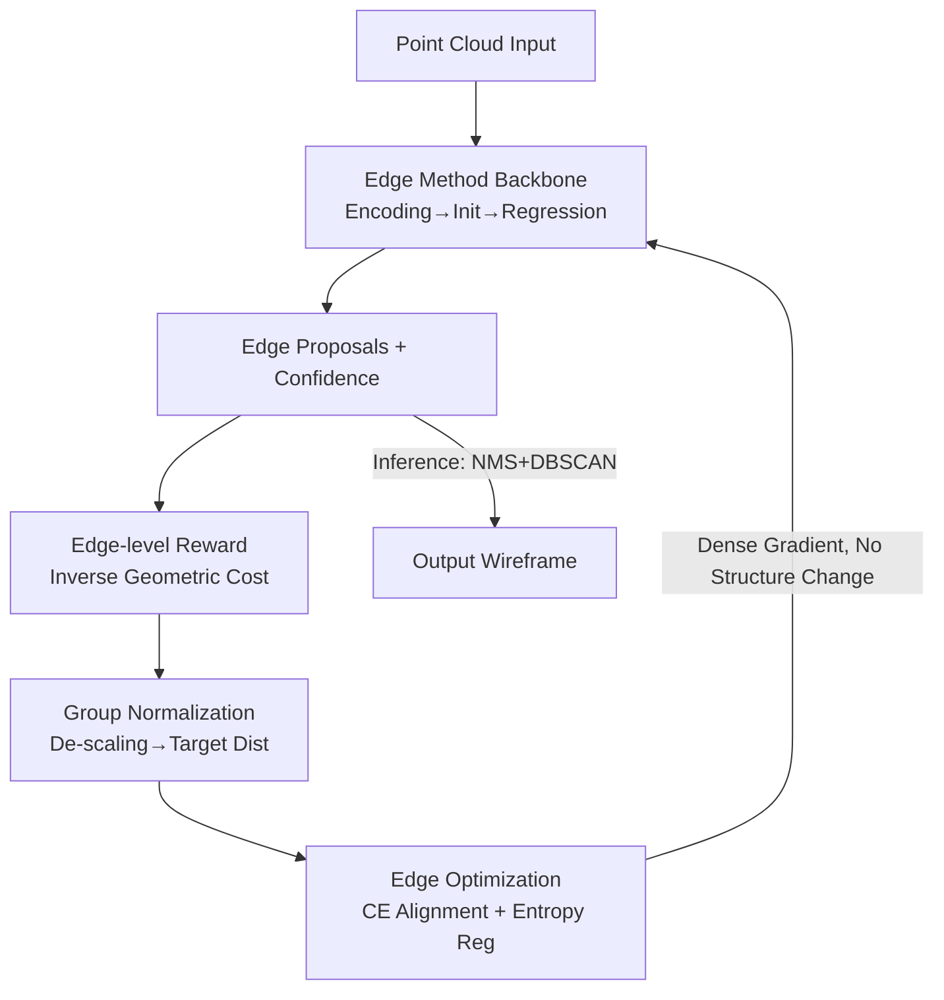

# Edges Compete for Trust: Group Relative Edge Optimization for Building Reconstruction from Point Clouds

**Conference**: CVPR 2026  
**Paper**: [CVF Open Access](https://openaccess.thecvf.com/content/CVPR2026/html/Liu_Edges_Compete_for_Trust_Group_Relative_Edge_Optimization_for_Building_CVPR_2026_paper.html)  
**Code**: None (Paper not yet public)  
**Area**: 3D Vision  
**Keywords**: Building wireframe reconstruction, point clouds, group relative optimization, dense supervision, RL-style training  

## TL;DR
To address the issue where edge-based methods rely on one-to-one Hungarian matching—leaving most edge proposals "unsupervised"—this paper introduces the "intra-group relative advantage" concept from GRPO into wireframe reconstruction. The proposed GREO calculates a continuous reward for every edge based on geometric alignment quality, normalizes it within the group to form a target confidence distribution, and applies dense discriminative supervision via cross-entropy and entropy regularization. As a plug-and-play training strategy, it pushes PBWR / EdgeDiff to SOTA on Building3D with zero inference overhead.

## Background & Motivation
**Background**: Building wireframe reconstruction extracts compact 3D wireframes (vertices and edges) from point clouds. Compared to meshes or implicit fields, wireframes offer advantages in storage efficiency, geometric interpretability, and explicit topology, making them ideal for CAD, smart cities, and AR/VR. Current research is divided into vertex-based methods (sensitive to vertex localization errors) and edge-based methods (directly regressing parameterized edges, e.g., PBWR, EdgeDiff, which are currently more robust).

**Limitations of Prior Work**: During training, edge-based networks generate numerous edge proposals. Hungarian matching establishes **one-to-one** correspondences with ground truth, calculating losses only for matched edges. This results in **sparse supervision**, where most unmatched proposals are treated indiscriminately as negative samples with near-zero gradients, leading to under-optimization.

**Key Challenge**: Sparse supervision has two fatal flaws. First, most edge proposals are not properly optimized throughout training. Second, it ignores geometric differences among unmatched edges—some might be very close to the ground truth while others are far away, yet they receive the same penalty. Conventional supervision focuses on "absolute correctness" rather than "relative quality."

**Key Insight**: The authors noted GRPO in reinforcement learning, which samples multiple outputs for a query and calculates an advantage function based on intra-group reward distributions to produce dense, discriminative signals. Wireframe reconstruction is inherently a "multi-candidate" task, making it highly compatible with the GRPO optimization paradigm.

**Core Idea**: Bring "intra-group relative advantage" to wireframe reconstruction. Instead of feeding gradients only to matched edges, GREO assigns a continuous reward to **every** edge based on its geometric alignment, normalizes these within the group into a target confidence distribution, and forces edges to "compete for confidence." High-quality edges receive higher confidence, while poor ones are suppressed, transforming sparse supervision into dense discriminative supervision. Since wireframe reconstruction is a deterministic structured prediction task, GREO redesigns the policy gradient of GRPO into a supervised alignment objective.

## Method

### Overall Architecture
GREO does not modify any network architecture; it is a **plug-and-play supervision module** integrated into existing edge-based training workflows. The upper part is a standard pipeline: point cloud encoding → initializing edge entities → Transformer decoder cross-attention with point features → regressing edge parameters and confidence.

GREO sits between the "edge proposals" and "ground truth," **active only during training with zero inference cost**. It calculates a geometric cost for each proposal → converts it into a continuous edge-level reward → performs group normalization → applies softmax to create a target confidence distribution → aligns predicted confidence with this target via cross-entropy and entropy regularization.

### Key Designs

**1. Edge-level Reward: Assigning continuous scores based on geometric alignment**

To overcome the "winner-takes-all" nature of Hungarian matching, GREO calculates a reward for **every** predicted edge $e_i$ based on its geometric consistency with ground truth. The matching cost for a proposal $e_i$ against ground truth $g_j$ is defined as:

$$C_{i,j} = \lambda_1 H_d(e_i, g_j) + \lambda_2\big(1 - \cos(e_i, g_j)\big) + \lambda_3\, d_{\text{center}}(e_i, g_j)$$

where $H_d$ is the Hausdorff distance, $1-\cos$ measures orientation mismatch, and $d_{\text{center}}$ is the L1 distance between midpoints. For each prediction, the minimum cost against all ground truths is selected, and the reward is its inverse:

$$\gamma_i = \min_j C_{i,j}, \qquad r_i = 1 - \gamma_i$$

This assigns a discriminative scalar to **all** edges rather than a binary label.

**2. Group Normalization + Target Distribution: Converting absolute rewards to relative rankings**

Absolute rewards $r_i$ have high variance. Borrowing from GRPO, GREO standardizes rewards **within each sample** (i.e., all proposals for one building):

$$z_i = \frac{r_i - \mu_r}{\sigma_r + \epsilon}$$

This step is the core of GREO—shifting the goal from "absolute reward" to "relative advantage." The standardized rewards are then converted into a target confidence distribution using softmax with temperature $\kappa$:

$$q_i = \operatorname{softmax}(\kappa z_i)$$

$q_i$ represents the relative ranking of how much confidence each edge deserves, resolving the sparsity of matching-based training.

**3. Edge Optimization + Entropy Regularization: Distribution alignment and exploration**

The network's predicted confidence $\pi_i$ is aligned with the target distribution $q_i$ by minimizing **cross-entropy**:

$$\mathcal{L}_{\mathrm{CE}} = -\sum_i q_i \log \pi_i$$

To prevent over-confidence or distribution collapse in early training stages, an entropy regularization term is added to maintain diverse exploration:

$$\mathcal{L}_{\mathrm{entropy}} = \eta \sum_i \pi_i \log \pi_i$$

The final GREO objective is the sum of these two, optimized alongside the baseline losses.

### Loss & Training
GREO introduces no new parameters and only adds $\mathcal{L}_{\mathrm{GREO}}$ during the training phase. It is jointly optimized with the geometric and confidence losses of the baselines (PBWR / EdgeDiff). Hyperparameters: $\kappa=3.0$, $\eta=0.01$, $\lambda_1=2.0$, $\lambda_2=\lambda_3=1.0$.

## Key Experimental Results

### Main Results
Evaluated on the Building3D benchmark across Entry-Level and Tallinn subsets using 8 metrics, including WED (Wireframe Edit Distance, ↓) and F1 scores for corners and edges.

| Subset | Method | WED ↓ | CF1 ↑ | EP ↑ | ER ↑ | EF1 ↑ |
|------|------|-------|-------|------|------|------|
| Entry | EdgeDiff (CVPR25) | 0.115 | 0.91 | 0.95 | 0.82 | 0.88 |
| Entry | **EdgeDiff+GREO** | **0.108** | **0.93** | 0.95 | **0.85** | **0.89** |
| Tallinn | PBWR (CVPR24) | 0.271 | 0.80 | 0.91 | 0.65 | 0.76 |
| Tallinn | **PBWR+GREO** | **0.250** | **0.83** | **0.92** | **0.69** | **0.78** |
| Tallinn | EdgeDiff (CVPR25) | 0.255 | 0.84 | 0.92 | 0.70 | 0.79 |
| Tallinn | **EdgeDiff+GREO** | **0.225** | **0.86** | **0.92** | **0.75** | **0.82** |

On the complex Tallinn subset, EdgeDiff+GREO showed significant gains, improving edge recall (ER) by 5% and EF1 by 3%. It outperformed the vertex-based SOTA BWFormer in WED and edge metrics.

### Ablation Study
Breakdown of GREO components on the Tallinn subset (using EdgeDiff):

| Configuration | WED ↓ | CR ↑ | CF1 ↑ | ER ↑ | EF1 ↑ |
|------|-------|------|-------|------|------|
| EdgeDiff baseline | 0.255 | 0.74 | 0.84 | 0.70 | 0.79 |
| + $\mathcal{L}_{\mathrm{CE}}$ (Reward Supervision) | 0.242 | 0.75 | 0.85 | 0.73 | 0.81 |
| + $\mathcal{L}_{\mathrm{CE}}$ + $\mathcal{L}_{\mathrm{entropy}}$ (Full GREO) | **0.225** | 0.76 | 0.86 | 0.75 | 0.82 |

### Key Findings
- **Reward supervision is effective on its own**: Applying $\mathcal{L}_{\mathrm{CE}}$ alone dropped WED significantly, proving that relative ranking provides more discriminative supervision than binary matching.
- **Entropy regularization stabilizes training**: Adding $\mathcal{L}_{\mathrm{entropy}}$ prevents polarization of confidence, further improving recall.
- **Geometric terms are complementary**: The combination of Hausdorff, cosine similarity, and center distance yields the best results.
- **Greater gains in complex scenes**: The Tallinn subset benefited more from dense supervision due to its higher geometric complexity.

## Highlights & Insights
- **Translating RL concepts to structured prediction**: GREO extracts the essence of GRPO—normalized relative advantage—and redesigns it as a supervised distribution alignment goal for deterministic tasks.
- **"Competitive Confidence" perspective**: The concept "Edges Compete for Trust" highlights that most edges in sparse supervision architectures are under-utilized; GREO makes them active participants in the optimization process.
- **Plug-and-play with zero overhead**: By modifying only the training loss, GREO achieves SOTA performance without increasing model size or inference time.
- **Broad transferability**: This paradigm can be extended to other structured tasks like object detection or CAD generation where many-to-one or one-to-one matching creates supervision sparsity.

## Limitations & Future Work
- The reward is purely geometric; it lacks explicit constraints for **topological correctness** (e.g., connectivity or closure).
- Multiple hyperparameters ($\kappa, \eta, \lambda$) are introduced; while defaults work, tuning costs for new datasets are not fully explored.
- Evaluation is limited to building point clouds; utility in other domains (e.g., mechanical parts) remains to be seen.

## Related Work & Insights
- **vs. Hungarian Matching**: Unlike traditional one-to-one matching that ignores unmatched proposals, GREO provides dense gradients to all edges based on relative quality.
- **vs. GRPO**: While GRPO uses policy gradients and KL constraints for LLMs, GREO simplifies this for deterministic regression by using cross-entropy for distribution alignment.
- **vs. Vertex-based methods**: Edge-based methods with GREO achieve better edge consistency and fidelity compared to methods that focus solely on vertex detection.

## Rating
- Novelty: ⭐⭐⭐⭐⭐ 
- Experimental Thoroughness: ⭐⭐⭐⭐ 
- Writing Quality: ⭐⭐⭐⭐⭐ 
- Value: ⭐⭐⭐⭐⭐ 

<!-- RELATED:START -->

## Related Papers

- [\[CVPR 2026\] Ghosts in the Point Clouds: De-glaring LiDAR in the Transient Domain](ghosts_in_the_point_clouds_de-glaring_lidar_in_the_transient_domain.md)
- [\[CVPR 2026\] E2EGS: Event-to-Edge Gaussian Splatting for Pose-Free 3D Reconstruction](e2egs_event-to-edge_gaussian_splatting_for_pose-free_3d_reconstruction.md)
- [\[CVPR 2026\] JOPP-3D: Joint Open Vocabulary Semantic Segmentation on Point Clouds and Panoramas](jopp3d_joint_open_vocabulary_semantic_segmentation.md)
- [\[CVPR 2026\] GaussianGrow: Geometry-aware Gaussian Growing from 3D Point Clouds with Text Guidance](gaussiangrow_geometry-aware_gaussian_growing_from_3d_point_clouds_with_text_guid.md)
- [\[CVPR 2026\] 3D sans 3D Scans: Scalable Pre-training from Video-Generated Point Clouds](3d_sans_3d_scans_scalable_pre-training_from_video-generated_point_clouds.md)

<!-- RELATED:END -->
