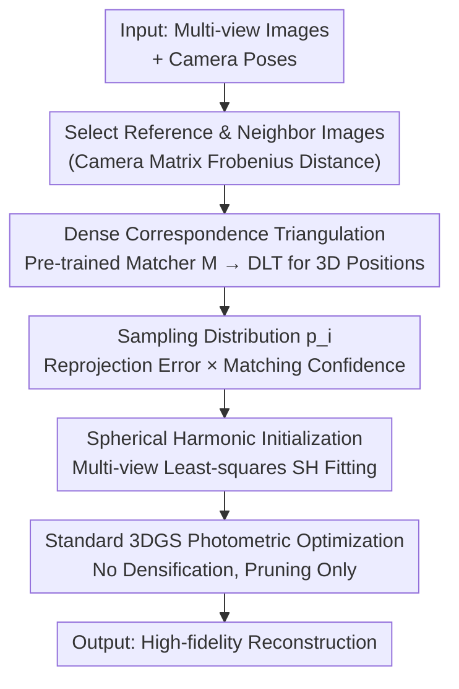

# EDGS: Eliminating Densification for Efficient Convergence of 3DGS

**Conference**: CVPR 2026  
**Paper**: [CVF Open Access](https://openaccess.thecvf.com/content/CVPR2026/html/Kotovenko_EDGS_Eliminating_Densification_for_Efficient_Convergence_of_3DGS_CVPR_2026_paper.html)  
**Code**: https://compvis.github.io/EDGS (Project Page)  
**Area**: 3D Vision  
**Keywords**: 3D Gaussian Splatting, Dense Initialization, Densification, Triangulation, Novel View Synthesis

## TL;DR
EDGS completely eliminates the slow "progressive densification during training" process in 3DGS. Instead, it triangulates a massive set of Gaussians with already known positions, colors, and scales at the very beginning using dense 2D correspondences. This achieves the quality of original 3DGS in just 15% of the training time, and further training reduces the LPIPS by an additional 35%.

## Background & Motivation
**Background**: 3D Gaussian Splatting (3DGS) is currently the mainstream explicit scene representation. Starting from a sparse point cloud provided by SfM, it models the scene as a collection of 3D Gaussians (each with position, shape, color, and opacity). It then relies on Adaptive Density Control (ADC) to repeatedly **split/clone** Gaussians in under-reconstructed areas to progressively recover details.

**Limitations of Prior Work**: This progressive densification process is both slow and inaccurate. ① Slow: although the densification operation itself is computationally cheap, the model must optimize the existing Gaussians for multiple steps to confirm if a region is indeed under-fitted before deciding to add points. Thus, individual Gaussians undergo many repeated adjustments, taking a long optimization path and severely delaying overall convergence. ② Inaccurate: the original 3DGS uses the gradient norm of the photometric loss to identify under-reconstructed regions. This criterion often fails in high-frequency regions (e.g., grass, gravel, complex textures) and does not align well with human perception, leaving high-frequency details blurry.

**Key Challenge**: Densification delegates the decision of "where geometry needs more primitives" to a **post-hoc, gradient-based, and sequential** exploration process. It requires optimization to converge to make accurate judgments and can only add points locally and incrementally. Both the slowness and the blurriness stem from this.

**Goal**: Is it possible to completely bypass densification? Specifically, instead of gradually growing Gaussians during training, can we deploy dense, highly informative Gaussians all at once **before** optimization begins?

**Key Insight**: The authors observe that **dense pixel correspondences** across multi-view images inherently encode scene geometry. Given camera poses and matched pixels, triangulation can directly recover 3D points. Instead of waiting for photometric loss to slowly inject information, it is better to extract all available 2D image information from the very beginning.

**Core Idea**: Replace "incremental densification" with "dense initialization obtained via dense correspondence triangulation." Right after spawning, each Gaussian is equipped with position, color, and scale derived from the input RGB, and is immediately supervised by rich pixel-wise photometric signals. This significantly shortens the optimization path and allows densification to be completely eliminated.

## Method

### Overall Architecture
EDGS does not modify the rendering and optimization algorithms of 3DGS, but completely replaces the **initialization** stage. The pipeline proceeds as follows: select a reference image $I_i$ from the training set and find several neighboring images $\{I_j\}$ with the largest field-of-view overlap; calculate pixel-wise correspondences for each neighbor using a pre-trained dense matching network $M$ (defaulting to RoMa); triangulate matched pixel pairs into 3D points to obtain candidate Gaussian positions. Since dense matching produces a massive and noisy point set, a **sampling distribution** $p_i$ is used to simultaneously measure "geometric consistency (reprojection error)" and "matching confidence" to sample a set of reliable Gaussians. Then, spherical harmonic (SH) coefficients are fitted for each sampled Gaussian using reference image colors. Finally, this set of dense Gaussians, which already has accurate positions, colors, and reasonable scales, directly enters **standard 3DGS photometric loss optimization** without any densification throughout training.

### Key Designs

**1. Dense Initialization as a Replacement for Densification: Moving Geometry "Upfront" Before Optimization**

This is the core of the paper. The pain point of the original 3DGS is that deciding "where and when to add points" is a post-hoc, sequential judgment driven by photometric loss gradients, which is slow and inaccurate in high-frequency regions. EDGS's approach is: instead of letting the model slowly discover "where points are missing" during training, it populates the Gaussians fully using all available 2D information right from the start. Specifically, it computes **dense** pixel correspondences (rather than sparse keypoints) across multiple input views, triangulates them into 3D points as the initial Gaussian positions, reads colors directly from the reference views, and derives scales from geometry. Consequently, every Gaussian obtains a "well-informed" position, color, and scale at step 0, and is immediately supervised by pixel-wise photometric signals. This drastically shortens the optimization path (as quantified in Fig. 2/4 of the paper via displacement and trajectory length: the starting points of Gaussians are closer to their final locations with less movement). Compared to initializations relying on sparse keypoints, dense correspondence guarantees a **uniform detail density across the entire scene**, effectively covering even the high-frequency areas that present the greatest challenges for other methods. Furthermore, all Gaussians are initialized **in parallel** at the start, removing the need to wait sequentially for batches to be added and adjusted as required by densification.

**2. Multi-view Triangulation of Pixel Pairs: Recovering 3D Positions from Matches**

With pixel correspondences, 2D matches must be converted into reliable 3D coordinates. For a pair of matched pixels $(u^i_k, v^i_k)$ and $(u^j_k, v^j_k)$ under known camera projection matrices $P^i, P^j$, each projection equation provides constraints such as $[g^x_k\,1]P^i_{col,0} = w^i_k u^i_k$. Eliminating the homogeneous scalar $w$ via the third column $[g^x_k\,1]P^i_{col,2}=w^i_k$ yields a system of linear equations $A g^x_k = -b$ for the 3D coordinates $g^x_k$, which is solved via least squares:

$$g^x_k := \arg\min_{x}\,\|A x + b\|^2 .$$

This is the classic DLT (Direct Linear Transformation) triangulation, solved independently for each matched pixel pair to obtain the 3D center of candidate Gaussians. Its value lies in that geometry is no longer "searched for" through optimization but is **directly solved in closed-form** from camera geometry, establishing the foundation for such a reliable initialization.

**3. Geometry × Confidence Sampling Distribution: Selecting Reliable Points from Massive Noisy Matches**

Dense matching produces points far exceeding a practical scale, and many of them are mismatches—using them all directly is computationally prohibitive and would contaminate the initialization. The authors define a sampling distribution $p_i$ for each reference view to filter points based on two dimensions: ① **Geometric Consistency**: project the triangulated point back to the reference view and calculate the reprojection error $\eta^i_k = \|\pi(P^i, g^x_k) - (u^i_k, v^i_k)\|_2$ (likewise for the neighbor view, taking the maximum of the two as $\eta^{ij}_k$). A large error indicates cross-view inconsistency and should be avoided. ② **Matching Confidence**: the confidence score $c_{ij}$ output by the matcher. These two scores are converted to uniform distributions $p^{ij}_{corr}$ and $p^{ij}_{proj}$ within thresholds, element-wise multiplied, and maximized over neighbors to obtain $p_i(k) \propto \max_{j}\big(p^{ij}_{corr}(k)\,p^{ij}_{proj}(k)\big)$. Finally, they are aggregated across reference images into a global distribution $p(k)\propto\prod_i p_i(k)$. Put simply, **only points that are both confidently matched across views and geometrically self-consistent through triangulation have a high probability of being sampled as Gaussians.** This step is key to making the "dense but noisy" initialization robust; removing either term in the ablation studies causes a significant performance drop.

**4. Spherical Harmonic Coefficient Initialization: Achieving View-Consistent Colors from the Start**

Position and a single color are insufficient; 3DGS uses spherical harmonics (SH) to express the view-dependent color of Gaussians. For each sampled Gaussian, EDGS gathers $n$ RGB observations $O_k$ from the $n$ views where it is visible to construct a matrix $Y_k$ of SH basis functions (up to degree 3, with 16 dimensions total) in each viewing direction. It then fits the SH coefficients via least squares: $\hat H_k = \arg\min_H \|Y_k H - O_k\|_F^2$. When the number of observations $n<16$ (under-constrained), the Moore-Penrose pseudoinverse $\hat H_k = Y_k^{+}O_k$ is used instead to guarantee stable solutions. As a result, the colors of Gaussians are already "view-consistent" upon creation, eliminating the time spent correcting colors during early optimization. Ablations indicate this primarily improves LPIPS (perceptual quality).

### Loss & Training
Once initialized, **no new losses or regularizations are introduced**; standard 3DGS photometric loss is directly applied to refine Gaussian parameters, with pruning enabled and densification disabled (Tab. 1 settings). Interestingly, the number of Gaussians **decreased rather than increased** during training: on Mip-NeRF360, it drops from up to 3.6M initially to 2.6M at 5K steps, and 1.9M at convergence—incorrectly initialized Gaussians are gradually pruned. The default initialization preprocessing takes approximately 120s per scene on a single A100 GPU (76s for dense matching, 11s for triangulation, 15s for SH estimation), with a peak GPU memory of 15GB. This preprocessing time is already included in the total training time reported in the paper.

## Key Experimental Results

### Main Results
Evaluated on three datasets: Mip-NeRF360, Tanks&Temples, and Deep Blending (A100 GPU, baselines re-evaluated on the same hardware). EDGS+3DGS denotes the full 30,000-step version without densification.

| Dataset | Metric | EDGS+3DGS | 3DGS-MCMC | Original 3DGS* |
|--------|------|-----------|-----------|------------|
| Tanks&Temples | SSIM↑ / PSNR↑ / LPIPS↓ | **0.868 / 24.28 / 0.132** | 0.863 / 24.22 / 0.158 | 0.853 / 23.76 / 0.169 |
| Mip-NeRF360 | SSIM↑ / PSNR↑ / LPIPS↓ | 0.839 / 28.02 / **0.141** | **0.842** / **28.15** / 0.176 | 0.816 / 27.49 / 0.215 |
| Deep Blending | SSIM↑ / PSNR↑ / LPIPS↓ | 0.904 / 29.81 / **0.223** | 0.902 / 29.56 / 0.244 | 0.908 / 29.77 / 0.242 |

EDGS achieves optimal or sub-optimal results on almost all three datasets, showing a **notable lead in LPIPS (perceptual quality)**, while operating without densification and using fewer Gaussians (1.4–1.9M vs. 2–6M of competitors).

Efficiency comparison (Mip-NeRF360, early stopping setup):

| Method | SSIM↑ | PSNR↑ | LPIPS↓ | Training Time |
|------|-------|-------|--------|----------|
| Taming 3DGS | 0.820 | 27.71 | 0.207 | 14m |
| MiniSplatting | 0.820 | 27.25 | 0.217 | 12m |
| **EDGS+3DGS 10K** | **0.834** | 27.54 | **0.154** | 12m |
| **EDGS+3DGS 5K** | 0.825 | 26.88 | 0.166 | **8m** |

Even when trained for only 5K steps (8 minutes), EDGS still outperforms all other efficient methods in two out of three metrics.

Compatibility (integrated as initialization into other densification methods, Tab. 3): when AbsGS, 3DGS-MCMC, and Taming 3DGS are initialized with EDGS, their LPIPS decreases further by approximately 6%, 10%, and 14%, respectively, without increasing the final Gaussian count or training time. This demonstrates that EDGS is an **orthogonal, plug-and-play** initialization component.

### Ablation Study
Component ablation (Mip-NeRF360, Tab. 6):

| Configuration | PSNR↑ | SSIM↑ | LPIPS↓ | Description |
|------|-------|-------|--------|------|
| EDGS (full) | **28.02** | **0.839** | **0.141** | Geo-sampling + Conf-sampling + SH Init all enabled |
| w/o SH init | 27.80 | 0.840 | 0.175 | W/o SH init, LPIPS degrades significantly |
| w/o $p^{ij}_{proj}$| 27.72 | 0.830 | 0.179 | W/o reprojection geometry filtering |
| w/o $p^{ij}_{corr}$| 27.55 | 0.829 | 0.197 | W/o matching confidence filtering, largest performance drop |
| Baseline (all removed) | 27.43 | 0.822 | 0.202 | Degrades to naive dense initialization |

Matching algorithm ablation (Tab. 5): RoMa (default) yields the best results (PSNR 28.02 / LPIPS 0.141), while DKM and LoFTR are also viable. Only RAFT performs significantly worse (PSNR 26.90), as it was originally designed for optical flow between adjacent video frames and struggles with large-baseline correspondence.

### Key Findings
- **Confidence filtering ($p^{ij}_{corr}$) contributes the most**: removing it causes the PSNR to drop from 28.02 to 27.55 and the LPIPS to rise from 0.141 to 0.197, showing that keeping mismatched Gaussians out of the initialization is vital for reconstruction quality.
- **SH initialization primarily benefits perceptual quality**: removing it leaves SSIM largely unchanged, but degrades LPIPS from 0.141 to 0.175, proving that it addresses multi-view color consistency.
- **Re-enabling densification on top of EDGS yields negligible gain** (Tab. 4: $28.02 \rightarrow 28.08$ for PSNR, $0.141 \rightarrow 0.140$ for LPIPS), proving conversely that dense initialization has already sufficiently populated the details that densification would have addressed.
- **The number of Gaussians decreases rather than increases** during training. This signifies a "more is better than less" initialization strategy followed by pruning to remove spurious Gaussians, reversing the traditional "sparse-to-dense" paradigm.

## Highlights & Insights
- **Extracting "geometric discovery" out of the optimization loop**: while most 3DGS variants focus on improving densification criteria (e.g., gradients, pixel errors, MCMC), EDGS challenges the fundamental necessity of densification by shifting geometry computation upfront via triangulation—a paradigm shift.
- **The critical difference between dense and sparse initialization lies in high-frequency regions**: initializing with sparse keypoints leaves empty areas in high-frequency regions like grass or gravel, whereas dense correspondence ensures "there is a Gaussian at every meaningful location," which is the source of the substantial improvement in LPIPS.
- **Orthogonal & Plug-and-play**: EDGS leaves the optimization algorithm untouched and can serve directly as the initialization for any ADC-based method to boost performance for free—this low-intrusion, initialization-only design is highly adoptable by the community.
- **Transferable insight**: adopting pre-trained dense matching networks (like RoMa) to provide strong geometric priors can be extended to sparse-view reconstruction, SLAM, and other scenarios that demand fast, reliable initialization.

## Limitations & Future Work
- **Dependence on matching network quality**: the initialization framework relies heavily on dense matchers like RoMa. If the matcher fails under low texture, strong specular reflections, or extreme viewpoint variations, the initialization will degrade accordingly (as demonstrated by the failure of RAFT).
- **Fixed preprocessing overhead**: the matching, triangulation, and SH estimation take ~120s per scene, which accumulates when dealing with large numbers of scenes or extremely high-resolution images; a peak memory of 15GB is also less friendly to consumer hardware with limited VRAM.
- **Validation primarily on dense-view settings**: the core experiments focus on dense-view reconstruction, with sparse views only briefly evaluated in the supplementary materials. The reliability of triangulation under extremely sparse or non-overlapping viewpoints remains questionable.
- **Future directions**: naturally extending the method by co-optimizing the sampling distribution with the downstream reconstruction (allowing optimization feedback to guide point retention), or employing lighter matcher/triangulation pipelines to reduce preprocessing costs.

## Related Work & Insights
- **vs. Original 3DGS**: 3DGS starts with a sparse SfM point cloud and incrementally adds points using photometric gradients. EDGS populates Gaussians all at once via dense-correspondence triangulation and completely removes densification. The difference lies in whether geometry is "gradually discovered through optimization" or "directly solved via triangulation in one step"; hence EDGS is faster and retains better high-frequency details.
- **vs. 3DGS-MCMC / AbsGS / Taming 3DGS**: these methods modify the **criteria or sampling process** of densification (MCMC, absolute gradients, pixel errors) but remain within the densification framework. In contrast, EDGS replaces **initialization** to bypass densification entirely and can conversely serve as a better starting point to improve their performance further.
- **vs. RAIN-GS (Random Init) / RadSplat (NeRF Point Init)**: RAIN-GS demonstrates that random initialization can also match 3DGS performance, while RadSplat derives initialization points from pre-trained NeRFs at the cost of 9 hours. EDGS triumphs by being both highly efficient and superior to quality-focused methods.

## Rating
- Novelty: ⭐⭐⭐⭐⭐ Completely eliminating 3DGS densification and utilizing dense-correspondence triangulation for initialization represents a paradigm shift.
- Experimental Thoroughness: ⭐⭐⭐⭐⭐ Comprehensive coverage with main results across three datasets, early-stopping efficiency, compatibility tests, and both component-wise and matcher-wise ablation studies.
- Writing Quality: ⭐⭐⭐⭐ The progression of motivation is clear, and equations are detailed, though some notations (e.g., in DLT derivation) are slightly dense.
- Value: ⭐⭐⭐⭐⭐ Low-intrusion, plug-and-play, delivering tangible improvements in both high-frequency details and training speed, rendering it easily adoptable by the community.

<!-- RELATED:START -->

## Related Papers

- [\[ICCV 2025\] RobustSplat: Decoupling Densification and Dynamics for Transient-Free 3DGS](../../ICCV2025/3d_vision/robustsplat_decoupling_densification_and_dynamics_for_transient-free_3dgs.md)
- [\[CVPR 2026\] VAD-GS: Visibility-Aware Densification for 3D Gaussian Splatting in Dynamic Urban Scenes](vad-gs_visibility-aware_densification_for_3d_gaussian_splatting_in_dynamic_urban.md)
- [\[CVPR 2026\] CaT-GS: Efficient 3DGS Rendering for Large-Scale Scenes with Inter-frame Caching and Tile Scheduling](cat-gs_efficient_3dgs_rendering_for_large-scale_scenes_with_inter-frame_caching_.md)
- [\[CVPR 2026\] ObjectMorpher: 3D-Aware Image Editing via Deformable 3DGS](objectmorpher_3d-aware_image_editing_via_deformable_3dgs.md)
- [\[CVPR 2026\] GenSplat: Bridging the Generalization Gap in 3DGS Language Comprehension](gensplat_bridging_the_generalization_gap_in_3dgs_language_comprehension.md)

<!-- RELATED:END -->
