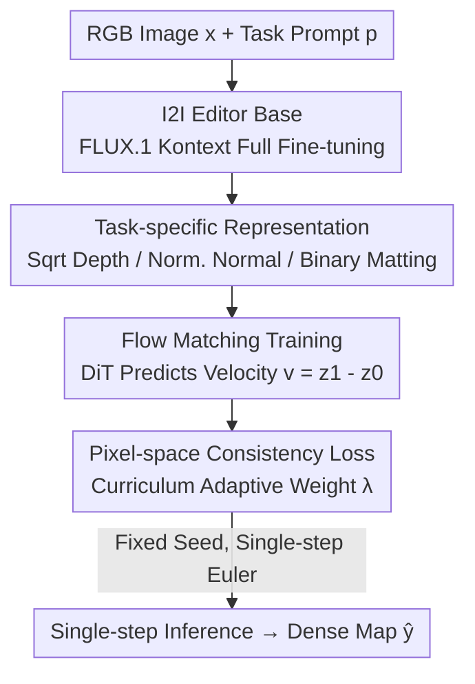

# Edit2Perceive: Image Editing Diffusion Models Are Strong Dense Perceivers

**Conference**: CVPR 2026  
**Paper**: [CVF Open Access](https://openaccess.thecvf.com/content/CVPR2026/html/Shi_Edit2Perceive_Image_Editing_Diffusion_Models_Are_Strong_Dense_Perceivers_CVPR_2026_paper.html)  
**Code**: https://github.com/showlab/Edit2Perceive  
**Area**: 3D Vision / Diffusion Models  
**Keywords**: Monocular Depth Estimation, Surface Normal Estimation, Interactive Matting, Image-to-Image Diffusion, Flow Matching Single-step Inference

## TL;DR
The authors discover that "Image-scale Editing (I2I) diffusion models" are inherently deterministic image-to-image mappings, making them better suited for dense perception than the commonly used "Text-to-Image (T2I)" models. They perform full-parameter fine-tuning on the FLUX.1 Kontext editor to create a unified depth/normal/matting perceiver. By incorporating a pixel-space consistency loss and a theoretically optimal square-root depth mapping, the model achieves SOTA results across three tasks with single-step inference using only ~74,000 training images.

## Background & Motivation
**Background**: For dense perception tasks such as monocular depth, surface normal, and interactive matting, the prevailing approach in recent years has been to leverage the visual priors of large-scale diffusion models. Typical examples include Marigold, GeoWizard, Lotus, and E2E-FT, which fine-tune **Text-to-Image (T2I)** models like Stable Diffusion into depth/normal estimators, achieving impressive generalization with minimal annotated data.

**Limitations of Prior Work**: The authors identify an overlooked **representation mismatch** in this approach. The pre-training objective of T2I models is to synthesize diverse visual content from text, essentially a "concept $\to$ pixel" semantic composition. While excellent at imagination, they struggle to reason about structural relationships within an existing image. Dense perception requires the opposite: a deterministic, geometry-aware pixel-wise prediction that uniquely maps an input to depth, normal, or alpha. Using a model trained for "stochastic generation" for "deterministic reconstruction" is inherently misaligned.

**Key Challenge**: Dense perception necessitates a structural prior—parsing input image structures (objects, surfaces, and relationships). T2I pre-training does not explicitly force the model to learn this. Conversely, Image-to-Image (I2I) editing models must parse the input into a structured scene representation to produce semantically coherent edits, which is precisely the prior needed for perception.

**Goal / Key Insight**: Rather than patching T2I models, the authors change the foundation: using an **I2I editing diffusion model** (FLUX.1 Kontext) as the base for dense perception. They reformulate dense perception as a conditional editing task: "edit an RGB image into a depth/normal/matting map."

**Core Idea**: Change the base (T2I $\to$ I2I editor), compress the stochastic generation path into a deterministic single-step path, and restore geometric fidelity using pixel-level consistency loss and theoretically optimal normalization.

## Method

### Overall Architecture
Edit2Perceive is built on FLUX.1 Kontext, a DiT-based editing model trained with flow matching. It unifies generation and editing by concatenating text tokens, condition image tokens, and target tokens. The authors formalize dense perception as a **conditional diffusion editing** problem: given an input RGB image $x \in \mathbb{R}^{H\times W\times 3}$ and a text prompt $p$ (e.g., "Transform to depth map while maintaining original composition"), predict the target dense map $y \in \mathbb{R}^{H\times W\times 3}$.

The process runs in the latent space of a pre-trained VAE: input $x$ is encoded into $c_x$, target $y$ into $z_1$, and text into $c_p$. During training, a Rectified Flow connects $z_0 \sim \mathcal{N}(0,I)$ and $z_1$ via a straight line $z_t=(1-t)z_0+tz_1$ with constant velocity $v=z_1-z_0$. The noisy target tokens are concatenated with $c_x$ and $c_p$ in the DiT to predict the velocity $v_\theta$. Beyond the latent-space flow matching loss, a **pixel-space consistency loss** is added to ensure geometric fidelity. During inference, leveraging the determinism of flow matching, a **single-step Euler** method jumps from $z_0$ directly to $\hat z_1$, followed by VAE decoding.

### Key Designs

**1. I2I Editing Diffusion as Base: Changing the Foundation**
The central argument is that switching the foundation from T2I (FLUX.1) to an I2I editor (FLUX.1 Kontext) with the same architecture significantly boosts performance. I2I models are trained to modify images coherently, forcing them to learn structured scene representations. A controlled experiment shows that even with the same fine-tuning pipeline, the I2I base outperforms T2I significantly (e.g., AbsRel improved by 25%/27% on NYUv2/KITTI). Attention map visualizations show I2I models capture clear object boundaries in the first epoch, while T2I models remain blurry until later.

**2. Pixel-space Consistency Loss: Enforcing Pixel-level Geometry**
The flow matching loss $L_{FM} = \mathbb{E} \| v_\theta(\text{concat}(z_t, c_x, c_p), t) - v \|_2^2$ only supervises velocity in latent space. Small latent errors can be magnified into artifacts during decoding. The authors add a task-specific consistency loss $L_{Cons}$ between decoded $\hat y$ and ground truth $y$:
- **Depth**: Scale-shift invariant L1 (aligning $\hat y_{align} = s\hat y + t$ before computing loss).
- **Normal**: Angular error based on `atan2`: $\mathbb{E}[\text{atan2}(|y\times\hat y|, y\cdot\hat y)]$, which avoids gradient explosion near collinearity.
- **Matting**: L1 loss computed separately for unknown transition zones ($U$) and known foreground/background ($K$).
A **curriculum** is used for the weight $\lambda$ ($L = L_{FM} + \lambda L_{Cons}$), starting at 0 and linearly increasing to shift focus toward pixel consistency.

**3. Square-root Depth Mapping: Optimal Normalization from First Principles**
Depth maps have long-tail distributions. Mapping them to the BF16 $[-1, 1]$ range used by editors via linear normalization introduces significant quantization errors in near-field details. The authors formalized the problem: "find a non-linear mapping $g(y)$ that minimizes the integral of relative error across the depth range." Using the Cauchy-Schwarz inequality, they prove the integral is minimized when $g'(y) \propto 1/\sqrt{y}$, resulting in the optimal mapping $g(y) = \sqrt{y}$. This is followed by robust percentile-based linear normalization.

**4. Single-step Deterministic Inference**
Dense perception is a highly deterministic task. The authors use a fixed random seed during both training and inference to ensure reproducibility. Thanks to the straight-line trajectories of Flow Matching, a single-step Euler integration $\hat z_1 = z_0 + v_\theta(\text{concat}(z_0, c_x, c_p), t=0)$ provides competitive results while drastically reducing FLOPs compared to multi-step generative methods.

## Key Experimental Results

All tasks were evaluated zero-shot (except for AM-2k in matting).

### Main Results (Depth Estimation, AbsRel↓ / δ1↑, %)

| Dataset | Metric | Edit2Perceive | Runner-up | Note |
| :--- | :--- | :--- | :--- | :--- |
| NYU | AbsRel↓ | 4.4 | 4.5 (DAv2) | Beats DepthAnything V2 (62.6M images) with 74K images |
| ETH3D | AbsRel↓ | 4.3 | 5.9 (Lotus-G) | ~27% improvement |
| Scannet | AbsRel↓ | 4.9 | 5.5 (Lotus-D) | ~11% improvement |
| KITTI | δ1↑ | 94.5 | 94.6 (DAv2) | Compares to discriminative SOTA |
| **Avg Rank** | **AvgRank↓** | **1.5** | 2.9 (Lotus-D) | Ranked 1st overall across 5 benchmarks |

For normal estimation, the average rank was 1.4. For interactive matting, it ranked 1.2, achieving the lowest MSE/MAD/SAD across AIM-500, P3M-500-NP, and AM-2k.

### Ablation Study (Depth, NYUv2 / KITTI AbsRel↓)

| ID | Base | $L_{Cons}$ | Depth Mapping | NYU | KITTI |
| :--- | :--- | :--- | :--- | :--- | :--- |
| 1 | FLUX.1 (T2I) | ✗ | Uni | 6.8 | 13.2 |
| 4 | FLUX.1 (T2I) | ✓ | Sqrt | 5.3 | 8.4 |
| 5 | Kontext (I2I) | ✗ | Uni | 5.1 | 9.6 |
| 8 | Kontext (I2I) | ✓ | Sqrt | **4.4** | **7.9** |

### Key Findings
- **Base model is the primary factor**: Under identical settings, the I2I base significantly outperforms T2I, proving structured priors stem from pre-training objectives.
- **Consistency loss as refinement**: Gains are larger for weaker bases; it is critical for edge-sensitive tasks like normal/matting.
- **Sqrt mapping verification**: Improvements are greater in larger depth ranges (KITTI $\gg$ NYUv2), matching the theoretical error prediction.
- **Exceptional data efficiency**: Outperforms models trained on 100x more data.

## Highlights & Insights
- **Foundation Shift**: The core insight—that editing models are inherently I2I consistent mappings—is profound. It replaces the foundation of "diffusion for perception" with a more suitable base.
- **First-principles Mapping**: Deriving $g(y) = \sqrt{y}$ to minimize quantization error and verifying it via the difference between KITTI/NYUv2 ranges is an elegant example of theory-driven design.
- **atan2 Trick**: Replacing `arccos` with `atan2` for angular loss is a practical stability trick to avoid gradient explosion.
- **Deterministic Single-step**: Combining fixed seeds with Flow Matching makes generative models as efficient as discriminative counterparts while retaining generative priors.

## Limitations & Future Work
- There remains a gap in inference speed and absolute precision compared to top-tier discriminative models (MoGe, UniDepth).
- The tasks are currently trained separately (unified framework, but separate weights).
- Consistency losses are still manually designed per task.
- Future work: Merging tasks into a single-weight multi-task perceiver and extending "editor-as-perceiver" to optical flow or segmentation.

## Related Work & Insights
- **vs Marigold / GeoWizard / Lotus**: These models use T2I (Stable Diffusion) bases. Edit2Perceive demonstrates that T2I has a representation mismatch and achieves better results with an I2I editor base.
- **vs FE2E (Concurrent)**: Both use editing diffusion, but Edit2Perceive emphasizes geometric fidelity via pixel-space consistency and sqrt-mapping, while retaining some Gaussian noise to leverage generative priors.

## Rating
- Novelty: ⭐⭐⭐⭐⭐ (Insightful shift to I2I bases).
- Experimental Thoroughness: ⭐⭐⭐⭐⭐ (Zero-shot SOTA across 3 tasks + strict ablation).
- Writing Quality: ⭐⭐⭐⭐ (Clear logic and elegant theory).
- Value: ⭐⭐⭐⭐⭐ (Provides a better foundation for diffusion-based perception).

<!-- RELATED:START -->

## Related Papers

- [\[CVPR 2026\] ObjectMorpher: 3D-Aware Image Editing via Deformable 3DGS](objectmorpher_3d-aware_image_editing_via_deformable_3dgs.md)
- [\[CVPR 2026\] PercHead: Perceptual Head Model for Single-Image 3D Head Reconstruction & Editing](perchead_perceptual_head_model_for_single-image_3d_head_reconstruction_editing.md)
- [\[CVPR 2026\] FE2E: From Editor to Dense Geometry Estimator](from_editor_to_dense_geometry_estimator.md)
- [\[CVPR 2025\] Kiss3DGen: Repurposing Image Diffusion Models for 3D Asset Generation](../../CVPR2025/3d_vision/kiss3dgen_repurposing_image_diffusion_models_for_3d_asset_generation.md)
- [\[CVPR 2026\] VDFE: Difference-Aware 3D Scene Editing with Non-Intrusive Video Diffusion Priors for Multi-View Consistency and Efficiency](vdfe_difference-aware_3d_scene_editing_with_non-intrusive_video_diffusion_priors.md)

<!-- RELATED:END -->
