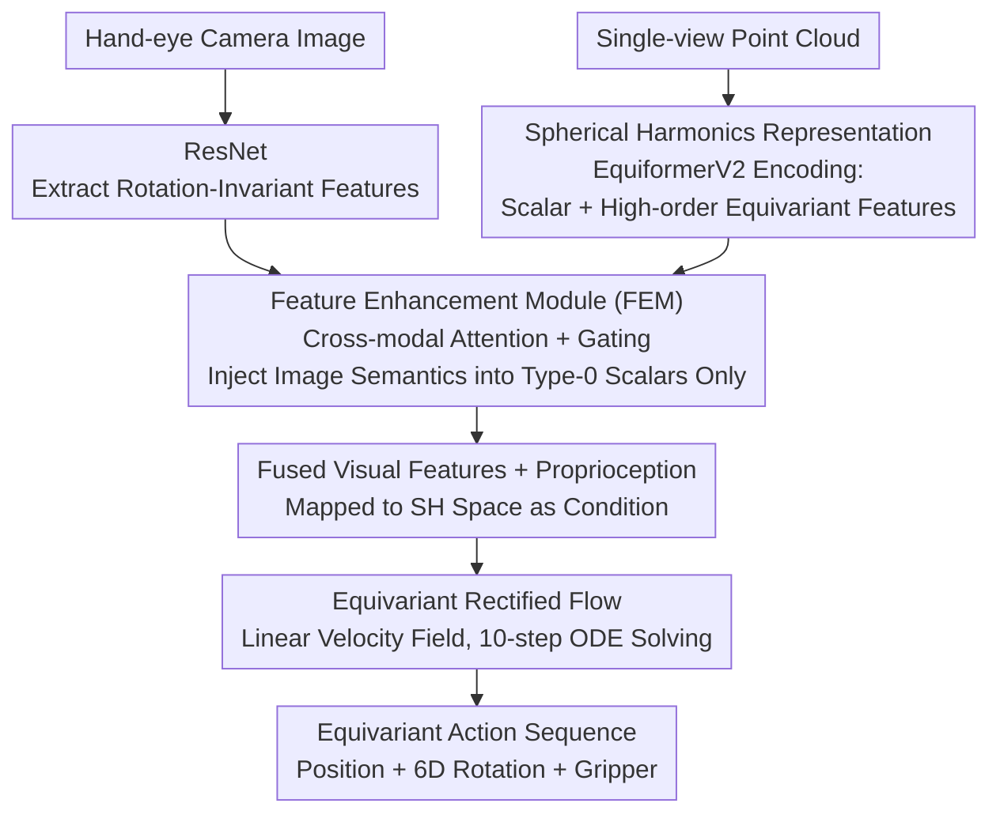

# Efficient Hybrid SE(3)-Equivariant Visuomotor Flow Policy via Spherical Harmonics

**Conference**: CVPR 2026  
**arXiv**: [2603.23227](https://arxiv.org/abs/2603.23227)  
**Code**: [https://github.com/zql-kk/E3Flow](https://github.com/zql-kk/E3Flow)  
**Area**: 3D Vision / Robot Manipulation  
**Keywords**: SE(3) Equivariance, Spherical Harmonics, Rectified Flow, Robot Policy Learning, Multi-Modal Fusion

## TL;DR

Ours proposes E3Flow, the first equivariant flow matching policy framework based on spherical harmonics representation. By dynamically fusing visual information from point cloud and image modalities through a Feature Enhancement Module (FEM) and combining it with rectified flow for efficient equivariant action generation, E3Flow achieves an average success rate 3.12% higher than the strongest baseline SDP across 8 MimicGen tasks, while providing a 7x speedup in inference.

## Background & Motivation

Diffusion Policy has shown significant success in robot policy learning but faces two core challenges:

**Low Data Efficiency**: Reliance on large amounts of high-quality expert demonstration data, which is costly to collect.

**Bottlenecks of Equivariant Methods**: Integrating symmetry priors can significantly improve data efficiency and generalization, but existing equivariant diffusion policies suffer from:
   - **Computational Intensity**: Requiring numerous iterative denoising steps on already complex equivariant networks leads to slow performance.
   - **Single-Modality Dependency**: Relying solely on point clouds or images, lacking fine-grained visual details.
   - **Incompatibility with Fast Sampling**: Directly applying one-step diffusion or flow matching to equivariant policies causes instability and performance degradation.

Key Challenge: **No existing method has unified the data efficiency of equivariant learning with the inference speed of flow matching.**

As shown in Figure 1(a), when a toy on a table is rotated to an unseen pose, non-equivariant DP fails to grasp it, whereas the equivariant E3Flow succeeds by following the corresponding rotated trajectory.

## Method

### Overall Architecture

The Key Challenge E3Flow addresses is the trade-off between the high data efficiency of equivariant networks and the slow inference caused by multi-step denoising in diffusion policies. The Mechanism involves replacing both components: using spherical harmonics to carry strict SE(3) equivariant structures and adopting rectified flow instead of diffusion denoising for acceleration.

The pipeline (Fig. 2) starts with dual visual inputs: hand-eye camera images are processed by ResNet to extract rotation-invariant features, and single-view point clouds are encoded by EquiformerV2 to extract multi-order spherical harmonic equivariant features. Both features are sent to the FEM for fusion, injecting image semantics into the scalar (Type-0) components of the point cloud's spherical harmonic representation. The fused visual features, combined with proprioceptive states, are mapped to the spherical harmonic space to form conditions for the generative network. Finally, the equivariant rectified flow generates the equivariant action sequence through ODE solving.

### Key Designs

**1. Spherical Harmonics Visual Representation: Precise Rotation Encoding**

Non-equivariant policies fail when objects are in unseen rotations because their visual features do not "know" how to transform. E3Flow utilizes spherical harmonics $Y_l^m(\theta,\phi)$ as orthogonal bases on the unit sphere to carry directional information. The advantage is that under rotation $R$, spherical harmonic components of the same order $l$ undergo linear mixing: $Y_l^m(R^{-1}\hat{\mathbf{r}}) = \sum_{m'} D_{mm'}^{(l)}(R) Y_l^{m'}(\hat{\mathbf{r}})$. Rotation is cleanly encoded as the action of a Wigner-D matrix, ensuring strict mathematical equivariance. Specifically, EquiformerV2 encodes the point cloud into scalar components $f_{pcd}^{(0)}$ and high-order components $f_{pcd}^{(>0)}$. Compared to EquiBot using vector neurons (limited to low-order directions), high-order coefficients preserve finer directional details.

**2. Feature Enhancement Module (FEM): Integrating Image Semantics without Breaking Equivariance**

Point clouds provide accurate directions but coarse textures, while images provide rich details but are not equivariant. Concatenating them directly breaks the equivariant structure (average success rate drops from 79.00% to 72.36%). The Key Insight of FEM is to only inject image information into the scalar (Type-0) components while leaving high-order components untouched. Since scalars are invariant under rotation, performing arbitrary operations on them does not violate the overall equivariance constraint. The fusion is defined as $f_{fused} = \Pi[\Lambda(\mathcal{A}(f_{pcd}^{(0)}, f_{img}), f_{pcd}^{(0)}) \| f_{pcd}^{(>0)}]$, where $\mathcal{A}$ is cross-modal attention, $\Lambda$ is a gating mechanism, and $\Pi$ projects the result back to the spherical harmonic space.

**3. Equivariant Rectified Flow: Replacing Multi-step Denoising with Linear Paths**

Diffusion denoising requires dozens of iterations. E3Flow adopts rectified flow, which learns a straight-line interpolation from noise to action distribution: $x_t = (1-t)x_0 + ta$. The training loss is $\mathcal{L}_{RF}(\theta) = \mathbb{E}_{t,x_0,x_1}[\|v_\theta(x_t,t,s,v) - (a-x_0)\|^2]$. This switch is possible because the velocity field network itself is equivariant: $v_\theta(\rho*x_t, t, \rho*s, \rho*v) = \rho * v_\theta(x_t, t, s, v)$. Since the target $(a-x_0)$ is a linear transformation of equivariant actions, the loss remains invariant under group actions. With 10-step sampling, inference takes 0.51s, approximately 7x faster than SDP (3.73s).

### Loss & Training

- Optimizer: AdamW, Learning Rate $1 \times 10^{-4}$, Batch Size 64
- EMA decay rate: 0.95
- Training: 500 epochs on a single NVIDIA H20 GPU
- Evaluation: Every 20 epochs, 50 episodes per task, reporting max success rate
- Action Representation: 3D position + 6D rotation + 1D gripper (position and rotation are equivariant)

## Key Experimental Results

### Main Results

**MimicGen 8 Task Success Rates** (Table 1, 100 expert demonstrations)

| Method | Equivariance Type | Coffee_D2 | Nut_Asm | Square | Stack3 | **Average** |
|:---:|:---:|:---:|:---:|:---:|:---:|:---:|
| DP | None | 44 | 54 | 10 | 32 | 47.50 |
| EquiDiff(voxel) | SO(2) | 65 | 67 | 39 | 76 | 68.50 |
| SDP(DDPM) | SE(3) | 63 | 92 | 64 | 98 | 75.88 |
| **E3Flow** | **SE(3)**| **64** | **94** | **70** | **100** | **79.00** |

**Inference Time** (Table 2)

| Method | Avg Inference Time (s) | Relative to E3Flow |
|:---:|:---:|:---:|
| EquiBot | 2.03 | 4.0× |
| DP | 0.95 | 1.9× |
| EquiDiff(img) | 2.51 | 4.9× |
| EquiDiff(voxel) | 1.10 | 2.2× |
| SDP(DDPM) | 3.73 | **7.3×** |
| SDP(DDIM) | 0.46 | 0.9× |
| **E3Flow** | **0.51** | **1.0×** |

Note: Using DDIM to accelerate SDP leads to a 6.13% drop in success rate, whereas E3Flow achieves higher success at comparable speeds.

### Ablation Study

**Component Analysis** (Table 4)

| Input | Fusion | Generation | Avg Success Rate |
|:---:|:---:|:---:|:---:|
| PCD | - | RF | 75.88 |
| PCD | - | Diffusion | 75.23 |
| PCD+Img | cat | RF | 72.36 |
| PCD+Img | FEM | Diffusion | 77.58 |
| **PCD+Img** | **FEM** | **RF** | **79.00** |

### Key Findings

- Simple concatenation (cat) of multi-modal features degrades performance, highlighting the importance of proper modality alignment.
- FEM solves the conflict between equivariance and fusion by only operating on the invariant subspace.
- Equivariant learning shows a clear advantage in complex tasks: DP achieves only 10% on Square_D2, while E3Flow reaches 70%.
- One-step sampling is unsuitable for equivariant models (e.g., MeanFlow 54.50%) as the abstract equivariant features require multiple steps for precision.
- Data Efficiency: E3Flow achieves performance with 100 demonstrations that other methods reach with 200.

## Highlights & Insights

1.  **Unified Framework**: Successfully unifies equivariant learning and flow matching, proving that rectified flow naturally fits equivariant networks.
2.  **FEM Design**: Elegantly integrates image semantics in the Type-0 invariant subspace, maintaining end-to-end equivariance.
3.  **One-step Analysis**: Reveals that equivariant models require multi-step sampling to decode highly abstract features into fine-grained actions.
4.  **Mathematical Rigor**: Provides strict guarantees for the equivariant chain from input to output.
5.  **Deployment Potential**: 0.51s inference + 100-demo efficiency makes it highly suitable for real-world robotics.

## Limitations & Future Work

- EquiformerV2's forward pass, though faster than ET-SEED, remains an inference bottleneck.
- Only SE(3) equivariance is explored; other symmetry groups (e.g., SIM(3)) are not investigated.
- Point cloud downsampling to 1024 points might lose details necessary for sub-millimeter precision tasks.
- Image encoders (ResNet) do not use pre-trained weights (e.g., CLIP), which may limit semantic understanding.

## Related Work & Insights

- Standard extension of the SDP framework: SDP uses spherical harmonics with diffusion; E3Flow replaces this with rectified flow and adds image inputs.
- Comparison with EquiDiff reveals the difference between continuous (SO(3) SH) and discrete (SO(2) convolution) equivariance.
- FEM's design can be generalized to other scenarios requiring the injection of invariant info into equivariant representations.

## Rating

- **Novelty**: ⭐⭐⭐⭐
- **Experimental Thoroughness**: ⭐⭐⭐⭐
- **Writing Quality**: ⭐⭐⭐⭐
- **Value**: ⭐⭐⭐⭐⭐

<!-- RELATED:START -->

## Related Papers

- [\[CVPR 2026\] ECKConv: Learning Coordinate-based Convolutional Kernels for Continuous SE(3) Equivariant Point Cloud Analysis](learning_coordinate-based_convolutional_kernels_for_continuous_se3_equivariant_a.md)
- [\[CVPR 2026\] MeshFlow: Efficient Artistic Mesh Generation via MeshVAE and Flow-based Diffusion Transformer](meshflow_efficient_artistic_mesh_generation_via_meshvae_and_flow-based_diffusion.md)
- [\[CVPR 2026\] DropAnSH-GS: Dropping Anchor and Spherical Harmonics for Sparse-view Gaussian Splatting](dropping_anchor_and_spherical_harmonics_for_sparse-view_gaussian_splatting.md)
- [\[CVPR 2026\] From Pairs to Sequences: Track-Aware Policy Gradients for Keypoint Detection](from_pairs_to_sequences_track-aware_policy_gradients_for_keypoint_detection.md)
- [\[ICCV 2025\] Spatial-Temporal Aware Visuomotor Diffusion Policy Learning](../../ICCV2025/3d_vision/spatial-temporal_aware_visuomotor_diffusion_policy_learning.md)

<!-- RELATED:END -->
