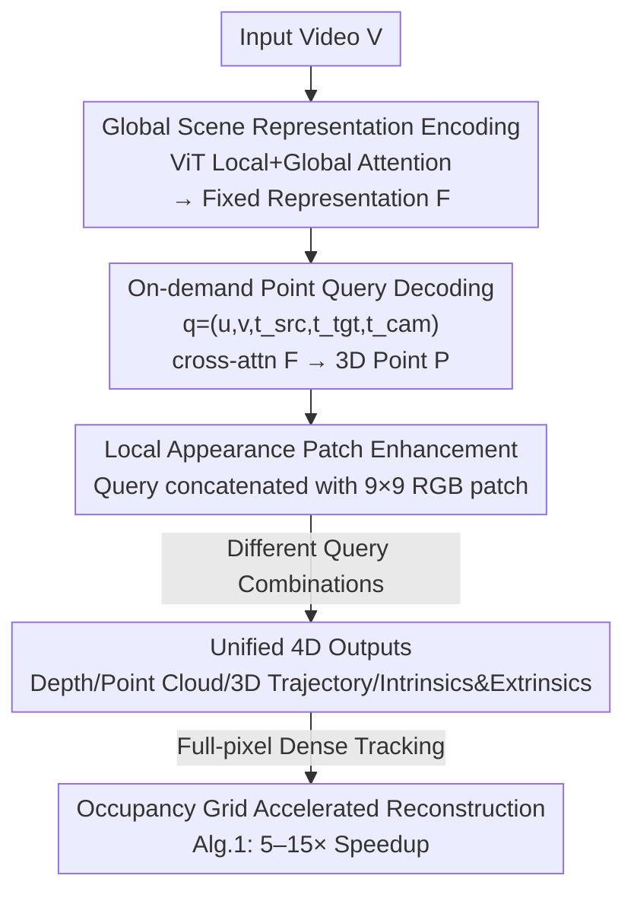

# Efficiently Reconstructing Dynamic Scenes One D4RT at a Time

**Conference**: CVPR 2026  
**Paper**: [CVF Open Access](https://openaccess.thecvf.com/content/CVPR2026/html/Zhang_Efficiently_Reconstructing_Dynamic_Scenes_One_D4RT_at_a_Time_CVPR_2026_paper.html)  
**Code**: Project Page https://d4rt-paper.github.io/ (Official code not yet released; ⚠️ subject to official updates)  
**Area**: 3D Vision  
**Keywords**: Dynamic 4D reconstruction, point trajectory tracking, feed-forward Transformer, on-demand query decoding, camera pose estimation

## TL;DR
D4RT uses a unified encoder-decoder Transformer to first encode a video into a fixed global scene representation, and then utilizes a single "query 3D position of any spatio-temporal point" decoding interface to simultaneously obtain depth, point clouds, 3D point trajectories, and camera extrinsics/intrinsics. It achieves new SOTA in dynamic 4D reconstruction and tracking, running approximately 9× faster than VGGT and two orders of magnitude faster than MegaSaM.

## Background & Motivation
**Background**: Recovering the geometry and motion of dynamic scenes from a single video (i.e., "4D reconstruction") is a challenging problem in computer vision. Recent mainstream methods follow a feed-forward path: DUSt3R proved that Transformers can directly regress 3D from unposed, uncalibrated image pairs, while VGGT extended this to global attention across arbitrary frame counts.

**Limitations of Prior Work**: These methods decompose 4D reconstruction into several disconnected sub-tasks. MegaSaM relies on a collection of off-the-shelf models to estimate monocular depth, metric depth, and motion segmentation separately, using expensive test-time optimization to stitch these signals into geometric consistency. Methods like VGGT maintain dedicated decoding heads for depth, pose, and point clouds. Crucially, both struggle to provide correspondences in **dynamic regions**. While SpatialTrackerV2 handles dynamics, it is a multi-stage process relying on iterative refinement, leading to slow inference and empty holes in occluded areas since it tracks points starting from a single frame.

**Key Challenge**: Previous decoding paradigms are "per-frame and dense"—either decoding every pixel of every frame (computational explosion) or maintaining independent decoders for each task (architectural bloat and inconsistency). This rigid paradigm of "solving everything, everywhere, all at once" is inherently ill-suited for a dynamic world.

**Goal**: To build a single-stage, single-decoder unified architecture that supports depth, point clouds, 3D trajectories, and camera parameters in both static and dynamic scenes, while being both fast and accurate.

**Key Insight**: Shift the paradigm from "fragmented frame-level dense decoding" to "efficient on-demand querying." The entire video is first compressed into a global representation; subsequently, the 3D position of any specific point can be queried individually.

**Core Idea**: A query is defined as "the 3D position of a 2D point from a source frame, at a target time, viewed from a specific camera perspective." Each query independently cross-attends to the global representation. Task differences are simply different combinations of query parameters, thereby unifying all 4D tasks into a single decoding interface.

## Method

### Overall Architecture
D4RT is a feed-forward encoder-decoder model inspired by the Scene Representation Transformer. Given a video $V \in \mathbb{R}^{T \times H \times W \times 3}$, a heavy encoder $E$ first encodes it into a **global scene representation** $F = E(V) \in \mathbb{R}^{N \times C}$, which captures dense cross-frame correspondences, temporal flow, and its impact on the scene. $F$ remains **fixed** once computed. In the second stage, a lightweight decoder $D$ repeatedly cross-attends to $F$ from a large number of queries.

A query is defined as $q = (u, v, t_{\text{src}}, t_{\text{tgt}}, t_{\text{cam}})$: where $(u,v)\in[0,1]^2$ are normalized coordinates of a 2D point on source frame $t_{\text{src}}$, $t_{\text{tgt}}$ specifies the **target time** state to observe, and $t_{\text{cam}}$ specifies the camera coordinate system of a particular frame as reference. Each query interacts with $F$ **completely independently** to output the 3D position $P = D(q, F) \in \mathbb{R}^3$. The three time indices are decoupled, separating "space" from "time."

The pipeline is "Video → Encoding → Global Representation → Independent Query → 3D Point → Composed 4D Outputs":

### Key Designs

**1. On-demand Point Query Decoding: Unifying All 4D Tasks into One Interface**

This core innovation addresses the pain points of expensive per-frame dense decoding and chaotic multi-task heads. Instead of outputting dense predictions for a whole frame, the decoder treats every spatio-temporal point as an independent query. By fixing the source point $(u,v,t_{\text{src}})$ and letting $t_{\text{tgt}}=t_{\text{cam}}$ sweep through $\{1\dots T\}$, one obtains the **3D point trajectory**. Letting $(u,v)$ sweep a full-frame grid with $t_{\text{cam}}$ fixed yields a **point cloud**. Restricting $t_{\text{src}}=t_{\text{tgt}}=t_{\text{cam}}$ and taking the Z-component yields a **depth map**. Effectively, task differences lie only in the Cartesian product of query parameters.

Camera parameters are also derived from queries rather than a separate head. To calculate relative pose between frames $i$ and $j$, a set of source points is sampled on a coarse grid. Queries $q_i=(u,v,i,i,i)$ and $q_j=(u,v,i,i,j)$ are constructed—decoding these yields "the same set of 3D points in different reference frames." The rigid transformation is solved using the Umeyama algorithm via $3\times3$ SVD. Intrinsics are solved in closed-form under a pinhole model assumption with principal point $(0.5,0.5)$ from decoded 3D points $(p_x,p_y,p_z)$:

$$f_x = p_z (u - 0.5)/p_x, \qquad f_y = p_z (v - 0.5)/p_y$$

**2. Lightweight Independent Decoder: Trading "Query Interaction" for Scalability and Global Consistency**

The decoder is a small cross-attention Transformer. Each query token is formed by $(u,v)$ Fourier features plus three learnable discrete time embeddings for $t_{\text{src}}/t_{\text{tgt}}/t_{\text{cam}}$, which then cross-attends to $F$ before a linear projection to $P$. A key design decision is: **no self-attention between queries**. This allows for low memory/compute during training (only a few points needed) and massive parallelism during inference. Empirically, adding query self-attention **degrades performance** due to overfitting the query distribution during training. Consistency is "forced" into the encoder; if the decoder is sparse/light, the encoder must represent global consistency within $F$.

**3. Local RGB Appearance Patches: Adding Low-level Cues for Sub-pixel Sharpness**

Queries consisting only of coordinates and time embeddings are coarse. Concatenating a $9\times9$ RGB patch centered at $(u,v)$ yields "dramatic" improvements. This helps the query establish reliable correspondence with encoded features and provides low-level cues to segment objects, resulting in sharper depth boundaries.

**4. Occupancy Grid Accelerated Full-pixel Dense Tracking: Cutting $O(T^2HW)$ Complexity**

D4RT can compute dense correspondences for **all** pixels (including dynamic ones). A naive query for every pixel trajectory is $O(T^2HW)$. Algorithm 1 uses an occupancy grid $G\in\{0,1\}^{T\times H\times W}$: new trajectories only start from "unvisited" pixels. Each trajectory marks all spatio-temporal pixels it passes through as visited, avoiding redundancy and achieving a 5–15× speedup.

### Loss & Training
The model is trained end-to-end in Kauldron. The primary supervision is an L1 loss on normalized 3D point positions: predicted and ground truth sets are normalized by their mean depth and transformed via $\text{sign}(x)\cdot\log(1+|x|)$ to suppress outliers. Auxiliary losses include image-space 2D L1, surface normal cosine similarity, visibility binary cross-entropy, and point motion L1. A confidence penalty $-\log(c)$ is added, where $c$ weights the 3D point error. ViT-g (1B parameters) serves as the encoder and an 8-layer cross-attention Transformer as the decoder. Training uses VideoMAEv2 initialization on 48-frame, $256\times256$ snippets for 500k steps on 64 TPUs.

## Key Experimental Results

### Main Results
4D Reconstruction and Tracking (TAPVid-3D, World 3D Tracking, higher APD3D is better):

| Dataset (World 3D track) | Metric | D4RT | SpatialTrackerV2 | CoTracker3+VGGT |
|--------|------|------|------|------|
| DriveTrack | AJ | **0.304** | 0.195 | 0.245 |
| ADT | AJ | **0.307** | 0.303 | 0.175 |
| PStudio | AJ | **0.372** | 0.175 | 0.215 |

Point Cloud / Video Depth (lower L1, AbsRel is better):

| Task/Dataset | Metric | D4RT | ε3 | SpatialTrackerV2 | VGGT |
|--------|------|------|------|------|------|
| Point Cloud Sintel | L1 | **0.768** | 1.139 | 1.375 | 1.582 |
| Point Cloud ScanNet | L1 | **0.028** | 0.030 | 0.036 | 0.063 |
| Depth Sintel | AbsRel (S) | **0.171** | 0.241 | 0.209 | 0.318 |

Camera Pose (lower ATE/RPE, higher Pose AUC is better):

| Dataset | Metric | D4RT | ε3 | MegaSaM |
|--------|------|------|------|------|
| Sintel | ATE | **0.065** | 0.086 | 0.074 |
| ScanNet | ATE | **0.014** | 0.015 | 0.029 |
| Re10K | Pose AUC@30 | **83.5** | 78.7 | 71.0 |

Efficiency: At a 1 FPS target, D4RT produces 40,180 trajectories, compared to SpatialTrackerV2's 2,290. Overall, it is 18–300× faster than competitors. Pose estimation reaches 200+ FPS, roughly 9× faster than VGGT and 100× faster than MegaSaM.

### Ablation Study
| Config | Sintel Depth AbsRel(S) | Sintel Pose ATE | Description |
|------|------|------|------|
| D4RT (ViT-L default) | 0.302 | 0.091 | Full model |
| w/o local patch | 0.366 | 0.173 | Depth and pose significantly degrade without RGB patches |
| w/o 2D position loss | +0.071 | +0.002 | Depth suffers most |
| w/o confidence loss | +0.002 | +0.126 | Pose collapses (ATE spikes) |
| ViT-B → ViT-g (encoder) | 0.319 → 0.191 | — | Performance scales with backbone size |

### Key Findings
- **Local RGB patches provide the highest ROI**: A simple $9\times9$ patch reduces Sintel depth error and pose ATE dramatically while sharpening boundaries.
- **Auxiliary losses serve distinct roles**: 2D and normal losses improve depth, while confidence loss is critical for pose stability.
- **Restricting query interaction is beneficial**: Prohibiting self-attention avoids train-test distribution shifts and shifts the burden of consistency to the encoder.
- **Monotonic scaling with encoder**: Performance improves steadily from ViT-B to ViT-g, showing the interface is not a bottleneck.

## Highlights & Insights
- **Task diversity converges into query parameter diversity**: Depth, point clouds, trajectories, and poses are no longer separate heads but special cases of $D(q,F)$. This unified abstraction is the root of its speed and versatility.
- **Camera parameters are "free" from point queries**: Poses are derived from dual queries and Umeyama SVD; intrinsics come from pinhole geometry. This demonstrates the sufficiency of the "point query" representation.
- **Robustness through simplicity**: Deliberately disabling query interactions forces the encoder to capture consistency, saving compute and avoiding overfitting to sampling patterns.
- **Occupancy grid for dense tracking**: Reducing $O(T^2HW)$ complexity via "visited" flags is a clean engineering trick applicable to any dense spatio-temporal prediction task.

## Limitations & Future Work
- Training costs are high (1B parameter encoder, 64 TPUs, 2 days), and it relies on VideoMAEv2 pre-training and internal data mixtures.
- Closed-form intrinsics assume a fixed principal point; cameras with high distortion (e.g., fisheye) might require non-linear refinement.
- Evaluation focuses on synthetic/controlled data; failure modes in the wild (extremely long videos, hyper-dynamic scenes) require further quantitative study.
- Consistency relies entirely on the encoder's capacity; whether it holds for ultra-long videos exceeding the encoder's representation limit remains to be seen.

## Related Work & Insights
- **vs MegaSaM**: MegaSaM uses test-time optimization to stitch several models; D4RT is a single-stage feed-forward model that is two orders of magnitude faster for pose.
- **vs VGGT**: VGGT uses independent heads and lacks dynamic correspondence; D4RT unifies all tasks in one interface and is 9× faster for pose.
- **vs SpatialTrackerV2**: STv2 is multi-stage and iterative; D4RT is single-stage, can query any point from any frame, and is 18-300× faster for tracking.

## Rating
- Novelty: ⭐⭐⭐⭐⭐ Unified on-demand query paradigm.
- Experimental Thoroughness: ⭐⭐⭐⭐⭐ Comprehensive multi-dimensional evaluation.
- Writing Quality: ⭐⭐⭐⭐ Clear motivation and convincing unified interface.
- Value: ⭐⭐⭐⭐⭐ Provides a fast, accurate, and scalable paradigm for 4D perception.

<!-- RELATED:START -->

## Related Papers

- [\[CVPR 2026\] FunREC: Reconstructing Functional 3D Scenes from Egocentric Interaction Videos](funrec_reconstructing_functional_3d_scenes_from_egocentric_interaction_videos.md)
- [\[CVPR 2026\] Inferring Compositional 4D Scenes without Ever Seeing One](inferring_compositional_4d_scenes_without_ever_seeing_one.md)
- [\[CVPR 2026\] Dynamic-Static Decomposition for Novel View Synthesis of Dynamic Scenes with Spiking Neurons](dynamic-static_decomposition_for_novel_view_synthesis_of_dynamic_scenes_with_spi.md)
- [\[CVPR 2026\] MoVieS: Motion-Aware 4D Dynamic View Synthesis in One Second](movies_motion-aware_4d_dynamic_view_synthesis_in_one_second.md)
- [\[CVPR 2026\] Featurising Pixels from Dynamic 3D Scenes with Linear In-Context Learners](featurising_pixels_from_dynamic_3d_scenes_with_linear_in-context_learners.md)

<!-- RELATED:END -->
