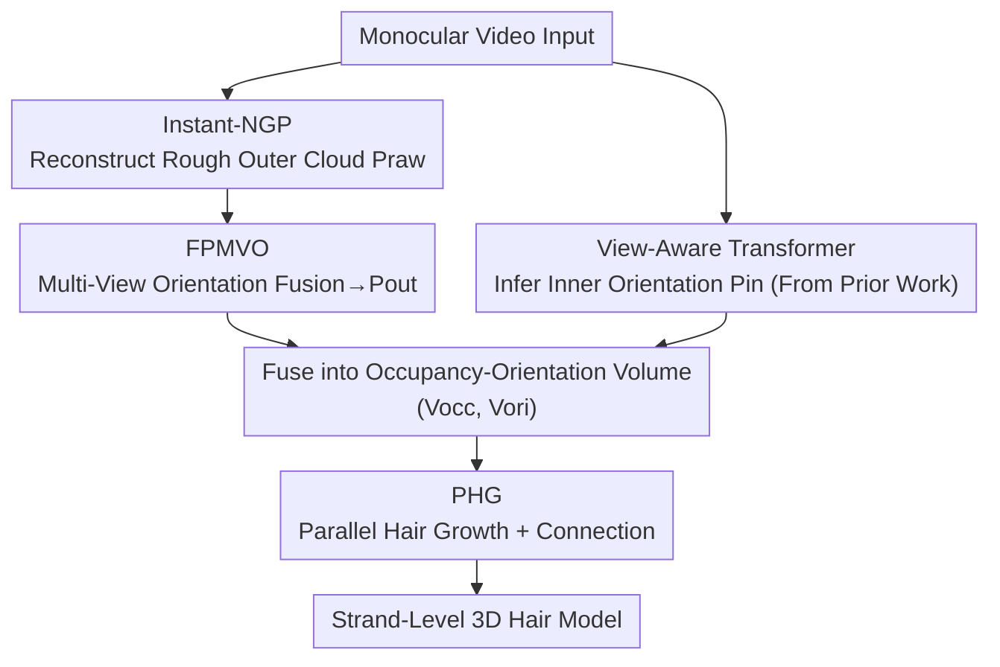

# EfficientMonoHair: Fast Strand-Level Reconstruction from Monocular Video via Multi-View Direction Fusion

**Conference**: CVPR 2026  
**Paper**: [CVF Open Access](https://openaccess.thecvf.com/content/CVPR2026/html/Li_EfficientMonoHair_Fast_Strand-Level_Reconstruction_from_Monocular_Video_via_Multi-View_Direction_CVPR_2026_paper.html)  
**Code**: To be confirmed  
**Area**: 3D Vision  
**Keywords**: Strand-level hair reconstruction, monocular video, multi-view direction fusion, parallel growth, implicit-explicit hybrid

## TL;DR
Building upon the implicit-explicit hybrid pipeline of MonoHair, EfficientMonoHair introduces Fast Patch-based Multi-View Orientation Fusion (FPMVO) to aggregate multi-view candidate directions in a single pass instead of performing exhaustive per-frame searches, and Parallel Hair Growth (PHG), which relaxes voxel occupancy constraints to allow tens of thousands of strands to grow simultaneously on the GPU. This slashes the computational time of strand-level hair reconstruction from monocular video from 4–9 hours to approximately 23–50 minutes (yielding a ~28× speedup in the outer orientation optimization stage and a ~6–8× overall speedup) while maintaining geometric accuracy on par with the state-of-the-art.

## Background & Motivation

**Background**: Reconstructing "strand-level" hair geometry from images or videos is a critical component of digital human and virtual avatar creation. Unlike faces or bodies, which have relatively rigid and standardized parametric representations, hair is highly non-rigid and topologically complex, posing a major challenge in digitalization. Current approaches generally fall into three categories: early explicit geometric optimization (using multi-view images and manual geometric constraints, which offers high accuracy but requires dense camera setups, manual calibration, and massive computation); implicit neural representations (learning hair shape and orientation distributions from a single image or video, which is automated and fast but lacks fine-grained orientation details, especially for curly or intersecting strands); and recent hybrid explicit-implicit frameworks (combining the best of both worlds, though they suffer from slow orientation field optimization and multi-view strand inconsistency).

**Limitations of Prior Work**: The strongest representative of the current hybrid pipeline is MonoHair. While it requires only monocular video and significantly outperforms predecessors like NeuralHaircut in quality and diversity, **reconstructing a single hairstyle takes 4–9 hours**. In contrast, a typical multi-view avatar reconstruction pipeline usually takes only 30–60 minutes. The root of this slowness lies in two sequential bottlenecks: (1) the outer orientation field uses "exhaustive per-view search" to iteratively select the optimal orientation for each strand, which is computationally expensive; (2) hair growth relies on sequential integration on the CPU, where each strand must wait for the previous one to finish and synchronously update the global occupancy voxel grid, preventing parallelization and requiring repeated KD-tree reconstructions.

**Key Challenge**: There is a difficult trade-off between accuracy, geometric detail, and computational efficiency. Explicit optimization is accurate but slow; implicit generation is fast but blurry; even hybrid methods like MonoHair trade efficiency for accuracy, remaining too slow for practical applications.

**Goal**: To significantly accelerate reconstruction **without sacrificing strand-level fidelity**. This is formulated into two sub-problems: how to solve the outer orientation field stably without relying on exhaustive per-view search, and how to transition hair growth from sequential to highly parallel.

**Key Insight**: The authors observe that both bottlenecks in MonoHair stem from "sequential dependencies." These dependencies can be bypassed using "fusion before constraint" and "relaxation before restoration" approaches. Specifically, direction solving can **first aggregate multi-view candidates into a view-independent candidate set** before optimization, and hair growth can **first relax voxel exclusion constraints to allow parallel growth, later resolving conflicts** during the connection phase.

**Core Idea**: Replace MonoHair's "exhaustive per-view search and sequential growth" with "Fast Patch-based Multi-View Orientation Fusion (FPMVO) and Parallel Hair Growth (PHG)," thereby parallelizing both sequential bottlenecks within the hybrid explicit-implicit framework.

## Method

### Overall Architecture
EfficientMonoHair inherits MonoHair's three-stage hybrid pipeline but replaces the two slowest stages with parallelizable modules. The input is a monocular video, and the output is a strand-level 3D hair model attached to the scalp, suitable for direct import into rendering and physics simulation tools like Blender/Houdini. The three stages are:

(a) **Outer Orientation Optimization**: First, a rough outer hair point cloud $P_{raw}(p)$ is reconstructed from the video using Instant-NGP (integrated with COLMAP camera tracking). Then, the proposed **FPMVO** module is applied for multi-view patch-level direction fusion, producing a stable outer point cloud with directions $P_{out}(p, d_{out})$.

(b) **Inner Orientation Inference**: Since the hair interior is invisible in monocular video, the method follows MonoHair by first rendering an undirectional strands map and then using a View-Aware Transformer to infer the inner point cloud orientation $P_{in}(p, d_{in})$. This step mostly leverages the prior work (with minor performance optimizations) and serves as scaffolding rather than a core innovation of this paper.

(c) **Hair Growth**: The inner and outer orientation fields are fused into a unified "occupancy-orientation volume" $(V_{occ}, V_{ori})$. Finally, the proposed **PHG** module is used to grow a large number of strands **simultaneously** within this volume, connecting them into long strands to generate the final model.

### Key Designs

**1. FPMVO: Replacing Exhaustive Per-View Search with Multi-View Direction Fusion**

The outer orientation field is the slowest component of the pipeline. MonoHair extracts 2D orientation maps $O\in\mathbb{R}^{H\times W\times 2}$ and confidence maps $C\in[0,1]^{H\times W}$ from each view using Gabor filters; however, these orientations are sparse and inconsistent across views, prompting MonoHair to perform an expensive per-view iterative search for each strand. FPMVO's core contribution is **transforming "sequential per-view iteration" into "single-pass multi-view aggregation,"** executed in three steps.

First, "multi-view orientation sampling": For each visible 3D point $p_i$ and each visible view $v$, a visibility check is performed by comparing the distance from $p_i$ to the camera with the depth map $D_v$ at the projected position $u_i^v=\Pi_v(p_i)$. Then, an offset is applied along the local direction of the image plane, $\check{u}_i^v = u_i^v + \lambda\, O_v(u_i^v)$. To tolerate depth uncertainty, $S$ samples are taken near the projected depth, $\check{z}_v^{(s)} = \check{z}_v + \delta^{(s)},\ \delta^{(s)}\in[-\Delta,\Delta]$ (with a narrow range $2\Delta=10\text{mm}$). Back-projecting these offset points into 3D and normalizing their difference from the original point $p_i$ yields a set of multi-view candidate directions $\text{Dir}(p_i)=\{d_v^{(s)}\}$ for each point.

Second, "Medoid Orientation Fusion": Direct averaging of candidate directions from different views can cause orientation blurring artifacts due to view differences, depth ambiguities, and occlusions. Instead, FPMVO selects the candidates from the top-$K$ views with the highest confidence (typically $K=5$). Within each depth layer, pairwise directional similarities are calculated as $G_{ij}^{(s)} = |\langle d_i^{(s)}, d_j^{(s)}\rangle|$ (using absolute values because hair segments lack a unique forward/backward direction). These are weighted by confidence to yield a consistency score for each candidate:

$$\sigma_i^{(s)} = \frac{\sum_{j=1}^{K} w_j\, G_{ij}^{(s)}}{\sum_{j=1}^{K} w_j},$$

The candidate with the highest score, $d_f^{(s)} = d_{i^*}^{(s)},\ i^* = \arg\max_i \sigma_i^{(s)}$, is chosen as the fused direction for that depth sample. This operation essentially finds the "medoid direction with the highest weighted consistency" on the unit sphere. Since it selects an actual candidate rather than an average, it is robust and avoids averaging artifacts.

Third, "patch consistency optimization": Since the fused candidates are view-independent, the final decision is made directly in the projection domain. The fused candidates are re-projected back to the most confident view to compute 2D direction offsets $r_v^{(s)} = \Pi_v(\check p_f^{(s)}) - \Pi_v(p_i)$. Bidirectional similarity is calculated within a $P\times P$ patch centered at $u_i^v$ as $\text{sim}_p^{(s)} = \max(\langle r_v^{(s)}, O_p\rangle, -\langle r_v^{(s)}, O_p\rangle)$, which uses a symmetric form to eliminate sign ambiguity. This is multiplied by the patch confidence to obtain $L_p^{(s)}$, and the maximum response within the patch is taken as $L_{patch}^{(s)} = \max_p L_p^{(s)}$. Finally, the candidate with the highest patch consistency is selected as the outer direction $d_{out}$. This pipeline accelerates outer orientation optimization by approximately **28×** (see runtime breakdown experiments) and, by employing a "fusion before constraint" strategy, improves cross-view consistency.

**2. PHG: Relaxing Voxel Occupancy Constraints for Massively Parallel Hair Growth**

MonoHair's sequential growth is another major bottleneck: it integrates strands step-by-step along the local orientation field, with each step depending on the previous one and requiring **synchronous** updates to the global voxel grids to prevent strand intersections. Merging segments also requires repeated KD-tree construction. This strict "step-wise occupancy check" inhibits parallelization and **amplifies local orientation errors**—if the orientation field contains noise, hard constraints can cause strands to grow incorrectly and get stuck. PHG reformulates hair growth into a fully parallelized voxel tracking and connection pipeline using two main steps.

"Parallel guide hair initialization": The key modification is **postponing voxel occupancy updates until the end of each batch tracking step**, instead of updating them synchronously at every integration step. This allows tens of thousands of scalp seed points $h_i$ (along normals $n_i$) to **simultaneously** trace guide strands $S_{root}$ in $V_{ori}$, removing the synchronization barrier and transforming the process into a bulk SIMD-style trace. Although relaxing constraints allows multiple strands to temporarily enter the same voxel, this conflict is naturally resolved during the subsequent connection and merging phase via interpolation between adjacent trajectories. Crucially, ablation experiments reveal that **allowing more strands actually improves robustness**: when the orientation volume is noisy, redundant strand candidates act as a "voting mechanism" that overrides local direction errors.

"Parallel segment growth and connection": A global KD-tree is built in a single pass to perform **vectorized batch nearest-neighbor queries** on all strand endpoints, locating mergeable segment pairs that satisfy both spatial proximity and direction consistency:

$$\|p_i^{end} - p_j^{start}\| < \delta_d,\quad \langle d_i, d_j\rangle > \cos(\delta_\theta),$$

Pairs satisfying both conditions are merged. Finally, a KD-tree is built on the scalp mesh to project unattached endpoints to the nearest scalp points (this step remains sequential, which the authors note as a limitation). Overall, this growth algorithm is **2–3×** faster than MonoHair while maintaining strand-level connectivity and shape fidelity.

### Loss & Training
This method is not an end-to-end trainable network, but a hybrid optimization, inference, and geometric growth pipeline, wherein FPMVO and PHG are deterministic geometric algorithms (requiring no training loss). The only learnable component, the View-Aware Transformer, directly uses the pre-trained weights from MonoHair/DeepMVSHair. In the experiments, MonoHair and the proposed method are run on a single RTX 4090 GPU, while DiffLocks is evaluated using its official implementation on an A100.

## Key Experimental Results

Datasets: For real-world data, qualitative comparisons are conducted on multi-view hair video sequences from MonoHair (featuring short, long, and curly hair). For quantitative evaluation, the synthetic dataset **Hair20K** is used (derived from USC-HairSalon, rendered from multiple views in Blender, and containing strand-level ground-truth geometries). Metrics are split into two categories: **occupancy accuracy** (whether reconstructed strands fall within the geometric neighborhood of the ground truth, evaluated via Precision/Recall/F1 at voxel thresholds of 2/3/4mm) and **orientation accuracy** (measuring both spatial proximity and direction consistency, computed using voxel size and angular thresholds). The proposed method is primarily compared against MonoHair (the state-of-the-art hybrid baseline, examined at patch scale $P=5$ for maximum quality and $P=1$ for maximum speed) and DiffLocks (a representative single-view implicit generation baseline).

### Main Results
Quality and speed comparison on Hair20K (Occupancy F1 measured at 3mm; Orientation F1 measured at 3mm/30°; Speed is the acceleration factor relative to MonoHair P=5):

| Method | Occupancy F1 (3mm) | Orientation F1 (3/30) | Gain (Speedup) | Time |
|------|------|------|------|------|
| MonoHair (P=5) | 56.3 | 27.3 | 1× | 136m |
| MonoHair (P=1, Fast) | 50.4 | 22.2 | 1.2× | 111m |
| DiffLocks (Implicit Gen.) | 39.6 | 17.6 | 818× | 10s |
| **Ours (full)** | **58.4** | 21.7 | **5.9×** | **23m** |

Key Takeaways: Ours (full) **surpasses** MonoHair (P=5) in occupancy F1 (58.4 vs 56.3, showing better spatial completeness), while achieving approximately 88% of its orientation F1 (21.7 vs 27.3), but at 6× the speed (23m vs 136m). This offers a significantly superior accuracy/speed trade-off compared to MonoHair (P=1), which sacrifices massive quality for minimal speedups. While DiffLocks is orders of magnitude faster, its reconstruction metrics lag significantly.

### Ablation Study
Individual contributions of the two key modules (FPMVO only = using FPMVO's initial directions + MonoHair's sequential growth; PHG only = using MonoHair's PMVO directions + PHG):

| Configuration | Occupancy F1 (3mm) | Orientation F1 (3/30) | Gain (Speedup) | Time | Description |
|------|------|------|------|------|------|
| Ours (full) | 58.4 | 21.7 | 5.9× | 23m | FPMVO + PHG |
| Ours (PHG only) | **61.2** | **28.2** | 1.9× | 72m | MonoHair directions + PHG, highest accuracy |
| Ours (FPMVO only) | 49.2 | 15.9 | 0.9× | 153m | FPMVO directions + sequential growth, accuracy drop |

### Key Findings
- **PHG is the primary contributor to accuracy**: The "PHG only" configuration (using MonoHair's original directions combined with PHG) achieves the highest scores in both occupancy and orientation (61.2 / 28.2). This indicates that whilst MonoHair's original PMVO produces slightly more accurate initial directions, PHG's robustness significantly improves the final reconstruction. PHG only represents the most accurate strand-level reconstruction scheme to date, while also yielding a ~2× speedup.
- **FPMVO's directions are coarser, but PHG compensates**: The "FPMVO only" setup, which relies on MonoHair's non-robust sequential growth, experiences an accuracy collapse (orientation F1 drops to 15.9), indicating that FPMVO's initial directions are less precise. However, in the full configuration, PHG’s tolerance to direction field noise ensures a highly accurate final reconstruction (58.4/21.7). This confirms their **complementary** roles: FPMVO drives efficiency, while PHG ensures robustness.
- **Speedup is concentrated in outer orientation optimization**: Stage-wise runtime breakdown (Fig. 6) reveals that the outer point cloud optimization stage (FPMVO) is accelerated by approximately **28×**, serving as the primary driver for overall acceleration. Conversely, the final "scalp attachment" step remains unaccelerated due to its sequential KD-tree matching. Total processing time on real-world data is reduced from 5.80 hours in MonoHair to 0.86 hours, and from 2.27 hours to 0.38 hours on synthetic data, outperforming GaussianHaircut which requires 7.30 hours.
- **Qualitative performance**: On complex hairstyles such as curly hair, the proposed method recovers clear strand flows and layered structures. In contrast, DiffLocks exhibits severe inconsistency in fine-scale orientations, and GaussianHaircut fails to reconstruct several short or curly hair cases, highlighting the robustness of this method.

## Highlights & Insights
- **"Relaxing constraints before resolving conflicts" is a versatile parallelization pattern**: PHG defers voxel occupancy updates until the end of each batch integration step instead of performing synchronous, step-wise locks. While this temporarily allows strands to overlap, the conflict is naturally resolved in the connection stage via interpolation. This "lazy consistency" approach is widely applicable to other sequential geometric growth or tracking tasks bogged down by global synchronization.
- **Redundancy enhances robustness**: Intuition suggests that relaxing occupancy constraints and permitting more strands would introduce noise. However, experiments demonstrate that the redundant candidate strands act as a voting mechanism, overriding local orientation errors. Using geometric redundancy to tolerate noise in orientation fields is a counter-intuitive yet elegant design choice.
- **Medoid selection outperforms averaging**: Selecting the "weighted consistency medoid" on the unit sphere—an actual existing candidate—prevents orientation blurring caused by averaging. This concept is broadly applicable to any directional or normal fusion tasks, such as point cloud normal estimation and optical flow aggregation.
- **Honest ablation reporting**: The authors candidly acknowledge that FPMVO's initial directions are less accurate than MonoHair's original PMVO (noting that PHG only is the upper bound for accuracy). They clearly delineate efficiency vs. robustness contributions instead of claiming that every proposed module independently outperforms the baseline in all metrics.

## Limitations & Future Work
- The method inherits MonoHair's limitations: it struggles to reconstruct highly entangled hairstyles, such as braids, buns, or tightly tied hair. Incorporating stronger geometric or physical priors to explicitly model inter-strand dependencies remains an open challenge.
- Parallelization is only halfway complete: the final "strand-to-scalp connection" step still relies on sequential per-strand KD-tree nearest-neighbor matching, which acts as the remaining sequential bottleneck. Massively parallelizing this scalp-attachment step is left as future work.
- Personal observation: Quantitative accuracy relies heavily on the synthetic Hair20K dataset. Quantitative ground truth is absent for real-world data, meaning the precision on real curly hair relies largely on qualitative results. Additionally, FPMVO exhibits a performance drop when used in isolation, indicating a strong dependency on the downstream robustness of the PHG growth module.

## Related Work & Insights
- **vs MonoHair**: Both methods operate in the monocular video hybrid explicit-implicit domain, utilizing a highly similar three-stage pipeline with the View-Aware Transformer. The key difference is that this work replaces the outer orientation optimization with FPMVO (multi-view fusion) and the hair growth with PHG (GPU parallelization), achieving a 6–8× overall speedup (28× for the outer stage) while maintaining comparable (and sometimes superior) accuracy.
- **vs DiffLocks**: DiffLocks is a single-view implicit diffusion generator that is orders of magnitude faster (10 seconds) but suffers from blurry orientation details and lags behind in overall reconstruction metrics. This work leverages multi-view geometry to preserve strand-level fidelity.
- **vs GaussianHaircut**: While GaussianHaircut is also a multi-view high-fidelity hybrid method, it lacks robustness on curly/short hair and takes up to 7.3 hours, whereas the proposed method clearly excels in both robustness and execution speed.

## Rating
- Novelty: ⭐⭐⭐⭐ Not an entirely new framework (built on MonoHair), but the medoid fusion in FPMVO and the delayed-occupancy parallelization in PHG are solid, effective algorithmic and engineering innovations.
- Experimental Thoroughness: ⭐⭐⭐⭐ Complete evaluation consisting of synthetic quantitative benchmarks, real-world qualitative comparisons, stage-wise runtime breakdowns, and isolated module ablations. The lack of quantitative real-world ground truth is a minor limitation.
- Writing Quality: ⭐⭐⭐⭐ The formulations and pipeline components are clearly explained, and the ablation study honestly decouples the efficiency and robustness contributions.
- Value: ⭐⭐⭐⭐ Reducing strand-level hair reconstruction from hours to tens of minutes is a significant step toward practical, real-world deployment for digital humans and avatars.

<!-- RELATED:START -->

## Related Papers

- [\[CVPR 2026\] Intrinsic Image Fusion for Multi-View 3D Material Reconstruction](intrinsic_image_fusion_for_multi-view_3d_material_reconstruction.md)
- [\[CVPR 2026\] 4DEquine: Disentangling Motion and Appearance for 4D Equine Reconstruction from Monocular Video](4dequine_disentangling_motion_and_appearance_for_4d_equine_reconstruction_from_m.md)
- [\[CVPR 2026\] SMVRT: Implicit Human 3D Modeling Using Sparse Multi-View Volumetric Reconstruction with Transformer Fusion](smvrt_implicit_human_3d_modeling.md)
- [\[CVPR 2026\] Scaling4D: Pushing the Frontier of Video Novel View Synthesis through Large-Scale Monocular Videos](scaling4d_pushing_the_frontier_of_video_novel_view_synthesis_through_large-scale.md)
- [\[CVPR 2026\] Mesh4D: 4D Mesh Reconstruction and Tracking from Monocular Video](mesh4d_4d_mesh_reconstruction_and_tracking_from_monocular_video.md)

<!-- RELATED:END -->
