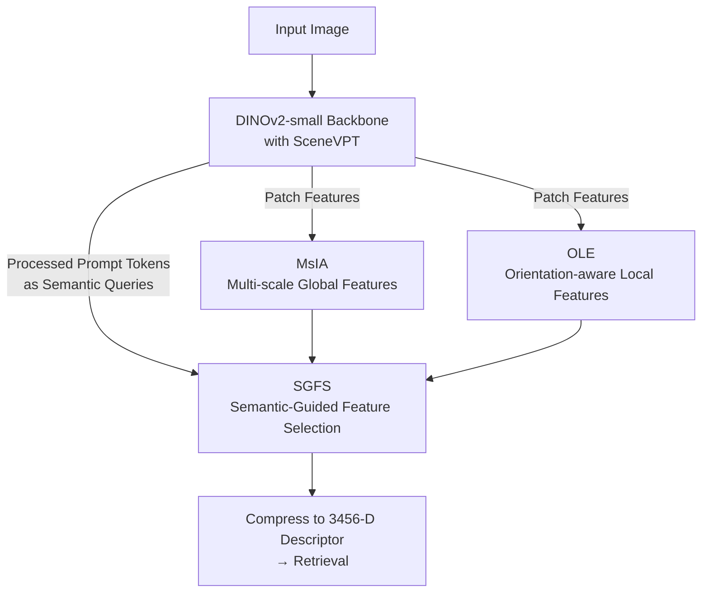

# EfficientVPR: Toward Efficient Visual Place Recognition via Scene-Aware Prompt Tuning and Adaptive Feature Enhancement

**Conference**: CVPR 2026  
**Paper**: [CVF Open Access](https://openaccess.thecvf.com/content/CVPR2026/html/Tang_EfficientVPR_Toward_Efficient_Visual_Place_Recognition_via_Scene_Aware_Prompt_Tuning_CVPR_2026_paper.html)  
**Code**: https://github.com/WiniTang/EfficientVPR  
**Area**: 3D Vision  
**Keywords**: Visual Place Recognition, Visual Prompt Tuning, Parameter-Efficient Fine-Tuning, Local Feature Enhancement, DINOv2  

## TL;DR
By employing a "Scene-aware Visual Prompt Tuning (SceneVPT) + instance-specific key local feature enhancement module," this work performs single-stage Visual Place Recognition (VPR) on the lightweight DINOv2-small backbone. With a descriptor dimension of only 3456, it outperforms all methods of similar scale. Compared to the two-stage SOTA based on DINOv2-large, it achieves a ~73× speedup while maintaining an average R@1 within a 2.5% margin.

## Background & Motivation
**Background**: The task of Visual Place Recognition (VPR) is to localize a query image by matching features against a pre-built database, serving as a fundamental capability for autonomous driving and robot navigation. It must simultaneously address three requirements: robustness to environmental changes (perspective, season, lighting, domain shift), small memory footprint, and real-time inference. To improve robustness, a mainstream approach is **two-stage re-ranking**: candidates are first retrieved via global search, followed by geometric consistency verification (e.g., RANSAC) using stored key local features.

**Limitations of Prior Work**: Although re-ranking is accurate, storing extra local features significantly increases retrieval time, memory overhead, and latency. Consequently, single-stage methods have become the standard, aiming to withstand environmental changes through backbone redesign, model adaptation, or stronger feature aggregation. However, single-stage methods still suffer from three major issues: (i) they tend to learn "universal VPR features" while ignoring sample-specific discriminative regions—the very information utilized by re-ranking (e.g., a specific streetlight might be a key clue in one context but background noise in another); (ii) existing methods either underutilize model capacity or damage pre-trained features when adapting foundation models; (iii) output dimensions are often high, straining memory.

**Key Challenge**: Achieving high discriminative power on a **lightweight backbone** (DINOv2-small) faces two contradictions: as backbone capacity is compressed, the model becomes more prone to global dominant patterns and struggles to preserve key local details, leading to distraction by "non-overlapping regions" in partial-overlap scenarios (as shown in Figure 4: trees in the query image do not exist in the correct reference image, yet the model matches to a visually similar wrong location based on these irrelevant elements). Simultaneously, compact feature spaces are highly susceptible to catastrophic forgetting during fine-tuning because the low-rank adaptation subspace overlaps almost entirely with the native representation space.

**Goal**: To develop a **single-stage, lightweight** VPR framework that can adapt to different samples/scenes on a small backbone, enhance key local features without relying on re-ranking, and output low-dimensional descriptors.

**Core Idea**: Utilize **dynamic prompts** instead of static prompts or adapters to fine-tune the backbone (activating different prompts for each sample). The backbone's inherent **semantic priors** are used as query signals to filter and enhance sample-specific key local features, embedding the "local discriminative power of re-ranking" into a single-stage encoding.

## Method

### Overall Architecture
EfficientVPR is a single-stage pipeline: the input image passes through a DINOv2-small backbone fine-tuned with **SceneVPT**, yielding a patch feature sequence and processed prompt tokens. Feature enhancement then proceeds in two paths: **MsIA** extracts multi-scale global features, and **OLE** extracts orientation-aware local structural features. After concatenating both paths, **SGFS** uses the sample-specific prompts from the backbone as query signals to filter and enhance task/sample-critical local regions via cross-attention. Finally, the features are compressed into a low-dimensional (3456-D) global descriptor for retrieval. The entire method has no re-ranking stage; all discriminative power is condensed into a single forward pass.

### Key Designs

**1. SceneVPT: Dynamic Prompts vs. "Average Prompts"**

Addressing the issue where adapters directly modify tokens and damage pre-trained features—while original VPT prompts are static and scene-agnostic—the authors introduce an **adaptive prompt selection mechanism** on top of VPT-deep. The intuition is that the visual appearance of a place changes drastically and unpredictably; a single static prompt forced to represent the "average" of all conditions is inevitably suboptimal for specific queries. During layer-wise optimization, SceneVPT **retains sample-relevant prompts and replaces irrelevant ones**. Relevancy is determined by reusing the backbone's existing attention mechanisms without adding parameters: the attention weights of the CLS token (which summarizes global information in ViT) toward each prompt are used to re-weight the prompts.

Specifically, the filtering weight for the $j$-th prompt at the $i$-th layer is defined as $\alpha_{ij} = \text{sigmoid}(s'_j - \gamma)$, where $s'_j = s_j / \sum_{k=1}^{N_p} s_k$ is the normalized CLS-prompt attention weight (with $s_j$ taken from layer $i-1$) and $\gamma$ is a learnable threshold. The prompts fed into each layer for fine-tuning are a mixture of sample-relevant prompts retained from the previous layer $Z^P_{i-1}$ and newly introduced learnable prompts $P_i$:

$$\hat P_{i-1} = \alpha_i \cdot Z^P_{i-1} + (1_{N_p} - \alpha_i) \cdot P_i, \quad i \ge 2$$

The layer-wise fine-tuning is expressed as $(Z^{CLS}_i, Z^P_i, Z_i) = L_i([Z^{CLS}_{i-1}, \hat P_{i-1}, Z_{i-1}])$. This mechanism offers two benefits: first, it achieves **sample adaptation**—different inputs activate different prompts at each layer; second, **hierarchical fine-tuning mitigates catastrophic forgetting** by dynamically adjusting the insertion of new prompts, allowing the model to learn the VPR task while preserving DINOv2-small's compact pre-trained knowledge. The only hyperparameter requiring manual tuning is the number of prompts $N_p$.

**2. MsIA (Multi-Scale Interaction Attention): Recovering Multi-Scale Context**

Single-stage methods prioritize global structure, but global representations in small backbones can be simplistic. MsIA first reshapes the backbone's patch feature sequence $f_0$ into a feature map $f$, then uses a standard multi-scale structure to downsample at scales $s \in \{1,2,4\}$. The resulting feature maps are flattened and concatenated into a multi-scale sequence $f_{multi} \in \mathbb{R}^{N' \times C}$ ($N' = \sum_{s} \frac{H}{s}\times\frac{W}{s}$). Using $f_0$ as the query and $f_{multi}$ as the key/value, multi-head attention **adaptively fuses multi-scale contexts**, allowing global features to be dynamically weighted across different receptive fields.

**3. OLE (Orientation-aware Local Enhancer): Asymmetric Convolutions and Orthogonal Fusion**

Even under oblique views or large perspective changes, local textures and structural relationships often persist. OLE aims to strengthen these directional local features that are easily submerged by global representations. It reshapes $f_0$ into $f$ and uses **dual-path asymmetric convolutions**—a $1\times 3$ horizontal kernel and a $3\times 1$ vertical kernel—to extract horizontal and vertical local continuity, producing $f_h$ and $f_v$. To avoid redundancy from simply adding directional information, the authors implement a **nonlinear orthogonal fusion**: $f_v$ is passed through GeM pooling + MLP to yield a channel scalar $f'_v$ (a nonlinear summary of vertical statistics). Its spatial correlation $S$ with $f_h$ is calculated, and an orthogonal projection decomposition is performed to obtain geometrically complementary features:

$$f'_h = f_h - \frac{S}{\|f'_v\|_2 + \varepsilon} \cdot f'_v$$

where $\varepsilon$ ensures numerical stability. Finally, the orthogonalized $f'_h$ and $f_v$ are fused via $1\times 1$ convolution and flattened as the orientation-enhanced local features $f_{OLE}$. The significance of orthogonal decomposition is to **strip redundant components between the two directions, leaving truly complementary structural information**.

**4. SGFS (Semantic-Guided Feature Selector): Prompts as an "Alternative to Re-ranking"**

This is the key step to embedding the discriminative power of re-ranking into a single stage. SGFS uses the **processed prompts from the last backbone layer** $Z^P_L$ as semantic query signals. Since these prompts have been modulated specifically for the sample, they naturally carry the semantics of "what the key attributes in this image are." It first refines the prompt semantics using self-attention (inspired by BoQ):

$$f'_g = Z^P_L + \text{Attention}(Z^P_L, Z^P_L, Z^P_L), \quad f'_g = \text{LayerNorm}(f'_g)$$

Then, for the local features $f_l \in \mathbb{R}^{2N\times C}$ obtained by concatenating MsIA and OLE, cross-attention is applied using $f'_g$ as the query to **select and enhance key local regions based on sample/task relevance**:

$$f'_l = \text{Attention}(f'_g, f_l, f_l), \quad f_{out} = \text{LayerNorm}(f'_l)$$

Finally, a linear projection compresses $f_{out}$ to a low dimension (resulting in a 3456-D final global descriptor). Compared to re-ranking based on geometric verification, SGFS does not require storing local features or RANSAC; **it achieves sample-adaptive key region enhancement with a single cross-attention operation**.

### Loss & Training
The framework follows the GSV-Cities training protocol and uses Multi-Similarity Loss ($\alpha{=}1,\beta{=}50,\lambda{=}0$). A grouped optimization strategy is used: the initial learning rate is $2\mathrm{e}{-}4$ for main parameters and $2\mathrm{e}{-}2$ for backbone tuning parameters, decaying by $0.8\times$ every 5 epochs for a maximum of 30 epochs using the Adam optimizer. Each batch contains 160 places with 4 randomly sampled $266\times266$ images per place. Test images are resized to $322\times322$.

## Key Experimental Results

### Main Results
Evaluated on 7 benchmarks (Pitts250k, MSLS-val, AmsterTime, Eynsham, SVOX multi-weather/lighting) using R@1/R@5 with a DINOv2-S backbone and a 3456-D (denoted as 3k) descriptor.

| Method | Backbone | Dim(k) | Pitts250k R@1 | MSLS-val R@1 | AmsterTime R@1 | Eynsham R@1 | SVOX-Night R@1 |
|------|------|------|------|------|------|------|------|
| SALAD | DINOv2-S | 8 | 94.0 | 90.0 | 53.9 | 90.7 | 90.0 |
| BoQ (Single-stage SOTA) | DINOv2-S | 16 | 95.0 | 92.0 | 55.2 | 91.1 | 94.7 |
| SelaVPR (Two-stage) | DINOv2-L | 500 | 95.7 | 90.8 | 55.6 | 90.6 | 90.3 |
| FoL (Two-stage SOTA) | DINOv2-S | 469 | 95.4 | 90.8 | 59.1 | 91.8 | 89.9 |
| **EfficientVPR** | DINOv2-S | **3** | **95.4** | **92.8** | **60.2** | **92.0** | 94.4 |

Key takeaways: Using only 28% of BoQ's and 41% of SALAD's dimensions, EfficientVPR achieves higher average R@1 by 1.0% and 2.4% respectively. On AmsterTime (heavy scale/domain shift), it outperforms BoQ by 5.0%. Compared to the two-stage FoL, it leads by 1.4% in average R@1 with only 0.6% of its dimensionality.

Efficiency comparison (Latency on Pitts250k, A800 GPU):

| Method | Backbone | Dimension | Latency (ms) | Trainable Params (M) | Avg R@1 |
|------|------|------|------|------|------|
| FoL | DINOv2-L | 5×10⁵ | 124.8 | 56.9 | 92.8 |
| BoQ | DINOv2-B | 12288 | 7.6 | 28.3 | 91.6 |
| SALAD | DINOv2-S | 8448 | 2.4 | 11.9 | 87.9 |
| BoQ | DINOv2-S | 12288 | 4.2 | 15.9 | 89.3 |
| **EfficientVPR** | DINOv2-S | 3456 | **3.1** | **7.7** | **90.3** |

### Ablation Study

| Config | Meaning | Pitts250k R@1 | AmsterTime R@1 | SVOX-Over R@1 |
|------|------|------|------|------|
| MS-fc | Multi-scale global + linear head | 94.2 | 47.1 | 96.1 |
| MS+OLE-fc | Add OLE local | 94.4 | 48.0 | 96.3 |
| MsIA+OLE-fc | MsIA + OLE, linear head | 94.5 | 48.4 | 96.7 |
| **MsIA+OLE-SGFS** | Full Model | **95.0** | **55.2** | **97.9** |

Tuning strategy ablation: SceneVPT (0.15M) achieved 94.5/48.4/96.7 across the three datasets, outperforming VPT-deep (0.15M, 93.9/48.2/95.8) and Adapter (1.8M, 94.1/47.7/96.4). Full-tuning (21.7M) collapsed to 36.8 on AmsterTime.

### Key Findings
- **SGFS is the primary performance driver**: Switching from `MsIA+OLE-fc` to `MsIA+OLE-SGFS` improves AmsterTime R@1 from 48.4 to 55.2 (+6.8), confirming its effectiveness in handling domain shifts by ignoring irrelevant regions.
- **SceneVPT prevents forgetting**: While full-tuning performed poorly on AmsterTime (36.8), SceneVPT maintained high accuracy (48.4), showing hierarchical dynamic prompts preserve pre-trained knowledge.
- **SGFS vs BoQ block**: Replacing SGFS with a BoQ block dropped AmsterTime R@1 by 4.1, proving sample-relevant prompts are superior to universal aggregation.

## Highlights & Insights
- **Low-cost prompt selection**: SceneVPT reuses backbone attention for selection, providing sample adaptation without additional modules—a "zero-parameter" strategy valuable for other PEFT scenarios.
- **Embedding re-ranking power into single-stage retrieve**: SGFS leverages backbone-processed prompts to approximate the effect of local geometric verification within a single forward pass, avoiding the storage costs of re-ranking.
- **OLE Orthogonal Fusion**: Stripping redundant components between horizontal and vertical paths via $f'_h = f_h - \frac{S}{\|f'_v\|_2+\varepsilon} f'_v$ is a more principled approach to combining directional structural cues than simple addition.

## Limitations & Future Work
- The failure cases under extreme occlusion or nighttime were only qualitatively described without quantitative breakdown.
- The method remains dependent on strong pre-trained backbones like DINOv2; its effectiveness on non-ViT backbones is unverified.
- Adaptive prompt selection only utilizes first-order attention (CLS-to-prompt); exploring higher-order or cross-layer statistics is a possible extension.

## Related Work & Insights
- **vs Adapter-based (CricaVPR / SelaVPR)**: These modify tokens layer-wise, potentially damaging features. SceneVPT uses prompts (additional tokens) that do not interfere with original features, maintaining generalization.
- **vs Two-stage (FoL / R2Former)**: These rely on RANSAC and local feature storage. SGFS achieves a 73× speedup with comparable accuracy by using prompt-guided cross-attention.
- **vs BoQ / SALAD**: This work surpasses them with smaller dimensions (3456 vs 12288/8448) and fewer trainable parameters (7.7M) through sample-adaptive screening.

## Rating
- Novelty: ⭐⭐⭐⭐ Targeted integration of adaptive prompt selection and semantic-guided screening.
- Experimental Thoroughness: ⭐⭐⭐⭐⭐ Comprehensive evaluation across 7 benchmarks and thorough ablation of each module.
- Writing Quality: ⭐⭐⭐⭐ Clear motivation and technical explanation.
- Value: ⭐⭐⭐⭐⭐ High practical value by pushing the SOTA for single-stage VPR in terms of accuracy, efficiency, and memory.

<!-- RELATED:START -->

## Related Papers

- [\[CVPR 2026\] AsymLoc: Towards Asymmetric Feature Matching for Efficient Visual Localization](asymloc_towards_asymmetric_feature_matching_for_efficient_visual_localization.md)
- [\[AAAI 2026\] VPN: Visual Prompt Navigation](../../AAAI2026/3d_vision/vpn_visual_prompt_navigation.md)
- [\[NeurIPS 2025\] On Geometry-Enhanced Parameter-Efficient Fine-Tuning for 3D Scene Segmentation](../../NeurIPS2025/3d_vision/on_geometry-enhanced_parameter-efficient_fine-tuning_for_3d_scene_segmentation.md)
- [\[ECCV 2024\] Improving 2D Feature Representations by 3D-Aware Fine-Tuning](../../ECCV2024/3d_vision/improving_2d_feature_representations_by_3d-aware_fine-tuning.md)
- [\[CVPR 2026\] Hierarchical Visual Relocalization with Nearest View Synthesis from Feature Gaussian Splatting](hierarchical_visual_relocalization_with_nearest_view_synthesis_from_feature_gaus.md)

<!-- RELATED:END -->
