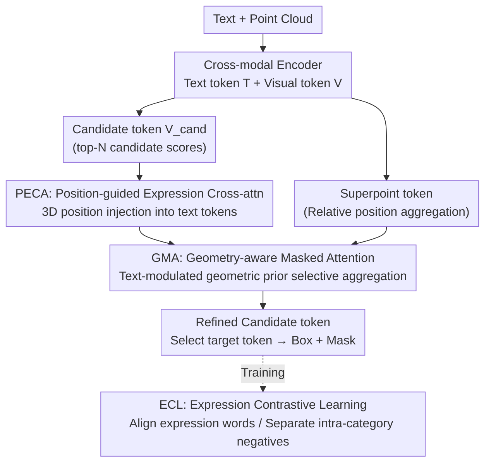

# EG-3DVG: Expression and Geometry Aware Grounding Decoder for 3D Visual Grounding

**Conference**: CVPR 2026  
**Paper**: [CVF Open Access](https://openaccess.thecvf.com/content/CVPR2026/html/Park_EG-3DVG_Expression_and_Geometry_Aware_Grounding_Decoder_for_3D_Visual_CVPR_2026_paper.html)  
**Code**: https://github.com/Gwan9Wook/EG3DVG  
**Area**: 3D Vision / Multimodal VLM  
**Keywords**: 3D Visual Grounding, Cross-modal Alignment, Geometry-aware Attention, Contrastive Learning, Point Cloud  

## TL;DR
EG-3DVG embeds two complementary attention modules—PECA, which injects 3D positions into text tokens, and GMA, which filters visual tokens based on geometric relations—within a 3D visual grounding decoder. Complemented by Expression Contrastive Learning (ECL) to distinguish intra-category distractors, it specifically addresses "cross-modal misalignment, intra-category confusion, and geometric reasoning errors," achieving SOTA in bounding box localization and mask prediction on ScanRefer and SR3D/NR3D.

## Background & Motivation
**Background**: 3D Visual Grounding (3DVG) involves locating target objects in point cloud scenes based on natural language descriptions (e.g., "the chair with a curved back and multiple bars north of the round table"). This is divided into two sub-tasks: 3DREC for box prediction and 3DRES for mask prediction. Prevailing methods encode point clouds with PointNet++ and text with RoBERTa, followed by transformer-based cross-modal fusion and a final decoder that converts visual tokens into candidate boxes/masks, selecting the candidate with the highest text alignment score.

**Limitations of Prior Work**: Failures are categorized into three types: ① **Cross-modal misalignment**: Textual semantics fail to reliably transfer to visual features via cross-attention, leading to imprecise localization; ② **Intra-category confusion**: In scenes with multiple objects of the same class (the "multiple" setting, comprising 81% of ScanRefer), models struggle to capture fine-grained linguistic cues, localizing the wrong instance; ③ **Geometric reasoning errors**: When aggregating spatially relevant features, irrelevant objects or background points are incorrectly included, leading to erroneous geometric inference.

**Key Challenge**: The first two problems stem from cross-attention asymmetry—visual tokens naturally possess 3D coordinates while text tokens lack spatial information, leading to imbalanced spatial cues and inaccurate attention weights. The third problem arises because visual tokens selected as candidates often cover only a portion of the object; while incorporating all visual tokens could complete the geometry, full attention introduces noise from irrelevant objects or the background.

**Goal**: To patch "cross-modal alignment" and "geometric aggregation" within the grounding decoder layer while employing a specialized loss to separate intra-category distractors.

**Core Idea**: Utilize Position-guided Expression Cross-Attention (PECA) to inject 3D positions into text tokens for better alignment, apply Geometry-aware Masked Attention (GMA) to selectively aggregate visual tokens via text-modulated geometric priors to fix geometric errors, and use Expression Contrastive Learning (ECL) to differentiate targets from intra-category negatives at the expression word level.

## Method

### Overall Architecture
EG-3DVG inputs a description of $N_{text}$ words and a scene of $N_{point}$ points, outputting a target mask $m \in \mathbb{R}^{N_{point}}$ and a 3D box $b \in \mathbb{R}^6$. The pipeline begins with a **cross-modal encoder** that produces text tokens $T$ and visual tokens $V$. Candidate tokens $V_{cand}$ are selected via top-$N_{cand}$ candidate scores, while visual tokens are projected to superpoint resolution to obtain superpoint tokens $V_{super}$ via relative position FFN. These tokens enter the **Expression and Geometry-aware grounding Decoder (EGD)**, which features two branches: the superpoint branch refines $V_{super}$ using candidate and text tokens; the candidate branch undergoes self-attention + PECA to obtain $V^{cand}_{PECA}$, followed by parallel cross-attention with refined superpoints and GMA. The final output is $\tilde{V}_{cand} = \mathrm{FFN}(V^{cand}_{super} + V^{cand}_{GMA})$. The target token is selected via the highest alignment score, where masks are mapped back via $\hat{m} = \tilde{V}_{super}e$ ($e$ is a mask embedding) and boxes are refined as $b = \alpha b_{ini} + (1-\alpha)b_{mask}$ ($\alpha=0.5$). EGD is repeated 6 times. During training, ECL aligns target tokens with expression words and pushes away intra-category negatives in multiple-instance scenes.

### Key Designs

**1. PECA: Injecting 3D positions into text tokens for spatially consistent alignment**

Conventional cross-attention treats visual tokens as queries and text tokens as key-values. However, visual tokens carry 3D coordinates via PointNet++, while text tokens lack spatial cues. PECA addresses this asymmetry by projecting visual coordinates $P \in \mathbb{R}^{N_{vis}\times 3}$ into positional embeddings $E_{pos}$ via MLP and "softly" injecting them into text tokens based on text-visual similarity:

$$T_{pos} = T + \mathrm{Softmax}\left(\frac{T \cdot V^\top}{\sqrt{C}}\right) E_{pos}.$$

Subsequently, cross-attention is performed with $V_{cand}$ as query, $T_{pos}$ (with positions) as key, and original $T$ as value to produce $V^{cand}_{PECA}$. The insight is using the positional version only for the key—spatial information influences "which word to attend to" without contaminating the aggregated textual semantics.

**2. GMA: Selective aggregation of visual tokens via text-modulated geometric priors**

While PECA aligns semantics, candidate tokens often cover only portions of the target. GMA completes the geometry without introducing background noise. It first computes a geometric relation tensor $G(i,j) = (P_i^{cand} - P_j,\ \lVert P_i^{cand} - P_j \rVert_2) \in \mathbb{R}^4$ for each candidate and visual token, projected into geometric features $\tilde{G}$. Global text context then modulates the geometric affinity to derive a geometric attention prior:

$$A_{geo} = \mathrm{Sigmoid}\left(\mathcal{F}^{-1}\big(\mathcal{F}(\tilde{G}) \cdot \mathrm{MaxPool}(T)^\top\big)\right),$$

where $\mathrm{MaxPool}(T)$ compresses expression-related text into a global context vector, making the "decision to aggregate" language-driven. $A_{geo}$ is binarized into $\tilde{A}_{geo} \in \{0,1\}$ via a Straight-Through Estimator (STE) with a learnable threshold and used as an additive mask:

$$V^{cand}_{GMA} = V^{cand}_{PECA} + \mathrm{Softmax}\left(\frac{V^{cand}_{PECA} V^\top}{\sqrt{C}} + \log(\tilde{A}_{geo})\right) V.$$

This forces candidates to aggregate geometric info only from visual tokens that are spatially proximal and textually relevant.

**3. ECL: Separating targets from intra-category distractors via expression words**

Performance drops significantly in "multiple" settings (intra-category confusion) due to the failure to capture fine-grained descriptors (attributes, pronouns, relations). ECL constructs negative samples by selecting descriptions of **different instances of the same category** within the same scene. Phrases are parsed into expression words (using linguistic tools) to obtain $T^-$ (negative) and $T^+$ (positive). Using the candidate $\tilde{V}^{cand}_{i_{gt}}$ with the highest IoU as the visual representation, a weighted contrastive loss is applied (temperature $\rho=0.07$, positive weight $w^+=1$, negative weight $w^-=2$) to push the target token closer to its own expression words and further from distractor words.

### Loss & Training
The total loss is $L = \lambda_{rec}L_{rec} + \lambda_{res}L_{res} + \lambda_{kps}L_{kps} + \lambda_{cont}L_{cont}$ with weights $0.14 / 0.14 / 8 / 0.1$. $L_{rec}$ and $L_{res}$ denote box and mask losses, $L_{kps}$ is the keypoint score loss, and $L_{cont}$ is the ECL loss. RoBERTa is frozen; PointNet++ uses a learning rate of $1\times10^{-5}$ while other layers use $2\times10^{-4}$. Training is performed on 2 A6000 GPUs with a batch size of 8 per card.

## Key Experimental Results

### Main Results
ScanRefer 3DREC (single-stage, compared to Prev. SOTA TSP3D):

| Setting | Metric | EG-3DVG | TSP3D | Gain |
|------|------|---------|-------|------|
| Overall | Acc@0.25 | 57.13 | 56.45 | +0.68 |
| Overall | Acc@0.5 | 50.07 | 46.71 | +3.36 |
| Unique | Acc@0.5 | 83.79 | 71.41 | +12.4 |
| Multiple | Acc@0.5 | 44.16 | 42.37 | +1.79 |

In the two-stage setting, Overall Acc@0.5 reaches 52.36, outperforming MCLN's 45.53 by +6.83. ScanRefer 3DRES (mask prediction):

| Method | Acc@0.25 | Acc@0.5 | mIoU |
|------|---------|---------|------|
| MCLN | 58.70 | 50.70 | 44.72 |
| RG-SAN | 61.67 | 44.92 | 44.66 |
| **Ours** | 59.77 | **53.77** | **47.28** |

On SR3D/NR3D, 3DREC Acc@0.25 exceeds G3-LQ (+2.1 / +1.5); 3DRES mIoU exceeds MCLN (+9.1 / +1.9).

### Ablation Study
Module ablation (ScanRefer):

| PECA | GMA | ECL | 3DREC Acc@0.25 | 3DREC Acc@0.5 | 3DRES mIoU |
|------|-----|-----|----------------|---------------|------------|
| | | | 57.04 | 49.62 | 44.19 |
| ✓ | | | 57.73 | 50.92 | 45.69 |
| | ✓ | | 57.05 | 50.55 | 46.19 |
| | | ✓ | 57.56 | 50.85 | 45.84 |
| ✓ | ✓ | ✓ | **58.54** | **52.36** | **47.28** |

GMA mask generation ablation:

| Mask Type | Acc@0.25 | Acc@0.5 | mIoU |
|---------|---------|---------|------|
| Fixed Radius (0.75m) | 57.76 | 51.12 | 46.23 |
| Geometry Only (No Text) | 58.16 | 51.20 | 46.70 |
| GMA (Geometry+Text) | **58.54** | **52.36** | **47.28** |

### Key Findings
- The three modules are complementary, targeting orthogonal failure modes. GMA contributes most to 3DRES mIoU (+2.0), while PECA significantly improves 3DREC accuracy.
- GMA masks require both geometry and text. Fixed-radius masks perform worst, and geometry-only masks (without text modulation) are inferior to the full GMA, proving that language-driven geometric affinity effectively filters irrelevant tokens.
- Significant gains are observed in high-IoU thresholds for Unique objects (+12.4 Acc@0.5 over TSP3D) and SR3D masks (+9.1 mIoU), indicating that geometry-aware aggregation substantially improves localization precision.

## Highlights & Insights
- **Key/Value decoupling in PECA**: Injecting positions into keys (influencing "where to attend") while keeping values original (preserving semantics) is a clever trick applicable to any cross-modal attention task.
- **Learnable geometric mask in GMA**: Using text to modulate geometric priors is more flexible than fixed-radius truncation. The use of STE and learnable thresholds enables end-to-end training of binary masks.
- **Precision targeting in ECL**: By only constructing negatives for intra-category distractors and doubling their weight, the contrastive loss focuses on the hardest subset of 3DVG.
- Modular design directly maps to failure analysis, resulting in a cohesive narrative.

## Limitations & Future Work
- **Background**: Dependency on linguistic parsers for ECL and target selection; robustness to parsing errors is not analyzed.
- **Mechanism**: Significant gains in the two-stage setting likely stem from the external 3D detector; the isolated contribution of EGD in this context remains unclear.
- **Function**: Computational and memory overhead for calculating the $N_{cand}\times N_{vis}$ geometric tensor is not compared with lightweight real-time methods.
- **Method**: Sensitivity analysis for hyperparameters like $w^-=2$ and $\alpha=0.5$ is missing.

## Related Work & Insights
- **vs MCLN**: Unlike MCLN’s standard cross-attention, EG-3DVG uses PECA, GMA, and ECL, leading to higher 3DRES mIoU (+2.56) and two-stage Acc@0.5 (+6.83).
- **vs TSP3D**: While TSP3D focuses on real-time efficiency via sparse voting, EG-3DVG prioritizes accuracy (+3.36 single-stage Acc@0.5), representing a different trade-off.
- **vs G3-LQ**: EG-3DVG outperforms G3-LQ on SR3D/NR3D 3DREC while providing a unified SOTA solution for 3DRES.

## Rating
- Novelty: ⭐⭐⭐⭐ 
- Experimental Thoroughness: ⭐⭐⭐⭐⭐ 
- Writing Quality: ⭐⭐⭐⭐ 
- Value: ⭐⭐⭐⭐ 

<!-- RELATED:START -->

## Related Papers

- [\[CVPR 2026\] HAMMER: Harnessing MLLM via Cross-Modal Integration for Intention-Driven 3D Affordance Grounding](hammer_harnessing_mllm_via_cross-modal_integration_for_intention-driven_3d_affor.md)
- [\[CVPR 2026\] Visual Grounding for Object Questions](visual_grounding_for_object_questions.md)
- [\[CVPR 2026\] VGent: Visual Grounding via Modular Design for Disentangling Reasoning and Prediction](vgent_visual_grounding_via_modular_design_for_disentangling_reasoning_and_predic.md)
- [\[ICCV 2025\] ViewSRD: 3D Visual Grounding via Structured Multi-View Decomposition](../../ICCV2025/multimodal_vlm/viewsrd_3d_visual_grounding_via_structured_multi-view_decomposition.md)
- [\[CVPR 2026\] Phrase-Grounding-Aware Supervised Fine-Tuning for Chart Recognition via Side-Masked Attention](phrase-grounding-aware_supervised_fine-tuning_for_chart_recognition_via_side-mas.md)

<!-- RELATED:END -->
