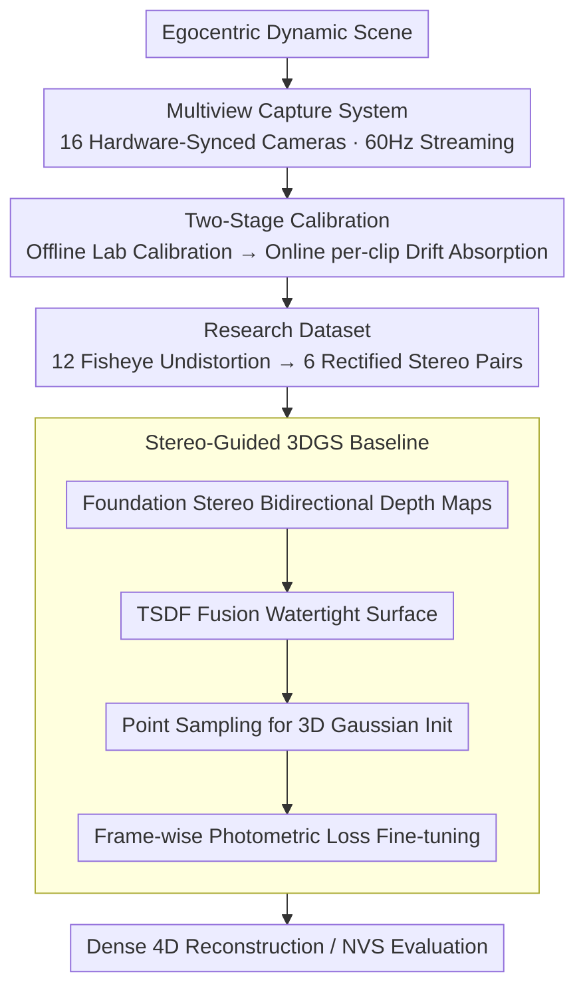

# Ego-1K: A Large-Scale Multiview Video Dataset for Egocentric Vision

**Conference**: CVPR 2026  
**arXiv**: [2603.13741](https://arxiv.org/abs/2603.13741)  
**Code**: [Dataset](https://huggingface.co/datasets/facebook/ego-1k)  
**Area**: 3D Vision  
**Keywords**: Egocentric vision, multiview dataset, dynamic scene reconstruction, novel view synthesis, hand-object interaction

## TL;DR

Ours introduces Ego-1K, a large-scale time-synchronized egocentric multiview video dataset containing 956 short videos (12+4 cameras, 60Hz). It fills the data gap in the field of egocentric dynamic 3D reconstruction and demonstrates that stereo depth guidance significantly enhances the quality of 4D novel view synthesis.

## Background & Motivation

Mixed reality devices and egocentric world modeling require realistic 4D reconstruction from the wearer's perspective. However, existing datasets have critical gaps:

- **NVS Datasets** (e.g., Neural 3D Video, DiVA360): Provide multiviews but are exocentric, lacking egocentric perspectives.
- **Egocentric Datasets** (e.g., Ego4D, EPIC-KITCHENS): Large-scale but primarily monocular/binocular, focusing on activity recognition rather than 3D reconstruction.
- **Multiview Egocentric Datasets** (e.g., EgoExo4D, HOT3D): Only contain 2-3 egocentric cameras, providing insufficient view counts.

**Key Challenge**: A dynamic scene dataset that simultaneously satisfies **large-scale, high camera count, egocentric perspective, and precise synchronization**. Specific challenges of this dataset include large parallax from close-range hand movements, rapid image motion, and frequent occlusions.

## Method

### Overall Architecture

Ego-1K is a dataset + benchmark paper rather than an algorithmic paper. The **Goal** is to answer: "Can dynamic 4D scenes be densely reconstructed from the wearer's perspective?" The work follows a four-step **Mechanism**: "Capture → Calibration → Organization → Evaluation". First, 16-way video is precisely synchronized using a custom multi-camera head-mounted device. Then, two-stage offline + online calibration is used to align camera geometry. The data is rectified into stereo pairs for release. Finally, evaluation protocols for stereo consistency and 4D novel view synthesis are provided, along with a stereo-depth-guided 3DGS baseline.

### Key Designs

**1. Multiview Capture System: Densifying Egocentric Dynamic Scenes with 16 Hardware-Synced Cameras**

Existing head-mounted devices have at most 2-3 cameras, insufficient for dense 3D reconstruction. The authors customized a rig: a Quest 3 headset (4 forward cameras) as the base, with 12 external fisheye cameras (8MP global shutter, 190° FOV, f2.8). All 16 cameras are hardware-synchronized to 60Hz via a wireless synchronizer. The 12 external cameras connect via USB 3.1 to a backpack PC, streaming 8-bit raw Bayer data. Global shutter was chosen over rolling shutter to prevent line-tearing under fast hand motion—a prerequisite for stereo matching.

**2. Two-Stage Calibration: Preventing Micro-movements and Thermal Drift from Ruining Stereo Geometry**

Close-range stereo reconstruction is extremely sensitive to geometric accuracy. Authors first perform offline calibration using 5 large Calibu boards. However, head-mounted lenses experience 0.1-0.2° rotational micro-movements during use, and thermal changes cause focal length drift (1-3 pixel shifts). Thus, online calibration is performed for each recording: optimizing only camera orientation and focal length. This reduced median MAD scores for stereo consistency by 35%.

**3. Research Dataset: Organizing 12 Fisheye Streams into 6 Rectified Stereo Pairs**

To make the data usable for standard NVS methods, 12 fisheye streams are undistorted into 6 rectified stereo pairs (1280×1280, 130° horizontal FOV). The research version excludes Quest 3 RGB cameras because their rolling shutters and inconsistent color profiles would contaminate the geometry. The full raw dataset is approximately 88 TB, while the processed research version is ~17.5 TB.

**4. Stereo-Guided 3DGS Baseline: Salvaging Per-Frame Reconstruction with Geometric Priors**

A **Key Insight** is that the bottleneck lies in geometric initialization rather than temporal modeling. The baseline uses Foundation Stereo to generate bidirectional depth maps, merges them into a watertight surface via TSDF, and samples points (with normals and color) to initialize 3D Gaussians. Fine-tuning minimizes the photometric loss:

$$\mathcal{L}=(1-\lambda)\mathcal{L}_1 + \lambda\mathcal{L}_{\text{D-SSIM}},\quad \lambda=0.1$$

By optimizing each frame independently, dense 4D reconstruction is achieved by bypassing the failure of end-to-end dynamic models under large parallax and self-motion.

### Loss & Training

- Evaluation involves no model training, only fine-tuning 3DGS.
- Train/Test Split: 10 training views + 2 test views (Target Pair 3-4).
- Experimental Subset: 10% of the dataset (96 recordings).

## Key Experimental Results

### Main Results

4D NVS Reconstruction Evaluation (Target views 3-4 as test, remaining 10 for training):

| Method | PSNR ↑ | SSIM ↑ | LPIPS ↓ |
|------|--------|--------|---------|
| 3DGS (Per-frame) | 21.22 | 0.709 | 0.260 |
| K-Planes | 16.46 | 0.597 | 0.443 |
| Spacetime Gaussians | 24.76 | 0.780 | 0.270 |
| **3DGS + Stereo Guidance (Ours)** | **29.12** | **0.830** | **0.115** |

Stereo guidance provides a **Gain** of 7.9 dB PSNR over vanilla 3DGS and 4.4 dB over Spacetime Gaussians.

### Ablation Study

Stereo consistency evaluation (warping 5 disparity maps to the target pair):

| Stereo Method | MAD ↓ (mm) | MAD<1mm ↑ | SD ↓ (mm) |
|----------|-----------|-----------|----------|
| **Foundation Stereo** | **1.6** | **74.0%** | 42.5 |
| Selective-Stereo | 8.0 | 0.0% | 46.2 |
| BiDAStereo | 2.2 | 3.1% | **8.3** |
| StereoAnywhere | 1.7 | 29.5% | 10.4 |

Foundation Stereo achieved the best overall consistency (lowest MAD), while BiDAStereo had the fewest extreme outliers (lowest SD).

## Key Findings

- Existing NVS methods perform poorly in egocentric dynamic scenes; K-Planes reaches only 16.46 dB.
- Dynamic models (K-Planes, Spacetime Gaussians) designed for object-centric or static-pose multiview video fail to handle the combination of self-motion, close-range hand motion, and large parallax.
- Performance gaps are larger for close-range dynamic objects (hands) than for distant objects (bystanders).
- Online calibration is critical, reducing MAD in stereo estimation by 35%.

## Highlights & Insights

- Fills a clear data gap: The first dataset in the field satisfying large-scale + high camera count + egocentric + precise synchronization.
- The proposed stereo consistency evaluation protocol (requiring no GT depth) is highly practical and transferable.
- **Core Idea**: Per-frame initialization is more effective than end-to-end dynamic modeling; the bottleneck is geometry initialization.
- Engineering decisions such as online calibration and global shutter selection are well-justified.

## Limitations & Future Work

- The 4 Quest 3 cameras are not fully utilized due to rolling shutter differences.
- iToF data remained unused due to motion artifacts; future work could explore multi-modal fusion.
- Current baseline lacks temporal consistency modeling; spatio-temporal regularization or scene flow priors could be explored.
- Focusing primarily on hand-object interaction; scene diversity (e.g., outdoors) could be expanded.
- Dataset storage (88 TB) and bandwidth requirements are high.
- Lack of semantic annotations (hand keypoints, object categories) limits downstream task evaluation.

## Related Work & Insights

- **Ego4D / EgoExo4D**: Large-scale but fewer cameras, focused on recognition.
- **Neural 3D Video / DiVA360**: Multiview NVS but exocentric.
- **Foundation Stereo**: Demonstrates significant utility as a geometric prior.
- **3DGS**: Served as the NVS backbone; performance was significantly boosted by stereo initialization.
- Insight: As smart glasses become popular, egocentric multiview reconstruction is a critical direction; geometric priors are currently more reliable than pure learning-based temporal methods.

## Rating

- **Novelty**: ⭐⭐⭐ Dataset contribution is primary; the stereo guidance approach is intuitive but well-validated.
- **Experimental Thoroughness**: ⭐⭐⭐⭐ Includes stereo evaluation, NVS evaluation, and multi-baseline comparisons.
- **Writing Quality**: ⭐⭐⭐⭐ Detailed dataset description and comprehensive engineering details.
- **Value**: ⭐⭐⭐⭐ Fills a clear data gap and will drive egocentric 3D/4D reconstruction research.

<!-- RELATED:START -->

## Related Papers

- [\[CVPR 2026\] SpatialVID: A Large-Scale Video Dataset with Spatial Annotations](spatialvid_a_large-scale_video_dataset_with_spatial_annotations.md)
- [\[CVPR 2026\] SceneScribe-1M: A Large-Scale Video Dataset with Comprehensive Geometric and Semantic Annotations](scenescribe-1m_a_large-scale_video_dataset_with_comprehensive_geometric_and_sema.md)
- [\[CVPR 2026\] OLATverse: A Large-scale Real-world Object Dataset with Precise Lighting Control](olatverse_a_large-scale_real-world_object_dataset_with_precise_lighting_control.md)
- [\[CVPR 2025\] EgoPressure: A Dataset for Hand Pressure and Pose Estimation in Egocentric Vision](../../CVPR2025/3d_vision/egopressure_a_dataset_for_hand_pressure_and_pose_estimation_in_egocentric_vision.md)
- [\[CVPR 2026\] 3DReflecNet: A Large-Scale Dataset for 3D Reconstruction of Reflective, Transparent, and Low-Texture Objects](3dreflecnet_a_large-scale_dataset_for_3d_reconstruction_of_reflective_transparen.md)

<!-- RELATED:END -->
