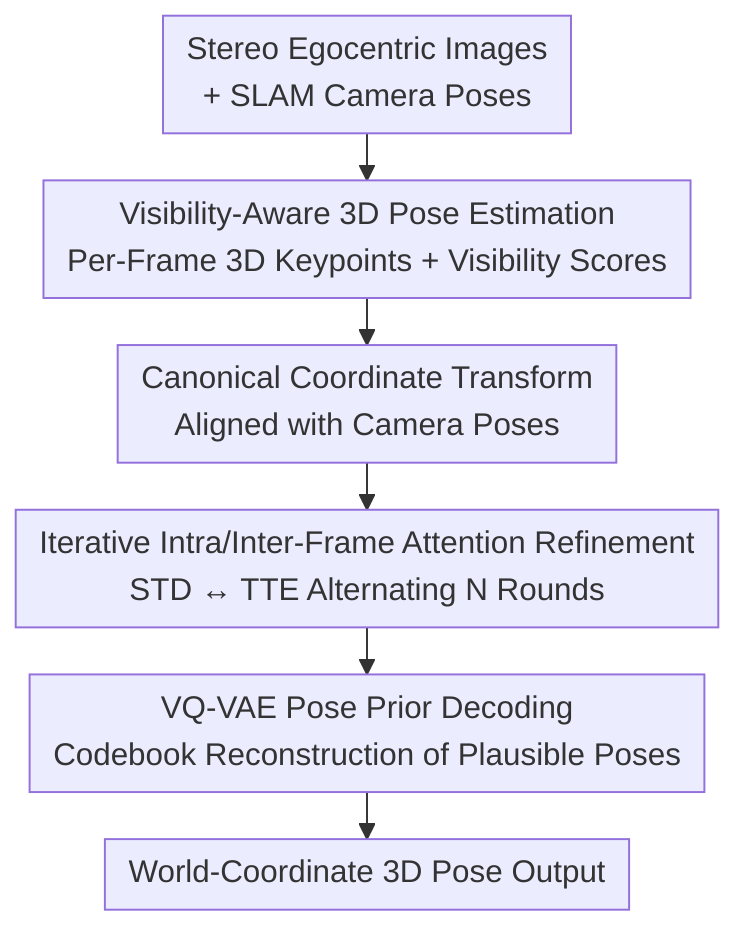

# Egocentric Visibility-Aware Human Pose Estimation

**Conference**: CVPR 2026  
**Paper**: [CVF Open Access](https://openaccess.thecvf.com/content/CVPR2026/html/Dai_Egocentric_Visibility-Aware_Human_Pose_Estimation_CVPR_2026_paper.html)  
**Code**: Not open-sourced (None)  
**Area**: 3D Vision / Human Pose Estimation  
**Keywords**: Egocentric Pose Estimation, Keypoint Visibility, VQ-VAE Pose Prior, Dataset, VR/AR  

## TL;DR
Addressing the "frequently invisible keypoints" issue in egocentric human pose estimation for head-mounted devices (HMDs), this paper constructs Eva-3M, the first large-scale real-world dataset with visibility annotations (3 million frames, 435,000 visibility labels). It proposes EvaPose, which explicitly predicts the visibility of each keypoint and weights the loss accordingly, reducing the MPJPE of visible keypoints from 49.8mm in FRAME to 34.2mm.

## Background & Motivation
**Background**: Egocentric human pose estimation using head-mounted devices (HMDs, such as VR headsets) is a critical capability for VR/AR and robotic teleoperation. Unlike the "outside-in" perspective of external cameras, egocentric cameras capture the user's own body from a top-down view. Mainstream approaches (UnrealEgo, EgoPoseFormer, FRAME) predict 2D heatmaps from stereo images and lift them to 3D, recently incorporating SLAM camera poses for temporal and global alignment.

**Limitations of Prior Work**: The core challenge in egocentric vision is **invisible keypoints**, arising from two factors: severe self-occlusion of body parts (especially the lower body) and the limited Field of View (FoV) of HMD cameras, which fails to capture limbs when extended. Statistics show that limb keypoints are invisible nearly half the time in Eva-3M. However, existing methods treat visible and invisible keypoints **identically**, and since invisible points lack direct visual evidence and possess inherent 3D ambiguity, this "indiscriminate" processing **drags down the accuracy of visible points**.

**Key Challenge**: Visible points could theoretically be estimated with high precision, but during training, the high-noise supervision signals from invisible points contaminate the shared network. The root cause is twofold: no existing data annotations inform the model which points are visible, and current methods lack mechanisms to treat them differently.

**Goal**: (1) Provide a real-world egocentric dataset with visibility annotations; (2) Design a pose estimation method that explicitly utilizes visibility information to isolate interference from invisible points.

**Key Insight**: The authors argue that keypoint visibility is not a byproduct but should be a **first-class citizen that is explicitly predicted and used for supervision weighting**. They first annotate visibility extensively (a gap in all prior datasets) and then enable the network to predict visibility and allocate loss weights accordingly.

**Core Idea**: Use "predicted visibility + visibility-weighted loss" to down-weight invisible points, while utilizing a VQ-VAE pose prior learned from mocap data to constrain invisible points, thereby significantly improving the accuracy of visible points without sacrificing the plausibility of invisible ones.

## Method

### Overall Architecture
EvaPose takes a $T$-frame sequence of stereo egocentric observations as input—left and right grayscale images $I^{1:T}_L, I^{1:T}_R$ and camera poses $C^{1:T}_L, C^{1:T}_R$ provided by the HMD's built-in SLAM (where each pose $C^t_v=[R^t_v|T^t_v]\in\mathbb{R}^{3\times4}$). The output is a sequence of SMPL keypoints $J^{1:T}_W$ in the world coordinate system, modeled as $f_\phi(J^{1:T}_W \mid I^{1:T}_L, I^{1:T}_R, C^{1:T}_L, C^{1:T}_R)$.

The pipeline follows three steps: first, a **visibility-aware 3D pose estimation network** predicts 3D keypoints $J^t_{Cam}$ in camera coordinates and visibility scores $S^t_{Vis}$ for each point frame-by-frame; second, camera poses are used to transform these points into a **canonical coordinate system** (invariant to translation and rotation around the vertical axis) for multi-view and temporal fusion via an **iterative intra-inter frame attention network**; finally, the fused features are passed through a **VQ-VAE decoder** pre-trained on large-scale mocap data to reconstruct high-fidelity 3D poses, which are then transformed back to world coordinates. The VQ-VAE remains frozen during EvaPose training, acting as a strong pose prior.

### Key Designs

**1. Eva-3M Dataset & Visibility Annotation: Labeling "Invisibility" for the First Time**

Prior egocentric datasets were either synthetic (perfect labels but large domain gaps) or used custom rigs (protruding camera placements that minimize self-occlusion, unlike the slim profile of real VR devices), and **none provided keypoint visibility annotations**. This work used a commercial Pico4 Ultra VR-MR headset to collect 1,353 motion sequences and 3 million synchronized frames, covering 31 subjects and 24 types of daily VR actions. Each frame includes paired stereo grayscale images (640×480), GT SMPL parameters in camera/world coordinates, and 2D/3D keypoints, with **435,000 frames including per-keypoint visibility labels**. This is the first real egocentric dataset to provide both GT SMPL poses and visibility annotations. The authors also supplementary annotated 488,000 frames of visibility labels for the existing EMHI dataset. The motion diversity in Eva-3M is also broader: normalized distributions of 70,000 sampled root-relative coordinates for spine1 and right ankle show that Eva-3M has significantly greater spatial coverage and coordinate variance than EMHI.

**2. Visibility-Aware 3D Pose Estimation Network: Explicit Visibility Prediction and Weighted Loss**

This is the core for isolating "invisible point pollution." Given stereo image pairs, an image encoder extracts features $F_L, F_R$, followed by two lightweight decoding heads: one predicts 2D heatmaps $H_v\in\mathbb{R}^{N_J\times H'\times W'}$ in the style of ViTPose using deconvolutional layers; the other predicts visibility scores $S_v\in\mathbb{R}^{N_J}$ via convolutions and MLPs. A key step is constructing **visibility-aware heatmaps** $H'_{i,v}=s_{i,v}\cdot H_{i,v}$, where the predicted visibility score modulates the corresponding keypoint heatmap to naturally suppress responses for invisible points. These heatmaps are patch-embedded and passed through a three-layer ViT encoder to model cross-joint and cross-view dependencies. Finally, the left and right view tokens for the $i$-th keypoint are concatenated and passed through an MLP to regress the 3D position $J^i_{Cam}$, with the visibility score $S_{Vis}$ calculated as the average of both views.

Crucially, a **visibility-weighted loss** is used during training. The first-stage loss is $L_{stage1}=\lambda_{vis}L_{vis}+\lambda_{heatmap}L_{heatmap}+\lambda_{3D}L_{3D}$, where $L_{vis}$ is the binary cross-entropy between predicted and GT visibility. Both heatmap and 3D losses are multiplied by a weight function $w(\cdot)$ based on visibility:

$$L_{heatmap}=\frac{1}{2N_J}\sum_{j=1}^{2}\sum_{i=1}^{N_J} w(s_{i,j})\cdot \mathrm{MSE}(H_{i,j},\bar H_{i,j}),\quad L_{3D}=\frac{1}{N_J}\sum_{i=1}^{N_J}\frac{w(s_{i,1})+w(s_{i,2})}{2}\cdot \mathrm{MSE}(J^i_{Cam},\bar J^i_{Cam})$$

The weight function is set to $w=1.0$ for visible points and $w=0.1$ for invisible points, down-weighting the unreliable supervision of invisible points by ten times. This guides the network capacity toward fitting points with "visual evidence," significantly improving visible point accuracy while leaving invisible points to be handled by the subsequent prior.

**3. Iterative Intra-Inter Frame Attention Refinement: STD for Multi-view, TTE for Temporal**

Frame-by-frame prediction lacks temporal consistency and sufficient cross-view fusion. First, $J^{1:T}_{Cam}$ is transformed into canonical coordinates $J^{1:T}_{Can}$ using camera poses (this coordinate system projects the head joint to the ground and aligns the vertical axis, making it invariant to ground translation and vertical rotation to accommodate different user heights). The $J^t_{Can}$ and $S^t_{Vis}$ for each frame are concatenated and passed through a feed-forward network to generate frame-level queries $q^t_0$. These queries then alternate between the **Stereo Transformer Decoder (STD)** and **Temporal Transformer Encoder (TTE)**. STD allows each query to interact with left and right visual features $f^t_v=\mathrm{Decoder}(q^t_{n-1}, F_v),\ v\in\{L,R\}$, and the results are concatenated through an MLP to obtain multi-view fused features $f^t_n$. TTE then performs temporal fusion across the window: $[q^1_n,\dots,q^T_n]=\mathrm{Encoder}([f^1_n,\dots,f^T_n])$. After $N$ iterations, this process fills in missing visual evidence and smooths temporal jitter.

**4. VQ-VAE Pose Prior: Plausible Fallback for Invisible Points via Mocap Codebook**

Invisible points lack visual evidence, and pure regression often yields poses that violate anatomical structures. This work pre-trains a VQ-VAE on large-scale mocap data (AMASS/MOYO/AIST++). The encoder maps canonical 3D keypoints $J_{Can}$ to a latent sequence $z=E(J_{Can})=[z_1,\dots,z_M]$, where each $z_i$ is quantized to the nearest codeword in a learnable codebook $CB=\{c_k\}_{k=1}^{K}$. In EvaPose, this VQ-VAE is frozen. The features $q^t_N$ from iterative attention are passed through an MLP+softmax to estimate logits $\bar z^t=\mathrm{Softmax}(\mathrm{MLP}(q^t_N))\in\mathbb{R}^{M\times K}$, which are then multiplied by the codebook to obtain **differentiable approximate quantized features** $z^t=\bar z^t_{M\times K}\times CB_{K\times D}$ (avoiding the non-differentiable argmax operation). Finally, the VQ-VAE decoder reconstructs 3D poses that lie on the "manifold of real human poses."

### Loss & Training
Two-stage training: In the first stage, the visibility-aware estimation network is trained with weights $\lambda_{vis}=5\times10^{-3}, \lambda_{heatmap}=0.1, \lambda_{3D}=1.0$, using batch size 24, lr $1\times10^{-5}$ for 20 epochs. In the second stage, the iterative attention network is trained using joint position loss $L_{joint}$ and smoothness loss $L_{smooth}$ (MAE of joint accelerations), with batch size 4, lr $1\times10^{-5}$ for 40 epochs and a temporal window $T=24$. The VQ-VAE remains frozen. Two backbones are evaluated: EvaPose-ResNet50 (640×480 input) and EvaPose-ViT-L (0.3B parameters, 448×336 input).

## Key Experimental Results

### Main Results
Fair comparisons were conducted by retraining UnrealEgo, EgoPoseFormer, and FRAME on Eva-3M and EMHI. Metrics include MPJPE, PA-MPJPE, Upper/Lower Body PE, Foot/Hand PE, Jitter, and FPS (V100). All units in mm.

| Dataset | Method | MPJPE↓ | PA-MPJPE↓ | L-PE↓ | FootPE↓ | Jitter↓ |
|--------|------|--------|-----------|-------|---------|---------|
| Eva-3M | FRAME (Prev. SOTA) | 49.8 | 35.1 | 60.5 | 77.4 | 3.1 |
| Eva-3M | EvaPose-ResNet50 | 35.6 | 24.7 | 46.1 | 58.4 | 3.0 |
| Eva-3M | EvaPose-ViT-L | **34.2** | **24.0** | **44.5** | **56.4** | 3.2 |
| EMHI-P2 (Unseen) | FRAME | 60.5 | 44.3 | 67.4 | 78.6 | 6.4 |
| EMHI-P2 | EvaPose-ResNet50 | 38.5 | 29.5 | 48.8 | 61.9 | 3.1 |
| EMHI-P2 | EvaPose-ViT-L | **33.3** | **26.2** | **44.7** | **58.9** | 3.4 |

On Eva-3M, MPJPE decreased from 49.8 to 34.2mm (-31%). On EMHI-P2 (containing unseen actions), it dropped from 60.5 to 33.3mm (-45%), showing significant gains in generalization and a major reduction in Jitter.

Breakdown for visible/invisible points (Eva-3M, limb keypoint mean, mm) shows improvements are concentrated on **visible points**:

| Method | Visible Point Mean | Invisible Point Mean |
|------|------------|--------------|
| FRAME | 70.0 | 79.4 |
| EvaPose-ResNet50 | 45.8 | 65.6 |
| EvaPose-ViT-L | **42.5** | **63.0** |

Visible point error was nearly halved (70.0→42.5), while invisible points saw smaller improvements, confirming the design intent to "de-weight invisible points to liberate visible point accuracy."

### Ablation Study

| Config | MPJPE↓ | PA-MPJPE↓ | VLK-PE↓ | ILK-PE↓ |
|------|--------|-----------|---------|---------|
| w/o Visibility | 40.6 | 27.9 | 53.5 | 65.3 |
| with Visibility (Full) | **35.6** | **24.7** | **45.8** | 65.6 |

| TTE | STD | VQ-VAE | MPJPE↓ | PA-MPJPE↓ | Jitter↓ |
|-----|-----|--------|--------|-----------|---------|
| ✗ | ✗ | ✗ | 46.0 | 33.3 | 4.7 |
| ✓ | ✗ | ✗ | 40.3 | 27.0 | 2.5 |
| ✓ | ✓ | ✗ | 39.1 | 25.9 | 2.7 |
| ✓ | ✓ | ✓ | **35.6** | 24.7 | 3.0 |

### Key Findings
- **Visibility weighting gains are pinpointed to visible points**: After incorporating visibility modeling, VLK-PE (visible limb keypoints) dropped from 53.5 to 45.8mm, while ILK-PE (invisible limb keypoints) remained almost unchanged (65.3→65.6). This achieves the goal of preventing invisible points from contaminating the precision of visible ones.
- **Three modules contribute incrementally with distinct roles**: TTE provides the largest single gain (46.0→40.3) and cuts Jitter from 4.7 to 2.5, indicating temporal fusion improves both accuracy and smoothness. STD adds multi-view fusion (40.3→39.1). The VQ-VAE prior drops error by another 3.5mm (39.1→35.6), primarily by resolving ambiguities in invisible points.
- **Clear accuracy-speed tradeoff**: EvaPose-ResNet50 runs at 48 FPS on a V100 (real-time), while ViT-L (0.3B parameters) achieves the highest accuracy but only 9.4 FPS.

## Highlights & Insights
- **Promoting "visibility" from a latent byproduct to an explicit supervision signal**: The use of $H'_{i,v}=s_{i,v}\cdot H_{i,v}$ to modulate heatmaps combined with the $w=1.0/0.1$ loss weighting is a simple yet effective way to address "invisible point pollution." This logic is transferable to any pose/keypoint task involving occlusion or truncation.
- **Smart trade-off—"De-weighting bad data" over "Forcing a fix"**: Experiments show that invisible points are inherently difficult to estimate accurately. Rather than forcing the network to fit them, it is more effective to allocate network capacity to visible points and rely on mocap priors for the rest.
- **Differentiable approximate quantization**: Calculating $z^t=\bar z^t\times CB$ using logits instead of argmax enables the end-to-end integration of the VQ-VAE prior into the refinement network, providing a reusable engineering trick.
- **Dataset as a major contribution**: Providing the first large-scale real-world dataset with both GT SMPL and visibility labels (plus supplementary labels for EMHI) significantly lowers the barrier for future research.

## Limitations & Future Work
- The method is data-driven and heavily relies on large-scale, high-quality GT annotations, which are difficult to obtain in "in-the-wild" scenarios. Future work will explore weak/self-supervised training to improve generalization.
- ⚠️ The visibility weight $w=0.1$ is a fixed hard threshold; it may not be optimal for all joints or occlusion levels. Investigating adaptive weights or annealing could be beneficial.
- Invisible point accuracy improvements are limited (ILK-PE is nearly constant), meaning the "unseen lower body" still relies heavily on prior-based guessing; invisible points may remain inaccurate for rare or complex poses.
- Dependency on SLAM poses: The impact of pose drift on canonical coordinate transforms was not separately evaluated.
- The ViT-L version at 9.4 FPS cannot meet real-time VR requirements, indicating that the high-accuracy vs. real-time tradeoff remains unresolved.

## Related Work & Insights
- **vs FRAME**: FRAME also uses camera poses for global alignment and temporal fusion but treats visible and invisible points identically. EvaPose's explicit visibility weighting helps it reduce MPJPE from 49.8 to 34.2mm, with visible point error nearly halved.
- **vs EgoPoseFormer**: The latter uses deformable self-attention for multi-view fusion (coarse-to-fine) but lacks visibility modeling and strong pose priors. EvaPose's STD+TTE iterative fusion and VQ-VAE prior result in superior generalization on unseen actions (EMHI-P2: 62.6→33.3).
- **vs EMHI / EgoBody3M Datasets**: Both use real VR devices but lack visibility annotations. Eva-3M fills this gap and provides broader motion diversity to support visibility-aware training and evaluation.

## Rating
- Novelty: ⭐⭐⭐⭐ Explicitly modeling visibility as a prediction target and loss weight hits the core issue, though individual components (VQ-VAE, STD/TTE) are largely existing techniques.
- Experimental Thoroughness: ⭐⭐⭐⭐⭐ Comprehensive evaluation across two datasets, visible/invisible breakdowns, component ablations, and unseen action generalization.
- Writing Quality: ⭐⭐⭐⭐ Clear logic with a direct link between motivation and design; some coordinate transform details are relegated to supplementary materials.
- Value: ⭐⭐⭐⭐⭐ The first real-world egocentric dataset with visibility labels combined with SOTA results provides a tangible push for VR/AR pose estimation.

<!-- RELATED:START -->

## Related Papers

- [\[CVPR 2026\] Exploring 6D Object Pose Estimation with Deformation](exploring_6d_object_pose_estimation_with_deformation.md)
- [\[CVPR 2026\] VIMCAN: Visual-Inertial 3D Human Pose Estimation with Hybrid Mamba-Cross-Attention Network](vimcan_visual-inertial_3d_human_pose_estimation_with_hybrid_mamba-cross-attentio.md)
- [\[ICCV 2025\] Bring Your Rear Cameras for Egocentric 3D Human Pose Estimation](../../ICCV2025/3d_vision/bring_your_rear_cameras_for_egocentric_3d_human_pose_estimation.md)
- [\[CVPR 2026\] Cov2Pose: Leveraging Spatial Covariance for Direct Manifold-aware 6-DoF Object Pose Estimation](cov2pose_leveraging_spatial_covariance_for_direct_manifold-aware_6-dof_object_po.md)
- [\[CVPR 2026\] PoseGAM: Robust Unseen Object Pose Estimation via Geometry-Aware Multi-View Reasoning](posegam_robust_unseen_object_pose_estimation_via_geometry-aware_multi-view_reaso.md)

<!-- RELATED:END -->
