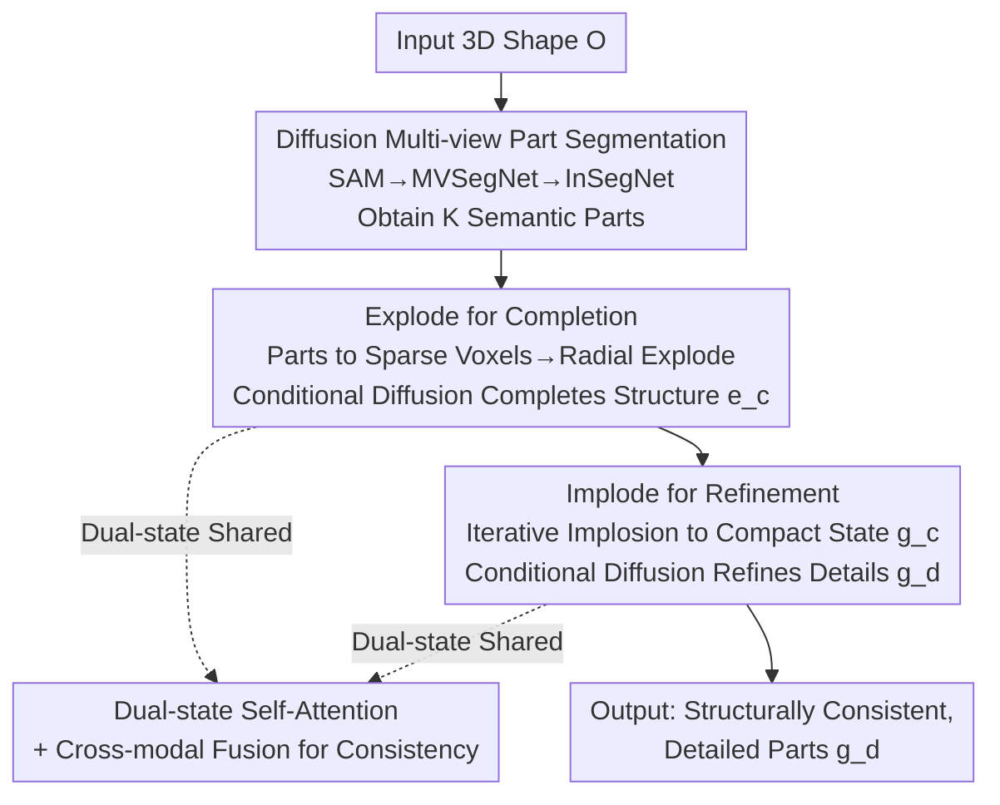

# EI-Part: Explode for Completion and Implode for Refinement

**Conference**: CVPR 2026  
**Paper**: [CVF Open Access](https://openaccess.thecvf.com/content/CVPR2026/html/Sun_EI-PartExplode_for_Completion_and_Implode_for_Refinement_CVPR_2026_paper.html)  
**Code**: None open-source (Project page: https://cvhadessun.github.io/EI-Part/)  
**Area**: 3D Vision  
**Keywords**: Part-level 3D Generation, Explode-Implode Strategy, Sparse Voxels, Structured Diffusion, Structural Consistency  

## TL;DR
EI-Part proposes an "Explode-Implode" part-level 3D generation framework: incomplete segmented parts are **exploded** into a dispersed state to make room for structural completion, then **imploded** back to a compact state to dedicate full resolution to detail refinement. Self-attention is used in both states to maintain structural consistency among parts, ultimately outperforming SOTA models like HoloPart, X-Part, and OmniPart across Voxel IoU, CD, and F-Score.

## Background & Motivation
**Background**: Open-world 3D generation (CLAY, TripoSG, HunYuan3D, TRELLIS, etc.) can now generate high-fidelity global geometry directly from images or text. However, most output **monolithic meshes**—lacking part-level decomposition, which makes downstream editing, rigging, and animation difficult. Consequently, "part-level generation" has become a critical branch: decomposing a 3D shape into several parts that are **structurally coherent, geometrically plausible, detailed, and efficiently generated**.

**Limitations of Prior Work**: The authors categorize failures of existing part generation methods into four criteria:

- **Poor Structural Consistency**: HoloPart treats each part as an independent set of latents and generates them separately, ignoring inter-part relationships; completion looks like "simple hole-filling," and assembly lacks coordination.
- **Geometric Implausibility**: OmniPart uses adaptive voxel resolution, but allocating voxels in the **merged state** causes voxel overlap between parts (creating ambiguity during completion) and limits completion to active voxels within bounding boxes, preventing expansion.
- **Inaccurate Details**: BANG stuffs all parts into a single latent set, and PartPacker uses dual latent sets; the representation capacity for individual parts is compressed, leading to insufficient geometric detail.
- **Low Efficiency**: PartCrafter and X-Part use cross-attention to enhance consistency but rely on **fixed-length** part tokens—large parts lack expressive power while small parts waste capacity, resulting in inefficient resource allocation.

**Key Challenge**: The spatial resolution requirements for part completion (needing "space" to grow plausible structures) and detail refinement (needing "high resolution" to depict surfaces) are in conflict. Satisfying both in the **same merged or fixed layout** leads to either restricted completion (within boxes, overlapping) or diluted details.

**Goal**: To provide sufficient space for completion expansion and enough resolution for refinement within the same framework while maintaining inter-part consistency and efficiency.

**Key Insight**: Since the two stages have different spatial requirements, the **spatial layout of parts should switch according to the stage**—exploding parts to occupy space during completion and imploding them back during refinement.

**Core Idea**: A dual-state sparse voxel diffusion using **Explode for completion and Implode for refinement**. The same set of voxels is reused across stages, but by changing the spatial arrangement of parts, resolution is "used where it matters most."

## Method

### Overall Architecture
Inputting a 3D shape $O$, the output is a set of **independent, structurally consistent, geometrically plausible, and finely detailed** parts $g_d$. The pipeline consists of three sequential stages: ① **Diffusion-based part segmentation** first partitions $O$ into $K$ semantic parts $\{p^k_s\}$; ② **Explode-based completion** converts these incomplete parts into sparse voxels, explodes them radially, and performs conditional diffusion completion in the dispersed state to obtain coarse but complete structures $e_c$; ③ **Implode-based refinement** implodes the completed voxels back to a compact state $g_c$ for a second conditional diffusion to depict fine-grained geometry, outputting $g_d$. Both diffusions occur in a structured latent space and use self-attention to allow parts to "see" each other for consistency.

### Key Designs

**1. Diffusion-based Multi-view Part Segmentation: Clear Boundaries via 2D Texturing Logic**

Direct 3D segmentation (e.g., PartField, P3-SAM) is limited by 3D resolution, often resulting in blurry boundaries; pure 2D-to-3D projection fails in occluded regions. The authors adopt a two-stage 3D texturing approach: first rendering **normal maps** $\{n_i\}_{i=1}^6$ and **Canonical Coordinate Maps (CCM)** $\{c_i\}_{i=1}^6$ from six orthogonal views. SAM provides front-view segmentation $s_1$, which are fed into the multi-view segmentation diffusion model **MVSegNet** to generate consistent six-view segmentations. These are back-projected to 3D and passed to **InSegNet** to learn a **continuous 3D semantic field**, querying semantic colors $\hat S(x)=\text{InSegNet}(x, f_{2D}, f_{3D})$ for each surface point $x$, supervised by L1 loss $L_{seg}=\frac{1}{n}\sum_i |\hat S(x_i)-S(x_i)|$. This inherits the generalization and sharp boundaries of 2D foundation models while filling occluded areas via the semantic field, providing $K$ globally consistent, seamless parts $\{p^k_s\}$.

**2. Explode for Completion: Creating Space for Unambiguous Completion**

Part segmentation provides only **incomplete** shapes. OmniPart's lesson was that allocating voxels in a merged state causes overlap and restricts growth to bounding boxes. The authors reverse this: $\{p^k_s\}$ are converted to explicit sparse voxels $\{v^k_s\}$ (large parts get more voxels, small parts fewer, achieving size-adaptive allocation more efficiently than fixed-length tokens). Following the BANG "explode" logic, **explosion vector optimization** is performed: axis-aligned bounding boxes are calculated for each part, and a translation vector is optimized to push voxels radially from a converged state to a dispersed state $e_s=\text{Explode}(\{v^k_s\})$. The **translation direction $\{u_k\}$ and distance $\{d_k\}$** for each part are recorded. Post-explosion, there is no voxel overlap ambiguity, and completion can extend beyond original boxes, gaining higher usable resolution. Completion is modeled as conditional structured diffusion $p_\theta(e_c \mid e_s, n_1)$: conditioned on the front normal map $n_1$ and exploded voxels $e_s$, using rectified-flow + DiT trained with Conditional Flow Matching:

$$\mathcal{L}_{CFM}(\theta)=\mathbb{E}_{x_0,t,\epsilon}\,\lVert v_\theta(x,t)-(\epsilon-x_0)\rVert_2^2 .$$

Normal maps are encoded via DINOv2 into 2D tokens $D_n$, and incomplete parts via SS-VAE into voxel condition features $E_s$, generating structured latents $E_c$ for complete parts, decoded into coarse complete voxels $e_c$.

**3. Implode for Refinement: Focusing Resolution on Details**

The completion stage sacrifices detail for structural plausibility. The completed exploded voxels are then **imploded** back to a compact state, re-focusing limited resolution on surface details. Implosion is not a simple reversal via $m'_k = m_k - d_k\cdot u_k$, but an **iterative center-approach**: parts are sorted by distance to the center and moved incrementally by step $\alpha$ in the opposite direction:

$$m^{j+1}_k = m^j_k - \alpha\cdot u_k,$$

stopping if a collision occurs. This squeezes parts as tightly as possible without intersection, resulting in compact complete voxels $g_c$. Refinement is also a conditional diffusion $p_\theta(g_d \mid g_c, e_c, n_1)$, conditioning on imploded voxels $g_c$, exploded complete voxels $e_c$, and normal tokens $D_n$, trained with CFM loss. A key difference is the use of a **stronger Sparc3D VAE** (Sparse Deformable Marching Cubes representation) to extract features and decode final geometry $g_d$, producing ultimate parts with fine details.

**4. Dual-state Shared Self-Attention + Multi-modal Fusion: Maintaining Structural Consistency**

Processing parts independently loses inter-part relationships. The authors insert **self-attention in both exploded and imploded states**, allowing part latents to perceive each other before cross-modal fusion with normal conditions. The completion stage uses:

$$F_E = \text{CrossAttn}\big(D_n,\ \text{SelfAttn}(\text{Concat}(E_s, Z_t))\big),$$

And the refinement stage uses:

$$F_I = \text{CrossAttn}\big(D_n,\ \text{SelfAttn}(\text{Concat}(G_c, E_c, Z_t))\big),$$

where $Z_t$ is the latent noise at step $t$. Self-attention performs internal information perception on concatenated multi-part tokens (the source of structural consistency), while cross-attention injects geometric priors from normal maps (the source of fidelity). This mechanism serves as the "glue" across both stages.

### Loss & Training
- **Segmentation**: MVSegNet and InSegNet use Adam, learning rate $3\times10^{-4}$, trained for 4 days on 32 GPUs; InSegNet uses L1 semantic field loss $L_{seg}$.
- **Explode Completion Model**: Adam, learning rate $1\times10^{-4}$, gradient clipping max-norm 1.0, trained for 2 weeks on 64 GPUs; zero-conditioning probability of 0.3 used for robustness.
- **Implode Refinement Model**: Fine-tuned on Sparc3D checkpoints, Adam, learning rate $1\times10^{-4}$, trained for 6 days on 64 GPUs.
- Both diffusions utilize Conditional Flow Matching under rectified-flow (Eq. 3).

## Key Experimental Results

Data sourced from Objaverse / Objaverse-XL / ABO / 3D-FUTURE / HSSD, filtered for parts $\leq 20$, and processed via mesh sub-grid splitting and merging to construct final GLBs. Evaluation on PartVerse benchmark using 100k sampled points for CD / IoU / F-Score calculations.

### Main Results
Quantitative comparison of part generation:

| Method | Voxel IoU↑ | CD↓ | Voxel F@0.01↑ | F@0.1↑ | F@0.05↑ | F@0.01↑ |
|------|-----------|------|---------------|--------|---------|---------|
| PartPacker | 0.2586 | 0.1273 | 0.3768 | 0.8199 | 0.6428 | 0.2435 |
| PartCrafter | 0.0742 | 0.3474 | 0.1316 | 0.4429 | 0.2801 | 0.0749 |
| HoloPart | 0.6106 | 0.0431 | 0.7374 | 0.9557 | 0.9402 | 0.6400 |
| X-Part | 0.7478 | 0.0599 | 0.8413 | 0.9256 | 0.9087 | 0.7923 |
| OmniPart | 0.2861 | 0.1431 | 0.4007 | 0.7911 | 0.6516 | 0.2644 |
| **EI-Part (Ours)** | **0.7981** | **0.0194** | **0.8452** | **0.9910** | **0.9742** | **0.8129** |

Ours achieves the best performance across **all 6 metrics**. Most notably, CD is reduced to 0.0194 (less than half of HoloPart's 0.0431), and the strict F-Score@0.01 reaches 0.8129. While X-Part is competitive in Voxel IoU, its significantly worse CD confirms the limitations of fixed-length tokens in precision.

### Ablation Study

| Configuration | Observation | Explanation |
|------|------|------|
| Full EI-Part | Plausible structure + fine details | Both explode completion and implode refinement present |
| w/o Explode | Implausible part geometry | Lacks spatial expansion for completion; restricted growth |
| w/o Implode | Lacks fine-grained details | No resolution refocusing; surfaces remain blurry |
| Segmentation: Replaced with PartField / P3-SAM | Lower accuracy, blurry boundaries | MVSegNet+InSegNet provides more accurate, meaningful segments |

### Key Findings
- **Explode and Implode are Indispensable**: Removing Explode leads to geometric implausibility (no space to complete); removing Implode leads to lack of detail (resolution not focused).
- **Segmentation is the Upstream Bottleneck**: Even with shared segmentation, EI-Part outperforms baselines, but the proprietary segmentation method is a prerequisite for end-to-end quality.
- **Sparse Voxels + Adaptive Allocation** is more efficient than fixed tokens: prevents the "large parts insufficient, small parts wasteful" imbalance seen in X-Part.

## Highlights & Insights
- **Spatial Layout Switching as Resource Scheduling**: Treating resolution as a scarce resource—exploding for completion and imploding for refinement—is a clever scheduling perspective. This "dual-state reuse" can be generalized to other generation tasks with conflicting structural vs. detail demands.
- **Iterative Implosion**: Recording $\{u_k\}, \{d_k\}$ makes implosion traceable, and the iterative "move until collision" approach maximizes resolution utilization for details—a practical design choice.
- **Unified Consistency via Self-Attention**: Unlike HoloPart (independent) or X-Part (fixed tokens), self-attention on variable-length concatenated tokens balances consistency with size flexibility.

## Limitations & Future Work
- **High Training Cost**: Multi-stage training requires 32/64/64 GPUs for 4/14/6 days respectively; high barrier for reproduction.
- **Dependency on Upstream Segmentation**: Success relies on correct segmentation; part count is hard-capped at $\leq 20$.
- **Lack of Physical Constraints**: Generation is primarily geometry-driven; future work needs to incorporate physical principles for complex functional assemblies.

## Related Work & Insights
- **vs HoloPart**: HoloPart generates parts independently, leading to inconsistency. EI-Part uses shared self-attention for mutual perception.
- **vs X-Part / PartCrafter**: They use fixed-length tokens, which are inefficient for varying part sizes. EI-Part uses sparse voxels with adaptive allocation, leading to better CD/F-Scores.
- **vs OmniPart**: OmniPart allocates voxels in a merged state, causing overlap and restricting completion to bounding boxes. EI-Part explodes parts to eliminate overlap and expand completion space.

## Rating
- Novelty: ⭐⭐⭐⭐⭐ The "Explode-Implode" resource scheduling perspective is novel and directly addresses the spatial conflict between completion and refinement.
- Experimental Thoroughness: ⭐⭐⭐⭐ Comprehensively leads across 6 metrics with fair comparisons, though core ablations are primarily qualitative in the main text.
- Writing Quality: ⭐⭐⭐⭐⭐ Pain points are clearly mapped to baselines; motivations and mechanisms are well-explained.
- Value: ⭐⭐⭐⭐ High performance on critical part-level generation tasks, though high training costs and closed source code limit immediate accessibility.

<!-- RELATED:START -->

## Related Papers

- [\[CVPR 2026\] Depth Hypothesis Guided Iterative Refinement for Event-Image Monocular Depth Estimation](depth_hypothesis_guided_iterative_refinement_for_event-image_monocular_depth_est.md)
- [\[CVPR 2026\] Dehallu3D: Hallucination-Mitigated 3D Generation from a Single Image via Cyclic View Consistency Refinement](dehallu3d_hallucination-mitigated_3d_generation_from_a_single_image_via_cyclic_v.md)
- [\[CVPR 2026\] Learning Hierarchical Hyperbolic Mixture Model for Part-aware 3D Generation](learning_hierarchical_hyperbolic_mixture_model_for_part-aware_3d_generation.md)
- [\[CVPR 2026\] Learning Spatial-Temporal Consistency for 3D Semantic Scene Completion](learning_spatial-temporal_consistency_for_3d_semantic_scene_completion.md)
- [\[CVPR 2026\] LaS-Comp: Zero-shot 3D Completion with Latent-Spatial Consistency](las-comp_zero-shot_3d_completion_with_latent-spatial_consistency.md)

<!-- RELATED:END -->
