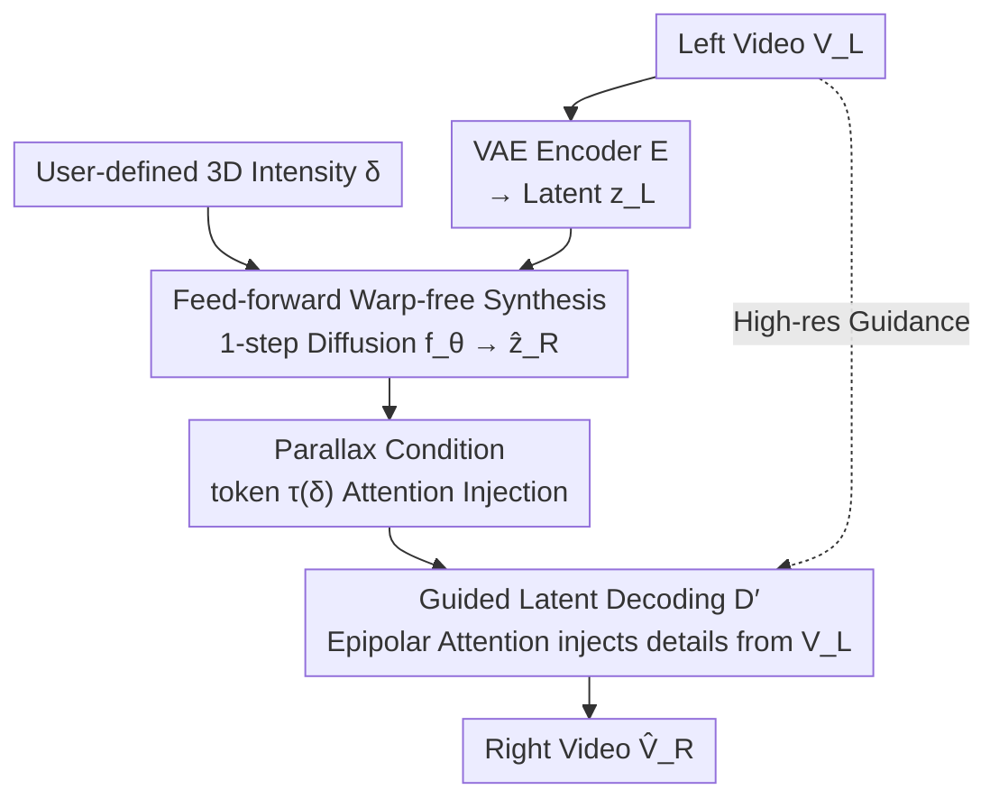

# Elastic3D: Controllable Stereo Video Conversion with Guided Latent Decoding

**Conference**: CVPR 2026  
**Paper**: [CVF Open Access](https://openaccess.thecvf.com/content/CVPR2026/html/Metzger_Elastic3D_Controllable_Stereo_Video_Conversion_with_Guided_Latent_Decoding_CVPR_2026_paper.html)  
**Code**: Project Page https://elastic3d.github.io (Code not explicitly open-sourced)  
**Area**: 3D Vision / Video Generation / Diffusion Models  
**Keywords**: Monocular-to-stereo, stereo video conversion, guided latent decoding, parallax controllable, epipolar attention  

## TL;DR
Elastic3D utilizes a 1-step conditional latent diffusion model to **directly** synthesize the right-eye video from a monocular input (without depth estimation or warping). It allows users to continuously adjust 3D intensity via a scalar "parallax factor" and employs a "guided VAE decoder" with epipolar attention to inject high-frequency details from the left view into the right view, eliminating binocular rivalry artifacts. It outperforms warp-based and warp-free baselines across three real-world stereo video datasets.

## Background & Motivation
**Background**: While VR/AR content demand is surging, the vast majority of existing videos are monocular, making "monocular-to-stereo (mono-to-stereo)" a critical requirement. The mainstream paradigm is **warp-and-refine** (depth-then-reprojection): first, a monocular depth estimator calculates the scene depth; then, the left view is reprojected to the right-eye perspective based on this depth; finally, holes are inpainted.

**Limitations of Prior Work**: This pipeline is fragile in three ways. First, the overall quality is **bottlenecked by the intermediate monocular depth estimator**—depth estimation often fails on thin structures or non-Lambertian surfaces, meaning the upper bound of geometric correctness is limited by the depth model. Second, warping inevitably produces holes and artifacts in **occlusion zones** (areas visible in the right view but hidden in the left). Third, many methods operate within the VAE compressed latent space (LDM), where the **generic decoder acts as an information bottleneck**, failing to reconstruct details from the source view. This leads to mismatches between what the left and right eyes see, causing dizzying **binocular rivalry** artifacts.

**Key Challenge**: The recent Eye2Eye bypasses depth estimation by directly generating the second view, but it sacrifices two critical capabilities: it has **no mechanism to control 3D intensity** (it is locked to a fixed implicit baseline during training), whereas warp-based methods can natively adjust 3D effects by scaling the depth map. Furthermore, it relies on two-stage pixel-space multi-step diffusion refinement, making it **too slow for practical use**. Thus, the combination of "warp-free simplicity + warp-based controllability + detail preservation" has remained elusive.

**Goal**: To obtain (a) continuously adjustable 3D intensity, (b) preservation of high-frequency details without binocular rivalry, and (c) high speed, all within a warp-free, feed-forward model.

**Key Insight**: The authors first decompose "what makes a good stereo model" into 5 properties in §3 (geometric correctness, controllable 3D effect, stereo fidelity/detail preservation, plausible disocclusion, and temporal stability). They find that previous methods each lack one or two of these. Since the benefits of warping are primarily "adjustability" and "pixel retrieval from the source," the authors compensate for these in a direct generation framework using two lightweight mechanisms: a **scalar parallax condition** and a **guided decoder**.

**Core Idea**: Replace "depth estimation + geometric warping" with "scalar parallax conditioning + epipolar guided decoding" to directly synthesize controllable, sharp right-eye videos in a 1-step latent diffusion process.

## Method

### Overall Architecture
The input is a left-eye video $V_L \in \mathbb{R}^{N\times H\times W\times 3}$, and the output is a right-eye video $\hat V_R$ from a horizontally shifted perspective of the same scene. The pipeline is built upon Stable Video Diffusion but modifies the multi-step denoising into a **1-step feed-forward** process consisting of three stages: (1) A frozen VAE encoder $E$ compresses $V_L$ into latent code $z_L$; (2) A synthesis network $f_\theta$ **directly** generates the right-view latent $\hat z_R$ within 1 step, while taking a parallax condition token $\tau(\delta)$ representing 3D intensity; (3) A **guided decoder** $D'$ reconstructs the right view using $\hat z_R$ along with the original high-resolution left video $V_L$, injecting high-frequency details from the left view along epipolar lines. The overall process is formulated as:

$$\hat V_R = D'\big(f_\theta(0,\, z_L,\, \tau(\delta)),\, V_L\big),\qquad z_L = E(V_L)$$

where $0$ is a zero vector replacing the noise input (1-step, no iterative sampling required). Note that $V_L$ is "reused" at the decoding stage—this is the key to bypassing the latent bottleneck.

### Key Designs

**1. Feed-forward warp-free synthesis: Replacing "depth + warp" with 1-step direct generation**

To address the root cause of being "bottlenecked by monocular depth estimators and occlusion holes," this paper avoids depth estimation and warping entirely. Based on Stable Video Diffusion and utilizing 1-step denoising (treating the latent denoiser as a feed-forward network), $f_\theta$ directly synthesizes the **entire** right-video latent $\hat z_R = f_\theta(0, z_L, \tau(\delta))$ from the left-video latent $z_L$, rather than refining a pre-warped video. This approach offers two collateral benefits: first, without an intermediate depth model, geometric correctness is no longer capped by it—the model **implicitly learns a depth estimator oriented toward generation** (experimentally, its disparity error is actually the lowest); second, 1-step feed-forward allows training with **image-space losses** (L1/SSIM/LPIPS backpropagated through a frozen VAE decoder), further improving quality compared to pure latent-space losses. The trade-off is that directly synthesizing the right view under different stereo settings is inherently harder than "just inpainting," which is why the following two mechanisms are necessary.

**2. Parallax conditioning mechanism: A scalar knob for continuous 3D intensity control**

Warp-free methods primarily lack "adjustable 3D effects" because they lack a scalable depth map. This paper introduces a scalar parallax proxy $\delta\in\mathbb{R}$ to directly control the amount of pixel disparity between the input view and the generated right view. This is projected into a token embedding $\tau(\delta)$ and injected into the model's spatial attention layers. During training, $\delta$ is set to the **median of the first-frame left-to-right ground truth disparity map**:

$$\delta = P_{50}\big(D^{0}_{L\to R}\big)$$

The median is chosen for its robustness to outliers while intuitively characterizing the overall stereo intensity of the video sequence (the authors also found mean/max to be viable). The elegance of this design lies in its **sole dependence on "left-right disparity" without needing camera calibration parameters**—allowing training on uncalibrated "in-the-wild" rectified video pairs $(V_L, V_R)$. To ensure generalization to unseen baseline ranges, the authors perform **disparity data augmentation**: for each sample, the GT disparity map is scaled by a random factor $s$, a "pseudo-right-view GT" is generated via simple forward warping, and $\tau(s\cdot\delta)$ is used as the condition. Real samples use the full composite loss, while synthetic samples use L1 masked for invalid pixels. during inference, users can simply dial $\delta$ in pixels (as shown in Fig. 3, larger $\delta$ means stronger 3D effect).

**3. Guided latent decoding: Injecting high-frequency details from the left view via epipolar attention**

This is the core for eliminating binocular rivalry. The VAE information bottleneck (SVD compression ratio is as high as 1:48) is the primary cause of rivalry—standard SVD decoders **fail to decode even GT latents perfectly**, losing or hallucinating micro-details. This paper reformulates decoding as a **guided latent upsampling** task: the decoder $D'$ receives both the synthesized latent $\hat z_R$ and the original left video $V_L$. An extraction network $G$, initialized from the VAE encoder, processes $V_L$ into a multi-scale guidance feature pyramid $\{g_1,\dots,g_N\}$ frame-by-frame, serving as an "information reservoir." In each upsampling block $i$ of the decoder, each feature vector $h_i(p)$ (query) **only performs cross-attention over keys/values on the corresponding epipolar line in the guidance map $g_i$**. Since the views are rectified, the epipolar line simplifies to the same horizontal row, and attention becomes a 1D intra-row correspondence search. Refined features are injected via **residuals**:

$$h'_i(p) = h_i(p) + A_{\text{epipolar}}\big(h_i(p),\, g_i\big)$$

The epipolar constraint is not only geometrically sound but also reduces cross-attention complexity from $O(H^2W^2)$ to $O(HW^2)$. On $512\times512$ top-level feature maps, the memory requirement for 16-bit attention matrices drops from an impossible 128 GB to 256 MB. Technically, $D'$ is initialized with weights from standard decoder $D$, $G$ from encoder $E$, and the attention output projection is **zero-initialized** (initially defaulting to the original decoder behavior before learning). The decoder is **trained separately**, decoupled from the geometric synthesis core $f_\theta$, making it plug-and-play—it can be applied to third-party frameworks (like M2SVid) without retraining to improve performance.

### Loss & Training
- **Synthesis Network $f_\theta$**: A composite loss for 1-step diffusion, combining L2 latent loss + pixel-space L1 + SSIM + LPIPS (the latter three backpropagated through the frozen VAE decoder). Real pairs use the full composite loss; augmented synthetic pairs use masked L1.
- **Guided Decoder $D'$**: Trained as an independent module. The goal is to reconstruct the ground truth right view $V_R$ from $z_R=E(V_R)$ guided by $V_L$, using L1 + LPIPS losses.
- **Training Data**: Stereo4D (internet videos, fixed 63mm baseline) + Ego4D (first-person, large parallax), $512\times512, N=16$. FoundationStereo is used to estimate disparity for calculating $\delta$.

## Key Experimental Results

### Main Results
Comparison with SOTA on Apple Vision Pro (AVP, baseline near training distribution but with OOD content):

| Method | PSNR↑ | SSIM↑ | LPIPS↓ | EMatch↓ | P-PSNR↑ | Disp.err↓ | Temp.err↓ |
|------|-------|-------|--------|---------|---------|-----------|-----------|
| SVG | 19.3 | 0.690 | 0.410 | 56.3 | 20.2 | 3.71 | 8.49 |
| StereoCrafter | 22.5 | 0.826 | 0.323 | 51.8 | 22.6 | 2.30 | 1.71 |
| M2SVid | 24.4 | 0.821 | 0.221 | 41.5 | 27.3 | 2.30 | 1.35 |
| Eye2Eye | 20.6 | 0.733 | 0.392 | 39.2 | 23.9 | 3.82 | 2.18 |
| **Elastic3D** | **25.9** | **0.894** | **0.196** | **30.9** | **28.4** | **1.74** | 1.31 |

On the Stereo4D test set, Elastic3D also ranked first across all categories. Its PSNR of 26.1 is +1.5 dB higher than the second-best, M2SVid. On OOD iPhone data (baseline only 19.2mm, both calibration and content are OOD), it achieved the best SSIM/LPIPS and the second-best PSNR.

### Ablation Study

| Configuration | Key Metrics | Note |
|------|---------|------|
| Elastic3D w/o Parallax Condition (iPhone) | PSNR 18.7 / SSIM 0.703 | Predicts fixed ≈63mm baseline, severely misaligned with 19.3mm |
| **+ Parallax Condition (iPhone)** | **PSNR 22.5 / SSIM 0.890** | **+3.8 dB**, capable of generating arbitrary 3D intensity |
| Warp-based (DepthCrafter, AVP) | PSNR 24.5 / Disp.err 2.33 | Geometry capped by monocular depth model |
| **Elastic3D Direct Generation (AVP)** | **PSNR 25.9 / Disp.err 1.74** | **+1.4 dB**, significantly lower disparity error |
| Elastic3D w/o Guided Decoder $D'$ | EMatch 41.9 / LPIPS 0.212 | Severe binocular rivalry, blurry details |
| **Elastic3D (with $D'$)** | **EMatch 27.8 / LPIPS 0.176** | Matchability error **−44%**, LPIPS −16%, PSNR +0.9 dB |
| M2SVid + $D'$ (Plug-and-play) | EMatch 39.6→24.8 / LPIPS −15% | decoder swap yields gains without retraining |

Guided decoder standalone evaluation (decoding GT right-view latents, Stereo4D): Compared to the Stable Diffusion decoder, PSNR improved from 30.2 to **34.3** (+4.1 dB), and LPIPS dropped from 0.106 to **0.068** (−35%).

### Key Findings
- **Parallax conditioning yields the highest gains on OOD baselines**: The model is trained at ≈63mm baseline. On 19.3mm iPhone data, the unconditional model suffers severe spatial misalignment (PSNR 18.7) because its output is locked to 63mm. Adding the condition provides a +3.8 dB boost—controllability is a necessary requirement for cross-device deployment, not just an auxiliary feature. Importantly, the condition does not degrade geometric precision (Disp.err only evaluates relative depth ordering).
- **Guided decoding directly combats "binocular rivalry"**: Removing it causes EMatch to spike from 27.8 to 41.9. Reintroducing it brings a −44% reduction. Furthermore, this module is **plug-and-play** and can be ported to other frameworks (reducing EMatch by −34% and LPIPS by −15% on M2SVid), proving that "detail preservation" and "geometric synthesis" can indeed be decoupled.
- **Direct generation implicitly learns better geometry**: Warp-based geometry is capped by the performance of off-the-shelf monocular depth models. Elastic3D's direct generation achieves the lowest Disp.err (1.74 vs 2.33 on AVP), confirming that "end-to-end geometry learning for generation tasks" is superior to "projection after depth estimation."

## Highlights & Insights
- **Decomposing warping advantages into two lightweight mechanisms**: Warping is beneficial for "3D adjustability" and "source pixel retrieval." This paper precisely replicates these two points using a scalar parallax token and epipolar guided decoding, while discarding all holes, artifacts, and depth dependencies of warping. This "retain the benefit, discard the implementation" approach is highly instructive.
- **Epipolar attention as a geometric prior and engineering accelerator**: Restricting cross-attention to epipolar lines (simplified to 1D horizontal rows after rectification) is geometrically principled and slashes complexity from $O(H^2W^2)$ to $O(HW^2)$. Dropping memory usage from 128 GB to 256 MB is a prime example of "correct physical constraints yielding engineering efficiency."
- **Decoupled decoder and synthesis core → Plug-and-play**: Separating "low-level texture reconstruction" from "geometric synthesis" during training turns the guided decoder into a portable component. It can enhance other methods without retraining, offering high reusable value.
- **Median disparity as a condition eliminates calibration dependency**: The choice of $\delta=P_{50}$ allows the model to be trained on massive uncalibrated "in-the-wild" stereo videos, which is a key step for data scalability.

## Limitations & Future Work
- **Direct generation still struggles when deviating significantly from training baselines**: On iPhone data (19.2mm), PSNR only ranks second (behind M2SVid). The authors admit that directly synthesizing the right view for extreme stereo settings is inherently harder than the "inpainting-only" approach of warp-based methods.
- ⚠️ **Reliance on GT/pseudo-GT disparity to determine $\delta$**: Training uses FoundationStereo for disparity estimation, and evaluation provides the method with "median disparity" as global 3D information. In real-world deployment, users must manually provide $\delta$; automatically inferring an "appropriate" $\delta$ from monocular content remains an open question.
- **Temporal stability is not a peak strength**: Temp.err is close to the best but not superior in all tables (e.g., 1.31 vs 1.71/1.35 for StereoCrafter/M2SVid on AVP). Temporal jitter in long videos still has room for improvement.
- The authors treat the "standardized black-box evaluation protocol (4-dimensional metrics) for stereo conversion pipelines" as a separate contribution, which may have longer-term value than the method itself.

## Related Work & Insights
- **vs Warp-based (M2SVid / StereoCrafter / SVG)**: These follow the "depth-then-warp-then-refine" path, where geometry is capped by monocular depth models, occlusions have artifacts, and VAE compression leads to rivalry. Elastic3D uses direct latent synthesis + guided decoding, resulting in consistently lower Disp.err and EMatch.
- **vs Eye2Eye**: Also uses warp-free direct generation, but Eye2Eye is locked to a fixed implicit baseline (no 3D control) and is slow due to two-stage pixel-space multi-step diffusion. Elastic3D adds a scalar parallax condition (controllable) and 1-step feed-forward (fast), achieving a PSNR of 25.9 vs 20.6 on AVP.
- **vs Guided Super-resolution/Texture Bridge/Epipolar Transformer**: Re-injecting source information is a common technique in guided SR, pansharpening, and multi-view generation. The difference here is **embedding lightweight epipolar attention directly into the VAE decoder**, creating structured skip-connections that bypass the bottleneck and "look up" details along geometrically sound epipolar lines.

## Rating
- Novelty: ⭐⭐⭐⭐ Combining "scalar parallax conditioning + epipolar guided decoding" into 1-step latent diffusion is a clean approach where each mechanism addresses a specific pain point.
- Experimental Thoroughness: ⭐⭐⭐⭐⭐ Three datasets + 5 SOTA baselines + a 4-dimensional self-established protocol + component ablation. The guided decoder is validated both standalone and as a plug-and-play module.
- Writing Quality: ⭐⭐⭐⭐⭐ Establishes the "5 properties of a good stereo model" first and checks motivatons against them, making the logical chain very robust.
- Value: ⭐⭐⭐⭐ High practical value for stereo video conversion. The guided decoder can be migrated to other frameworks, and the evaluation protocol has lasting value.

<!-- RELATED:START -->

## Related Papers

- [\[CVPR 2026\] DepthFocus: Controllable Depth Estimation for See-Through Scenes](depthfocus_controllable_depth_estimation_for_see-through_scenes.md)
- [\[CVPR 2026\] LaS-Comp: Zero-shot 3D Completion with Latent-Spatial Consistency](las-comp_zero-shot_3d_completion_with_latent-spatial_consistency.md)
- [\[CVPR 2026\] 240FPS Stereo Vision from Monocular Mixed Spikes](240fps_stereo_vision_from_monocular_mixed_spikes.md)
- [\[CVPR 2026\] EcoSplat: Efficiency-controllable Feed-forward 3D Gaussian Splatting from Multi-view Images](ecosplat_efficiency-controllable_feed-forward_3d_gaussian_splatting_from_multi-v.md)
- [\[CVPR 2026\] MajutsuCity: Language-driven Aesthetic-adaptive City Generation with Controllable 3D Assets and Layouts](majutsucity_language-driven_aesthetic-adaptive_city_generation_with_controllable.md)

<!-- RELATED:END -->
