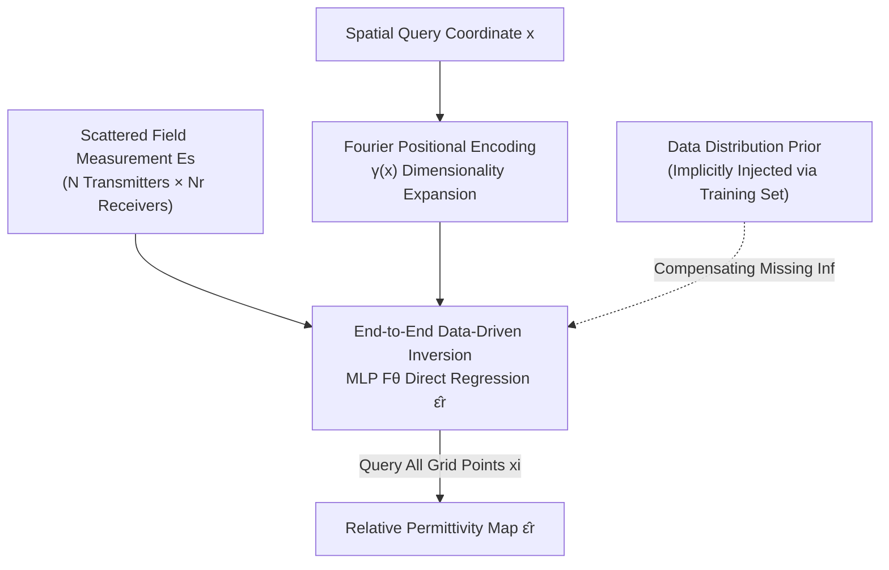

# Electromagnetic Inverse Scattering from a Single Transmitter

**Conference**: CVPR 2026  
**Paper**: [CVF Open Access](https://openaccess.thecvf.com/content/CVPR2026/html/Cheng_Electromagnetic_Inverse_Scattering_from_a_Single_Transmitter_CVPR_2026_paper.html)  
**Code**: https://gomenei.github.io/SingleTX-EISP/  
**Area**: Computational Imaging / Electromagnetic Inverse Scattering  
**Keywords**: Electromagnetic inverse scattering, Relative permittivity reconstruction, Data-driven inversion, Single transmitter, Implicit neural representation  

## TL;DR
This paper reformulates the Electromagnetic Inverse Scattering Problem (EISP) from "per-sample physical optimization" to "end-to-end data-driven regression." By using an MLP to directly map received scattered fields and spatial coordinates to local relative permittivity, the method leverages data distribution priors learned from the training set to compensate for the information deficiency in sparse measurements. It achieves high-quality reconstruction using only a **single transmitter** for the first time, with inference speeds over 70,000 times faster than previous SOTA methods.

## Background & Motivation
**Background**: As electromagnetic waves can penetrate object surfaces, EISP is core to non-invasive imaging. Given the incident field from a transmitter and the scattered field measured by receivers, the goal is to infer the internal relative permittivity $\epsilon_r$, serving as a low-cost alternative to X-ray or MRI. Traditional approaches are divided into two categories: non-iterative methods (Born approximation, Rytov approximation, BP back-propagation), which sacrifice quality for speed through linear approximations; and iterative methods (2-fold SOM, Gs SOM), which offer high quality but are slow and non-generalizable. Recent machine learning methods (PGAN, Physics-Net) mostly follow a two-stage process: "BP for initial value + image translation network for refinement." The latest Img-Interiors embeds scattering mechanisms into the network for per-sample optimization.

**Limitations of Prior Work**: To obtain stable inversion solutions, traditional workflows require a **large number of transmitters and receivers** to collect sufficient data, which increases equipment costs and operation time, limiting practical application. When the number of transmitters is reduced significantly (to only one in extreme cases), existing methods collapse: BP cannot even reconstruct basic outlines; two-stage methods like Physics-Net strictly depend on BP initialization and cannot correct its errors (as they are not end-to-end), resulting in "hallucinated" shapes based on unreliable inputs. Even if Img-Interiors converges, the reconstructed scatterer may deviate significantly from the ground truth.

**Key Challenge**: Sparse transmitters $\rightarrow$ drastic reduction in measurement data $\rightarrow$ **severe physical information deficiency**. The inverse problem is inherently ill-posed (number of receivers $N_r \ll M^2$ grid points). When data is insufficient, direct mathematical solving is impossible. Simply relying on physical mechanisms is inherently fragile. The authors highlight this via the failure of Img-Interiors: its reconstructed scatterer produces a forward-simulated scattered field that matches the measured field perfectly, yet the scatterer itself is completely wrong—a manifestation of "multi-solution ambiguity" in inverse problems.

**Core Idea**: Since physical information is naturally insufficient under a single transmitter, **use data distribution priors to compensate for the missing information**. Specifically, abandon the "crutch" of BP and train a completely end-to-end MLP to learn the non-linear mapping from "scattered field $\rightarrow$ permittivity." This allows the model to implicitly absorb data statistical regularities across numerous scenarios to resolve ill-posedness.

## Method

### Overall Architecture
The approach is minimalist yet effective: the core is an MLP acting as an "inverse solver." Given the scattered field $E_s$ measured by all transmitters/receivers and a spatial query coordinate $x$, the MLP directly outputs the predicted relative permittivity at that coordinate $\hat\epsilon_r(x)$. By querying all points on the grid, the entire permittivity map is constructed. The pipeline involves no BP initialization, no per-sample optimization, and no iteration; it is a single forward inference pass.

The forward physical process (the basis for the inversion model design) is as follows. A transmitter emits an incident field $E_i$ to excite an induced current $J$. Using the Method of Moments (MoM), the total field can be written as:

$$E_t = E_i + G_d \cdot J$$

where $G_d$ is the discrete free-space Green’s function matrix ($M^2 \times M^2$ constant), and the induced current satisfies $J = \text{Diag}(\xi)\cdot E_t$, with $\xi = \epsilon_r - 1$ (contrast). $J$ then acts as a secondary source to radiate the scattered field $E_s = G_s \cdot J$, where $G_s$ is the $N_r \times M^2$ Green’s function matrix. Since $N_r \ll M^2$, inferring $J$ (and thus $\epsilon_r$) from $E_s$ is naturally ill-posed. This paper's inversion model uses a neural network to bypass this analytical inversion chain.

### Key Designs

**1. End-to-End Data-Driven Inversion: Abandoning BP for Direct Regression**

Addressing the pain point where two-stage methods fail completely if BP fails, this work removes traditional numerical methods from the loop. Instead, the entire inversion is learned as a differentiable non-linear regression function:

$$\hat\epsilon_r(x_i) = F_\theta(E_s, \gamma(x_i)), \quad x_i \in \mathbb{R}^2$$

$F_\theta$ is an MLP with trainable parameters. The input is the scattered field vector $E_s$ plus the encoded query coordinate, and the output is the permittivity at that point. The full image is obtained by sampling all grid points $\hat\epsilon_r = \{F_\theta(E_s, \gamma(x_i))\}_{i=1}^{M^2}$. The key benefit is **end-to-end error correction**: the model does not rely on external initial values, and all errors can be corrected via gradients guided by supervision signals, fundamentally breaking the BP bottleneck under sparse transmitters.

**2. Data Distribution Prior for Missing Information Compensation**

This is the central insight. Under a single transmitter, the inverse problem is mathematically unsolvable due to insufficient physical information. Rather than using an explicit generative prior (like a denoiser modeling $p(x)$), the MLP **implicitly absorbs data statistical regularities** during training on diverse scattering scenarios. When a scattered field corresponds to multiple possible scatterers (ambiguity), the learned distribution pulls the solution toward "shapes that actually exist in the training set," thereby resolving multi-solution ambiguity. In other words, missing physics is filled by "prior knowledge of what real scatterers look like." This explains why Img-Interiors fails—it only fits the scattered field for a single sample without shape priors, falling into a local optimum with a matching field but nonsensical shape.

**3. Point-wise Query + Fourier Positional Encoding: Enhancing Details with Implicit Representation**

Permittivity maps require clear boundaries and high-frequency details, but raw coordinates are low-frequency inputs. This work adopts NeRF-style positional encoding to map spatial coordinates into a high-dimensional Fourier feature space:

$$\gamma(x) = [\sin(x), \cos(x), \dots, \sin(2^{\Omega-1}x), \cos(2^{\Omega-1}x)]$$

The hyperparameter $\Omega$ controls the spectral bandwidth. This implicit representation allows the single MLP to sample at arbitrary resolutions while preserving sharp structures. The input scattered field is also unified: for a single transmitter, $E_s$ is a real vector of length $2N_r$ (real and imaginary parts of complex measurements); for multiple transmitters, complex measurements from $N$ transmitters are concatenated into a $2N\cdot N_r$ dimensional vector. This architecture seamlessly supports any number of transmitters and can be extended to 3D.

### Loss & Training
The training objective is simple, using only an MSE loss to supervise permittivity reconstruction accuracy:

$$L = \|\hat\epsilon_r - \epsilon_r\|^2$$

By minimizing the mean squared error between predicted and ground truth permittivity, the model learns to infer material properties directly from scattered fields. This single loss ensures stable and efficient training without needing adversarial losses or multi-stage scheduling.

## Key Experimental Results

### Main Results
Testing was conducted on MNIST and Circular-cylinder synthetic datasets (with 5% / 30% noise) and the real-world Institut Fresnel (IF) dataset. Comparison with 7 baselines used MSE↓, SSIM↑, and PSNR↑. The table below highlights $N=16$ (multiple transmitters) and $N=1$ (single transmitter):

| Configuration | Dataset (Noise) | Metric | Img-Interiors | PGAN | Ours |
|------|------|------|------|------|------|
| N=16 | MNIST (5%) | MSE↓ / PSNR↑ | 0.200 / 26.41 | 0.084 / 25.80 | **0.039 / 32.11** |
| N=16 | Circular (5%) | MSE↓ / PSNR↑ | 0.036 / 35.05 | 0.026 / 35.56 | **0.020 / 36.92** |
| N=1 | MNIST (5%) | MSE↓ / PSNR↑ | 0.305 / 16.06 | 0.133 / 21.69 | **0.085 / 26.09** |
| N=1 | MNIST (30%) | MSE↓ / PSNR↑ | 0.467 / 12.47 | 0.153 / 20.41 | **0.127 / 22.56** |
| N=1 | Circular (5%) | MSE↓ / PSNR↑ | 0.096 / 26.19 | 0.033 / 32.02 | **0.031 / 33.18** |

Under multiple transmitters, the proposed method is optimal or on par with SOTA. Under a single transmitter, the gap widens—all previous methods fail on MNIST (30%) with only one transmitter (Img-Interiors MSE reaches 0.467), while Ours maintains 0.127 / 22.56. In terms of efficiency, forward inference takes ~0.01s/case, achieving over **70,000x acceleration** compared to Img-Interiors' per-sample optimization.

### Ablation Study

| Configuration | MSE↓ | SSIM↑ | PSNR↑ | Description |
|------|------|------|------|------|
| Noise 5% | 0.039 | 0.978 | 32.11 | Multi-TX MNIST Baseline |
| Noise 20% | 0.043 | 0.974 | 31.34 | Gentle degradation |
| Noise 30% | 0.050 | 0.966 | 29.91 | Structural preservation under strong noise |
| Data 100% | 0.039 / 0.050 | — | — | 5% / 30% noise |
| Data 50% | 0.048 / 0.068 | — | — | Half data, mild drop at low noise |
| Data 25% | 0.064 / 0.101 | — | — | Significant penalty under high noise |

### Key Findings
- **Noise robustness is graceful**: As noise increases from 5% to 30%, MSE only rises from 0.039 to 0.050; most baselines develop severe artifacts or fail entirely.
- **Data prior is the performance driver**: Reducing training data to 25% doubles the MSE for high-noise scenarios (0.050 $\rightarrow$ 0.101), confirming that resolving ill-posedness relies on robust priors learned from sufficient data.
- **Seamless 3D Extension**: The architecture adapts to 3D by changing input dimensions. In 3D MNIST (Single TX), it achieves MSE 0.120 / IoU 0.769, far exceeding Img-Interiors (0.372 / 0.094).

## Highlights & Insights
- **Diagnosing "Ill-posedness" as "Information Deficiency"**: Instead of inventing complex physical regularizers, the authors prove that "field matching $\neq$ shape accuracy" and address the root cause with data priors.
- **Minimalist approach beats complex baselines**: A simple MLP + Positional Encoding + MSE outperformed all previous methods in the difficult single-transmitter setting. This shows that in ill-posed inversion, "end-to-end correction + data prior" is more fundamental than "embedded physics + per-sample optimization."
- **Transferable Implicit Representation**: Moving point-wise regression from NeRF/SDF to EM parameter fields suggests a general paradigm for any "measurement $\rightarrow$ continuous field" inversion.

## Limitations & Future Work
- **Reliance on Data Distribution**: Performance stems from data priors. If a test shape deviates significantly from the training distribution, generalization suffers.
- **No Explicit Forward Model**: The method is a black-box regression and does not utilize differentiable physical structures during inference. Adding forward consistency as supervision might stabilize results for out-of-distribution samples.
- **Synthetic Noise Models**: Evaluation primarily uses synthetic noise (5%–30%). Performance under complex real-sensor noise needs further validation.

## Related Work & Insights
- **vs Img-Interiors**: Both use neural networks and implicit representations. However, Img-Interiors embeds physics and optimizes per sample (no data prior, prone to local optima, fails with single TX, very slow). Ours is end-to-end feedforward, cross-dataset trained, and leverages priors (robust with single TX, 70,000x faster).
- **vs Physics-Net / PGAN (Two-stage)**: These rely on BP for initialization. If BP fails, they cannot recover and tend to hallucinate. Ours avoids the BP bottleneck by regressing directly from the scattered field.
- **vs Traditional Methods (BP/SOM)**: Traditional methods are non-generalizable and slow. Under sparse data, they only provide blurred outlines, whereas Ours provides sharp and accurate reconstructions via a single forward pass.

## Rating
- Novelty: ⭐⭐⭐⭐ High. Redefines EISP ill-posedness as information deficiency and achieves the first high-quality single-TX reconstruction.
- Experimental Thoroughness: ⭐⭐⭐⭐ Comprehensive coverage of 2D/3D, synthetic/real data, and varied noise levels.
- Writing Quality: ⭐⭐⭐⭐⭐ The "Revisiting EISP" section provides extremely clear motivation.
- Value: ⭐⭐⭐⭐ High. Reducing hardware requirements to a single transmitter has significant practical implications for low-cost imaging.

<!-- RELATED:START -->

## Related Papers

- [\[CVPR 2026\] MVInverse: Feed-forward Multiview Inverse Rendering in Seconds](mvinverse_feed-forward_multiview_inverse_rendering_in_seconds.md)
- [\[ICLR 2026\] SSD-GS: Scattering and Shadow Decomposition for Relightable 3D Gaussian Splatting](../../ICLR2026/3d_vision/ssd-gs_scattering_and_shadow_decomposition_for_relightable_3d_gaussian_splatting.md)
- [\[CVPR 2026\] SGS-Intrinsic: Semantic-Invariant Gaussian Splatting for Sparse-View Indoor Inverse Rendering](sgs-intrinsic_semantic-invariant_gaussian_splatting_for_sparse-view_indoor_invers.md)
- [\[CVPR 2026\] IR-HGP: Physically-Aware Gaussian Inverse Rendering for High-Illumination Scenes via Generative Priors](ir-hgp_physically-aware_gaussian_inverse_rendering_for_high-illumination_scenes_.md)
- [\[ICLR 2026\] RadioGS: Radiometrically Consistent Gaussian Surfels for Inverse Rendering](../../ICLR2026/3d_vision/radiogs_radiometric_gaussian_surfels.md)

<!-- RELATED:END -->
