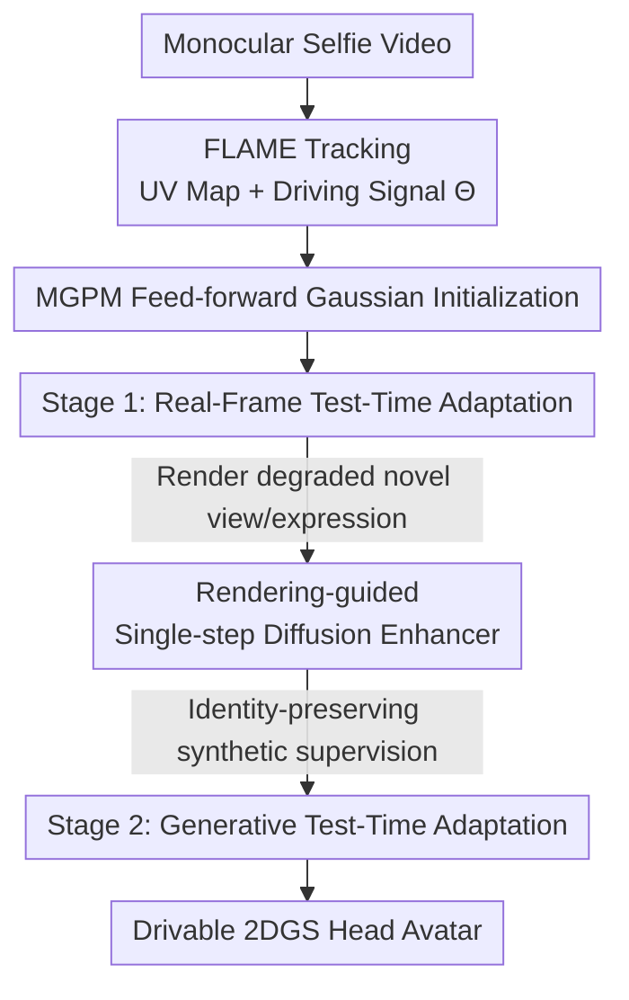

# ELITE: Efficient Gaussian Head Avatar from a Monocular Video via Learned Initialization and Test-time Generative Adaptation

**Conference**: CVPR 2026  
**Paper**: [CVF Open Access](https://openaccess.thecvf.com/content/CVPR2026/html/Youwang_ELITE_Efficient_Gaussian_Head_Avatar_from_a_Monocular_Video_via_CVPR_2026_paper.html)  
**Code**: [Project Page](https://kim-youwang.github.io/elite)  
**Area**: 3D Vision  
**Keywords**: Gaussian head avatar, monocular video reconstruction, 3D data prior, test-time adaptation, single-step diffusion enhancement  

## TL;DR
ELITE synthesizes drivable, photorealistic 2D Gaussian head avatars from casual monocular videos. The core contribution is coupling "feed-forward 3D data prior initialization" with "rendering-guided single-step diffusion enhancement" to make the two types of priors complementary—the former provides fast, identity-preserving initialization, while the latter completes unobserved views and expressions. Ultimately, it outperforms existing methods in image quality and identity preservation while being 60 times faster than 2D generative prior-based methods.

## Background & Motivation
**Background**: Photorealistic human head avatars are foundational components for VR/AR telepresence and virtual filmmaking. Traditional high-fidelity reconstruction relies on calibrated multi-view capture systems and time-consuming per-person optimization, which poses high barriers for general users. Consequently, the research community has shifted towards more accessible capture modalities, such as casual monocular selfie videos. However, monocular videos inherently lack multi-view and multi-expression observations, making strong priors necessary for compensation.

**Limitations of Prior Work**: Currently, there are two separated technical paradigms to compensate for "missing observations," each with its own significant drawbacks:
1. **3D Data Priors** (e.g., HeadGAP, SynShot, Cao et al.): These methods train a generalizable prior model on multi-view capture datasets and perform test-time adaptation from the prior initialization. However, the scale of multi-view capture datasets is difficult to expand, and the test-time observations are limited, leading to poor generalization in-the-wild (e.g., long hair, rare expressions). Moreover, these methods generally do not model the torso and shoulders, and are closed-source.
2. **2D Generative Priors** (e.g., GAF, CAP4D): These methods use diffusion models to generate unseen view/expression face images as auxiliary supervision. Although generalization is improved, diffusion models starting from pure noise require multi-step sampling and are slow (CAP4D takes 18 seconds per image, and over 6 hours per subject) while suffering from severe "identity hallucination"—the generated faces do not look like the target subject.

**Key Challenge**: 3D data priors are "fast but generalize poorly," while 2D generative priors "generalize well but are slow and lose identity." These two paradigms have historically developed as independent lines of research.

**Key Insight**: The authors observe that these two paradigms are complementary:
1. The poor generalization of 3D data priors can be compensated for by synthetic images from generative models.
2. The slow speed and identity hallucination of 2D generative priors can be mitigated by using 3D avatar renders as "grounding." Instead of generating from pure noise, the process starts and enhances a degraded render that already has a rough appearance and geometry.

**Core Idea**: To systematically couple the two types of priors—using a feed-forward 3D data prior for fast, identity-preserving initialization, and then utilizing a "rendering-conditioned single-step diffusion enhancer" to complete missing details, and feeding the enhanced synthetic images back for a second stage of test-time adaptation.

## Method

### Overall Architecture
ELITE takes a casual monocular video as input and outputs a 2D Gaussian Splatting (2DGS) head avatar drivable by arbitrary FLAME driving signals. The entire pipeline is a sequential process: "Prior Initialization → Real Frame Adaptation → Generative Enhancement → Generative Adaptation". First, offline FLAME tracking is applied to the video to obtain mesh UV maps and frame-by-frame driving signals. The feed-forward prior model MGPM generates the initial 2DGS avatar in a single inference step. Real frames from the video are used to fine-tune the avatar (Stage 1) to align it with the target person. Next, the avatar is rendered from unseen views/expressions (generating degraded renders), which are then "cleaned up" into identity-preserving supervision images using the single-step diffusion enhancer. Finally, these synthetic images are fine-tuned together with the real frames in a second round (Stage 2) to help the avatar generalize to unobserved poses, expressions, and views.

### Key Designs

**1. MGPM Feed-forward Gaussian Initialization: Mapping mesh to drivable Gaussian avatar in a single forward pass**

The root cause of slowness in 3D data prior approaches is that every new identity must be optimized from scratch. ELITE's countermeasure is the Mesh2Gaussian Prior Model (MGPM)—a feed-forward U-Net. It takes the concatenated canonical FLAME UV texture and geometry maps $[\mathbf{M}_\text{tex}, \mathbf{M}_\text{geo}] \in \mathbb{R}^{H\times W\times(3+3)}$ as input, injects the FLAME driving signal $\Theta=[\psi_\text{expr}, \theta_\text{jaw}, \theta_\text{eyes}, \theta_\text{neck}, \theta_\text{glob}, t]$ (expression code, jaw/eye/neck joints, global head rotation, translation) via FiLM layers, and outputs a UV-aligned 2DGS parameter map $\mathbf{M}_{\text{gs}|\Theta}=\mathcal{F}_\phi([\mathbf{M}_\text{tex},\mathbf{M}_\text{geo}], \Theta) \in\mathbb{R}^{H\times W\times 13}$. Each UV coordinate $(u,v)$ stores the parameters of a 2D Gaussian: $[\delta x, c, q, s, o]\in\mathbb{R}^{3+3+4+2+1}$—representing position offset relative to the template mesh surface, color, rotation, scale, and opacity.

Training is conducted on the multi-view synchronous face dataset NerSemble V2 (approx. 400 identities with diverse expressions and views). The predicted 2DGS is differentiably rasterized to the image space using driving signals and camera parameters. The supervision loss contains an L1 photometric loss, an LPIPS perceptual loss, and 2DGS geometric regularization (depth distortion loss $\mathcal{L}_\text{depth}$, normal consistency loss $\mathcal{L}_\text{normal}$):

$$\mathcal{L}_\text{MGPM}=\mathcal{L}_{\ell 1}+\lambda_\text{lpips}\mathcal{L}_\text{LPIPS}+\lambda_\text{d}\mathcal{L}_\text{depth}+\lambda_\text{n}\mathcal{L}_\text{normal}$$

Consequently, MGPM learns identity/expression/view-conditional shape and appearance priors, enabling "single forward pass" initialization of a visually reasonable avatar for unseen identities during test-time—this high-quality initialization is the prerequisite for fast and stable subsequent test-time adaptation.

**2. Stage 1: Real-Frame Test-Time Adaptation—Fine-tuning the general prior into a person-specific prior**

Although the initial avatar from MGPM is reasonable, it lacks fine details and suffers from minor identity drift. The authors attribute this to the limited scale/diversity of the training set (only ~400 identities) and the domain gap between in-the-wild selfie videos and studio-captured training data. The approach in Stage 1 is straightforward: since MGPM can already output the initial avatar from mesh UV maps in a feed-forward manner, "test-time adaptation" essentially means fine-tuning the MGPM itself using observed video frames.

Given an input frame $I_\text{real}$, canonical mesh UV maps and frame-by-frame driving signals are obtained offline via FLAME tracking. The initial 2DGS avatar is obtained via a forward pass, rasterized, and backpropagated using the same reconstruction loss as training (Eq. 2) to adapt the general prior $\mathcal{F}_\phi$ to a person-specific prior $\mathcal{F}^*_\phi$. For efficiency, only $N_\text{real}=3$ frames are sampled, and the learning rate is set to $0.05\times$ of the MGPM training phase. This step primarily addresses "identity matching," aligning the avatar on views/expressions observed in the video.

**3. Rendering-guided Single-step Diffusion Enhancer: Using degraded renders as conditions to complete novel view details in 0.3s**

The avatar after Stage 1 performs well on observed views/expressions but degrades when rendering novel views/expressions. This is where the 2D generative prior should step in, but the authors want to avoid the slowness and hallucinations of CAP4D's "denoising from scratch." The key insight is: although the degraded avatar rendering is blurry, it already carries rich appearance and geometry, which is sufficient as a conditioning signal for the generative model, bypassing the need to generate from pure noise. The problem is thus reframed as "generative image enhancement."

The single-step diffusion enhancer $D_\xi$ simultaneously takes the degraded render $I_\text{gen}\leftarrow\mathcal{F}^*_\phi([\mathbf{M}_\text{tex},\mathbf{M}_\text{geo}], \Theta_\text{rand})$ (random view/expression render) and a clean input real frame reference $I_\text{real}$ to remove artifacts, complete details, and output a clean image $I^\star_\text{gen}=D_\xi([I_\text{gen}, I_\text{real}])$. It is fine-tuned on the single-step image-to-image diffusion model SD-Turbo (inspired by the static 3D scene enhancer DIFIX) using a custom dataset of triplets: degraded avatar renders, clean reference images, and clean ground-truth images. A crucial design choice is handling the heterogeneous views/expressions between the reference and rendered images—under monocular settings, clean reference frames are mostly frontal, while avatar renders span various poses and expressions. Results show that it is 60 times faster than full denoising methods (0.3s/image vs. 18s/image for CAP4D) and achieves significantly better identity preservation ($\text{CSIM}=0.9725$ vs. $0.5037$ for CAP4D).

**4. Stage 2: Generative Test-Time Adaptation—Feeding synthetic images back for a second round of fine-tuning**

Just having the enhanced images is not enough; they must be utilized to improve the avatar. Stage 2 incorporates $N_\text{gen}$ enhanced synthetic images $\{I^\star_\text{gen}\}$ into the test-time adaptation dataset, fine-tuning the prior model again $\mathcal{F}^*_\phi\rightarrow\mathcal{F}^\star_\phi$ using $N_\text{real}+N_\text{gen}$ images. Since the synthetic images are conditionally generated under sampled views and driving signals, the images, camera parameters, and driving signals are naturally and precisely aligned, allowing direct feed-forward, rasterization, and reconstruction loss calculation as in Stage 1. This step focuses on "generalization," enabling the avatar to maintain high fidelity under unseen poses, expressions, and views. The final person-specific prior $\mathcal{F}^\star_\phi$ can animate the target subject's 2DGS avatar under any arbitrary FLAME driving signal in a feed-forward manner.

### Loss & Training
- **MGPM Pre-training**: $\mathcal{L}_\text{MGPM}=\mathcal{L}_{\ell 1}+\lambda_\text{lpips}\mathcal{L}_\text{LPIPS}+\lambda_\text{d}\mathcal{L}_\text{depth}+\lambda_\text{n}\mathcal{L}_\text{normal}$, trained on all identities in NerSemble V2.
- **Test-time Adaptation (Stage 1 / Stage 2)**: Reuses the same reconstruction loss (Eq. 2). Stage 1 uses $N_\text{real}=3$ real frames with a learning rate of $0.05\times$ that of the training phase; Stage 2 continues fine-tuning by adding $N_\text{gen}$ enhanced synthetic images.
- **Single-step Enhancer**: Fine-tuned on SD-Turbo using "degraded render / clean reference / clean ground-truth" triplets (more details are provided in the supplementary material).

## Key Experimental Results

The experiments train MGPM on NerSemble V2 and evaluate and compare on in-the-wild monocular videos from the INSTA dataset. The evaluation protocol follows SynShot: only 3 frames are used to supervise the avatar adaptation, excluding the final 600 test frames; self re-enactment is quantitatively evaluated using the driving signals of these 600 frames, and cross re-enactment uses driving signals from other sequences.

### Main Results: INSTA Self Re-enactment Comparison

| Method | Type | Time | PSNR ↑ | SSIM ↑ | LPIPS ↓ | CSIM ↑ |
|------|------|------|--------|--------|---------|--------|
| FlashAvatar | Overfitting | 10 min | 20.875 | 0.8338 | 0.1420 | 0.5823 |
| SplattingAvatar | Overfitting | 15 min | 24.838 | **0.8831** | 0.0893 | 0.6406 |
| CAP4D | 2D Generative Prior | 400 min | 19.478 | 0.8675 | 0.0992 | 0.7064 |
| **ELITE (Ours)** | Dual-prior Coupling | 20 min | **25.220** | 0.8771 | **0.0732** | **0.7396** |

ELITE leads comprehensively in PSNR, LPIPS, and CSIM, with SSIM only slightly lower than SplattingAvatar. Notably, ELITE achieves the highest identity-preservation metric CSIM (0.7396), which is crucial for avatar personalization. Since most videos in INSTA are talking head videos with small head pose changes, overfitting methods perform decently in metrics, but they break down under unseen views/expressions (see qualitative figures); while CAP4D produces high image quality, it requires over 6 hours per person, making it impractical. ELITE strikes a good balance between speed (~20 minutes, close to overfitting methods) and fidelity.

**Identity Preservation Comparison of Generated Images**

| Method | Generation Time per Image | Generated Image CSIM ↑ |
|------|------|--------|
| CAP4D (Full Denoising) | 18 s | 0.5037 |
| **ELITE (Single-step Enhancement)** | **0.3 s** | **0.9725** |

CAP4D generates from pure noise, which severely hallucinates identity and is slow; ELITE's single-step enhancement anchored on avatar renders achieves high identity consistency and fast personalization, speeding up the process by 60×.

### Ablation Study

| Configuration | Key Variable | Conclusion |
|------|---------|------|
| MGPM Training Identities | 334 IDs (broadest) | More training identities yield better image quality and generalization before and after adaptation. |
| Number of Supervision Frames $N_\text{real}$ | More frames | Fidelity improves but synthesis slows down (trade-off). |
| Cumulative Modules | MGPM → Stage 1 → Stage 2 | MGPM provides strong initialization; Stage 1 improves identity alignment; Stage 2 yields high-fidelity details and generalization. |

### Key Findings
- **Each of the three modules plays a distinct role**: MGPM handles "fast and reasonable initialization," Stage 1 (real frames) handles "identity matching," and Stage 2 (synthetic images) handles "generalization to unobserved views/expressions." Removing any components leads to degradation in the corresponding dimension.
- **Speed advantage stems from "grounding" rather than "computation-skipping"**: The essence of ELITE's 60× speedup is replacing the "full denoising from pure noise" diffusion process with a "single-step enhancement conditioned on degraded renders." This yields fast generation without drifting from the target identity due to the rendering anchors.
- **Data scale dictates the upper bound of priors**: The quality of MGPM monotonically improves as the number of training identities increases to 334, confirming that the bottleneck of 3D data priors is indeed the scale of captured data—which is precisely the motivation for introducing 2D generative priors as a complement.

## Highlights & Insights
- **Systematic coupling of "two complementary priors"**: Previously, 3D data priors and 2D generative priors operated independently. ELITE, for the first time, weaves them into a closed loop—3D priors provide a grounded, identity-preserving rendering for the generative model, while the generative model reciprocates by providing supervision for in-the-wild generalization, mutually compensating for each other’s shortcomings.
- **Reframing "generation" as "enhancement"**: Instead of starting from pure noise, the model conditions on degraded avatar renders containing rough appearance/geometry, requiring only single-step diffusion. This shift in perspective simultaneously resolves both the slowness and identity hallucination problems, offering a general methodology transferable to other "3D rendering + 2D generative supervision" tasks.
- **Test-time adaptation = Fine-tuning the prior model itself**: Customizing an avatar for a subject is unified as "fine-tuning MGPM with real/synthetic images" using the same reconstruction loss, making the codebase clean; the high-quality initialization ensures fast and stable fine-tuning.

## Limitations & Future Work
- **Limitations acknowledged by the authors**: Vulnerable to extreme illumination conditions; future work could integrate illumination priors or material/texture modeling. It currently does not jointly model avatars with accessories (e.g., glasses), representing a promising direction for extension.
- **Self-identified limitations**: MGPM training relies on studio-captured multi-view data (NerSemble V2 only has ~400 identities), which imposes a hard constraint on the upper bound of generalization. Although feeding back synthetic images for supervision is effective, the quality of generation directly determines the upper bound of Stage 2; whether the enhancer preserves identity under extreme views/expressions warrants more systematic stress testing.
- **Potential modifications**: Making the number of real frames $N_\text{real}$ and synthetic images $N_\text{gen}$ adaptive (dynamically deciding how many views to supplement based on observation coverage), or introducing confidence weighting for synthetic images in Stage 2 to prevent low-quality synthetic images from corrupting the prior.

## Related Work & Insights
- **vs Overfitting methods (FlashAvatar / SplattingAvatar)**: These methods optimize 3D primitives anchored to dynamic template meshes from scratch, supervised only by video frames. Every new identity requires separate optimization, lacking identity-relevant initialization, and failing to generalize to complex views/unseen expressions. ELITE utilizes a learned prior initialization + synthetic image supervision, yielding superior generalization and completeness (including the torso).
- **vs 3D data prior methods (HeadGAP / SynShot / Cao et al.)**: These methods feature learned initialization but are supervised only by video frames, generalizing poorly in out-of-distribution in-the-wild scenarios (e.g., long hair, rare expressions). Furthermore, they fail to model the torso and are closed-source. ELITE supplements supervision with a 2D generative prior, alleviating the generalization bottleneck.
- **vs 2D generative prior methods (GAF / CAP4D)**: These optimize the avatar from scratch and use multi-step diffusion to generate supervision images from pure noise, which is slow (CAP4D takes >6 hours per subject) and suffers from severe identity hallucination. ELITE combines learned initialization + rendering-conditioned single-step enhancement, speeding up generation by 60× and improving CSIM from $0.5037$ to $0.9725$.

## Rating
- Novelty: ⭐⭐⭐⭐⭐ Systematically coupling two historically isolated types of priors into a complementary closed loop, and reframing "generation" as "rendering-conditioned single-step enhancement," which is an elegant and novel perspective.
- Experimental Thoroughness: ⭐⭐⭐⭐ Main comparisons, identity-preservation evaluation, and three sets of ablation studies are comprehensive. However, certain competitors (such as SynShot) can only be compared qualitatively due to being closed-source; in-the-wild evaluation sets (like INSTA) exhibit relatively small pose variations.
- Writing Quality: ⭐⭐⭐⭐⭐ The motivation derivation is clear (the complementary logical chain of the priors is highly coherent), with excellent diagrams and stage-by-stage descriptions.
- Value: ⭐⭐⭐⭐⭐ Finding a practical sweet spot between fidelity and speed (20-minute level, 60× faster), which is of direct significance for bringing monocular drivable avatars to practical applications.

<!-- RELATED:START -->

## Related Papers

- [\[CVPR 2026\] OMG-Avatar: One-shot Multi-LOD Gaussian Head Avatar](omg-avatar_one-shot_multi-lod_gaussian_head_avatar.md)
- [\[NeurIPS 2025\] PointMAC: Meta-Learned Adaptation for Robust Test-Time Point Cloud Completion](../../NeurIPS2025/3d_vision/pointmac_meta-learned_adaptation_for_robust_test-time_point_cloud_completion.md)
- [\[CVPR 2026\] Anatomical Domain Shifts: Test-time Heterogeneous Adaptation for 3D Human Pose Prediction](anatomical_domain_shifts_test-time_heterogeneous_adaptation_for_3d_human_pose_pr.md)
- [\[CVPR 2026\] Feed-forward Gaussian Registration for Head Avatar Creation and Editing](feed-forward_gaussian_registration_for_head_avatar_creation_and_editing.md)
- [\[CVPR 2026\] ZipMap: Linear-Time Stateful 3D Reconstruction via Test-Time Training](zipmap_linear-time_stateful_3d_reconstruction_via_test-time_training.md)

<!-- RELATED:END -->
