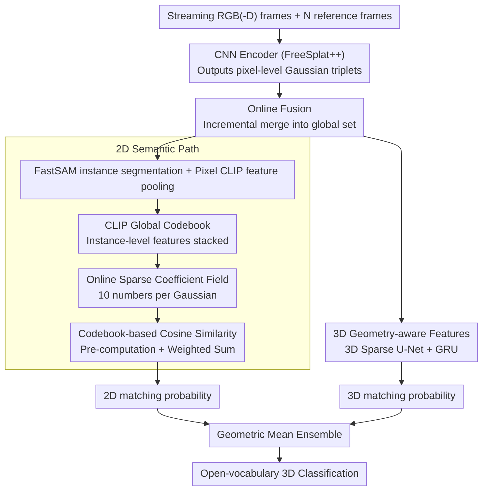

# EmbodiedSplat: Online Feed-Forward Semantic 3DGS for Open-Vocabulary 3D Scene Understanding

**Conference**: CVPR 2026  
**arXiv**: [2603.04254](https://arxiv.org/abs/2603.04254)  
**Code**: Available (Project page EmbodiedSplat.io)  
**Area**: 3D Vision  
**Keywords**: 3D Gaussian Splatting, Open-vocabulary scene understanding, Online reconstruction, Feed-forward 3DGS, Semantic embedding

## TL;DR

EmbodiedSplat is proposed as the first online feed-forward semantic 3DGS framework. It achieves memory-efficient per-Gaussian semantic representation through a sparse coefficient field and a CLIP global codebook. Combined with 3D geometry-aware features, it enables full-scene open-vocabulary 3D understanding at 5-6 FPS under streaming inputs of 300+ frames.

## Background & Motivation

### 1. Background

Embodied AI tasks, such as robot manipulation and navigation, require agents to understand 3D scenes in real-time during exploration. 3D Gaussian Splatting (3DGS) has become a mainstream solution for 3D scene representation due to its explicit structure and real-time rendering capabilities. Recently, numerous works have distilled semantic knowledge from 2D foundation models like CLIP into 3DGS to achieve open-vocabulary 3D scene understanding.

### 2. Limitations of Prior Work

Existing semantic 3DGS methods face two fundamental limitations:

- **Per-scene optimization**: Methods such as LangSplat, LEGaussians, OpenGaussian, and Dr. Splat require individual optimization for each scene for several hours (2-6 hours), failing to generalize to new environments.
- **Offline setting**: They require a pre-collected complete set of images and cannot handle streaming inputs, making them unsuitable for online exploration.
- While some online methods (e.g., Online-LangSplat) support streaming input, they still rely on heavy per-scene SLAM optimization, achieving only 1.12 FPS.
- Feed-forward methods (e.g., LSM, SIU3R) are generalizable but only support 2-3 view inputs, which is insufficient for full-scene reconstruction.

### 3. Key Challenge

Embodied scenarios impose five simultaneous requirements on 3D perception models: **online**, **real-time**, **high generalizability**, **full-scene understanding**, and **open-vocabulary understanding**. Existing methods satisfy at most 2-3 of these. Specifically, binding complete CLIP features to each Gaussian (often >1 million) leads to massive memory overhead, while existing compression methods (autoencoders, PQ quantization) require pre-training and result in information loss.

### 4. Goal

The goal is to design an online feed-forward semantic 3DGS framework capable of reconstructing a full-scene open-vocabulary semantic 3D Gaussian field from 300+ streaming images at near real-time speeds, while maintaining memory efficiency and the full semantic power of CLIP.

### 5. Key Insight

Instead of following the traditional "3D-rendering-to-2D" distillation route, the authors adopt a direct "2D-to-3D" lifting approach. Pixel-level CLIP features are back-projected directly into 3D space. A **sparse coefficient field and global codebook** replace per-Gaussian dense CLIP vector storage, complemented by a 3D U-Net to inject geometric priors.

### 6. Core Idea

Independent semantic entities in a scene are far fewer than the number of Gaussians. Therefore, instance-level CLIP features can be used to construct a global codebook. Each Gaussian only needs to store a few codebook indices and sparse weights to reconstruct the full semantics.

## Method

### Overall Architecture

EmbodiedSplat addresses a multi-objective challenge: as an agent explores a room, it must incrementally reconstruct 300+ RGB(-D) frames into a complete 3D Gaussian scene while assigning open-vocabulary semantics to each Gaussian—all in near real-time without exhausting memory. It is built upon the pre-trained feed-forward 3DGS model FreeSplat++, transforming its offline inference into a frame-by-frame online pipeline.

For each incoming frame, the system feeds it along with $N$ reference frames into a CNN encoder to produce pixel-level Gaussian triplets (position, confidence, latent variables). An online fusion strategy then merges these new Gaussians into the global set. The core innovation lies in binding two complementary CLIP features to each Gaussian: **2D semantic features**, compressed via a "global codebook + sparse coefficient field" to preserve original CLIP capabilities; and **3D geometry-aware features**, which encode spatial structures using a 3D sparse U-Net. During inference, text-matching probabilities are calculated for both sets of features and combined using a geometric mean for final classification.

### Key Designs

**1. CLIP Global Codebook: Replacing dense vectors with semantic basis functions**

To solve the memory bottleneck where millions of Gaussians with 512/768D CLIP vectors would require >2 GB, the authors observe that semantic entities (tables, chairs, walls) are sparse. They replace "one vector per Gaussian" with a "scene-wide codebook." For each frame, FastSAM segments instances, and pixel-level CLIP features are pooled to create instance-level features, which are appended to the global codebook. The number of codebook entries $K$ is much smaller than the number of Gaussians $M$ ($K \approx 8.7\text{K}$ vs $M \approx 3.2\text{M}$). This codebook uses raw CLIP features, requiring no pre-training and ensuring zero information loss.

**2. Online Sparse Coefficient Field: Storing 10 numbers per Gaussian**

Gaussians store only the indices and weights of relevant codebook entries. Each Gaussian maintains an index buffer and weight buffer of length $L$ (where $L=6$, providing $L-1=5$ active entries). Semantic features are reconstructed via sparse linear combination:

$$\mathbf{s}_g^T(i) = \sum_{j=1}^{L-1} \Omega_g^T(i,j) \cdot \mathbf{C}^T(\mathbf{I}_g^T(i,j))$$

where $\mathbf{I}_g^T$ are indices, $\Omega_g^T$ are weights, and $\mathbf{C}^T$ is the codebook at time $T$. The online update strategy (Algorithm 1) appends local indices to the global buffer and refreshes weights using confidence-weighted averaging, retaining only the top $L-1$ entries. This top-k truncation removes noise and fixes the buffer size. Memory usage drops from 2295 MB to 148 MB while supporting incremental updates.

**3. 3D Geometry-aware Features: Adding spatial priors to 2D features**

While 2D CLIP features are semantically rich, they lack 3D spatial context. A geometric path adds Gaussian latent variables to projected CLIP features, processed by a 3D sparse U-Net with a memory-based adapter to output 64D 3D features. Temporal information is aggregated via a GRU. This path encodes point cloud geometry, complementing the 2D path.

**4. Codebook-based Cosine Similarity: Accelerating matching via pre-computation**

Calculating cosine similarity between a text query and millions of Gaussians is $O(MD)$ (14.35 ms). By exploiting the linear nature of the sparse reconstruction, the inner product is decomposed: text-to-codebook similarity is pre-computed ($O(KD)$), and for each Gaussian, only $L-1$ weighted sums are performed to get the final score. This reduces complexity to $O(KD + M(L-1))$, accelerating the process by ~14x (to 1.18 ms) with identical results.

### Loss & Training

- **Loss**: Only utilizes a 2D-3D cosine similarity loss $\mathcal{L}_{cos} = 1 - \cos(\mathbf{s}_g^T, \mathcal{D}^{sem}(\hat{\mathbf{g}}_g^T))$, requiring no label supervision.
- **Training Strategy**: Two-stage training: (1) Warm-up: Single-view perception model for 100K iterations without the memory adapter. (2) Fine-tuning: Streaming multi-frame input (random 8-10 consecutive frames) with the memory adapter for 300K iterations.
- FreeSplat++ parameters are frozen; only the 3D U-Net and memory adapter are optimized.
- Inference ensemble: $\mathbf{P} = \max(\mathbf{P}^{2D}, \mathbf{P}^{3D})^\tau \cdot \min(\mathbf{P}^{2D}, \mathbf{P}^{3D})^{1-\tau}$.

## Key Experimental Results

### Main Results

**Table 1: 3D Semantic Segmentation Performance** (ScanNet / ScanNet200 / ScanNet++)

| Method | Type | ScanNet-10 mIoU | ScanNet-19 mIoU | ScanNet200-70 mIoU | ScanNet++ mIoU | Recon. Time | Setting |
|------|------|---------|---------|----------|---------|----------|------|
| LangSplat | 2D | 6.52 | 1.34 | 0.72 | 2.21 | ~6hr | Per-scene/Offline |
| Online-LangSplat | 2D | 7.13 | 3.45 | 2.45 | 4.51 | 5.4min | Per-scene/Online |
| OpenGaussian | 3D | 29.50 | 22.52 | 15.15 | 25.65 | ~2.5hr | Per-scene/Offline |
| Dr. Splat | 3D | 39.21 | 28.38 | 19.29 | 39.85 | ~2hr | Per-scene/Offline |
| Occam's LGS | 3D | 42.14 | 30.49 | 20.32 | 34.08 | ~2hr | Per-scene/Offline |
| **EmbodiedSplat (RGB)** | 3D | **49.81** | **46.22** | **31.16** | 41.93 | **8min** | Generalizable/Online |
| **EmbodiedSplat-fast** | 3D | 47.86 | 41.03 | 30.46 | 45.53 | **1min10s** | Generalizable/Online |
| EmbodiedSplat (RGB-D) | 3D | 57.41 | 52.12 | 34.75 | 44.03 | 8min | Generalizable/Online |

### Ablation Study

**2D-3D Feature Complementarity** (Tab. 3):
- 2D features only: ScanNet-19 mIoU 45.09
- 3D features only: ScanNet-19 mIoU 45.39
- 2D+3D Ensemble: ScanNet-19 mIoU **46.22** (+1.13 Gain)

**Memory Efficiency** (Tab. 5):
- Occam's LGS (Raw 512D): 2295 MB
- Dr. Splat (PQ Quantization): 173 MB (info loss, needs pre-training)
- **EmbodiedSplat (Sparse Coeffs)**: **148 MB** (no info loss, no pre-training)

### Key Findings

1. 2D-based methods perform poorly in direct 3D query evaluations because linear interpolation during rendering weakens the transfer of CLIP semantics to individual Gaussians.
2. The feed-forward design reduces reconstruction time from hours to minutes (8min vs 2-6hr), with the fast version reaching 1min 10s (5.18 FPS).
3. Sparse coefficient fields maintain accuracy while reducing memory by 15x.
4. Cross-domain experiments show that depth estimation is a critical bottleneck for RGB-only generalizable models.

## Highlights & Insights

1. **Elegant Sparse Coefficient Field**: Storing only 10 numbers per Gaussian is a highly efficient way to represent high-dimensional CLIP features without the degradation typical of autoencoder-based compression.
2. **Mathematically Sound Acceleration**: Using the linearity of inner products to move computation to the codebook level provides a significant speedup with no loss in precision.
3. **Robust Online Fusion**: The combination of confidence-weighted updates and top-k pruning effectively manages noise and memory growth in streaming scenarios.

## Limitations & Future Work

1. **Cross-domain generalization**: Performance drops significantly when moving from real to synthetic scenes (ScanNet → Replica).
2. **Depth sensor dependency**: RGB-only mode suffers when depth estimation fails in novel domains.
3. **Codebook growth**: The codebook grows over time; longer sequences might require periodic consolidation or removal of redundant entries.
4. **Indoor focus**: The evaluation is limited to indoor datasets; performance in large-scale outdoor environments remains untested.

## Related Work & Insights

- **FreeSplat++**: Provided the base for feed-forward 3DGS and online fusion mechanisms.
- **Dr. Splat / Occam's LGS**: Shared the 2D-to-3D feature lifting strategy but lacked generalization and online capabilities.
- **OpenScene / PLA**: Influenced the 3D backbone design for point cloud distillation.

## Rating

- Novelty: ⭐⭐⭐⭐ 
- Experimental Thoroughness: ⭐⭐⭐⭐⭐ 
- Writing Quality: ⭐⭐⭐⭐ 
- Value: ⭐⭐⭐⭐ 

<!-- RELATED:START -->

## Related Papers

- [\[CVPR 2026\] LightSplat: Fast and Memory-Efficient Open-Vocabulary 3D Scene Understanding in Five Seconds](lightsplat_fast_and_memory-efficient_open-vocabulary_3d_scene_understanding_in_f.md)
- [\[CVPR 2026\] JOPP-3D: Joint Open Vocabulary Semantic Segmentation on Point Clouds and Panoramas](jopp3d_joint_open_vocabulary_semantic_segmentation.md)
- [\[CVPR 2026\] AnchorSplat: Feed-Forward 3D Gaussian Splatting with 3D Geometric Priors](anchorsplat_feed-forward_3d_gaussian_splatting_with_3d_geometric_priors.md)
- [\[CVPR 2026\] From Rays to Projections: Better Inputs for Feed-Forward View Synthesis](from_rays_to_projections_better_inputs_for_feed-forward_view_synthesis.md)
- [\[CVPR 2026\] Feed-forward Gaussian Registration for Head Avatar Creation and Editing](feed-forward_gaussian_registration_for_head_avatar_creation_and_editing.md)

<!-- RELATED:END -->
