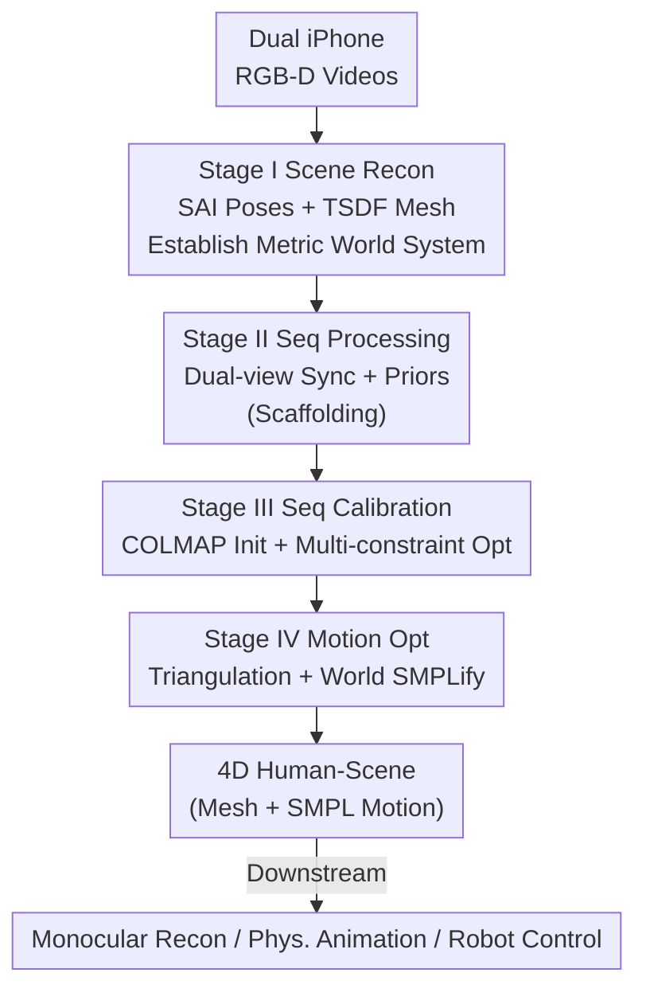

# EmbodMocap: In-the-Wild 4D Human-Scene Reconstruction for Embodied Agents

**Conference**: CVPR 2026  
**Paper**: [CVF Open Access](https://openaccess.thecvf.com/content/CVPR2026/html/Wang_EmbodMocap_In-the-Wild_4D_Human-Scene_Reconstruction_for_Embodied_Agents_CVPR_2026_paper.html)  
**Code**: None (Project page provided in paper)  
**Area**: 3D Vision  
**Keywords**: 4D human-scene reconstruction, motion capture, dual-view calibration, embodied AI, humanoid robots  

## TL;DR
EmbodMocap uses RGB-D videos from two handheld iPhones to jointly calibrate the scene, camera trajectories, and human motion into a single metric world coordinate system. This enables low-cost "in-the-wild" 4D human-scene capture, producing data that can simultaneously drive three types of embodied tasks: monocular human-scene reconstruction, physical character animation, and real-world humanoid robot control.

## Background & Motivation
**Background**: Training embodied AI requires "scene-aware" data that includes both human motion and surrounding 3D scene geometry to learn realistic human-scene interactions. Existing high-quality datasets (PROX, RICH, EgoBody, SLOPER4D, Nymeria, etc.) almost exclusively rely on multi-view camera arrays, wearable mocap suits, or LiDAR scanners.

**Limitations of Prior Work**: These solutions are either expensive (Nymeria equipment costs over \$60k, RICH over \$20k) or restricted to controlled studios, making large-scale collection in diverse indoor/outdoor environments impossible. Moreover, wearable devices alter the person's appearance in RGB images, and IMU/electromagnetic solutions require extensive manual alignment to sync motion with the scene. Direct extraction from web videos suffers from occlusion and depth ambiguity, failing to provide precise metric-scale motion and scene geometry.

**Key Challenge**: There is a sharp trade-off between the "accuracy" and "scalability/low-cost" of high-quality scene-aware data—accuracy is guaranteed by heavy equipment, which is naturally not scalable in the wild. Monocular methods are scalable but suffer from unresolvable scale/position ambiguity along the camera's optical axis (depth direction), made worse by joint self-occlusion.

**Goal**: To obtain "metric-accurate + scene-consistent" 4D humans and scenes using only consumer-grade devices in arbitrary environments, and to verify that this data is genuinely useful for downstream embodied tasks.

**Key Insight**: The authors observe that monocular depth ambiguity is essentially a "geometrically under-determined" problem. A second moving viewpoint can provide dense cross-view pixel correspondences, thereby pinning down the ambiguity along the depth direction for each view. Consequently, they use two moving iPhones instead of one.

**Core Idea**: Use dual-stream RGB-D joint calibration and optimization from two moving iPhones to reconstruct humans and scenes into a single metric, gravity-aligned world coordinate system—using a second viewpoint to replace the reliance on studios and wearable gear.

## Method

### Overall Architecture
The system input consists of multiple handheld iPhone RGB-D videos (with IMU), and the output is a static scene mesh and per-frame SMPL human motion in the same metric world system. The pipeline is divided into four **serial** stages to gradually unify the scene, dual camera trajectories, and human motion into a Z-up, real-scale world system:

- **Stage I Scene Reconstruction**: A single iPhone scans the static scene first. SpectacularAI (SAI) VIO is used to obtain metric-scale camera poses. PromptDA refines the LiDAR depth, and TSDF fusion via back-projection produces a dense scene mesh $M_g$. COLMAP is used on these keyframes to build a sparse structure database as "world anchors" for subsequent registration.
- **Stage II Sequence Processing**: Two iPhones synchronously capture dual-view RGB-D videos of the actor moving in the scene. Each view independently estimates per-frame camera poses using SAI, and extracts per-frame human priors using off-the-shelf perception models (YOLO for detection, ViTPose for 2D keypoints, SAM2 for segmentation, PromptDA for depth, and VIMO for camera-space SMPL). Frame-level synchronization is performed using a laser pointer. This stage is "preprocessing" and does not contain the core innovation.
- **Stage III Sequence Calibration**: With three coordinate systems (scene + two cameras), COLMAP registration provides a coarse initial rigid transformation, followed by multi-constraint optimization to precisely align the two camera trajectories to the scene's world system.
- **Stage IV Motion Optimization**: With cameras and the scene fixed, dual-view 2D keypoints are triangulated into 3D world-space keypoints. World-system SMPLify is then performed to refine human pose and translation.

### Key Designs

**1. Dual-View Metric World System: Eliminating Monocular Depth Ambiguity**

The pain point is the "Achilles' heel" of monocular reconstruction: COLMAP can estimate approximate camera positions, but there is ambiguity along the orientation (depth) direction. Human trajectories reconstructed from a single iPhone can have depth errors exceeding 30cm. This method first locks the world scale in Stage I—using SAI's metric poses $(K_s, R_{s,n}, T_{s,n})$ and PromptDA's refined depth (truncated at 3.5m indoors, 5m outdoors) to fuse a metric mesh $M_g$ and build a sparse COLMAP reference. With this fixed metric world system, a second moving view is introduced: when two views observe the same person, cross-view dense correspondences naturally constrain the rigid transformation between the cameras. Thus, the ambiguity of each view along its own direction is "seen through" from the side by the other. The final scene calibration accuracy is ~5cm (verified by hand-to-table contact), compared to >30cm for single-view.

**2. Sequence Calibration: COLMAP Coarse Alignment + Multi-constraint Joint Optimization**

Initial values are insufficient as calibration is a non-convex problem sensitive to initialization. The authors use a two-step approach. First, coarse rigid transformation: registration of pure background SIFT features $F_v$ (excluding human regions) to the Stage I sparse model gives world-system COLMAP poses $(\hat{R}_{v,t}, \hat{T}_{v,t})$. Then, Procrustes (SVD closed-form) is used to find an offset transform to align SAI trajectories to COLMAP:

$$\min_{s^{\mathrm{off}}, R^{\mathrm{off}}, T^{\mathrm{off}}} \sum_{t=1}^{N} \big\lVert \hat{T}_{v,t} - (s^{\mathrm{off}} R^{\mathrm{off}} T_{v,t} + T^{\mathrm{off}}) \big\rVert_2^2$$

where $R^{\mathrm{off}}$ is constrained to rotation around the z-axis to ensure gravity alignment. Starting from these initial values, the authors jointly optimize the global offset $R_v^{\mathrm{off}}$ (yaw only) and $T_v^{\mathrm{off}}$ for each view by minimizing a composite loss:

$$\mathcal{L}_{\mathrm{calib}} = \lambda_{\mathrm{track}}\mathcal{L}_{\mathrm{track}} + \sum_v \lambda_{\mathrm{ch}}\, d_{\mathrm{Chamfer}} + \sum_v \lambda_{\mathrm{ba}}\,\mathcal{L}_{\mathrm{ba},v}$$

The three terms have distinct roles: $\mathcal{L}_{\mathrm{track}}$ ensures cross-view consistency—using VGGT to track pixels in human mask regions and back-projecting the same surface point to $Q^{(i)}_{1,t}, Q^{(i)}_{2,t}$ in the world system, requiring them to coincide (weights $\tilde{w}^{(i)}_t$ filter unreliable points); $d_{\mathrm{Chamfer}}$ aligns local background point clouds to the global mesh $M_g$; $\mathcal{L}_{\mathrm{ba},v}$ is bundle adjustment for re-projection consistency. This combination forces "dual-view consistency + scene consistency + re-projection consistency" simultaneously.

**3. Motion Optimization: Triangulation + World SMPLify for Temporally Consistent Humans**

After calibration, cameras and the scene are fixed. Human parameters are refined by first triangulating dual-view 2D keypoints into 3D world-space keypoints. For each joint, the cross-view weighted re-projection error is minimized, solving for $Y_{t,j}$ via SVD ($P_v = K_v[R_{v,t}\,|\,T_{v,t}]$):

$$\min_{Y_{t,j}} \sum_{v=1}^{V} c_{v,t,j} \big\lVert y_{v,t,j} - P_v Y_{t,j} \big\rVert_2^2$$

These 3D keypoints serve as reliable geometric constraints. Then, world-system SMPLify is performed: starting from Stage II initial $\beta_0$ and poses, it jointly optimizes shape $\beta \in \mathbb{R}^{10}$, per-frame pose $\theta_t \in \mathbb{R}^{72}$, and root translation $\gamma_t \in \mathbb{R}^3$. The objective is $\mathcal{L}_{\mathrm{SMPLify}} = \mathcal{L}_{3\mathrm{D}} + \mathcal{L}_{\mathrm{smooth}} + \mathcal{L}_{\mathrm{prior}} + \mathcal{L}_{\mathrm{reproj}}$. A two-stage optimization (shape/translation first, then all parameters) is used to balance smoothness and alignment.

### Loss & Training
The calibration stage $\mathcal{L}_{\mathrm{calib}}$ consists of track loss, Chamfer, and BA terms (Adam + gradient clipping, yaw-only parameterized by a single z-axis angle). Motion optimization $\mathcal{L}_{\mathrm{SMPLify}}$ uses four terms in two stages. Downstream tasks have their own objectives: physical character animation uses goal-conditioned RL (PPO) with reward $r_t = r^{\mathrm{style}}_t + r^{\mathrm{task}}_t$ to maximize discounted return $J(\pi) = \mathbb{E}_{p(\tau|\pi)}\big[\sum_{t=0}^{T-1} \gamma^t r_t\big]$; humanoid control uses sim-to-real RL with domain randomization (BeyondMimic).

## Key Experimental Results

### Main Results
Using a Vicon-equipped studio for ground truth (5 segments, 9420 frames), the dual-view optimization (Ours) is compared against monocular GVHMR and single-view versions (V1/V2), evaluated across chunks of 100/500/1000 frames for world-system error (mm):

| Method | chunk=100 WA-MPJPE↓ | chunk=500 WA-MPJPE↓ | chunk=1000 WA-MPJPE↓ | RTE↓ |
|------|------|------|------|------|
| GVHMR (Monocular) | 123.44 | 333.34 | 593.79 | 1.85 |
| Single-View V1 | 218.22 | 489.11 | 768.31 | 2.71 |
| Single-View V2 | 211.83 | 357.22 | 762.80 | 3.65 |
| **Dual View (Ours)** | **72.86** | **99.75** | **169.11** | **1.13** |

As chunk length increases, the dual-view advantage becomes more pronounced—at chunk=1000, WA-MPJPE is only ~1/3.5 of the monocular baseline, proving that dual-view effectively suppresses trajectory drift.

### Downstream Tasks
Monocular human-scene reconstruction (on EMDB subset 2): LoRA finetuning using Ours data improves world-system accuracy for both $\pi^3$ (SLAM) and VIMO (metric human).

| Finetune $\pi^3$ | Finetune VIMO | WA-MPJPE↓ | W-MPJPE↓ | RTE↓ |
|------|------|------|------|------|
| ✗ | ✗ | 83.56 | 229.04 | 1.78 |
| ✗ | ✓ | 82.89 | 222.93 | 1.73 |
| ✓ | ✓ | **82.21** | **220.65** | **1.71** |

Physical character animation (Human-object interaction; Success Rate↑, Contact Error↓, APD↑):

| Skill | Data | Rate(%)↑ | Error(cm)↓ | APD↑ |
|------|------|------|------|------|
| Sit | Optical Mocap | 98.0 | 5.5 | 16.07 |
| Sit | Ours Full | **99.9** | **4.7** | 15.90 |
| Lie | Ours Full | **89.4** | 18.8 | 8.57 |
| Lie | Monocular | 81.2 | 21.0 | 8.14 |
| Support (High Diff) | Ours Full | **66.0** | 4.9 | 21.08 |
| Support (High Diff) | Monocular | 20.6 | 6.4 | 20.94 |

### Key Findings
- **Longer sequences favor dual-view**: Monocular and single-view errors explode on long sequences (W-MPJPE ~600/760mm), while dual-view uses cross-view rigid constraints to suppress depth drift.
- **Scaling helps downstream**: Success rates and diversity (APD) for physical skills generally improve as data scales from 1X to Full. While single Ours clips are slightly lower quality than optical mocap, the method surpasses it in tasks like "Sit" due to greater trajectory diversity.
- **Tough tasks reveal the truth**: In "Support" (requiring heavy hand load and feet together), Ours Full achieves 66.0% success vs. monocular's 20.6%. Monocular motion is nearly unusable for high-precision contact tasks.
- **Scene-aware tracking is sim-ready**: Scene-aware tracking strategies trained on four 3D scenes achieved 87–97% success, proving the data is "simulation-ready."

## Highlights & Insights
- **Laser pointer sync is a simple yet effective trick**: Lacking hardware triggers for two iPhones, the authors use the frame index where a laser dot disappears for frame-level alignment—a zero-cost solution for multi-device sync.
- **Metric-first approach**: Stage I uses a single iPhone's VIO + LiDAR to pin down the metric scale first. All subsequent alignments use this fixed anchor, avoiding scale drift common in multi-view optimization.
- **Decoupling background registration and foreground tracking**: Calibration uses background SIFT for stability, while optimization uses VGGT tracking within human masks for precision.
- **One dataset for three embodied tasks**: The same set of RGB-D + Cam + SMPL data can finetune reconstruction models, train physical skills, and transfer to real robots, proving metric-consistent 4D data is the "universal fuel" for embodied research.

## Limitations & Future Work
- **Depth sensor range**: iPhone LiDAR's range (3.5m-5m) limits the capture of geometry in large-scale scenes.
- **Reliance on external models**: The pipeline depends on YOLO/ViTPose/SAM2/PromptDA/VIMO/SAI/COLMAP/VGGT. Failure in any module propagates, and robustness in extreme lighting/fast motion hasn't been fully stress-tested.
- **Quality vs. Optical Mocap**: A single trajectory from Ours is still slightly inferior to optical mocap (e.g., "Lie" contact error 18.8 vs 17.5cm), compensated only by scale and diversity.
- **Two-step process**: Requires "scanning the scene, then recording the actor," rather than a truly one-shot spontaneous capture. The humanoid control part lacks quantitative evaluation.

## Related Work & Insights
- **Vs. Multi-view/Wearable Mocap (RICH, Nymeria, SLOPER4D)**: They trade cost for accuracy (\$20k-\$60k equipment, restricted to studios). Ours uses two iPhones (~$1k) for scalability and preserves natural RGB appearance, though with slightly lower precision.
- **Vs. Monocular Joint Recon (Human3R, JOSH, HSFM)**: They use feed-forward monocular models but suffer from depth ambiguity. Ours resolves this geometrically and uses the result to finetune those very models.
- **Vs. Video-driven Control (VideoMimic, ASAP, HDMI)**: They use TRAM/GVHMR for motion from wild videos, but monocular inaccuracy hinders complex skill learning. Ours provides precision that boosts high-difficulty contact skill success (e.g., Support) from ~20% to 66%.

## Rating
- Novelty: ⭐⭐⭐⭐ "Dual-view joint calibration with mobile iPhones" is a pragmatic and clever system-level innovation.
- Experimental Thoroughness: ⭐⭐⭐⭐ Direct comparison with Vicon Ground Truth + validation on three downstream tasks, though robot control is qualitative.
- Writing Quality: ⭐⭐⭐⭐ Clear four-stage pipeline and complete formulas.
- Value: ⭐⭐⭐⭐⭐ Reduces the cost of scene-aware 4D data collection from the $10,000 range to the $1,000 range, significantly addressing the data bottleneck in embodied AI.

<!-- RELATED:START -->

## Related Papers

- [\[ICLR 2026\] Joint Optimization for 4D Human-Scene Reconstruction in the Wild](../../ICLR2026/3d_vision/joint_optimization_for_4d_human-scene_reconstruction_in_the_wild.md)
- [\[CVPR 2026\] SAGE: Scalable Agentic 3D Scene Generation for Embodied AI](sage_scalable_agentic_3d_scene_generation_for_embodied_ai.md)
- [\[CVPR 2026\] 3D-VCD: Hallucination Mitigation in 3D-LLM Embodied Agents through Visual Contrastive Decoding](3d-vcd_hallucination_mitigation_in_3d-llm_embodied_agents_through_visual_contras.md)
- [\[CVPR 2026\] Scene Grounding In the Wild](scene_grounding_in_the_wild.md)
- [\[CVPR 2026\] CARI4D: Category Agnostic 4D Reconstruction of Human-Object Interaction](cari4d_category_agnostic_4d_reconstruction_of_human_object_interaction.md)

<!-- RELATED:END -->
