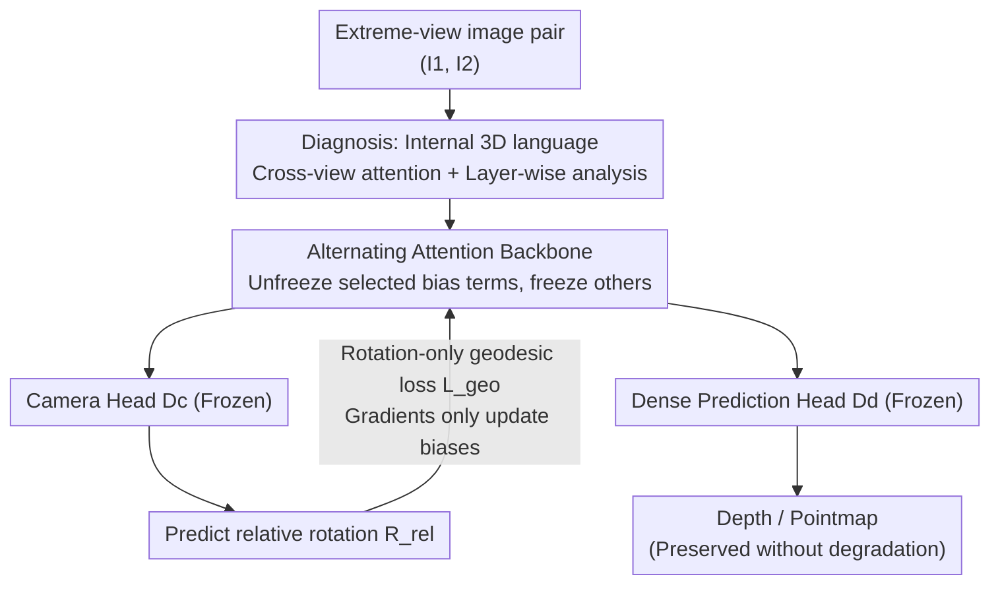

# Emergent Extreme-View Geometry in 3D Foundation Models

**Conference**: CVPR 2026  
**Paper**: [CVF Open Access](https://openaccess.thecvf.com/content/CVPR2026/html/Zhang_Emergent_Extreme-View_Geometry_in_3D_Foundation_Models_CVPR_2026_paper.html)  
**Code**: None (Project page https://ext-3dfms.github.io/ )  
**Area**: 3D Vision  
**Keywords**: 3D Foundation Models, Extreme Views, Relative Pose Estimation, Bias Fine-tuning, Attention Analysis  

## TL;DR
The authors discover that although 3D foundation models (3DFMs) like VGGT are trained solely on overlapping images, they exhibit "emergent" geometric understanding of extreme/non-overlapping views. Based on this, they propose a lightweight alignment scheme that fine-tunes only ~80k bias parameters in the backbone (freezing all decoding heads) to align the internal representations. This reduces the median rotation error for non-overlapping image pairs from 42.4° to 13.1° without degrading the quality of depth maps and pointmaps.

## Background & Motivation

**Background**: Traditional 3D vision relies on a "comfort assumption"—namely, having access to densely captured scenes with highly overlapping images, where structure can be recovered by matching pixels, tracking features, and triangulating points. Recent 3D foundation models (3DFMs, e.g., DUSt3R, VGGT, π³, WorldMirror) take this further by simultaneously regressing camera poses, depth, and pointmaps using a shared backbone in a single forward pass, completely bypassing explicit correspondence estimation.

**Limitations of Prior Work**: However, these 3DFMs are almost exclusively trained and evaluated on overlapping or smoothly varying viewpoint datasets. In real-world scenarios—such as casual mobile photos, historical archives, or crowdsourced tourist photos—images are often sparse, with near-zero visual overlap between views. Under these "extreme-view" conditions, classical pipelines (feature matching + RANSAC) fail completely, and yet the true capability of 3DFMs under such conditions has barely been investigated.

**Key Challenge**: Extreme views contain no matchable correspondences, suggesting that pose estimation should be theoretically impossible. Yet, the authors observe a counterintuitive phenomenon (Fig. 1): when feeding non-overlapping image pairs directly into a pre-trained VGGT trained only on overlapping images, it still manages to output "reasonable" relative poses, keeping the rotation error of nearly half the pairs under 30°. This indicates that the internal representations learned by the model go far beyond "explicit pixel correspondences," but this latent capability is neither understood nor fully exploited.

**Goal**: (1) To understand what exactly is encoded in the shared backbone of 3DFMs and whether it is the source of this emergent capability; (2) to further unlock this extreme-view capability without compromising pre-trained multi-task performance (depth/pointmaps); (3) to provide a benchmark specifically designed to evaluate extreme-view geometry which has not been seen by existing 3DFMs.

**Key Insight**: The authors propose a critical hypothesis—the shared backbone of a 3DFM crystallizes an "internal 3D language" (a learned geometric representation), while the various decoding heads merely "translate" this language into explicit depth, pointmaps, or poses. If this hypothesis holds, enhancing extreme-view capability should involve aligning this "internal language" (i.e., tuning the backbone) rather than retraining the decoding heads.

**Core Idea**: Freeze all decoding heads and use only a rotation-only geodesic loss to fine-tune the "bias parameters of selected layers" in the backbone. Utilizing four orders of magnitude fewer parameters (≈80k vs. billions) aligns the internal 3D representations, substantially improving extreme-view pose estimation without degrading depth or pointmap prediction capabilities.

## Method

### Overall Architecture
The proposed method follows a two-step pipeline: **diagnosis** followed by **alignment**. The diagnosis phase (§3.1) visualizes the cross-view attention maps in the 3DFM's shared Alternating Attention (AA) backbone and analyzes layer-wise changes to demonstrate that "the 3D language is indeed encoded within the backbone rather than the decoding heads." Guided by these insights, the alignment phase (§3.2) designs a minimalist fine-tuning scheme: given an extreme-view image pair $(I_1, I_2)$, tokens are obtained via the AA backbone, and the relative rotation is decoded by the camera head $\mathcal{D}_c$. During training, **only a rotation-only geodesic loss is applied to the camera head**, and **only the bias parameters of selected layers in the backbone are updated**, while both the camera head and the dense prediction head $\mathcal{D}_d$ remain completely frozen. This calibrates the internal representation's robustness to extreme views while preserving depth/pointmap performance by avoiding modifications to the decoding heads or dense supervision.

### Key Designs

**1. Revealing the "Internal 3D Language" of 3DFMs: Cross-View Attentions + Layer-wise Analysis**

To support the decision to "tune the backbone instead of the heads," the authors must first prove that geometric representations reside in the backbone. The first piece of evidence comes from cross-view attention maps (Fig. 2): at the final layer of the AA backbone (where cross-view information is sufficiently fused), they take a query vector $q$ from a region in $I_1$ and compute its attention map over all keys in $I_2$, summing across all heads: $A_h^{(l)} = \mathrm{softmax}(QK^\top/\sqrt{d_h})$. The results show that for overlapping regions, high attention accurately falls on correspondending locations in $I_2$ (indicating pixel-matching capability). For **non-overlapping** regions, the attention shifts to spatial boundaries or corners in $I_2$ that are "spatially closest in the 3D world," demonstrating a form of "nearest-neighbor correspondence." Even for queries totally lacking matching regions, the model learns to attend to **symmetry clues** (e.g., the overall curvature of an archway or decorative details). This indicates that the backbone encodes far more than explicit pixel correspondences; it captures latent spatial relationships, depth, and pose representations, while the decoding heads act merely as "format converters." The second line of evidence is layer-wise representation shift analysis, showing that only a small subset of backbone layers undergoes significant changes across views, and these layers precisely overlap with the skip-connection layers feeding into the dense prediction heads—pointing out exactly "which layers to fine-tune."

**2. Rotation-Only Geodesic Target: Awaking Dense Representations with Sparse Supervision**

A major pain point is that training these 3DFMs typically requires expensive pixel-wise dense annotation. However, in extreme views, rotation is the most critical and hardest component to correct. The authors therefore adopt a unified, cross-architecture rotation-only target:

$$\mathcal{L} = \mathcal{L}_{\mathrm{geo}}\!\left(\mathbf{R}_{\mathrm{rel}}^{\mathrm{pred}}, \mathbf{R}_{\mathrm{rel}}^{\mathrm{gt}}\right) + \mathbb{1}_{a}\,\mathcal{L}_{\mathrm{geo}}\!\left(\mathbf{R}_{1}^{\mathrm{pred}}, \mathbf{I}\right)$$

where the relative rotation is $\mathbf{R}_{\mathrm{rel}}^{\mathrm{pred}} = \mathbf{R}_{2}^{\mathrm{pred}}(\mathbf{R}_{1}^{\mathrm{pred}})^\top$, and $\mathcal{L}_{\mathrm{geo}}$ is the geodesic loss measuring the minimum angular distance between two rotation matrices on the SO(3) manifold (i.e., $\arccos(\tfrac{1}{2}(\mathrm{tr}(\mathbf{R}_{\mathrm{pred}}^\top\mathbf{R}_{\mathrm{gt}})-1))$). The indicator function $\mathbb{1}_a$ controls whether to use an "anchor term": for architectures assuming a fixed reference frame (like VGGT), the first image is forced to align with the world coordinate frame ($\mathbb{1}_a=1$); for permutation-invariant architectures (like π³), $\mathbb{1}_a=0$ and the loss simplifies to the symmetric relative rotation term. Crucially, while this supervision signal is much sparser than pixel-wise dense annotations, it is sufficient to "awaken" the dense geometric representations already latent in the backbone—acting not to teach the model new concepts, but to align its existing internal language.

**3. Layer-wise + Bias-only Parameter Optimization: Tuning Backbone Without Overfitting**

Using rotation-only supervision on the camera head alone breaks geometric consistency between heads and degrades downstream dense estimation tasks. To fix this, the authors restrict the tunable parameter space to the absolute minimum across two dimensions: (1) only updating the small subset of "highly shifting" layers identified in Design 1 (layer-only, LO); (2) only fine-tuning the **bias terms** (bias-only, BO) while freezing all weights (prior work shows bias-only tuning in Transformers often matches full fine-tuning). Consequently, only ~80k parameters (four orders of magnitude smaller than the complete model) are updated, requiring only 2 epochs of training on roughly 65k image pairs. It is highly emphasized that **the decoding heads must remain completely frozen**: ablation studies show that unfreezing the camera head breaks the pre-trained depth-pose consistency, leading to a catastrophic collapse in fused dense reconstruction (performance drops from a +9.2% improvement to a −90.3% degradation for VGGT). Thus, "tuning only the backbone biases and absolutely freezing the heads" is key to preserving multi-task capability.

**4. MegaUnScene Benchmark: Testing 3DFMs on Unseen Extreme Views**

Most existing in-the-wild datasets (e.g., MegaDepth, WikiScenes, MegaScenes, AerialMegaDepth) have already been seen during training or lack specialized evaluation splits for joint dense predictions, compromising fair generalizability checks. The authors therefore construct MegaUnScene: 469 internet scenes completely unseen by existing 3DFMs (cross-checked via image IDs and text names against MegaScenes to prevent overlap). The reconstruction pipeline uses Doppelgangers++ for disambiguation + MASt3R-SfM for robust pairwise pose estimation. It contains three test subsets: **UnScenePairs** (primarily rotational motion, K=5 nearest-neighbor graph, 3854 pairs including 776 non-overlapping), **UnScenePairs-t** (larger translation baselines, K=50, 2398 pairs including 756 non-overlapping, with overlap labels None/Large/Small cross-verified via MASt3R matches), and **UnSceneRecon** (100 dense reconstructions with metric scale annotations, calibrated with Google Maps distances).

### Loss & Training
The only training loss is the rotation-only geodesic loss defined above (using the anchor term for VGGT/WM but not for π³). The training data follows Bezalel et al. (ExRot), sampling image pairs from scene-level COLMAP reconstructions of MegaScenes, with a deliberate inclusion of larger translational pairs compared to ExRot to generalize to camera translations. The active parameters range down to only 0.07M under the optimal LO+BO settings.

## Key Experimental Results

### Main Results: Extreme Relative Rotation Estimation (Non-Overlapping Pairs)
The metrics are Median Rotation Error (MRE, lower is better) and relative rotation accuracy under 15° and 30° thresholds (RA15/RA30, higher is better). The subscript FT denotes the fine-tuned versions. ExRot is the previous in-the-wild SOTA.

| Method | sELP MRE↓ | UnScenePairs MRE↓ | UnScenePairs-t MRE↓ | UnScenePairs-t RA30↑ |
|------|-----------|-------------------|----------------------|----------------------|
| ExRot | 13.23 | 28.48 | 42.45 | 43.8 |
| VGGT | 92.92 | 31.64 | 46.65 | 42.1 |
| **VGGT_FT (Ours)** | 14.21 | **12.71** | **14.48** | **62.1** |
| WM | 68.96 | 19.25 | 21.52 | 57.4 |
| **WM_FT (Ours)** | **9.74** | **11.75** | **13.13** | **64.5** |
| π³ | 45.24 | 17.66 | 21.62 | 56.8 |
| **π³_FT (Ours)** | 11.96 | 12.92 | 13.31 | 65.5 |

All three 3DFMs consistently show substantial improvements across all datasets, setting a new SOTA in extreme rotation estimation. An interesting observation: pre-trained models exhibit high variance across test sets (VGGT scores 92.92 on sELP vs. 31.64 on UnScenePairs), because they are pre-trained on landmark-centric MegaDepth datasets, which lack the "forward-moving, low-perspective" trajectories of sELP. The fine-tuned versions close this gap using landmark data alone, pointing to improved generalizability. Key gains highlighted in the abstract: sELP 13.2° $\rightarrow$ 9.7°, in-the-wild with/without translation 42.4° $\rightarrow$ 13.1° and 28.4° $\rightarrow$ 11.7°.

### Preserving Pre-trained Capabilities: Multi-view Pose + Dense Reconstruction
The fine-tuning updates are driven only by rotation loss on image pairs, yet they preserve both multi-view and dense prediction capabilities.

| Task/Data | Metric | VGGT | VGGT_FT |
|-----------|------|------|---------|
| ETH3D Multi-view | TA30↑ | 87.01 | **94.70** |
| ETH3D Multi-view | AUC30↑ | 72.52 | **79.30** |
| UnSceneRecon Recon. | ACC↓(mean) | 1.441 | **1.291** |
| ETH3D Recon. | ACC↓(mean) | 0.284 | **0.233** |

VGGT, natively the weakest model, achieves the largest gains after fine-tuning in both multi-view and dense reconstruction tasks (affirming that there is "more room to improve" for weaker models). WM/π³ are already robust and near ceiling performance, enjoying baseline consistency or minor fluctuations. π³ shows a slight degradation in dense reconstruction, which the authors attribute to its lack of a dedicated per-frame camera token (unlike VGGT/WM); instead, camera pose information is scattered across all image tokens, making its internal representations more susceptible to perturbation when fine-tuning extreme rotations.

### Ablation Study (VGGT, △ROT on UnScenePairs, △REC on UnSceneRecon)

| Configuration | △ROT | △REC(Fused) | #Params | Explanation |
|------|------|-----------|---------|------|
| Tune camera head Dc only | +6.8% | 0.0% | 216.2M | Head tuned, backbone static, performance degrades |
| Unfreeze backbone+Dc | −74.3% | **+90.3%** | 820.9M | Rotation improves, but dense reconstruction collapses |
| Unfreeze backbone(AA) only | −69.8% | −9.2% | 604.7M | Rotation improves and reconstruction is optimized |
| AA + LO+BO (Final) | −59.8% | −12.4% | **0.07M** | Selection + bias-only; optimal trade-off |

### Key Findings
- **The backbone must be unfrozen**: Tuning only the camera head is ineffective (even deteriorating for VGGT) because the frozen backbone still feeds unchanged features to the dense heads—proving that the 3D representation is completely situated in the backbone.
- **The camera head must be frozen**: Unfreezing the camera head destroys depth-pose consistency, leading to a drop in fused dense reconstruction from a +9.2% improvement to a -90.3% degradation.
- **Selective layer + bias-only is the optimal trade-off**: For the already strong WM, full fine-tuning yields only marginal rotation gains at the expense of clear reconstruction penalties (overfitting); LO+BO, using 0.07M parameters, secures a 39.0% reduction in rotation error while maintaining stable reconstruction (+2.9%).
- **Translation remains a challenge**: While rotation error drops immensely, median translation error only decreases slightly from 37.28° to 35.79°. Resolving large translations remains inherently difficult and is a future direction.

## Highlights & Insights
- **An elegant "Emergence + Alignment" research paradigm**: The authors first visually demonstrate via attention maps that "the model already possesses geometric understanding, it's just not awakened," and then deploy a minimal-cost alignment rather than thorough retraining. This "diagnosis-driven design" (where layer-wise analysis directly points out which layers to tune) is highly transferable to other tasks aiming to efficiently activate hidden capacities in pre-trained models.
- **80k parameters steering a billion-parameter model**: Restricting the trainable parameters to only the bias terms of selective layers exemplifies an extremely successful application of Parameter-Efficient Fine-Tuning (PEFT) on 3D geometric alignment—sparse rotation supervision successfully aligns dense geometric representations.
- **"Freezing decoding heads" is crucial for multi-task stability**: A counterintuitive yet ablated conclusion: to preserve depth/pointmap performance, one must absolutely *not* touch the decoding heads (e.g., camera head), and only adjust the backbone's internal language.
- **"Unseen" benchmark design**: MegaUnScene deliberately excludes training scenes and provides specific dense evaluation splits with metric scale annotations, successfully filling the evaluation gap regarding how 3DFMs perform on truly unseen, extreme viewpoints.

## Limitations & Future Work
- **Limited improvement in translation estimation** (admitted by the authors): Large translation baselines bring massive parallax challenges, which rotation-only supervision cannot sufficiently resolve, and complete pose supervision shows no better results either—representing a true bottleneck.
- **Trained only on landmark-centric data**: Training pairs are sampled from MegaScenes' landmark COLMAP reconstructions, meaning generalizability to non-landmark, dynamic scenes, or textureless surfaces (e.g., flat painted walls) is not fully validated.
- **Architectural dependency**: Because π³ lacks a dedicated camera token, its dense reconstruction degrades, suggesting this approach is sensitive to how camera information is structurally organized within tokens and is not equally seamless across all 3DFM architectures.
- **Refinement strategies**: Extending the alignment target from rotation-only to "rotation + sparse translation clues," or appending a lightweight pose readout module for architectures lacking native camera tokens, could potentially salvage both translation estimation and π³-style networks.

## Related Work & Insights
- **vs. ExRot (Bezalel et al.)**: ExRot designs a specialized framework for extreme rotation and generalizes to in-the-wild scenarios, but its performance on extreme real-world pairs remains limited; this work, rather than building a new model from scratch, directly aligns the geometric representations of general 3DFMs to be robust under extreme views, and seamlessly adapts to three different architectures (VGGT/WM/π³).
- **vs. Head-tuning methods (e.g., counterpart head-only adaptation in Doppelgangers++)**: Traditional methods often freeze the shared backbone and only fine-tune the heads; this work acts conversely—tuning only the backbone (specifically, only the biases) while freezing all heads, demonstrating that this is the correct choice to boost extreme-view performance without compromising other 3D tasks.
- **vs. Classical SfM/MVS & learned matchers**: Classical pipelines and matchers like SuperGlue rely heavily on visual overlap, failing under wide baselines/non-overlapping viewpoints; 3DFMs bypass explicit correspondences, and this work further pushes their boundaries to the extreme-view regime.

## Rating
- Novelty: ⭐⭐⭐⭐⭐ The combined perspective of "emergent capability diagnosis + bias-level alignment" is highly innovative, successfully applying PEFT to 3D geometric representation alignment.
- Experimental Thoroughness: ⭐⭐⭐⭐⭐ Across three 3DFMs, multiple benchmarks (extreme rotation/multi-view/dense reconstruction), two-dimensional ablation studies, and a brand-new benchmark, the chain of evidence is complete.
- Writing Quality: ⭐⭐⭐⭐ The "internal 3D language" narrative is clear and supported by strong visual evidence, although some implementation details (e.g., layer selection criteria, training data construction) are pushed to the supplementary material.
- Value: ⭐⭐⭐⭐⭐ Reveals the untapped extreme-view potential of 3DFMs, offering a reusable low-parameter alignment paradigm and a truly unseen evaluation benchmark.

<!-- RELATED:START -->

## Related Papers

- [\[CVPR 2026\] Emergent Outlier View Rejection in Visual Geometry Grounded Transformers](emergent_outlier_view_rejection_in_visual_geometry_grounded_transformers.md)
- [\[CVPR 2026\] Foundry: Distilling 3D Foundation Models for the Edge](foundry_distilling_3d_foundation_models_for_the_edge.md)
- [\[CVPR 2026\] Towards Foundation Models for 3D Scene Understanding: Instance-Aware Self-Supervised Learning for Point Clouds](towards_foundation_models_for_3d_scene_understanding_instance-aware_self-supervi.md)
- [\[CVPR 2026\] 3D-IDE: 3D Implicit Depth Emergent](3d-ide_3d_implicit_depth_emergent.md)
- [\[CVPR 2026\] AVA-Bench: Atomic Visual Ability Benchmark for Vision Foundation Models](ava-bench_atomic_visual_ability_benchmark_for_vision_foundation_models.md)

<!-- RELATED:END -->
