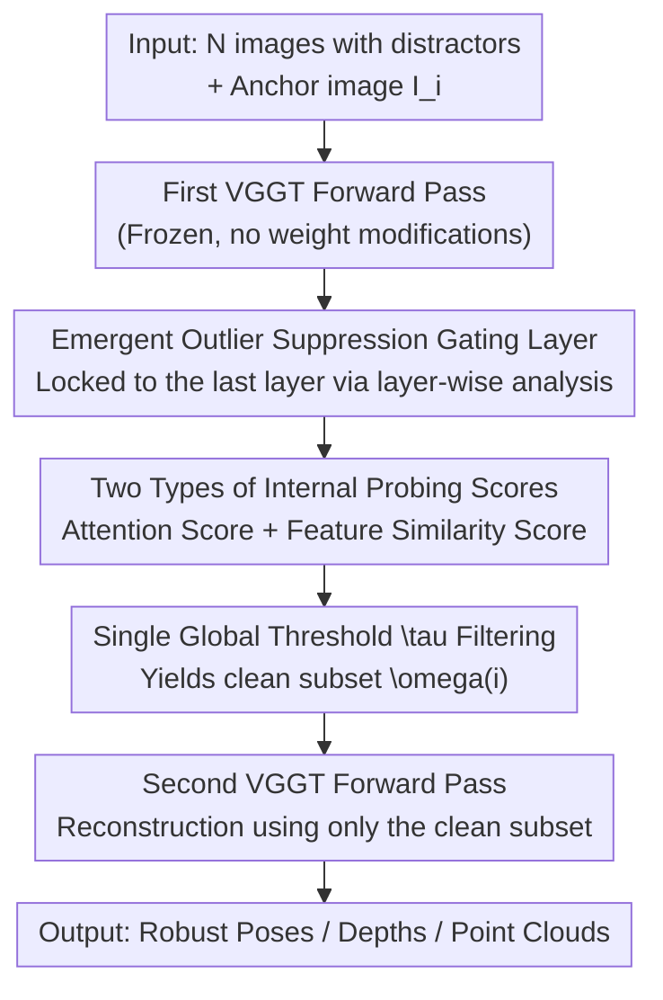

# Emergent Outlier View Rejection in Visual Geometry Grounded Transformers

**Conference**: CVPR 2026  
**Paper**: [CVF Open Access](https://openaccess.thecvf.com/content/CVPR2026/html/Han_Emergent_Outlier_View_Rejection_in_Visual_Geometry_Grounded_Transformers_CVPR_2026_paper.html)  
**Code**: https://cvlab-kaist.github.io/RobustVGGT (Project Page)  
**Area**: 3D Vision  
**Keywords**: Feed-forward 3D reconstruction, outlier view rejection, emergent properties, VGGT, training-free  

## TL;DR
The authors discover that feed-forward 3D reconstruction models like VGGT, without any outlier supervision, naturally **suppress irrelevant distractor views in their last-layer attention and feature representations**. Leveraging these internal signals to score each view, they filter out distractor images using a single global threshold before reconstruction. This yields RobustVGGT, a zero-parameter, training-free framework that consistently outperforms various retrieval-based pre-filtering baselines on noisy real-world image collections.

## Background & Motivation

**Background**: Feed-forward 3D reconstruction models, represented by VGGT, DUSt3R, and Pi3, feed a set of images into a transformer at once to directly regress camera poses, depths, and point clouds. Bypassing the step-by-step iterative feature matching and bundle adjustment in traditional Structure-from-Motion (SfM), they are fast and perform exceptionally well on curated benchmarks.

**Limitations of Prior Work**: Real-world image collections (e.g., internet images retrieved using "Statue of Liberty" as a keyword) are often heavily contaminated with **distractors**—irrelevant photos with almost no view overlap with the main scene, occluding frames, or transient objects. Traditional SfM solutions like COLMAP naturally possess robustness to dirty data due to multi-stage filtering, including geometric verification, epipolar consistency checks, and RANSAC outlier rejection. In contrast, feed-forward models **completely lack an explicit view filtering mechanism**, allowing distractors to propagate through the entire pipeline, which corrupts pose estimation and introduces obvious artifacts in the reconstructed geometry.

**Key Challenge**: While feed-forward models predict per-point confidence, this is a **point-level, post-hoc** signal—it can only down-weight individual 3D points but cannot reject an entire distractor **view**. The system still attempts to reconstruct all images, and corruption still occurs. To restore robustness, the most direct approach is to use Visual Place Recognition (VPR)/retrieval for pre-filtering before reconstruction. However, such methods often require scene-by-scene hyperparameter tuning, and retrieval similarity reflects "visual appearance likeness" rather than "geometric overlap capability," leading to poor cross-dataset generalization.

**Goal**: To equip feed-forward 3D reconstruction with the ability to identify and discard irrelevant views **without retraining, modifying the architecture, or introducing any additional supervision**.

**Key Insight**: The authors make a counter-intuitive observation: although VGGT is not explicitly trained for outlier rejection, it may have **implicitly learned to distinguish distractor views** during the optimization of multi-view geometric consistency. Consequently, they conduct a layer-wise probe analysis, measuring how the attention/feature similarity gap between "clean view pairs" and "clean-distractor pairs" changes with network depth.

**Core Idea**: To directly leverage the **emergent outlier suppression signals** from within VGGT's internal representations as a filter—locating the "geometric gating layer," scoring and ranking views based on its attention or feature similarity scores, filtering out low-scoring views via a single fixed threshold, and performing a second forward pass for reconstruction.

## Method

### Overall Architecture
RobustVGGT requires no training and modifies no weights of VGGT. Instead, it performs a two-pass process: "**First pass through VGGT to probe the relevance of each image $\to$ threshold filtering $\to$ second pass through VGGT with the clean subset**". Given $N$ uncalibrated images $\{I_1,\dots,I_N\}$, for any image $I_i$ acting as an anchor (query), the goal is to select a clean context subset $\{I_j\}_{j\in\omega(i)}$, and then feed this subset back into VGGT to obtain the final poses $P_i$, depths $D_i$, and point clouds $X_i$.

The key to the proposed method lies not in "how to filter" (filtering itself is just a threshold), but in **"where the filtering signals come from"**. The authors first lock onto the layer in VGGT that naturally possesses outlier suppression capabilities (demonstrated to be the **last layer** experimentally) using a suite of layer-wise analysis, and then extract two types of internal signals from this layer—cross-view attention and dense feature similarity—to construct scoring functions.

### Key Designs

**1. Detecting the "Emergent Outlier Suppression Gating Layer": Layer-wise Probing to Locate the Final Layer**

The main paint point is: VGGT acts as a black box; even if it indeed possesses implicit filtering capability, it is unknown at which layer this capability resides or how strong it is. The authors dismantle the alternating attention stack of VGGT (composed of alternating frame-wise and global attention) and construct the same probing experiment for each layer: feeding a query image and a set of context images containing a mixture of clean and distractor views. They measure two quantities layer-by-layer: (i) the attention weights assigned by the query to each context image; (ii) the pixel-wise cosine similarity between the query feature map and each context feature map (computed on $\ell_2$-normalized features and then averaged across pixels to obtain a scalar). For each layer, they report the average score for "clean pairs", the average score for "distractor pairs", and their difference (gap = clean − distractor).

The conclusion is straightforward: **early layers barely distinguish between clean and distractor views (gap close to 0), whereas the gap steadily widens with depth and peaks at the very last layer**; the feature probe provides even larger separation than the attention probe, indicating that the last-layer features serve as a stronger "geometric relevance discriminator". This implies that the last layer is indeed the gate distinguishing "consistent vs. inconsistent with scene geometry", and this behavior **fully lacks outlier supervision**, emerging purely as a byproduct of optimizing multi-view geometric consistency. Visualization also confirms this: in the last layer, irrelevant frames (non-main scene, heavily occluded) receive low attention and weak feature similarity, while geometrically consistent views are highly activated. This step is the foundation of the paper—it transforms "there is a signal in the black box" into "specifically using the $L$-th (last) layer as a concrete lever."

**2. Two Types of Internal Probing Scores: Attention Score and Feature Similarity Score**

Locking onto the last layer $L$, the authors propose two complementary probes to compute a relevance score $r_{i\to j}$ for each context image $I_j$ targeted to the anchor image $I_i$.

Attention Score RobustVGGT-A: Taking the multi-head averaged attention $A^{(\ell_L)}$ at the last layer, the attention from anchor $I_i$ to $I_j$ is simply averaged across all tokens:

$$r^{\text{att}}_{i\to j} = \frac{1}{HW}\sum_{u,v} A^{(\ell_L)}_{i\to j}(u,v),$$

where $u,v$ are 2D spatial positions. The intuition is: if $I_j$ and $I_i$ align geometrically, VGGT naturally assigns more attention to $I_j$ during cross-view reasoning.

Feature Similarity Score RobustVGGT-F: Taking the dense feature maps $F^{(\ell_L)}_i, F^{(\ell_L)}_j \in \mathbb{R}^{H\times W\times d}$ at the last layer, the pixel-wise correlation map is first computed on $\ell_2$-normalized features as $C_{i\to j}(u,v)=\tilde F^{(\ell_L)}_i(u)\cdot \tilde F^{(\ell_L)}_j(v)$, followed by spatial averaging over the entire $HW\times HW$ correlation map:

$$r^{\text{feat}}_{i\to j} = \frac{1}{HW}\sum_{u,v} C_{i\to j}(u,v),$$

which represents the average cosine similarity between the features of the two images. The fundamental difference from retrieval-based methods (such as NetVLAD or DINOv3 global descriptors) is that those descriptors are trained on "appearance/semantics", grouping "visually similar" images together while remaining oblivious to whether they "geometrically overlap". Consequently, they fail to filter out distractors that look similar but do not overlap (in experiments, DINOv3's rejection success rate is nearly 0). In contrast, VGGT's internal signals stem from cross-view geometric reasoning, capturing "whether they can align geometrically," which is exactly the metric needed for outlier rejection.

**3. Single Global Threshold Filtering + Second Forward Pass Reconstruction: Training-Free Deployment**

With the scores computed, rejection is a simple hard thresholding step. The context subset is defined as:

$$\omega(i) = \{\, j \mid j=i \ \text{或}\ r^{O}_{i\to j} \ge \tau^{O} \,\},\quad O\in\{\text{att}, \text{feat}\},$$

Views below the threshold are discarded. The key selling point is that $\tau^O$ is **a fixed global value shared across all benchmarks** (ablation sets $\tau=0.05$ for RobustVGGT-A and $\tau=0.65$ for RobustVGGT-F). This avoids the scene-by-scene parameter tuning required by VPR and does not require prior knowledge of the number of clean images. After filtering, the clean subset $\{I_j\}_{j\in\omega(i)}$ is fed back into the same VGGT, producing $(P_i, D_i, X_i, C_i)$ based only on geometrically consistent views. The entire process requires zero additional parameters, zero supervision, and zero fine-tuning, costing only one extra forward pass and keeping the efficiency benefits of feed-forward reconstruction virtually intact.

### A Complete Example
Taking a set of images retrieved with the keyword "Statue of Liberty" as an example: it is heavily mixed with distractor photos having different backgrounds and non-overlapping viewpoints. Directly feeding them into VGGT (the baseline) leads to distractors being reconstructed together, skewing the poses and causing floating artifacts in the point cloud. In contrast, with RobustVGGT: after the first forward pass, the last-layer attention/features are used to score the anchor image. The images belonging to the main scene receive high scores, while irrelevant photos receive scores significantly below $\tau$ and are pruned. Running the second pass only with the geometrically consistent subset produces clean and stable final trajectories and depths. The entire process requires no scene-specific tuning for this "Statue of Liberty" scene, using the exact same threshold as all other datasets.

## Key Experimental Results

### Main Results
Evaluation Setup: The authors are the first to propose evaluating feed-forward reconstruction under **controlled noise levels**—sampling $N_c=30$ clean images from the same scene each time, and copying $N_n\in\{10,30,50\}$ distractor images (representing Small/Medium/Large noise) from other scenes, yielding totals of $\{40,60,80\}$ images, with results averaged over 10 random seeds per setting. The datasets cover Phototourism, On-the-Go, RobustNeRF, and ETH3D. The tasks consist of multi-view pose estimation and multi-view depth estimation.

Camera pose estimation (ATE / RPEtrans / RPErot, lower is better; the table below shows the Avg column for Phototourism):

| Method | ATE↓ | RPEtrans↓ | RPErot↓ |
|------|------|-----------|---------|
| MASt3R-SfM | 1.2856 | 2.3987 | 11.8354 |
| VGGT (Baseline, no filtering) | 0.3504 | 0.5172 | 1.1732 |
| MegaLoc + VGGT | 0.2965 | 0.4412 | 0.9809 |
| DINOv3 + VGGT | 0.3504 | 0.5315 | 1.1735 |
| **RobustVGGT-A** | 0.2818 | 0.4199 | 0.8945 |
| **RobustVGGT-F** | **0.2650** | **0.3953** | **0.8403** |

Key Observation: Baseline VGGT monotonically deteriorates as noise increases from Small $\to$ Large (the more distractors, the worse it gets), whereas RobustVGGT-F is almost insensitive to the noise level (Small 0.2641 / Large 0.2664), demonstrating that the filtering indeed blocks distractors from reconstruction. DINOv3+VGGT behaves as if no filtering was applied (with scores nearly identical to bare VGGT), confirming that "appearance descriptors cannot perform geometric filtering."

Multi-view depth estimation (AbsRel↓, $\delta<1.25$↑) exhibits the same trend: VGGT / MASt3R-SfM without filtering degrades with the introduction of distractors, while RobustVGGT-A/F achieves the best performance across all noise levels.

### Ablation Study
Distractor rejection success rate (Success rate, higher is better, Average across 4 datasets):

| Dataset | MegaLoc | DINOv3 | RobustVGGT-F | RobustVGGT-A |
|--------|---------|--------|--------------|--------------|
| Phototourism | 0.521 | 0.000 | 0.841 | **0.890** |
| On-the-Go | 0.425 | 0.261 | **0.936** | 0.884 |
| RobustNeRF | 0.104 | 0.014 | 0.586 | **0.641** |
| ETH3D | 0.298 | 0.034 | **0.985** | 0.914 |

Threshold Sensitivity (Tab. 3): RobustVGGT-A and RobustVGGT-F achieve their optimal results at $\tau=0.05$ and $\tau=0.65$ respectively, and this pair of values is simultaneously optimal on Phototourism and On-the-Go. Thus, they are designated as the global thresholds shared across all evaluations.

### Key Findings
- **Last layer is the critical gate**: The clean-distractor gap of attention/features increases with depth and peaks at the last layer, with the feature probe offering even stronger separation—this is the fundamental reason why the proposed method works.
- **VGGT's internal signals outperform appearance retrieval**: The rejection success rate of the DINOv3 global descriptor is nearly 0 because it clusters based on "visual similarity" and is oblivious to geometric overlap. Conversely, VGGT's cross-view reasoning captures whether geometries can align, which is the exact criterion needed for outlier rejection.
- **A and F complement each other**: The attention score is more stable on Phototourism/RobustNeRF, while the feature score is stronger on On-the-Go/ETH3D. Both have their own strengths and substantially outperform the baseline.

## Highlights & Insights
- **"Eschewing new modules to mine emergent properties of existing models"**: The most "aha!" moment of this paper is transforming a model completely untrained for filtering into a robust reconstructor at zero cost, simply by locating its implicitly learned geometric gate through layer-wise probing. This represents a beautiful case of turning interpretability analysis directly into practical utility.
- **Engineering value of a single global threshold**: Being able to work stably across 4 highly diverse datasets with a shared threshold eliminates the scene-by-scene tuning that plagues VPR systems, making deployment extremely simple.
- **Transferable logic**: This probing paradigm of "measuring clean/distractor gap layer-by-layer $\to$ locking onto the gating layer $\to$ using internal signals as criteria" can be transferred to other feed-forward geometric models (such as Pi3, DUSt3R) or other multi-view tasks requiring outlier rejection. Furthermore, the authors point out that VGGT-based view selection can conversely be used to re-rank retrieval results for "geometry-aware place recognition."

## Limitations & Future Work
- The authors acknowledge that on RobustNeRF, the ATE of MASt3R-SfM is actually lower than that of the proposed method, indicating that explicit SfM still holds advantages in certain controlled distractor scenarios; hence, the proposed method is not a complete sweep.
- Self-identified limitations: The effectiveness of the method fully relies on the premise that "the last layer indeed exhibits emergent outlier suppression signals." It is tied to architectures like VGGT that are trained on multi-view geometric consistency, and may not hold for models without such internal signals. While the threshold is globally shared, it was determined based on Phototourism/On-the-Go, and may not be optimal when transferred to scenes with extreme domain shifts.
- Scale differences: VGGT processes only tens to hundreds of images in a batch, while VPR systems typically handle thousands. The proposed filtering is thus more akin to a "fine screening before reconstruction" rather than a replacement for large-scale retrieval. The authors' proposed route of "using VGGT view selection to re-rank retrieval candidates" serves as a more practical deployment pipeline.
- Directions for improvement: Adaptively fusing the two scoring types (A/F) or automatically calibrating the threshold based on scene statistics could further enhance cross-domain stability.

## Related Work & Insights
- **vs Traditional SfM (COLMAP / MASt3R-SfM)**: They resist noise through multi-stage explicit filtering like geometric verification, epipolar consistency, and RANSAC, which are robust but rely on iterative optimization, are highly modularized, and are difficult to tightly couple with learned pipelines. In contrast, this work does not reconstruct the SfM pipeline; it merely utilizes internal VGGT signals to sift images in a single step, preserving feed-forward efficiency.
- **vs Retrieval/VPR Pre-filtering (MegaLoc / DINOv3+VGGT)**: They employ appearance/semantic descriptors, are insensitive to "geometric overlap," and require scene-by-scene parameter tuning. This work leverages internal scores generated from geometric reasoning, requiring only a single threshold across datasets and achieving a significantly higher rejection success rate.
- **vs VGGT's per-point confidence**: That is a point-level, post-hoc signal, which cannot reject an entire view; this work provides exactly the "view-level, pre-reconstruction" filtering.

## Rating
- Novelty: ⭐⭐⭐⭐⭐ For the first time, the work uncovers and utilizes emergent outlier suppression signals within feed-forward reconstruction models, offering a fresh perspective.
- Experimental Thoroughness: ⭐⭐⭐⭐ Solid coverage across 4 datasets × 3 noise levels × 2 tasks, plus layer-wise analysis and threshold/success-rate ablations, although the controlled noise protocol is custom-defined.
- Writing Quality: ⭐⭐⭐⭐ The logical chain from "there is a signal in the black box" to "using the last layer" is clear, and the illustrations match the text well.
- Value: ⭐⭐⭐⭐⭐ Zero training, zero parameters, and a single threshold for plug-and-play operation provide extreme practicality, opening up a new route for "mining emergent capabilities of existing models."

<!-- RELATED:START -->

## Related Papers

- [\[CVPR 2026\] Emergent Extreme-View Geometry in 3D Foundation Models](emergent_extreme-view_geometry_in_3d_foundation_models.md)
- [\[CVPR 2026\] Block-Sparse Global Attention for Efficient Multi-View Geometry Transformers](block-sparse_global_attention_for_efficient_multi-view_geometry_transformers.md)
- [\[ICLR 2026\] Quantized Visual Geometry Grounded Transformer](../../ICLR2026/3d_vision/quantized_visual_geometry_grounded_transformer.md)
- [\[CVPR 2026\] FlashVGGT: Efficient and Scalable Visual Geometry Transformers with Compressed Descriptor Attention](flashvggt_efficient_and_scalable_visual_geometry_transformers_with_compressed_descr.md)
- [\[CVPR 2026\] OmniVGGT: Omni-Modality Driven Visual Geometry Grounded Transformer](omnivggt_omni-modality_driven_visual_geometry_grounded_transformer.md)

<!-- RELATED:END -->
