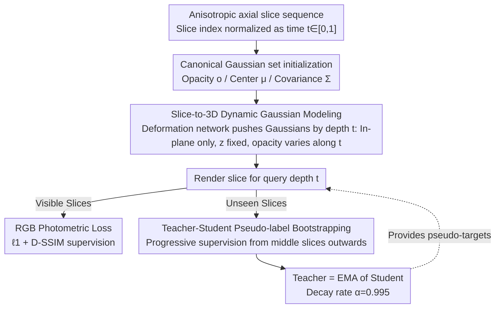

# EMGauss: Continuous Slice-to-3D Reconstruction via Dynamic Gaussian Modeling in Volume Electron Microscopy

**Conference**: CVPR 2026  
**arXiv**: [2512.06684](https://arxiv.org/abs/2512.06684)  
**Code**: None  
**Area**: 3D Vision  
**Keywords**: 3D Gaussian Splatting, Volume Electron Microscopy, Anisotropic Reconstruction, Dynamic Scene Modeling, Self-supervised Learning

## TL;DR

The problem of anisotropic slice reconstruction in volume electron microscopy (vEM) is re-modeled as a dynamic 3D scene rendering task based on deformable 2D Gaussian Splatting. High-fidelity continuous slice synthesis is achieved under sparse data conditions through a Teacher-Student pseudo-label mechanism.

## Background & Motivation

Volume electron microscopy (vEM) enables nanoscale 3D imaging of biological structures. However, due to the "impossible trinity" trade-off between resolution, field of view, and acquisition time, directly obtaining isotropic data is costly. Actual data typically exhibits anisotropic characteristics—axial (z) resolution is far lower than in-plane (xy) resolution.

Existing deep learning methods attempt to recover isotropy through two paradigms:

**Video Frame Interpolation**: Interpolating xy slices along the z-axis.

**Image Super-resolution**: Enhancing xz/yz orthogonal views via super-resolution.

Both methods implicitly assume that the tissue structure is approximately isotropic across the x/y/z dimensions. However, morphological anisotropy is common in biological samples (e.g., nerve fibers, dendritic spines), leading to errors when these methods process highly directional structures.

**Core Motivation**: There is a need for a reconstruction framework that does not depend on isotropic assumptions and performs reasoning directly in continuous 3D space.

## Method

### Overall Architecture

EMGauss aims to address the following: the axial (z) resolution of volume data acquired by vEM is much lower than the in-plane (xy) resolution. The goal is to recover a continuous, isotropic 3D structure at any depth from sparse axial slices. Its core approach is to change the perspective—instead of treating the slice sequence as a stack of discrete images to be interpolated, it is viewed as the "evolution over time" of a single 2D Gaussian point cloud along the z-axis. The slice index is normalized to $t \in [0,1]$ as a time coordinate, and the subtle changes in tissue morphology between adjacent slices are learned by a deformation network.

Specifically, EMGauss uses Deformable 3D Gaussians as its base, where each Gaussian primitive is parameterized by opacity $o$, center $\mu$, and covariance $\Sigma$ (decomposed into scaling $S$ and rotation $R$). After initializing a set of canonical Gaussians $\mathcal{G}_c$ from observed frames, the pipeline is as follows: given a query depth $t$ → the deformation network predicts the offset of each Gaussian at that depth → the corresponding slice is rendered. During training, observed slices are used for photometric supervision. During inference, any $t$ value can be input to render continuous slices that were never actually acquired.

### Key Designs

**1. Slice-to-3D Dynamic Gaussian Modeling: Replacing "interpolation" with "continuous geometric reasoning" via constrained deformation**

The reason frame interpolation and super-resolution fail on highly directional structures is their implicit assumption of isotropy. EMGauss avoids this assumption by allowing a deformation network $\Phi_\theta$ to continuously push the canonical Gaussians along depth $t$:

$$\Delta\mu_i,\ \Delta S_i,\ \Delta o_i = \Phi_\theta(\mu_i, t)$$

The key lies not just in "deformability" but in "allowed dimensions of deformation." EMGauss imposes constraints fitting vEM physics: positions only allow in-plane translation ($\Delta\mu_i=(\Delta x_i,\Delta y_i,0)$), scaling only allows in-plane stretching ($\Delta S_i=(\Delta s_x,\Delta s_y,0)$), while the z-coordinate and z-direction scaling are fixed as global constants $z_0,\ s_{z,0}$. Rotation is learnable but does not vary with $t$ ($\Delta R_i=0$). The only property allowed to change freely along z is opacity $\Delta o_i$—as structures in biological volumes typically appear and disappear gradually along the depth. Consequently, the model flexibly fits morphology and appearance per slice in-plane without allowing Gaussians to drift along z, converting "discrete slice interpolation" into "geometric reasoning on a continuous 3D field."

**2. Teacher-Student Pseudo-label Bootstrapping: Sustaining unobserved regions with only 10%–20% axial slices**

Real vEM axial slices available for supervision often comprise only 10% to 20% of the volume. Without ground truth at unobserved depths, the model tends to collapse. EMGauss employs bootstrapped self-supervision: maintaining a Teacher that is an Exponential Moving Average (EMA) of the Student (decay rate $\alpha=0.995$). The Teacher provides stable pseudo-targets for unseen slices, and the Student is trained to match these labels. Two designs ensure stability: first, pseudo-supervision starts only after the Student has converged on real slices (exceeding an iteration threshold); second, pseudo-label coverage expands progressively from central slices to the edges rather than supervising all gaps immediately. Alternating between pseudo-supervision and real-data supervision allows the signals to stabilize convergence.

### Loss & Training

Training progresses through three stages to unlock deformation capabilities sequentially. The **Warm-up stage** (2k iterations) freezes the deformation MLP and optimizes only the canonical Gaussian set $\mathcal{G}_c$ to establish a stable radiance baseline. The **Joint Training stage** (1k iterations) releases the deformation MLP to train alongside $\mathcal{G}_c$ to capture axial transitions; this stage is intentionally short to avoid overfitting. The final **Teacher-Student stage** (15k iterations) activates the EMA Teacher for pseudo-supervision. Regarding signals, visible slices use RGB photometric loss ($\ell_1$ + D-SSIM regularization), while the weight of the pseudo-supervision loss linearly increases from 0.1 to 1.0 between 3k–10k iterations.

## Key Experimental Results

### Main Results

**Datasets**: EPFL (Mouse brain, 5nm isotropic), FIB-25 (Drosophila brain, 8nm isotropic), FANC (Drosophila nerve cord, real anisotropy ×10)

**Table 2: xy slice reconstruction results on synthetic anisotropic datasets**

| Method | EPFL PSNR | EPFL SSIM | EPFL FSIM | FIB-25 PSNR | FIB-25 SSIM | FIB-25 FSIM |
|------|-----------|-----------|-----------|-------------|-------------|-------------|
| CycleGAN-IR | 22.05 | 0.491 | 0.856 | 22.39 | 0.554 | 0.856 |
| EMDiffuse† | 23.34 | 0.519 | 0.899 | 24.10 | 0.514 | 0.878 |
| IsoVEM | 23.91 | 0.597 | 0.856 | 21.51 | 0.546 | 0.846 |
| **Ours** | **26.59** | **0.698** | **0.943** | **27.37** | **0.728** | **0.920** |

†EMDiffuse requires additional training data.

**Table 3: Downstream segmentation results on EPFL (SAM2, IoU)**

| Method | CycleGAN-IR | EMDiffuse | Ours |
|------|-------------|-----------|---------|
| IoU | 0.9099 | 0.9555 | **0.9687** |

### Ablation Study

**Table 4: Key component ablation (Average of two isotropic datasets)**

| Configuration | PSNR | SSIM | FSIM |
|------|------|------|------|
| w/o Teacher-Student | 25.19 | 0.627 | 0.904 |
| w/o Warm-up | 25.76 | 0.653 | 0.908 |
| w/o Joint Training | 24.35 | 0.577 | 0.851 |
| w/o Dynamic Opacity $\Delta o$ | 25.44 | 0.630 | 0.894 |
| w/ Dynamic Rotation $\Delta R$ | 25.07 | 0.640 | 0.906 |
| **Full Model** | **26.98** | **0.713** | **0.932** |

### Key Findings

1. EMGauss outperforms the best baseline by **~3dB** PSNR on EPFL and FIB-25.
2. For xz/yz reconstruction, EMGauss outperforms baselines trained on xz/yz views, even though it is trained only on xy.
3. On the real anisotropic FANC dataset (×10), EMGauss is the only method supporting **continuous generation at arbitrary time steps**.
4. Removing the Joint Training stage results in the largest performance drop (-2.6 PSNR).
5. Dynamic opacity is more critical than dynamic rotation—static opacity cannot model structure appearance/disappearance, while dynamic rotation causes temporal jitter.

## Highlights & Insights

1. **Ingenious Problem Transformation**: Converting slice reconstruction into dynamic scene rendering fundamentally avoids the isotropic assumption.
2. **Fully Self-contained**: Uses only the anisotropic slices of the target volume for optimization, requiring no external datasets or large-scale pre-training.
3. **Continuous Generation**: Synthesizes interpolated slices at any depth, a feat impossible for discrete frame interpolation methods.
4. **Fine-grained Control of Gaussian Attributes**: Careful design of which attributes vary over time and which remain fixed reflects a deep understanding of the problem's nature.

## Limitations & Future Work

1. On noisy input slices, the number of Gaussian primitives may grow significantly, leading to high memory consumption.
2. A lightweight denoising module could be added before the reconstruction pipeline to stabilize optimization.
3. Future research could explore adaptive Gaussian pruning or joint learning with image-space regularizers.
4. Current experiments are validated only in electron microscopy; cross-modal generalization remains to be proven.

## Related Work & Insights

- **Relationship with 3DGS**: Ingeniously transfers 3DGS from multi-view 3D reconstruction to slice-to-volume reconstruction by reinterpreting the z-axis as a time dimension.
- **Difference from Deformable 3DGS**: The original method is for multi-view reconstruction of dynamic 3D scenes; this paper focuses on 3D continuous reconstruction from 2D slices.
- **Distinction from Diffusion/GAN**: Does not rely on cross-domain mappings (xy→xz/yz) but directly models continuous 3D geometry.
- **Inspiration**: This paradigm can be generalized to other planar scanning imaging fields, such as CT and MRI.

## Rating

- Novelty: ⭐⭐⭐⭐⭐ — Unique problem transformation; innovative application of 3DGS in medical imaging.
- Experimental Thoroughness: ⭐⭐⭐⭐ — Validated across multiple datasets and metrics, including downstream tasks and ablations, though cross-modal experiments are missing.
- Writing Quality: ⭐⭐⭐⭐ — Clear structure and well-articulated motivation.
- Value: ⭐⭐⭐⭐ — Provides a general slice-to-3D reconstruction framework that transcends the vEM field.

<!-- RELATED:START -->

## Related Papers

- [\[CVPR 2026\] Neural Field-Based 3D Surface Reconstruction of Microstructures from Multi-Detector Signals in Scanning Electron Microscopy](neural_field-based_3d_surface_reconstruction_of_microstructures_from_multi-detec.md)
- [\[CVPR 2026\] Spatial-SAM: Spatially Consistent 3D Electron Microscopy Segmentation with SDF Memory and Semi-Supervised Learning](spatial-sam_spatially_consistent_3d_electron_microscopy_segmentation_with_sdf_me.md)
- [\[CVPR 2026\] Learning Explicit Continuous Motion Representation for Dynamic Gaussian Splatting from Monocular Videos](learning_explicit_continuous_motion_representation_for_dynamic_gaussian_splattin.md)
- [\[CVPR 2026\] Part$^{2}$GS: Part-aware Modeling of Articulated Objects using 3D Gaussian Splatting](part2gs_part-aware_modeling_of_articulated_objects_using_3d_gaussian_splatting.md)
- [\[CVPR 2026\] D-Prism: Differentiable Primitives for Structured Dynamic Modeling](d-prism_differentiable_primitives_for_structured_dynamic_modeling.md)

<!-- RELATED:END -->
