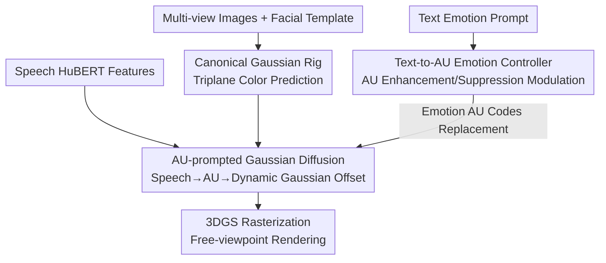

# EmoDiffTalk: Emotion-aware Diffusion for Editable 3D Gaussian Talking Head

**Conference**: CVPR 2026  
**Paper**: [CVF Open Access](https://openaccess.thecvf.com/content/CVPR2026/html/Liu_EmoDiffTalk_Emotion-aware_Diffusion_for_Editable_3D_Gaussian_Talking_Head_CVPR_2026_paper.html)  
**Code**: https://liuchang883.github.io/EmoDiffTalk/ (Project Page)  
**Area**: 3D Vision / Video Generation / Diffusion Models  
**Keywords**: 3D Gaussian Splatting, Talking Head, Emotion Editing, Action Unit, Diffusion Models  

## TL;DR
EmoDiffTalk maps the "emotion-to-expression" transformation onto the explainable Action Unit (AU) encoding space. It utilizes AU-prompted Gaussian diffusion to drive speech into fine-grained dynamic 3D Gaussian talking heads and implements "one-sentence emotion editing" via a text-to-AU controller. It surpasses Prev. SOTA in rendering fidelity, lip synchronization, and emotional controllability on EmoTalk3D and RenderMe-360.

## Background & Motivation
**Background**: Photo-realistic 3D talking heads have evolved from 3DMM and NeRF to 3D Gaussian Splatting (3DGS), achieving high rendering quality and real-time performance. Mainstream works primarily focus on rendering realism and lip-sync accuracy.

**Limitations of Prior Work**: These methods remain weak in **semantic-level editing**, especially regarding emotional expressions. Attempting to make a character "smile more obviously" or "change to a surprised expression" is either impossible or limited to changing styles/identities (stylization/personalization), failing to achieve fine-grained, scalable emotional manipulation.

**Key Challenge**: The difficulty in emotion editing stems from the **ambiguity in two mappings**: audio-to-emotion and emotion-to-expression. Early works (e.g., EAMM) used reference images for editing in implicit latent spaces. The EmoTalk series decoupled emotion from speech, and Hallo3 fed text directly into audio-diffusion. However, they all operate on **holistic expressions or implicit features**, lacking fine-grained anatomical grounding, which limits the quality of emotion editing.

**Goal**: To simultaneously achieve (1) fine-grained expression driving from speech and (2) accurate, scalable text-based emotion editing within a free-viewpoint dynamic 3DGS talking head.

**Key Insight**: The authors observe that AUs defined by FACS (Facial Action Coding System) correspond to specific facial muscle movements, providing an **explainable, anatomically grounded** representation of expression. Rather than operating in ambiguous implicit spaces, it is more effective to use AU encoding as a **mediator** between multimodal inputs (speech, text) and Gaussian diffusion.

**Core Idea**: Use AU encoding space as emotional embeddings to **prompt** Gaussian diffusion, allowing the model to directly predict attributes of dynamic Gaussian primitives. An AU-prompted Gaussian diffusion is first established for speech-to-expression, followed by distilling a text-to-AU controller for emotion editing.

## Method

### Overall Architecture
Given multi-view images $I=\{I_i\}$ and a facial template $T_f$ of a subject, the goal is to reconstruct a set of dynamic 3DGS primitives $G=\{g_i^t\}$ that can be driven by arbitrary speech and edited via text. The pipeline consists of three steps: first, **Canonical Gaussian Rig Reconstruction** to obtain a standard 3DGS assembly and high-precision color; second, **AU-prompted Gaussian Diffusion** to map speech to AU encodings and predict dynamic offsets relative to the canonical rig; finally, a **Text-to-AU Emotion Controller** transforms text prompts into "enhancement-suppression" modulations of AU encodings, replacing the original speech-derived AU codes to inject controllable emotion while maintaining articulation fidelity. The results are rendered via 3DGS rasterization.

The core of the design is using AU encoding as a **unified mediator** across speech, text, and geometry: speech is encoded into AUs, both diffusion and appearance decoding are AU-prompted, and text editing acts on AUs—all modalities converge in the same explainable space.

### Key Designs

**1. Canonical Gaussian Rig and Triplane Color Prediction: A Stable Base for Dynamic Editing**

To focus solely on facial dynamics during the driving phase, an expression-independent standard assembly is required. Following EmoTalk3D, the 3D head is partitioned into facial and non-facial regions with motion binding—driving the face automatically moves the rest of the head. For color acquisition, instead of using Spherical Harmonics (SH) for view-dependent color as in previous rigs, this work uses **triplane color prediction**:

$$c = M\big(F_{xy}(x,y) \oplus F_{xz}(x,z) \oplus F_{yz}(y,z)\big),$$

where $M$ is an MLP decoder, $F_{xy}, F_{xz}, F_{yz}$ are feature maps of the three planes, and $\oplus$ denotes concatenation. The canonical Gaussians are denoted as $G_0=\{\mu_0, S_0, R_0, \alpha_0, c_0\}$. This approach allows for more accurate color during attribute decoding in the subsequent AU-prompted diffusion. During driving, color $c_0$ is sampled from the triplane in real-time, while other attributes (position/rotation/opacity) are updated by the diffusion model.

**2. AU-prompted Gaussian Diffusion: Translating Speech to AU, then AU to Dynamic Gaussians**

This is the main component, divided into three stages. The **Speech-to-AU Encoder** extracts self-supervised HuBERT features $A_t\in\mathbb{R}^{768}$ from raw audio and predicts AU encodings $E_{0:T-1}=\mathrm{Enc}(A_{0:T-1};\theta)$ using a multi-layer Transformer. Low layers use constrained attention for fast articulation changes (e.g., lip closure), while high layers model slower prosodic changes. The **AU-prompted Diffusion** builds on DiffPoseTalk but utilizes AU encodings (rather than style info from 2D videos) as guidance. The network learns **positional offsets** $\Delta P_t$ of mesh vertices rather than 3DMM coefficients $\beta$. The denoising process is:

$$\hat{x}^0_{0:T} = D_\theta\big(x^n_{0:T}, P, E_{0:T}, A_{0:T}, n\big),$$

establishing fine-grained bindings between AU dimensions and specific facial point movements. The **Dynamic Appearance Decoder** then decodes diffusion outputs into dynamic 3DGS attributes: RotNet (3-layer MLP) predicts rotation $R_t=N_{Rot}(R_0, E_t, \mu_t)$, and opacity is handled by a learnable **Feature Line** $F\in\mathbb{R}^{17\times Q\times 16}$ ($Q$ is the number of facial Gaussians). This "repurposes" features originally meant for FLAME coefficients to store AU-related opacity patterns. The OPCNet (3-layer MLP) predicts opacity changes as $\Delta\alpha_t^i = N_{OPC}(f_t^i, E_t, \mu_t)$, where $f_t^i$ is a feature combination weighted by AU intensity.

**3. Text-to-AU Emotion Controller: Modulating AUs via Text**

With AU as the mediator, text editing becomes straightforward. The controller maps an emotion prompt (e.g., "the person is smiling") through a CLIP text encoder, Adapter, and classifier to a binary AU activation vector $y\in\{0,1\}^K$. It then applies a lightweight "enhancement-suppression" transformation to the speech-derived AU encoding $E_t$:

$$\tilde{E}_t = E_t \odot (1+\alpha y) - \beta(1-y)\odot E_t,$$

where $\alpha, \beta > 0$ are enhancement/suppression coefficients. The modulated $\tilde{E}_{0:T-1}$ **replaces** the original $E_{0:T-1}$ in the AU-aware diffusion, injecting controllable emotion while preserving articulation.

### Loss & Training
Optimization is performed in four sequential stages:
- **Stage 1 (Speech-to-AU Encoder)**: AU intensity regression loss + temporal consistency loss, $L_{AU}=\lambda_{reg}L_{reg}+\lambda_{temp}L_{temp}$.
- **Stage 2 (AU-prompted Diffusion)**: Unified geometric targets—global vertex reconstruction + velocity/acceleration coherence + deformation regularization + fine-grained lip fidelity, $L_{stage2}=\lambda_{vertex}L_{vertex}+\lambda_{motion}L_{motion}+\lambda_{deform}L_{deform}+\lambda_{lip}L_{lip}$.
- **Stage 3 (Appearance Decoder)**: Simple reconstruction loss for RotNet; $L_{OPC}=L_{recon}+L_{reg}+L_{opcmotion}+L_{dist}$ (hybrid reconstruction + motion-amplitude coupling + sparsity and temporal smoothing + displacement limits) for OPCNet.
- **Stage 4 (Text-to-AU Controller)**: $L_{control}=\lambda_{BCE}L_{BCE}+\lambda_{infoNCE}L_{infoNCE}$ to ensure AU activation accuracy and semantic alignment.

Training on a single RTX 5090 (32GB) takes ~3 days: 1 day for canonical reconstruction, 1 day for joint Speech-to-AU + Diffusion training, 1 day for the appearance decoder, and <1 hour for the text controller.

## Key Experimental Results

### Main Results
On EmoTalk3D and RenderMe-360, Ours is compared against 2D (EAMM / Hallo3 / EchoMimic) and 3D (SadTalker / Real3D-Portrait / EmoTalk3D) baselines.

| Dataset | Metric | Ours | Best Baseline | Gain |
|--------|------|------|----------|------|
| EmoTalk3D | PSNR↑ | 25.78 | 21.22 (EmoTalk3D) | +4.56 dB |
| EmoTalk3D | CPBD↑ | 0.36 | 0.31 (Hallo3) | +16.1% |
| EmoTalk3D | LMD↓ | 3.56 | 3.62 (EmoTalk3D) | Lower |
| EmoTalk3D | LPIPS↓ | 0.12 | 0.12 (EmoTalk3D) | Comparable |
| RenderMe-360 | PSNR↑ | 21.41 | 20.13 (Hallo3) | +1.28 dB |
| RenderMe-360 | LMD↓ | 6.59 | 9.33 (Hallo3) | -29.4% |

Ours leads in nearly all metrics on EmoTalk3D. On RenderMe-360, PSNR/SSIM are higher and LMD is significantly reduced, indicating simultaneous improvements in rendering fidelity and lip accuracy.

User studies (1–5 scale) further support the subjective quality. Only Hallo3 and Ours support text emotion control.

| Dataset | Dimension | Ours | Hallo3 |
|--------|------|------|--------|
| EmoTalk3D | Video Fidelity | 4.75 | 4.51 |
| EmoTalk3D | Image Quality | 4.50 | 4.30 |
| EmoTalk3D | Emotion Control | 3.77 | 3.75 |

### Ablation Study

| Config | PSNR↑ | SSIM↑ | LPIPS↓ | LMD↓ | CPBD↑ | Description |
|------|-------|-------|--------|------|-------|------|
| w/o Codes4P | 20.12 | 0.72 | 0.21 | 6.25 | 0.22 | Remove AU prompt in diffusion |
| w/o Codes4O | 22.43 | 0.75 | 0.14 | 4.75 | 0.26 | Remove AU input in OPCNet |
| w/o Diffusion | 24.96 | 0.82 | 0.21 | 4.51 | 0.36 | Replace Diffusion with GRU |
| FULL | 25.78 | 0.86 | 0.12 | 3.56 | 0.36 | Full Model |

### Key Findings
- **AU encoding in diffusion (Codes4P) has the highest impact**: Removing it causes PSNR to drop from 25.78 to 20.12 and LMD to rise from 3.56 to 6.25. While basic lip-sync remains, facial structure and dynamic details are lost.
- **AU in OPCNet (Codes4O) manages "dynamic appearance"**: Without it, dynamic wrinkles (e.g., crow's feet) are significantly weakened, and expressions become neutral, proving AU's necessity for modeling local appearance.
- **Diffusion vs GRU**: Replacing diffusion with GRU results in "regression to the mean" for extreme expressions, proving diffusion's importance for detail intensity and expression diversity.

## Highlights & Insights
- **AU as a "Universal Cross-modal Currency"**: Mapping speech, text, and geometry into the same explainable AU space avoids the difficulties of implicit latent spaces. This "anatomically grounded mediator" approach is transferable to other tasks like gesture or body pose generation.
- **Text editing as AU Addition/Subtraction**: The enhancement-suppression transform is lightweight but enables controlled emotion injection without destroying lip-sync.
- **Repurposing the Feature Line**: Using implicit feature lines (originally for FLAME coefficients) to store AU-based opacity patterns provides a continuous, interpolatable representation.

## Limitations & Future Work
- The series of pre-trained networks leads to **high computational overhead**.
- For **extremely exaggerated expressions**, the current "activation-suppression" controller may fail.
- The use of binary activation $y$ and scalars $\alpha, \beta$ is a relatively coarse global scaling, struggling with continuous intensities like "half-smiles" or multi-AU nonlinear coupling.

## Related Work & Insights
- **vs EAMM / EmoTalk**: They edit on implicit latents or holistic expressions; Ours uses the explicit, explainable AU space, offering more control at the cost of requiring AU labels/predictions.
- **vs Hallo3**: Hallo3 feeds text directly into audio-diffusion for end-to-end implicit control. Ours explicitly acts on AUs, showing better CPBD/PSNR and emotion control in user studies.
- **vs DiffPoseTalk**: Ours adopts the framework but replaces 2D video style info with AU encoding and learns vertex displacements rather than 3DMM coefficients.

## Rating
- Novelty: ⭐⭐⭐⭐ One of the first 3DGS talking heads supporting continuous multimodal emotion editing in AU space.
- Experimental Thoroughness: ⭐⭐⭐⭐ Solid results across two datasets and six baselines, though lacking sensitivity analysis for modulation coefficients.
- Writing Quality: ⭐⭐⭐⭐ Clear three-stage pipeline, helpful visualizations.
- Value: ⭐⭐⭐⭐ Provides an explainable and scalable AU-mediated path for editable emotional 3D talking heads.

<!-- RELATED:START -->

## Related Papers

- [\[CVPR 2026\] THEval: Evaluation Framework for Talking Head Video Generation](theval_evaluation_framework_for_talking_head_video_generation.md)
- [\[CVPR 2026\] Pantheon360: Taming Digital Twin Generation via 3D-Aware 360° Video Diffusion](pantheon360_taming_digital_twin_generation_via_3d-aware_360deg_video_diffusion.md)
- [\[CVPR 2026\] Endless World: Real-Time 3D-Aware Long Video Generation](endless_world_real-time_3d-aware_long_video_generation.md)
- [\[CVPR 2026\] 3D-Aware Implicit Motion Control for View-Adaptive Human Video Generation](3d-aware_implicit_motion_control_for_view-adaptive_human_video_generation.md)
- [\[AAAI 2026\] 3D4D: An Interactive Editable 4D World Model via 3D Video Generation](../../AAAI2026/video_generation/3d4d_an_interactive_editable_4d_world_model_via_3d_video_generation.md)

<!-- RELATED:END -->
