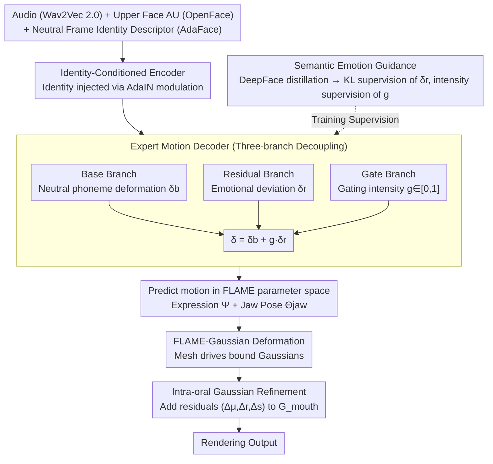

# EmoTaG: Emotion-Aware Talking Head Synthesis on Gaussian Splatting with Few-Shot Personalization

**Conference**: CVPR 2026  
**arXiv**: [2603.21332](https://arxiv.org/abs/2603.21332)  
**Code**: Yes (Project page)  
**Area**: 3D Vision / Talking Head Synthesis  
**Keywords**: 3D Gaussian Splatting, Talking Head, Emotion-Aware, Few-Shot, FLAME

## TL;DR

EmoTaG is proposed, an emotion-aware 3D talking head synthesis framework based on a FLAME-Gaussian structural prior and a Gated Residual Motion Network (GRMN). It achieves few-shot personalization with only 5 seconds of video while balancing emotional expression, lip-sync, and geometric stability.

## Background & Motivation

Audio-driven 3D talking head synthesis has made significant progress with the development of NeRF and 3D Gaussian Splatting (3DGS). The existing Pretrain-and-Adapt (PAA) paradigm can adapt to new identities using a few seconds of video, but two core issues remain:

**Lack of explicit emotion modeling**: Existing few-shot methods (e.g., InsTaG, FIAG) primarily target neutral speech and fail to capture emotion-driven facial movements. Visualization experiments (Fig. 2) demonstrate that the complexity of mouth movements in emotional audio is significantly higher than in neutral audio (standard deviations of 7.88 vs. 3.11).

**Geometric instability**: Unconstrained deformation directly on 3DGS leads to severe geometric distortion under intense expressions, particularly in emotional scenarios.

**Core Problem**: Can few-shot 3D talking head synthesis go beyond neutral speech to support emotion-aware facial animation?

## Method

### Overall Architecture

EmoTaG aims to enable a 3D talking head to not only sync lips but also produce exaggerated yet stable expressions following the emotions in the audio using only a few seconds of video. The framework is decomposed into two layers (Fig. 3). The bottom layer is a **FLAME-Gaussian model**, which binds 3D Gaussians to the FLAME facial mesh. Motion drives the FLAME model rather than the Gaussians directly, with geometric stability ensured by the mesh topology. The top layer is the **Gated Residual Motion Network (GRMN)**: an Identity-Conditioned Encoder first fuses audio, expression, and identity information into a condition; then, an Expert Motion Decoder predicts frame-wise facial motion parameters, which are fed back to the FLAME model for deformation and rendering.

Training follows a two-step Pretrain-and-Adapt process: a general "audio-to-motion" prior is learned from multi-identity corpora during pre-training; in the adaptation phase, the main GRMN is frozen, and a small number of AdaIN parameters are fine-tuned for new identities.

### Key Designs

**1. Predicting motion in FLAME parameter space: Using explicit geometric priors to prevent collapse under emotional expressions**

Direct unconstrained deformation on 3DGS is prone to geometric distortion during large emotional expressions (e.g., staring, grinning). EmoTaG changes the prediction target: the network outputs FLAME expression parameters $\Psi$ and jaw pose $\Theta_{jaw}$ instead of Gaussian displacements. The deformation of the FLAME mesh then drives the bound Gaussians. This constrains all motion within the low-dimensional parameter space of FLAME, providing "anatomical plausibility" to the deformation and preventing facial tearing during intense expressions.

**2. Identity-Conditioned Encoder: Injecting identity into the audio stream for efficient adaptation**

The key to few-shot identity switching is decoupling "how to pronounce/move" from "who it is." The encoder extracts speech embeddings using Wav2Vec 2.0, supplemented with temporal and prosodic information via 1D CNN + Transformer. Simultaneously, AU parameters from OpenFace provide upper face information, and identity descriptors $s$ are extracted from neutral frames using AdaFace. Identity is injected through **AdaIN modulation** rather than simple concatenation, where identity determines the mean/variance scaling of features. This allows for fast adaptation: the main network is frozen, and only these AdaIN affine parameters are fine-tuned.

**3. Expert Motion Decoder: Decoupling neutral pronunciation and emotional fluctuations via three branches**

Emotional motion is challenging because its intensity varies frame-to-frame and must be superimposed on normal pronunciation. The decoder is split into three paths: the Base branch learns the identity-independent neutral "audio-to-mouth" mapping ($\delta_b$); the Residual branch captures emotional deviations ($\delta_r$) via an EMO Encoder-Decoder; and the Gate branch predicts a scalar $g\in[0,1]$ to determine the emotional contribution per frame. The final motion is:

$$\delta = \delta_b + g \cdot \delta_r$$

This gating mechanism allows frames with no emotion ($g\to 0$) to revert to neutral speech while emotional peaks ($g\to 1$) release the residuals, preventing over-exaggeration while adaptively adjusting intensity.

**4. Semantic Emotion Guidance: Distillation via DeepFace to bypass coarse manual annotations**

Fine-grained supervision for residual and gate branches is unavailable, and manual labels are often coarse. EmoTaG distills knowledge from a pre-trained DeepFace emotion recognizer: the seven-class emotion distribution $p_{emo}$ supervises the residual branch (KL alignment), and the emotion intensity scalar $e = 1 - p(\text{neutral})$ supervises the gate branch (regression alignment). This provides continuous, frame-wise, distribution-level supervision.

**5. Intra-oral Gaussian Refinement: Modeling teeth and tongue outside FLAME**

The FLAME mesh does not model the oral interior, but visible teeth and tongue are crucial for realism. EmoTaG identifies a subset of Gaussians $G_{mouth}$ within the oral region using lip landmarks and predicts residual offsets $(\Delta\mu, \Delta r, \Delta s)$ (position, rotation, scale) for them, compensating for structural prior limitations at the Gaussian level.

### Loss & Training

The total loss consists of four parts: $L = L_{Render} + L_{KL} + L_{Score} + L_{Geo}$

| Loss | Formula/Description | Function |
|------|-----------|------|
| $L_{Render}$ | $L1 + \lambda \cdot (1-SSIM)$ | Pixel and perceptual structural fidelity |
| $L_{KL}$ | $KL(p_{emo} \parallel \text{Softmax}(z_e))$ | Residual branch alignment with teacher distribution |
| $L_{Score}$ | $\|g_{pred} - e\|$ | Gating branch regression of intensity scalar |
| $L_{Geo}$ | $L_D(D, D_{GT}) + L_N(N, N_{GT})$ | Depth/Normal geometric constraints (Adaptation only) |

- Pre-training: 250K iterations, $lr=5e-3$
- Adaptation: 20K iterations, $lr=5e-4$, fine-tuning only AdaIN parameters
- Inference: Audio encoding ~25ms, GRMN ~6ms/frame, 3DGS rendering ~7ms/frame

## Key Experimental Results

### Main Results (Self-reconstruction + 5s training data)

| Method | PSNR↑ | LPIPS↓ | LMD↓ | AUE↓ | Sync-C↑ | Training Time | FPS |
|------|-------|--------|------|------|---------|---------|-----|
| ER-NeRF | 28.21 | 0.038 | 3.549 | 1.314/0.466 | 3.142 | 2h | 33.2 |
| TalkingGaussian | 28.43 | 0.034 | 3.582 | 1.167/0.401 | 3.631 | 27min | 118.4 |
| InsTaG | 28.92 | 0.029 | 3.145 | 0.921/0.407 | 5.329 | 13min | 82.5 |
| MimicTalk | 25.26 | 0.071 | 3.478 | 0.964/0.781 | 6.341 | 17min | 8.6 |
| **Ours** | **30.02** | **0.019** | **2.221** | **0.685/0.210** | 6.212 | **11min** | 76.4 |

### Ablation Study (Emotional test set)

| Variant | PSNR↑ | LPIPS↓ | LMD↓ | Sync-C↑ |
|------|-------|--------|------|---------|
| Full Model | 29.95 | 0.022 | 2.456 | 6.147 |
| w/o Score Distill | 29.52 | 0.026 | 2.731 | 5.874 |
| w/o KL Distill | 29.36 | 0.031 | 2.985 | 5.712 |
| w/o SEG | 29.01 | 0.034 | 3.067 | 5.541 |
| w/o Gate Branch | 28.77 | 0.036 | 3.358 | 5.004 |
| w/o Residual Branch | 28.52 | 0.038 | 3.572 | 4.896 |
| w/o AdaIN | 28.38 | 0.040 | 4.021 | 4.621 |

### Key Findings

1. **AdaIN identity modulation is critical**: LMD increases from 2.456 to 4.021 without it, highlighting the importance of identity decoupling in multi-identity learning.
2. **Strong generalization of emotion intensity**: Adaptation on Level-2 results in optimal performance on Level-1/3 testing, with larger advantages in high-intensity scenarios.
3. **Cross-identity/Cross-lingual OOD generalization**: EmoTaG leads in cross-identity (Sync-E: 9.133) and cross-lingual (Sync-E: 9.662) scenarios.
4. **User Study**: Highest scores in emotional expression (4.50), lip-sync (4.70), and visual realism (4.60).

## Highlights & Insights

- The approach of **structured representation + emotional decoupling** is effective: motion prediction in the FLAME space ensures stability, while the Base/Residual/Gate branches decouple speech from emotion.
- **Knowledge distillation replaces manual labeling**: Using DeepFace to provide dual emotion supervision avoids the coarseness of discrete labels.
- **Minimalist adaptation strategy**: Freezing the main network and only fine-tuning AdaIN parameters balances efficiency with personalization quality.
- Independent oral region refinement successfully compensates for the lack of internal modeling in the FLAME prior.

## Limitations & Future Work

1. Dependency on external pose & expression frames during inference prevents pure audio-driven operation.
2. Emotion distillation depends on the specific DeepFace model; its recognition accuracy directly affects training quality.
3. Training on only 70 identities limits generalization to diverse ethnicities or extreme expressions.
4. Smooth control for multi-emotion blending or transitions remains unexplored.

## Related Work & Insights

- **InsTaG** (CVPR 2025) pioneered the few-shot PAA paradigm but lacks emotional modeling.
- **EMOTE / EmoVOCA** use manually annotated FLAME training, limited by coarse labels.
- **EmoTalk3D** achieves emotional synthesis on 3DGS but requires person-specific optimization.
- Insight: The gated residual mechanism could be extended to other generation tasks requiring "base + variation" decoupling.

## Rating

- **Novelty**: ⭐⭐⭐⭐ — Sophisticated combination of FLAME priors, gated residual decoupling, and teacher distillation.
- **Experimental Thoroughness**: ⭐⭐⭐⭐⭐ — Comprehensive evaluation across neutral, emotional, cross-intensity, cross-identity, and cross-lingual scenarios.
- **Writing Quality**: ⭐⭐⭐⭐ — Clear structure with a logical flow from motivation to method and experiments.
- **Value**: ⭐⭐⭐⭐ — Addresses the gap in few-shot 3D talking heads regarding the emotional dimension with high deployment potential.

<!-- RELATED:START -->

## Related Papers

- [\[ICLR 2026\] FastGHA: Generalized Few-Shot 3D Gaussian Head Avatars with Real-Time Animation](../../ICLR2026/3d_vision/fastgha_generalized_few-shot_3d_gaussian_head_avatars_with_real-time_animation.md)
- [\[CVPR 2026\] Cross-Instance Gaussian Splatting Registration via Geometry-Aware Feature-Guided Alignment](cross-instance_gaussian_splatting_registration_via_geometry-aware_feature-guided.md)
- [\[CVPR 2026\] FlexAvatar: Flexible Large Reconstruction Model for Animatable Gaussian Head Avatars with Detailed Deformation](flexavatar_flexible_large_reconstruction_model_for_animatable_gaussian_head_avat.md)
- [\[CVPR 2026\] Few-Shot Incremental 3D Object Detection in Dynamic Indoor Environments](few-shot_incremental_3d_object_detection_in_dynamic_indoor_environments.md)
- [\[CVPR 2026\] GeoDiff4D: Geometry-Aware Diffusion for 4D Head Avatar Reconstruction](geodiff4d_geometry-aware_diffusion_for_4d_head_avatar_reconstruction.md)

<!-- RELATED:END -->
