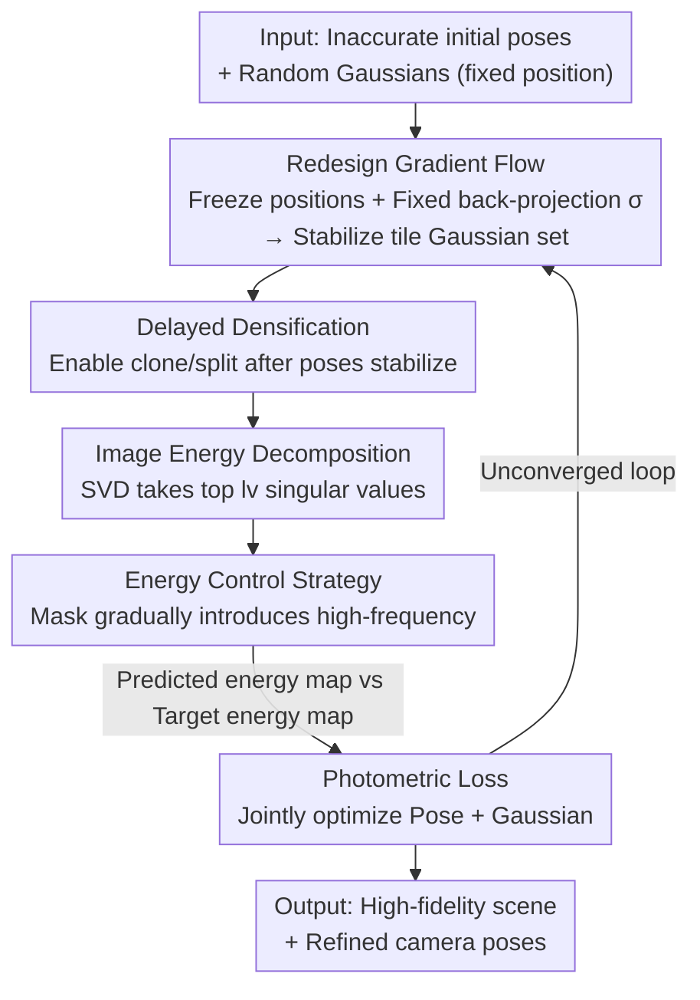

# Energy-GS: Image Energy-guided Pose Alignment Gaussian Splatting with redesigned pose gradient flow

**Conference**: CVPR 2026  
**Paper**: [CVF Open Access](https://openaccess.thecvf.com/content/CVPR2026/html/Gao_Energy-GS_Image_Energy-guided_Pose_Alignment_Gaussian_Splatting_with_redesigned_pose_CVPR_2026_paper.html)  
**Code**: https://github.com/SkylerGao/ENGS  
**Area**: 3D Vision  
**Keywords**: 3D Gaussian Splatting, Camera Pose Joint Optimization, Pose Gradient Stability, Image Energy Decomposition, coarse-to-fine alignment  

## TL;DR
Energy-GS utilizes only RGB images to simultaneously optimize 3D Gaussian Splatting scenes and inaccurate camera poses. By "freezing Gaussian positions," pose gradients are stabilized, and an image singular value energy decomposition is employed to simulate NeRF-like coarse-to-fine alignment. This approach achieves SOTA pose accuracy on synthetic and real datasets, with rendering quality on par with BARF/3R-GS.

## Background & Motivation

**Background**: NeRF and 3DGS both rely on accurate camera poses, but precise poses are often unavailable in real-world scenes. A mainstream approach is to treat inaccurate initial poses as learnable parameters for joint optimization with the scene representation, a strategy extensively explored and proven effective in the NeRF family (e.g., BARF, SC-NeRF, NoPe-NeRF).

**Limitations of Prior Work**: This same idea fails when applied to 3DGS. Existing 3DGS joint optimization methods almost always require additional priors or constraints to function: ISplat/NopoSplat relies on dense stereo models for global initialization, CF-GS/PCR-GS requires temporal continuity between sequential frames, and 3R-GS/GS-CPR depends on depth cues and feature matching. Without these external aids, RGB-only 3DGS joint optimization typically fails to converge.

**Key Challenge**: The authors attribute the failure of RGB-only 3DGS to two root causes. First, 3DGS is a point-cloud-based rendering method where Gaussians undergo densification (cloning/splitting), pruning, and position updates. This causes the **set of Gaussians involved in any given pixel's pose gradient calculation to change constantly**, leading to discontinuous and jittery gradients. In contrast, NeRF uses a global MLP with a fixed number of learnable parameters, resulting in stable gradients. Second, NeRF's positional encoding frequency control naturally enables coarse-to-fine alignment (as done in BARF). 3DGS rasterization lacks such a spatial sampling "knob," making direct photometric alignment on full-resolution RGB images highly susceptible to poor local optima.

**Goal**: To perform joint optimization of 3DGS scenes and camera poses using **only RGB images without any additional priors/constraints**, addressing two sub-problems: (1) stabilizing pose gradients and (2) creating a coarse-to-fine alignment mechanism for 3DGS.

**Core Idea**: Use "frozen Gaussian positions + fixed back-projection standard deviation" to achieve stable pose gradients, and substitute NeRF's frequency annealing with image SVD energy decomposition (gradually introducing high-energy components after low-energy ones) to enable progressive alignment under pure RGB settings.

## Method

### Overall Architecture

Energy-GS starts with a set of **inaccurate initial camera poses** and a collection of **randomly initialized Gaussians with fixed positions**. The pipeline modifies the original 3DGS in two critical areas:

1.  **Stabilizing Pose Gradients**: Gaussian positions are removed from the learnable parameters (avoiding position drift from split/clone), and the standard deviation used for back-projection to the ground-truth is fixed. This ensures the set of Gaussians corresponding to each rendering tile stays consistent across iterations, preventing random gradient jitter. Poses are parameterized as learnable variables and optimized alongside the scene.
2.  **Creating Coarse-to-Fine Alignment**: SVD energy decomposition is applied to each ground-truth supervision image. Only low-energy (low-frequency) components are exposed in early training, with high-energy details gradually introduced via a controllable mask. This forces 3DGS to align large-scale structures before refining details, avoiding local optima.

Finally, a **photometric loss** between the predicted energy map and the target energy map supervises both pose refinement and scene reconstruction. The overall pipeline is as follows:

### Key Designs

**1. Redesigning Pose Gradient Flow: Freezing Gaussian positions + Fixed back-projection standard deviation to lock the "Gaussian set participating in gradients"**

This step addresses pose gradient jitter. In original 3DGS, the set of Gaussians actually participating in the rendering of a specific tile $B$ is determined by the 3σ rule: $\text{Set}^{gs}_B = \{g_i \in P \mid r(g_i) < 3\sigma\}$, where $r(g)$ is the projected radius and $\sigma$ is the projected standard deviation. The issue is that Gaussian positions and $\sigma$ change during training, meaning the membership of this set fluctuates. By denoting learnable parameters as $\omega^v_{gs}=\{g_1,\dots,g_n\}$, the pose gradient $G^{pose}_{gs}(v)=F(\omega^v_{gs})$ has inputs $\omega^v_{gs}(k_1)\neq\omega^v_{gs}(k_2)$ at different iterations $k_1, k_2$, causing discontinuity.

Energy-GS adopts a two-pronged approach: first, it **disables updates to Gaussian positions and stops split/clone** during the pose alignment phase; second, it **fixes the standard deviation used for back-projection to the ground-truth signals to the tile length $t$** (while $\sigma$ remains learnable during rendering), such that:
$$\text{OurSet}^{gs}_B = \{g'_i = g_i,\ r(g'_i) \leftarrow t \mid g_i \in P\}.$$
This locks the Gaussian set per tile across iterations and **forces some Gaussians to simultaneously participate in the rendering of overlapping signal regions**. A 1D signal alignment toy task confirms that **freezing the Gaussians shared between two signal segments** is crucial for reliable alignment—densification and learnable positions otherwise lead to independent Gaussian behavior, breaking alignment.

**2. Delayed Densification: Enable clone/split only after poses stabilize**

Densification inherently changes the number of Gaussians participating in a view, which would disrupt the stabilized sets if enabled too early. Energy-GS triggers densification based on the energy progress $s$:
$$s = \min\{\text{step} \in \{1,\dots,N\} \mid l_v(\text{step}) > L\},$$
where $l_v(x)$ is the energy level at step $x$ and $L$ is a preset threshold ($L{=}20$ for synthetic, $L{=}50$ for Mip-NeRF360). Essentially, clone/split is reactivated once the energy level suggests the poses have stabilized. Note: although positions are not updated in this phase, **position gradients are still back-propagated** because clone/split relies on these gradients to identify where Gaussians should be densified.

**3. Image Energy Decomposition: Creating a "frequency knob" for 3DGS using SVD singular values**

While NeRF uses positional encoding frequency annealing for coarse-to-fine alignment, 3DGS rasterization lacks this mechanism. The authors substitute this with SVD: for a multi-view image $I = U\Sigma V^T$, where $\Sigma=\text{diag}(\sigma_1,\dots,\sigma_r)$. Total image energy is defined as $E=\sum_{i=1}^{n}\sigma_i^2$ ($\sigma_1\geq\dots\geq\sigma_n>0$), with $n$ being the maximum energy level. Given an energy level $l_v$, the corresponding energy map uses the first $l_v$ singular components:
$$I_E = U_{l_v}\Sigma_{l_v}V^T_{l_v} = \sum_{i=0}^{l_v} u_i\sigma_i v_i^T.$$
Low-energy components represent large-scale structures (brightness, texture distribution), while high-energy components contain high-frequency details. Retaining only the first $l_v$ singular values provides a progressive supervision signal from coarse to fine.

**4. Image Energy Control Strategy: Using a smooth mask to gradually introduce high frequencies**

To ensure smooth transitions, Energy-GS applies a mask $\omega(\alpha)$ to the energy components, where $\alpha\in[0,T]$ ($T<1$) represents optimization progress. The weighted components are reconstructed into the supervision ground-truth:
$$I_E(\alpha) = (\omega(\alpha)\cdot U_{l_v})\cdot(\omega(\alpha)\cdot\Sigma_{l_v})\cdot(\omega(\alpha)\cdot V^T_{l_v}),$$
using a logarithmic weight $\omega(\alpha) = \log_{10}((\alpha - \tfrac{l_v}{n})\cdot 255)/255$. A critical empirical correction: the $l_v=1$ layer contains the most fundamental brightness/texture info. If it were progressively exposed, it would cause severe pose jitter early on; thus, the singular value and vectors for $l_v=1$ are **fully preserved throughout training**, and the annealing in Eq. (9) only applies to $l_v>1$.

### Loss & Training

The supervision signal is the **photometric loss** between the predicted energy map and the target energy map $I_E(\alpha)$, which back-propagates to both camera poses and Gaussian parameters. Configuration: Single RTX 4090 (24GB), PyTorch 2.6.0; 50,000 iterations for synthetic sets ($L{=}20$), 100,000 for Mip-NeRF360 ($L{=}50$). Baselines use default hyperparameters from their official implementations.

## Key Experimental Results

### Main Results

Rendering quality on synthetic datasets (selected scenes; baselines include BARF, SC-NeRF, CF-GS, 3R-GS, and vanilla 3DGS with pose gradients):

| Scene | Metric | BARF | 3R-GS | 3DGS(+pose) | Ours |
|------|------|------|-------|-------------|------|
| chair | PSNR↑ | 28.35 | 17.17 | 15.53 | **29.81** |
| ficus | PSNR↑ | 25.57 | 17.34 | 16.07 | **26.90** |
| hotdog | PSNR↑ | 31.90 | 16.02 | 15.72 | **32.90** |
| lego | PSNR↑ | 26.92 | 12.48 | 10.76 | **30.35** |
| counter (Real) | PSNR↑ | 10.39 | 12.64 | 10.55 | **21.67** |
| garden (Real) | PSNR↑ | 11.54 | 25.23 | 13.64 | 22.16 |

Pose estimation accuracy (Rotation Error / ATE, lower is better):

| Scene | Metric | BARF | 3R-GS | 3DGS(+pose) | Ours |
|------|------|------|-------|-------------|------|
| chair | Rotation(°)↓ | 1.525 | 85.756 | 13.692 | **1.177** |
| ficus | ATE(m)↓ | 0.043 | 1.101 | 0.185 | **0.014** |
| hotdog | Rotation(°)↓ | 0.653 | 105.194 | 5.875 | **0.054** |
| lego | ATE(m)↓ | 0.023 | 1.080 | 0.231 | **0.002** |
| counter | ATE(m)↓ | 0.054 | 1.092 | 0.234 | **0.015** |

Ours matches BARF in rendering on synthetic sets while achieving the best pose accuracy among all methods (especially in weak-texture scenes). Performance on real Mip-NeRF360 scenes is comparable to 3R-GS. Note that vanilla 3DGS with pose gradients (without the proposed strategies) fails to converge on synthetic sets (PSNR 10–16), confirming that standard 3DGS joint optimization collapses under pure RGB.

### Ablation Study

Incremental addition of components on the synthetic ship scene (Table 4):

| Config | Gradient Flow | Energy Control | PSNR↑ | SSIM↑ | LPIPS↓ | Rotation(°)↓ | ATE(m)↓ |
|------|--------|----------|-------|-------|--------|--------------|---------|
| (a) | × | × | 8.08 | 0.615 | 0.518 | 8.572 | 0.179 |
| (b) | ✓ | × | 12.38 | 0.681 | 0.445 | 7.087 | 0.150 |
| (c) Full | ✓ | ✓ | **24.12** | **0.813** | **0.235** | **1.065** | **0.011** |

The 1D toy task (Table 1) further validates the design: the "Original" config reached PSNR 21, "Redesigned" reached 25, while "Redesigned + Energy" reached 54.8/63.2 with ATE dropping to 0.0001.

### Key Findings
- **Both components are indispensable, with energy control being the primary driver**: Redesigning gradient flow alone (b) only slightly improves PSNR from 8.08 to 12.38 compared to vanilla pose optimization (a). The energy control strategy (c) is what drastically lifts PSNR to 24.12 and reduces ATE by two orders of magnitude. Gradient stability is the prerequisite, but coarse-to-fine energy scheduling escapes local optima.
- **Mitigation of "multi-shell" failure modes**: Even with stable gradients, joint optimization often suffers from "multi-shell" artifacts (nested scene layers) common in NeRF; the progressive alignment strategy significantly suppresses this.
- **Maximum benefit in weak-texture scenes**: On synthetic sets with sparse textures, the proposed method leads significantly because stable gradients and progressive exposure prevent optimization from being misled by high-frequency noise.

## Highlights & Insights
- **"Frequency Annealing" as "Singular Value Energy Annealing"**: The authors ingeniously replicate NeRF's frequency annealing by manipulating the SVD spectrum of supervision images. This "finding the annealing knob in a different domain" approach is highly transferable to other renderers lacking explicit frequency control.
- **Counter-intuitive "Frozen Positions" addressing the root cause**: Gradient jitter in 3DGS stems from dynamic Gaussian sets. Instead of complex gradient smoothing, the authors enforce the most basic principle—maintaining the consistency of the learnable variable set—to solve stability.
- **1D Toy Task for Mechanism Validation**: Reducing 3D joint optimization to 1D signal alignment $s(x)=H(x+T;g)$ allows clean isolation of variables, proving that densification and learnable positions are harmful to early alignment.
- **Engineering detail of $l_v=1$ preservation**: Preserving the base energy layer avoids initial pose shock, a classic example of "theoretical framework + empirical refinement."

## Limitations & Future Work
- **Validation largely limited to object-centric synthetic and Mip-NeRF360**: There are no results for large-scale cityscapes or outdoor driving scenes, despite the target applications being SLAM and visual localization.
- **Real-world performance "comparable to 3R-GS"**: While SOTA on synthetic sets, the performance on Mip-NeRF360 does not significantly exceed 3R-GS, suggesting pure RGB may have upper limits in complex real-world scenes.
- **Manual tuning of energy thresholds/weights**: $L$, $T$, and $\omega(\alpha)$ are empirically determined and vary by dataset. Adaptive energy scheduling is a natural future direction.
- **Densification timing depends on energy level triggers**: If the energy climb is irregular, the onset of clone/split may become unstable.

## Related Work & Insights
- **vs BARF**: BARF uses positional encoding annealing for NeRF; this work applies the same coarse-to-fine philosophy to 3DGS using SVD energy annealing. Same philosophy, different implementation.
- **vs 3R-GS / ISplat / CF-GS**: These methods rely on extra priors (stereo, depth cues, sequence consistency). Energy-GS excels by **removing all such dependencies**, making it more general-purpose at the cost of being only "comparable" on real datasets.
- **vs Vanilla 3DGS + Pose Gradients**: Standard 3DGS joint optimization almost always fails on pure RGB; this work provides a mechanism-level solution via gradient stabilization and energy annealing.

## Rating
- Novelty: ⭐⭐⭐⭐⭐ 
- Experimental Thoroughness: ⭐⭐⭐⭐ 
- Writing Quality: ⭐⭐⭐⭐ 
- Value: ⭐⭐⭐⭐ 

<!-- RELATED:START -->

## Related Papers

- [\[CVPR 2026\] Cross-Instance Gaussian Splatting Registration via Geometry-Aware Feature-Guided Alignment](cross-instance_gaussian_splatting_registration_via_geometry-aware_feature-guided.md)
- [\[CVPR 2026\] E2EGS: Event-to-Edge Gaussian Splatting for Pose-Free 3D Reconstruction](e2egs_event-to-edge_gaussian_splatting_for_pose-free_3d_reconstruction.md)
- [\[CVPR 2026\] Rethinking Pose Refinement in 3D Gaussian Splatting under Pose Prior and Geometric Uncertainty](rethinking_pose_refinement_in_3d_gaussian_splatting_under_pose_prior_and_geometr.md)
- [\[CVPR 2026\] TokenSplat: Token-aligned 3D Gaussian Splatting for Feed-forward Pose-free Reconstruction](tokensplat_token-aligned_3d_gaussian_splatting_for_feed-forward_pose-free_recons.md)
- [\[CVPR 2026\] OrienPose: Orientation-Guided Novel View Synthesis for Single-Image Unseen Object Pose Estimation](orienpose_orientation-guided_novel_view_synthesis_for_single-image_unseen_object.md)

<!-- RELATED:END -->
