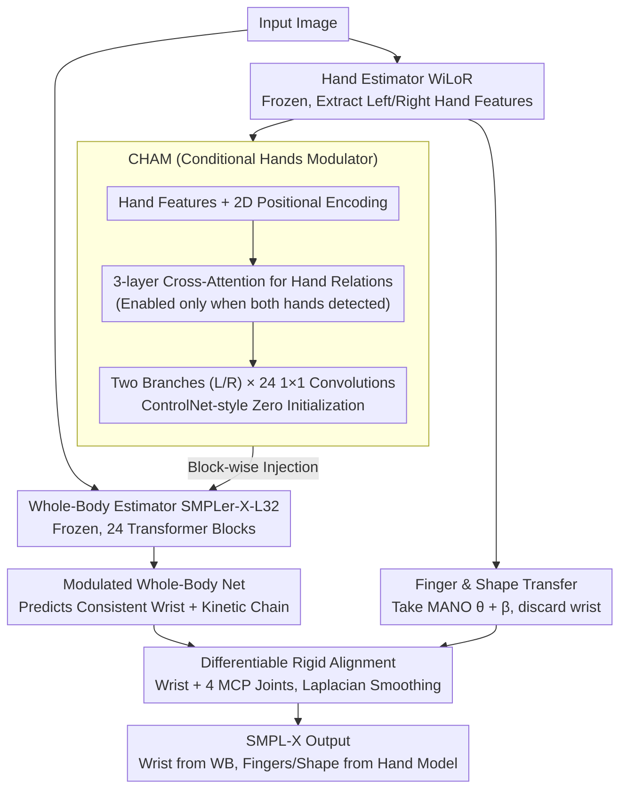

# Enhancing Hands in 3D Whole-Body Pose Estimation with Conditional Hands Modulator

**Conference**: CVPR 2026  
**arXiv**: [2603.14726](https://arxiv.org/abs/2603.14726)  
**Code**: [Available](https://mks0601.github.io/Hand4Whole-plus-plus)  
**Area**: 3D Vision  
**Keywords**: Whole-Body Pose Estimation, Hand Pose, SMPL-X, Feature Modulation, Modular Framework

## TL;DR

Ours proposes the Hand4Whole++ modular framework, which injects features from a pre-trained hand estimator into a frozen whole-body estimator via a lightweight CHAM module. This achieves precise wrist orientation prediction and transfers fine finger joints and hand shapes from a hand model using differentiable rigid alignment.

## Background & Motivation

3D whole-body pose estimation faces a fundamental **supervision gap**:

- **Whole-body datasets** (e.g., AGORA, ARCTIC): Provide whole-body annotations but lack hand pose diversity.
- **Hand datasets** (e.g., InterHand2.6M): Provide fine finger annotations but lack whole-body context.

This leads to:
1. Whole-body estimators (e.g., SMPLer-X) capturing global structure while lacking hand precision.
2. Hand estimators (e.g., WiLoR, HaMeR) producing high finger accuracy but lacking global body awareness.

**Naive combination** (directly attaching hand outputs to the body) results in wrist orientations inconsistent with the upper-limb kinetic chain, producing physically implausible poses.

**Key Challenge**: How to acquire fine hand details while maintaining whole-body consistency?

## Method

### Overall Architecture

This paper addresses the contradiction where whole-body and hand estimators "each have strengths but do not fit together": the former understands global structure but has blurry hands, while the latter has fine fingers but is blind to the upper-limb kinetic chain. Hand4Whole++ does not retrain either; instead, it preserves two **pre-trained and frozen** experts—the whole-body estimator SMPLer-X-L32 and the hand estimator WiLoR—and inserts a lightweight, trainable bridge called the Conditional Hands Modulator (CHAM).

The pipeline operates as follows: an input image is fed to both estimators; WiLoR extracts high-quality features for both hands, which CHAM "modulates" into the whole-body estimator's feature stream. This allows the whole-body network to predict wrist orientations consistent with the upper-limb chain. Finally, a differentiable transfer step moves the fine finger joints and shapes from WiLoR to the whole-body mesh. In the final SMPL-X parameters, **wrist orientation is derived from the modulated whole-body network, while fingers and hand shape come from the hand model.**

### Key Designs

**1. CHAM: Modulating the whole-body network with frozen hand expert features, rather than crude concatenation**

Naive combination fails because hand estimators are unaware of shoulder and elbow positions, leading to wrist orientations that conflict with the upper-limb chain. CHAM avoids this by taking final-layer features from WiLoR's ViT backbone, adding 2D positional encoding to maintain spatial context, and using a 3-layer cross-attention Transformer to model relations between hands (active only in two-hand scenarios). Modulation is performed by two independent branches (left/right), each containing 24 $1\times1$ convolution layers corresponding to the 24 Transformer blocks in SMPLer-X. Following the **ControlNet** philosophy, these layers are **zero-initialized** to ensure the pre-trained features are not disrupted at the start of training. To align features, CHAM uses inverse affine transforms to map hand features back to the whole-body feature map space. This injection not only corrects the wrist but refines the entire upper-limb chain (shoulder, elbow, wrist), improving overall body pose quality with an overhead of only ~10ms.

**2. Finger Joint and Hand Shape Transfer: Differentiably "pasting" fine fingers back to the whole-body mesh**

While CHAM handles wrist orientation, WiLoR remains superior for finger articulation and shape. The transfer step adopts MANO finger poses $\theta_{rh}, \theta_{lh}$ and shapes $\beta_{rh}, \beta_{lh}$ from the hand estimator, discarding its predicted wrist orientation in favor of the CHAM-modulated whole-body wrist. These parameters are aligned via **rigid alignment** based on the wrist and four MCP joints, using Laplacian smoothing at the seams. Crucially, this alignment is **fully differentiable**, allowing gradients to flow back to CHAM so that wrist orientation and finger transfer are optimized end-to-end. MANO shapes are preferred over SMPL-X because SMPL-X encodes body/hand/face in a shared latent space, whereas MANO's specialized space provides higher precision (point-to-point error 1.34mm vs 1.98mm for SMPL-X).

### Loss & Training

Pre-trained estimators are frozen, and only CHAM is optimized:

- **Pose Loss**: $\ell_1$ distance for 3D joint rotations; hand datasets use forward kinematics to derive global wrist orientation.
- **Shape Loss**: $\ell_1$ for whole-body datasets; $\ell_2$ regularization for hand datasets.
- **2D/3D Keypoint Loss**: $\ell_1$ loss with coordinate frames tailored to the dataset (pelvis/wrist-relative).
- **Body Root Pose Regularization**: When whole-body annotations are missing in hand datasets, SMPL-X root pose is regularized to maintain a vertical torso.

Training data includes InterHand2.6M, ReInterHand, ARCTIC, and AGORA. 4 epochs, batch size 32, ~20 hours on a single RTX A6000.

## Key Experimental Results

### Main Results

**Table 1: Comparison with baselines on whole-body and hand datasets (MPVPE/MRRPE, mm)**

| Method | AGORA Full/Hands | ARCTIC Full/Hands | EHF Full/Hands | IH26M MPVPE/MRRPE | ReIH MPVPE/MRRPE |
|------|------------------|-------------------|----------------|---------------------|-------------------|
| Original WB Model | 85.61/52.31 | 56.06/31.48 | 63.26/46.21 | 38.64/119.56 | 58.86/101.82 |
| Fine-tuned WB Model | 90.77/55.91 | 67.52/29.03 | 126.34/57.35 | 20.00/47.89 | 24.87/28.32 |
| Hand Model Only | -/99.11 | -/46.79 | -/46.28 | 11.17/94817 | 8.09/3094 |
| **Hand4Whole++ (Ours)** | **76.84/49.71** | **45.95/25.03** | **61.24/33.43** | **9.40/32.30** | **7.98/16.37** |

**Table 4: Comparison with SOTA whole-body methods**

| Method | AGORA Full/Hands | ARCTIC Full/Hands | EHF Full/Hands |
|------|------------------|-------------------|----------------|
| Hand4Whole | 185.18/74.55 | 151.47/47.79 | 76.84/39.82 |
| OSX | 178.28/76.37 | 111.42/50.70 | 70.82/53.73 |
| SMPLer-X | 85.61/52.31 | 56.06/31.48 | 63.26/46.21 |
| **Hand4Whole++ (Ours)** | **76.84/49.71** | **45.95/25.03** | **61.24/33.43** |

### Ablation Study

**Table 2: Ablation of whole-body and hand model combination strategies (AGORA, MPVPE)**

| Strategy | Full-Body Error | Hand Error |
|------|----------|----------|
| Original WB Model | 84.76 | 52.31 |
| Direct Wrist Copying | 90.70 | 100.59 |
| **CHAM Modulation (Ours)** | **76.88** | **50.56** |

**Table 3: Ablation of finger joint and shape transfer (MPVPE/MRRPE)**

| Finger | Shape | IH26M | ReIH | HIC |
|--------|-------|-------|------|-----|
| ✗ | ✗ | 14.69 | 18.13 | 21.68 |
| ✓ | ✗ | 12.26 | 15.24 | 19.61 |
| ✓ | ✓ | **9.40** | **7.98** | **17.72** |

### Key Findings

1. **Fine-tuning whole-body models is counterproductive**: Overfitting on hand datasets caused EHF full-body error to double (63 to 126mm).
2. **Direct wrist copying is catastrophic**: Hand error increased from 52 to 101mm because the hand estimator is blind to the upper-limb chain.
3. **CHAM improves both hands and body**: Full-body error dropped from 84.76 to 76.88mm by optimizing the entire upper-limb kinetic chain.
4. **Shape transfer provides significant gains**: The MANO hand shape space (1.34mm error) is far superior to the SMPL-X space (1.98mm).
5. Hand estimators show massive MRRPE (WiLoR: 94817mm), proving that independently predicted hands lack global consistency.

## Highlights & Insights

1. **Frozen+Modulation Philosophy**: Preserves pre-trained capabilities via lightweight bridging, avoiding catastrophic forgetting.
2. **ControlNet Adaptation**: Successfully transfers zero-initialization modulation concepts to the pose estimation domain.
3. **Analysis of Combination Failures**: Provides a clear explanation of why simple output merging is insufficient.
4. **Dynamic Cross-Attention**: Flexibly handles single and double hand scenarios.

## Limitations & Future Work

1. Hand-only datasets lack whole-body labels, leading to weak supervision and potential image misalignment for non-hand joints.
2. Dependence on two pre-trained models increases latency (total ~0.1s/frame, with WiLoR taking 50%).
3. Not formally validated in egocentric scenarios beyond preliminary observations.
4. CHAM's design assumes a maximum of two hands, limiting applications in multi-person interaction scenes.

## Related Work & Insights

- **Relation to ControlNet**: Borrowed the philosophy of lightweight modulation of pre-trained models, but applied to estimation rather than generation.
- **Difference from FrankMocap/Hand4Whole**: Those methods used output concatenation or joint-level fusion; ours uses deep feature modulation.
- **Difference from HMR-Adapter**: HMR-Adapter interpolates body features for hands, whereas ours injects high-fidelity features from an external hand expert.
- **Insight**: The "expert modulation" paradigm could be extended to other components like feet or facial expressions.

## Rating

- Novelty: ⭐⭐⭐⭐ — CHAM is cleverly designed, though it is a natural extension of ControlNet.
- Experimental Thoroughness: ⭐⭐⭐⭐⭐ — Validated on 6 datasets with comprehensive ablations.
- Writing Quality: ⭐⭐⭐⭐⭐ — Clear motivation, excellent comparative analysis, and detailed failure case discussions.
- Value: ⭐⭐⭐⭐ — Highly practical, 10fps performance, and a modular design that is easy to integrate.

<!-- RELATED:START -->

## Related Papers

- [\[CVPR 2026\] Cov2Pose: Leveraging Spatial Covariance for Direct Manifold-aware 6-DoF Object Pose Estimation](cov2pose_leveraging_spatial_covariance_for_direct_manifold-aware_6-dof_object_po.md)
- [\[CVPR 2026\] Coherent Human-Scene Reconstruction from Multi-Person Multi-View Video in a Single Pass](coherent_humanscene_reconstruction_from_multiperso.md)
- [\[CVPR 2026\] Breaking the 3D Dataset Bottleneck: Fast Scalable Generation of Aligned 3D Assets from Scratch for Category 6D Pose Estimation and Robotic Grasping](breaking_the_3d_dataset_bottleneck_fast_scalable_generation_of_aligned_3d_assets.md)
- [\[CVPR 2026\] ComPose: A Unified Completion-Pose Framework for Robust Category-Level Object Pose Estimation](compose_a_unified_completion-pose_framework_for_robust_category-level_object_pos.md)
- [\[CVPR 2026\] Globally Optimal Pose from Orthographic Silhouettes](globally_optimal_pose_from_orthographic_silhouettes.md)

<!-- RELATED:END -->
