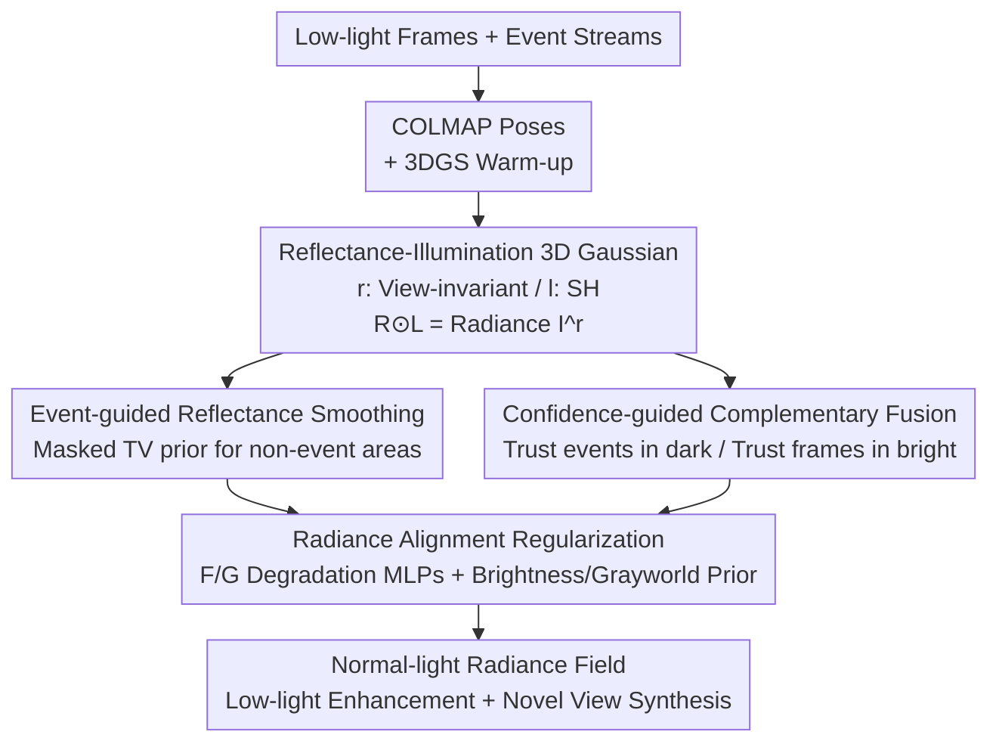

# eRetinexGS: Retinex Modeling for Low-Light Scene Enhancement via Event Streams and 3D Gaussian Splatting

**Conference**: CVPR 2026  
**Paper**: [CVF Open Access](https://openaccess.thecvf.com/content/CVPR2026/html/Yan_eRetinexGS_Retinex_Modeling_for_Low-Light_Scene_Enhancement_via_Event_Streams_CVPR_2026_paper.html)  
**Code**: Project Page https://zju-bmi-lab.github.io/eRetinexGS-homepage/ (Official code repository not yet available)  
**Area**: 3D Vision  
**Keywords**: Low-light enhancement, event camera, Retinex decomposition, 3D Gaussian Splatting, Novel View Synthesis  

## TL;DR
eRetinexGS integrates "event streams + low-light frames + multi-view consistency" into a unified 3DGS framework. Each Gaussian explicitly stores two attributes—reflectance and illumination. Event signals are utilized to guide Retinex decomposition, and the two modalities are adaptively fused based on confidence. The method reconstructs a normal-light radiance field with sharp details and accurate colors in extremely dark scenes, achieving over 5 dB higher PSNR than previous state-of-the-art event+frame methods while supporting real-time rendering at 83 FPS.

## Background & Motivation
**Background**: Low-light enhancement currently follows two primary paths. One is Retinex-based intrinsic decomposition (decomposing images into reflectance $R$ and illumination $L$, where $I=R\odot L$), which is physically grounded. The other involves introducing additional cues, such as event cameras—due to their high dynamic range and high temporal resolution, they provide structural information in the dark that frames cannot capture. Recently, works have also utilized multi-view consistency in NeRF/3DGS for noise suppression and self-supervised enhancement.

**Limitations of Prior Work**: None of the three paths are sufficient on their own. Pure Retinex becomes an ill-posed problem in extreme darkness as noise overwhelms the signal. Pure event-based methods are data-driven, sensitive to training data bias, and often lack color fidelity. Pure frame-based 3DGS methods fail directly in extremely dark regions where reliable observations are absent (Paper Fig. 1(b)). Naively combining events and low-light frames in 3DGS leads to color distortion and detail loss due to improper modeling of their relationship under low light (Fig. 1(c)).

**Key Challenge**: Under low light, both events and frames are "degraded"—events suffer from leakage noise, shot noise, and motion trailing; frames suffer from low contrast, heavy noise, and color shifts. Furthermore, cues from both modalities may originate from the same region, making it difficult to determine which is more reliable.

**Key Insight**: The authors make two key observations. First, event slices within short time windows reveal structure—**regions without event triggers often correspond to smooth reflectance areas** (as low-light events are triggered only by reflectance leaps, occlusion/motion boundaries, or illumination fluctuations), providing a free smoothness prior for reflectance. Second, events and frames are **two different quantizations** of scene radiance: events are in the log-intensity domain and are more reliable for dark structures, while frames are in the sRGB domain and are more accurate for photometry in medium/bright regions.

**Core Idea**: Each Gaussian in 3DGS explicitly carries reflectance and illumination attributes. An "event-guided reflectance smoothing" and "confidence-guided complementary fusion" are used to bind events and low-light frames into a normal-light radiance field. Two MLPs explicitly model the degradation processes of both modalities for alignment. This unified framework simultaneously leverages physical priors, complementary cues, and multi-view self-supervised constraints.

## Method

### Overall Architecture
Given a monocular low-light sequence $\{I^l_t\}_{t=1}^T$ and a synchronized event stream $\mathcal{E}$, the goal is to recover a normal-light radiance field $\{I^r_t\}$ and support high-quality novel view synthesis. The pipeline begins with COLMAP to estimate camera poses from low-light frames, followed by **two-stage training**: Stage 1 (first 3000 iterations) uses vanilla 3DGS for a coarse 3D warm-up; Stage 2 (iterations 3000 to 30000) employs event-guided Retinex decomposition to obtain a radiance field where rendered results can be explicitly split into reflectance and illumination.

The core is learning a 3DGS representation explicitly decomposed into reflectance $R$ and illumination $L$. Each Gaussian stores two attributes: reflectance $r_k\in\mathbb{R}^3$ and illumination $l_k\in\mathbb{R}$. The former is view-invariant (material albedo), while the latter is view-dependent (parameterized via Spherical Harmonics). Through alpha-blending, maps for $R$ and $L$ are rendered and multiplied to obtain linear radiance $I^r=R\odot L$. Event-guided reflectance smoothing and confidence-guided complementary fusion manage the decomposition and supervision, while two degradation MLPs ($\mathcal{F}$, $\mathcal{G}$) align the degraded events/frames back to the radiance field.

### Key Designs

**1. Reflectance-Illumination 3D Gaussian: Embedding Retinex into 3DGS**

To address the ill-posed nature of 2D Retinex decomposition in extreme darkness and the inability of pure 3DGS to separate material from lighting, the authors modify Gaussian attributes. Instead of a single color $C$, each Gaussian stores reflectance $r_k$ and illumination $l_k$. Using transmittance $\alpha_k$, the full-image $R$ and $L$ are rendered as: $R=\sum_{k}r_k\alpha_k\prod_{u<k}(1-\alpha_u)$, and similarly for $L$. The final radiance is $I^r=R\odot L$. The key physical constraint is that reflectance is view-invariant ($r_k$ is constant) while illumination is view-dependent ($l_k$ uses SH). This constraint narrows the solution space and mitigates albedo–shading leakage, leading to faster convergence than implicit methods like LLNeRF. Gamma correction $I^n=(I^r)^{1/\gamma}$ ($\gamma=2.2$) is used for visualization.

**2. Event-guided Reflectance Smoothing: Using "Absence of Events" as a Smoothness Prior**

To handle unstable reflectance decomposition caused by collapsed SNR and failed gradient estimation in dark regions, the authors implement a masked Total Variation (TV) prior based on the observation that "non-event areas are smooth areas":

$$\mathcal{L}_{\text{tv}}=\frac{1}{H\times W}\sum_{\mathbf{u}}\big(1-M_e(\mathbf{u})\big)\,\big\lVert\nabla R(\mathbf{u})\big\rVert_1$$

where $M_e(\mathbf{u})\in[0,1]$ is an edge map derived from events. The logic is that events trigger only when log-intensity changes exceed a threshold; under low light, such changes mostly come from reflectance boundaries or illumination fluctuations. Thus, "no events" roughly equals "local reflectance smoothness." Edge penalties are suppressed where $M_e$ is high to preserve structure. Event Trailing Suppression (ETS) is applied before constructing $M_e$.

**3. Confidence-guided Complementary Fusion: Trusting Events in Darkness, Frames in Brightness**

To resolve the conflict of which modality to trust, the authors use the **recovered radiance itself** as a proxy for confidence. The grayscale version of $I^r_t$, denoted $I^{rg}_t$, acts as a confidence map to adaptively weight event and image losses:

$$\mathcal{L}_{\text{data}}=\big(1-sg(I^{rg}_t)\big)\odot\mathcal{L}_{ev}+sg(I^{rg}_t)\odot\mathcal{L}_{img}$$

where $sg(\cdot)$ is the stop-gradient operation. The intuition is: darker pixels in the recovered radiance (small $I^{rg}$) give more weight to the event loss (where events are more reliable), while brighter pixels favor the image loss (where frame photometry is more accurate).

**4. Radiance Alignment Regularization Module: Explicit Degradation Modeling via MLPs**

Instead of supervising the radiance directly with noisy signals, two degradation operators are learned to "project" the radiance back into the degraded space of each modality. On the image side, a $\mathcal{G}$-MLP models the degradation $\hat{I}^l=\mathcal{G}(I^r)$, accounting for signal-dependent noise and ISP shifts. On the event side, an $\mathcal{F}$-MLP aligns the radiance in the linear domain before log-differencing: $\hat{E}=\Delta\log(\mathcal{F}(I^r))$. Additionally, two priors stabilize the radiance: a brightness loss $\mathcal{L}_{\text{brightness}}$ anchors the global brightness to a target $b_t$, and a Gray-World loss $\mathcal{L}_{\text{gray}}=\frac{\text{var}_c(I^r_t)}{\beta+\text{var}_c(R)}$ mitigates color shifts.

### Loss & Training
The total loss is $\mathcal{L}_{\text{total}}=\mathcal{L}_{data}+\lambda_2\mathcal{L}_{\text{brightness}}+\lambda_3\mathcal{L}_{\text{gray}}+\lambda_4\mathcal{L}_{\text{tv}}$, with weights $\lambda_2=1.0$, $\lambda_3=0.1$, and $\lambda_4=0.1$. The event contrast threshold $\Theta=0.2$. Training takes approximately 1 hour per scene on a single RTX 3090 across 30,000 iterations.

## Key Experimental Results

### Main Results
Synthesized data utilized LLFF (8 scenes); real-world data utilized 6 scenes captured with a DAVIS346C (intensities often below 50). Benchmarks include PSNR, SSIM, and LPIPS for both enhancement and Novel View Synthesis (NVS).

| Method | Input | Enh. PSNR↑ | Enh. SSIM↑ | Enh. LPIPS↓ | NVS PSNR↑ |
|------|------|-----------|-----------|------------|-----------|
| RetinexFormer* | F | 16.15 | 0.3164 | 0.4217 | 16.08 |
| EvLowLight* | F+E | 18.18 | 0.4841 | 0.4350 | 18.02 |
| EvLight* | F+E | 15.15 | 0.2320 | 0.5220 | 14.27 |
| LLNeRF | F | 17.78 | 0.5263 | 0.3586 | 15.72 |
| LuSh-NeRF | F | 16.68 | 0.4837 | 0.3939 | 14.23 |
| IncEventGS | E | 12.04 | 0.2065 | 0.5232 | 11.74 |
| **Ours** | F+E | **23.45** | **0.8312** | **0.0888** | **22.67** |

Ours significantly outperforms all baselines. The enhancement PSNR is 5.27 dB higher than the best event+frame baseline (EvLowLight), and LPIPS is reduced from ~0.43 to 0.089.

### Ablation Study

| Configuration | PSNR↑ | SSIM↑ | LPIPS↓ | Notes |
|------|-------|-------|--------|------|
| w/o E, $\mathcal{L}_{tv}$ | 17.21 | 0.5030 | 0.5027 | Removal of event info causes massive drop (-6.24 dB) |
| w/o $I^l$ | 17.88 | 0.5404 | 0.5403 | Removal of low-light frames costs 5.57 dB |
| w/o $\mathcal{L}_{tv}$ | 21.83 | 0.7282 | 0.2047 | Removal of event-guided smoothing costs 1.62 dB |
| w/o $\mathcal{L}_{brightness}$ | 19.52 | 0.7684 | 0.1843 | Brightness loss is critical for exposure (-3.93 dB) |
| **Full Model** | **23.45** | **0.8312** | **0.0888** | Best performance |

### Key Findings
- **Events are the primary contributor**: Removing events and the TV prior causes the most significant performance degradation, confirming events provide critical structural cues in dark regions.
- **Brightness loss is vital**: Given the self-supervised nature, this loss anchors the global radiance to prevent exposure collapse.
- **Decomposition quality**: Compared to LLNeRF, this method produces much cleaner separation between reflectance and illumination, avoiding "shading leakage" into the albedo.
- **Real-time performance**: Achievement of 83 FPS rendering on an RTX 3090, outperforming NeRF-based alternatives.

## Highlights & Insights
- **The "Absence of Events" is informative**: Turning event sparsity into a reflectance smoothness prior effectively provides a free structure mask to regularize the Retinex problem.
- **Radiance as a Confidence Proxy**: By using the intermediate recovered radiance as a weight for modality fusion, the method sidesteps the need for explicit SNR estimation or clean references.
- **Degradation Modeling**: Mapping clean radiance back to degraded spaces rather than supervising with "dirty" signals directly prevents noise propagation.
- **Physical Constraints as Regularizers**: Enforcing view-invariance for reflectance and SH-dependence for illumination constrains the 3DGS attribute search space.

## Limitations & Future Work
- **Reliance on COLMAP**: Pose estimation from extremely dark frames is a "chicken-and-egg" problem; if COLMAP fails, the reconstruction follows.
- **Dataset Scale**: The real-world evaluation relies on a small set of 6 scenes.
- **Non-Lambertian Surfaces**: SH-based illumination modeling may struggle with complex specularities or strong indirect lighting.
- **Future Directions**: Integrating event-aided pose refinement and exploring more robust view-dependent illumination representations.

## Related Work & Insights
- **vs LLNeRF**: LLNeRF lacks dark region cues, leading to illumination leakage; ours utilizes event guidance for cleaner separation.
- **vs EvLowLight/EvLight**: Previous fusion methods are often data-driven and lack multi-view consistency; ours uses self-supervised geometric constraints to surpass them by 5+ dB.
- **vs IncEventGS**: Pure event methods struggle with absolute intensity/color; ours recovers accurate photometry by fusing frame data.

## Rating
- Novelty: ⭐⭐⭐⭐⭐ (Integrates Retinex, events, and 3DGS cleverly)
- Experimental Thoroughness: ⭐⭐⭐⭐ (Solid synthetic/real results, but limited real scenes)
- Writing Quality: ⭐⭐⭐⭐ (Clear motivation and visual explanations)
- Value: ⭐⭐⭐⭐⭐ (Real-time NVS and enhancement for dark scenes)

<!-- RELATED:START -->

## Related Papers

- [\[CVPR 2026\] Geometric-Photometric Event-based 3D Gaussian Ray Tracing](geometric-photometric_event-based_3d_gaussian_ray_tracing.md)
- [\[CVPR 2026\] $L^{2}DGS$: Low-Light Dynamic Gaussian Splatting](l2dgs_low-light_dynamic_gaussian_splatting.md)
- [\[CVPR 2026\] E2EGS: Event-to-Edge Gaussian Splatting for Pose-Free 3D Reconstruction](e2egs_event-to-edge_gaussian_splatting_for_pose-free_3d_reconstruction.md)
- [\[CVPR 2026\] Nope-SGS: 3D Gaussian Reconstruction from Unposed Spike Streams](3d_gaussian_splatting_from_unposed_spike_stream.md)
- [\[CVPR 2026\] AnchorSplat: Feed-Forward 3D Gaussian Splatting with 3D Geometric Priors](anchorsplat_feed-forward_3d_gaussian_splatting_with_3d_geometric_priors.md)

<!-- RELATED:END -->
