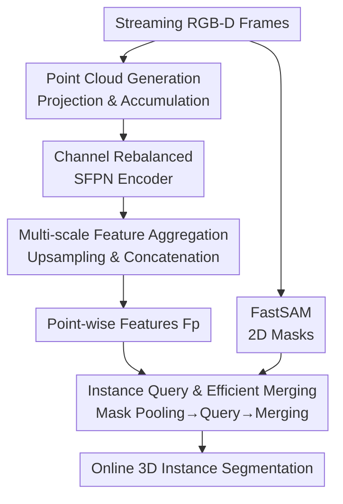

# ESAM++: Efficient Online 3D Perception on the Edge

**Conference**: CVPR 2026  
**Paper**: [CVF Open Access](https://openaccess.thecvf.com/content/CVPR2026/html/Liu_ESAM_Efficient_Online_3D_Perception_on_the_Edge_CVPR_2026_paper.html)  
**Code**: https://github.com/qinliuliuqin/esamplusplus  
**Area**: 3D Vision  
**Keywords**: Online 3D Perception, 3D Instance Segmentation, Sparse Feature Pyramid, Edge Deployment, Sparse Convolution  

## TL;DR
ESAM++ replaces the slowest component of the state-of-the-art (SOTA) online 3D perception method ESAM—the 3D Sparse UNet backbone—with a lightweight "3D Sparse Feature Pyramid Network (SFPN)." By leveraging multi-scale feature aggregation and channel rebalancing, it achieves up to a 3× speedup in CPU inference and a 2× reduction in model size across four indoor segmentation benchmarks. It maintains or even exceeds the accuracy of ESAM, enabling real-time online 3D instance segmentation on GPU-less edge devices such as mobile CPUs.

## Background & Motivation
**Background**: Online 3D scene perception involves incrementally outputting 3D instance segmentation for an entire scene from a continuous RGB-D video stream. It serves as the visual foundation for robot navigation/manipulation, AR/VR, and autonomous driving. The current leading approach is EmbodiedSAM (ESAM), which utilizes SAM / FastSAM to obtain segmentation masks in 2D and "lifts" these into geometry-aware 3D queries. This allows for efficient cross-frame mask merging, resulting in real-time, fine-grained, and generalizable online 3D instance segmentation.

**Limitations of Prior Work**: While ESAM achieves high accuracy, its point cloud feature extraction relies on a computationally heavy 3D Sparse UNet. This component accounts for the vast majority of the 3D inference time, making it unfeasible for edge devices with limited computing power and strict privacy requirements (where data cannot leave the device). The authors performed a layer-by-layer computational analysis and identified two specific sources of inefficiency: ① **High-resolution top layers** (layers with the same resolution as the input) contribute most of the latency due to dense voxels and large kernels; ② **Low-resolution bottom layers** contribute most of the parameter count (model size) because the number of channels doubles with each downsampling step. Furthermore, while the UNet decoder produces rich multi-scale features, **predictions are only made at the highest resolution layer**, leaving intermediate features wasted.

**Key Challenge**: The "single highest-resolution prediction" paradigm of UNet forces the retention of both expensive high-resolution layers and high-channel deep layers, preventing reductions in latency and size. Consequently, efficiency and accuracy are bottlenecked by this structure.

**Goal**: Replace the bottleneck backbone to simultaneously reduce latency (top layers) and parameters (bottom layers) without degrading accuracy, while effectively utilizing multi-scale features from the decoder.

**Key Insight**: Feature Pyramid Networks (FPN)—widely used in 2D vision for multi-scale prediction—are rarely applied in online 3D perception. The authors adapt this concept to sparse 3D point clouds: since every level of the decoder contains features, each level should contribute to the final prediction rather than relying solely on the top layer.

**Core Idea**: Replace the 3D Sparse UNet with a 3D Sparse Feature Pyramid (SFPN). Output channels are limited in high-resolution layers to save latency, redundant intermediate layers with excessive channels are removed to save volume, and "all-decoder-level upsampling and concatenation" is used for multi-scale aggregation to recover the accuracy lost from channel limitation.

## Method

### Overall Architecture
ESAM++ inherits the incremental online pipeline of ESAM and **only replaces the point cloud feature extraction backbone**. When a frame arrives: the current depth map is projected into a point cloud based on camera poses and accumulated into the scene; FastSAM provides a set of class-agnostic 2D masks on the RGB image; the new **SFPN** backbone extracts point-wise features $F_p \in \mathbb{R}^{N\times C}$ (default $C=96$) from the point cloud. Subsequently, the ESAM instance segmentation head is used—2D masks are pooled over $F_p$ based on their spatial support to form superpoints, initialized as 3D instance queries, and iteratively refined via a transformer query decoder to obtain current frame masks $M^{cur}_t$. Finally, an efficient merge with accumulated historical masks $M^{acc}_{t-1}$ produces the updated global instance segmentation.

The method is a serial pipeline of "Point Cloud → Backbone Features → Instance Queries → Cross-frame Merging," where 2D mask and point cloud branches converge at the segmentation head:

### Key Designs

**1. Channel Rebalancing: Limiting High-Res Channels and Removing Redundant Layers**

This directly addresses the two UNet bottlenecks. SFPN also uses an encoder-decoder structure: the encoder uses sparse 3D convolutions + residual blocks to downsample across 4 spatial resolutions, with channels increasing from $C_1$ to $C_4$; the decoder uses sparse transposed convolutions (ConvTr) to upsample, refined by residual blocks, with channels returning from $C_4$ to $C_8$. The key is that channel configuration no longer follows the "lower resolution, higher channel" rule: **output channels are actively suppressed in high-resolution layers** (where latency is highest), and **redundant intermediate layers requiring massive channels are removed** (where parameter count is highest). The authors provide Small / Base / Large variants (see parameters below) to cover deployment needs from "speed-first" to "accuracy-first": Small has only 14.1M parameters and 211ms CPU latency per frame, while Large has 41.2M and 326ms. The accuracy lost due to channel limitation is compensated by multi-scale aggregation.

**2. Multi-scale Feature Aggregation: Concatenating All Decoder Stages for Prediction**

Standard UNet only predicts at the highest resolution, wasting intermediate scale features. SFPN overcomes this by taking the output of **every stage** in the decoder, upsampling it back to the original resolution using sparse transposed convolutions (ConvTr), and **concatenating** them into a unified high-resolution feature map. This is then processed by an MLP to produce the final point-wise features $F_p \in \mathbb{R}^{N\times C}$ ($C=96$). This allows every level of the pyramid to participate in the final prediction—coarse scales provide large receptive fields/semantic context, while fine scales provide boundaries. This step allows the "channel-limited lightweight encoder" to maintain high accuracy.

**3. 2D Mask-Guided Instance Query and Efficient Merging (Adapted from ESAM)**

With $F_p$, the segmentation head combines it with $L$ 2D masks $M^{2d}_t \in \mathbb{R}^{H\times W\times L}$ from FastSAM. **Query lifting**: Pooling is performed on $F_p$ according to the spatial support of each 2D mask, resulting in $L$ superpoint features $F_s \in \mathbb{R}^{L\times C}$. These initialize 3D instance queries $Q_0$, which are refined through transformer decoder layers to predict current frame masks $M^{cur}_t \in \mathbb{R}^{N\times K}$. **Query merging**: Since both $M^{cur}_t$ and historical masks $M^{acc}_{t-1}$ use **fixed-length feature representations**, merging across frames is reduced to calculating pairwise similarity between query features—a single matrix multiplication. Unlike previous methods that only fuse 2D features into 3D, ESAM++ **simultaneously uses 2D features and 2D masks** to guide 3D representation learning.

### Loss & Training
To ensure a fair comparison, the loss functions and training strategies follow ESAM. Training was conducted on an NVIDIA A6000, while inference latency was measured on an Intel Xeon Silver 4314 CPU (2.40GHz) using a PyTorch implementation. Class-agnostic segmentation was trained on ScanNet200, and class-aware segmentation on ScanNet.

## Key Experimental Results

### Main Results
Evaluation was conducted on four indoor benchmarks (ScanNet / ScanNet200 / SceneNN / 3RScan). The primary metric is AP (IoU 0.5–0.95), with AP50/AP25 and CPU latency as secondary metrics. All variants use FastSAM as the VFM, with latency recorded as $T_{VFM}$ + backbone time.

Class-agnostic 3D Instance Segmentation (ScanNet200):

| Method | Online | AP | AP50 | AP25 | Params | CPU Latency |
|------|------|----|----|----|------|---------|
| ESAM [ICLR'25] | ✓ | 42.2 | 63.7 | 79.6 | 44.6M | $T_{VFM}$+934ms |
| ESAM-E [ICLR'25] | ✓ | 43.4 | 65.4 | 80.9 | 44.6M | $T_{VFM}$+934ms |
| Ours-Small | ✓ | 30.3 | 55.8 | 68.9 | **14.1M** | $T_{VFM}$+**211ms** |
| Ours-Base | ✓ | 39.7 | 60.6 | 77.5 | 23.5M | $T_{VFM}$+252ms |
| **Ours-Large** | ✓ | **43.7** | **66.1** | **81.2** | 41.2M | $T_{VFM}$+**326ms** |

Ours-Large outperforms ESAM-E in accuracy (43.7 vs 43.4 AP) while reducing backbone latency from 934ms to 326ms (≈2.9× speedup) and reducing parameters from 44.6M to 41.2M. The Small variant provides a ~3× speedup and 2× size reduction with acceptable accuracy loss, suitable for edge deployment.

Class-aware 3D Instance Segmentation (ScanNet / SceneNN):

| Method | Online | ScanNet AP | AP50 | SceneNN AP | AP50 |
|------|------|-----------|------|-----------|------|
| TD3D-MA [CVPR'24] | ✓ | 39.0 | 60.5 | 26.0 | 42.8 |
| ESAM-E [ICLR'25] | ✓ | 41.6 | 60.1 | 27.5 | 48.7 |
| ESAM-E+FF [ICLR'25] | ✓ | 42.6 | 61.9 | 33.3 | 53.6 |
| **Ours-Large** | ✓ | **43.7** | **63.5** | **34.1** | **53.9** |

Ours-Large achieves SOTA among online methods on both datasets.

### Ablation Study
SFPN Architecture Ablation (ScanNet200, Class-agnostic):

| Config | AP | Params | Latency | Description |
|------|----|----|------|------|
| No upsampled fusion | 34.0 | 39.6M | 312ms | Remove decoder upsampling fusion |
| No pyramid | 33.8 | 39.6M | 298ms | Remove hierarchical feature extraction |
| No skip connection | 36.4 | 36.5M | 277ms | Remove encoder-decoder skip connections |
| **Full** | **43.7** | 41.2M | 326ms | Full SFPN |

Edge Device Tests (iPhone 15 / A16 Bionic, CPU only, average of 100 runs):

| Device | Chip | CPU Latency | Power |
|------|------|---------|------|
| iPhone 15 | A16 Bionic | 190ms | 4.5W |

Pose Noise Robustness (ScanNet200):

| Noise Level | AP | AP50 | AP25 |
|---------|----|----|----|
| 0% | 43.7 | 66.1 | 81.2 |
| 1% | 43.7 | 66.0 | 81.2 |
| 5% | 42.4 | 64.6 | 79.6 |
| 10% | 38.9 | 60.3 | 77.4 |

### Key Findings
- **Multi-scale aggregation is vital for accuracy**: Removing upsampled fusion (34.0) or the pyramid structure (33.8) causes AP to drop by ~10 points with negligible savings in latency/params. This proves the fusion step provides massive accuracy gains at almost no cost.
- **Skip connections are essential**: Removing encoder-decoder skip connections drops AP to 36.4, showing that fine-grained information flow is necessary.
- **Strong cross-dataset generalization**: Models trained on ScanNet200 perform well on SceneNN / 3RScan. Ours-Large even outperforms offline zero-shot methods on 3RScan, which is challenging due to fast camera motion and noisy poses.
- **True edge capability**: The Small variant runs at 190ms/frame on an iPhone 15 CPU at 4.5W. The authors specifically report CPU performance to give a conservative lower bound.
- **Robust to pose noise**: AP only drops from 43.7 to 42.4 under 5% pose noise. Significant degradation starts at 10% (failures at 20%, see Fig. 5).

## Highlights & Insights
- **Seamless adaptation of 2D FPN to Sparse 3D**: The core insight is that UNet decoders already compute multi-scale features; SFPN simply utilizes them. A near-zero cost modification yields a 10-point accuracy gain.
- **Profiling-driven design**: Instead of arbitrary changes, the design was driven by quantifying where latency and parameters were concentrated. This methodology is applicable to optimizing any heavy model for the edge.
- **Fixed-length mask representations**: This design choice allows cross-frame merging to become a simple matrix multiplication, which is critical for real-time performance.
- **Concentrated Innovation**: By focusing on the bottleneck backbone while reusing a strong SOTA segmentation head, the authors maximized impact with minimal engineering risk.

## Limitations & Future Work
- **Backbone-only optimization**: The VFM (FastSAM) remains a frozen bottleneck. Its latency ($T_{VFM}$) still adds to the total time.
- **Pose dependency**: Requires RGB-D video with known poses. While robust to minor noise (~10%), it fails at high noise levels. End-to-end validation with real-time reconstruction (e.g., CUT3R) for pure RGB scenes is future work.
- **Accuracy-speed trade-off**: The Small variant sacrifices significant accuracy (30.3 AP on ScanNet200) for speed; selection depends on specific deployment goals.
- **Scenario constraints**: Evaluations are focused on indoor static/slow-moving scenes; performance in large-scale, outdoor, or highly dynamic scenes is unknown.

## Related Work & Insights
- **vs ESAM / ESAM-E**: Uses the same pipeline but replaces the 3D Sparse UNet with SFPN. Achieves similar/better accuracy with ~3× lower latency and 2× smaller size.
- **vs Offline methods (SAMPro3D / Open3DIS / etc.)**: Offline methods predict on clean reconstructed clouds but require the full scene and are sensitive to pose/reconstruction quality (e.g., they struggle on 3RScan). ESAM++ is more practical for real-world deployment.
- **vs INS-Conv / TD3D-MA**: These focus on "2D features to 3D." This work utilizes both 2D features and 2D masks while providing a much lighter backbone.

## Rating
- Novelty: ⭐⭐⭐⭐ Systematically introduces FPN multi-scale concepts to online 3D backbones. Effective, though more an "adaptation + optimization" than a new paradigm.
- Experimental Thoroughness: ⭐⭐⭐⭐⭐ Extensive tests across four benchmarks, two tasks, cross-dataset generalization, real device testing, and noise robustness.
- Writing Quality: ⭐⭐⭐⭐ Clear motivation derived from layer-wise profiling; logical flow from bottleneck to design.
- Value: ⭐⭐⭐⭐⭐ Enables real-time online 3D instance segmentation on mobile CPUs, offering direct industrial value.

<!-- RELATED:START -->

## Related Papers

- [\[CVPR 2026\] ConsisVLA-4D: Advancing Spatiotemporal Consistency in Efficient 3D-Perception and 4D-Reasoning for Robotic Manipulation](consisvla-4d_advancing_spatiotemporal_consistency_in_efficient_3d-perception_and.md)
- [\[CVPR 2026\] E2EGS: Event-to-Edge Gaussian Splatting for Pose-Free 3D Reconstruction](e2egs_event-to-edge_gaussian_splatting_for_pose-free_3d_reconstruction.md)
- [\[CVPR 2026\] MD2E: Modeling Depth-to-Edge Cues for Monocular Metric Depth Estimation](md2e_modeling_depth-to-edge_cues_for_monocular_metric_depth_estimation.md)
- [\[CVPR 2026\] Adaptive 3D Perception for Small Aerial Targets Under Sparse Sampling via Reinforcement Learning](adaptive_3d_perception_for_small_aerial_targets_under_sparse_sampling_via_reinfo.md)
- [\[CVPR 2026\] H²A²: Homogeneity-Aware and Heterogeneity-Aware Feature Perception for Unified Indoor 3D Object Detection](h2a2_homogeneity-aware_and_heterogeneity-aware_feature_perception_for_unified_in.md)

<!-- RELATED:END -->
