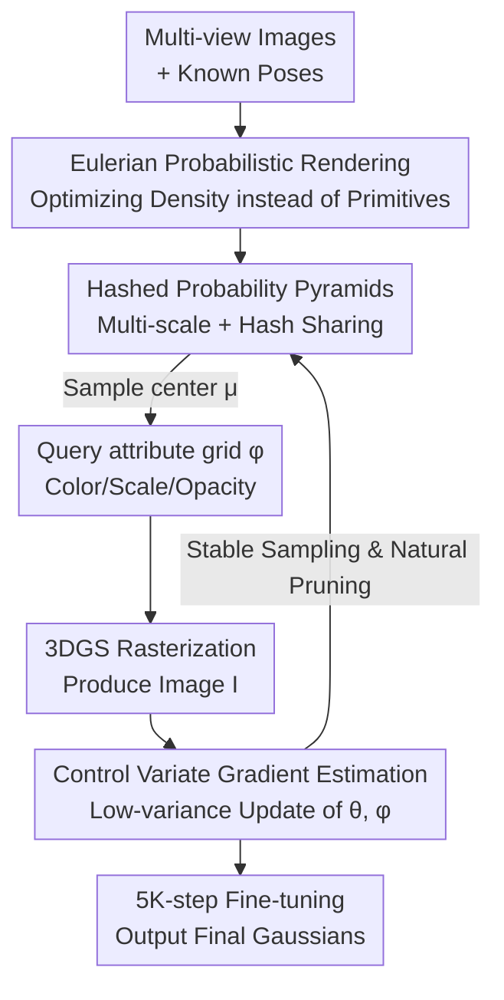

# Eulerian Gaussian Splatting using Hashed Probability Pyramids

**Conference**: CVPR 2026  
**arXiv**: [2605.29136](https://arxiv.org/abs/2605.29136)  
**Code**: None (Not provided in the paper)  
**Area**: 3D Vision / Radiance Fields / Gaussian Splatting  
**Keywords**: 3D Gaussian Splatting, Probability Density Optimization, Eulerian Perspective, Hashed Probability Pyramids, Control Variate Gradient Estimation

## TL;DR
The manual heuristic of "Adaptive Density Control (ADC)" in 3DGS is replaced by optimizing a learnable voxel probability density field from which Gaussians are sampled for rendering. High-resolution density is made affordable via Hashed Probability Pyramids, and sampling variance is mitigated through control variate gradient estimation. The method achieves SOTA reconstruction quality with random initialization on mip-NeRF 360 while maintaining 3DGS-level rendering speeds.

## Background & Motivation
**Background**: Novel view synthesis currently follows two main paradigms. NeRF uses continuous volume density and pure gradient descent optimization, offering high quality but slow rendering (requiring millions of MLP queries per pixel). 3DGS utilizes a set of discrete anisotropic Gaussians for differentiable rasterization, providing fast, hardware-friendly rendering and serving as the current mainstream real-time solution.

**Limitations of Prior Work**: 3DGS training relies heavily on a heuristic called "Adaptive Density Control (ADC)," which determines where to add Gaussians (splitting/cloning/pruning) based on the magnitude of position gradients. These rules involve numerous schedules and thresholds that are fragile and difficult to tune. Crucially, **Gaussians without local gradients cannot move**; if a Gaussian is misplaced in an area with no signal, it cannot migrate on its own and requires additional "erasure and re-insertion" heuristics for correction. Subsequent works (Taming-3DGS, Revising Densification, etc.) attempted to make density control more principled but still rely on thresholds and scheduling.

**Key Challenge**: The "continuous field + pure gradient" approach of NeRF is stable but slow, whereas the "discrete primitives + rasterization" of 3DGS is fast but necessitates manual rules for primitive management. There is a lack of a representation that simultaneously captures optimization stability and execution efficiency.

**Goal**: To design a representation that is **3DGS during rendering but NeRF-like during optimization**—combining the fast rasterization of 3DGS with the flexibility of NeRF, where probability mass automatically flows where the loss requires, entirely without heuristics.

**Key Insight**: The authors shift from a "Lagrangian perspective" (explicitly moving each primitive) to an **Eulerian perspective**. Instead of directly manipulating primitives, the method optimizes an underlying probability density field $p_\theta(\mu)$ that governs where Gaussians should be placed. Gaussians are sampled iteration-by-iteration from this field. Primitives act as "samples" of the density field, and structures emerge where the loss dictates via gradients.

**Core Idea**: By treating Gaussian positions as random variables sampled from a learnable density, the density field is optimized (rather than the primitives themselves), fundamentally eliminating density control heuristics.

## Method

### Overall Architecture
The method is titled Eulerian Gaussian Splatting (EGS). Given multi-view images with known camera poses, the goal is to optimize a scene representation. The core is a **probabilistic rendering model**: the image $I=\mathbb{E}_{\mathcal{G}\sim p(\mathcal{G})}[\text{Render}(\mathcal{G},\pi)]$, meaning the rendering is the expectation of Gaussians sampled from the distribution $p(\mathcal{G})$ and processed via standard 3DGS rasterization. Assuming independence between Gaussians, the distribution is decomposed into a "position distribution $p_\theta(\mu)$" and a "distribution of attributes $p_\phi(\phi|\mu)$." Attributes (color, opacity, scale, rotation) are stored in a deterministic 3D hash grid $\phi$, while the position distribution $p_\theta$ is the primary optimization target.

Each training iteration involves: ① Sampling a batch of Gaussian centers $\mu_i$ from the Hashed Probability Pyramid $p_\theta(\mu)$; ② Querying the attribute hash grid $\phi(\mu_i)$ for color and scale; ③ Rasterizing the Gaussians using the training camera $\pi_k$ to produce image $I$; ④ Calculating loss against ground truth and backpropagating to **update both density parameters $\theta$ and attribute parameters $\phi$**. The gradient $\nabla_\theta I$ for the position distribution is computed using a specialized control variate estimator. Training concludes with a final 5K-step standard 3DGS fine-tuning.

### Key Designs

**1. Eulerian Probabilistic Rendering: Optimizing Density Fields Instead of Primitives**

The motivation stems from the fragility of ADC in 3DGS and its inability to move primitives with zero local gradients. Instead of viewing the scene as a collection of primitives to be explicitly moved (Lagrangian), the authors define a persistent, learnable voxel probability density $p_\theta(\mu)$. Primitive positions are samples from this distribution, and the image is written as an expectation (Eq. 1). Optimization targets the density field parameters; when more primitives are needed, gradients push probability mass to that area, while mass recedes where not needed. This replaces splitting, cloning, pruning, and re-insertion rules. This bridges the "stable flow" of NeRF with the "fast rasterization" of 3DGS into a single differentiable pipeline.

**2. Hashed Probability Pyramids: Affordable High-Resolution 3D Density Sampling**

Representing the density field requires a 3D distribution that is (i) efficient to sample and (ii) high-resolution without excessive parameters. A dense grid scales cubically ($4096^3$ would require 275 GB). The authors propose Hashed Probability Pyramids: the distribution is a product of $L$ layers of piecewise constant functions $p_\theta(\mu)=\frac{1}{Z}\prod_{\ell=0}^{L-1}f^{(\ell)}_\theta(\mu)$ (Eq. 4). Layer 0 is normalized to sum to 1, and each $2\times2\times2$ block in subsequent layers is individually normalized. This "product-of-pyramids" parameterization is **complete**, with total degrees of freedom $N_{L-1}^3-1$, equivalent to a standard distribution at resolution $N_{L-1}^3$. To save memory, only $B$ blocks of $2\times2\times2$ are assigned per layer, using a hash function $T_\ell$ to tile them.

The key insight is that **3D surfaces are sparse**. Hash collisions mostly occur in empty regions, which can be mitigated by zeroing corresponding coarse bins. Collisions across layers are independent, making the probability of a simultaneous collision across all layers extremely low. With $L=12$, $N_{11}=4096$, and $B=2^{18}$, $4096^3$ resolution is achieved with only 86 million parameters (0.33 GB), an 800x reduction. **Sampling** is also efficient: sampling begins at the coarsest layer and is refined conditionally (Eq. 7) using inverse transform sampling. By defining uniform noise for subsequent layers as $u^{(\ell)}=\text{frac}(\mu^{(\ell-1)}N_{\ell-1})$ (Eq. 8), the sampling chain becomes end-to-end differentiable.

**3. Control Variate Gradient Estimation: Reducing Sampling Variance**

Gradients for attributes $\phi$ are computed via automatic differentiation, but $\nabla_\theta I$ requires special handling as $\theta$ determines the distribution for the expectation. Standard pathwise estimators (differentiating the sampling process) exhibit high variance. The authors start with the score function estimator $\nabla_\theta I=\mathbb{E}[I\cdot\sum_i \nabla_\theta\log p_\theta(\mu_i)]$ (Eq. 12) and introduce control variates: $\nabla_\theta I=\mathbb{E}[\sum_i (I-I_{-i})\cdot\nabla_\theta\log p_\theta(\mu_i)]$ (Eq. 13), where $I_{-i}$ is the image rendered without the $i$-th Gaussian. This weights the gradient by the "individual contribution" of the $i$-th Gaussian, significantly reducing variance while remaining unbiased.

While computing $I_{-i}$ for every Gaussian seems infeasible, the authors prove $I-I_{-i}=o_i\frac{\partial I}{\partial o_i}$ (Eq. 14, where $o_i$ is opacity), which is **readily available** during the backpropagation for $\phi$. This allows low-variance estimation with computational costs comparable to standard autodiff.

**4. Stable Sampling and Natural Pruning**

To address engineering challenges of probabilistic optimization: **Defensive Sampling** adds Gaussian noise to 20% of samples (std dev $2\times10^{-3}$, linearly annealed to 0 over 20k steps) to encourage early exploration. **Sample Rounding** quantizes each sample to its finest voxel bin center (Eq. 16) to prevent variance caused by jittering distances to the camera. **Duplicate Removal** ensures only unique centers are rendered after rounding; as the model concentrates probability mass, duplicate samples increase, reducing the number of rendered primitives—**Natural Pruning**. An initial set of $1.5\times10^7$ Gaussians automatically contracts to an appropriate size.

### Loss & Training
The method uses 3DGS standard $L_1$ + D-SSIM loss ($\lambda_1=0.8$). It adapts $L_1$ regularization for opacity $o_i$ and scale $s_i$ from 3DGS-MCMC, and an $L_1$ weight of $0.2^\ell$ for $\ell \ge 1$ spherical harmonic coefficients to prioritize low-frequency components (Eq. 15). Attributes use a 17-channel multi-resolution hash grid. Contraction functions as per NeRF-Casting manage unbounded scenes. Training takes 35K steps (30K probabilistic + 5K fine-tuning) for outdoor scenes and 65K steps for indoor, taking approx. 3.5–7.25 hours on an H200.

## Key Experimental Results

### Main Results
Evaluation conducted on mip-NeRF 360, Tanks&Temples, and Deep Blending. Comparison focuses on **3DGS-MCMC (Random)** and other methods with identical budgets. Results on mip-NeRF 360 (Random init):

| Dataset (mip-NeRF360 Avg) | Metric | EGS (FT) | EGS (No FT) | MCMC-Random | Taming-Random |
|--------|------|------|------|------|------|
| All | PSNR↑ | **28.35** | 28.10 | 28.26 | 26.24 |
| All | SSIM↑ | 0.84 | 0.84 | 0.84 | 0.76 |
| All | LPIPS↓ | 0.23 | 0.23 | 0.21 | 0.30 |
| Outdoor | PSNR↑ | **25.49** | 25.28 | 25.36 | 22.62 |
| Indoor | PSNR↑ | 31.92 | 31.62 | 31.87 | 30.76 |

EGS (with fine-tuning) achieves the highest PSNR (28.35) among random initialization methods, outperforming MCMC-Random (28.26) and significantly beating Taming-Random (26.24). It narrows the gap with methods initialized via COLMAP (e.g., COLMAP-MCMC 28.38).

### Ablation Study
Conducted on 6 mip-NeRF 360 scenes (3 outdoor + 3 indoor):

| Configuration | Pre-FT PSNR | Post-FT PSNR | Note |
|------|---------|---------|------|
| F) Full Model | 29.29 / 0.88 / 0.20 | 29.52 / 0.88 / 0.19 | — |
| E) w/o Control Variates | **22.35 / 0.62 / 0.51** | 23.69 / 0.64 / 0.47 | Most critical; unstable training |
| A) w/o Opacity Reg | 26.32 / 0.77 / 0.31 | 26.74 / 0.78 / 0.30 | Large opaque Gaussians block signals |
| C) w/o Sample Rounding | 28.85 / 0.87 / 0.22 | 29.44 / 0.88 / 0.20 | Drop pre-FT; gap closes post-FT |
| B) w/o Scale Reg | 29.26 / 0.88 / 0.20 | 29.48 / 0.88 / 0.19 | Small gain + Stability |
| D) w/o Defensive Sampl. | 29.20 / 0.88 / 0.20 | 29.45 / 0.88 / 0.19 | Small gain + Stability |

### Key Findings
- **Control Variate Gradient Estimation is the core**: Removing it (reverting to pure pathwise autodiff) causes PSNR to crash from 29.29 to 22.35, confirming that sampling variance is the primary obstacle to probabilistic splatting.
- **Opacity Regularization is second most important**: Without it, large opaque Gaussians stall training by occluding lower layers (3 dB drop).
- **Sample Rounding benefits training stability**: It reduces variance during the probabilistic phase; once primitives are discrete during fine-tuning, the gap narrows.
- **Approximating COLMAP quality via random initialization**: The method recovers high-quality geometry purely from image supervision, enabling a heuristic-free, end-to-end pipeline.

## Highlights & Insights
- **Paradigm shift from moving primitives to field optimization**: It replaces the "patchwork" of ADC rules with a framework where mass flows according to loss, marrying NeRF's flexibility with 3DGS's speed.
- **Hashed Probability Pyramids scalable for 3D**: Leveraging "product-of-layers" ensures completeness without redundancy, while surface sparsity makes 800x compression possible.
- **The engineering elegance of $I-I_{-i}$**: Transforming the infeasible per-primitive render into a quantity derived for free from automatic differentiation is a vital trick for practical implementation.
- **Natural Pruning**: Probability concentration leads to duplicate samples which are filtered out, achieving primitive reduction without explicit pruning thresholds.

## Limitations & Future Work
- **Training overhead**: EGS is **slower and more memory-intensive** than standard 3DGS due to massive sampling and hash queries (3.5–7.25 hours on H200).
- **Fine-tuning necessity**: Pure probabilistic optimization still requires a final 5K-step standard 3DGS pass to smooth discretization biases.
- **Dependency on lower bound**: To ensure fairness, a lower bound on primitive counts was set, meaning the true extent of "natural pruning" is somewhat constrained.

## Related Work & Insights
- **vs 3DGS / Taming-3DGS (ADC Route)**: These use manual density control based on gradient magnitudes. EGS outperforms them significantly in random initialization (PSNR 25.49 vs 22.62 outdoors).
- **vs 3DGS-MCMC (Probabilistic/Sampling)**: MCMC uses Brownian motion for exploration. EGS **explicitly learns** a probability distribution, outperforming MCMC on the same budget (28.35 vs 28.26).
- **vs INPC (Octree Probabilistic Points)**: INPC relies on octree refinement heuristics; EGS uses a continuous multi-scale hashed pyramid for refinement without manual subdivision decisions.

## Rating
- Novelty: ⭐⭐⭐⭐⭐ Reframes 3DGS density control as a principled field optimization problem.
- Experimental Thoroughness: ⭐⭐⭐⭐ Solid evaluation across three datasets, but lacks detailed VRAM/speed comparison tables and open-source code.
- Writing Quality: ⭐⭐⭐⭐⭐ Clear progression from motivation to solution with insightful analogies (Eulerian vs Lagrangian).
- Value: ⭐⭐⭐⭐ Provides a principled, heuristic-free path for radiance field optimization, though currently hindered by training costs.

<!-- RELATED:START -->

## Related Papers

- [\[CVPR 2026\] IDESplat: Iterative Depth Probability Estimation for Generalizable 3D Gaussian Splatting](idesplat_iterative_depth_probability_estimation_for_generalizable_3d_gaussian_sp.md)
- [\[CVPR 2026\] Event Stream Filtering via Probability Flux Estimation](event_stream_filtering_via_probability_flux_estimation.md)
- [\[CVPR 2026\] GeodesicNVS: Probability Density Geodesic Flow Matching for Novel View Synthesis](geodesicnvs_probability_density_geodesic_flow_matching_for_novel_view_synthesis.md)
- [\[CVPR 2026\] ODGS-SLAM: Omnidirectional Gaussian Splatting SLAM](odgs-slam_omnidirectional_gaussian_splatting_slam.md)
- [\[CVPR 2026\] Learning Differentiable Hierarchies in 3D Gaussian Splatting](learning_differentiable_hierarchies_in_3d_gaussian_splatting.md)

<!-- RELATED:END -->
