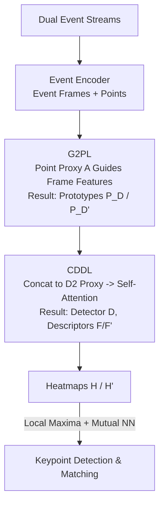

# EV-CGNet: Co-visible Focused 3D-guided 2D Event Keypoint Detection Network

**Conference**: CVPR 2026  
**Paper**: [CVF Open Access](https://openaccess.thecvf.com/content/CVPR2026/html/Gao_EV-CGNet_Co-visible_Focused_3D-guided_2D_Event_Keypoint_Detection_Network_CVPR_2026_paper.html)  
**Code**: None  
**Area**: 3D Vision  
**Keywords**: Event camera, keypoint detection, co-visible region, 3D-guided 2D, feature matching  

## TL;DR
EV-CGNet utilizes fine-grained spatio-temporal cues from event points to guide event frame feature prototype learning (G2PL). It further employs cross-frame self-attention to constrain keypoint detection to co-visible regions (CDDL), outperforming SOTA methods like SuperEvent in re-projection error, pose estimation, and SLAM trajectory error across six benchmarks.

## Background & Motivation
**Background**: Event cameras record pixel-level intensity changes asynchronously, outputting event streams such as $\{e_i = (x_i, y_i, t_i, p_i)\}$. They offer advantages like high dynamic range, low bandwidth, and high temporal resolution under high-speed motion or extreme lighting. Event keypoint detection is a fundamental task—detecting repeatable keypoints and matching them across frames for downstream applications like pose estimation, SLAM, and 3D reconstruction. Prevailing methods follow two paths: **Point-based** methods treat the event stream as spatio-temporal point clouds in $(X,Y,T)$ space, applying 3D cloud algorithms (e.g., eCDT) to find clusters; **Frame-based** methods compress events into image-like frames and adapt traditional 2D detectors (e.g., SD2Event, SuperEvent) to jointly learn detectors and descriptors.

**Limitations of Prior Work**: Both approaches have inherent drawbacks. Point-based methods preserve fine-grained information, but there is a fundamental gap between the $(X,Y,T)$ spatio-temporal domain and the standard $(X,Y,Z)$ spatial domain, limiting the effectiveness of direct algorithm transfer. Frame-based methods are compatible with standard 2D algorithms and offer higher precision but lose substantial event data during frame compression. Even recent multi-frame fusion methods are constrained by computational costs, and discrete sampling introduces errors (e.g., if a pixel's intensity decreases but sampled events are mostly positive, the model misjudges the trend). Crucially, frame-based detectors are **trained and evaluated independently for each frame**, meaning keypoints are "fixed" and do not adapt to the content of the matching pair.

**Key Challenge**: (1) Lack of cross-frame interaction prevents the utilization of **co-visible information**—independent detection extracts points in regions not visible in both frames, inevitably leading to incorrect correspondences (red stars in Fig 1a); (2) **The trade-off between event utilization and algorithmic compatibility**—point-based methods preserve info but lack compatibility, while frame-based methods offer compatibility at the cost of information loss.

**Key Insight**: The authors observe that these two trade-offs can be resolved separately. First, frame-based precision and point-based spatio-temporal detail are complementary—point cues can "guide" frame features while remaining within a compatible 2D frame framework. Second, since matching occurs in pairs, co-visible regions can only be identified by modeling frame interactions using attention mechanisms.

**Core Idea**: A **3D-guided 2D** paradigm combined with a **co-visible region-focused** detection strategy is proposed. Spatio-temporal cues from event points (pseudo-3D) guide the prototype learning of event frames (2D) to balance information and compatibility. Paired self-attention then focuses the detector on co-visible regions, suppressing invalid keypoints in non-matching areas at the source.

## Method

### Overall Architecture
EV-CGNet receives **dual event streams** (a pair to be matched). These are converted by an event encoder into dual representations: "event frames + event points." Two core modules then produce two heatmaps $H, H'$. Keypoints are extracted via local maxima filtering and thresholding, followed by mutual nearest neighbor matching.

The first module, **G2PL (3D-Guided 2D Feature Prototype Learning)**: For each stream, $1\times1$ convolutions extract point features $\mathbf{F_P} \in \mathbb{R}^{d\times M}$ and frame features $\mathbf{F_E} \in \mathbb{R}^{d\times hw}$. A set of learnable event point prototypes $\mathbf{P}$ aggregates fine-grained cues from $\mathbf{F_P}$ via attention to form **event point proxies $\mathbf{A}$**. Subsequently, $\mathbf{A}$ interacts with frame features $\mathbf{F_E}$ to produce **3D-guided 2D prototypes $\mathbf{P_D}$**.

The second module, **CDDL (Co-visible region-focused Detector and Descriptor Learning)**: Paired prototypes $\mathbf{P_D}, \mathbf{P_D'}$ are concatenated into a **D2 proxy $\mathbf{A_D}$**. Self-attention models intra- and inter-frame long-range dependencies to derive the **co-visible focused detector $\mathbf{D}$**. This detector is fused back into the original frame features to generate **co-visible focused descriptors $\mathbf{F}, \mathbf{F'}$**. Dot products yield score maps, which are averaged and reshaped into heatmaps $\mathbf{H}, \mathbf{H'}$. Finally, a cosine similarity constraint is applied for supervision. The entire pipeline processes a pair of $240\times180$ event frames in 6 ms on an RTX 3090.

### Key Designs

**1. 3D-Guided 2D Feature Prototype Learning (G2PL): Enhancing frame features with pseudo-3D cues to solve the "Info vs. Compatibility" trade-off.**

This module addresses the information loss in frame-based methods. After extracting $\mathbf{F_P}$ and $\mathbf{F_E}$ via $1\times1$ convolutions, $N$ prototypes $\mathbf{P} \in \mathbb{R}^{d\times N}$ "harvest" spatio-temporal cues from the point cloud: queries come from prototypes, while keys/values come from point features.

$$\mathbf{Q}=\mathbf{W}^{\mathcal{Q}}\mathbf{P},\quad \mathbf{K}=\mathbf{W}^{\mathcal{K}}\mathbf{F_P},\quad \mathbf{V}=\mathbf{W}^{\mathcal{V}}\mathbf{F_P}$$

Through multi-head attention $\mathbf{A}=\mathrm{Attention}(\mathbf{Q},\mathbf{K},\mathbf{V})$, the point proxy $\mathbf{A}$ compresses fine-grained spatio-temporal patterns into $N$ tokens. Then, $\mathbf{A}$ acts as the query and $\mathbf{F_E}$ as the key/value to produce 3D-guided prototypes $\mathbf{P_D}=\mathrm{Attention}(\mathbf{W}^{\mathcal{Q}}\mathbf{A}, \mathbf{W}^{\mathcal{K}}\mathbf{F_E}, \mathbf{W}^{\mathcal{V}}\mathbf{F_E})$. This distillates point-method advantages into a frame-compatible format. In ablation studies, adding G2PL alone reduced re-projection error on HVGA ATIS Corner from 5.36/10.17/16.20 to 0.51/0.58/0.73 (Model [A] to [B]).

**2. Co-visible Region-Focused Detector and Descriptor Learning (CDDL): Restricting keypoints to common visibility via paired attention.**

This tackles the issue of outlier keypoints in non-matching regions. Detection is no longer performed independently. Instead, prototypes $\mathbf{P_D}, \mathbf{P_D'}$ from both frames are concatenated into a D2 proxy $\mathbf{A_D} \in \mathbb{R}^{d\times 2N}$ and processed via self-attention:

$$\mathbf{D}=\mathrm{Attention}(\mathbf{W}^{\mathcal{Q}}\mathbf{A_D}, \mathbf{W}^{\mathcal{K}}\mathbf{A_D}, \mathbf{W}^{\mathcal{V}}\mathbf{A_D})$$

Since queries/keys/values are derived from the concatenated $\mathbf{A_D}$, the attention models inter-frame dependencies—only patterns appearing in both frames are reinforced. The resulting detector $\mathbf{D}$ naturally encodes co-visibility. This detector is fused with frame features $\mathbf{F}=\mathbf{F_E}+\mathbf{D}(\mathbf{D}^\top\mathbf{F_E})$ to create adaptive descriptors. In ablation studies, CDDL alone (Model [A] to [C]) reduced error from 5.36/10.17/16.20 to 0.39/0.46/0.59.

**3. Homography Self-Supervision: Training without manual labels.**

Following the self-supervised approach of SD2Event, a random homography is applied to a time window. Event frame $\mathbf{I_E}$ is warped to $\mathbf{I_E'}$, and event point coordinates $\mathbf{P_E}$ are transformed and jittered with temporal Gaussian noise to form $\mathbf{P_E'}$. The model is constrained by three losses:

$$\mathcal{L}_{total}=\mathcal{L}_{cosim}+\alpha_1\mathcal{L}_{peaky}+\alpha_2\mathcal{L}_{div}$$

Where $\mathcal{L}_{cosim}$ ensures consistency (repeatability), $\mathcal{L}_{peaky}$ ensures sharp responses (localization), and $\mathcal{L}_{div}$ prevents the $N$ prototypes from collapsing into a single pattern. Parameters are set to $\alpha_1=0.6, \alpha_2=0.8$.

### Loss & Training
Feature dimension $d=128$, number of prototypes $N=16$, 8-head cross-attention with $d_k=d$, and a 50 ms time window. Training utilizes Adam at a learning rate of $10^{-4}$ with $3\times10^{-4}$ weight decay, reaching convergence in ~18 hours on a single RTX 3090. For event encoding: positive events are $(255, t_{iT}, 0)$, negative are $(0, 255-t_{iT}, 255)$, with $t_{iT}=127\times(T+\Delta t-t)/\Delta t$. Points are normalized to $\mathbf{P_E}_j=(x_j/w,\, y_j/h,\, (t_j-T)/\Delta t)$.

## Key Experimental Results

Evaluated across six benchmarks (Event-Camera, N-Caltech101, HVGA ATIS Corner, EDS, VECtor, TUM-VIE), covering metrics like re-projection error, pose estimation AUC, matching IoU, and SLAM ATE.

### Main Results

Event-Camera dataset, re-projection error (pixels) and quality metrics:

| Metric | SD2Event | STPNet | SuperEvent | EV-CGNet | Gain |
|--------|----------|--------|------------|----------|------|
| Re-proj. Error ↓ | 1.64 | 1.43 | 1.22 | **0.91** | −0.31 px |
| Repeatability ↑ | 0.597 | 0.675 | 0.536 | **0.852** | +31.6% |
| MLE ↓ | 1.413 | 1.215 | 1.012 | **0.636** | −0.384 px |
| NN mAP ↑ | 0.697 | 0.728 | 0.745 | **0.907** | +16.2% |
| M.Score ↑ | 0.396 | 0.407 | 0.427 | **0.793** | +36.6% |

Downstream Pose / SLAM (Selected):

| Task · Dataset | Metric | SuperEvent | EV-CGNet | Gain |
|------|------|------------|----------|------|
| Pose Event-Camera | AUC@5° | 22.7 | **31.3** | +8.6 |
| Pose EDS | AUC@5° | 15.2 | **26.8** | +11.6 |
| Matching N-Caltech101 | IoU(%) | 0.95 | **0.98** | +3% |
| SLAM VECtor | Avg ATE | — | — | −68% |
| SLAM TUM-VIE Loop | ATE(cm) | ~4.7 | ~1.2 | −78% |

### Ablation Study
Component breakdown on HVGA ATIS Corner (Re-projection error at 25/50/100ms):

| Config | CDDL | G2PL | 25ms | 50ms | 100ms |
|------|:----:|:----:|------|------|-------|
| [A] baseline | ✗ | ✗ | 5.36 | 10.17 | 16.20 |
| [B] +G2PL | ✗ | ✓ | 0.51 | 0.58 | 0.73 |
| [C] +CDDL | ✓ | ✗ | 0.39 | 0.46 | 0.59 |
| [D] Full | ✓ | ✓ | **0.27** | **0.31** | **0.42** |

Impact of prototype count $N$:

| $N$ | 25ms | 50ms | 100ms |
|-----|------|------|-------|
| 2 | 0.46 | 0.52 | 0.66 |
| 4 | 0.36 | 0.41 | 0.54 |
| 8 | 0.31 | 0.35 | 0.47 |
| **16** | **0.27** | **0.31** | **0.42** |
| 32 | 0.29 | 0.33 | 0.44 |

### Key Findings
- **Complementary Modules**: Both G2PL and CDDL independently reduce re-projection errors from double digits to ~0.5 pixels. Combining them yields 0.27–0.42, proving that spatio-temporal cues and co-visible focus address distinct bottlenecks.
- **Optimal Prototypes**: Performance plateaus at $N=16$. Increasing beyond this (e.g., 32) introduces redundancy and slight decay.
- **Integrated Quality**: Repeatability (+31.6%) and Matching Score (+36.6%) both rise significantly, suggesting co-visible focus filters low-quality points rather than merely reducing quantity.
- **SLAM Performance**: Significant ATE reductions (−68% to −78%) demonstrate that superior keypoints suppress error accumulation in both tracking and loop closure.

## Highlights & Insights
- **Smart Trade-off in "3D-guided 2D"**: By treating point clouds as "cue providers" for a 2D frame framework rather than forcing points into a 3D domain, the method avoids domain gaps while retaining fine-grained data. This philosophy is applicable to any multi-modal task where one modality is rich but difficult to process directly.
- **Joint Co-visible Detection**: Shifting from independent single-frame detection to paired joint detection is the root cause of the drastic reduction in outliers. This aligns with the evolution of image matching (e.g., SuperGlue) but moves the interaction upstream to the **detection stage**.
- **Increased Repeatability**: It is notable that restrictive co-visible focus actually increases repeatability (31.6%). This suggests that the points removed were inherently unstable.

## Limitations & Future Work
- **Paired Dependency**: CDDL relies on having a pair of frames. While the paper suggests using the same stream twice for single-frame detection, the performance of this "degraded" mode relative to standard single-frame detectors requires further validation.
- **Extreme Viewpoint Shifts**: In scenarios with minimal co-visibility, excessive focus on common areas might lead to insufficient keypoint density.
- **Homography Assumption**: Training on random homographies is suitable for planar scenes but might limit generalization in scenes with significant depth variance and parallax.
- **Source Code**: No code was provided in the paper, creating a Reproducibility barrier.

## Related Work & Insights
- **vs. eCDT / Point-based**: Point-based methods suffer from the $(X,Y,T)$ domain gap. EV-CGNet avoids direct 3D point detection, using point features only to enhance frame prototypes.
- **vs. SD2Event / Frame-based**: Frame-based methods are traditionally independent and lose data. EV-CGNet recovers fine-grained info via G2PL and introduces interaction via CDDL.
- **vs. SuperEvent**: The strongest baseline. EV-CGNet surpasses it by significant margins (e.g., re-projection −0.31px, M.Score +36.6%). The core differentiator is the "paired co-visible focus."

## Rating
- Novelty: ⭐⭐⭐⭐ "3D-guided 2D" + Co-visible focus combined provide an innovative solution to real event sensing bottlenecks.
- Experimental Thoroughness: ⭐⭐⭐⭐⭐ Extensive testing across six benchmarks with robust ablation and hyperparameter analysis.
- Writing Quality: ⭐⭐⭐⭐ Clear motivation and modular breakdown, though some math layouts are dense.
- Value: ⭐⭐⭐⭐ Significant ATE improvements in SLAM indicate high utility for high-speed robotic navigation.

<!-- RELATED:START -->

## Related Papers

- [\[CVPR 2026\] From Pairs to Sequences: Track-Aware Policy Gradients for Keypoint Detection](from_pairs_to_sequences_track-aware_policy_gradients_for_keypoint_detection.md)
- [\[CVPR 2026\] Depth Hypothesis Guided Iterative Refinement for Event-Image Monocular Depth Estimation](depth_hypothesis_guided_iterative_refinement_for_event-image_monocular_depth_est.md)
- [\[ECCV 2024\] VCD-Texture: Variance Alignment based 3D-2D Co-Denoising for Text-Guided Texturing](../../ECCV2024/3d_vision/vcd-texture_variance_alignment_based_3d-2d_co-denoising_for_text-guided_texturin.md)
- [\[CVPR 2026\] Event Structural Valley: A Unified Theoretical and Practical Framework for Event Camera Autofocus](event_structural_valley_a_unified_theoretical_and_practical_framework_for_event_.md)
- [\[CVPR 2026\] Event-based Visual Deformation Measurement](event-based_visual_deformation_measurement.md)

<!-- RELATED:END -->
