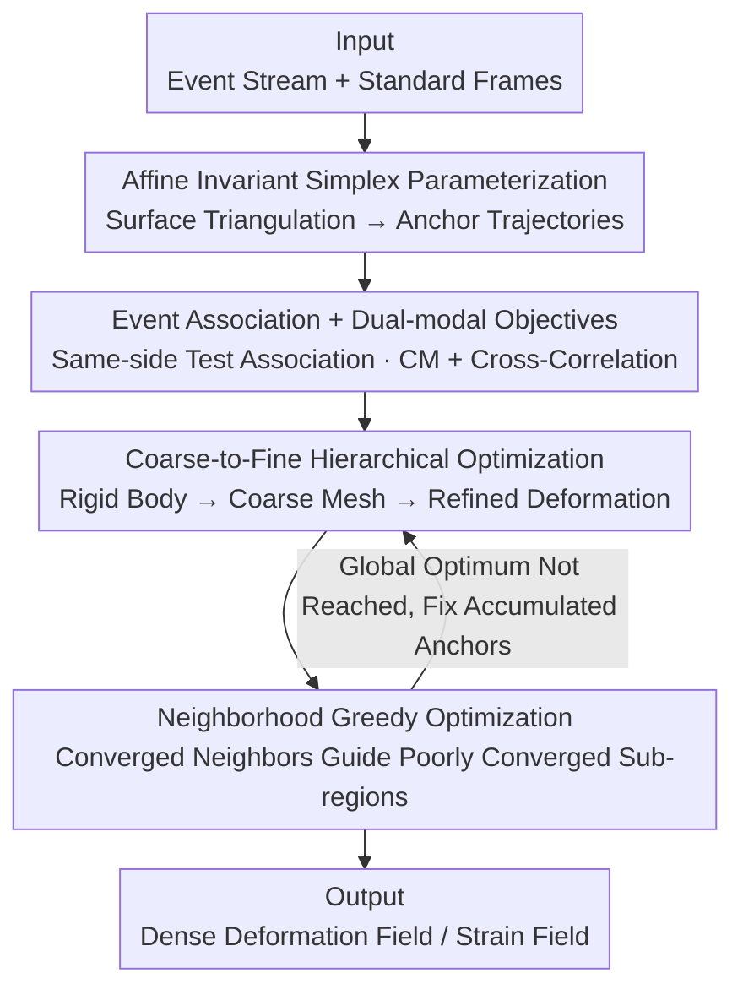

# Event-based Visual Deformation Measurement

**Conference**: CVPR 2026  
**Paper**: [CVF Open Access](https://openaccess.thecvf.com/content/CVPR2026/html/Wu_Event-based_Visual_Deformation_Measurement_CVPR_2026_paper.html)  
**Code**: https://wyl-ovo.github.io/EVDM/ (Project Page)  
**Area**: Event Camera / Deformation Measurement / Dense Tracking  
**Keywords**: Event Camera, Visual Deformation Measurement, Affine Invariant, Contrast Maximization, Dense Optical Flow Tracking

## TL;DR
This paper proposes an event-frame fusion visual deformation measurement (VDM) system. It utilizes event cameras to provide temporally dense motion cues and standard frames to provide spatially dense accurate constraints. Through an Affine Invariant Simplex (AIS) framework, the high-dimensional deformation field is partitioned into low-parameter triangular sub-regions. Combined with a neighborhood greedy optimization to suppress long-range error accumulation, the system achieves a SOTA survival rate 1.6 times higher than existing methods under large deformations of 100+ pixels, while consuming only 18.9% of the storage/computing power required by high-speed camera solutions.

## Background & Motivation
**Background**: The goal of Visual Deformation Measurement (VDM) is to recover the dense deformation field of an object surface from camera observations—specifically, the displacement vector $u(X,t)$ of each surface material point relative to its initial undeformed state. Traditional approaches are based on Digital Image Correlation (DIC-like, e.g., OpenCorr), using correlation criteria to find the best correspondence in image sub-regions before and after deformation.

**Limitations of Prior Work**: Rigid body motion has only 6 degrees of freedom (DoF), whereas deformable surfaces have extremely high DoF as surface points can move almost independently. This poses two major challenges for pure image-based methods: (i) the correspondence search space is too large to handle; (ii) texture similarity and geometric changes caused by deformation make feature matching unreliable. To constrain the search space, existing methods rely on the "minimal inter-frame motion" assumption of image-based methods, forcing the use of expensive high-speed cameras. This results in processing massive redundant frames, leading to exorbitant storage and computational costs, which cannot support high-dynamic scenes such as large deformations or rapid ego-motion.

**Key Challenge**: A single visual modality cannot simultaneously satisfy "temporal density (tracking fast motion)" and "spatial density with low noise (accurate measurement)". High-speed frames provide spatial density but incur redundancy costs; event cameras are temporally dense and storage-efficient but spatially sparse and noisy, leading to severe motion estimation ambiguity in pixel-level Contrast Maximization (CM).

**Goal**: Construct an event-frame hybrid system that leverages the high temporal resolution of events to track large displacements/ego-motion, resolves the dense field ambiguity caused by sparse event noise, and addresses error accumulation in long-range dense tracking.

**Key Insight**: The authors revisit the prior of solid elasticity modeling—deformation is locally continuous and approximately affine. If the surface is partitioned into sufficiently small triangular sub-regions, the interior of each block can be losslessly described by an affine transformation, thereby reducing the "high-dimensional dense field" into a low-parameter problem of "few anchor point trajectories."

**Core Idea**: Use "Affine Invariant Simplex parameterization" to reduce the dimensionality of the dense deformation field into sparse anchor trajectories (low parameterization suppressing event ambiguity), and then use "neighborhood greedy optimization" to let converged sub-regions guide non-converged neighbors (suppressing long-range error accumulation).

## Method

### Overall Architecture
The system inputs are time-aligned event streams and standard frames, and the output is the dense deformation field of the object surface evolving over time (and the derived von Mises strain field). The entire pipeline can be understood as "reducing the field dimensionality first, then solving anchor trajectories using dual-modality joint optimization, and finally refining and correcting errors hierarchically": the AIS framework first meshes the surface into triangular sub-regions, representing the field as vertex (anchor) trajectories $\{Tr_j(t)\}$; during optimization, events are associated with their respective sub-regions and displacements are calculated via affine interpolation. The event side targets Contrast Maximization (CM), while the image side targets Zero-mean Normalized Cross-Correlation (ZNCC/CC); the solution employs a coarse-to-fine hierarchical strategy (rigid body → coarse mesh → refinement); finally, a neighborhood greedy strategy detects sub-regions with poor convergence and guides them using converged neighbors to approach a global optimum.

### Key Designs

**1. Affine Invariant Simplex (AIS) Framework: Reducing High-dimensional Dense Fields to Sparse Anchor Trajectories**

Addressing the core conflict of "high DoF dense fields + sparse event noise leading to CM ambiguity," the authors decompose the object surface into $N$ triangular sub-regions $T_k$. They assume the internal deformation of each block is affine: $x(X)=X+u(X)=A_k X + b_k,\ \forall X\in T_k$, where $A_k\in\mathbb{R}^{2\times2}$ is the local deformation gradient matrix and $b_k\in\mathbb{R}^2$ is the translation. The key is the affine invariant property: for a triangular sub-region $\sigma=\mathrm{conv}\{X_1,X_2,X_3\}$, the barycentric interpolation operator $I[f](X)=\sum_{i=1}^3\lambda_i(X)f(X_i)$ (subject to $\sum\lambda_i=1$) satisfies the reproduction property $I[f]=f$ for any affine function $f(X)=AX+b$. This means the affine deformation of each sub-region can be **losslessly described** by the motion of its three vertices—thus, the optimization variables of the dense field collapse from "per-point displacements" to "vertex (anchor) trajectories $\{Tr_j(t)\}$." This step simultaneously achieves two goals: reducing the difficulty of solving high-dimensional deformation fields and suppressing motion ambiguity from sparse event data via low parameterization. The number of sub-regions $S_N$ controls the balance between non-linear expressiveness and optimization difficulty (later addressed by coarse-to-fine strategy).

**2. Event Association + Affine Invariant Interpolation + Dual-mode Objectives: Balancing Sparse Events and Precise Frames**

Parametrization alone is insufficient; during optimization, "which sub-region a single event belongs to and how much displacement it contributes" is unknown. Prior work (e.g., per-event KNN to find nearest anchors for averaged displacement) is slow and introduces significant errors due to average interpolation. This work adopts **same-side test association**: given event coordinates $X_e$ and triangle vertex positions $Tr_j(t_i)$ at the trigger time, a determinant $C_j$ is calculated for each edge. When $\mathrm{sign}(C_1)=\mathrm{sign}(C_2)=\mathrm{sign}(C_3)$, the event is determined to fall within that sub-region, and the barycentric weights are solved via $X_e=\sum_{k=1}^3\lambda_k Tr_j(t_i)$ (with $\sum\lambda_k=1$)—this is a geometrically precise association that avoids KNN inefficiency and interpolation errors. After association, events are warped to a reference time $t_{\text{ref}}$ to form Image of Warped Events (IWE), targeting **Contrast Maximization**: $f_{CM}(t_{\text{ref}})=\frac{\sum_{\boldsymbol{x}}T_{+1}^2+T_{-1}^2}{\sum_{\boldsymbol{x}}[n(\boldsymbol{x}')>0]+\epsilon}$. Simultaneously, since sparse events lose precise grayscale information, frame-side constraints are introduced: pixel intensities are sampled uniformly using barycentric coordinates within each sub-region, using ZNCC $f_{CC}(S_1,S_2)=\frac{\mathrm{Cov}(S_1,S_2)}{\sigma_{S_1}\sigma_{S_2}}$ to align the current frame $I_i$ with the previous frame $I_{i-1}$ and initial frame $I_0$. Events handle temporally dense motion cues, while frames handle spatially dense precision.

**3. Coarse-to-Fine Hierarchical Optimization: Capturing Large Displacements then Refining**

Directly optimizing all high-dimensional deformation parameters on the finest mesh is slow, prone to local optima, and fails to capture large displacements. The authors use a coarse-to-fine hierarchical approach: first estimating the **rigid ego-motion** parameters (lowest parameter count), then performing initial deformation estimation on **coarse sub-regions**, and finally refining through iterative subdivision—the subdivision rule splits a triangle into four smaller ones using edge midpoints $M_i=\frac{Tr_i+Tr_{(i\bmod 3)+1}}{2}$. Events are warped twice during optimization: Warp 1 warps events from adjacent bins to each timestamp to generate $M$-channel IWE for short-term motion; Warp 2 warps all events in the time window to the frame time to generate 2-channel IWE for global continuity. The total objective is $f_{total}=\lambda_1 f_{CM}^{Warp1}+\lambda_1 f_{CM}^{Warp2}+\lambda_2 f_{CC}$, with coefficients varying across iterations. This handles large displacements using low-parameter models (rigid + coarse mesh) to provide reliable initialization for subsequent refined estimation.

**4. Neighborhood Greedy Optimization: Guiding Poorly Converged Neighbors**

Long-range dense tracking requires many iterations, where errors in a few mismatched sub-regions accumulate and amplify, eventually degrading global tracking. However, global joint optimization of all sub-regions is extremely slow due to high dimensionality. The authors apply a greedy strategy based on the deformation field continuity prior: they first evaluate the convergence quality of each sub-region $\Omega_j$—calculating the ratio $P_j=\frac{1}{N}\sum_i \mathbb{1}(\mathrm{SE}(i)>k\cdot\mathrm{MSE})$ of sampled pixels where the squared error SE significantly deviates from the Mean Squared Error MSE. If $P_j>\tau$, it is judged as non-converged ($k,\tau$ are hyperparameters). Then, anchors of converged sub-regions are **fixed**, and a strain continuity constraint $f_S=\frac{1}{|E_T|}\sum_{(i,j)\in E_T}\|S_i-S_j\|_F^2$ is added (where $S_i$ is the von Mises strain at anchor $i$ and $E_T$ is the set of edges), using good neighbors to guide poor ones. After each round, convergence is re-evaluated, and anchors are greedily accumulated and fixed until global convergence. This strategy improves long-range survival rates by preventing error back-propagation and significantly reduces convergence time via early stopping criteria.

### Loss & Training
This method is optimization-based (model-based) rather than learning-based: anchor trajectories are solved iteratively forward per time window using multi-scale search + Adam optimizer within the PyTorch framework on an NVIDIA RTX 4090 (24GB). Events between two consecutive frames $E_{k,k+1}$ are divided into $M$ non-overlapping bins with equal event counts, assuming linear motion within bins to optimize trajectories over $M+1$ timestamps.

## Key Experimental Results

### Main Results
The authors built an event-frame time-aligned VDM benchmark using a 50:50 beam splitter to co-locate an event camera (Prophesee EVK4) and a grayscale camera, triggered synchronously by a 210Hz square wave. 120+ real sequences were collected (compression/tension/bending/cracking, displacements from <20 to 100+ pixels), with ground truth obtained from high-speed video (210fps) processed by VDM algorithms and manually refined. The table compares inputs of event + 5fps frames (EPE/SEPE lower is better, survival rate higher is better):

| Deformation Scale | Metric | Ours | CoTrackerV3(SOTA) | OpenCorr+TimeLens |
|--------|------|------|------|------|
| 5-20 px | EPE↓ / Survival↑ | **0.155** / 99.4% | 0.671 / 99.0% | 0.227 / 99.5% |
| 20-100 px | EPE↓ / Survival↑ | **0.330** / **92.4%** | 2.138 / 91.7% | 0.819 / 89.8% |
| 100+ px | EPE↓ / SEPE↓ / Survival↑ | **3.204** / **0.813** / **65.7%** | 8.763 / 2.150 / 45.2% | 3.830 / 1.201 / 41.3% |

Large deformation (100+ px) is the differentiator: SOTA CoTrackerV3's survival rate is only 45.2%, while this method achieves 65.7% (approx. 1.6×) with significantly better EPE/SEPE. Image-based methods lag behind even with TimeLens frame interpolation. Pure event optical flow (E-RAFT) fails across all scales (survival rates in single digits to 21.7%), confirming that dense deformation tracking using only events is not feasible.

### Ablation Study

Storage/frame rate ablation (100+ px test set, comparing with high-speed camera solutions):

| Configuration | Data Vol. (Frames+Events) | EPE↓ | SEPE↓ | Survival↑ |
|------|------|------|------|------|
| Ours Event+1fps | 5.6Mb + 78.3Mb | 4.710 | 2.533 | 32.6% |
| Ours Event+5fps | 28.1Mb + 78.3Mb | 3.204 | 0.813 | 65.7% |
| Ours Event+20fps | 112.6Mb + 78.3Mb | 1.618 | 0.573 | 71.2% |
| OpenCorr Frame-only 100fps | 562.5Mb | 3.317 | 0.825 | 64.3% |
| OpenCorr Frame-only 210fps | 1181.3Mb | — | — | GT Calc |

Ours with 5fps frames (28.1+78.3≈106Mb) achieves accuracy/survival rates comparable to OpenCorr 100fps (562.5Mb), utilizing only 18.9% of the storage (and only 13% relative to 210fps cameras).

Optimization strategy ablation:

| Strategy | Survival↑ | Avg. Conv. Time↓ |
|------|---------|---------------|
| Neighborhood Greedy (Full) | 87.1% | 7.2s |
| Vanilla Optimization | 49.0% | 26.5s |

> Note: There is a slight discrepancy in survival rate figures between the text and Table 3 in the original paper. The text states neighborhood greedy improves survival from 49.0% to 87.1%, while Table 3 lists 65.7% vs 39.0%. Convergence times (7.2s vs 26.5s, ~3× acceleration) are consistent.

### Key Findings
- **Survival rate is the true differentiator**: In small deformations, all methods have EPE <1 and survival >95%. Differences emerge in large displacement zones—where event high temporal resolution is crucial.
- **Affine invariant interpolation outperforms general interpolation**: Compared to nearest neighbor, mean, IDW, and Gaussian weighted interpolation, the proposed affine invariant barycentric interpolation yields better accuracy and survival rates across all scales, indicating geometrically precise association is key to eliminating error sources.
- **Neighborhood greedy improves both survival and speed**: Preventing error back-propagation significantly increases long-range survival, while the convergence quality early-stopping criterion reduces average convergence time to approx. 1/3.
- **Frame rate is an accuracy-cost knob**: From 1fps to 20fps, the survival rate increases monotonically from 32.6% to 71.2%, with 5fps serving as a cost-performance sweet spot.

## Highlights & Insights
- **Ingenuity in dimensionality reduction**: Using affine invariance to losslessly compress "point-wise dense displacement" into "triangular vertex trajectories" solves both high-dimensional optimization difficulty and event ambiguity—a prime example of translating solid elasticity continuity priors into optimizable parameterizations.
- **Same-side test + Barycentric interpolation replacing KNN**: Using geometric predicates (three determinants of the same sign) for event-subregion association is both fast and precise, avoiding KNN inefficiency and interpolation errors. This is a transferable "point-to-grid association" trick.
- **Greedy fixing + Strain continuity constraint**: Formulating "converged neighbors guiding poor neighbors" as an explicit strain regularization $f_S$ introduces physical continuity into dense tracking to combat error accumulation, applicable to any dense estimation task with spatial continuity.
- **Storage efficiency**: Achieving comparable accuracy with only 18.9% storage directly addresses the non-scalability of high-speed camera solutions, serving as a powerful evidence for the "event cameras reduce redundancy" value proposition.

## Limitations & Future Work
- The authors acknowledge the method's reliance on spatial continuity and brightness constancy assumptions. When **topological changes** occur (e.g., cracking), pseudo-strains are introduced. Performance degrades in **specular reflection** scenarios.
- The method is a per-sequence online optimization (seconds on a 4090), not real-time. There are numerous hyperparameters ($k, \tau, S_N, \lambda$), and sensitivity analysis for these was not reported. It currently covers 2D surface deformation, not 3D.
- Future directions: Exploring 3D event VDM; using learning-based priors to initialize anchor trajectories for speed; and introducing explicit discontinuity/illumination modeling for cracking/specular reflection to alleviate pseudo-strains.

## Related Work & Insights
- **vs OpenCorr / StrainNet (Image-based VDM)**: These rely on correlation matching and small inter-frame motion assumptions, requiring high-speed cameras. Ours uses events for temporal resolution, requiring only 5fps + events, saving an order of magnitude in storage while remaining stable under large deformations.
- **vs E-RAFT (Event-based Optical Flow)**: Pure event-based short-term flow fails completely in dense large-deformation tracking (survival rates in single digits). Ours succeeds by adding frame-side cross-correlation constraints and low parameterization.
- **vs CoTrackerV3 (Long-range Point Tracking)**: A current SOTA baseline, sufficient for small deformations but only 45.2% survival under large displacements. Ours achieves 65.7% via AIS reduction and neighborhood greedy optimization, demonstrating that physical continuity priors are better suited for deformation measurement than generic point tracking.
- **vs Existing CM Frameworks (Global low-param / local smoothing)**: Global models fail for deformation, while smoothing constraints suppress detail. Ours finds a balance between "low ambiguity" and "preserving deformation details" via simplex local low parameterization.

## Rating
- Novelty: ⭐⭐⭐⭐⭐ First event-frame fusion dense VDM system. AIS reduction and neighborhood greedy optimization are both effective and mutually supportive.
- Experimental Thoroughness: ⭐⭐⭐⭐ Self-built 120+ sequence benchmark covering multiple scales/scenarios, comprehensive ablation; however, minor numerical inconsistencies between text/tables and missing hyperparameter analysis noted.
- Writing Quality: ⭐⭐⭐⭐ Clear chain of motivation-conflict-method, with complete formulas; minor瑕疵 in symbol/numerical consistency.
- Value: ⭐⭐⭐⭐⭐ Substituting high-speed camera solutions with 18.9% storage has direct value for non-contact measurement in structural monitoring, mechanics, and biomechanics.

<!-- RELATED:START -->

## Related Papers

- [\[CVPR 2026\] Geometric-Photometric Event-based 3D Gaussian Ray Tracing](geometric-photometric_event-based_3d_gaussian_ray_tracing.md)
- [\[CVPR 2026\] Event Structural Valley: A Unified Theoretical and Practical Framework for Event Camera Autofocus](event_structural_valley_a_unified_theoretical_and_practical_framework_for_event_.md)
- [\[CVPR 2026\] Deep Feature Deformation Weights](deep_feature_deformation_weights.md)
- [\[CVPR 2026\] Moving Border Ownership for Event-based Motion Segmentation](moving_border_ownership_for_event-based_motion_segmentation.md)
- [\[CVPR 2026\] Event Stream Filtering via Probability Flux Estimation](event_stream_filtering_via_probability_flux_estimation.md)

<!-- RELATED:END -->
