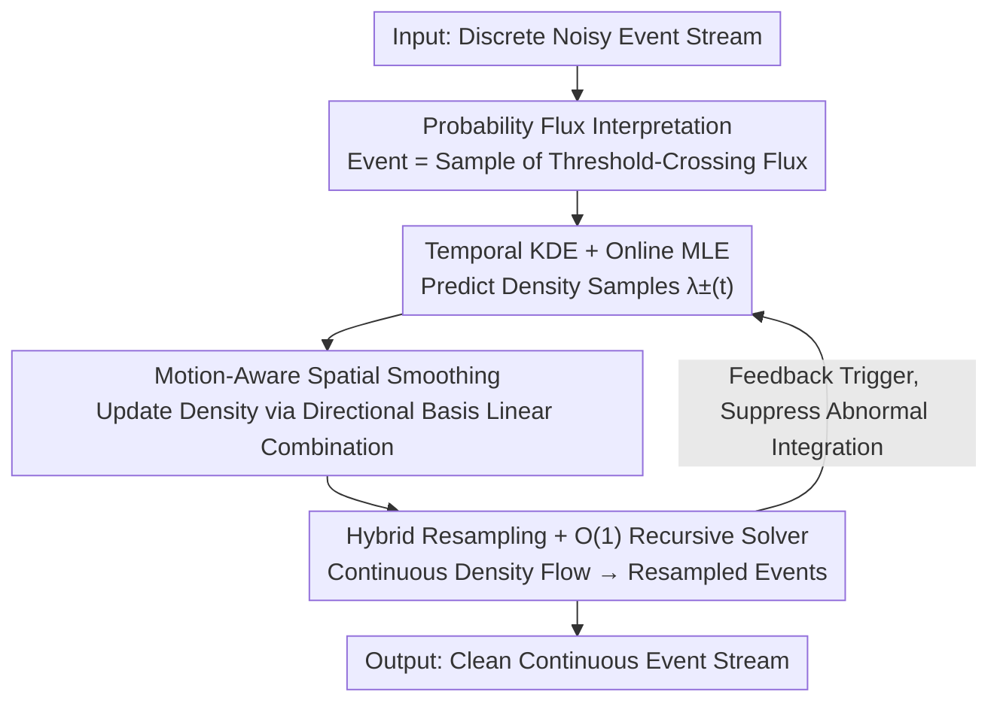

# Event Stream Filtering via Probability Flux Estimation

**Conference**: CVPR 2026  
**Paper**: [CVF Open Access](https://openaccess.thecvf.com/content/CVPR2026/html/Chen_Event_Stream_Filtering_via_Probability_Flux_Estimation_CVPR_2026_paper.html)  
**Code**: No open-source link found  
**Area**: Event Camera / Signal Processing / Low-level Vision  
**Keywords**: Event Camera, Event Denoising, Probability Flux, Stochastic Differential Equation, Real-time Filtering  

## TL;DR
This paper reinterprets the event camera imaging process as a "stochastic process of log-irradiance trajectories crossing contrast thresholds," where events are samples of "probability flux" leaking at the thresholds. Accordingly, a generative filter, EDFilter, is proposed. It utilizes temporal kernel density estimation + motion-aware spatial smoothing + asynchronous resampling to reconstruct a clean, continuous, and physically interpretable event stream with $O(1)$ real-time complexity.

## Background & Motivation
**Background**: Event cameras are bio-inspired asynchronous vision sensors where each pixel independently outputs polarized events $(t_i, x, y, p_i)$ when brightness changes exceed a contrast threshold, achieving microsecond-level temporal resolution. However, this "threshold-triggered" mechanism amplifies thermal noise within the circuits, necessitating filtering for the resulting noisy event streams.

**Limitations of Prior Work**: Most existing event filters are **discriminative**. Density-based methods rely on spatio-temporal neighborhood counting, motion-based methods fit local planes, and learning-based methods use MLP/CNN/Transformer architectures to classify each event as "signal or noise." These methods can only **delete events, not correct or regenerate them**, often resulting in outputs sparser than the raw input. A few generative approaches (e.g., EventZoom) stack events into synchronous frames for denoising via 3D-UNet, which sacrifices the critical microsecond precision of event cameras.

**Key Challenge**: The paper identifies that an event stream encodes **two types of complementary information**: ① **State Information**—discrete jumps in log-irradiance at event timestamps $I_{t_i}-I_{t_{i-1}}=p_i C$; ② **Process Information**—irradiance trajectories between adjacent events constrained by the contrast inequality $\sup_{t\in[t_{i-1},t_i)}|I_t-I_{t_{i-1}}|<C$. Classical signal processing excels at modeling continuous state variables but struggles with discrete, asynchronous polarities and cannot imposing the inequality constraint on latent irradiance paths. Consequently, existing filters **utilize only state information while discarding process information**, limiting the reconstruction of continuous irradiance dynamics.

**Key Insight**: The authors re-examine event generation from a stochastic process perspective: an event is triggered not based on past events, but on **how fast the current brightness flows toward the threshold**. This directional trend of irradiance trajectories toward a boundary is physically defined as **probability flux (probability current)**.

**Core Idea**: Treat the event stream as "direct samples of threshold-crossing probability flux leaking at the boundaries." Estimate this flux from discrete noisy events and then **resample** a clean, continuous event stream—modeling both state and process information within a unified generative framework.

## Method

### Overall Architecture
EDFilter theoretically proves that both event polarity and inter-event interval distributions are determined by the probability flux at contrast boundaries. It transforms the "filtering" problem into "estimating the time-varying Event Density Flow (EDF) $\lambda_\pm(t)$." Technically, the framework consists of three **serial modules** for **prediction, update, and reconstruction**: ① Temporal Kernel Density Estimation (KDE) is performed independently for each pixel, using online Maximum Likelihood Estimation (MLE) for kernel selection to obtain predicted density samples; ② Neighboring density samples are fused using motion-aware spatial filtering for refined, sparsity-preserving estimation; ③ The continuous density flow is interpolated and resampled into clean output events. Outputs are fed back to the prediction module in an "application-dependent" manner to suppress abnormal integral drift. All components are designed with $O(1)$ constant complexity for online operation at the sensor timescale.

### Key Designs

**1. Probability Flux Interpretation: Modeling Event Generation as a Threshold-Crossing Stochastic Process**

This serves as the theoretical foundation. The authors model log-irradiance $I_t$ using a Stochastic Differential Equation (SDE) with absorbing boundaries: $dI_t=\mu(I_t,t)\,dt+\sigma(I_t,t)\,dW_t$, where drift $\mu$ represents clean scene dynamics and diffusion $\sigma$ represents thermal noise. When $I_t$ exits the interval $[-C,C]$, an event is triggered at the boundary, with polarity determined by the exit side. The Fokker-Planck equation corresponding to this SDE describes the evolution of density $\rho(I,t)$, with absorbing conditions $\rho(\pm C,t)=0$. Defining the probability flux density $J(I,t)=\mu(I,t)-\tfrac{1}{2}\partial_I[\sigma^2(I,t)\rho(I,t)]$, which satisfies the continuity equation $\partial_t\rho+\nabla\cdot J=0$, the outflow flux $p_\pm(t)=\mp J(\pm C,t)$ at the boundaries represents the instantaneous ON/OFF event density.

Two key conclusions are derived: the distribution of event trigger times $P(t_s\le t)=1-\int_{-C}^{C}\rho(I,t)\,dI=\int_0^t[p_+(\tau)+p_-(\tau)]\,d\tau$, and the conditional distribution of polarity $P(p=\pm1\mid t)=p_\pm(t)/(p_+(t)+p_-(t))$. This mathematically confirms that **inter-event intervals and polarities are uniquely determined by boundary flux**. Since FP equations generally lack closed-form solutions, the authors define the **Event Density Flow (EDF)** using the failure rate:

$$\lambda_\pm(t)=\frac{p_\pm(t)}{1-\int_0^t[p_+(\tau)+p_-(\tau)]\,d\tau}$$

$\lambda_\pm(t)$ is an unconstrained non-negative real-valued function representing the instantaneous expected event rate, which can be estimated directly from discrete events without solving the full diffusion equation.

**2. Temporal KDE + Online MLE: Predicting Continuous Density from Discrete Events**

To provide continuous density predictions at any timestamp, temporal KDE is performed independently per pixel. A rectangular kernel $\phi(t)$ (height $\alpha$, bandwidth $h$) accumulates contributions from sequential events into a predicted density $\psi(t)=\sum_{t_i<t}p_i\phi(t-t_i)$, which is then mapped by sign to EDF: when $\psi(t)>0$, $(\lambda_+,\lambda_-)=(\psi(t),\beta_-)$, and vice versa, where $\beta_\pm\ge0$ are constant false event rates optimized jointly. Unlike discriminative filters, **noisy events are not removed by hard thresholds but participate in continuous scene modeling**.

Kernel parameters are determined online via likelihood maximization. Given $N_e$ events in $(s,t]$, the log-likelihood is $\ln L(s,t)=\sum_{i=1}^{N_e}\ln\lambda_{p_i}(t_i)-\int_s^t[\lambda_+(t)+\lambda_-(t)]\,dt$. The first term is state likelihood and the second is process likelihood—integrating **both state and process information into a single objective**. To obtain a closed-form solution, a prior $f(\alpha,\beta_\pm,h)\propto\tfrac{\gamma}{h^2}\exp(-\gamma/h)$ is added (where $\gamma$ is the expected inter-event interval), yielding the predicted EDF $\bar\lambda_\pm(t)$ via MAP. Bandwidth $h$ is selected from discrete candidates via a look-up table (LUT) for $O(1)$ efficiency.

**3. Motion-Aware Spatial Local Smoothing: Aligning Noisy Densities via Directional Bases**

Predicted $\bar\lambda_\pm(t)$ may lack structural consistency due to noise or threshold mismatch. Since spatial EDF patterns are **directional and sparse** (corresponding to moving edges), isotropic filtering would blur them. The authors apply a directional motion prior on a $3\times3$ neighborhood, representing the smoothed EDF as a linear combination of 4 directional bases $B_1,\dots,B_4$ (representing $0^\circ, 45^\circ, 90^\circ, 135^\circ$ motion patterns). Optimal coefficients are found by minimizing the $q$-norm reconstruction error:

$$\{k^*_{\pm,i}(t)\}_{i=1}^4=\arg\min_{\{k_{\pm,i}(t)\}}\big\|\Lambda_\pm(t)-\bar\Lambda_\pm(t)\big\|_q,\quad 1\le q\le2$$

This update is convex: $q=2$ reduces to $3\times3$ convolution, while $q=1$ enables local linear programming for sparse solutions, both in constant time.

**4. Hybrid Resampling + O(1) Recursive Solver: Continuous Reconstruction and Real-time Performance**

Finally, clean events are resampled from the continuous EDF $\lambda^*_\pm(t,x,y)$. A **hybrid sampling** strategy is used: events trigger asynchronous local updates ($3\times3$ neighborhood), while all pixels undergo global updates every $T_s$ seconds to balance transient dynamics and prevent integral drift. Using zero-order hold interpolation, the continuous EDF is treated as a piecewise homogeneous Poisson process for resampling. The pipeline is designed for $O(1)$ complexity: temporal prediction uses an LTI state-space form $\tfrac{d\psi}{dt}=\alpha(E(t)-E(t-h))$, and event sampling follows an improved thinning algorithm for piecewise constant rates.

### Loss & Training
EDFilter is a **training-free generative signal processing framework** without network weights. All parameters are determined by online MLE/MAP estimation. Default settings: Observation window $100\text{ms}$, $\gamma=4\text{ms}$.

## Key Experimental Results

### Main Results
On the self-collected RED dataset (with microsecond-level ground truth irradiance), EDFilter achieves optimal results across most sequences. Below is the NMSE (lower is better, DVS=DAVIS346 / EVK=EVK4):

| Method | circle1 DVS | circle1 EVK | spiral1 DVS | spiral1 EVK | text EVK |
|------|------|------|------|------|------|
| Raw | 0.106 | 0.390 | 0.137 | 0.139 | 0.052 |
| EventZoom | 0.223 | 0.338 | 0.331 | 0.108 | 0.227 |
| EvFlow | 0.285 | 0.504 | 0.529 | 0.312 | 0.142 |
| MLPF | 0.104 | 0.226 | 0.250 | 0.094 | 0.049 |
| **Ours** | **0.096** | **0.193** | **0.121** | **0.086** | **0.038** |

Evaluated on the E-MLB real noise dataset using the non-reference metric ESR (higher is better), EDFilter leads almost entirely across various noise levels (Day/Night):

| Method | ND1 D/N | ND4 D/N | ND16 D/N | ND64 D/N |
|------|------|------|------|------|
| EventZoom | 1.00/1.06 | 0.99/1.01 | 1.00/1.01 | 0.97/0.99 |
| MLPF | 0.85/0.93 | 0.89/0.93 | 0.85/0.91 | 0.84/0.91 |
| **Ours** | **1.02/1.07** | **1.02/1.03** | **1.02/1.00** | **1.00/0.99** |

Runtime (346×260, single core R9-7945HX): EDFilter latency is only **4.99 µs**, approximately 51% lower than MLPF (7.55 µs), and much lower than EventZoom (1.21 s) which requires frame accumulation.

### Ablation Study
Key conclusions from ablation:
- **Temporal**: EDF MAP maximization adapts to scene dynamics, significantly outperforming Poisson/Gaussian models in motion perception.
- **Spatial**: $L_1$ preserves motion accuracy (lower ATE), while $L_2$ better preserves irradiance fidelity (lower NMSE).
- **Sampling**: Hybrid strategy provides the best compromise between ATE and NMSE.

### Key Findings
- **Tension between State and Process Information**: EvFlow preserves only the most significant events on motion trajectories, aiding coarse tracking but severely harming irradiance reconstruction. EDFilter's unified modeling via probability flux bridges this gap, excelling in both denoising and tracking.
- **Downstream Improvement**: Inserting EDFilter reduces tracking error for event-based SLAM (ESVO) and improves video reconstruction (E2VID) across PSNR, SSIM, and LPIPS metrics.
- **Physical Interpretability $\ne$ Slowness**: The signal processing route outperforms the learning-based MLPF in latency, proving that "physically grounded" and "real-time" can coincide.

## Highlights & Insights
- **Reframing Denoising as Generation**: Instead of asking "is this event noise," it estimates a continuous EDF and resamples—allowing outputs to be denser and more continuous than inputs.
- **Probability Flux as a Physical Bridge**: Uses SDE + Fokker-Planck to unify discrete asynchronous polarities with continuous irradiance, proving boundary flux $p_\pm(t)$ uniquely determines both event intervals and polarities.
- **Adjustable Sparsity-Smoothing Trade-off**: The spatial module can toggle between "motion preservation" and "irradiance preservation" by switching $q=1/2$, while maintaining $O(1)$ complexity.
- **Filling the GAP with RED Dataset**: Developed a benchmark with microsecond-level ground truth using high-speed rotational encoders, enabling quantitative evaluation of per-event temporal fidelity.

## Limitations & Future Work
- **Per-pixel Independence Assumption**: Theoretical derivation focuses on individual pixels; multi-pixel spatial coupling is only briefly touched in supplementary materials.
- **Manual Priors and Hyperparameters**: Kernels, $\gamma$, and LUT ranges are manually set; systematic analysis of robustness across different sensors/lighting is needed.
- **Ground Truth Dependence**: RED's ground truth relies on controlled rotating patterns; obtaining ground truth irradiance in complex natural scenes remains challenging.

## Related Work & Insights
- **vs. Discriminative Filters (Ynoise / EvFlow / MLPF)**: While they "delete events" via spatio-temporal neighbors or classification, Ours estimates a density flow and **regenerates** clean events for both denoising and completion.
- **vs. Generative Frame Methods (EventZoom)**: EDFilter operates entirely asynchronously with zero event frames, achieving orders of magnitude lower latency and higher temporal fidelity.
- **vs. Stochastic Diffusion in Event Simulation**: Existing work uses random diffusion for **forward simulation**; this paper takes the inverse route—**inferring** diffusion from observed events as boundary flux samples.

## Rating
- Novelty: ⭐⭐⭐⭐⭐ 
- Experimental Thoroughness: ⭐⭐⭐⭐ 
- Writing Quality: ⭐⭐⭐⭐ 
- Value: ⭐⭐⭐⭐⭐ 

<!-- RELATED:START -->

## Related Papers

- [\[CVPR 2026\] Event Structural Valley: A Unified Theoretical and Practical Framework for Event Camera Autofocus](event_structural_valley_a_unified_theoretical_and_practical_framework_for_event_.md)
- [\[CVPR 2026\] Event-based Visual Deformation Measurement](event-based_visual_deformation_measurement.md)
- [\[CVPR 2025\] Full-DoF Egomotion Estimation for Event Cameras Using Geometric Solvers](../../CVPR2025/others/full-dof_egomotion_estimation_for_event_cameras_using_geometric_solvers.md)
- [\[CVPR 2026\] Adaptive Spatial-Temporal Window: Unlocking the Potential of Event Cameras in Heterogeneous Velocity Scenarios](adaptive_spatial-temporal_window_unlocking_the_potential_of_event_cameras_in_het.md)
- [\[CVPR 2026\] NAF: Zero-Shot Feature Upsampling via Neighborhood Attention Filtering](naf_zero-shot_feature_upsampling_via_neighborhood_attention_filtering.md)

<!-- RELATED:END -->
