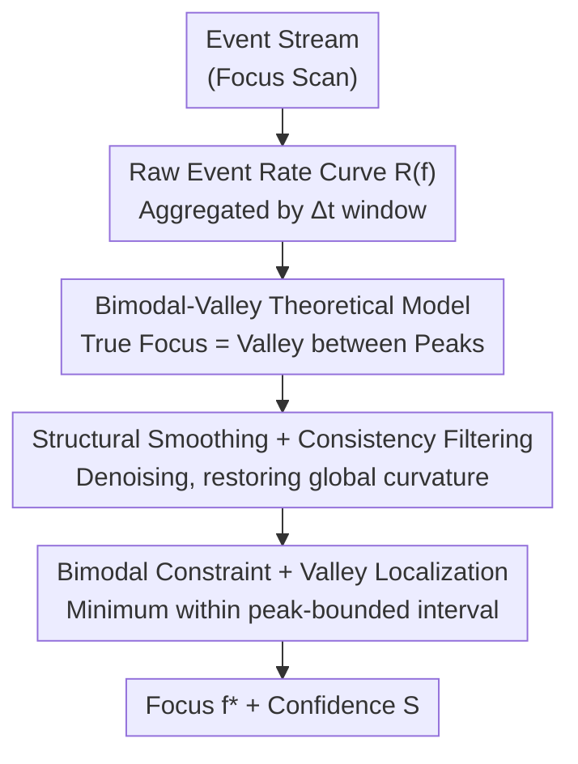

# Event Structural Valley: A Unified Theoretical and Practical Framework for Event Camera Autofocus

**Conference**: CVPR 2026  
**Paper**: [CVF Open Access](https://openaccess.thecvf.com/content/CVPR2026/html/Xiang_Event_Structural_Valley_A_Unified_Theoretical_and_Practical_Framework_for_CVPR_2026_paper.html)  
**Code**: Not disclosed  
**Area**: Event Camera / Neuromorphic Vision  
**Keywords**: Event Camera, Autofocus, Bimodal-Valley Structure, Event Rate Curve, Neuromorphic Vision  

## TL;DR
Starting from the physical mechanism of event generation, the paper refutes the traditional assumption that "event rate is highest at the sharpest focus." It proves that the true focus corresponds to a **valley (local minimum) between two peaks** on the event rate curve. Based on this, the ESVA framework is proposed, which requires no image reconstruction or supervision, reducing autofocus error to SOTA on multiple synthetic and real datasets.

## Background & Motivation

**Background**: In dynamic, low-light, and high dynamic range scenes, traditional frame-based camera autofocus (AF) often fails—motion blur and over/under-exposure destroy contrast metrics used for sharpness evaluation. Event cameras, with microsecond-level temporal resolution and asynchronous per-pixel brightness change detection, have become an attractive alternative for focus estimation in the event domain.

**Limitations of Prior Work**: Almost all event-based AF methods (e.g., ER+EGS) are built on an intuitive assumption—**sharp focus triggers the most events, so the Maximum Event Rate (MER) is the focus point**. However, the authors find via theory and experiments that at perfect focus, edges are extremely compact spatially, and only a few pixels can exceed the contrast threshold, resulting in the **fewest** events. MER methods thus tend to stop at a local peak before the true focus, causing systematic offsets.

**Key Challenge**: The relationship between event rate and defocus is fundamentally non-monotonic. Although subsequent works (e.g., polarity symmetry OLE, PBF) observed polarity reversal/symmetry near the focus, they interpreted these using heuristic cues in constrained scenarios (e.g., microscopic focus), **without revealing the physical root of the "valley" phenomenon**, nor could they guarantee generalization.

**Goal**: (1) **Analytically** derive how event rate changes with defocus from the event generation process; (2) Design a robust, interpretable AF algorithm that requires no image reconstruction.

**Key Insight**: Model "when a bundle of pixels is lit during a focus scan" as a function of the defocus scale $\sigma$. A focus scan causes $\sigma$ to first drop to 0 (sharpest) and then increase, naturally resulting in a "two peaks sandwiching one valley" shape for the event rate curve.

**Core Idea**: Replace "finding the peak" with "finding the valley of the event rate curve" to locate the focus, and use structural regularization to restore noisy curves to a clean bimodal-valley morphology.

## Method

### Overall Architecture

ESVA (Event Structural Valley-based Autofocus) aim to estimate the sharpest focus position **solely from events** given an asynchronous event stream output during a continuous focus scan. The workflow is a single-pass pipeline: first, aggregate the event stream into a raw event rate curve $R(f)$ using fixed time windows, which is often distorted by asynchronous noise, lighting flicker, and mechanical vibrations; then, pass it through three stages of structural regularization (Smoothing → Consistency Filtering → Bimodal Constraint) to refine it into a physically consistent bimodal-valley shape; finally, take the local minimum within the interval defined by the two peaks as the focus and calculate a confidence score to measure reliability. The algorithm is single-pass, free of iterative optimization, with $O(N)$ complexity ($N$ as focus samples), completing in milliseconds on a CPU.

### Key Designs

**1. Bimodal-Valley Theoretical Model: Deriving "Valley = Focus" from physical mechanisms rather than empirical observation**

This is the foundation of the paper, targeting the pain point that previous works only observed the phenomenon without explaining the cause. Event cameras output events when the change in log-intensity $L=\log I$ exceeds a contrast threshold $C$: $\Delta L(x,y,t)=L(x,y,t)-L(x,y,t-\delta t)\ge C$. The authors use a key approximation to translate "temporal threshold" into "spatial activation area": within short time windows of a focus scan, the dominant source of intensity change is the change in blur scale $\Delta\sigma$ caused by lens motion. Thus, the change for each pixel can be written in chain form $\Delta L(x;\sigma)\approx \frac{\partial L_\sigma(x)}{\partial\sigma}\,\Delta\sigma$. Substituting the trigger condition $|\Delta L|\ge C$ yields an equivalent spatial threshold $\theta(C)\coloneqq C/|\Delta\sigma|$, defining the **blur-related activation region**:

$$\Omega(\sigma)\coloneqq\Big\{x:\Big|\tfrac{\partial L_\sigma(x)}{\partial\sigma}\Big|\ge\theta(C)\Big\},\qquad R(\sigma)\propto \mathrm{meas}\big(\Omega(\sigma)\big).$$

This means the event rate is proportional to the number of lit pixels. The paper further provides two theoretical facts: **Proposition 1 (Single Feature Rise-Peak-Fall)**—For an isolated structure blurred by a Gaussian kernel, the activation area $\mathrm{meas}(\Omega(\sigma))$ is non-monotonic regarding $\sigma$: it rises for small $\sigma$, reaches a maximum at some $\sigma^\star>0$, then falls as $\sigma$ increases, and $\sigma=0$ is a strict local minimum; **Corollary 1 (Bimodal-Valley in One-way Scan)**—During a sweep across the focal plane, $\sigma$ first drops to 0 and then rises, so the observed $R(f)$ exhibits two main peaks $(P_1, P_2)$ separated by a valley, with the valley floor corresponding to the sharpest focus. AF is thus formalized as valley localization within the peak-bounded interval: $f^\star=\arg\min_{f\in[P_1,P_2]}R(f)$. This analytical model is the prerequisite for the method's validity and the reason it can generalize across datasets without image supervision.

**2. Structural Smoothing + Consistency Filtering: Restoring noisy $R(f)$ to physical consistency**

The theoretical valley is often submerged by asynchronous noise, flicker, or vibrations in real measurements; taking the minimum directly would fall into pseudo-valleys. This pair of modules "denoises without erasing true structures." **Structural Smoothing** uses a Gaussian kernel to perform weighted smoothing on the discrete event rate sequence: $\tilde R(f_i)=\frac{\sum_j R(f_j)\exp[-(f_i-f_j)^2/(2\sigma_s^2)]}{\sum_j \exp[-(f_i-f_j)^2/(2\sigma_s^2)]}$, where $\sigma_s$ controls the structural scale to suppress impulse noise while preserving global curvature. **Consistency Filtering** then enforces physical coherence between adjacent samples: for each focus step, a normalized jump $\delta_i=\frac{|\tilde R(f_i)-\tilde R(f_{i-1})|}{\max(\tilde R(f_{i-1}),\tilde R(f_{i+1}))}$ is calculated. Samples exceeding threshold $\tau_c$ are judged inconsistent and projected onto a local linear manifold $\hat R(f_i)=(1-\eta)\tilde R(f_i)+\frac{\eta}{2}[\tilde R(f_{i-1})+\tilde R(f_{i+1})]$, where $\eta$ controls filtering intensity. These steps eliminate isolated oscillations while retaining real structural transitions—a prerequisite for stable peak detection.

**3. Bimodal Constraint + Valley Localization + Confidence: Valley extraction within physical intervals with reliability metrics**

Even when smoothed, the global minimum might fall into pseudo-valleys at extreme defocus tails. The authors use physical meaning to lock the search range between "two main peaks." On the regularized curve $\hat R(f)$, standard peak detection (min interval + min prominence) yields a set of local maxima $\mathcal P$. The primary peak is $P_1=\arg\max_{f\in\mathcal P}\hat R(f)$; the secondary peak $P_2$ is selected from remaining candidates—requiring it to be sufficiently far from $P_1$ on the focus axis and not too close in amplitude, then taking the one with the maximum response. Limiting the search to $[P_1, P_2]$ filters out pseudo-minima from defocus noise, peak plateaus, or secondary oscillations. Within this range, $f^\star=\arg\min_{f\in[P_1,P_2]}\hat R(f)$ is the focus. Finally, a **structural confidence** $S=\frac{1}{2}[\hat R(P_1)+\hat R(P_2)]-\hat R(f^\star)$ is given, characterizing the drop between the valley and the peaks: a larger $S$ indicates a more distinct bimodal-valley structure and more reliable focus, serving as a failure warning indicator.

## Key Experimental Results

Four datasets: synthetic SYN (categorized by motion: Static / Small Shake / Huge Shake), real DAVIS (346×260), EVK4 (1280×1080), and the challenging EAD (including <1 Lux extreme dark scenes). Evaluation uses Mean Timestamp Error (ms) for SYN/DAVIS/EVK4 and Mean Distance Error (µm) for EAD. Baselines: ER+EGS, OLE'23, PBF, ELP. Parameters: $\Delta t=1$ ms, $\sigma_s=3$, $\tau_c=0.30$, $\eta=0.6$, pure CPU (i9 3.8 GHz).

### Main Results

| Dataset | Metric | ELP (Runner-up) | Ours (ESVA) | Gain |
|---------|--------|----------------|-------------|------|
| SYN (Avg.) | Timestamp Error↓ ms | 8.68 | **6.62** | 24% |
| DAVIS (Avg.) | Timestamp Error↓ ms | 2.04 | **1.30** | 36% |
| EVK4 (Avg.) | Timestamp Error↓ ms | 5.33 | **4.22** | 21% |
| EAD (Avg.) | Distance Error↓ µm | 475.87 | **65.38** | ~30% (vs. OLE'23 123.98) |

Note: ELP error on EAD is very high (475.87 µm); the closest competitor is OLE'23 (123.98 µm), leading to the claimed "~30% gain." ER+EGS (Maximum Event Rate method) lags significantly across almost all scenarios (e.g., 26.20 ms on DAVIS), confirming the systematic bias of the "peak-finding" hypothesis.

### Ablation Study

| Configuration | Key Phenomenon | Description |
|---------------|----------------|-------------|
| Full ESVA | Stable bimodal-valley, valley matches ground truth | Complete model |
| w/o Structural Smoothing | Error >43 ms | High-frequency oscillations destroy valley structure |
| w/o Consistency Filtering | Error worsens to 1057 µm (vs. 54 µm) | Instantaneous motion noise introduces pseudo-peaks |
| w/o Bimodal Constraint | False focus at extreme defocus | Loss of physical interval constraint |

### Key Findings

- **Complementary Regularization Modules**: Smoothing preserves structure, consistency filtering resists motion noise, and bimodal constraint locks the physical interval. Removing any leads to failure modes like burred valleys, pseudo-peaks, or tail minima.
- **Fastest Runtime**: Pure CPU performance achieves 1.43 ms for DAVIS and 1.68 ms for EVK4, one to two orders of magnitude faster than ER+EGS (62/417 ms) and ELP (564/3700 ms), as the pipeline is single-pass $O(N)$ with no iterative optimization or image reconstruction.
- **Dominance in Extremes**: In EAD dark/motion scenes where frame cameras barely capture sharp images, ESVA consistently locks the valley—verifying that "valley = focus" holds under real-world noise.

## Highlights & Insights

- **Counter-intuitive but Provable Core Discovery**: Flipping the industry-wide default "Max Event Rate = Focus" to "Event Rate Valley = Focus," derived analytically from event generation physics (activation area vs. blur scale) rather than just empirical observation. This "physics-first, algorithm-second" paradigm is robust.
- **1D Structural Variable as Focus Metric**: The method relies solely on the geometric shape of a single scalar curve (event rate), without touching polarity, reconstructing images, or needing supervision. Thus, it generalizes naturally across sensors and resolutions (direct transfer between DAVIS and EVK4).
- **Free Confidence Signal**: The drop between the valley and peaks is both a byproduct of the result and a reliability indicator. This logic can be migrated to any estimation task involving "finding extrema" for self-checking.

## Limitations & Future Work

- **Single Depth Layer Assumption**: The method assumes a dominant depth layer during the scan. Scenes with multiple competing depth layers may produce complex event rate structures (multiple valleys/peaks), where a simple 1D criterion might fail—authors acknowledge the need for extra spatial or task constraints.
- **Dependency on One-way, Through-focus Scans**: The theoretical bimodal-valley is based on a $\sigma$ trajectory falling to 0 then rising. If the scan does not cross the sharpest plane or if scan speed/step is improper, peak detection might fail to find two valid primary peaks. ⚠️ The paper does not detail degradation behavior for incomplete scans.
- **Manual Thresholds/Hyperparameters**: $\sigma_s$, $\tau_c$, $\eta$, and peak detection parameters are manually set. Sensitivity analysis is in the appendix, but the main text lacks adaptive strategies across datasets.
- **Extensible but Unexplored Directions**: Integration of polarity patterns, intensity changes, or spatial priors for joint focus estimation is mentioned but not implemented in this purely event-rate-based 1D version.

## Related Work & Insights

- **vs. ER+EGS (Maximum Event Rate + Golden Section Search)**: They assume sharp = most events; this paper proves that perfect focus results in compact edges and fewer events, explaining why ER+EGS systematically stops at local peaks before the true focus.
- **vs. OLE'23 / PBF (Polarity Symmetry / Balance)**: They use heuristic cues like polarity symmetry near focus, mostly in constrained settings like microscopic focus. These are easily disturbed by polarity imbalance and noise in natural/complex motion; this paper is more stable as it ignores polarity and uses only the event rate curve geometry.
- **vs. Event Focal Stacks / Self-supervised Reconstruction**: Those methods implicitly use the "event activity ↔ image sharpness" relationship to reconstruct all-in-focus images or estimate depth but do not perform explicit focus control. This paper models this relationship as an analytical physical model, providing a unified foundation for event-driven AF.

## Rating
- Novelty: ⭐⭐⭐⭐⭐ Refutes the industry default "peak-finding" assumption with an analytical "valley-finding" proof; a genuine cognitive flip.
- Experimental Thoroughness: ⭐⭐⭐⭐ Four datasets (synthetic+real+extreme low light), four competitors, full ablation and runtime comparisons. Comprehensive, though evaluation relies on a single metric family (timestamp/distance error).
- Writing Quality: ⭐⭐⭐⭐⭐ Clear theoretical derivation, logically progressive motivation, and excellent alignment between text and figures (bimodal-valley diagrams).
- Value: ⭐⭐⭐⭐ Simple, $O(N)$, millisecond-level CPU performance, unsupervised and reconstruction-free; a plug-and-play reliable baseline for event camera AF.

<!-- RELATED:START -->

## Related Papers

- [\[CVPR 2026\] Unsupervised 3D Motion Estimation Using Event Camera](unsupervised_3d_motion_estimation_using_event_camera.md)
- [\[CVPR 2026\] FastEventDGS: Deformable Gaussian Splatting for Fast Dynamic Scenes from a Single Event Camera](fasteventdgs_deformable_gaussian_splatting_for_fast_dynamic_scenes_from_a_single.md)
- [\[CVPR 2026\] Event-based Visual Deformation Measurement](event-based_visual_deformation_measurement.md)
- [\[CVPR 2026\] Moving Border Ownership for Event-based Motion Segmentation](moving_border_ownership_for_event-based_motion_segmentation.md)
- [\[CVPR 2026\] Event Stream Filtering via Probability Flux Estimation](event_stream_filtering_via_probability_flux_estimation.md)

<!-- RELATED:END -->
